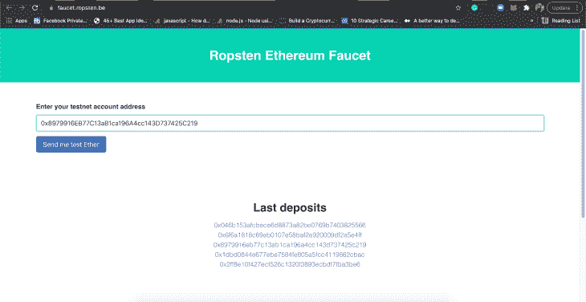
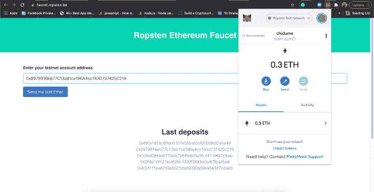
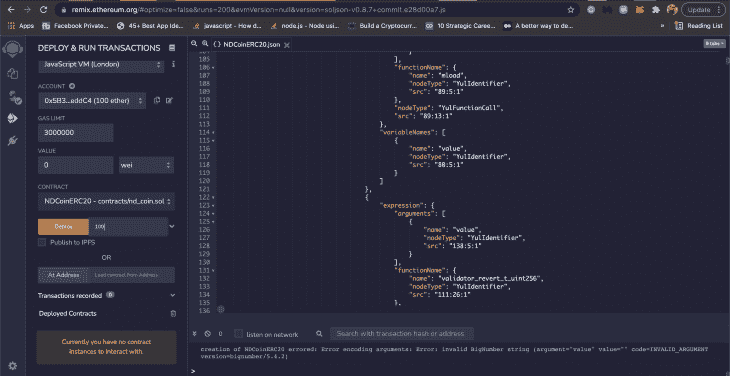
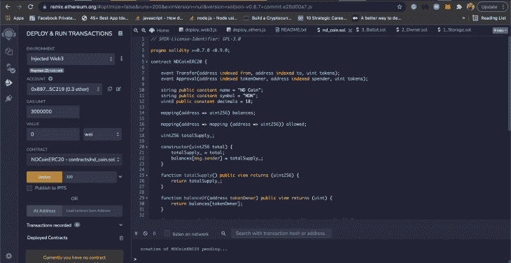
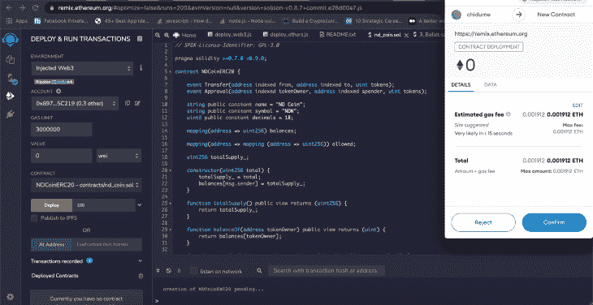
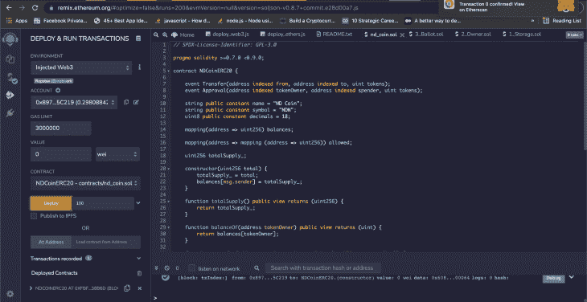
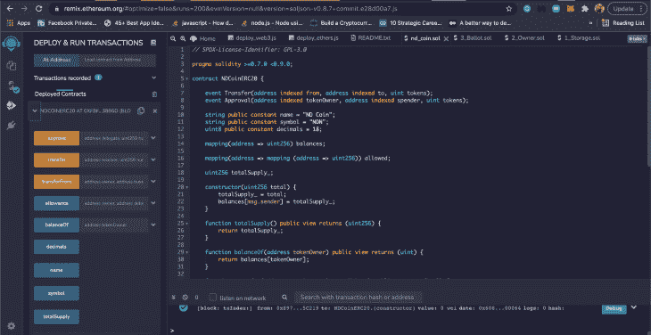
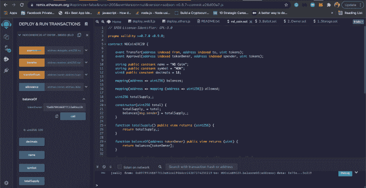

# 如何在以太坊区块链博客上创建和部署 ERC-20 令牌

> 原文：<https://blog.logrocket.com/create-deploy-erc-20-token-ethereum-blockchain/>

区块链正在接管世界。目前最流行的虚拟货币比特币是区块链科技的产物。以太坊是区块链的副产品。随着比特币的激增，它应运而生。

虽然比特币只依赖于货币，但以太坊更进一步，它提供了一个虚拟机和智能合约，使用户能够部署他们的令牌，这与比特币类似。

代币可以代表虚拟货币、一盎司黄金、彩票等。你可以在以太坊区块链上开发各种各样的令牌，但是对于本教程，我们将关注如何创建和部署一个 [ERC-20 令牌](https://ethereum.org/en/developers/docs/standards/tokens/erc-20/)。

我们将通过实例详细介绍以下内容:

您可能想知道，“为什么我要创建自己的令牌？”区块链、以太坊和代币正在成为软件开发领域的重要组成部分。通过学习如何在以太坊区块链上创建代币，您将发现区块链技术如何在幕后工作并保持领先地位。

为了跟随这个教程，你应该至少对[区块链技术](https://blog.logrocket.com/top-blockchain-development-frameworks/)、[坚固性](https://blog.logrocket.com/smart-contract-programming-languages/#solidity)和[以太坊如何工作](https://blog.logrocket.com/ethereum-blockchain-development-using-web3-js/)有一个基本的了解。如果你需要复习，不要着急；在开始构建令牌之前，我们将回顾一下基础知识。

## 什么是区块链，它是如何工作的？

简单地说，区块链是分布在网络中许多参与者的分类账或数据库中的交易记录。该分类账包含网络中的交易记录。

交易是在网络中从一个用户向另一个用户转移货币或一定数量的钱。举个例子，假设爱丽丝把 30BLC 转给了鲍勃。该交易被加密散列并从网络中的某个节点记录在分类帐中。

该节点将该事务发送到网络中的其他节点，即，它向网络广播该事务。其他节点接收该交易，使用标准验证方法验证该交易，然后将该交易添加到它们的分类帐中。

网络中的节点监听网络中广播或发出的新交易，然后执行将交易添加到它们的分类帐的工作。我们可以看到，网络中的每个节点都拥有或拥有一份总账的副本。这就是区块链分布式的原因。

“区块链”一词来源于这样一个事实，即交易或记录在分类账中是连锁的。我们已经知道，交易是节点中双方之间的货币交换。它可以用 JSON 表示如下:

```
{
  "to": "0xalice",
  "from": "0xbob",
  "amount": "30BLC"
}

```

这是一个简单的记录或交易。它告诉我们 bob 把 30BLC 转给了 Alice。

现在，这个事务被记录在一个块中。让我们用 JSON 表示块内的事务，如下所示:

```
[
  {
    "to": "0xalice",
    "from": "0xbob",
    "amount": "30BLC"
  }
]

```

块就像一个包含事务对象的数组。所以这个块可以包含许多事务:

```
[
  {
    "to": "0xalice",
    "from": "0xbob",
    "amount": "30BLC"
  },
  {
    "to": "0xtheresa",
    "from": "0xarinze",
    "amount": "5BLC"
  }
]

```

你可以看到积木是从哪里来的。链意味着这些块彼此相连。每个区块链最初以一个创造者添加的创世块开始，并被广播到网络。

每个块还有一个加密散列，作为网络中的唯一标识符；任何两个块都不能有相同的散列。

当一个块被节点验证并被设置为添加到网络中时，该块具有指向网络中最后一个块的散列的指针。

```
[
  {
    "hash": "0x0",
    "prevHash": "",
    "txns": [
      {
        "to": "0xalice",
        "from": "0xbob",
        "amount": "30BLC"
      },
      {
        "hash": "0x1",
        "prevHash": "0x0",
        "to": "0xtheresa",
        "from": "0xarinze",
        "amount": "5BLC"
      }
    ]
  },
  {
    "hash": "0x1",
    "prevHash": "0x0",
    "txns": [
      {
        "to": "0xalice",
        "from": "0xbob",
        "amount": "30BLC"
      },
      {
        "to": "0xtheresa",
        "from": "0xarinze",
        "amount": "5BLC"
      }
    ]
  }
]

```

散列值为`0x0`的第一个块是起源块。散列值为`0x1`的下一个块有一个指向`0x0`的`prevHash`。这指向网络中的第一个块。

这样，整合到网络中的任何新数据块都指向最近的数据块。区块链的“链条”就是这样形成的。

## 以太坊是什么？

[以太坊](https://ethereum.org/en/developers/docs/intro-to-ethereum/)是一个区块链，有一种数字货币叫做以太(ETH)。就像一般的区块链一样，交易被存储在分类账中。

以太坊区别于其他区块链的地方在于它的灵活性。虽然许多区块链平台只支持转移货币，但以太坊使你能够通过区块链转移任何数据，并用以太支付价格。

## 以太坊是如何运作的？

如上所述，在以太坊区块链，我们可以传输任何数据，并用以太支付代价。

就像我们在上面的例子中用 BLC 货币交易一样，以太坊区块链促进了 ETH 交易。假设爱丽丝将 1 ETH 转让给鲍勃。该事务由网络中的节点验证，并且该事务被添加到区块链中的块中。

有一种活动叫做采矿，它需要为以太工作。这项工作包括通过反复试验来解决一个难题。这可以由网络中的任何节点来完成。成功解决计算的节点被授予一定数量的 ETH。随着更多事务被挖掘，工作的难度增加。

* * *

### 更多来自 LogRocket 的精彩文章:

* * *

每当在以太坊区块链中发起交易时，该交易就被网络中的挖掘节点挖掘。事务的发送者必须同意向将挖掘该事务的节点支付一定数量的 ETH。这就是所谓的天然气价格。

## 什么是智能合约？

以太坊有个东西叫智能合约。智能合约包含在以太坊区块链中执行的代码。

智能合约是用 Solidity 语言编写的，并被编译成 ABI 代码。这个 ABI 代码被部署到以太坊区块链。智能合约采用发送方的外部拥有的地址加上混合的随机数，以形成其在以太坊区块链中的地址。

智能合同使我们能够创建数字合同。这些数字合同，就像现实世界中的合同一样，允许在以太坊区块链由两方或多方建立交易。

智能合约是以太坊中的一种账户。这意味着它不受用户控制，他们可以在区块链发送交易。作为一个账户，智能合约有余额，它们包含一个 EVM 代码。

## 什么是 ERC 20 代币？

以太坊虚拟机(EVM)是一个虚拟机，编译后的 Solidity ABI 代码在其中运行。以太坊中的这些智能合约已经成为创造一些代币的世界标准。这些标准后来被称为以太坊标准(ERC)。

以太坊有许多标准，但是最流行和最广泛使用的是 ERC-20 和 ERC-721。ERC-20 用于创建令牌，而 ERC-721 用于开发[不可替代令牌](https://blog.logrocket.com/how-to-create-nfts-with-javascript/)。

Fabian Vogelsteller 提出的标准 ERC-20 是一个包含一组 API 的智能合约。ERC20 定义了一组适用于所有选择 ERC-20 标准的令牌的规则。

如上所述，ERC-20 可以用来创造虚拟货币，如比特币和以太。使用 ERC-20 标准建造的最著名的代币是币安硬币 BNB 和柴犬沙布。

ERC-20 代币可以发送和接收。它们是可替换的代币，这意味着它们的价值在区块链的任何地方都是一样的。

根据[Blockchain.com 支持](https://support.blockchain.com/hc/en-us/articles/360027491872-What-is-an-ERC20-token-)的说法，钱包和交易所使用该标准将各种 ERC-20 代币集成到他们的平台上，并促进 ERC-20 代币和其他加密货币之间的交换。

既然我们了解了什么是 ERC-20 标准，让我们看看 ERC-20 令牌的主体。

## ERC 20 国集团

ERC-20 令牌的主体包含 ERC-20 令牌必须具有的方法和事件。

ERC-20 令牌必须能够:

*   将代币从一个帐户转移到另一个帐户
*   归还账户余额
*   返回令牌中可用的令牌总数
*   将代币转移到帐户

实际上，一架 ERC-20 在坚固程度上会是这样的:

```
function name() public view returns (string)

function symbol() public view returns (string)

function decimals() public view returns (uint8)

function totalSupply() public view returns (uint256)

function balanceOf(address _owner) public view returns (uint256 balance)

function transfer(address _to, uint256 _value) public returns (bool success)

function transferFrom(address _from, address _to, uint256 _value) public returns (bool success)

function approve(address _spender, uint256 _value) public returns (bool success)

function allowance(address _owner, address _spender) public view returns (uint256 remaining)

```

以下方法在 ERC-20 令牌中可用:

*   `name`返回令牌的名称(如币安硬币)
*   `symbol`返回令牌的符号(如 BNB)
*   `decimals`返回令牌使用的小数位数
*   `totalSupply`返回最初提供给令牌的总数
*   `balanceOf`返回账户余额
*   将一定数量的代币转移到一个地址
*   `transferFrom`将一定数量的代币从收款人地址转移到收款人地址
*   从所有者的地址中提取一定数量的代币
*   `allowance`返回可从所有者账户中提取的代币数量

事件也可以在我们的令牌上注册，以便在发出某些事件时捕获它们。

ERC-20 代币有以下事件:

```
event Transfer(address indexed _from, address indexed _to, uint256 _value)

event Approval(address indexed _owner, address indexed _spender, uint256 _value)

```

*   `Transfer`，令牌转移时必须触发
*   `Approval`，账户被批准收取一定数量代币时必须触发

## 创建 ERC-20 令牌

抛开背景信息，让我们写一个简单的令牌。我们称它为第二枚硬币😀

```
// SPDX-License-Identifier: GPL-3.0
pragma solidity >=0.7.0 <0.9.0;

contract NDCoinERC20 {}

```

在代码的第一行，我们设置了许可证标识符和 Solidity 的版本。这里，我们的坚固性代码是为了坚固性`v0.7.0–0.9.0`。我们通过使用关键字`contract`来声明我们的契约，然后将其命名为`NDCOoinERC20`。

### 设置令牌的事件

我们将在合同中声明事件`Transfer`和`Approval`:

```
event Transfer(address indexed from, address indexed to, uint tokens);

event Approval(address indexed tokenOwner, address indexed spender, uint tokens);

```

### 设置令牌的名称、符号和小数

接下来，我们设置令牌的名称、符号和要使用的小数:

```
string public constant name = "ND Coin";
string public constant symbol = "NDN";
uint8 public constant decimals = 18;

```

我们的代币名称是 ND Coin，我们的标志是 NDN。我们把小数设为`18`。

#### 设置余额和折让图

接下来，我们将声明两个映射:

```
mapping(address => uint256) balances;

mapping(address => mapping (address => uint256)) allowed;

```

坚固性中的映射类似于键值对。所以在`balances`中，`address`是键，而`uint256`(256 位无符号整数)是值。

根据 Solidity 文档，`address`类型是一个 160 位的值，不允许任何算术运算。它适用于存储合同的地址，或者属于外部帐户的密钥对的公共部分的散列。

`balances`将一个地址映射到一个`uint256` int:

| 地址 | uint256 |
| 0x01 | 23 |
| 0x02 | 10 |
| 0x03 | 2 |

地址是指它的余额。`allowed`映射也是一个键值对，它将地址映射到另一个映射。最后的映射将地址映射到它们的`unit256`值。它允许您存储可以转移给接收者的令牌数量。

### 申报总供应量

下一行代码如下:

```
uint256 totalSupply_;

```

这存储了我们的合同中可用的令牌数量。

### 设置总供应量和余额

接下来，我们有了`constructor`。我们知道在创建类时会调用构造函数。在智能协定中，当协定部署到网络时，会调用构造函数。

```
constructor(uint256 total) {
  totalSupply_ = total;
  balances[msg.sender] = totalSupply_;
}

```

这里，用我们希望包含在契约中的令牌总数来调用构造函数(`total`)。`total`被设置为`totalSupply_`，并且部署地址的余额被设置为总令牌数。`msg.sender`包含当前正在执行的合约功能的以太坊账号。

### 获得所有者的平衡

在下一行中，我们将使用`balanceOf`方法:

```
function balanceOf(address tokenOwner) public view returns (uint) {
    return balances[tokenOwner];
}

```

这个方法有一个参数，`tokenOwner`。该参数是令牌所有者的地址，我们希望将契约中令牌的余额返回给该所有者。因此，该方法通过从`balances`引用`tokenOwner`地址来获得余额。

### 将代币转移到帐户

方法是`transfer`:

```
function transfer(address receiver, uint numTokens) public returns (bool) {
    require(numTokens <= balances[msg.sender]);
    balances[msg.sender] -= numTokens;
    balances[receiver] += numTokens;
    emit Transfer(msg.sender, receiver, numTokens);
    return true;
}

```

此方法具有以下参数:

*   `receiver`，将接收代币的账户地址
*   `numTokens`，将发送到`receiver`账户的代币数量

在方法体中，我们看到进行了一项检查，以验证根据部署者的地址余额，发送给接收者的令牌数量是否足够。

接下来，从部署者的余额中减去`numTokens`并记入`receiver`的余额。然后，发出一个`Transfer`事件。最后，返回布尔值`true`。

### 批准代币转账

下一个方法是`approve`:

```
function approve(address delegate, uint numTokens) public returns (bool) {
    allowed[msg.sender][delegate] = numTokens;
    emit Approval(msg.sender, delegate, numTokens);
    return true;
}

```

这个方法有名为`delegate`和`numTokens`的参数。

*   `delegate`是我们想要设置部署者可以发送给它的令牌数量的地址
*   `numTokens`是部署者可以发送给`delegate`的令牌数

在方法体中，我们引用`allowed`映射中的`delegate`映射来设置它的令牌数。然后，我们发出`Approval`事件并返回`true`。

#### 获取账户的补贴状态

方法是`allowance`:

```
function allowance(address owner, address delegate) public view returns (uint) {
    return allowed[owner][delegate];
}

```

这个方法有以下参数:`owner`和`delegate`。`owner`是在`delegate`返回可转让给接收者的代币数量的地址。

### 将代币从一个帐户转移到另一个帐户

将令牌从一个帐户转移到另一个帐户的方法是`transferFrom`:

```
function transferFrom(address owner, address buyer, uint numTokens) public returns (bool) {
    require(numTokens <= balances[owner]);
    require(numTokens <= allowed[owner][msg.sender]);
    balances[owner] -= numTokens;
    allowed[owner][msg.sender] -= numTokens;
    balances[buyer] += numTokens;
    emit Transfer(owner, buyer, numTokens);
    return true;
}

```

`transferFrom`有称为`owner`、`buyer`和`numTokens`的自变量。

`owner`是我们将转移`numTokens`的余额地址`buyer`是我们将贷记`numTokens`的余额地址`numTokens`是从`owner`转移到`buyer`的代币数量

在方法体中，我们首先检查所有者的余额是否足够，以及所有者是否被批准向购买者发送该数量的令牌。

接下来，通过从所有者的余额和允许的余额中减去代币的数量来进行转移。然后，代币的数量被添加到买方的余额中。发出`Transfer`事件并返回布尔值`true`。

### 完整的代码

```
// SPDX-License-Identifier: GPL-3.0
pragma solidity >=0.7.0 <0.9.0;

contract NDCoinERC20 {

    event Transfer(address indexed from, address indexed to, uint tokens);
    event Approval(address indexed tokenOwner, address indexed spender, uint tokens);

    string public constant name = "ND Coin";
    string public constant symbol = "NDN";
    uint8 public constant decimals = 18;

    mapping(address => uint256) balances;

    mapping(address => mapping (address => uint256)) allowed;

    uint256 totalSupply_;

    constructor(uint256 total) {
      totalSupply_ = total;
      balances[msg.sender] = totalSupply_;
    }

    function totalSupply() public view returns (uint256) {
      return totalSupply_;
    }

    function balanceOf(address tokenOwner) public view returns (uint) {
        return balances[tokenOwner];
    }

    function transfer(address receiver, uint numTokens) public returns (bool) {
        require(numTokens <= balances[msg.sender]);
        balances[msg.sender] -= numTokens;
        balances[receiver] += numTokens;
        emit Transfer(msg.sender, receiver, numTokens);
        return true;
    }

    function approve(address delegate, uint numTokens) public returns (bool) {
        allowed[msg.sender][delegate] = numTokens;
        emit Approval(msg.sender, delegate, numTokens);
        return true;
    }

    function allowance(address owner, address delegate) public view returns (uint) {
        return allowed[owner][delegate];
    }

    function transferFrom(address owner, address buyer, uint numTokens) public returns (bool) {
        require(numTokens <= balances[owner]);
        require(numTokens <= allowed[owner][msg.sender]);

        balances[owner] -= numTokens;
        allowed[owner][msg.sender] -= numTokens;
        balances[buyer] += numTokens;
        emit Transfer(owner, buyer, numTokens);
        return true;
    }
}

```

## 在以太坊测试网上部署令牌

现在，让我们将我们的合同部署到以太坊网络——嗯，实际上不是以太坊网络，而是以太坊测试网络。我们不能在真实的以太网上部署我们的合同，因为这将花费真实的钱。因为我们只是在练习，所以我们将使用这个测试网络并传输一个免费的 ETH 来部署我们的合同。

我们将把我们的令牌部署到 [Ropsten 测试网络](https://ropsten.etherscan.io/)并在 [Remix](https://remix.ethereum.org/) 上编译我们的智能合约，我们还将使用 [MetaMask](https://metamask.io/) 在以太坊测试网络上创建一个钱包。

在桌面浏览器上安装 MetaMask 扩展。创建一个帐户，暂时不用它；我们稍后再来讨论。

接下来，转到 [Remix](https://remix.ethereum.org/) 并创建一个新的`.sol`文件。我们将它命名为`nd_coin.sol`，并将我们的智能契约粘贴到上面的部分:


现在让我们得到一些免费的 ETH！

如果我们打开元掩码扩展，我们会看到我们有 0 个 ETH。但是我们可以从 [Ropsten 测试网](https://faucet.ropsten.be/)获得免费的 ETH。我们将不得不从 MetaMask 中复制我们的帐户地址，然后将其粘贴到[https://水龙头. ropsten.be](https://faucet.ropsten.be/) 页面，并点击`Send me test Ether`。



我们的请求将被排队，大约三分钟后，我们将在 MetaMask ETH 帐户中看到 0.3 ETH。



现在，我们可以将智能合约部署到 Ropsten 测试网络。

回到 Remix 仪表盘，点击仪表盘中的以太坊标志。这将加载一个页面，我们可以在其中部署和运行事务。

在左侧栏中，我们将看到我们的`nd_coin.sol`合同已经被选中，我们的元掩码中的帐户已经被设置为部署地址。在`ENVIRONMENT`中，我们将看到`JavaScript VM (London)`被选中。



让我们更改它，使我们的部署网络成为我们的 Ropsten 网络。点击下拉菜单并选择`Injected Web3`。我们应该在部署地址旁边的`ACCOUNT`部分看到(0.3 ether)。现在，我们已经准备好部署我们的智能合约。

我们需要输入将在我们的代币中交易的代币的原始金额。将此输入到`Deploy`按钮旁边的输入中。进入`100`，点击**展开**按钮。



这将打开我们的元掩码扩展，并要求我们确认挂起的事务。点击 MetaMask 弹出菜单上的**确认**按钮。



这将在 Ropsten 测试网络上部署我们的智能合约。



现在，在我们的 Remix 页面上，如果我们向下滚动左侧边栏，我们会看到智能契约中的方法名称以及它们旁边的输入。



这是我们可以运行智能契约中的方法并获得结果的地方。

正如您在下面看到的，我们检查了部署地址的余额，它返回 100:



我们已经成功地在以太网上创建并部署了一个 ERC-20 令牌。

## 结论

本教程带我们进行了一次有趣的旅行。我们从介绍区块链和以太坊开始，然后深入研究 ERC 20，详细揭示它是什么以及它是如何形成的。

后来，我们分析了 ERC-20 体，并讨论了在 ERC-20 令牌中发现的方法和事件以及它们的作用。

最后，我们在 Solidity 中创建了一个简单的令牌，并将其部署到 Ropsten 测试网络中。

有这么多的探索，但本教程应该给你一个良好的开端，你进军 ERC 代币的世界。

## 加入像 Bitso 和 Coinsquare 这样的组织，他们使用 LogRocket 主动监控他们的 Web3 应用

影响用户在您的应用中激活和交易的能力的客户端问题会极大地影响您的底线。如果您对监控 UX 问题、自动显示 JavaScript 错误、跟踪缓慢的网络请求和组件加载时间感兴趣，

[try LogRocket](https://lp.logrocket.com/blg/web3-signup)

.

[](https://lp.logrocket.com/blg/web3-signup)[https://logrocket.com/signup/](https://lp.logrocket.com/blg/web3-signup)

LogRocket 就像是网络和移动应用的 DVR，记录你的网络应用或网站上发生的一切。您可以汇总和报告关键的前端性能指标，重放用户会话和应用程序状态，记录网络请求，并自动显示所有错误，而不是猜测问题发生的原因。

现代化您调试 web 和移动应用的方式— [开始免费监控](https://lp.logrocket.com/blg/web3-signup)。