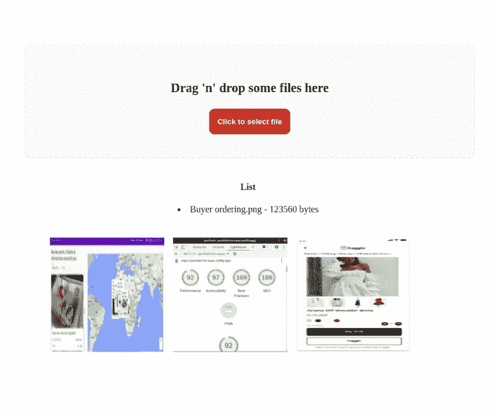
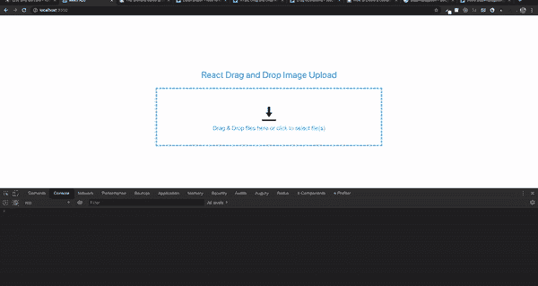
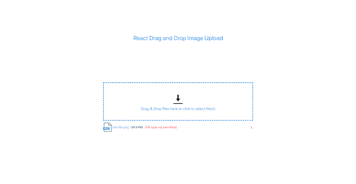
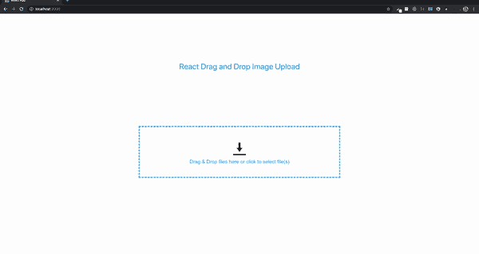
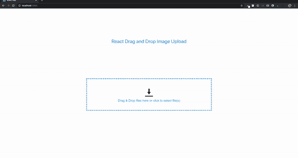
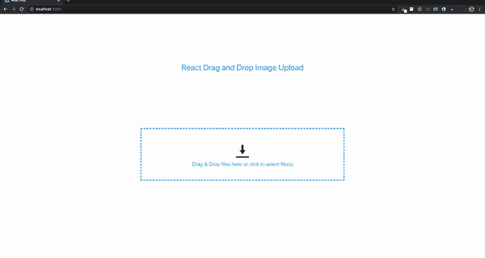
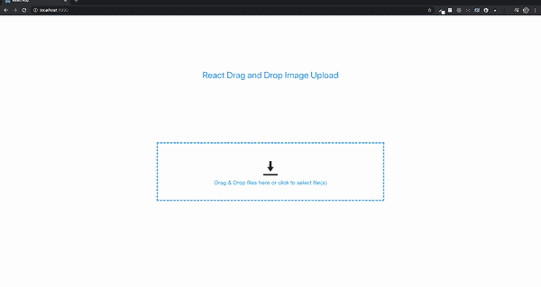
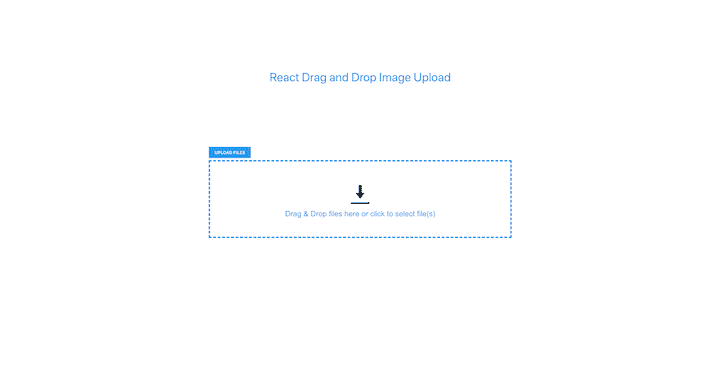
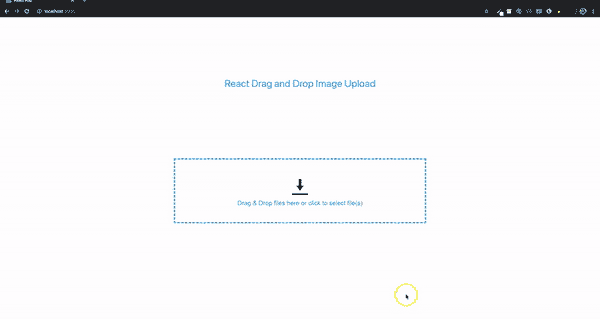

# 用 react-dropzone - LogRocket 创建一个拖放式博客

> 原文：<https://blog.logrocket.com/create-drag-and-drop-component-react-dropzone/>

***编者按:**这篇文章于 2022 年 3 月 24 日更新，包含了使用`react-dropzone`创建拖放组件并将其与 HTML 拖放 API 进行比较的信息。*

在本教程中，我们将介绍如何使用 [`react-dropzone`](https://react-dropzone.js.org) 创建一个用于上传图像的拖放组件。我们的拖放组件将包括一个常规的图像点击和选择功能。

我们将演示以下内容:

*   *   *   *   *   监听拖放操作
                *   检测文件何时被放到拖放区
                *   显示图像名称和文件类型
                *   确保图像持久
                *   验证丢弃的图像
                *   删除重复图像
                *   上传前删除不需要的图像

使用 React 钩子创建符合 HTML5 的 React 组件来处理文件的拖放。`react-dropzone`提供限制文件类型和自定义 dropzone 的附加功能。有了`react-dropzone`，我们不再需要依赖 [HTML 拖放 API](https://developer.mozilla.org/en-US/docs/Web/API/HTML_Drag_and_Drop_API) 。为了展示`react-dropzone`的简单性，我们还将使用 HTML 拖放 API 演示同一个教程。

要了解该项目的 react-dropzone 版本的代码，请访问 [GitHub](https://github.com/Claradev32/Drag-and-drop-with-react-dropzone) 。

最终结果将如下所示:



Drag-and-drop component created with `react-dropzone`.

## 入门指南

本教程假设您的机器上已经安装了`Node.js`。打开终端，导航到要添加项目的目录，并键入以下内容:

```
npx create-react-app react-dropzone

```

接下来，我们将把`react-dropzone`安装到我们的应用程序中，如下所示:

```
// with npm
npm install --save react-dropzone

// with yarn
yarn add react-dropzone

```

## 用`react-dropzone`创建拖放组件

`react-dropzone`提供了一些现成的代码片段。要用`react-dropzone`创建一个拖放组件，我们需要做的就是将代码片段复制并粘贴到我们的`App.js`文件中:

```
import React, {useEffect, useState} from 'react';
import {useDropzone} from 'react-dropzone';

function App(props) {
  const [files, setFiles] = useState([]);
  const {getRootProps, getInputProps} = useDropzone({
    accept: 'image/*',
    onDrop: acceptedFiles => {
      setFiles(acceptedFiles.map(file => Object.assign(file, {
        preview: URL.createObjectURL(file)
      })));
    }
  });

  const thumbs = files.map(file => (
    <div style={thumb} key={file.name}>
      <div style={thumbInner}>
        
      </div>
    </div>
  ));

  useEffect(() => {
    // Make sure to revoke the data uris to avoid memory leaks
    files.forEach(file => URL.revokeObjectURL(file.preview));
  }, [files]);

  return (
    <section className="container">
      <div {...getRootProps({className: 'dropzone'})}>
        <input {...getInputProps()} />
        <p>Drag 'n' drop some files here, or click to select files</p>
      </div>
      <aside style={thumbsContainer}>
        {thumbs}
      </aside>
    </section>
  );
}

export default App

```

上面的代码在拖放后呈现一个图像预览。

## 创建拖放和图像预览功能

在上一节中，我们展示了用`react-dropzone`创建一个拖放组件是多么容易。然而，我们没有解决持久图像的问题。当我们运行`npm start`在浏览器中查看我们的应用程序时，应用程序最初看起来运行流畅。然而，我们看到，如果我们拖动第二个图像，第一个图像不会持续在页面上。

为了持久保存拖动的图像，我们将彻底检查我们以前的代码。

在我们的`App.js`文件中，让我们清除所有内容，然后粘贴下面的代码:

```
import React, { useCallback, useState } from 'react';

function App() {
  const [images, setImages] = useState([]);
  const onDrop = useCallback((acceptedFiles) => {
    acceptedFiles.map((file, index) => {
      const reader = new FileReader();
      reader.onload = function (e) {
        setImages((prevState) => [
          ...prevState,
          { id: index, src: e.target.result },
        ]);
      };
      reader.readAsDataURL(file);
      return file;
    });
  }, []);
  return (
    <div className="App">

    </div>
  );
}
export default App;

```

在上面的代码中，我们初始化了一个图像状态，我们将它设置为一个空数组，然后使用`onDrop() callback`钩子，如果它们可以接受，我们就遍历我们的文件，如果可以接受，我们就初始化一个浏览器 FileReader API，并将图像添加到状态中。

接下来，我们将创建一个`DropBox`组件，然后传递从`App.js`文件中获取的`onDrop`作为道具。

```
import { useDropzone } from 'react-dropzone';
import styled from 'styled-components';
const getColor = (props) => {
  if (props.isDragAccept) {
    return '#00e676';
  }
  if (props.isDragReject) {
    return '#ff1744';
  }
  if (props.isFocused) {
    return '#2196f3';
  }
  return '#eeeeee';
};
const Container = styled.div`
  flex: 1;
  display: flex;
  flex-direction: column;
  align-items: center;
  padding: 40px;
  border-width: 2px;
  border-radius: 10px;
  border-color: ${(props) => getColor(props)};
  border-style: dashed;
  background-color: #fafafa;
  color: black;
  font-weight: bold;
  font-size: 1.4rem;
  outline: none;
  transition: border 0.24s ease-in-out;
`;
function DropBox({ onDrop }) {
  const {
    getRootProps,
    getInputProps,
    acceptedFiles,
    open,
    isDragAccept,
    isFocused,
    isDragReject,
  } = useDropzone({
    accept: 'image/*',
    onDrop,
    noClick: true,
    noKeyboard: true,
  });
  const lists = acceptedFiles.map((list) => (
    <li key={list.path}>
      {list.path} - {list.size} bytes
    </li>
  ));
  return (
    <>
      {' '}
      <section className="dropbox">
        <Container
          className="dropbox"
          {...getRootProps({ isDragAccept, isFocused, isDragReject })}
        >
          <input {...getInputProps()} />
          <p>Drag 'n' drop some files here</p>
          <button type="button" className="btn" onClick={open}>
            Click to select file
          </button>
        </Container>
      </section>
      <aside>
        <h4>List</h4>
        <p>{lists}</p>
      </aside>
    </>
  );
}
export default DropBox;

```

在 DropBox 组件中，我们从 react-dropzone 中导入`useDropZone`，然后我们使用它作为一个钩子，在这个钩子中我们析构出`*getRootProps*` *、*、*、*、`*getInputProps*`、*、*、`*acceptedFiles*`道具。

`getRootProps`用于获取拖放功能所需的道具，并在任何元素上使用。

将`open`属性传递给按钮，使其能够打开文件目录以允许上传。

`getInputProps`也用于创建拖放区。然而，它必须被应用到一个输入标签，并且它必须有 spread 操作符来将从`getInputProps`返回的内容作为单独的项添加到输入标签中。

`acceptedFiles` props 用于检查文件是否被接受。我们还通过它进行映射，在一个列表中呈现文件类型和大小。

将`noClick`和`noKeyboard`设置为真是为了避免通过点击`DropBox`或按下`enter`和`space`键来打开文件管理器

我们还安装了样式化组件，我们将在样式化`DropBox`组件时使用它们。

接下来，为每个图像创建一个`Image.jsx`文件，并粘贴以下代码:

```
import React from "react";
function Image({ image }) {
  return (
    <div>
      
    </div>
  );
}
export default Image;

```

接下来，我们创建一个`ShowImage.jsx`文件来显示列表中的图像，并在我们拖放另一个图像时保存下来。将以下代码复制到`ShowImage.jsx`文件中:

```
import Image from './Image';
const ShowImage = ({ images }) => {
  const show = (image) => {
    return <Image image={image} />;
  };
  return <div className="container">{images.map(show)}</div>;
};
export default ShowImage;

```

在上面的代码中，我们导入了`Image`组件，并使用它作为包装器来传入`images`，我们将从`App.js`文件中获取该组件作为道具

接下来，我们将`DropBox`和`ShowImage`文件导入到`App.js`文件中，将图像传入到`ShowImage`组件中，并将`onDrop`传入到`DropBox`组件中。

```
import React, { useCallback, useState } from 'react';
import ShowImage from './ShowImage';
import DropBox from './DropBox';
function App() {
  // State, browser FileReader and iterating

  return (
    <div className="App">
      <DropBox onDrop={onDrop} />
      <ShowImage images={images} />
    </div>
  );
}
export default App;

```

现在，让我们添加一些样式。我们将下面的样式复制并粘贴到我们的`index.css`文件中:

```
body {
  text-align: center;
}
.dropbox {
  text-align: center;
  padding: 20px;
  width: 90%;
  margin: auto;
  margin-top: 50px;
}
.container {
  display: flex;
  flex-wrap: wrap;
  width: 80%;
  margin: 20px auto;
  padding: 20px;
}
.container img {
  height: 200px;
  width: 200px;
  margin-right: 15px;
}
.btn {
  padding: 15px;
  background-color: #de1a1a;
  color: white;
  font-weight: bold;
  border-radius: 10px;
  border: none;
  cursor: pointer;
}
.btn:hover{
  background-color: #945c5c;
}

```

## 添加图像上传功能

有很多免费的图片服务，比如 Cloudinary，但是对于这个项目，我们将使用 [imgbb](https://imgbb.com/) 。创建一个账户，然后[获得一个 API 密钥](https://api.imgbb.com/)。

在`DropBox.js`文件中，我们将创建一个按钮来处理文件到 imgbb 的上传。然后，我们将创建一个 onClick 方法并传入一个`updateFiles`函数，该函数将负责在按钮被单击时上传图像。

```
<button className="upload-btn" onClick={() => uploadFiles()}>Upload Images</button>

```

`uploadFiles`功能:

```
const uploadFiles = () => {
};

```

接下来，我们将创建一个状态并将其设置为一个空数组:

```
const [imageSent, setImageSent] = useState([]);

```

在输入标签内的`getInputProps()`中，我们传入一个指向`handleFile`函数的`onChange`方法

```
  <input
       {...getInputProps({
        onChange: handleFile,
    })}
  />

```

`handleFile`功能

* * *

### 更多来自 LogRocket 的精彩文章:

* * *

```
const handleFile = (e) => {
    setImageSent(e.target.files[0]);
  };

```

因为它是文件的输入标签，我们可以访问`event.target.files`然后调用`setImageSent`并更新状态。

为了用 [imgbb API](https://api.imgbb.com/) 发出请求，需要一个键和图像属性。`key`是我们之前获得的 API 密钥，图像是要上传的文件。

为了设置这些属性，我们将使用`FormData`接口。这个工具提供了一种简单的方法来构造`key/value`对来表示表单字段和它们的值，然后可以很容易地发送它们。

在`uploadFiles`函数中创建一个新的`FormData`，并添加一个名为`image`和值为`imageSent`的键。然后，追加另一个名为`key`的键。该值应该是您的 API 密钥。

我们将使用`Axios`来处理我们的`POST`请求，但是这也可以用`fetch`来完成:

```
 const uploadFiles = () => {
    const formData = new FormData();
    console.log(imageSent);
    formData.append('image', imageSent);
    formData.append('key', 'Your Api key goes here');
    Axios.post('https://api.imgbb.com/1/upload', formData).then((response) => {
      console.log(response);
    });
  }; 
```

就是这样！我们已经用`react-dropzone`创建了我们的拖放式图像上传器！

作为比较的基础，让我们看一下使用 HTML 拖放 API 的同一个教程。

## 用 Dropzone 创建拖放组件

为了创建一个 Dropzone 组件，我们将在`src`文件夹中创建一个名为`Dropzone`的文件夹，并添加两个文件:`Dropzone.js`和`Dropzone.css`。

然后，我们将在`Dropzone.js`文件中添加一个名为`Dropzone`的箭头函数，并将`export function`设置为默认值。我们将父元素设置为空标签。

```
import React from 'react';

const Dropzone = () => {
    return (
        <>
        </>
    )
}
export default Dropzone;

```

接下来，我们将把`Dropzone`组件导入到`App.js`文件中:

```
import Dropzone from "./Dropzone/Dropzone";

```

我们将组件添加为类名为`content`的`div`元素的子元素:

```
return (
    <div>
        <p className="title">React Drag and Drop Image Upload</p>
        <div className="content">
            <Dropzone />
        </div>
    </div>
);

```

现在回到`Dropzone`组件。我们将添加一个类名为`container`的`div`元素。然后，在容器组件内部，我们将添加一个类名为`drop-container`的`div`。

```
<div className="container">
    <div className="drop-container">
    </div>
</div>

```

接下来，我们将这个 CSS 样式添加到`Dropzone.css`中，并将文件导入到组件中:

```
.container {
    transform: translateY(-100%);
}

.container p {
    color: red;
    text-align: center;
}

.drop-container {
    display: flex;
    align-items: center;
    justify-content: center;
    margin: 0;
    width: 800px;
    height: 200px;
    border: 4px dashed #4aa1f3;
}

```

然后，在类名为`drop-container`的`div`中，我们将添加以下元素:

```
<div className="drop-message">
    <div className="upload-icon"></div>
    Drag & Drop files here or click to upload
</div>
.upload-icon {
    width: 50px;
    height: 50px;
    background: url(../images/upload.png) no-repeat center center; 
    background-size: 100%;
    text-align: center;
    margin: 0 auto;
    padding-top: 30px;
}

.drop-message {
    text-align: center;
    color: #4aa1f3;
    font-family: Arial;
    font-size: 20px;
}

```

## 使用 HTML 拖放 API 创建拖放功能

[HTML 拖放](https://developer.mozilla.org/en-US/docs/Web/API/HTML_Drag_and_Drop_API)使用 DOM 事件模型，拖动事件继承自鼠标事件。
当用户从操作系统中选择一个项目，将项目拖动到一个可放下的元素，然后释放被拖动的项目时，拖动操作开始。在拖动操作过程中，会触发几个事件。有些事件可能会触发多次。

拖放 API 定义了八个事件:draggable 元素的四个事件和 droppable 元素的四个事件。对于这个说明性的例子，我们只需要 droppable 元素的四个事件。每个拖动事件类型都有一个关联的事件处理程序。这些事件是:

```
dragenter — A dragged item enters a valid drop target (ondragenter)
dragleave — A dragged item leaves a valid drop target (ondragleave)
dragover — A dragged item is dragged over a valid drop target every few hundred milliseconds (ondragover)
drop — an item is dropped on a valid drop target (ondrop)

```

到目前为止，我们已经为文件指定了放置区域，但是没有有效的放置区域。当一个文件从操作系统拖到浏览器中时，默认情况下，浏览器会尝试打开并显示该文件。如果我们想允许 drop，我们需要阻止事件处理程序的默认处理。

在类名为`drop-container`的`div`元素上，我们将添加四个事件方法。

```
onDragOver={dragOver}
onDragEnter={dragEnter}
onDragLeave={dragLeave}
onDrop={fileDrop}

```

在下面的代码中，我们将在左边列出事件处理程序方法，在右边列出处理事件处理程序的方法。`div`元素将如下所示:

```
<div className="drop-container"
    onDragOver={dragOver}
    onDragEnter={dragEnter}
    onDragLeave={dragLeave}
    onDrop={fileDrop}
>
    ...
</div>

```

我们会定义处理事件的方法:

```
const dragOver = (e) => {
    e.preventDefault();
}

const dragEnter = (e) => {
    e.preventDefault();
}

const dragLeave = (e) => {
    e.preventDefault();
}

const fileDrop = (e) => {
    e.preventDefault();
    const files = e.dataTransfer.files;
    console.log(files);
}

```

`e.dataTransfer`是一个`Data Transfer`对象，它保存拖放操作中被拖动的数据。它可以保存一个或多个数据项。`e.dataTransfer.files`包含被拖动的本地文件作为`FileList`。



Dragged local files.

接下来，我们需要通过验证文件类型、检查文件大小和显示文件名来处理来自`FileList`的文件。

## 验证并检查文件大小

在本例中，我们只添加图像文件。这是因为我们稍后用来存储上传文件的存储平台只允许大部分图像文件。让我们看看如何验证文件。

首先，我们将创建一个名为`handleFiles`的方法，并用`files`作为参数将其添加到`fileDrop`。

```
const handleFiles = (files) => {
}

```

接下来，我们将添加到`fileDrop`

```
const fileDrop = (e) => {
    e.preventDefault();
    const files = e.dataTransfer.files;
    if (files.length) {
        handleFiles(files);
    }
}

```

我们将创建一个名为`validateFile`的新方法，带有一个名为`file`的参数。该方法将返回一个布尔值。

```
const validateFile = (file) => {
    const validTypes = ['image/jpeg', 'image/jpg', 'image/png', 'image/gif', 'image/x-icon'];
    if (validTypes.indexOf(file.type) === -1) {
        return false;
    }
    return true;
}

```

这里我们有一个包含[文件类型](https://developer.mozilla.org/en-US/docs/Web/HTTP/Basics_of_HTTP/MIME_types)的数组。您可以添加或删除任何类型。来自`FileList`的`file`参数包含一个类型属性。使用 JavaScript 的`indexOf`方法时，如果在数组中找不到类型，则返回`-1`；否则，它返回数组中值的索引。如果没有找到该类型，它返回`false`，如果找到了，则返回`true`。

现在，我们将在`handleFiles`中使用`validateFile`方法。`FileList`是一个数组，我们将遍历这个数组:

```
for(let i = 0; i < files.length; i++) {
    if (validateFile(files[i])) {
        // add to an array so we can display the name of file
    } else {
        // add a new property called invalid
        // add to the same array so we can display the name of the file
        // set error message
    }
}

```

然后，我们从`react`导入`useState`钩子:

```
import React, { useState } from 'react';

```

接下来，我们将在`Dropzone`函数中添加两个状态变量:

```
const [selectedFiles, setSelectedFiles] = useState([]);
const [errorMessage, setErrorMessage] = useState('');
selectedFiles has a type of array while errorMessage has a type of string.

// add a new property called invalid
files\[i\]['invalid'] = true;

```

现在，我们将使用包含无效属性的新对象更新`selectedFiles`数组:

```
// add to the same array so we can display the name of the file
setSelectedFiles(prevArray => [...prevArray, files[i]]);

```

这里我们将在`setSelectedFiles`方法中使用回调来快速更新数组:

我们会添加错误消息。

```
// set error message
setErrorMessage('File type not permitted');

```

在我们尝试之前，我们需要添加一个`div`来显示`selectedFiles`数组中的文件。接下来，我们将在类名为`drop-container`的`div`之后添加以下内容。

```
<div className="file-display-container">
    <div className="file-status-bar">
        <div>
            <div className="file-type-logo"></div>
            <div className="file-type">png</div>
            <span className="file-name">test-file.png</span>
            <span className="file-size">(20.5 KB)</span> {<span className='file-error-message'>(File type not permitted)</span>}
        </div>
        <div className="file-remove">X</div>
    </div>
</div>

```

现在，我们将这些样式添加到`Dropzone`的 CSS 文件中:

```
.file-display-container {
    position: fixed;
    width: 805px;
}

.file-status-bar{
    width: 100%;
    vertical-align:top;
    margin-top: 10px;
    margin-bottom: 20px;
    position: relative;
    line-height: 50px;
    height: 50px;
}

.file-status-bar > div {
    overflow: hidden;
}

.file-type {
    display: inline-block!important;
    position: absolute;
    font-size: 12px;
    font-weight: 700;
    line-height: 13px;
    margin-top: 25px;
    padding: 0 4px;
    border-radius: 2px;
    box-shadow: 1px 1px 2px #abc;
    color: #fff;
    background: #0080c8;
    text-transform: uppercase;
}

.file-name {
    display: inline-block;
    vertical-align:top;
    margin-left: 50px;
    color: #4aa1f3;
}

.file-error {
    display: inline-block;
    vertical-align: top;
    margin-left: 50px;
    color: #9aa9bb;
}

.file-error-message {
    color: red;
}

.file-type-logo {
    width: 50px;
    height: 50px;
    background: url(../images/generic.png) no-repeat center center; 
    background-size: 100%;
    position: absolute;
}

.file-size {
    display:inline-block;
    vertical-align:top;
    color:#30693D;
    margin-left:10px;
    margin-right:5px;
    margin-left: 10px;
    color: #444242;
    font-weight: 700;
    font-size: 14px;
}

.file-remove  {
    position: absolute;
    top: 20px;
    right: 10px;
    line-height: 15px;
    cursor: pointer;
    color: red;
    margin-right: -10px;
}

```



Validating file size.

我们可以看到文件将如何显示。将提取并显示文件类型，以及文件名和大小。只有无效文件才会显示错误消息。

现在我们有了将在页面上显示的文件的占位符，我们可以在模板中使用`selectedFiles`数组。

首先，我们将创建一个名为`fileSize`的方法。这将接受一个大小参数。来自`FileList`的文件对象包含一个大小属性。

```
const fileSize = (size) => {
    if (size === 0) return '0 Bytes';
    const k = 1024;
    const sizes = ['Bytes', 'KB', 'MB', 'GB', 'TB'];
    const i = Math.floor(Math.log(size) / Math.log(k));
    return parseFloat((size / Math.pow(k, i)).toFixed(2)) + ' ' + sizes[i];
}

```

在上面的代码中，如果文件大小为零，我们将返回字符串`0 Bytes`。1kB 相当于 1024 字节。我们可以通过除以字节值的自然对数来计算大小的自然对数。`Math.floor`返回一个整数。该函数的返回值是大小除以`k`的值到`i`的幂，再加上大小值。

接下来，我们将添加一个从文件名获取文件类型的方法:

```
const fileType = (fileName) => {
    return fileName.substring(fileName.lastIndexOf('.') + 1, fileName.length) || fileName;
}

```

`substring()`方法从两个指定索引之间的字符串中提取字符，并返回新的子字符串。`substring()`方法返回文件名中`.`后面的字符。

```
<div className="file-display-container">
    {
        selectedFiles.map((data, i) => 
            <div className="file-status-bar" key={i}>
                <div>
                    <div className="file-type-logo"></div>
                    <div className="file-type">{fileType(data.name)}</div>
                    <span className={`file-name ${data.invalid ? 'file-error' : ''}`}>{data.name}</span>
                    <span className="file-size">({fileSize(data.size)})</span> {data.invalid && <span className='file-error-message'>({errorMessage})</span>}
                </div>
                <div className="file-remove">X</div>
            </div>
        )
    }
</div>

```

现在，我们将遍历`selectedFiles`数组。我们将通过传递文件名来使用`fileType`方法。

```
<span className={`file-name ${data.invalid ? 'file-error' : ''}`}>{data.name}</span>

```

接下来，我们将检查对象是否包含添加的`invalid`属性，这将指示一个无效的文件。我们将添加类名`file-error`。

```
<span className="file-size">({fileSize(data.size)})</span> {data.invalid && <span className='file-error-message'>({errorMessage})</span>}

```

我们将使用`fileSize`方法显示文件大小。如果是无效文件，错误消息将显示在它旁边。



Invalid files.

添加有效文件很简单。在`handleFiles`方法的`if`部分，我们将添加以下内容:

```
setSelectedFiles(prevArray => [...prevArray, files[i]]);

```



Add valid files.

我们甚至可以同时拖放多个文件。

### 删除重复的有效文件

数组的一个缺点是一个特定的文件可以被多次添加。我们不希望出现这种行为。



Remove duplicate valid files.

为了从`selectedFiles`数组中删除重复项，我们将在组件中添加一个新的`useState`变量。

```
const [validFiles, setValidFiles] = useState([]);

```

接下来，我们将导入`useEffect`钩子:

```
import React, { ..., useEffect } from 'react';

```

现在，我们将使用 JavaScript 的`reduce`、`find`和`concat`方法来删除重复值，并将单个值添加到新数组`validFiles`:

```
useEffect(() => {
    let filteredArray = selectedFiles.reduce((file, current) => {
        const x = file.find(item => item.name === current.name);
        if (!x) {
            return file.concat([current]);
        } else {
            return file;
        }
    }, []);
    setValidFiles([...filteredArray]);

}, [selectedFiles]);

```

`filteredArray`的结果将用于更新`validFiles`数组。接下来，我们将 HTML 映射中的`selectedFiles`替换为`validFiles`:

```
<div className="file-display-container">
    {
        validFiles.map((data, i) => 
            ...
        )
    }
</div>

```

现在，我们将检查以确保特定文件只能添加一次。

## 上传前删除不需要的文件

在上传图片之前，用户应该可以选择从列表中删除图片。我们已经有了一个从列表中删除项目的按钮。

要创建这个功能，我们首先要在类名为`file-remove`的`div`元素上添加一个名为`removeFile`的方法，文件名作为参数。

```
<div className="file-remove" onClick={() => removeFile(data.name)}>X</div>

```

接下来，我们需要从`validFiles`和`selectedFiles`数组中移除选中的文件。我们将使用 JavaScript `findIndex`方法来查找文件的索引。然后，我们将使用`splice`方法从数组中移除该项，并用`setValidFiles`和`setSelectedFiles`方法更新它。

```
const removeFile = (name) => {
    // find the index of the item
    // remove the item from array

    const validFileIndex = validFiles.findIndex(e => e.name === name);
    validFiles.splice(validFileIndex, 1);
    // update validFiles array
    setValidFiles([...validFiles]);
    const selectedFileIndex = selectedFiles.findIndex(e => e.name === name);
    selectedFiles.splice(selectedFileIndex, 1);
    // update selectedFiles array
    setSelectedFiles([...selectedFiles]);
}

```



Remove files.

## 上传前预览图像

我们可以添加一个简单的模式，在所有图像上传之前预览图像。预览仅适用于有效文件。我们可以通过点击文件名来删除无效文件。首先，我们将在类别名称为`container`的`div`后面添加模态`div` s。

```
<div className="modal">
    <div className="overlay"></div>
    <span className="close">X</span>
    <div className="modal-image"></div>
</div>

```

类名为`modal-image`的`div`元素将显示图像。接下来，我们将添加 CSS 样式。默认情况下，模态显示设置为`non` e。只有当点击图像名称时，才会显示。

```
.modal{
    z-index: 999;
    display: none;
    overflow: hidden;
}

.modal .overlay{
    width: 100%;
    height: 100vh;
    background: rgba(0,0,0,.66);
    position: absolute;
    top: 0;
    left: 0;
}

.modal .modal-image{
    position: absolute;
    top: 50%;
    left: 50%;
    transform: translate(-50%,-50%);
    overflow: hidden;
    object-fit: cover;
    width: 100%;
    height: 300px;
    background-size: contain;
    background-repeat: no-repeat;
    background-position: center;
}

.close {
    position: absolute;
    top: 15px;
    right: 35px;
    color: #f1f1f1;
    font-size: 40px;
    font-weight: bold;
    transition: 0.3s;
}

```

接下来，我们将在类名为`file-status-bar`的元素内的`div`上添加以下代码。

```
onClick={!data.invalid ? () => openImageModal(data) : () => removeFile(data.name)}
<div className="file-display-container">
    {
        validFiles.map((data, i) => 
            <div className="file-status-bar" key={i}>
                <div onClick={!data.invalid ? () => openImageModal(data) : () => removeFile(data.name)}>
                    ...
                </div>
            </div>
        )
    }
</div>

```

点击`openImageModal`会显示有效文件，无效文件会被删除。接下来，我们将添加方法`openImageModal`:

```
const openImageModal = (file) => {

}

```

现在，我们将从 React 导入`useRef`钩子。`ref`将允许我们显示模态、显示图像和关闭模态。

```
import React, { ..., useRef } from 'react';

```

接下来，我们将添加以下`refs`变量:

```
const modalImageRef = useRef();
const modalRef = useRef();

```

在模态元素上，我们将添加各自的`ref`。

```
<div className="modal" ref={modalRef}>
    <div className="overlay"></div>
    <span className="close">X</span>
    <div className="modal-image" ref={modalImageRef}></div>
</div>
modalRef is used to display and hide the modal element and its contents
modalImageRef displays the image

```

我们需要读取作为参数传递到`openImageModal`中的文件内容。现在，我们将添加`FileReader`构造函数。

```
const reader = new FileReader();

```

[`FileReader`对象](https://developer.mozilla.org/en-US/docs/Web/API/FileReader)使 web 应用程序能够使用`File`或`Blob`对象指定要读取的文件或数据，异步读取存储在用户计算机上的文件(或原始数据缓冲区)的内容。

接下来，我们使用`modalRef`将模态的显示设置为`block`。

```
const reader = new FileReader();
modalRef.current.style.display = "block";

```

我们需要一种方法来使用`readAsDataURL`读取文件的内容，并添加一个事件处理程序，以便在读取操作完成后触发。

```
const reader = new FileReader();
modalRef.current.style.display = "block";
reader.readAsDataURL(file);
reader.onload = function(e) {
    modalImageRef.current.style.backgroundImage = `url(${e.target.result})`;
}

```

属性包含一个代表文件数据的 URL。我们将它设置为引用为`modalImageRef`的`div`的背景图像。

在`modal-image`的 CSS 样式中，我们已经设置了宽度、高度和一些背景属性。

接下来，我们将在类名为`close`的 span 元素上添加一个`onClick`方法。

```
<span className="close" onClick={(() => closeModal())}>X</span>

```

我们会创建一个方法`closeModal`。调用此方法时，模式显示设置为 none，图像背景设置为 none，以便重置。

```
const closeModal = () => {
    modalRef.current.style.display = "none";
    modalImageRef.current.style.backgroundImage = 'none';
}

```


Preview image.

## 上传图像

为了提供上传图像的能力，我们需要创建一个显示上传按钮，并构建允许用户点击选择特定文件的功能。

### 创建一个显示上传按钮

首先，我们要添加一个上传按钮。只有当所有文件都有效时，该按钮才会显示。如果至少有一个无效文件，则会显示一条消息。

首先，我们将添加一个按钮，其类名为`file-upload-btn`，作为容器`div`中的第一个元素。

```
<button className="file-upload-btn">Upload Files</button> 
.file-upload-btn {
    color: white;
    text-transform: uppercase;
    outline: none;
    background-color: #4aa1f3;
    font-weight: bold;
    padding: 8px 15px;
    margin-bottom: 5px;
}

```



Display upload button.

为了隐藏和显示上传按钮，我们将添加一个新的`useState`变量来保存所有无效文件。如果数组长度为零，将显示按钮；否则，按钮将被隐藏。

```
const [unsupportedFiles, setUnsupportedFiles] = useState([]);

```

我们会像使用`setSelectedFiles`一样使用`setUnsupportedFiles`。首先，我们将在`handleFiles`和`removeFile`方法的`else`部分添加以下内容:

```
const handleFiles = (files) => {
    for(let i = 0; i < files.length; i++) {
        if (validateFile(files[i])) {
            ...
        } else {
            ...
            ...
            ...
            setUnsupportedFiles(prevArray => [...prevArray, files[i]]);
        }
    }
}

```

使用下面的代码，我们将指定用户丢弃的每个无效文件都将被添加到数组中。

```
const removeFile = (name) => {
    // find the index of the item
    // remove the item from array

    ...
    ...
    const unsupportedFileIndex = unsupportedFiles.findIndex(e => e.name === name);
    if (unsupportedFileIndex !== -1) {
        unsupportedFiles.splice(unsupportedFileIndex, 1);
        // update unsupportedFiles array
        setUnsupportedFiles([...unsupportedFiles]);
    }
}

```

如果找到了元素的索引，该项将被拼接，并且`unsupportedFiles`将被更新。

现在，我们将用这两行代码替换上传按钮:

```
{unsupportedFiles.length === 0 && validFiles.length ? <button className="file-upload-btn" onClick={() => uploadFiles()}>Upload Files</button> : ''} 
{unsupportedFiles.length ? <p>Please remove all unsupported files.</p> : ''}

```

### 构建点击选择功能

在我们添加上传功能之前，我们需要为用户提供点击选择图片的能力。一个隐藏的输入字段被添加了类型`file`、一个`onChange`事件方法和一个`ref`属性。一个`onClick`方法将被添加到`drop-container`中，这样当容器的任何部分被点击时，它将通过使用它的`ref`来触发隐藏的输入字段。

首先，我们要给`drop-container`加上一个`onClick`:

```
onClick={fileInputClicked}

```

接下来，我们将在`drop-message`元素后添加一个输入字段:

```
<input
    ref={fileInputRef}
    className="file-input"
    type="file"
    multiple
    onChange={filesSelected}
/>
const fileInputRef = useRef();
.file-input {
    display: none;
} 

```

现在，我们将添加一个名为`fileInputClicked`的带有`fileInputRef.current.clicked`的方法:

```
const fileInputClicked = () => {
    fileInputRef.current.click();
}

```

接下来，我们将为`filesSelected`添加另一个方法。选择的文件可以从`fileInputRef.current.files`获得。我们只需要将它传递给`handleFiles`方法。

```
const filesSelected = () => {
    if (fileInputRef.current.files.length) {
        handleFiles(fileInputRef.current.files);
    }
}

```

使用这些方法，我们将能够选择多个文件。



Select multiple files.

### 添加上传功能

出于演示的目的，我们将使用一个名为 [imgbb](https://imgbb.com/) 的免费服务来为我们的 Dropzone 组件添加上传功能。首先，我们将创建一个帐户，然后从 https://api.imgbb.com/的[获得一个 API 密匙。](https://api.imgbb.com/)

现在，我们将向上传按钮添加一个名为`uploadFiles`的方法:

```
<button className="file-upload-btn" onClick={() => uploadFiles()}>Upload Files</button>

```

接下来，我们将添加`uploadFiles`方法:

```
const uploadFiles = () => {
}

```

当点击上传按钮时，会显示一个带有进度条的模式。接下来，我们将添加这些上传模式元素:

```
<div className="upload-modal" ref={uploadModalRef}>
    <div className="overlay"></div>
    <div className="close" onClick={(() => closeUploadModal())}>X</div>
    <div className="progress-container">
        <span ref={uploadRef}></span>
        <div className="progress">
            <div className="progress-bar" ref={progressRef}></div>
        </div>
    </div>
</div>
.upload-modal {
    z-index: 999;
    display: none;
    overflow: hidden;
}

.upload-modal .overlay{
    width: 100%;
    height: 100vh;
    background: rgba(0,0,0,.66);
    position: absolute;
    top: 0;
    left: 0;
}

.progress-container {
    background: white;
    width: 500px;
    height: 300px;
    position: absolute;
    top: 50%;
    left: 50%;
    transform: translate(-50%,-50%);
    overflow: hidden;
}

.progress-container span {
    display: flex;
    justify-content: center;
    padding-top: 20px;
    font-size: 20px;
}

.progress {
    width: 90%;
    position: absolute;
    top: 50%;
    left: 50%;
    transform: translate(-50%,-50%);
    background-color: #efefef;
    height: 20px;
    border-radius: 5px;
}

.progress-bar {
    position: absolute;
    background-color: #4aa1f3;
    height: 20px;
    border-radius: 5px;
    text-align: center;
    color: white;
    font-weight: bold;
}

.error {
    color: red;
}

```

模态包含带有`ref` s 的元素。我们将添加`ref`变量和`closeUploadModal`方法:

```
const uploadModalRef = useRef();
const uploadRef = useRef();
const progressRef = useRef();
uploadModalRef displays and hides the upload modal
uploadRef shows messages
progressRef updates the progress bar

```

在`closeUploadModal`方法中，将`uploadModalRef`的显示设置为 none。

```
const closeUploadModal = () => {
    uploadModalRef.current.style.display = 'none';
}

```

在`uploadFiles`方法中，我们首先将`uploadModalRef`的显示设置为`block`。同样，我们将把字符串`File(s) Uploading...`添加到`uploadRef`T5。

```
const uploadFiles = () => {
    uploadModalRef.current.style.display = 'block';
    uploadRef.current.innerHTML = 'File(s) Uploading...';
}

```

因为我们已经在`validFiles`数组中有了有效的文件，我们需要做的就是遍历数组，使用`FormData`设置正确的属性，然后发出请求。

```
const uploadFiles = () => {
    uploadModalRef.current.style.display = 'block';
    uploadRef.current.innerHTML = 'File(s) Uploading...';
    for (let i = 0; i < validFiles.length; i++) {
    }
}

```

根据 [imgbb API 文档](https://api.imgbb.com/)，需要一个密钥和图像属性来发出请求。`key`是我们获得的 API 密钥，图像是要上传的文件。我们可以转换成二进制文件、base64 数据或图像的 URL。

为了设置这些属性，我们将使用`FormData`接口。这个工具提供了一种简单的方法来构造`key/value`对来表示表单字段和它们的值，然后可以发送它们。

首先，我们将在`for`循环中创建一个新的`FormData`，并添加一个名为`image`和值为`validFiles[i]`的键。然后，我们追加另一个名为`key`的键。这个值就是我们的 API 键。

```
const uploadFiles = () => {
    uploadModalRef.current.style.display = 'block';
    uploadRef.current.innerHTML = 'File(s) Uploading...';
    for (let i = 0; i < validFiles.length; i++) {
        const formData = new FormData();
        formData.append('image', validFiles[i]);
        formData.append('key', 'add your API key here');
    }
}

```

要发出请求，我们将使用 Axios，因为它有一个方法可以让我们获得上传进度。由此，可以计算并显示进度条值。

我们将运行以下安装命令:

```
npm install axios

```

安装完成后，我们将在`Dropzone`组件中导入:

```
import axios from 'axios';

```

将文件上传到`imgbb`需要一个`post`请求:

```
const uploadFiles = () => {
    uploadModalRef.current.style.display = 'block';
    uploadRef.current.innerHTML = 'File(s) Uploading...';
    for (let i = 0; i < validFiles.length; i++) {
        const formData = new FormData();
        formData.append('image', validFiles[i]);
        formData.append('key', 'add your API key here');
        axios.post('https://api.imgbb.com/1/upload', formData, {})
        .catch(() => {
            // If error, display a message on the upload modal
            uploadRef.current.innerHTML = `<span class="error">Error Uploading File(s)</span>`;
            // set progress bar background color to red
            progressRef.current.style.backgroundColor = 'red';
        });
    }
}

```

Axios `post`有三个参数:URL、数据和计算上传进度事件的最后一个对象。你可以[在](https://blog.logrocket.com/understanding-axios-post-requests/) [GitHub](https://github.com/axios/axios#request-config) 上了解更多关于 Axios 请求配置的信息。我们对`onUploadProgress`方法感兴趣，它有助于处理上传的进度事件。

```
**结论**
在本指南中，我们介绍了如何使用`react-dropzone`创建一个拖放式图像上传器。与使用 HTML 拖放 API 相比，我们演示了这种方法的简单性。通过查看`react-dropzone` [官方](https://react-dropzone.js.org) [文档](https://react-dropzone.js.org)并对我们的代码做一些调整，我们可以扩展我们的应用程序以接受其他文件类型，如 PDF、ZIP 等。，具体取决于存储服务。

```