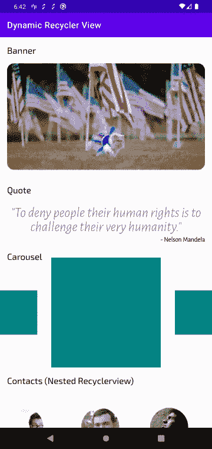

# 使用 RecyclerView 在 Android 中创建动态列表

> 原文：<https://blog.logrocket.com/create-dynamic-lists-in-android-with-recyclerview/>

在本文中，我们将学习如何创建一个动态的`RecyclerView.Adapter`,使我们能够在 Android 应用程序中为不同的后端控制的`viewType`显示一个带有不同`ViewHolder`的项目列表。

这个列表将是异构的，这意味着它将包含一个从网格和嵌套的水平列表范围的 UI，等等。

## 构建后端响应

在我们进入代码并开始创建动态适配器之前，我们必须讨论后端响应通常是如何构造的，以及我们如何将它们映射到 Kotlin 类以最终获得我们的内容。

服务器响应可能如下所示:

```
[
    {
        "type": "caraousel",
        "image-urls": [...]
    },
    {
        "type" : "banner",
        "banner-url" : ".."
    }, 
    {
        "type": "horizontal-list",
        "data" : [
            {...}, {...}, {...}
        ]
    }
]

```

这里，我们有一个带有`type`属性的对象列表，该属性指示它将包含哪种数据。现在，如果我们简单地在默认配置中使用 Gson 或 Jackson 这样的 JSON 反序列化器，就会导致运行时崩溃。

一种变通解决方案是创建一个数据类，如下所示:

```
data class ApiResponse (
    val type: String,
    val imageUrls: List<String>? = null,
    val bannerUrl: String? = null,
    val data: List<CustomData>? = null
)

```

上述解决方案适用于少数类型，但是随着我们的类型开始增长，这个类会变得臃肿，我们必须到处添加空检查。

一种更简化的方法是让我们的 JSON 反序列化器知道数据将是多态的，并且根据类型，其他属性将被分配给[一个适当的 Kotlin 类类型](https://blog.logrocket.com/tag/kotlin/)。

让我们看一个使用`Retrofit`库的`Moshi`适配器的例子。

## 使用`Moshi`多态 JSON 适配器

为了使用`Moshi`多态 JSON 适配器，我们必须在我们的`build.gradle`文件中添加所需的依赖项:

```
implementation "com.squareup.moshi:moshi:1.12.0"
implementation "com.squareup.moshi:moshi-adapters:1.12.0"
implementation "com.squareup.moshi:moshi-kotlin:1.12.0"
implementation "com.squareup.retrofit2:converter-moshi:2.9.0"

```

然后我们可以开始创建所需的 [Kotlin 数据类](https://blog.logrocket.com/using-kotlin-data-classes-to-eliminate-java-pojo-boilerplates/)，在这个场景中，使用 Kotlin 的`sealed`类是最理想的。

首先，将所有不同的类型映射到一个`enum`:

```
enum class ResponseType {
    @Json(name = "banner") BANNER,
    @Json(name = "quote") QUOTE,
    @Json(name = "carousel") CAROUSEL,
    @Json(name = "contact") CONTACT,
    @Json(name = "grid") GRID
}

```

然后，创建一个父类`sealed`,并向其中添加所有公共属性。在我们的例子中，我们只添加了`type`字段:

```
sealed class Response(@Json(name = "type") val type: ResponseType)

```

接下来，我们可以创建代表不同类型的不同数据类，所有这些数据类都将扩展上面的`sealed`类:

```
sealed class Response(@Json(name = "type") val type: ResponseType)

data class Banner(@Json(name = "banner-url") val bannerUrl: String): Response(ResponseType.BANNER)

data class Quote(val quote: String, val author: String): Response(ResponseType.QUOTE)

data class Carousel(@Json(name = "image-urls") val imageUrls: List<String>): Response(ResponseType.CAROUSEL)

data class Contacts(@Json(name = "contacts") val contactList: List<Contact>): Response(ResponseType.CONTACT)

data class Grid(@Json(name = "grid-urls") val gridUrls: List<String>): Response(ResponseType.GRID)

data class Contact(
    val name: String,
    val avatar: String,
    val city: String,
    val id: String
)

```

我们现在可以继续创建`Moshi`的多态适配器，并将上述每个数据类映射到服务器响应的`type`字段:

```
val polymorphicAdapter = 
    PolymorphicJsonAdapterFactory.of(Response::class.java, "type")
            .withSubtype(Banner::class.java, "banner")
            .withSubtype(Quote::class.java, "quote")
            .withSubtype(Carousel::class.java, "carousel")
            .withSubtype(Contacts::class.java, "contact")
            .withSubtype(Grid::class.java, "grid")

val moshi: Moshi = Moshi.Builder()
    .add(polymorphicAdapter)
    .add(KotlinJsonAdapterFactory())
    .build()

```

然后，将上面的`Moshi`实例传递给我们的`Retrofit`适配器，如下所示:

```
val retrofit: Retrofit = Retrofit.Builder()
    .baseUrl("https://my-json-server.typicode.com/jobinlawrance/")
    .addConverterFactory(MoshiConverterFactory.create(moshi))
    .addCallAdapterFactory(RxJava2CallAdapterFactory.create())
    .build()

```

为了测试我们上面的适配器并进一步开发，[我创建了一个模拟 API](https://my-json-server.typicode.com/jobinlawrance/dynamic-recycler-view/dynamic-list) 。使用`Retrofit`向这个端点发出一个`GET`请求，我们可以成功地看到适配器正在工作。

现在，让我们继续编写与 UI 相关的代码。

## 用户界面模型

尽管我们可以使用上面为数据建模编写的数据类，但作为一种干净的做法，我们将为我们的 UI 逻辑创建单独的数据类。

让我们首先创建一个[标记接口](https://www.geeksforgeeks.org/marker-interface-java/)作为我们 UI 数据类的基础，每个数据类对应于我们想要显示的不同类型的视图:

```
// this is our marker interface
interface BaseUI 

data class BannerUI(val imageUrl: String): BaseUI

data class QuoteUI(val quote: String, val author: String): BaseUI

data class CarouselUI(val imageUrls: List<String>): BaseUI

data class ContactListUI(val contacts: List<ContactUI>): BaseUI

data class GridUI(val imageUrls: List<String>): BaseUI

data class ContactUI(
    val name: String,
    val avatar: String,
    val city: String,
    val id: String
)

```

现在，创建一个简单的实用程序扩展，将我们的每个数据模型映射到 UI 模型:

```
fun Banner.toBannerUI() = BannerUI(imageUrl = bannerUrl)

fun Quote.toQuoteUI() = QuoteUI(quote, author)

fun Carousel.toCarouselUI() = CarouselUI(imageUrls)

fun Contact.toContactUI() = ContactUI(name, avatar, city, id)

fun Contacts.toContactListUI() = 
    ContactListUI(contacts = contactList.map { it.toContactUI() })

fun Grid.toGridUI() = GridUI(imageUrls = gridUrls)

fun Response.toBaseUI(): BaseUI =
    when(this) {
        is Banner -> this.toBannerUI()
        is Carousel -> this.toCarouselUI()
        is Contacts -> this.toContactListUI()
        is Grid -> this.toGridUI()
        is Quote -> this.toQuoteUI()
    }

fun List<Response>.toBaseUIList(): List<BaseUI> {
    return this.map { it.toBaseUI() }
}

```

## 创建`ViewHolder`和适配器

接下来，让我们继续创建我们不同的 ui 来显示在我们的单个`recyclerview`中，每个 ui 都有自己的`RecyclerView.ViewHolder`

首先，从在我们的`build.gradle`文件中添加一些必要的依赖项开始:

```
implementation "androidx.recyclerview:recyclerview:1.2.1"
implementation 'com.github.bumptech.glide:glide:4.12.0'
annotationProcessor 'com.github.bumptech.glide:compiler:4.12.0'

```

以下是我们将为本文创建的不同类型的视图及其对应的`ViewHolder`:

1.  旗帜
2.  引用
3.  旋转木马
4.  格子
5.  联系人(嵌套的`Recyclerview`)

这些将与以下`ViewHolder`相对应:

以上所有的`ViewHolder`都扩展了一个基类`ViewHolder`:

```
abstract class BaseViewHolder<in T>(binding: ViewBinding) :
    RecyclerView.ViewHolder(binding.root) {

    val context: Context = binding.root.context
    abstract fun bind(item: T)
}

```

当我们创建动态适配器时，我们必须覆盖一个额外的`getItemViewType()`方法来通知我们的`RecyclerView.Adapter`关于不同的`viewType`:

```
override fun getItemViewType(position: Int): Int {
    return when (uiList[position]) {
        is BannerUI -> BANNER.ordinal
        is QuoteUI -> QUOTE.ordinal
        is CarouselUI -> CAROUSEL.ordinal
        is ContactListUI -> CONTACT.ordinal
        is GridUI -> GRID.ordinal
        else -> -1
    }
}

```

我们返回`enum ordrinal`(或者我们可以返回布局 ID int，例如，`R.layout.some_layout`)作为唯一的整数。

在我们的`onCreateViewHolder()`方法中，我们可以检查`viewType`字段并创建适当的`ViewHolder`:

```
override fun onCreateViewHolder(parent: ViewGroup, viewType: Int): 
  BaseViewHolder<BaseUI> {
    val inflater = LayoutInflater.from(parent.context)
    return when (viewType) {
        BANNER.ordinal -> {
            val binding = ViewholderBannerBinding.inflate(inflater, parent, false)
            BannerViewHolder(binding)
        }
        QUOTE.ordinal -> {
            val binding = ViewholderQuoteBinding.inflate(inflater, parent, false)
            QuoteViewHolder(binding)
        }
        CAROUSEL.ordinal -> {
            val binding = ViewholderCarouselBinding.inflate(inflater, parent, false)
            CarouselViewHolder(binding)
        }
        CONTACT.ordinal -> {
            val binding = ViewholderContactsBinding.inflate(inflater, parent, false)
            ContactsViewHolder(binding)
        }
        GRID.ordinal -> {
            val binding = ViewholderGridBinding.inflate(inflater, parent, false)
            GridViewHolder(binding)
        }
        else -> throw IllegalArgumentException("The viewtype value of $viewType is not supported")
    } as BaseViewHolder<BaseUI>
}

```

最后，在我们的`onBindViewHolder()`中，我们可以简单地在我们的`BaseViewHolder`上调用`holder.bind(uiList[position])`。



这是最终完成的应用程序； [t](https://github.com/jobinlawrance/dynamic-recycler-view/blob/main/app/src/main/java/com/jobinlawrance/dynamicrecyclerview/ui/DynamicListAdapter.kt) [他完整的适配器代码可以在这里找到](https://github.com/jobinlawrance/dynamic-recycler-view/blob/main/app/src/main/java/com/jobinlawrance/dynamicrecyclerview/ui/DynamicListAdapter.kt)。

## 附着在固体上

上面的代码实现了我们最初的目标，即使用一个`RecyclerView`来显示一个动态列表，但是这个解决方案并不完美。

这对于小项目来说没问题，但是如果我们看一下我们的适配器，我们可以看到任何时候我们添加一个新的`viewType`，我们必须对我们的`adapter`类进行修改，这将最终加载`adapter`类。

现在，[我们违反了 SOLID 的开/关原则](https://blog.logrocket.com/solid-principles-single-responsibility-in-javascript-frameworks/)，它说，“软件实体(类、模块、函数等。)应该对扩展开放，但对修改关闭。”

为了开始坚持 SOLID，我们可以将作为静态方法的`ViewHolder`实例化代码移动到每个单独的`ViewHolder`中。例如，让我们将下面的代码添加到`QuoteViewHolder`类中:

```
companion object {
    fun createViewHolder(inflater: LayoutInflater, parent: ViewGroup): 
      QuoteViewHolder {
        val binding = ViewholderQuoteBinding.inflate(inflater, parent, false)
        return QuoteViewHolder(binding)
    }
}

```

现在，让我们使用[访问者模式](https://en.wikipedia.org/wiki/Visitor_pattern)，并将检查`viewType`的责任委派给一个单独的类。

我们首先定义一个`Visitable`接口:

```
interface Visitable {
    fun type(typeFactory: TypeFactory) : Int
}

```

然后，我们可以将我们的`BaseUI`扩展到接口:

```
interface BaseUI: Visitable

```

我们可以创建`TypeFactory`接口来处理不同的类型，使用方法重载来处理多个`viewType`:

```
class TypeFactoryImpl : TypeFactory {
    override fun type(bannerUI: BannerUI): Int = ResponseType.BANNER.ordinal
    override fun type(quoteUI: QuoteUI): Int = ResponseType.QUOTE.ordinal
    override fun type(carouselUI: CarouselUI): Int = ResponseType.CAROUSEL.ordinal
    override fun type(contactListUI: ContactListUI): Int = ResponseType.CONTACT.ordinal
    override fun type(gridUI: GridUI): Int = ResponseType.GRID.ordinal

    override fun holder(
        inflater: LayoutInflater,
        parent: ViewGroup,
        viewType: Int
    ): BaseViewHolder<*> {
        return when (viewType) {
            ResponseType.BANNER.ordinal -> 
                BannerViewHolder.createViewHolder(inflater, parent)
            ResponseType.QUOTE.ordinal -> 
                QuoteViewHolder.createViewHolder(inflater, parent)
            ResponseType.CAROUSEL.ordinal -> 
                CarouselViewHolder.createViewHolder(inflater, parent)
            ResponseType.CONTACT.ordinal -> 
                ContactsViewHolder.createViewHolder(inflater, parent)
            ResponseType.GRID.ordinal -> 
                GridViewHolder.createViewHolder(inflater, parent)
            else -> throw 
                  IllegalArgumentException(
                    "The viewtype value of $viewType is not supported"
                  )
        }
    }
}

```

这里，`holder`函数负责创建我们不同的`ViewHolder`。

现在，我们可以将`TypeFactory`传递给不同的`viewType`并实现`type`方法:

```
data class BannerUI(val imageUrl: String): BaseUI {
    override fun type(typeFactory: TypeFactory): Int {
        return typeFactory.type(this)
    }
}

data class QuoteUI(val quote: String, val author: String): BaseUI {
    override fun type(typeFactory: TypeFactory): Int {
        return typeFactory.type(this)
    }
}

data class CarouselUI(val imageUrls: List<String>): BaseUI {
    override fun type(typeFactory: TypeFactory): Int {
        return typeFactory.type(this)
    }
}

data class ContactListUI(val contacts: List<ContactUI>): BaseUI {
    override fun type(typeFactory: TypeFactory): Int {
        return typeFactory.type(this)
    }
}

data class GridUI(val imageUrls: List<String>): BaseUI {
    override fun type(typeFactory: TypeFactory): Int {
        return typeFactory.type(this)
    }
}

```

我们的适配器的`onCreateViewHolder`和`getItemViewType`可以简单地将`TypeFactory`委托给上述视图，从而使`adapter`类非常精简:

```
override fun onCreateViewHolder(parent: ViewGroup, viewType: Int): 
    BaseViewHolder<BaseUI> {
    val inflater = LayoutInflater.from(parent.context)
    return typeFactory.holder(inflater, parent, viewType) as BaseViewHolder<BaseUI>
}

override fun onBindViewHolder(holder: BaseViewHolder<BaseUI>, position: Int) {
    holder.bind(uiList[position])
}

override fun getItemCount(): Int = uiList.size

override fun getItemViewType(position: Int): Int {
    return uiList[position].type(typeFactory)
}

```

下次我们添加新的`viewType`时，我们根本不需要接触适配器类！

访问者模式的实现可以在[样本回购](https://github.com/jobinlawrance/dynamic-recycler-view)的`[feature/visitor-pattern](https://github.com/jobinlawrance/dynamic-recycler-view/tree/feature/visitor-pattern)` [分支](https://github.com/jobinlawrance/dynamic-recycler-view/tree/feature/visitor-pattern)中找到。

## 结论

总之，我们看到了如何使用多态适配器在 Kotlin 中映射动态服务器响应。我们还创建了多个`ViewHolder`并使用`recyclerview`适配器的`getItemViewType`函数来指定我们不同的`viewType`

最后，我们使用了一个访问者模式来清理我们的适配器类，这样当我们添加一个新的`viewType`时，我们不需要编辑我们现有的适配器代码。

## LogRocket :即时重现你的安卓应用中的问题。

[](https://lp.logrocket.com/blg/kotlin-signup)

[LogRocket](https://lp.logrocket.com/blg/kotlin-signup) 是一款 Android 监控解决方案，可以帮助您即时重现问题，确定 bug 的优先级，并了解您的 Android 应用程序的性能。

LogRocket 还可以向你展示用户是如何与你的应用程序互动的，从而帮助你提高转化率和产品使用率。LogRocket 的产品分析功能揭示了用户不完成特定流程或不采用新功能的原因。

开始主动监控您的 Android 应用程序— [免费试用 LogRocket】。](hhttps://lp.logrocket.com/blg/kotlin-signup)