# 在 Unity 中创建一个简单、可靠、干净的用户界面

> 原文：<https://blog.logrocket.com/create-easy-reliable-clean-ui-unity/>

不管你在 Unity 中构建什么类型的应用程序，你都有很大的机会使用一些用户界面(简称 UI)。然而，尽管这个任务很简单，但是为你的 UI 组件保持一个干净可靠的系统并不是那么简单。事实上，几个错误的步骤会很快破坏未来的变化，并产生数小时的过度工作和修改。

为了避免你花费精力在不合适的 UI 上，这篇文章介绍了 Unity 提供的 UI 元素的主要步骤，然后是一个简单的工作流程来开发你的界面结构，最后是如何使用免费资源和其他 Unity 工具来增强它的视觉元素。

## 设置环境

在进入 UI 组件之前，首先调整 Unity 的布局对于更高效的开发通常是有帮助的。这样做时，我喜欢考虑两个步骤:并排设置场景视图和游戏视图，这样我就可以在看到结果时同时更改 UI 元素，并在工作时将游戏视图更改为合适的分辨率。

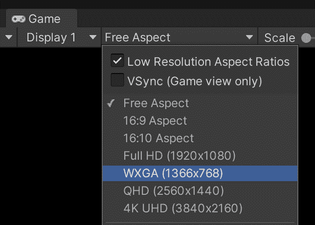

通常情况下，[游戏视图默认设置为自由视角](https://docs.unity3d.com/Manual/GameView.html)。通过点击分辨率选项，您可以更改它以匹配目标的分辨率(1366×768 或 1920×1080)或目标的纵横比(16×9 或 [18×9](https://www.dignited.com/31992/smartphone-aspect-ratio-meaning-types-and-why-you-shouldnt-care/) )。正如我们将看到的，这一步对于充分评估您在 UI 上的工作进度是至关重要的。

除了处理 Unity 面板的组合，一个新的 Unity 场景有一些元素会从一个干净的 UI 上转移注意力。这些主要是相机，灯光和天空盒。

从负责渲染游戏视图的[相机组件](https://docs.unity3d.com/Manual/class-Camera.html)开始，我经常会将**清除标志**改为**纯色**(这将 Unity 的标准天空盒从游戏视图中移除)并更改**背景**以匹配我想要的背景颜色。注意，这一步对于菜单和其他不需要天空盒的场景非常重要。除此之外，移除 skybox 改变了你的应用程序的美学，远离了粗糙的原型。

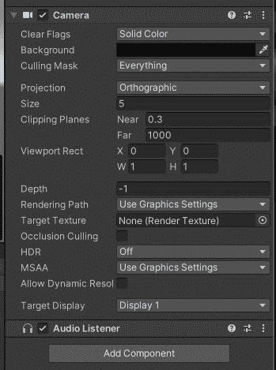

此外，当我专门为菜单类型的场景工作时，我经常做一些额外的步骤，通过调整剔除和投影的相机设置，无论它是不是附加场景。

剔除与 Unity 用来优化其渲染性能的[可见性剔除技术](https://www.researchgate.net/publication/323299914_A_draw_call-oriented_approach_for_visibility_of_static_and_dynamic_scenes_with_large_number_of_triangles)有关。剔除遮罩选择哪些对象应该由相机渲染或不渲染。在一个 UI 场景中，我经常只在剔除遮罩中保留 UI 相关的对象，以避免错误地保留剩余的渲染对象和其他辅助游戏对象。

[遮挡剔除](https://docs.unity3d.com/Manual/OcclusionCulling.html)是一种由 Unity 完成的可见性剔除技术，用于从渲染器中移除当前被其前面的其他对象隐藏的对象。对于菜单场景，我更喜欢关闭这个选项，因为这不太可能在任何有益的规模上发生，也不适合 2D 场景。

此外，我经常从场景中移除默认灯光，因为 UI 元素不会受到它的影响。至于天空盒，我们也可以打开**照明**标签并改变它，这通常是不必要的，因为我们已经用相机选项禁用了它。

## UI 画布

Unity UI 组件必须放在一个名为 Canvas 的特定[游戏对象中。所有 UI 元素都是作为画布的子元素放置的游戏对象。这些游戏对象在画布层次中的顺序很重要。](https://docs.unity3d.com/Packages/com.unity.ugui@1.0/manual/UICanvas.html)

将按顺序绘制元素:首先绘制第一个元素，然后绘制第二个元素，依此类推。如果两个元素共享屏幕上的同一区域，层次结构中最新的元素将被绘制在其他元素之上。

将画布游戏对象添加到场景后，一些游戏组件将自动附加到它，包括画布组件。为了避免游戏对象和脚本的混淆，我经常重命名我的 Canvas 游戏对象以匹配它的职责，比如`MenuCanvas`或者`PauseCanvas`。

整个 UI 只使用一个画布是可能的，但是必须考虑后果。 [Unity 每更新一个元素](https://unity.com/how-to/unity-ui-optimization-tips#split-your-canvases)(比如高亮显示一个按钮或者移动一个滑块)就更新并重绘画布。如果您的画布很复杂，并且包含许多元素，那么任何运行时的更改都会对您的性能造成损失。

为此，可以考虑为不同的职责和更新样式设置多个画布(例如，将频繁活动的对象放在独立于静态对象的画布中)。为了保护你的层次结构，也可以嵌套画布。

在向画布添加内容之前，需要注意两个设置。

### 画布渲染模式

[画布渲染模式](https://docs.unity3d.com/Packages/com.unity.ugui@1.0/manual/UICanvas.html#render-modes)定义了画布在场景中的渲染方式。有三种类型的渲染模式:覆盖、屏幕空间和世界空间。

Overlay 只是在游戏屏幕上渲染画布，绕过了相机和后期处理效果。另一方面，屏幕空间基于到游戏摄像机的给定距离来渲染画布。因此，屏幕空间渲染模式看起来更像是放置在游戏世界中，元素可能会显示在 UI 的顶部。此外，由于屏幕空间根据相机进行渲染，因此它会受到相机设置(如透视和视野)以及后期处理效果的影响。

最后，[世界空间](https://docs.unity3d.com/Packages/com.unity.ugui@1.0/manual/UICanvas.html#world-space)值得单独写一篇文章。世界空间渲染画布，就好像它是游戏世界中的 3D 元素一样。当我们想要在 3D 对象上弹出 UI 元素或者设计一个 [diegetic 界面](https://tvtropes.org/pmwiki/pmwiki.php/Main/DiegeticInterface)时，经常会用到它。对于本文，我们不进一步讨论世界空间渲染模式。

通常，对于菜单和其他 UI 画布，我们使用覆盖或屏幕空间，这取决于我们是否希望 UI 受到相机和后期处理效果的影响。稍后，我们将讨论我们可能选择其中一个的情况。

### 帆布定标器

[Canvas Scaler](https://docs.unity3d.com/Packages/com.unity.ugui@1.0/manual/HOWTO-UIMultiResolution.html#scaling-with-screen-size) 不是 Canvas game 对象的默认组件，但它是一个值得考虑的组件，尤其是在构建多分辨率的应用程序时。给定当前分辨率，画布缩放器使用参考分辨率来缩放 UI 元素，并使它们与当前元素匹配。

例如，如果画布缩放器使用 200×400 的参考分辨率和 400×800 的当前分辨率，它将缩放组件两次。如果当前分辨率与参考纵横比不匹配，画布缩放器将使用[匹配属性](https://docs.unity3d.com/Packages/com.unity.ugui@1.0/manual/script-CanvasScaler.html#properties)来决定将哪个大小用作主要点:宽度(当设置为 0 时)或高度(当设置为 1 时)。介于 0 和 1 之间的值将按比例匹配宽度和高度。

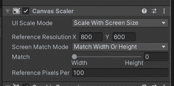

## UI 面板、图像、按钮和文本

至于在场景视图和层次视图中操纵的其他 Unity 系统，Unity UI 系统也是基于游戏对象的。虽然在 Unity 的 UI 菜单下列出了不同的游戏对象，但主要有四个对象被重复用于制作任何类型的 UI。这些是图像、按钮、文本和面板。大多数其他的，比如滑块和输入域，主要是这四个和附加脚本的组合。

### 用户界面图像

[图像](https://docs.unity3d.com/Packages/com.unity.ugui@1.0/manual/script-Image.html)是 UI 中的非交互式图形元素。其他组件广泛使用图像来进行可视化表示。Unity 还包含一个[原始图像](https://docs.unity3d.com/Packages/com.unity.ugui@1.0/manual/script-RawImage.html)组件，它与普通图像的主要区别在于接受任何种类的纹理，而图像只接受精灵资产。

通常，由于图像的特征，图像比原始图像使用得更频繁。值得注意的是,[保持纵横比](https://docs.unity3d.com/Packages/com.unity.ugui@1.0/manual/script-Image.html#properties)的特性，该特性强制显示的图形保持其纵横比，而不管屏幕上的图像属性，例如缩放比例。

### 用户界面文本

最初，Unity 有一个[文本组件](https://docs.unity3d.com/Packages/com.unity.ugui@1.0/manual/script-Image.html#properties)，用于在屏幕上显示非交互式文本元素。根据你使用的 Unity 版本，它可能仍然会出现(即使被弃用或设置为 Legacy)。从 Unity 的 2021 年开始，建议的文本替代方案是使用 [TextMeshPro 组件](https://docs.unity3d.com/Manual/com.unity.textmeshpro.html)。

这两个组件的核心功能非常相似，包括更改文本字体、大小、显示选项和颜色。TextMeshPro [为显示文本](http://digitalnativestudios.com/textmeshpro/docs/textmeshpro-component/)提供了更多的选项，但是它们需要您将字体文件转换为特定的 TextMeshPro 字体资源。

### 用户界面按钮

[按钮](https://docs.unity3d.com/Packages/com.unity.ugui@1.0/manual/script-Button.html)是 UI 上的交互元素，点击时会调用 Unity 事件。通常，按钮有一个图像组件来控制按钮的视觉转换，例如将鼠标悬停在顶部或在单击按钮时改变其颜色。

然而，这并不是强制性的，可以在没有图像组件的情况下向 UI 元素添加按钮组件。

向 Unity 按钮添加交互非常简单，需要将新事件添加到按钮组件下的 [Unity 事件](https://docs.unity3d.com/Packages/com.unity.ugui@1.0/manual/script-Button.html#events)列表中。

这听起来可能很傻，但是许多开发者忘记了一个 Unity 按钮可以同时用于多个事件，比如激活一个脚本和播放一个声音。您只需要将这些事件添加到按钮的事件列表中。

### UI 面板

面板实际上更像是一个组织工具，而不是组件本身。更准确地说，面板只是一个带有默认显示设置的图像。我们经常使用面板来包装和组织场景中元素的层次结构，而不是实现任何特定的功能。此外，面板是放置控制脚本的良好候选对象，因为它们通常位于层次结构的顶端。

### 其他用户界面元素

如前所述，还有其他相当重要的 UI 元素，但它们通常用于特定的场景，如[遮罩](https://docs.unity3d.com/Packages/com.unity.ugui@1.0/manual/script-Mask.html)组件或[画布组](https://docs.unity3d.com/Packages/com.unity.ugui@1.0/manual/class-CanvasGroup.html)。对于本文，我们将重点关注通用 UI 实现中最常用的组件，但是建议您学习和练习这些其他工具的使用，因为它们可能会方便地加快您的开发过程。

## 矩形变换和锚点

与包含一个[变换](https://docs.unity3d.com/Manual/class-Transform.html)组件来存储游戏对象在 3D 空间中的变换的常规 3D 游戏对象不同，属于 Unity UI 的对象具有一个[矩形变换](https://docs.unity3d.com/Packages/com.unity.ugui@1.0/manual/class-RectTransform.html)组件。

Rect 变换可以理解为变换的 2D 等效变换，在缩放和旋转操作中工作类似。

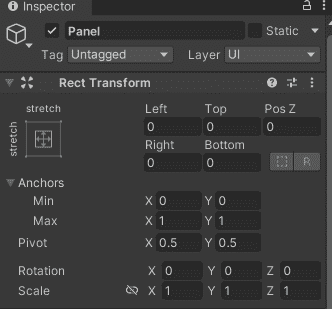

Rect Transform 组件命令 UI 元素如何在画布上显示，以及它们如何在布局中定位和锚定。[锚点](https://docs.unity3d.com/Packages/com.unity.ugui@1.0/manual/UIBasicLayout.html#anchors)是一组两个 2D 位置，它们决定了 Rect 转换将用来显示其内容的参考。

如上图所示，可以通过调整 X 和 y 的最小值和最大值来访问组件中的锚点。这些值是标准化的，即从 0 到 1，其中 0 表示屏幕的 0%，1 表示屏幕的 100%。从`Min(0,0)`到`Max(1,1)`的锚点覆盖屏幕的水平 x 100 和垂直 y 100。

通过设置矩形变换的父对象，锚点不再指向整个屏幕，而是指向其父对象的整个区域。例如，如果我的屏幕是 800×600，并且我的锚点与上图相同(`Min(0,0)`和`Max(1,1)`)，那么我的组件将跨越 800×600 个单元。但是，如果它的父对象在水平和垂直方向(400×300)占据了屏幕的一半，那么这些相同的锚点现在将跨越 400×300 个单位。

## 锚点预设

锚点不一定需要控制其组件的宽度和高度。事实上，它们既可以作为内容区域的向导，也可以控制内容必须自其对齐的参考点。通过更改锚，Rect Transform 组件将更改其标签，以匹配所使用的锚类型。

为了方便我们的工作，Unity 已经有了一系列的锚点预置，节省了我们为所有组件手动设置锚点的时间。点击矩形变换左上角的锚点图像可以找到[锚点预设](https://docs.unity3d.com/Packages/com.unity.ugui@1.0/manual/UIBasicLayout.html#anchor-presets)。

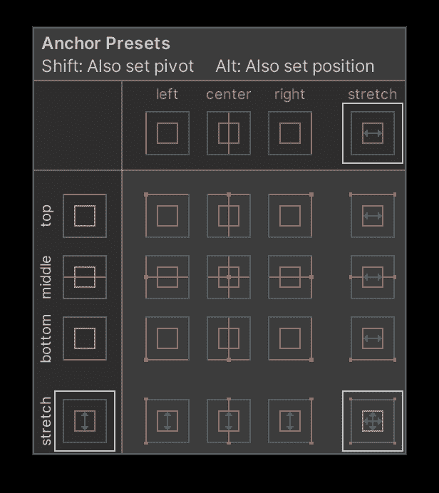

当最小值和最大值在 x、y 或两者中匹配时，Rect 变换上的相应标签将相应地改变。让我们讨论一下我们通过与锚合作可以发现的三种主要变化:

*   *   最小和最大锚点值是相同的:矩形变换控制一个锚点位置、从该锚点位置的偏移量以及内容在屏幕上跨越的特定宽度和高度。在**锚预置**中，这些都是选项中间的

*   最小锚点设置为 0，最大锚点设置为 1:矩形变换将覆盖 100%的给定轴(拉伸)。如果与前一个结合使用，它将导致**锚预置**中出现一个横向选项。如果两者都使用，那么它将导致右下角的预置。设置为拉伸的轴将有其相应的值来表示偏移。设置为不拉伸的轴(当最小值和最大值相同时)将代表另一个轴上的偏移和大小(x 轴的宽度和 y 轴的高度)

*   最小值和最大值的锚点设置为 0 到 1 之间的值(包括 0 和 1):如果这些值设置为不同的值，例如 y 的最小值为 0.02，最大值为 0.73，那么我们有一个自定义预设。使用这些值，Rect 变换将从屏幕(或父屏幕)的 2%开始，跨越到屏幕的 73%，跨越超过 71%。*注意，当使用自定义预设时，始终将其他属性(左、右、上、下)保持为 0。*T2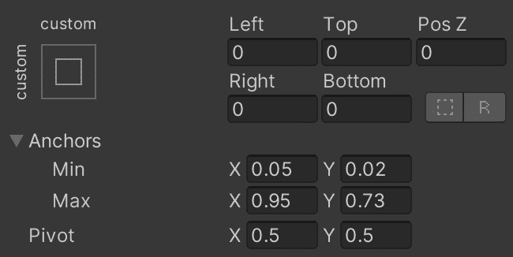T4

组合锚点来设计我们的 UI 布局有很多选择。锚定时最重要的一点是使用锚(和预设)来组织元素在屏幕上的位置以及它们在屏幕尺寸变化时的行为。

此外，考虑到即使你的屏幕尺寸在开发过程中保持不变，你也很可能会移动元素并改变它们的尺寸。为此，锚的正确使用将确保您的操作保持预期的规则和行为。

此外，考虑到父矩形变换是继承父对象的锚定和定位的重要步骤。如果一个给定的 Rect 变换被锚定在一个具有一定宽度和高度的位置，它的子对象将把它作为它们的区域，并且如果父对象也改变了，它也一定会改变。这首先是要考虑和小心的一点，但后来是向效率迈进的一步，因为我们可以简单地从父元素继承特定的位置和拉伸，并只假设它们的本地需求来构建我们的 UI 元素。

为了更好地理解这个过程和构建 UI 的良好实践，现在让我们使用上述组件模拟一个游戏的主菜单。最初，我们将只使用基本的 Unity UI 默认资源来设计组件和布局。然后我们将使用免费的资产商店资产来模拟一个最终的用户界面。

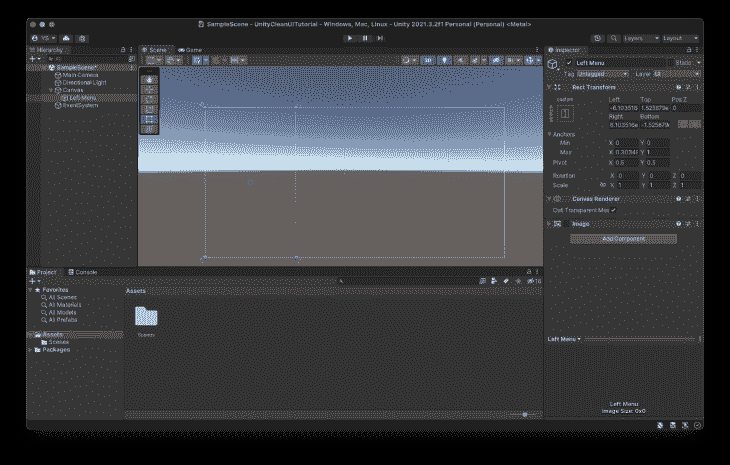

通常，在设计菜单时，我采取的第一步是创建面板，将屏幕划分为菜单的主要组件。因为我们模仿主菜单，我们将有一个左面板来保存菜单和游戏的标志。

如前所述，面板只不过是具有默认值的图像。因为我们不需要这些初始面板的图像，所以我经常禁用图像组件。我更喜欢禁用它，而不是删除它，因为我激活它来检查重叠和视觉伪像。

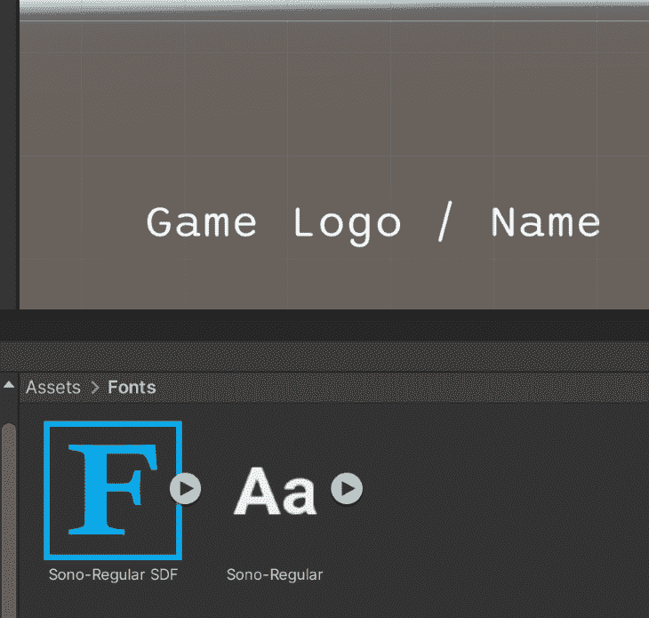

The font used is [Sono](https://www.dafont.com/sono.font) by [DaFont](https://www.dafont.com/).

作为游戏徽标的占位符，我使用了一个简单的 TextMeshPro 组件。如前所述，该组件要求您生成一个字体资源。这可以通过在你的[项目视图中右击一个字体文件，然后创建> TextMeshPro >字体资源](https://docs.unity3d.com/Packages/com.unity.textmeshpro@4.0/manual/FontAssets.html#creating-font-assets)来完成。

我们为菜单按钮使用组件的组合，给我们更好的灵活性和更容易的维护。首先，不要把它们直接放在我们创建的左边面板上，最好只为按钮创建另一个面板。

### 容纳特定内容的育儿面板

通过使用父面板，我们可以更精确地同时控制所有按钮的区域，而不是一个一个地控制。如果我们需要移动所有按钮，例如，在它们下面(或上面)添加另一个组件，我们可以通过简单地移动它们的父面板来实现。

此外，无论出于何种原因，我们都应该能够在新面板中移动所有组件，而内容仍将遵循面板在屏幕上的显示和拉伸方式。

一般来说，将你的内容分组到特定的面板中，并根据这些面板的分类建立层次结构总是一个好主意。因为任何改变都是必要的，所有有父面板都将保留其关于其父面板的特定锚。因此，没有必要对任何内容进行重大更改，因为它会保持锚定。

要实现这些操作，更换锚是至关重要的。更改其他组件不一定会在最终的 UI 分辨率更改或更新中保持相同的行为。为此，我通常推荐使用自定义锚点，如上所示，这样所有的操作都可以根据所有的组件来执行。

另一个用来保持所有按钮一致的技术是使用[自动布局](https://docs.unity3d.com/Packages/com.unity.ugui@1.0/manual/comp-UIAutoLayout.html)。更具体地说，我添加了一个[垂直布局组](https://docs.unity3d.com/Packages/com.unity.ugui@1.0/manual/script-VerticalLayoutGroup.html)，它自动地按顺序组织子元素，一个在另一个之上。

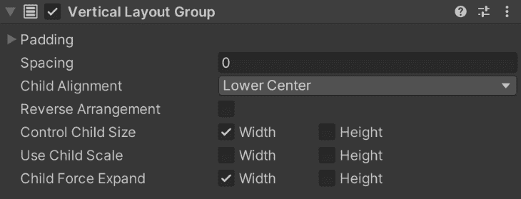

通过使用属性**控制子元素大小**和**子元素强制扩展**，分别控制每个元素的大小以及它们是否应该完全扩展以填充父元素，我们可以很容易地获得一个好的表示。

此外，我们不需要对新添加的按钮进行任何更改。当我们添加一个新按钮时，它将遵循垂直布局组中指定的顺序，并且在视觉上像其他按钮一样。只要有新按钮的空间，这种方法可以让你轻松地拥有易于扩展的菜单。

### 到目前为止的等级制度

按照前面的步骤，我们应该有一个类似上面的层次结构。请注意，随着新内容的添加，会引入新的面板来控制它们。此外，在组中没有视觉链接的组件，如游戏徽标和主菜单，在层次结构中保持为兄弟，没有父子关系。

下图显示了当我们将分辨率更改为 4:3 和 8:3 时，用户界面的反应。

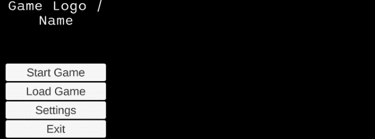

8:3 resolution

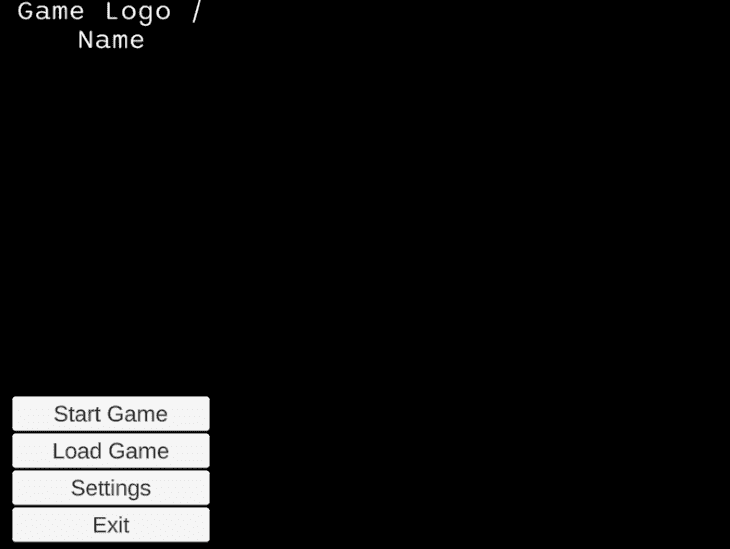

4:3 resolution

## 添加另一个窗口

这类菜单的一个共同特点是弹出其他窗口来显示更多的信息和功能。对于我们的示例，让我们看看如何通过使用这些相同的先前步骤来实现如下所示的设置窗口。

### 设置窗口面板

由于**设置**窗口在屏幕上占据了自己的空间，将它从**左侧菜单**层级中分离出来更有意义。这样，我们可以根据整个画布来设置它的锚点，而不是与**左侧菜单**相关联。我们可以通过创建一个面板作为画布的子面板来做到这一点。

对于窗口类型的 UI 元素，我经常在窗口面板中创建一个子面板来保存它的内容。如果我决定改变窗口的边框或者使用不同的图形作为背景和前景，这通常会很有帮助。

请记住，我们经常对面板使用的经验法则是，每当我们想要对具有相同意图或特征的对象进行分组时，就在层次结构中创建更多的面板。在这个特殊的例子中，我们想要创建一个新的面板来保存窗口的所有内容。

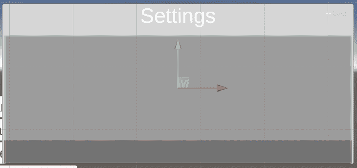

我们在为窗口内不同类型的内容创建面板时应用了相同的原则。正如在之前的图片中看到的，我们想要一些带有滑块的**设置**区域，以及带有按钮的**确认**区域。

### 返回自动布局

对于**设置**区域和**确认**区域，我们可以再次使用自动布局，根据需要快速扩展/缩小内容。更准确地说，对于**设置**区域，我们可以使用另一个垂直布局组来处理我们可能想要的滑块和其他可能的设置功能，而对于**确认**区域，我们可以使用[水平布局组](https://docs.unity3d.com/Packages/com.unity.ugui@1.0/manual/script-HorizontalLayoutGroup.html)来水平处理按钮。

### 滑块

这个窗口中我们之前没有讨论的唯一组件是[滑块](https://docs.unity3d.com/Packages/com.unity.ugui@1.0/manual/script-Slider.html)组件。滑块是一个 Unity 组件，让我们使用预定义的范围来控制数值。它允许我们选择范围(不受 0 和 1 的限制)并添加一个或多个 Unity 事件，每当滑块改变时都会调用这些事件。

滑块是我们之前讨论过的其他元素的组合，比如面板和图像。这也是一个很好的例子，说明如何组织你的层次结构，以达到类似的结果。为了在移动手柄时实现填充效果，滑块使用了一个有趣的图像属性，称为 [Fill](https://docs.unity3d.com/2019.1/Documentation/ScriptReference/UI.Image.Type.Filled.html) 。

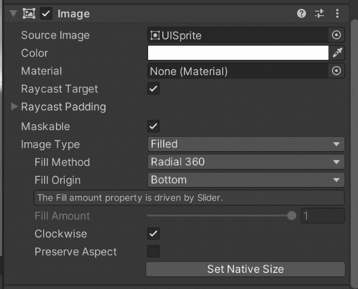

要在其他上下文中控制图像填充，您必须将**图像类型**更改为**填充**。这将显示特定的填充属性，例如图像填充了多少。虽然在这个上下文中，图像的填充是由 Slider 组件处理的，但是您可以在其他上下文中使用它。例如，制造负载棒或健康棒。

不幸的是，滑块组件没有内置文本，比如[切换](https://docs.unity3d.com/Packages/com.unity.ugui@1.0/manual/script-Toggle.html)或按钮组件。在这种情况下，为了实现滑块旁边的文本标签，使用的方法是首先创建一个新面板来保存滑块的所有内容(滑块和文本)，然后添加文本和滑块作为该面板的子对象。

如果你不断地在这个菜单中添加新的滑块，明智的做法是把它变成一个预置。

下图显示了滑块的层次结构及其内容。

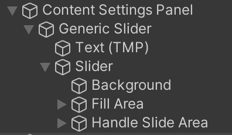

## 替换资产

现在我们有了一个基本菜单，很容易替换它的图像和元素来模拟一个合适的游戏 UI。下图显示了同样的布局，如果我们使用免费资源[黑暗主题用户界面](https://assetstore.unity.com/packages/2d/gui/dark-theme-ui-199010)、 [2D 标志模板](https://assetstore.unity.com/packages/2d/gui/icons/20-logo-templates-with-customizable-psd-vector-sources-174999)和[免费银河背景](https://assetstore.unity.com/packages/2d/free-galaxy-background-206059)，稍加调整和添加后会是什么样子。

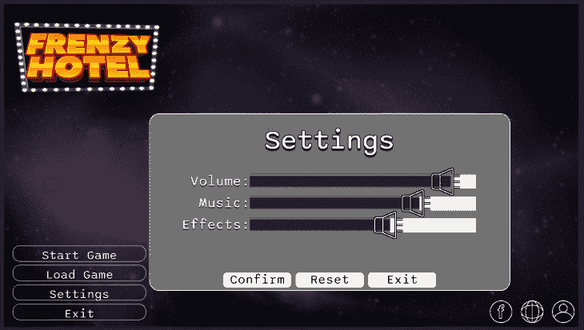

请注意，所做的主要更改是用一个图像替换 TextMeshPro，这样我就可以使用一个徽标，并在右下角为社交媒体按钮添加一个新面板。

可以使用相同的基础对其他资产进行相同的处理。接下来你可以看到这个 UI 的另一个版本，它使用了来自 [Extra Clean UI](https://assetstore.unity.com/packages/2d/gui/extra-clean-ui-138812) 、 [2D 休闲 UI HD](https://assetstore.unity.com/packages/2d/gui/icons/2d-casual-ui-hd-82080) 和[卡丁卡按钮集](https://assetstore.unity.com/packages/2d/gui/buttons-set-211824)的免费资源。

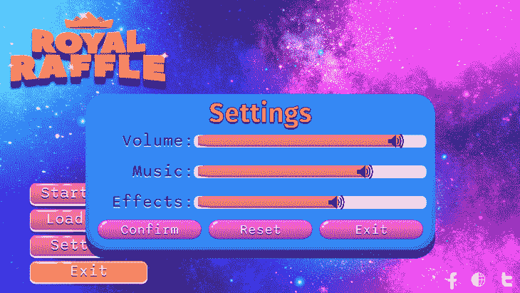

如果你读过我的其他帖子，你就会知道我非常喜欢使用后期处理效果来提高我的项目的视觉质量。对于这一个，没有什么不同。但是，让我们记住，在进一步讨论之前，需要做出一个重要的特定于 UI 的决定:画布渲染器类型。

如前所述，Canvas 有一个特定的渲染方法，它会影响 Canvas 是否会受到后期处理的影响。如果希望元素受到后期处理的影响，请将它们的画布设置在渲染模式屏幕空间中。否则，使用覆盖。

对于这个项目，我使用了 Bloom、Vignette 和颜色分级来提高菜单的视觉凝聚力和质量。下面是两个用户界面使用前后的图像。

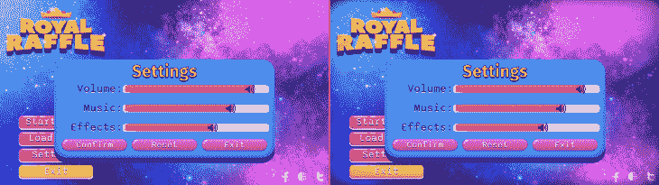

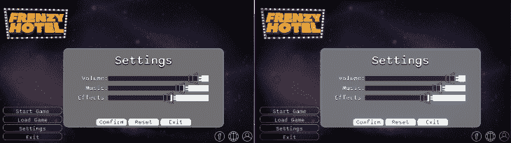

正如您所看到的，后期处理效果有助于将颜色融合在一起，从而增强了用户界面的凝聚力。此外，它有助于为闪亮的元素带来额外的味道(如带有 Bloom 效果的游戏徽标)并聚焦用户(使用晕影使边缘变暗)。

感谢您的阅读，如果您想要更多的 Unity UI 和 UI 组件策略用于快速开发和原型制作，请告诉我。你可以在 www.dagongraphics.com 看到更多我的作品。

## 使用 [LogRocket](https://lp.logrocket.com/blg/signup) 消除传统错误报告的干扰

[LogRocket](https://lp.logrocket.com/blg/signup) 是一个数字体验分析解决方案，它可以保护您免受数百个假阳性错误警报的影响，只针对几个真正重要的项目。LogRocket 会告诉您应用程序中实际影响用户的最具影响力的 bug 和 UX 问题。

然后，使用具有深层技术遥测的会话重放来确切地查看用户看到了什么以及是什么导致了问题，就像你在他们身后看一样。

LogRocket 自动聚合客户端错误、JS 异常、前端性能指标和用户交互。然后 LogRocket 使用机器学习来告诉你哪些问题正在影响大多数用户，并提供你需要修复它的上下文。

关注重要的 bug—[今天就试试 LogRocket】。](https://lp.logrocket.com/blg/signup-issue-free)