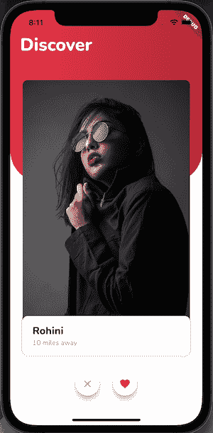
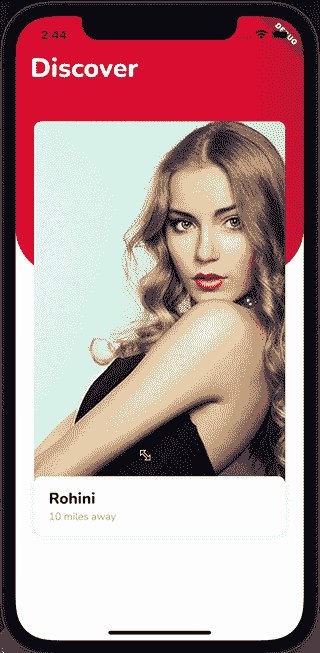
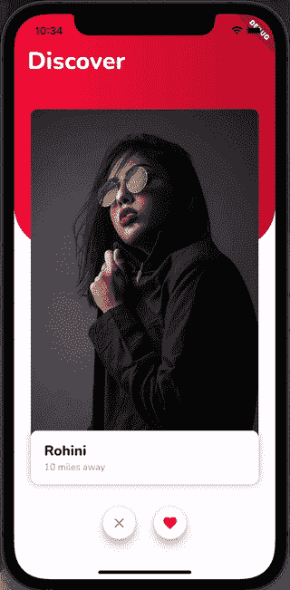
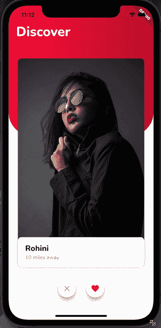

# 创建一个刷卡约会应用程序

> 原文：<https://blog.logrocket.com/create-flutter-dating-app-swipe-cards/>

你知道 Tinder 吧？如果你在过去的几年里没有生活在岩石下，你一定听说过这个神奇的约会应用程序。你已经抓住了几十个潜在的爱情兴趣，并对你最喜欢的人做出了承诺。

现在我们将学习如何使用 Flutter 开发一个类似于 Tinder 的约会应用程序。这篇文章是写给已经在 Flutter 中做过一些开发并且有中级经验的读者的。

所以，在这篇文章结束时，这就是我们的约会应用程序的样子😍：

[](https://blog.logrocket.com/create-flutter-dating-app-swipe-cards/final-dating-app-3/)

这些是一些关键的类和部件，我们将混合和匹配它们来开发我们想要的东西:

以下是我们将要介绍的内容:

## 我们的 Flutter 约会应用

这个应用很简单:向右滑动表示喜欢，向左滑动表示不喜欢。正如你在上面的截图中看到的，我们有一个红色的弧形背景，上面有一堆不同简介的卡片。此外，卡片下面是喜欢和不喜欢按钮，我们可以用它们来代替刷卡。

### 从基本牌叠开始

让我们将这个 UI 分成两个小部件:

*   `BackgroundCurveWidget` —这是背景中的红色弧形渐变小部件
*   这个小部件将包含一叠卡片以及喜欢和不喜欢按钮

下面是`BackgroundCurveWidget`的代码:

```
class BackgroudCurveWidget extends StatelessWidget {
  const BackgroudCurveWidget({Key? key}) : super(key: key);

  @override
  Widget build(BuildContext context) {
    return Container(
      width: double.infinity,
      height: 350,
      decoration: const ShapeDecoration(
        shape: RoundedRectangleBorder(
          borderRadius: BorderRadius.only(
            bottomLeft: Radius.circular(64),
            bottomRight: Radius.circular(64),
          ),
        ),
        gradient: LinearGradient(
          colors: <Color>[
            Color(0xFFFD0E42),
            Color(0xFFC30F31),
          ],
        ),
      ),
      child: const Padding(
        padding: EdgeInsets.only(top: 46.0, left: 20.0),
        child: Text(
          'Discover',
          style: TextStyle(
            fontFamily: 'Nunito',
            fontWeight: FontWeight.w800,
            color: Colors.white,
            fontSize: 36,
          ),
        ),
      ),
    );
  }
}

```

> 注意:我们正在使用自定义字体，你可以[在这里](https://blog.logrocket.com/use-custom-fonts-flutter/)了解更多关于实现自定义字体的信息。

`BackgroundCurvedWidget`是一个简单的小部件，由一个带有`ShapeDecoration`的`Container`组成，它弯曲左下角和右下角，并使用红色线性渐变颜色作为背景。

现在我们有了`BackgoundCurveWidget`，我们将把它和我们将要创建的`CardsStackWidget`一起放在一个`Stack`小部件中:

```
class MyApp extends StatelessWidget {
  const MyApp({Key? key}) : super(key: key);

  @override
  Widget build(BuildContext context) {
    return MaterialApp(
      home: Scaffold(
        backgroundColor: Colors.white,
        body: Stack(
          children: const [
            BackgroudCurveWidget(),
            CardsStackWidget(),
          ],
        ),
      ),
    );
  }
}

```

## 创建个人资料卡

要继续，我们必须首先创建`CardStacksWidget`将持有的个人资料卡。如前一个截图所示，个人资料卡包括一个垂直图像以及该人的姓名和距离。

我们将创建一个模型类来保存 profile 卡所需的所有信息:

```
class Profile {
  const Profile({
    required this.name,
    required this.distance,
    required this.imageAsset,
  });
  final String name;
  final String distance;
  final String imageAsset;
}

```

现在我们已经为概要文件准备好了模型类，这就是我们实现`CardsStackWidget`的`ProfileCard`的方式:

```
class ProfileCard extends StatelessWidget {
  const ProfileCard({Key? key, required this.profile}) : super(key: key);
  final Profile profile;

  @override
  Widget build(BuildContext context) {
    return Container(
      height: 580,
      width: 340,
      padding: const EdgeInsets.symmetric(vertical: 10),
      child: Stack(
        children: [
          Positioned.fill(
            child: ClipRRect(
              borderRadius: BorderRadius.circular(10),
              child: Image.asset(
                profile.imageAsset,
                fit: BoxFit.fitHeight,
              ),
            ),
          ),
          Positioned(
            bottom: 0,
            child: Container(
              height: 80,
              width: 340,
              decoration: ShapeDecoration(
                color: Colors.white,
                shape: RoundedRectangleBorder(
                  borderRadius: BorderRadius.circular(10),
                ),
                shadows: <BoxShadow>[
                  BoxShadow(
                    color: Colors.black.withOpacity(0.05),
                    blurRadius: 8,
                  ),
                ],
              ),
              child: Padding(
                padding: const EdgeInsets.only(left: 20),
                child: Column(
                  crossAxisAlignment: CrossAxisAlignment.start,
                  mainAxisAlignment: MainAxisAlignment.center,
                  children: [
                    Text(
                      profile.name,
                      style: const TextStyle(
                        fontFamily: 'Nunito',
                        fontWeight: FontWeight.w800,
                        fontSize: 21,
                      ),
                    ),
                    Text(
                      profile.distance,
                      style: const TextStyle(
                        fontFamily: 'Nunito',
                        fontWeight: FontWeight.w400,
                        fontSize: 14,
                        color: Colors.grey,
                      ),
                    ),
                  ],
                ),
              ),
            ),
          ),
        ],
      ),
    );
  }
}

```

`ProfileCard`的代码由一个包含图像的`Stack`小部件组成。这个图像使用`Positioned.fill`和底部的另一个`Positioned`小部件填充了`Stack`，这个小部件是一个`Container`，它有一个圆形的边框，保存了`ProfileCard`的标题和距离文本。

既然我们的`ProfileCard`已经完成，我们必须进入下一步，那就是构建一个可拖动的小部件，可以向左或向右滑动，就像 Tinder 应用程序一样。我们还希望这个小部件显示一个标签，指示用户是否喜欢刷卡，这样用户就可以查看更多信息。

## 使`ProfileCard`可拖动

在深入研究代码之前，让我们先看一下`ValueNotifier`、`ValueListenableBuilder`和`Draggable`小部件，因为您需要很好地掌握这些来理解组成我们的`DragWidget`的代码。

*   ValueNotifier:简单来说，就是一个`ChangeNotifier`只能保存一个值
*   ValueListenableBuilder:这个小部件将一个`ValueNotifier`作为属性，并在`ValueNotifier`的值更新或更改时重新构建自己
*   Draggable:顾名思义，它是一个可以向任何方向拖动的小部件，直到它落在一个`DragTarget`上，这个`DragTarget`又是一个小部件；它接受一个`Draggable`小部件。每个`Draggable`小部件都携带一些数据，当它接受被丢弃的小部件时，这些数据被传输到`DragTarget`

> 注意:我们以这种方式声明一个名为`Swipe`的枚举。

```
enum Swipe { left, right, none }

```

现在让我们来看看我们的`DragWidget`代码是什么样子的:

```
class DragWidget extends StatefulWidget {
  const DragWidget({
    Key? key,
    required this.profile,
    required this.index,
  }) : super(key: key);
  final Profile profile;
  final int index;

  @override
  State<DragWidget> createState() => _DragWidgetState();
}

class _DragWidgetState extends State<DragWidget> {
  ValueNotifier<Swipe> swipeNotifier = ValueNotifier(Swipe.none);

  @override
  Widget build(BuildContext context) {
    return Center(
      child: Draggable<int>(
        // Data is the value this Draggable stores.
        data: widget.index,
        feedback: Material(
          color: Colors.transparent,
          child: ValueListenableBuilder(
            valueListenable: swipeNotifier,
            builder: (context, swipe, _) {
              return RotationTransition(
                turns: swipe != Swipe.none
                    ? swipe == Swipe.left
                        ? const AlwaysStoppedAnimation(-15 / 360)
                        : const AlwaysStoppedAnimation(15 / 360)
                    : const AlwaysStoppedAnimation(0),
                child: Stack(
                  children: [
                    ProfileCard(profile: widget.profile),
                    swipe != Swipe.none
                        ? swipe == Swipe.right
                            ? Positioned(
                                top: 40,
                                left: 20,
                                child: Transform.rotate(
                                  angle: 12,
                                  child: TagWidget(
                                    text: 'LIKE',
                                    color: Colors.green[400]!,
                                  ),
                                ),
                              )
                            : Positioned(
                                top: 50,
                                right: 24,
                                child: Transform.rotate(
                                  angle: -12,
                                  child: TagWidget(
                                    text: 'DISLIKE',
                                    color: Colors.red[400]!,
                                  ),
                                ),
                              )
                        : const SizedBox.shrink(),
                  ],
                ),
              );
            },
          ),
        ),
        onDragUpdate: (DragUpdateDetails dragUpdateDetails) {
                    // When Draggable widget is dragged right
          if (dragUpdateDetails.delta.dx > 0 &&
              dragUpdateDetails.globalPosition.dx >
                  MediaQuery.of(context).size.width / 2) {
            swipeNotifier.value = Swipe.right;
          }
          // When Draggable widget is dragged left
          if (dragUpdateDetails.delta.dx < 0 &&
              dragUpdateDetails.globalPosition.dx <
                  MediaQuery.of(context).size.width / 2) {
            swipeNotifier.value = Swipe.left;
          }
        },
        onDragEnd: (drag) {
          swipeNotifier.value = Swipe.none;
        },

        childWhenDragging: Container(
          color: Colors.transparent,
        ),

        child: ProfileCard(profile: widget.profile),
      ),
    );
  }
}

```

这就是`DragTarget`小部件的工作方式:

1.  向`DragWidget`传递两个参数:profile 和 index。`Profile`对象拥有应该出现在`ProfileCard`上的所有信息，而`index`对象包含卡片的索引，该索引作为`data`参数传递给`Draggable`小部件。如果用户将`DragWidget`拖放到`DragTarget`，该数据将被传输。
2.  `Draggable`小部件接受两个属性:`onDragUpdate`和`onDragEnd`:
    *   **onDragUpdate** —当`Draggable`被拖动时，这个方法被调用。我们在这个回调函数中验证卡片是向左还是向右拖动，然后更新`swipeNotifier`值，这将重建我们的`ValueListenableBuilder`
    *   **onDragEnd** —当拖拽被放下时，这个函数被调用。在这次回调中，我们正在重置`swipeNotifer`值
3.  `Draggable`小部件将三个小部件作为属性:`child`、`feedback`和`childWhenDragging`:
    *   `child` —当`Draggable`小部件没有被向任何方向拖动，并且现在处于静止位置时，显示该小部件。我们将把`ProfileCard`小部件传递给`child`属性，这样它将成为默认 UI
    *   `feedback` —当拖动正在进行时，此小部件出现。反馈属性被赋予了一个`ValueListenableBuilder`，每当`swipeNotifier`的值改变时`ValueListenableBuilder`就会重新构建自己，返回一个`RotationTransition`小部件，它会根据`swipeNotifer`的值旋转自己。带有`ProfileCard`和`TagWidget`的`Stack`小部件是`RotationTransition`的子部件。当向左或向右拖动小部件时，`TagWidget`会在`ProfileCard`小部件上方显示喜欢和不喜欢标签文本

`childWhileDragging` —当拖动正在进行时，这个小部件将代替子部件出现。在我们的场景中，`childWhenDragging`属性被赋予了一个透明的`Container`，使得当`feedback`小部件出现时子部件不可见。这是我们在`DragWidget`中使用的`TagWidget`的代码，用于在`ProfileCard`顶部显示喜欢和不喜欢的文本:

```
class TagWidget extends StatelessWidget {
  const TagWidget({
    Key? key,
    required this.text,
    required this.color,
  }) : super(key: key);
  final String text;
  final Color color;

  @override
  Widget build(BuildContext context) {
    return Container(
      padding: const EdgeInsets.symmetric(horizontal: 12),
      decoration: ShapeDecoration(
        shape: RoundedRectangleBorder(
          borderRadius: BorderRadius.circular(10),
          side: BorderSide(
            color: color,
            width: 4,
          ),
        ),
      ),
      child: Text(
        text,
        style: TextStyle(
          color: color,
          fontSize: 36,
        ),
      ),
    );
  }
}

```

[](https://blog.logrocket.com/create-flutter-dating-app-swipe-cards/dragged-and-rotated-profile-card-4/)

祝贺你走到这一步，并创建了一个拖动和旋转的个人资料卡。在下一步中，我们将学习如何构建一叠可以放入`DragTarget`的卡片。

## 用`DragTarget`建立一堆可拖动的卡片

我们的`DragWidget`之前只有两个参数。现在，我们在`CardsStackWidget`中声明`swipeNotifier`，并将它传递给`DragWidget`。作为改变的结果，`DragWidget`的`Stateful`类看起来像这样:

```
class DragWidget extends StatefulWidget {
  const DragWidget(
      {Key? key,
      required this.profile,
      required this.index,
      required this.swipeNotifier})
      : super(key: key);
  final Profile profile;
  final int index;
  final ValueNotifier<Swipe> swipeNotifier;

  @override
  State<DragWidget> createState() => _DragWidgetState();
}

```

现在我们已经对`DragWidget`做了必要的修改，是时候看看`CardsStackWidget`代码了:

```
class CardsStackWidget extends StatefulWidget {
  const CardsStackWidget({Key? key}) : super(key: key);

  @override
  State<CardsStackWidget> createState() => _CardsStackWidgetState();
}

class _CardsStackWidgetState extends State<CardsStackWidget> {
  List<Profile> dragabbleItems = [
    const Profile(
        name: 'Rohini',
        distance: '10 miles away',
        imageAsset: 'assets/images/avatar_1.png'),
    const Profile(
        name: 'Rohini',
        distance: '10 miles away',
        imageAsset: 'assets/images/avatar_2.png'),
    const Profile(
        name: 'Rohini',
        distance: '10 miles away',
        imageAsset: 'assets/images/avatar_3.png'),
    const Profile(
        name: 'Rohini',
        distance: '10 miles away',
        imageAsset: 'assets/images/avatar_4.png'),
    const Profile(
        name: 'Rohini',
        distance: '10 miles away',
        imageAsset: 'assets/images/avatar_5.png'),
  ];

  ValueNotifier<Swipe> swipeNotifier = ValueNotifier(Swipe.none);

  @override
  Widget build(BuildContext context) {
    return Stack(
      clipBehavior: Clip.none,
      children: [
        ClipRRect(
          borderRadius: BorderRadius.circular(10),
          child: ValueListenableBuilder(
            valueListenable: swipeNotifier,
            builder: (context, swipe, _) => Stack(
              clipBehavior: Clip.none,
              alignment: Alignment.center,
              children: List.generate(dragabbleItems.length, (index) {
                return DragWidget(
                  profile: dragabbleItems[index],
                  index: index,
                  swipeNotifier: swipeNotifier,
                );
              }),
            ),
          ),
        ),
        Positioned(
          left: 0,
          child: DragTarget<int>(
            builder: (
              BuildContext context,
              List<dynamic> accepted,
              List<dynamic> rejected,
            ) {
              return IgnorePointer(
                child: Container(
                  height: 700.0,
                  width: 80.0,
                  color: Colors.transparent,
                ),
              );
            },
            onAccept: (int index) {
              setState(() {
                dragabbleItems.removeAt(index);
              });
            },
          ),
        ),
        Positioned(
          right: 0,
          child: DragTarget<int>(
            builder: (
              BuildContext context,
              List<dynamic> accepted,
              List<dynamic> rejected,
            ) {
              return IgnorePointer(
                child: Container(
                  height: 700.0,
                  width: 80.0,
                  color: Colors.transparent,
                ),
              );
            },
            onAccept: (int index) {
              setState(() {
                dragabbleItems.removeAt(index);
              });
            },
          ),
        ),
      ],
    );
  }
}

```

如你所见，我们又一次对三个孩子使用了`Stack`;让我们分别来看一看:

1.  第一个孩子是另一个`Stack`，在一个`ValueListenableBuilder`中有一个`DragWidget`列表，当顶部小部件被拖放到一个`DragTarget`中时，它将重建或刷新孩子
2.  第二个子节点`DragTarget`位于左侧，当它被放入`DragTarget`时，接受一个`Draggable`小部件
3.  第三个孩子也是一个位于右侧的`DragTarget`,当它被放入一个`Draggable`小部件中时，它会接收这个小部件

我们用`IgnorePointer`将透明的`Container`包装在`DragTarget`中，这样我们就可以将手势传递给底层的`Draggable`小部件。此外，当`DragTarget`接受一个可拖动的小部件时，我们调用`setState`并在给定的`index`从`draggableItems`中移除孩子。

到目前为止，我们已经创建了一堆小部件，可以拖放到喜欢和不喜欢的位置；剩下唯一要做的就是在屏幕底部创建两个动作按钮。用户可以点击这两个动作按钮来喜欢和不喜欢，而不是刷卡。

我们将在下一节看到如何在屏幕底部制作动作按钮。

## 制作喜欢和不喜欢的动作按钮

动作按钮将是一个简单的小部件，显示一个带有圆形边框的`icon`，当它们被点击时，会产生向左或向右的滑动。

这是我们必须实现的目标:

[](https://blog.logrocket.com/create-flutter-dating-app-swipe-cards/like-buttons/)

这是我们的`ActionButtonWidget`的样子:

```
class ActionButtonWidget extends StatelessWidget {
  const ActionButtonWidget(
      {Key? key, required this.onPressed, required this.icon})
      : super(key: key);
  final VoidCallback onPressed;
  final Icon icon;

  @override
  Widget build(BuildContext context) {
    return Material(
      shape: const CircleBorder(),
      child: Card(
        elevation: 10,
        shape: RoundedRectangleBorder(
          borderRadius: BorderRadius.circular(35.0),
        ),
        child: IconButton(onPressed: onPressed, icon: icon),
      ),
    );
  }
}

```

`ActionButtonWidget`需要一个`icon`和一个`VoidCallback`函数，当用户点击按钮时会调用这个函数，如上面的代码所示。

为了利用`ActionButtonWidget`并让我们的卡在按下这些按钮时向左或向右滑动，我们需要对`CardsStackWidget`做一些修改。

为了完成这款应用，我们需要做一些改动:

1.  1.  首先，我们将声明一个添加监听器的`AnimationController`。这个监听器从`draggableItems`中删除最后一个元素，重置动画，并将`swipeNotifier`的值设置为`Swipe.none` :

        ```
        late final AnimationController _animationController;    @override   void initState() {     super.initState();     _animationController = AnimationController(       duration: const Duration(milliseconds: 500),       vsync: this,     );     _animationController.addStatusListener((status) {       if (status == AnimationStatus.completed) {         draggableItems.removeLast();         _animationController.reset();  swipeNotifier.value = Swipe.none;   } }); } 
        ```

    2.  之后，我们需要把动作按钮放在卡片下面。为此，我们将创建一个包含两个`ActionButtonWidgets`子元素的行，我们将使用`Positioned`小部件来放置它们。在`onPressed`内部，我们设置`swipeNotifier`值并调用`_animationController.forward()`来启动动画:

        ```
        Positioned(           bottom: 10,           left: 0,           right: 0,           child: Padding(             padding: const EdgeInsets.only(bottom: 46.0),             child: Row(               mainAxisAlignment: MainAxisAlignment.center,               children: [                 ActionButtonWidget(                   onPressed: () {                     swipeNotifier.value = Swipe.left;                     _animationController.forward();                   },                   icon: const Icon(                     Icons.close,                     color: Colors.grey,                   ),                 ),                 const SizedBox(width: 20),                 ActionButtonWidget(                   onPressed: () {                     swipeNotifier.value = Swipe.right;                     _animationController.forward();                   },                   icon: const Icon(                     Icons.favorite,                     color: Colors.red,                   ),                 ),               ],             ),           ),         ), 
        ```

    3.  接下来，我们将更新我们的`ValueListenableBuilder`来得到一个子元素列表，其中最后一个元素将使用`PositionedTransition`和`RotationTransition`来制作一个带有旋转的滑动动画:

```
ValueListenableBuilder(
            valueListenable: swipeNotifier,
            builder: (context, swipe, _) => Stack(
              clipBehavior: Clip.none,
              alignment: Alignment.center,
              children: List.generate(draggableItems.length, (index) {
                if (index == draggableItems.length - 1) {
                  return PositionedTransition(
                    rect: RelativeRectTween(
                      begin: RelativeRect.fromSize(
                          const Rect.fromLTWH(0, 0, 580, 340),
                          const Size(580, 340)),
                      end: RelativeRect.fromSize(
                          Rect.fromLTWH(
                              swipe != Swipe.none
                                  ? swipe == Swipe.left
                                      ? -300
                                      : 300
                                  : 0,
                              0,
                              580,
                              340),
                          const Size(580, 340)),
                    ).animate(CurvedAnimation(
                      parent: _animationController,
                      curve: Curves.easeInOut,
                    )),
                    child: RotationTransition(
                      turns: Tween<double>(
                              begin: 0,
                              end: swipe != Swipe.none
                                  ? swipe == Swipe.left
                                      ? -0.1 * 0.3
                                      : 0.1 * 0.3
                                  : 0.0)
                          .animate(
                        CurvedAnimation(
                          parent: _animationController,
                          curve:
                              const Interval(0, 0.4, curve: Curves.easeInOut),
                        ),
                      ),
                      child: DragWidget(
                        profile: draggableItems[index],
                        index: index,
                        swipeNotifier: swipeNotifier,
                        isLastCard: true,
                      ),
                    ),
                  );
                } else {
                  return DragWidget(
                    profile: draggableItems[index],
                    index: index,
                    swipeNotifier: swipeNotifier,
                  );
                }
              }),
            ),
          ),

```

如果你仔细观察代码，你会发现我们在最后一个卡片堆栈中添加了一个新的参数，即`isLastCard`。这告诉`DragWidget`当我们使用动作按钮而不是刷卡时，显示喜欢和不喜欢的标签。

当我们传递一个新的参数`isLastCard`时，我们需要对`DragWidget`做一些必要的修改。这是必须做出的两项改变:

1.  在`DragWidget`中添加一个名为`isLastCard`的新 Bool 实例变量
2.  调整`Draggable`小工具的`child`参数，当我们点击动作按钮时显示喜欢和不喜欢的文本，因为我们没有刷卡。因此，`feedback`将不再可见，我们将不得不修改`child`来显示标签

下面是经过必要修改的`DragWidget`:

```
class DragWidget extends StatefulWidget {
  const DragWidget({
    Key? key,
    required this.profile,
    required this.index,
    required this.swipeNotifier,
    this.isLastCard = false,
  }) : super(key: key);
  final Profile profile;
  final int index;
  final ValueNotifier<Swipe> swipeNotifier;
  final bool isLastCard;

  @override
  State<DragWidget> createState() => _DragWidgetState();
}

class _DragWidgetState extends State<DragWidget> {
  @override
  Widget build(BuildContext context) {
    return Center(
      child: Draggable<int>(
        // Data is the value this Draggable stores.
        data: widget.index,
        feedback: Material(
          color: Colors.transparent,
          child: ValueListenableBuilder(
            valueListenable: widget.swipeNotifier,
            builder: (context, swipe, _) {
              return RotationTransition(
                turns: widget.swipeNotifier.value != Swipe.none
                    ? widget.swipeNotifier.value == Swipe.left
                        ? const AlwaysStoppedAnimation(-15 / 360)
                        : const AlwaysStoppedAnimation(15 / 360)
                    : const AlwaysStoppedAnimation(0),
                child: Stack(
                  children: [
                    ProfileCard(profile: widget.profile),
                    widget.swipeNotifier.value != Swipe.none
                        ? widget.swipeNotifier.value == Swipe.right
                            ? Positioned(
                                top: 40,
                                left: 20,
                                child: Transform.rotate(
                                  angle: 12,
                                  child: TagWidget(
                                    text: 'LIKE',
                                    color: Colors.green[400]!,
                                  ),
                                ),
                              )
                            : Positioned(
                                top: 50,
                                right: 24,
                                child: Transform.rotate(
                                  angle: -12,
                                  child: TagWidget(
                                    text: 'DISLIKE',
                                    color: Colors.red[400]!,
                                  ),
                                ),
                              )
                        : const SizedBox.shrink(),
                  ],
                ),
              );
            },
          ),
        ),
        onDragUpdate: (DragUpdateDetails dragUpdateDetails) {
          if (dragUpdateDetails.delta.dx > 0 &&
              dragUpdateDetails.globalPosition.dx >
                  MediaQuery.of(context).size.width / 2) {
            widget.swipeNotifier.value = Swipe.right;
          }
          if (dragUpdateDetails.delta.dx < 0 &&
              dragUpdateDetails.globalPosition.dx <
                  MediaQuery.of(context).size.width / 2) {
            widget.swipeNotifier.value = Swipe.left;
          }
        },
        onDragEnd: (drag) {
          widget.swipeNotifier.value = Swipe.none;
        },

        childWhenDragging: Container(
          color: Colors.transparent,
        ),

        //This will be visible when we press action button
        child: ValueListenableBuilder(
            valueListenable: widget.swipeNotifier,
            builder: (BuildContext context, Swipe swipe, Widget? child) {
              return Stack(
                children: [
                  ProfileCard(profile: widget.profile),
                  // heck if this is the last card and Swipe is not equal to Swipe.none
                  swipe != Swipe.none && widget.isLastCard
                      ? swipe == Swipe.right
                          ? Positioned(
                              top: 40,
                              left: 20,
                              child: Transform.rotate(
                                angle: 12,
                                child: TagWidget(
                                  text: 'LIKE',
                                  color: Colors.green[400]!,
                                ),
                              ),
                            )
                          : Positioned(
                              top: 50,
                              right: 24,
                              child: Transform.rotate(
                                angle: -12,
                                child: TagWidget(
                                  text: 'DISLIKE',
                                  color: Colors.red[400]!,
                                ),
                              ),
                            )
                      : const SizedBox.shrink(),
                ],
              );
            }),
      ),
    );
  }
}

```

这是我们的更新后的`CardsStackWidget`代码在进行了上面讨论的所有修改以及`DragWidget`变更后的样子:

```
class CardsStackWidget extends StatefulWidget {
  const CardsStackWidget({Key? key}) : super(key: key);

  @override
  State<CardsStackWidget> createState() => _CardsStackWidgetState();
}

class _CardsStackWidgetState extends State<CardsStackWidget>
    with SingleTickerProviderStateMixin {
  List<Profile> draggableItems = [
    const Profile(
        name: 'Rohini',
        distance: '10 miles away',
        imageAsset: 'assets/images/avatar_1.png'),
    const Profile(
        name: 'Rohini',
        distance: '10 miles away',
        imageAsset: 'assets/images/avatar_2.png'),
    const Profile(
        name: 'Rohini',
        distance: '10 miles away',
        imageAsset: 'assets/images/avatar_3.png'),
    const Profile(
        name: 'Rohini',
        distance: '10 miles away',
        imageAsset: 'assets/images/avatar_4.png'),
    const Profile(
        name: 'Rohini',
        distance: '10 miles away',
        imageAsset: 'assets/images/avatar_5.png'),
  ];

  ValueNotifier<Swipe> swipeNotifier = ValueNotifier(Swipe.none);
  late final AnimationController _animationController;

  @override
  void initState() {
    super.initState();
    _animationController = AnimationController(
      duration: const Duration(milliseconds: 500),
      vsync: this,
    );
    _animationController.addStatusListener((status) {
      if (status == AnimationStatus.completed) {
        draggableItems.removeLast();
        _animationController.reset();

        swipeNotifier.value = Swipe.none;
      }
    });
  }

  @override
  Widget build(BuildContext context) {
    return Stack(
      clipBehavior: Clip.none,
      children: [
        ClipRRect(
          borderRadius: BorderRadius.circular(10),
          child: ValueListenableBuilder(
            valueListenable: swipeNotifier,
            builder: (context, swipe, _) => Stack(
              clipBehavior: Clip.none,
              alignment: Alignment.center,
              children: List.generate(draggableItems.length, (index) {
                if (index == draggableItems.length - 1) {
                  return PositionedTransition(
                    rect: RelativeRectTween(
                      begin: RelativeRect.fromSize(
                          const Rect.fromLTWH(0, 0, 580, 340),
                          const Size(580, 340)),
                      end: RelativeRect.fromSize(
                          Rect.fromLTWH(
                              swipe != Swipe.none
                                  ? swipe == Swipe.left
                                      ? -300
                                      : 300
                                  : 0,
                              0,
                              580,
                              340),
                          const Size(580, 340)),
                    ).animate(CurvedAnimation(
                      parent: _animationController,
                      curve: Curves.easeInOut,
                    )),
                    child: RotationTransition(
                      turns: Tween<double>(
                              begin: 0,
                              end: swipe != Swipe.none
                                  ? swipe == Swipe.left
                                      ? -0.1 * 0.3
                                      : 0.1 * 0.3
                                  : 0.0)
                          .animate(
                        CurvedAnimation(
                          parent: _animationController,
                          curve:
                              const Interval(0, 0.4, curve: Curves.easeInOut),
                        ),
                      ),
                      child: DragWidget(
                        profile: draggableItems[index],
                        index: index,
                        swipeNotifier: swipeNotifier,
                        isLastCard: true,
                      ),
                    ),
                  );
                } else {
                  return DragWidget(
                    profile: draggableItems[index],
                    index: index,
                    swipeNotifier: swipeNotifier,
                  );
                }
              }),
            ),
          ),
        ),
        Positioned(
          bottom: 10,
          left: 0,
          right: 0,
          child: Padding(
            padding: const EdgeInsets.only(bottom: 46.0),
            child: Row(
              mainAxisAlignment: MainAxisAlignment.center,
              children: [
                ActionButtonWidget(
                  onPressed: () {
                    swipeNotifier.value = Swipe.left;
                    _animationController.forward();
                  },
                  icon: const Icon(
                    Icons.close,
                    color: Colors.grey,
                  ),
                ),
                const SizedBox(width: 20),
                ActionButtonWidget(
                  onPressed: () {
                    swipeNotifier.value = Swipe.right;
                    _animationController.forward();
                  },
                  icon: const Icon(
                    Icons.favorite,
                    color: Colors.red,
                  ),
                ),
              ],
            ),
          ),
        ),
        Positioned(
          left: 0,
          child: DragTarget<int>(
            builder: (
              BuildContext context,
              List<dynamic> accepted,
              List<dynamic> rejected,
            ) {
              return IgnorePointer(
                child: Container(
                  height: 700.0,
                  width: 80.0,
                  color: Colors.transparent,
                ),
              );
            },
            onAccept: (int index) {
              setState(() {
                draggableItems.removeAt(index);
              });
            },
          ),
        ),
        Positioned(
          right: 0,
          child: DragTarget<int>(
            builder: (
              BuildContext context,
              List<dynamic> accepted,
              List<dynamic> rejected,
            ) {
              return IgnorePointer(
                child: Container(
                  height: 700.0,
                  width: 80.0,
                  color: Colors.transparent,
                ),
              );
            },
            onAccept: (int index) {
              setState(() {
                draggableItems.removeAt(index);
              });
            },
          ),
        ),
      ],
    );
  }
}

```

万岁！这就是我们的多功能约会应用程序。🤝

[](https://blog.logrocket.com/create-flutter-dating-app-swipe-cards/completed-dating-app/)

## 结论

在本教程中，你学习了如何用令人敬畏的动画手势制作你自己的约会应用程序。希望你继续探索新事物。

既然我们已经做好了一切准备，现在您所要做的就是运行应用程序并开始享受。

在 GitHub 上查看完整的源代码。👈

祝你好运！开心飘飘！

如果你有任何问题，请随时发表。欢迎任何反馈。

## 使用 [LogRocket](https://lp.logrocket.com/blg/signup) 消除传统错误报告的干扰

[](https://lp.logrocket.com/blg/signup)

[LogRocket](https://lp.logrocket.com/blg/signup) 是一个数字体验分析解决方案，它可以保护您免受数百个假阳性错误警报的影响，只针对几个真正重要的项目。LogRocket 会告诉您应用程序中实际影响用户的最具影响力的 bug 和 UX 问题。

然后，使用具有深层技术遥测的会话重放来确切地查看用户看到了什么以及是什么导致了问题，就像你在他们身后看一样。

LogRocket 自动聚合客户端错误、JS 异常、前端性能指标和用户交互。然后 LogRocket 使用机器学习来告诉你哪些问题正在影响大多数用户，并提供你需要修复它的上下文。

关注重要的 bug—[今天就试试 LogRocket】。](https://lp.logrocket.com/blg/signup-issue-free)