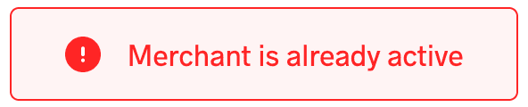
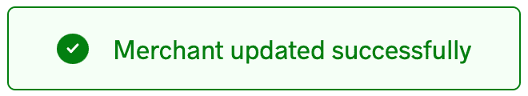

# 如何在 Nuxt.js 中创建全局自定义插件

> 原文：<https://blog.logrocket.com/create-global-custom-plugin-nuxt-js/>

Nuxt.js 和 Vue 一样支持插件，插件可以有三种类型:定制插件、Vue 插件、外部包和模块。虽然 [Nuxt 文档](https://nuxtjs.org/docs/directory-structure/plugins/)详细讨论了后两个，但它们只是简要解释了如何在 Nuxt 应用程序中构建和使用定制插件。

在一些情况下，全局定制插件可以派上用场。例如，让我们想象一下，你找不到你正试图实现的某个特性的开源插件，或者你对你找到的不完全满意。或者，也许你觉得有点创意，你有一些空闲时间。

在本教程中，我们将介绍两种不同的选择来构建我们自己的自定义插件，同时使用 Vue 和 JavaScript。例如，我们的自定义插件将在你的 Nuxt 应用程序的控制台中显示我的生日，但你可以根据你的项目需求进行个性化设置。我们开始吧！

## 构建组件

第一步是构建 Vue 组件。对于本文，我们将使用一个基本的 toast 组件来显示简单的成功和错误消息。我已经为本文构建了一个，稍后我们将详细讨论它:

```
<template>
  <div class="toast-element">
    <div :class="['toast-container', { success: state === 'success', error: state === 'error' }]">
      <div class="icon">
        <svg
          v-if="state === 'success'"
          width="8"
          height="7"
          viewBox="0 0 8 7"
          fill="none"

        >
          <path d="M6.96304 0.962891L2.88896 5.37647L1.03711 3.3703" stroke="white" stroke-width="1.5" stroke-linecap="round" stroke-linejoin="round" />
        </svg>
        <svg
          v-else
          width="3"
          height="10"
          viewBox="0 0 3 10"
          fill="none"

        >
          <path d="M1 1.6665V4.99984" stroke="white" stroke-width="2" stroke-linecap="round" stroke-linejoin="round" />
          <path d="M1 8.3335H1.00833" stroke="white" stroke-width="2" stroke-linecap="round" stroke-linejoin="round" />
        </svg>
      </div>
      <p>
        {{ message }}
      </p>
    </div>
  </div>
</template>

<script>
export default {
  data () {
    return {
      toastIsVisible: false,
      message: '',
      state: ''
    }
  },
  mounted () {
    this.$store.subscribe((mutation, state) => {
      if (mutation.type === 'toast/showToast') {
        this.message = state.toast.content
        this.state = state.toast.state
        this.toastIsVisible = true
        document.querySelector('.toast-element').classList.add('enter')
        setTimeout(() => {
          if (this.toastIsVisible) {
            this.removeToast()
          }
        }, 3000)
      }
    })
  },
  methods: {
    removeToast () {
      document.querySelector('.toast-element').classList.replace('enter', 'leave')
      setTimeout(() => {
        this.toastIsVisible = false
      }, 240)
    }
  }
}
</script>

<style scoped>
.toast-element {
  position: fixed;
  top: -90px;
  left: 0;
  width: 100%;
  height: max-content;
  display: flex;
  justify-content: center;
  align-items: center;
  z-index: 7;
  opacity: 0;
  transition: all 240ms cubic-bezier(0, 0.0, 0.2, 1) 0s;
}
.enter {
  top: 20px;
  opacity: 1;
}
.leave {
  top: 20px;
  transform: scale(0.9);
}
.toast-container {
  width: fit-content;
  border: 1px solid transparent;
  border-radius: 5px;
  padding: 0.9375rem 1.875rem;
  display: grid;
  grid-template-columns: repeat(2, max-content);
  column-gap: 0.9375rem;
  align-items: center;
}
.success {
  border-color: #037F10;
  background-color: #F4FFF6;
}
.error {
  border-color: #FF2525;
  background-color: #FFF4F4;
}
.icon {
  border-radius: 50%;
  display: flex;
}
.success .icon {
  padding: 6px;
  background-color: #037F10;
}
.error .icon {
  padding: 5px 8px 5px 9px;
  background-color: #FF2525;
}
p {
  width: max-content;
  font-size: 1.0625rem;
  font-weight: 400;
}
.success p {
  color: #037F10;
}
.error p {
  color: #FF2525;
}
</style>

```

toast 组件创建如下所示的两个按钮:



Toast component error message



Toast component success message

如果您查看 toast 组件，您会注意到对商店的`subscribe()`方法的调用。因为我们的组件是动态的，所以我们需要从某个地方获取内容，即商店。

## 故事

在我们的 toast 组件中，有两个变量，toast 消息及其状态，或者是`success`或者是`error`。[在 Vuex](https://blog.logrocket.com/managing-multiple-store-modules-vuex/) 的帮助下，我们将在我们的 Nuxt 应用程序中存储状态。因此，我们需要一个商店，最好是一个不同于应用程序一般商店的商店:

```
export const state = () => ({
  content: '',
  state: ''
})

export const mutations = {
  showToast (state, payload) {
    state.content = payload.content
    state.state = payload.state
  }
}

```

## 向商店订阅组件

现在我们的存储已经准备好了，我们需要在存储和 toast 组件之间建立一个通信通道。这里，`subscribe()`方法派上了用场，它为组件订阅了存储库的变化。因此，它在存储的每次突变后被调用，接收突变和状态对象作为参数。要了解更多关于`subscribe()`方法的信息，请查看 Vuex API 页面上的[订阅部分](https://vuex.vuejs.org/api/#subscribe)。

因为`subscribe()`方法是在存储的每次突变后调用的，所以我们需要确认 toast 存储发生了突变。一旦我们确认了这一点，我们就可以继续更新组件的变量、消息及其状态:

```
this.$store.subscribe((mutation, state) => {
  if (mutation.type === 'toast/showToast') {
    this.message = state.toast.content
    this.state = state.toast.state
    this.toastIsVisible = true
    document.querySelector('.toast-element').classList.add('enter')
    setTimeout(() => {
      if (this.toastIsVisible) {
        this.removeToast()
      }
    }, 3000)
  }
})

```

我们检查突变的类型是`toast/showToast`，因为我们的 toast 存储在`toast.js`中，并且突变是`showToast()`方法。

## 初始化插件

既然我们已经完成了组件的构建并实现了它的功能，我们需要让它在 Nuxt 应用程序中可用，这样我们就可以在需要时调用一个`show`方法来显示 toast 组件；我们将在`plugins`文件夹中这样做。

使插件在整个应用程序中可用也称为注入插件，Vue 为此提供了`inject()`函数。这反过来又给`show`方法的对象加上了一个`$`前缀:

```
export default ({ app, store }, inject) => {
  inject('toaster', {
    showToast ({ content = '', state = '' }) {
      store.commit('toast/showToast', { content, state })
    }
  })
}

```

因此，每当我们在 Nuxt 应用程序中调用这个`$toaster.showToast()`方法时，我们也需要传入`content`和`state`参数。

然而，如果你的插件是为了一些 JavaScript 功能，比如在我们的例子中，显示我的生日，那么你只需要下面的代码:

```
export default ({ app }, inject) => {
  inject('displayBirthday', () => {
    console.log(`March 3rd!`)
  })
}

```

将我的生日记录到你的控制台。对于这种情况，您不需要商店或组件。

如果您密切关注这两个代码片段，您会注意到`inject()`函数的第二个参数的类型有所不同。第一个是对象，第二个是函数。当你的插件需要多个动作时，对象类型是有用的，而函数最适合一个动作。但是，对象中只能有一个方法。

## 定义并注册插件

在我们渲染插件之前，我们的 Nuxt 应用程序需要确认 toast 插件存在。我们可以使用`nuxt.config.js`文件中的`plugins`属性来添加代码:

```
export default {
  plugins: [
    { src: '~/plugins/toaster' }
  ]
}

```

插件注入代码在`plugins/toaster.js`文件中。

## 使用插件

这样，我们的插件就可以使用了！要查看我们的插件，首先，toast 组件需要出现在页面上。然后，我们可以调用我们商店的`$toaster.showToast()`方法，并传递`content`和`state`参数:

```
this.$toaster.showToast({
  content: 'Successfully logged in!',
  state: 'success'
})

```

## 结论

在本文中，我们学习了如何使用 Vue 和 JavaScript 在 [Nuxt 应用中构建一个全局定制插件。您可以使用该组件在您的应用程序中实现不同类型的功能，当您找不到适合您项目需求的开源插件时，它会派上用场。我们还讨论了如何为插件使用组件，以及当插件不需要组件时该怎么做。](https://blog.logrocket.com/supercharge-vue-js-nuxt-js-apps-vueuse/)

虽然本教程中的示例演示了相当简单的功能，即在控制台中显示日期，但是您可以随意构建这个项目并对其进行定制以满足您的需求。要了解更多关于 Nuxt 插件的信息，我推荐查看 [Nuxt 文档](https://nuxtjs.org/docs/directory-structure/plugins/)。快乐大厦！

## 使用 [LogRocket](https://lp.logrocket.com/blg/signup) 消除传统错误报告的干扰

[](https://lp.logrocket.com/blg/signup)

[LogRocket](https://lp.logrocket.com/blg/signup) 是一个数字体验分析解决方案，它可以保护您免受数百个假阳性错误警报的影响，只针对几个真正重要的项目。LogRocket 会告诉您应用程序中实际影响用户的最具影响力的 bug 和 UX 问题。

然后，使用具有深层技术遥测的会话重放来确切地查看用户看到了什么以及是什么导致了问题，就像你在他们身后看一样。

LogRocket 自动聚合客户端错误、JS 异常、前端性能指标和用户交互。然后 LogRocket 使用机器学习来告诉你哪些问题正在影响大多数用户，并提供你需要修复它的上下文。

关注重要的 bug—[今天就试试 LogRocket】。](https://lp.logrocket.com/blg/signup-issue-free)