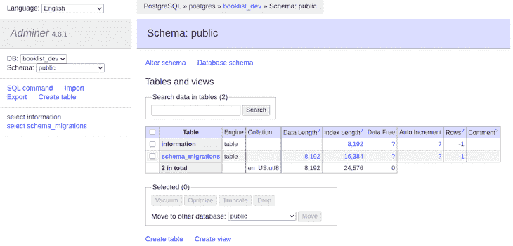
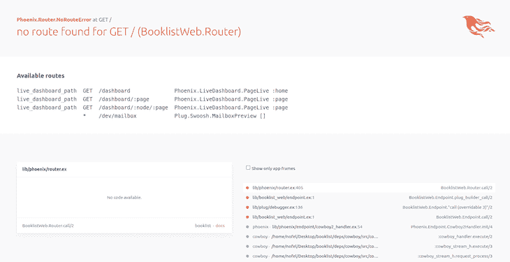
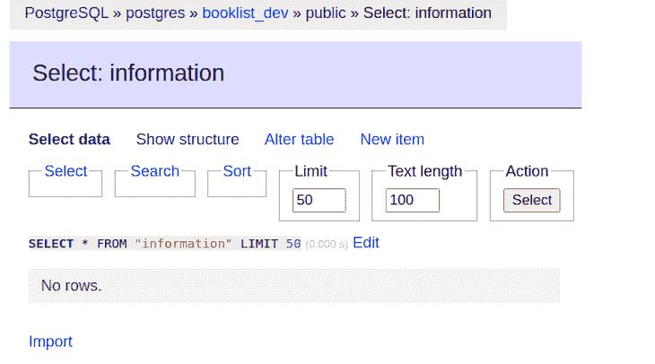
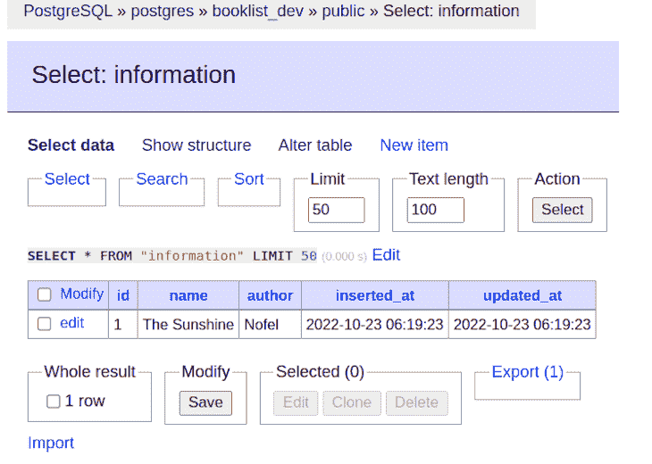
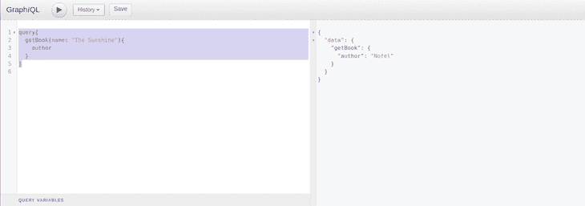
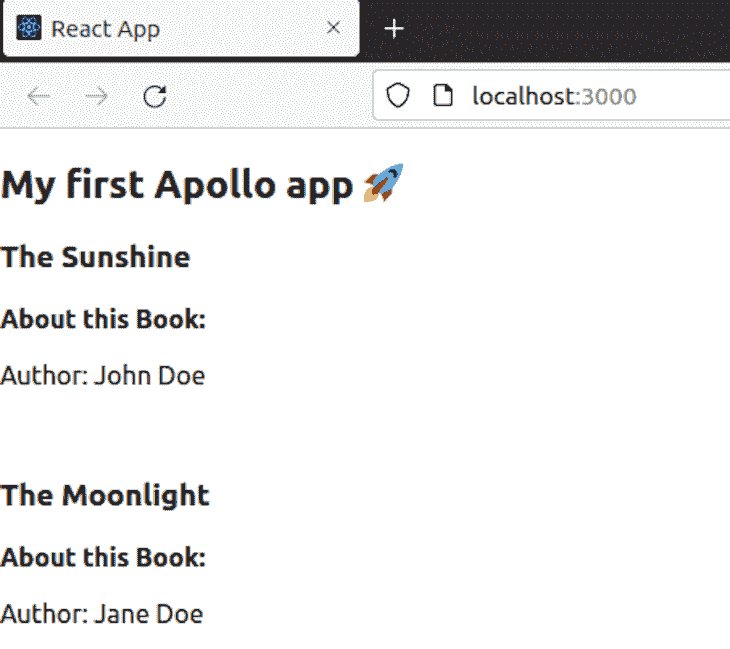

# 用 React 和 Phoenix 2 创建一个 GraphQL API

> 原文：<https://blog.logrocket.com/create-graphql-api-react-phoenix-2/>

自 21 世纪初以来，软件工程师一直使用 REST APIs 来查询和变异数据。毫无疑问，REST 是一种很好的访问资源的方式，但是当涉及到特定性时，REST 模型效率不高。

GraphQL 是一种新的工具，它使开发人员能够根据特殊性访问资源，从而有效地消耗资源。由于 GraphQL 提供的灵活性，社区已经开始构建实用程序，以便在他们喜欢的语言中使用 GraphQL。

一个这样的例子是 Absinthe，它是用 Elixir 开发的库，Elixir 是一种基于 Erlang 的函数式编程语言。苦艾酒与凤凰网服务器一起使用，凤凰网服务器是用长生不老药构建的，并且越来越受欢迎。

在这篇文章中，我们将使用 Phoenix 构建我们的第一个 GraphQL API，并将其与 React 应用程序连接。

## 先决条件

要充分利用本教程，您需要:

*   对 JavaScript、React 和 Docker 有基本的了解
*   熟悉 Elixir 语法
*   客户端和服务器交互的知识

我们将涵盖:

## 环境设置

要设置我们的环境，我们需要安装:

### 安装药剂

打开您的终端并运行以下命令:

```
$ wget https://packages.erlang-solutions.com/erlang-solutions_2.0_all.deb && sudo dpkg -i erlang-solutions_2.0_all.deb
```

```
$ sudo apt-get update
```

```
$ sudo apt-get install esl-erlang
```

```
$ sudo apt-get install elixir
```

### 安装六角头

运行以下命令:

```
$ mix local.hex
```

要检查 Elixir 和 Erlang 的版本，请运行:

```
$ elixir -v
Erlang/OTP 25 [erts-13.0.4] [source] [64-bit] [smp:8:8] [ds:8:8:10] [async-threads:1] [jit:ns]

Elixir 1.13.4 (compiled with Erlang/OTP 25)
```

### 安装 Phoenix 应用生成器

运行以下命令:

```
$ mix archive.install hex phx_new
```

### 安装 Node.js

运行这些命令:

```
$ curl -fsSL https://deb.nodesource.com/setup_19.x | sudo -E bash - &&\
```

```
$ sudo apt-get install -y nodejs
```

检查 Node.js 的版本:

```
$ node -v
```

### 安装 Docker 和 Docker 合成

运行以下命令来安装 Docker:

```
$ sudo apt-get update
```

```
$ sudo apt-get install \
    apt-transport-https \
    ca-certificates \
    curl \
    gnupg \
    lsb-release
```

```
$ curl -fsSL https://download.docker.com/linux/ubuntu/gpg | sudo gpg --dearmor -o /usr/share/keyrings/docker-archive-keyring.gpg
```

```
$ echo \
  "deb [arch=amd64 signed-by=/usr/share/keyrings/docker-archive-keyring.gpg] https://download.docker.com/linux/ubuntu \
  $(lsb_release -cs) stable" | sudo tee /etc/apt/sources.list.d/docker.list > /dev/null
```

```
$ sudo apt-get update
```

```
$ sudo apt-get install docker-ce docker-ce-cli containerd.io
```

运行以下命令安装 Docker Compose:

```
$ sudo apt install docker-compose
```

## Phoenix 应用程序设置

现在，让我们设置 Phoenix 服务器，并创建可供 GraphQL 工作区和 React 应用程序使用的资源。

运行以下命令创建服务器:

$ mix phx.new booklist -no-html

当提示获取和安装依赖项时，输入“Y”。

输出:

```
We are almost there! The following steps are missing:

    $ cd booklist

Then configure your database in config/dev.exs and run:

    $ mix ecto.create

Start your Phoenix app with:

    $ mix phx.server

You can also run your app inside IEx (Interactive Elixir) as:

    $ iex -S mix phx.server
```

### 安装苦艾酒和`absinthe_plug`依赖项

苦艾酒是为 Elixir 编写的 GraphQL 库，用于编写查询和变异。帮助我们使用 GraphQL。

在 Phoenix 中，依赖项必须手动写入 mix.ex 文件，然后使用 deps.get 命令安装添加的依赖项。它不像 npm 或 Yarn 那样工作。

要安装 absincet 和 absinthe _ plug，请在您喜欢的代码编辑器中打开您的项目，并在项目目录的根目录中，更新 mix.ex 文件，如下所示:

```
# mix.ex
Defp deps do
[
...
{:absinthe, "~> 1.7"}
{:absinthe_plug, "~> 1.5"}
]
end
```

现在，运行以下命令来安装依赖项:

```
$ mix deps.get
```

这就是我们的终端现在的样子:

```
Resolving Hex dependencies...
Dependency resolution completed:
Unchanged:
  castore 0.1.18
  connection 1.1.0
  cowboy 2.9.0
  cowboy_telemetry 0.4.0
  cowlib 2.11.0
  db_connection 2.4.2
  decimal 2.0.0
  ecto 3.9.1
  ecto_sql 3.9.0
  esbuild 0.5.0
  gettext 0.20.0
  jason 1.4.0
  mime 2.0.3
  phoenix 1.6.14
  phoenix_ecto 4.4.0
  phoenix_html 3.2.0
  phoenix_live_dashboard 0.7.1
  phoenix_live_view 0.18.2
  phoenix_pubsub 2.1.1
  phoenix_view 1.1.2
  plug 1.13.6
  plug_cowboy 2.5.2
  plug_crypto 1.2.3
  postgrex 0.16.5
  ranch 1.8.0
  swoosh 1.8.1
  telemetry 1.1.0
  telemetry_metrics 0.6.1
  telemetry_poller 1.0.0
New:
  absinthe 1.7.0
  absinthe_plug 1.5.8
  nimble_parsec 1.2.3
* Getting absinthe (Hex package)
* Getting absinthe_plug (Hex package)
* Getting nimble_parsec (Hex package)
```

### 使用 docker-compose 启动 Adminer 和 PostgreSQL

现在我们将旋转两个码头集装箱。一个将运行我们的 PostgreSQL 数据库，一个可以与 Phoenix 一起使用的关系数据库，另一个将运行 Adminer，一个全功能的数据库管理工具。

在项目的根目录中，使用以下命令创建一个文件:

```
$ touch docker-compose.yaml
```

您也可以使用代码编辑器的用户界面来创建它。你的选择！

现在，将这段代码粘贴到您的`docker-compose`文件中:

```
version: "3"
services:
  postgres:
    build: ./postgres-dev
    container_name: postgres
    ports:
      - 5432:5432
    environment:
      POSTGRES_USER: postgres
      POSTGRES_PASSWORD: postgres
      POSTGRES_DB_LIST: booklist_dev

  adminer:
    image: adminer
    container_name: adminer
    restart: always
    ports:
      - 8090:8080
    environment:
      ADMINER_DEFAULT_SERVER: postgres
```

在根目录下创建一个名为`postgres-dev`的文件夹，并创建一个 Dockerfile 和一个 Bash 文件，如下所示:

```
$ mkdir postgres-dev
```

```
$ cd postgres-dev
```

```
$ touch Dockerfile
```

在 docker 文件中，粘贴以下代码:

```
FROM postgres:latest
COPY setup-databases.sh /docker-entrypoint-initdb.d/
```

现在，在同一文件夹中创建一个新文件:

```
$ touch setup-databases.sh
```

在 Bash 文件中，粘贴以下代码:

```
#!/bin/bash

set -e
set -u

function create_user_and_database() {
    local DB=$1
    echo "  Creating user and database '$DB'"
    psql -v --username "$POSTGRES_USER" <<-EOSQL
        CREATE DATABASE $DB;
        GRANT ALL PRIVILEGES ON DATABASE $DB TO $POSTGRES_USER;
EOSQL
}

if [ -n "$POSTGRES_DB_LIST" ]; then
    echo "Multiple database creation requested: $POSTGRES_DB_LIST"
    for DB in $(echo $POSTGRES_DB_LIST | tr ',' ' '); do
        create_user_and_database $DB
    done
    echo "Multiple databases created"
fi
```

现在，从终端返回到您的根目录并运行以下代码:

```
$ docker-compose up -d -build
```

要检查我们的容器是否运行，请编写以下代码:

```
$ docker ps
```

我们的输出应该是:

```
CONTAINER ID   IMAGE      COMMAND                  CREATED          STATUS          PORTS                                       NAMES
d6831a68a985   adminer    "entrypoint.sh docke..."   13 seconds ago   Up 12 seconds   0.0.0.0:8090->8080/tcp, :::8090->8080/tcp   adminer
dca9812e757a   postgres   "docker-entrypoint.s..."   13 seconds ago   Up 12 seconds   0.0.0.0:5432->5432/tcp, :::5432->5432/tcp   postgres
```

### 为苦艾酒创建模式

模式是用执行查询的相同过程构建的蓝图。

GraphQL Workspace 是一个与 GraphQL 打包在一起的工具，用于查询和变异数据。该工具是一个用户界面，可以从浏览器访问。

现在，我们将使用在我们的模式中硬编码的测试数据，这将帮助我们理解 GraphQL 是如何工作的。成功查询样本数据后，我们将使用 PostgreSQL。

在 lib/booklist_web/中创建一个名为 schema.ex 的文件。将以下代码复制并粘贴到文件中。

```
defmodule BooklistWeb.Schema do
  use Absinthe.Schema

  @desc "A Book"
    object :book do
      field :name, :string
      field :author, :string

    end

  # Example data
  @book_information %{
    "book1" => %{id: 1, name: "Harry Potter", author: "JK Rowling"},
    "book2" => %{id: 2, name: "Charlie Factory", author: "Bernard"},
    "book3" => %{id: 3, name: "Sherlock Holmes", author: "Sheikhu"}
  }

  query do
    field :book_info, :book do
      arg :id, non_null(:id)
      resolve fn %{id: book_id}, _ ->
        {:ok, @book_information[book_id]}
      end
    end
  end
 end
```

以下是我们上面使用的代码的一些重要定义:

*   `query`:是根查询对象宏，其中不同的查询作为字段被拒绝
*   `field`:封装对象中的字段，这里是查询和对象
*   `arg`:封闭字段的参数
*   `resolve`:执行我们的查询逻辑的函数我们创建了一个对象`book`的结构和包含图书信息的测试数据。查询块是一个 GraphQL 查询，它将在我们的 GraphQL 工作区中获取这些数据。

### 为`Book`信息创建上下文

上下文是具有业务逻辑并封装数据访问及其验证的模块。它通常与数据库或 API 对话。
要为我们的图书模式创建上下文，打开您的终端并运行以下命令:

```
$ mix phx.gen.context Book Info information name:string author:string
```

输出应该是:

```
==> nimble_parsec
Compiling 4 files (.ex)
Generated nimble_parsec app
==> absinthe
Compiling 1 file (.erl)
Compiling 256 files (.ex)
Generated absinthe app
==> absinthe_plug
Compiling 18 files (.ex)
Generated absinthe_plug app
==> booklist
* creating lib/booklist/book/info.ex
* creating priv/repo/migrations/20221022130430_create_information.exs
* creating lib/booklist/book.ex
* injecting lib/booklist/book.ex
* creating test/booklist/book_test.exs
* injecting test/booklist/book_test.exs
* creating test/support/fixtures/book_fixtures.ex
* injecting test/support/fixtures/book_fixtures.ex

Remember to update your repository by running migrations:

    $ mix ecto.migrate
```

### 运行迁移

迁移是填充到关系数据库中的数据库模式/结构。在本节中，我们将运行一个迁移，在我们的`booklist_dev`数据库中创建一个名为`information`的表。我们将从管理员那里查看它。

我们还将使用官方的 Elixir 项目 [Ecto](https://hexdocs.pm/ecto/Ecto.html) ，它是一种集成的查询语言，提供了数据库包装器。

运行以下命令:

```
$ mix ecto.migrate
```

我们的输出应该是:

```
warning: the :gettext compiler is no longer required in your mix.exs.

Please find the following line in your mix.exs and remove the :gettext entry:

    compilers: [..., :gettext, ...] ++ Mix.compilers(),

  (gettext 0.20.0) lib/mix/tasks/compile.gettext.ex:5: Mix.Tasks.Compile.Gettext.run/1
  (mix 1.13.4) lib/mix/task.ex:397: anonymous fn/3 in Mix.Task.run_task/3
  (mix 1.13.4) lib/mix/tasks/compile.all.ex:92: Mix.Tasks.Compile.All.run_compiler/2
  (mix 1.13.4) lib/mix/tasks/compile.all.ex:72: Mix.Tasks.Compile.All.compile/4
  (mix 1.13.4) lib/mix/tasks/compile.all.ex:59: Mix.Tasks.Compile.All.with_logger_app/2
  (mix 1.13.4) lib/mix/tasks/compile.all.ex:36: Mix.Tasks.Compile.All.run/1

18:10:08.705 [info]  == Running 20221022130430 Booklist.Repo.Migrations.CreateInformation.change/0 forward

18:10:08.708 [info]  create table information

18:10:08.713 [info]  == Migrated 20221022130430 in 0.0s
```

下面，您可以在管理员用户界面中看到这个输出:



有一个名为`information`的表，它是由我们在上一步中运行的迁移创建的。要访问 Adminer 界面，请在浏览器中输入以下地址，并使用我们在 Docker 合成文件中使用的凭据:

运行以下命令启动您的服务器:

```
$ mix phx.server
```

在服务器启动后，我们可以点击端口 4000 上的`localhost`来使用 GraphQL 工作空间。



Phoenix 将向您展示一些您可以点击的端点，并通过用户界面探索各种可用的功能。

## 路由配置和 GraphQL 测试

要从 GraphQL 的用户界面和 API 访问它，我们必须配置适当的路由。本节将告诉您如何正确配置路由。

### 配置路由以访问图形用户界面和 API

为了进行查询和改变数据，我们需要在/lib/booklist_web/中的 router.ex 文件中添加路由。

打开 router.ex 文件，添加以下代码行:

```
scope "/api" do
    pipe_through :api
    forward("/",Absinthe.Plug, schema: MenuxcardWeb.Schema)
  end

scope "/gql" do
    forward "/GraphiQL", Absinthe.Plug.GraphiQL, schema: MenuxcardWeb.Schema
  end
```

我们现在可以使用第二条路线访问 GraphQL web 界面。在您的地址栏中输入以下 URL:
`[http://localhost:4000/gql/GraphiQL](http://localhost:4000/gql/GraphiQL)`
您现在应该会看到:


这是 GraphQL 工作区，它为 GraphQL 提取和变更数据，就像 Postman 为 REST APIs 所做的那样。首先，我们将查询我们在前面的步骤中在模式中硬编码的虚拟数据。

### 测试使用示例数据进行查询的 GraphiQL UI

我们将从虚拟数据中查询`book1`,并从服务器中获取它的名称和作者。

在 GraphQL 界面的左侧面板中运行以下查询:

```
query{
  bookInfo(id: "book1"){
    name
    author
  }
}
```

您将收到以下数据作为回报:

```
{
  "data": {
    "bookInfo": {
      "author": "JK Rowling",
      "name": "Harry Potter"
    }
  }
}
```

以下是 GraphiQL 中的输出:


### 使用图形用户界面使用 PostgreSQL 进行数据查询和变异

到目前为止，我们一直在玩虚拟数据。现在真正的乐趣开始了！

我们将直接从 PostgreSQL 数据库中查询数据并对其进行变异，并检查即时变化。



信息表是空的。让我们通过变异来填充它。首先，我们将在 schema.ex 文件中创建一个变异和查询。

清除我们在模式文件中编写的查询，并粘贴以下代码:

```
query do
    field :get_book, :book do
      arg(:id, non_null(:id))
      resolve(fn args, _ ->
        {:ok, Booklist.Book.get_info!(args)}
      end)
    end
  end

  mutation do
    field :create_book, :book do
      arg(:name, non_null(:string))
      arg(:author, non_null(:string))
      resolve(fn args, _ ->
        {:ok, Booklist.Book.create_info(args)}
      end)
    end
  end
```

将这种变化粘贴到 GraphiQL 接口中，并运行它来看看神奇之处。

```
mutation{
  createBook(name: "The Sunshine", author: "Nofel"){
   name
   author
  }
}
```

检查数据库是否有更改:



我们的更改已经插入到我们的数据库表中。万岁！

现在，为了查询这些数据，我们将在浏览器界面中使用以下查询。

```
query{
  getBook(name: "The Sunshine"){
    author
  }
}
```

以下是输出:



到目前为止，我们已经配置了我们的环境，设置了一个 Phoenix web 服务器，并使用样本数据和 PostgreSQL 数据进行了几次查询和修改。

在下一节中，我们将创建我们的 React 前端，并将其连接到我们的 GraphQL 服务器。

### 创建 React 项目

在本节中，我们将创建一个带有图书列表组件的 React 应用程序，该应用程序将使用 React 的 GraphQL 库 [Apollo](https://blog.logrocket.com/graphql-local-state-management-apollo/) 从 PostgreSQL 获取数据。

要创建 React 项目，请打开您的终端并运行以下命令:

```
$ npx create-react-app my-gql-project
```

我已经将我的项目命名为`my-gql-project`。你可以随意命名。

### 安装依赖项

使用 Apollo 客户端的应用程序需要两个依赖项:

1.  这个包包含了我们的应用程序设置 Apollo 客户端的 access GraphQL API 所需的一切，比如本地状态管理、错误处理、内存缓存和一个 React 视图层
2.  GraphQL:这个包处理查询解析逻辑

运行此命令安装这些软件包:

```
$ yarn install @apollo/client GraphQL
```

### 使用 Apollo 连接到我们的 GraphQL API 服务器

我们现在可以初始化阿波罗客户端。转到`src/index.js`并导入以下内容，或者复制并粘贴以下代码:

```
import { ApolloClient, InMemoryCache, ApolloProvider, gql } from '@apollo/client';
```

导入必要的符号后，我们将初始化我们的 Apollo 客户机，将一组配置传递给它的构造函数对象。

```
const client = new ApolloClient({
  uri: 'http://localhost:4000/api/GraphiQL',
  cache: new InMemoryCache(),});
```

万岁！我们的客户机已经准备好连接我们在 Phoenix 服务器上配置的 GraphQL API。

## 连接您的客户以做出反应

为了将 React 应用程序连接到 Apollo 客户端，我们需要用一个`<ApolloProvider>`组件包装 React 应用程序。该组件将 Apollo 客户机放在允许从组件树中的任何位置访问它的上下文中。

```
import React from 'react';
import * as ReactDOM from 'react-dom/client';
import { ApolloClient, InMemoryCache, ApolloProvider } from '@apollo/client';
import App from './App';

const client = new ApolloClient({
  uri: 'http://localhost:4000/api/GraphiQL',
  cache: new InMemoryCache(),
});

// Supported in React 18+
const root = ReactDOM.createRoot(document.getElementById('root'));

root.render(
  <ApolloProvider client={client}>
    <App />
  </ApolloProvider>
);
```

## 使用`useQuery`进行数据查询

既然 ApolloProvider 被钩住了，我们可以开始使用`useQuery`请求数据。`useQuery`是一个与前端和 UI 共享 GraphQL 数据的 React 钩子。

切换到`App.js`，用以下代码替换现有代码:

```
import { useQuery, gql } from "@apollo/client";

const GET_BOOKS = gql`
  query {
    getBook(name: "The Sunshine") {
      name
      author
    }
  }
`;
```

我们已经在一个`gql`模板文本中定义了查询。这将获取我们需要在我们的前端应用程序的每个页面重新加载查询的数据。

接下来，我们将定义一个名为`DisplayBookList`的组件，它将使用`useQuery`钩子执行我们的`GET_BOOKS`查询。

```
  const { loading, error, data } = useQuery(GET_BOOKS);
  if (loading) return <p>Loading...</p>;
  if (error) return <p>Error :(</p>;
  return data.locations.map(({ name, author }) => (
    <div key={name}>
      <h3>{name}</h3>
      <br />
      <b>About this Book:</b>
      <p>Author: {author}</p>
      <br />
    </div>
  ));
```

最后，我们将把`DisplayBookList`组件添加到我们现有的组件树中:

```
export default function App() {
  return (
    <div>
      <h2>My first Apollo app 🚀</h2>
      <DisplayBookList />
    </div>
  );
}
```

我们最终的`App.js`看起来会像这样:

```
import logo from "./logo.svg";
import "./App.css";
// Import everything needed to use the `useQuery` hook
import { useQuery, gql } from "@apollo/client";

const GET_BOOKS = gql`
  query {
    getBook(id: "1") {
      name
      author
    }
  }
`;

function DisplayBookList() {
  const { loading, error, data } = useQuery(GET_BOOKS);
  if (loading) return <p>Loading...</p>;
  if (error) return <p>Error :(</p>;
  return data.locations.map(({ name, author }) => (
    <div key={name}>
      <h3>{name}</h3>
      <br />
      <b>About this Book:</b>
      <p>{author}</p>
      <br />
    </div>
  ));

  export default function App() {
  return (
    <div>
      <h2>My first Apollo app 🚀</h2>
      <DisplayBookList />
    </div>
  );
}
```

现在我们的代码已经准备好了，让我们启动 React 应用程序，看看神奇的事情发生了。

运行:

```
$ yarn start
```

打开浏览器，转到`[http://localhost:3000](http://localhost:3000)`查看输出。



如您所见，我们的 React 应用程序成功地从设置了 GraphQL 的 Phoenix 服务器上查询了数据。

## 结论

在本教程中，我们学习了如何使用 React 和 Phoenix 创建一个 GraphQL API，使用模式和上下文来构建我们的业务逻辑。我们还学习了如何使用 Docker 来立即启动 PostgreSQL 和 Adminer，而无需在我们的操作系统上安装除 Docker 之外的任何东西。最后，我们使用 Apollo 客户机连接到托管 GraphQL 的 Phoenix 服务器并从中获取数据。

要进一步探索灵药，请访问[灵药主页](https://elixir-lang.org/)或访问他们的[文档页面](https://elixir-lang.org/docs.html)。

祝你学习顺利！😇

## [LogRocket](https://lp.logrocket.com/blg/react-signup-general) :全面了解您的生产 React 应用

调试 React 应用程序可能很困难，尤其是当用户遇到难以重现的问题时。如果您对监视和跟踪 Redux 状态、自动显示 JavaScript 错误以及跟踪缓慢的网络请求和组件加载时间感兴趣，

[try LogRocket](https://lp.logrocket.com/blg/react-signup-general)

.

[ ](https://lp.logrocket.com/blg/react-signup-general) [](https://lp.logrocket.com/blg/react-signup-general) 

LogRocket 结合了会话回放、产品分析和错误跟踪，使软件团队能够创建理想的 web 和移动产品体验。这对你来说意味着什么？

LogRocket 不是猜测错误发生的原因，也不是要求用户提供截图和日志转储，而是让您回放问题，就像它们发生在您自己的浏览器中一样，以快速了解哪里出错了。

不再有嘈杂的警报。智能错误跟踪允许您对问题进行分类，然后从中学习。获得有影响的用户问题的通知，而不是误报。警报越少，有用的信号越多。

LogRocket Redux 中间件包为您的用户会话增加了一层额外的可见性。LogRocket 记录 Redux 存储中的所有操作和状态。

现代化您调试 React 应用的方式— [开始免费监控](https://lp.logrocket.com/blg/react-signup-general)。