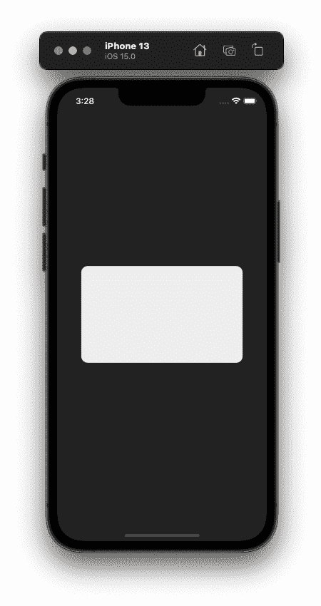
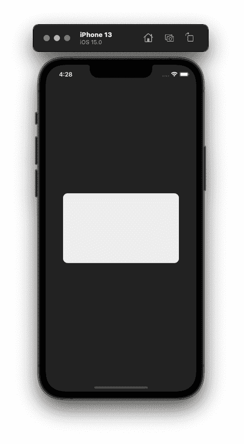
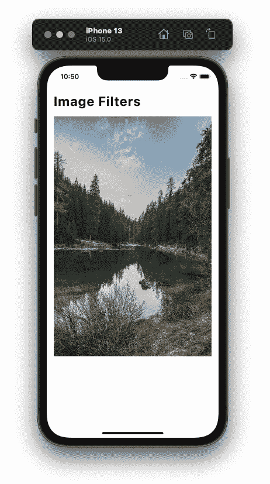
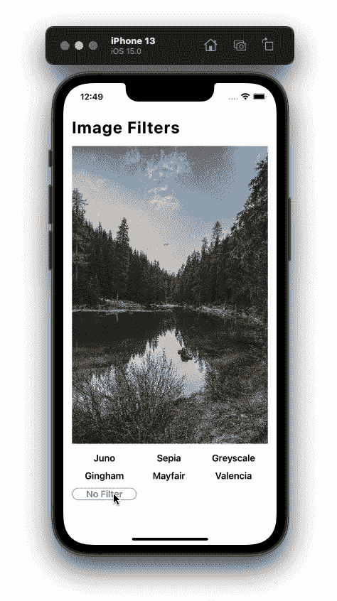
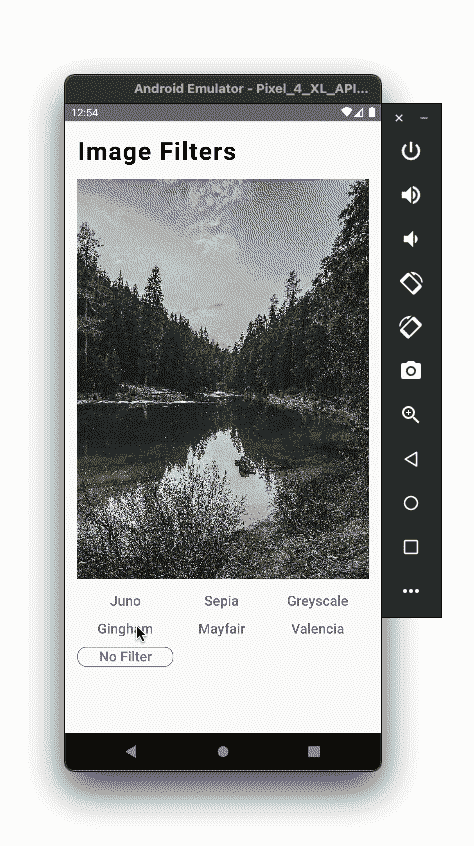
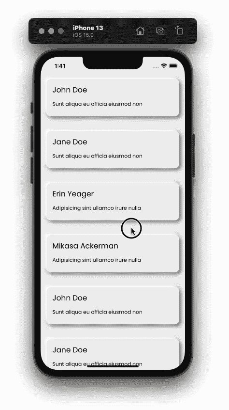
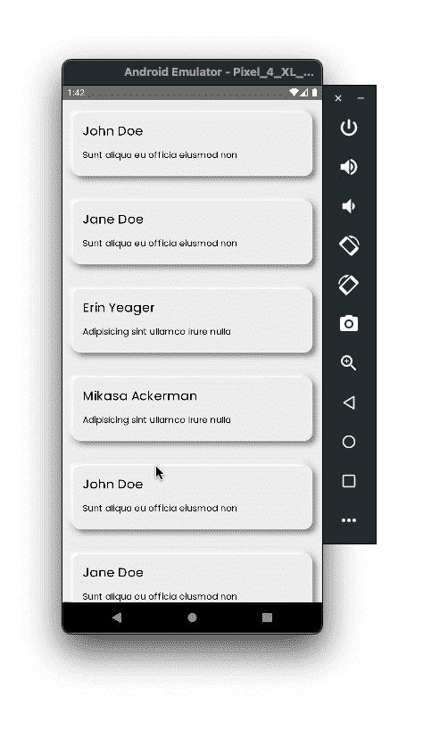
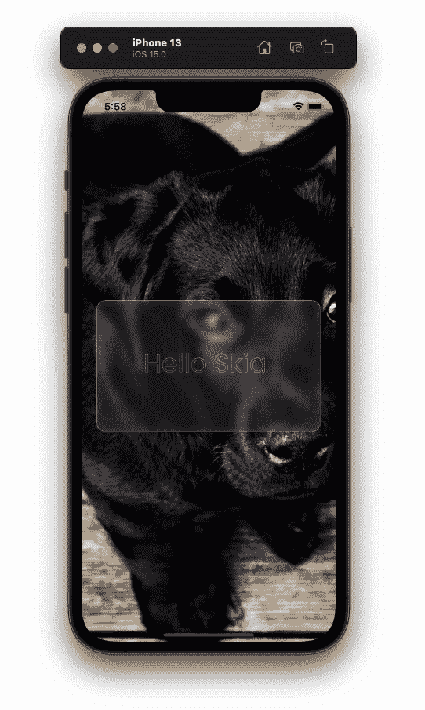

# 使用 React Native Skia 创建高性能图形

> 原文：<https://blog.logrocket.com/create-high-performance-graphics-react-native-skia/>

Skia 是一个流行的开源 2D 图形库，被 Google Chrome、Chrome OS、Android 和 Flutter 等主要平台用作默认的图形引擎。该图书馆由谷歌赞助和管理，而开发由 Skia 的工程团队监督。

## 什么是 React Native Skia？

感谢 [Shopify](https://github.com/Shopify) 、[威廉·坎多林](https://github.com/wcandillon)、[克里斯蒂安·法尔奇](https://github.com/chrfalch)以及 [react-native-skia](https://github.com/shopify/react-native-skia) 背后的整个开发团队，我们现在可以在 react 原生应用中使用 [Skia](https://skia.org/) 来绘制令人惊叹的图形，并创建像`Neumorphism`和`Glassmorphism`这样的时尚 UI 概念。

> 注意:该库仍处于 alpha 阶段，还不能在 npm 上使用，因此，它还不完全稳定。

您可以在这个 GitHub [资源库](https://github.com/hrupesh/react-native-skia-demo)中找到本文的完整代码。

## 安装 React Native Skia

让我们从一个裸露的 React 原生项目中的库安装开始。因为这个库还没有在 npm 上发布，所以我们需要从他们的 GitHub 库中下载。

让我们从初始化一个新的 react 本地项目开始。

```
react-native init <project-name>

```

在我们设置好项目之后，让我们添加 React Native Skia。

在您的终端中运行以下命令:

```
yarn add https://github.com/Shopify/react-native-skia/releases/download/v0.1.106-alpha/shopify-react-native-skia-0.1.106.tgz

```

或者，如果您使用 npm:

```
npm install https://github.com/Shopify/react-native-skia/releases/download/v0.1.106-alpha/shopify-react-native-skia-0.1.106.tgz

```

在撰写本文时，最新的 alpha 发布版本是`0.1.106`，我们将在本教程中使用它。

> 注意:一旦新版本发布，可能会有一些变化和新功能。

一旦下载并安装了包，我们需要在我们的原生 iOS 和 Android 项目中设置项目。

对于 iOS，这非常简单——我们只需要安装 cocoa pods 依赖项。使用此命令:

```
cd ios
pod install

```

现在，我们需要重建我们的 iOS 项目，以便我们可以在 React 原生 iOS 项目中使用`Skia`。

从终端或直接从 Xcode 构建项目:

```
yarn ios
// OR
npm run ios

```

如果您不熟悉环境，在 Android 中设置我们的项目可能会有点复杂。因为 React Native Skia 的大部分图形渲染逻辑都是用`C++`编写的，所以我们将需要一种叫做`NDK` (Android [原生开发工具包](https://developer.android.com/ndk))的东西，用于 Java 代码和 C++代码之间的通信。

> “原生开发套件(NDK)是一套工具，允许您在 Android 上使用 C 和 C++代码”–Android 文档

要安装安卓 NDK，你可以按照这些步骤从[官方安卓文档](https://developer.android.com/studio/projects/install-ndk)开始。既然我们已经在 iOS 和 Android 中建立了我们的库，我们现在可以开始创建一个漂亮的用户界面和图形。

## 在 React 本机应用程序中使用 React 本机 Skia

React Native Skia 提供了两种类型的 API 来绘制图形:

*   声明式 API，使用默认的 React 本机渲染器
*   一个命令式 API，与 JSI (JavaScript 接口)一起工作

> React Native JSI 是 React Native 重新架构中的核心变化。这是一个在 JavaScript 和本地代码之间提供“同步”通信的层。它将取代默认的 react 本机桥。([来源](https://github.com/react-native-community/discussions-and-proposals/issues/91))

声明式 API 类似于我们目前使用 JSX 语法在 React Native 中创建 UI 的方式。如果我们想创建一个圆角矩形，那么它的语法如下:

```
import React from 'react';
import { Canvas, Fill, RoundedRect, vec } from '@shopify/react-native-skia';
import { StatusBar, useWindowDimensions } from 'react-native';

export const DeclarativeAPI = () => {
  const {width, height} = useWindowDimensions();
  const center = vec(width / 2, height / 2);
  return (
    <>
      <StatusBar barStyle="light-content" />
      <Canvas style={{flex: 1}}>
        <Fill color={'#222'} />
        <RoundedRect 
          height={180}
          width={300}
          x={center.x - 150}
          y={center.y - 90}
          color={'#eee'}
          rx={12}
        />
      </Canvas>
    </>
  );
};

```

上述代码的输出将是:



库所有者更喜欢用户使用声明式 API，因为它易于使用并且代码可读。

下面是我们在上面的代码中所做的。首先，我们需要一块画布来绘制图形，所以我们用一个`Canvas`组件包装我们的组件，并赋予它一个样式`flex:1`，这样它就占据了整个屏幕空间。然后，我们使用`Fill`组件给我们的`Canvas`填充颜色`#222`。

我们还声明了一个变量`center`，它是带有两个键 X 和 y 的`vector`，最后，为了绘制带有圆角的`Rectangle`形状，我们使用了`RoundedRect`组件，并在下面给出了道具:

*   Height: `180`，给矩形 180 像素的高度
*   Width: `300`，给矩形 300 像素的宽度
*   `X = center.x` : `150`，是矩形距离 X 轴的位置。在 React Native Skia 中，X 和 Y 位置从左上角开始
*   `Y = center.y` : `90`，这是矩形相对于 Y 轴的位置
*   给我们的矩形一个白色
*   `rx = 12`:给我们的矩形一个圆角半径`12`

现在，让我们看看如何使用命令式 API 创建相同的 UI，如下所示:

```
import React from 'react';
import {
    rect, rrect, Skia,
    SkiaView,
    useDrawCallback, vec
} from '@shopify/react-native-skia';
import { StatusBar, useWindowDimensions } from 'react-native';

const paint = Skia.Paint();
paint.setAntiAlias(true);

export const ImperativeAPI = () => {
  const {width, height} = useWindowDimensions();
  const center = vec(width / 2, height / 2);
  const rRect = rrect(rect(center.x - 150, center.y - 90, 300, 180), 12, 12);
  const onDraw = useDrawCallback(canvas => {
    const white = paint.copy();
    white.setColor(Skia.Color('#eee'));
    canvas.drawRRect(rRect, white);
  }, []);
  return (
    <>
      <StatusBar barStyle="light-content" />
      <SkiaView style={{flex: 1, backgroundColor: '#222'}} onDraw={onDraw} />
    </>
  );
};

```

上面的输出与声明性 API 创建的输出相同。



这里，我们创建了一个`SkiaView`，它本质上是我们的`Canvas`，我们使用它的`onDraw`回调来定义在视图上绘制什么。然后是`onDraw`方法，它使用`useDrawCallback`钩子并返回一个内存化的回调。在函数中，我们正在初始化`Paint`，然后使用该颜料作为我们在画布上绘制的圆角矩形的颜色。

## 在 React Native Skia 中为图像添加滤镜

现在，让我们看看如何使用 Skia 的`Image`组件显示图像，以及如何为图像实时添加酷炫的滤镜。

让我们先编写代码来显示图像。

```
import {Canvas, Image, useImage} from '@shopify/react-native-skia';
import React from 'react';
import {Dimensions, SafeAreaView, StyleSheet, Text} from 'react-native';

const {height, width} = Dimensions.get('window');

export const ImageFilters = () => {
  const image = useImage(require('../assets/image.jpg'));
  if (image === null) return null;
  return (
    <SafeAreaView>
      <Text style={styles.title}>Image Filters</Text>
      <Canvas style={styles.canvas}>
        <Image
          x={0}
          y={0}
          width={width - 32}
          height={height - 300}
          image={image}
          fit="cover"
        />
      </Canvas>
    </SafeAreaView>
  );
};
const styles = StyleSheet.create({
  title: {
    paddingVertical: 16,
    paddingHorizontal: 16,
    fontWeight: '700',
    fontSize: 32,
    letterSpacing: 1.4,
  },
  canvas: {
    height: height - 300,
    marginHorizontal: 16,
    width: width - 32,
  },
});

```

在上面的代码中，我们使用来自`react-native-skia`的`[useImage](https://shopify.github.io/react-native-skia/docs/images)`钩子来初始化`image`变量。

我们可以使用这个钩子在`[require](https://reactnative.dev/docs/images#static-image-resources)`帮助函数的帮助下初始化本地图像资产，或者我们也可以使用来自网络的远程图像，如下所示:

```
const image = useImage('https://picsum.photos/1920/1080');

```

然后，我们将来自`Skia`的`Image`组件包装在一个`Canvas`中，并向组件添加样式。上述代码的输出将是:



现在我们的图像可见了，让我们使用[颜色矩阵](https://shopify.github.io/react-native-skia/docs/color-filters/#color-matrix)给它添加一些滤镜，这是一个带有 RGBA 颜色值的矩阵(2D 数组)。语法是这样的:

```
| R' |   | a00 a01 a02 a03 a04 |   | R |
| G' |   | a10 a11 a22 a33 a44 |   | G |
| B' | = | a20 a21 a22 a33 a44 | * | B |
| A' |   | a30 a31 a22 a33 a44 |   | A |

```

我们将使用 React Native Skia 中的`[ColorMatrix](https://shopify.github.io/react-native-skia/docs/color-filters#color-matrix)`过滤器组件来实现这一点。

首先，让我们为将要使用的所有过滤器创建矩阵:

```
const filters = {
    Juno: [
        1, 0, 0, 0, 0,
        -0.4, 1.3, -0.4, 0.2, -0.1,
        0, 0, 1, 0, 0,
        0, 0, 0, 1, 0,
    ],
    Sepia: [
        0.393, 0.769, 0.189, 0, 0,
        0.349, 0.686, 0.168, 0, 0,
        0.272, 0.534, 0.131, 0, 0,
        0,     0,     0,     1, 0,
    ],
    Greyscale: [
        0.2126, 0.7152, 0.0722, 0, 0,
        0.2126, 0.7152, 0.0722, 0, 0,
        0.2126, 0.7152, 0.0722, 0, 0,
        0,      0,      0,      1, 0,
    ],
    Gingham: [
        2, 0, 0, 0, 0,
        1, 1, 0, 0, 0,
        0.5, 0, 1, 0, 0,
        0, 0, 0, 1, 0,
    ],
    Mayfair: [
        1, 1, 0.5, 0, 0,
        0, 0.5, 1, 0, 0,
        0.5, 0.5, 1, 0, 0,
        0, 0, 0, 1, 0,
    ],
    Valencia: [
        1, 0, 0, 0, 0,
        -0.2, 1, 0, 0, 0,
        -0.8, 1.6, 1, 0, 0,
        0, 0, 0, 1, 0,
    ],
    'No Filter': [
        1, 0, 0, 0, 0,
        0, 1, 0, 0, 0,
        0, 0, 1, 0, 0,
        0, 0, 0, 1, 0,
    ]
};

```

你也可以创建自己的自定义颜色矩阵，[T2 有很多可用的游乐场。注意，我们创建了一个有七个键的对象，每个键指向一个`ColorMatrix`值。](https://kazzkiq.github.io/svg-color-filter/)

在添加了一些代码来处理我们的 UI 之后，最终的代码将是:

```
import {
  Canvas,
  ColorMatrix,
  Image,
  Paint,
  useImage,
} from '@shopify/react-native-skia';
import React, {useCallback, useState} from 'react';
import {
  Dimensions,
  FlatList,
  SafeAreaView,
  StyleSheet,
  Text,
} from 'react-native';

const {height, width} = Dimensions.get('window');
const filters = {
    Juno : [
        1, 0, 0, 0, 0,
        -0.4, 1.3, -0.4, 0.2, -0.1,
        0, 0, 1, 0, 0,
        0, 0, 0, 1, 0,
    ],
    Sepia: [
        0.393, 0.769, 0.189, 0, 0,
        0.349, 0.686, 0.168, 0, 0,
        0.272, 0.534, 0.131, 0, 0,
        0,     0,     0,     1, 0,
    ],
    Greyscale: [
        0.2126, 0.7152, 0.0722, 0, 0,
        0.2126, 0.7152, 0.0722, 0, 0,
        0.2126, 0.7152, 0.0722, 0, 0,
        0,      0,      0,      1, 0,
    ],
    Gingham: [
        2, 0, 0, 0, 0,
        1, 1, 0, 0, 0,
        0.5, 0, 1, 0, 0,
        0, 0, 0, 1, 0,
    ],
    Mayfair: [
        1, 1, 0.5, 0, 0,
        0, 0.5, 1, 0, 0,
        0.5, 0.5, 1, 0, 0,
        0, 0, 0, 1, 0,
    ],
    Valencia: [
        1, 0, 0, 0, 0,
        -0.2, 1, 0, 0, 0,
        -0.8, 1.6, 1, 0, 0,
        0, 0, 0, 1, 0,
    ],
    ['No Filter']: [
        1, 0, 0, 0, 0,
        0, 1, 0, 0, 0,
        0, 0, 1, 0, 0,
        0, 0, 0, 1, 0,
    ]
};

export const ImageFilters = () => {
  const [selectedFilter, setSelectedFilter] = useState('Juno');
  const handlePress = useCallback(
    item => () => {
      setSelectedFilter(item);
    },
    [],
  );
  const image = useImage(require('../assets/image.jpg'));
  if (image === null) return null;
  return (
    <SafeAreaView>
      <Text style={styles.title}>Image Filters</Text>
      <Canvas style={styles.canvas}>
        <Paint>
            <ColorMatrix 
              matrix={filters[selectedFilter]}
            />
        </Paint>
        <Image
          x={0}
          y={0}
          width={width - 32}
          height={height - 300}
          image={image}
          fit="cover"
        />
      </Canvas>
      <FlatList
        numColumns={3}
        data={Object.keys(filters)}
        keyExtractor={(_, index) => index}
        renderItem={({item}) => (
          <Text
            style={[
              styles.item,
              selectedFilter === item && styles.selectedItem,
            ]}
            onPress={handlePress(item)}>
            {item}
          </Text>
        )}
        style={styles.list}
      />
    </SafeAreaView>
  );
};

const styles = StyleSheet.create({
  title: {
    paddingVertical: 16,
    paddingHorizontal: 16,
    fontWeight: '700',
    fontSize: 32,
    letterSpacing: 1.4,
    color: '#000',
  },
  canvas: {
    height: height - 300,
    marginHorizontal: 16,
    width: width - 32,
    borderRadius: 12,
  },
  list: {
    margin: 16,
  },
  item: {
      width: '33%',
      textAlign: 'center',
      marginBottom: 12,
      fontWeight: '600',
      fontSize: 18,
  },
  selectedItem: {
      color: '#ea4c89',
      borderWidth: 1,
      borderColor: '#ea4c89',
      borderRadius: 12,
 },
});

```

上述代码在 iOS 和 Android 中的输出如下:





就是这样！我们现在已经在 React Native 中为我们的图像添加了滤镜。

## 用 React Native Skia 创建新用户界面

有了`Skia`，我们可以在 React Native 中创建 neumorphic UI。React Native Skia 提供了一个`[DropShadow](https://shopify.github.io/react-native-skia/docs/image-filters/shadows#drop-shadow)`组件来创建阴影，类似于我们在 web 应用程序中创建一个神经形态设计模式。

下面是创建神经形态列表的代码:

```
import {
  Canvas,
  DropShadow,
  Group,
  Paint,
  RoundedRect,
  Text,
  useFont,
} from '@shopify/react-native-skia';
import React from 'react';
import {Dimensions, ScrollView} from 'react-native';

const data = [
  {
    id: 1,
    name: 'John Doe',
    body: 'Sunt aliqua eu officia eiusmod non',
  },
  {
    id: 2,
    name: 'Jane Doe',
    body: 'Sunt aliqua eu officia eiusmod non',
  },
  {
    id: 3,
    name: 'Erin Yeager',
    body: 'Adipisicing sint ullamco irure nulla',
  },
  {
    id: 4,
    name: 'Mikasa Ackerman',
    body: 'Adipisicing sint ullamco irure nulla',
  },
  {
    id: 5,
    name: 'John Doe',
    body: 'Sunt aliqua eu officia eiusmod non',
  },
  {
    id: 6,
    name: 'Jane Doe',
    body: 'Sunt aliqua eu officia eiusmod non',
  },
  {
    id: 7,
    name: 'John Doe',
    body: 'Sunt aliqua eu officia eiusmod non',
  },
  {
    id: 8,
    name: 'Jane Doe',
    body: 'Sunt aliqua eu officia eiusmod non',
  },
];

const {width} = Dimensions.get('window');

const NeumorphicCard = ({data, index, font, bodyFont}) => {
  return (
    <Canvas style={{height: 140, width}} key={index}>
      <Group>
        <Paint>
          <DropShadow dx={6} dy={6} blur={4} color="rgba(0, 0, 0, 0.4)" />
          <DropShadow dx={-6} dy={-6} blur={4} color="rgba(255, 255, 255, 1)" />
        </Paint>
        <RoundedRect
          x={16}
          y={20}
          width={width - 32}
          height={100}
          rx={12}
          color="#EFEEEE">
          <Paint
            color="rgba(255, 255, 255, 0.6)"
            style="stroke"
            strokeWidth={1}
          />
        </RoundedRect>
      </Group>
      <Text x={32} y={56} text={data?.name} font={font} />
      <Text x={32} y={92} text={data?.body} font={bodyFont} />
    </Canvas>
  );
};

export const Neumorphism = () => {
  const font = useFont(require('../fonts/Poppins-Regular.ttf'), 20);
  const bodyFont = useFont(require('../fonts/Poppins-Regular.ttf'), 14);
  if (font === null || bodyFont === null) {
    return null;
  }
  return (
    <ScrollView
      showsVerticalScrollIndicator={false}
      style={{flex: 1, backgroundColor: '#EFEEEE'}}
      contentContainerStyle={{
        paddingTop: Platform.OS === 'ios' ? 40 : 0,
        paddingBottom: 40,
      }}>
      {data.map(item => (
        <NeumorphicCard
          key={item.id}
          data={item}
          font={font}
          bodyFont={bodyFont}
        />
      ))}
    </ScrollView>
  );
};

```

上图中，我们映射了一组随机数据，对于每一项，我们都呈现了一个`NeumorphicCard`组件。我们还使用了`useFont`钩子来加载自定义字体。

在卡片组件中，我们有一个带有`1`单元边框的`RoundedRect`，它是我们使用样式为`stroke`的`Paint`创建的。然后，我们添加了两个`DropShadow`组件，在矩形的左上角和右下角创建一个阴影。

下面是上述代码在 iOS 和 Android 中的输出:





## 将玻璃态与 React Native Skia 相结合。

最后，让我们在 React 本地应用中创建一个受[玻璃形态](https://hype4.academy/tools/glassmorphism-generator)启发的设计。为了创建这个玻璃形态的设计，我们将需要`[BackDropBlur](https://shopify.github.io/react-native-skia/docs/backdrops-filters#backdrop-blur)`组件。我们将创建一个`RoundedRect`，然后使用`BackDropBlur`组件给背景一个`blur`。我们还将看到如何制作动画图形。

编写下面的代码来创建一个动画玻璃卡片:

```
import {
  BackdropBlur, Canvas, Fill, Group, Image, mix,
  Paint, rect, Rect, RoundedRect, rrect, Text,
  useDerivedValue, useFont, useImage, useLoop, vec,
} from '@shopify/react-native-skia';
import React from 'react';
import {useWindowDimensions} from 'react-native';

export const Glassmorphism = () => {
  const {width, height} = useWindowDimensions();
  const center = vec(width / 2 - 50, height / 2 - 100);
  const blurClipPath = rrect(rect(24, center.y, width - 48, 200), 12, 12);
  const image = useImage('https://picsum.photos/1920/1080');
  const blurProgress = useLoop({duration: 2000});
  const blur = useDerivedValue(
    progress => mix(progress, 0, 10),
    [blurProgress],
  );
  const font = useFont(require('../fonts/Poppins-Regular.ttf'), 40);
  if (font === null) {
    return null;
  }
  return (
    <Canvas style={{flex: 1}}>
      <Group>
        <Rect x={0} y={0} width={width} height={height} />
        <Image
          x={0}
          y={0}
          width={width}
          height={height}
          image={image}
          fit={'cover'}
        />
      </Group>
      <Group>
        <RoundedRect
          x={24}
          y={center.y}
          width={width - 48}
          height={200}
          color="#0000"
          rx={12}>
          <Paint
            color="rgba(255, 255, 255, 0.8)"
            style="stroke"
            strokeWidth={1}
          />
        </RoundedRect>
        <BackdropBlur blur={blur} clip={blurClipPath}>
          <Fill color={'rgba(122, 122, 122, 0.2)'} />
        </BackdropBlur>
        <Text
          x={center.x - 50}
          y={center.y + 110}
          text="Hello Skia"
          font={font}
          color="#fff"
          style="stroke"
        />
      </Group>
    </Canvas>
  );
};

```

输出将如下所示:



## 结论

现在你已经看到了 React Native Skia 有多强大，我认为它将改变我们在 React Native 中创建 UI 的方式。因为该库使用了新的 React 本机架构(JSI)和新的渲染器的全部潜力，它肯定会提高我们的 React 本机应用程序的性能。感谢阅读！

## [LogRocket](https://lp.logrocket.com/blg/react-native-signup) :即时重现 React 原生应用中的问题。

[](https://lp.logrocket.com/blg/react-native-signup)

[LogRocket](https://lp.logrocket.com/blg/react-native-signup) 是一款 React 原生监控解决方案，可帮助您即时重现问题、确定 bug 的优先级并了解 React 原生应用的性能。

LogRocket 还可以向你展示用户是如何与你的应用程序互动的，从而帮助你提高转化率和产品使用率。LogRocket 的产品分析功能揭示了用户不完成特定流程或不采用新功能的原因。

开始主动监控您的 React 原生应用— [免费试用 LogRocket】。](https://lp.logrocket.com/blg/react-native-signup)