# 如何在 React Native 中创建新闻提要

> 原文：<https://blog.logrocket.com/create-news-feed-react-native/>

在这个循序渐进的教程中，我们将使用 React Native for iOS 和 Android 用最少的代码创建一个新闻提要应用程序。我们的应用程序将由两个屏幕组成，第一个是`Home`屏幕或`Feed`屏幕。第二个`Detail`屏幕将处理加载一篇文章，加载选定类别的新闻，或者用特定关键字搜索新闻。

您可以在这个[存储库](https://github.com/hrupesh/RNNewsFeed)中找到本文的完整源代码。我们开始吧！

## 设置新闻 API 帐户

为了用新闻文章填充我们的应用程序，我们将使用[新闻 API](https://newsapi.org/) 作为我们的后端。新闻 API 为我们提供了一个 REST API，我们可以用它来获取来自世界各地的最新的突发新闻标题。

在开始使用新闻 API 之前，您需要从网站获取一个 API 令牌。进入[**G**](https://newsapi.org/docs/get-started)[et started](https://newsapi.org/docs/get-started)页面，点击**获取 API Key** 。单击该按钮后，您将被重定向到注册页面。在页面上填写您的详细信息并成功注册后，您可以获得您的 API 令牌。现在，让我们带着 API 兜一圈，[测试它所提供的一切](https://newsapi.org/docs)。

为了测试 API，我们将使用 Postman，但是您也可以使用自己选择的 API 平台。或者，您可以在终端中简单地使用 curl。你可以在你的操作系统上使用独立的 Postman 应用程序，或者简单地使用 web 应用程序，这是我更喜欢的。

对于`Feed`，我们将使用[头条端点](https://newsapi.org/docs/endpoints/top-headlines)，所以我们先测试一下:

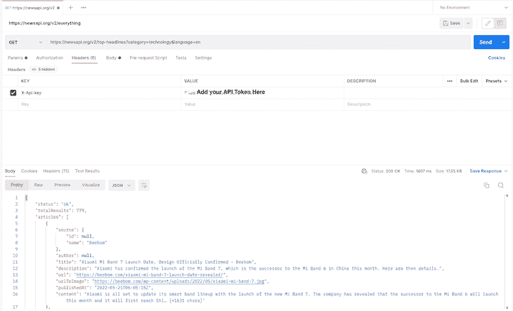

我们使用以下 URL:

```
https://newsapi.org/v2/top-headlines?category=technology&language=en

```

我们向 URL 传递两个查询参数:

*   获得所有科技类的头条新闻
*   确保我们只收到英文新闻

对新闻 API URL 的每个调用都必须包含一个`apiKey`，它用于验证发送请求的用户，并用于分析目的。

我们可以用两种方法之一在 API 调用中添加 API 键。首先，您可以将它作为 URL 本身的查询参数直接发送:

```
https://newsapi.org/v2/top-headlines?category=technology&language=en&apiKey=<YOUR_API_KEY>

```

但是，这种方法不安全，因此不推荐使用。但是，你可以用它来测试。或者，我们可以尝试使用`X-Api-key`在请求头中发送`API_KEY`。如果您使用 curl，您可以添加一个请求头，如下所示:

```
 curl https://newsapi.org/v2/top-headlines?category=technology&language=en
   -H "X-Api-key: <YOUR_API_KEY>"

```

如果你使用的是 Postman，那么只需转到`request`的`**Headers**`选项卡，添加一个`key`和`value`，就像上面的截图一样。

现在我们有了一个来自 API 的响应对象，让我们分析它，看看它为我们提供了什么。响应有一个`articles`键，它是一个`objects`数组，其中每个对象都是一篇新闻文章。

下面给出了一个`news`对象的示例:

```
{
    "source": {
        "id": null,
        "name": "digitalspy.com"
    },
    "author": "Joe Anderton",
    "title": "Walking Dead's Norman Reedus reveals Death Stranding 2 existence - Digital Spy",
    "description": "The Walking Dead star Norman Reedus reveals Death Stranding 2 existence.",
    "url": "https://www.digitalspy.com/tech/a40064850/walking-dead-norman-reedus-death-stranding-2/",
    "urlToImage": "https://hips.hearstapps.com/digitalspyuk.cdnds.net/16/28/1468254183-screen-shot-2016-07-11-at-171152.jpg?crop=1xw:0.8929577464788733xh;center,top&resize=1200:*",
    "publishedAt": "2022-05-21T10:12:41Z",
    "content": "The Walking Dead star Norman Reedus has seemingly revealed the existence of Death Stranding 2.\r\nThe actor played leading character Sam Porter Bridges in the PlayStation and PC game from Metal Gear So… [+2088 chars]"
}

```

如您所见，我们为一篇新闻文章获取了大量数据，但我们将使用`title`、`url`、`urlToImage`、`publishedAt`和`content`。既然我们的后端都设置好了，让我们开始移动应用程序的工作。

## 应用程序预览

在我们实际编写应用程序的代码之前，让我们讨论一下我们想要构建的功能。首先，我们需要一个主屏幕或 feed 来显示所有最新的新闻文章。在列表的顶部，将有一个新闻类别标签的水平列表，当选择它时，将加载该特定类别的新闻。

我们需要在屏幕顶部的搜索栏，用户可以使用特定的关键字搜索新闻。我们还将实现共享转换导航。当用户点击任何新闻文章时，就会出现`NewsDetail`屏幕。

我们将使用 Redux 来管理应用程序中的状态。我们希望在应用程序生命周期之间持久化数据，所以我们将使用 [Redux Persist](https://github.com/rt2zz/redux-persist) 。

该应用程序的用户界面将支持黑暗和光明模式。我们构建的最终用户界面将如下图所示:

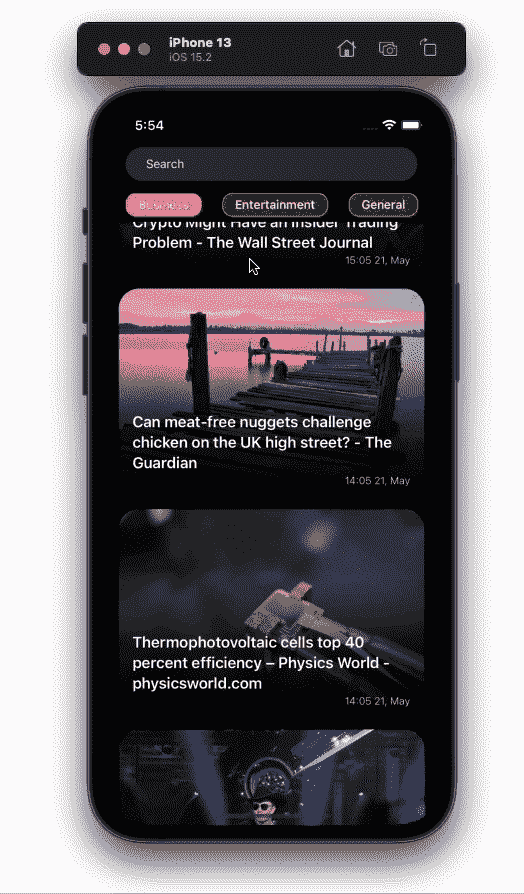

Feed


Categories


Search feature

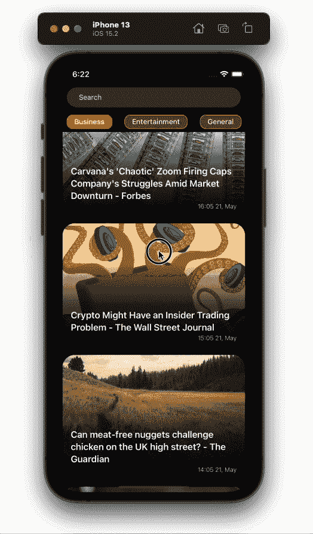

Dark/ light mode

## 创建新的 React 本机项目

让我们首先创建一个新的 React 本地项目，如下所示:

```
npx react-native init <App-Name-Here> --template react-native-template-typescript

```

我将使用 TypeScript，但也可以随意使用 JavaScript。如果您在创建 TypeScript 模板项目时遇到任何问题，您可以[参考文档](https://reactnative.dev/docs/typescript)。

随着项目的建立，让我们开始编写代码。首先，删除`App.tsx`中的所有样板代码，并添加以下代码:

```
import React from 'react';
import {Text} from 'react-native';

const App: React.FC = () => {
  return <Text>This is Feed Screen</Text>;
};

export default App;

```

让我们从在应用程序中添加状态管理开始。我们需要安装一些库来将 Redux 合并到我们的项目中:

```
yarn add @reduxjs/toolkit react-redux redux

```

或者，如果您喜欢 npm，请使用以下命令:

```
npm i @reduxjs/toolkit react-redux redux

```

在上面的步骤中，我们正在安装`@reduxjs/toolkit`、`react-redux`和`redux`。在 Redux v6 中，`createStore`方法被弃用，我们需要使用 Redux Toolkit 的`configureStore`方法来代替。

现在，让我们创建一个 Redux store，并将一些`actions`和`reducers`链接到它。在项目目录的根目录下创建一个新文件夹，命名为`src`。我们将在这里保存所有的应用程序代码。在里面添加`redux`文件夹，然后在里面创建三个文件，`actions.ts`、`reducers.ts`和`store.ts`。

目录结构现在应该如下所示:

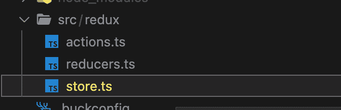

我们将创建一个动作函数来从 API 获取新闻文章，并将它们存储在我们的存储中。现在，让我们只返回一个空数组:

```
export const GET_NEWS_FEED = 'GET_NEWS_FEED';

export const getNewsFeed =
() => (dispatch) => {
      dispatch({
        type: GET_NEWS_FEED,
        payload: [],
      });
};

```

让我们为我们的`newsFeed`创建`feedReducer`:

```
import {GET_NEWS_FEED} from './actions';

const initialState = {
  newsFeed: [],
};

const feedReducer = (
  state = initialState,
  action: {type: String; payload: any},
) => {
  switch (action.type) {
    case GET_NEWS_FEED:
      return {...state, newsFeed: action.payload};
    default:
      return state;
  }
};
export default feedReducer;

```

在 reducer 中，我们有状态变量`newsFeed`，它最初是一个空数组。当我们接收到`GET_NEWS_FEED`动作时，我们将其值设置为动作中传递的`payload`。

现在我们有了状态的`actions`和`reducers`，让我们创建一个 Redux 存储并用以下值初始化它。

创建`store.ts`文件并添加以下代码:

```
import {configureStore} from '@reduxjs/toolkit';
import {combineReducers} from 'redux';
import feedReducer from './reducers';

const rootReducer = combineReducers({
  feedReducer: feedReducer,
});

export const store = configureStore({
  reducer: rootReducer,
});

```

我们已经成功地建立了`redux`商店，现在，我们只需要将它传递到我们的应用程序中。将以下代码添加到您的`App.tsx`文件中:

```
import React from 'react';
import {Text} from 'react-native';
import {Provider} from 'react-redux';
import {store} from './src/redux/store';

const App: React.FC = () => {
  return (
    <Provider store={store}>
      <Text>This is feed screen</Text>
    </Provider>
  );
};

export default App;

```

## 从 API 获取新闻

到目前为止，我们有一个工作 Redux 商店。让我们用新闻文章填充它。为了实现网络调用，我们将使用 Axios，所以让我们将它添加到项目中:

```
yarn add axios

```

我们需要创建一个`axios`实例，这样我们就不需要在每次进行 API 调用时处理请求头。在`src`中新建一个名为`api`的文件夹，并在其中添加一个名为`index.ts`的文件；

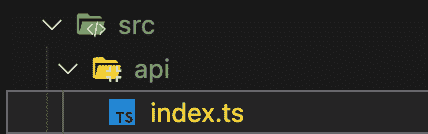

我们将在`index.ts`文件中创建一个`axios`实例，并将其导出为一个`apiClient`变量:

```
import axios from 'axios';
const BASE_URL = 'https://newsapi.org/v2/';

export const apiClient = axios.create({
  baseURL: BASE_URL,
  timeout: 10000,
  headers: {
    'X-Api-key': '<Add-your-api-token-here>',
  },
});

```

现在，让我们在我们的`getNewsFeed`行动中利用这个`apiClient`。在您的`actions.ts`文件中进行以下更改:

```
export const getNewsFeed = () => async (dispatch: Function) => {
  try {
    const res = await apiClient.get(
      'top-headlines?language=en&category=business',
    );
    if (res.status === 200) {
      dispatch({
        type: GET_NEWS_FEED,
        payload: res?.data?.articles,
      });
    } else {
      console.warn('Something went wrong');
    }
  } catch (error) {
    console.error(error);
  }
};

```

在上面的代码中，我们进行了一个 API 调用来获取`business`类别中的头条。如果我们从 API 收到一个成功的响应，那么我们用收到的新的`articles`更新`newsFeed`状态。

当我们的`App`第一次被渲染时，我们需要调用这个`action`。我们还将显示文章标题列表。在填充我们的`newsFeed`之前，让我们为应用程序中的不同屏幕创建文件。

在`src`中创建一个`screens`文件夹，并在其中创建一个名为`Feed`的新文件夹。然后，在`Feed`文件夹中添加两个文件，分别命名为`index.tsx`和`styles.ts`:

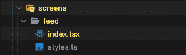

为了处理 iPhone 上的凹槽，我们将使用一个名为`[react-native-iphone-x-helper](https://github.com/ptelad/react-native-iphone-x-helper)`的助手库。使用下面的命令安装它:

```
yarn add react-native-iphone-x-helper

```

让我们为我们的屏幕添加一些样式。在您的`feed/styles.ts`中进行以下更改:

```
import {StyleSheet} from 'react-native';
import {getStatusBarHeight, isIphoneX} from 'react-native-iphone-x-helper';

export default StyleSheet.create({
  container: {
    flex: 1,
    flexGrow: 1,
    paddingTop: isIphoneX() ? getStatusBarHeight() + 20 : 20,
  },
  list: {
    flex: 1,
    flexGrow: 1,
    paddingVertical: 8,
  },
});

```

然后，将以下代码添加到您的`feed/index.tsx`文件中:

```
import React, {useEffect} from 'react';
import {Text, useColorScheme, View} from 'react-native';
import {useDispatch, useSelector} from 'react-redux';
import {getNewsFeed} from '../../redux/actions';
import styles from './styles';

export const Feed: React.FC = () => {
  const {newsFeed} = useSelector((state: any) => state.feedReducer);
  const dispatch: Function = useDispatch();

  useEffect(() => {
    dispatch(getNewsFeed());
  }, [dispatch]);
  const backgroundColor = useColorScheme() === 'dark' ? '#000' : '#fff';
  return (
    <View style={[styles.container, {backgroundColor}]}>
      {newsFeed?.map((item: any) => (
        <Text>{item.title}</Text>
      ))}
    </View>
  );
};

```

现在，我们需要在我们的`App`组件中呈现`feed`组件。在您的`App.tsx`文件中进行以下更改:

```
import React from 'react';
import {Provider} from 'react-redux';
import {store} from './src/redux/store';
import {Feed} from './src/screens/feed';

const App: React.FC = () => {
  return (
    <Provider store={store}>
      <Feed />
    </Provider>
  );
};
export default App;

```

现在，您的用户界面应该类似于下图:


我们现在能够获取世界各地的最新新闻列表，并将其显示在屏幕上。接下来，我们将添加一些 UI 设计。

## 设计新闻文章卡片

目前，我们正在屏幕上显示新闻的`title`。我们需要更新它来显示`article`的图像。在它上面，我们将显示文章的`title`。在底部，我们将显示特定`news/article`的`timestamp`。

让我们用一个`Flatlist`替换`feed/index.tsx`中的`map`函数。在开始实现 UI 之前，您首先需要添加一些我们将用来设计 UI 的库:

```
yarn add react-native-uuid react-native-linear-gradient moment

```

我们将使用 [`react-native-uuid`](https://www.npmjs.com/package/react-native-uuid) 为每个新闻文章组件生成一个唯一的键，并使用`[react-native-linear-gradient](https://github.com/react-native-linear-gradient/react-native-linear-gradient)`在图像上创建一个半透明到透明的覆盖图，我们将在其上显示文章的`title`。

最后，我们使用 [`moment`](https://momentjs.com/) 将从 `API` 接收的 `timestamp` 转换为人类可读的格式。对`feed/index.tsx`进行如下修改:

```
import uuid from 'react-native-uuid';
....
return (
  <View style={[styles.container, {backgroundColor}]}>
    <FlatList
      keyExtractor={() => uuid.v4()}
      showsVerticalScrollIndicator={false}
      data={newsFeed}
      renderItem={({item, index}: any) => (
        <NewsArticle post={item} />
      )}
      style={styles.list}
    />
  </View>
);

```

在上面的代码中，您可以注意到我们为由`Flatlist`组件呈现的每个项目分配了一个惟一的键。因此，React 对每个`article`的处理是不同的，UI 中不应该有重叠。如果这在现在没有意义，以后当我们的 UI 逻辑变得稍微复杂一点的时候就会有意义了。

上面的代码还会抛出一个错误，说“`NewsArticle`未定义”。让我们通过为我们的新闻文章创建一个新组件来解决这个问题。

在项目的`src`目录中，创建一个名为`components`的新文件夹，其中包含我们将在整个应用程序中使用的所有 UI 组件。现在，创建一个名为`NewsArticle`的新文件夹，并在其中添加两个名为`index.tsx`和`styles.ts`的文件:

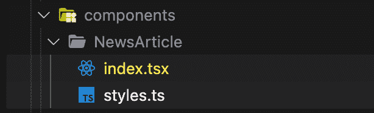

将以下代码添加到`styles.ts`:

```
import {Platform, StyleSheet} from 'react-native';

const boxShadow: any = Platform.select({
  ios: {
    shadowColor: '#000',
    shadowOffset: {
      width: 0,
      height: 0,
    },
    shadowOpacity: 0.4,
    shadowRadius: 4,
  },
  android: {elevation: 6},
});

export default StyleSheet.create({
  container: {
    height: 240,
    marginBottom: 18,
    backgroundColor: '#eee',
    borderRadius: 24,
    marginHorizontal: 16,
    ...boxShadow,
  },
  imageContainer: {flex: 1},
  image: {
    flex: 1,
    borderRadius: 24,
    height: 300,
  },
  titleContainer: {
    position: 'absolute',
    bottom: 0,
    width: '100%',
    borderBottomLeftRadius: 24,
    borderBottomRightRadius: 24,
    height: 160,
    paddingLeft: 16,
    paddingRight: 10,
    justifyContent: 'flex-end',
    alignItems: 'flex-start',
  },
  text: {
    fontSize: 18,
    fontWeight: '600',
    lineHeight: 24,
    color: '#fff',
    paddingBottom: 24,
  },
  timestamp: {
    position: 'absolute',
    color: '#eee',
    fontSize: 12,
    fontWeight: '300',
    right: 16,
    bottom: 8,
  },
});

```

这些只是我们将用来设计我们的`NewsArticle`组件的一些基本样式。将以下代码添加到您的`index.tsx`文件中:

```
import moment from 'moment';
import React from 'react';
import {Image, Text, TouchableOpacity} from 'react-native';
import LinearGradient from 'react-native-linear-gradient';
import styles from './styles';

type Post = {
  title: string;
  urlToImage: string;
  publishedAt: string;
  url: string;
  author: string;
};

export const NewsArticle: React.FC<{
  post: Post;
}> = ({post}) => {
  return (
    <TouchableOpacity activeOpacity={1} style={styles.container}>
      <Image
        source={{
          uri: post?.urlToImage ?? 'https://picsum.photos/800',
          cache: 'force-cache',
        }}
        resizeMode={'cover'}
        style={styles.image}
      />
      <LinearGradient
        colors={['#0000', '#000A', '#000']}
        style={styles.titleContainer}>
        <Text style={styles.text}>{post?.title}</Text>
        <Text style={styles.timestamp}>
          {moment(post?.publishedAt).format('HH:MM DD, MMMM')}
        </Text>
      </LinearGradient>
    </TouchableOpacity>
  );
};

```

在上面的代码中，我们已经声明了`NewsArticle`组件，它接收一个`post`属性，该属性属于`type` `Post`。组件上面给出了`Post`的定义。

对于 UI，我们将整个组件包装在`TouchableOpacity`中，稍后我们将在教程中使用它来将用户导航到`NewsDetail`屏幕。然后，一个`Image`显示在整个`view`上。如果我们没有从`API`得到任何`urlToImage`，那么我们显示一个随机的占位符图像。

对于`text`，我们将`Text`组件放在一个`LinearGradient`组件中，该组件将`absolute`放置在`Image`上，使用户可以阅读文本，并在文本 UI 中维护`contrast ratio`。我们还使用`moment`来格式化`article`的`publishedAt`属性，并最终显示格式化后的值。

在代码中实现上述更改后，您的应用程序 UI 应该如下所示:


我们现在有了一个有效的、可读的新闻源。让我们添加当用户在屏幕上弹出时刷新页面的功能。谢天谢地，这有一个非常简单的实现。我们只需要使用`Flatlist`组件的`RefreshControl`道具。

在您的`feed/index.tsx`中进行以下更改:

```
import React, {useCallback, useEffect, useState} from 'react';
import {FlatList, RefreshControl, useColorScheme, View} from 'react-native';
import {useDispatch, useSelector} from 'react-redux';
import {NewsArticle} from '../../components';
import {getNewsFeed} from '../../redux/actions';
import styles from './styles';
import uuid from 'react-native-uuid';

export const Feed: React.FC = () => {
  const {newsFeed} = useSelector((state: any) => state.feedReducer);
  const dispatch: Function = useDispatch();
  const [isLoading, setIsLoading] = useState(false);

  useEffect(() => {
    dispatch(getNewsFeed(setIsLoading));
  }, [dispatch]);

  const handleRefresh = useCallback(() => {
    dispatch(getNewsFeed(setIsLoading));
  }, [dispatch]);
  const backgroundColor = useColorScheme() === 'dark' ? '#000' : '#fff';
  return (
    <View style={[styles.container, {backgroundColor}]}>
      <FlatList
        keyExtractor={() => uuid.v4()?.toString()}
        showsVerticalScrollIndicator={false}
        data={newsFeed}
        renderItem={({item}: any) => <NewsArticle post={item} />}
        refreshControl={
          <RefreshControl refreshing={isLoading} onRefresh={handleRefresh} />
        }
        style={styles.list}
      />
    </View>
  );
};

```

在上面的代码中，我们添加了一个`state` `isLoading`，当通过`getNewsFeed`方法获取`news`时，它就是`true`。然后，我们在`Flatlist`中添加了`RefreshControl`组件，当`isLoading`为`true`时，以及当用户拉起列表刷新数据时，都会显示该组件。然后，将触发`handleRefresh`方法。

注意，我们在`getNewsFeed`方法中添加了一个`setIsLoading`参数。但是，我们还没有改变方法定义。让我们接下来这样做；在您的`actions.ts`文件中添加以下代码:

```
export const getNewsFeed =
  (setIsLoading: Function) => async (dispatch: Function) => {
    try {
      setIsLoading(true);
      const res = await apiClient.get(
        'top-headlines?language=en&category=business',
      );
      setIsLoading(false);
      if (res.status === 200) {
        dispatch({
          type: GET_NEWS_FEED,
          payload: res?.data?.articles,
        });
      } else {
        console.warn('Something went wrong');
      }
    } catch (error) {
      console.error(error);
    }
};

```

输出将类似于下图:


## 持久存储数据

我们现在有一个工作的新闻源，但是有一个小问题。你可能会注意到，当应用程序第一次加载时，屏幕会有一段时间是空白的。为了解决这个问题，我们将使用 [Redux Persist](https://github.com/rt2zz/redux-persist) ，这是 Redux store 的一种中间件，用于持久存储数据、重新水合和填充数据。

在实现 Redux Persist 之后，当用户关闭和打开应用程序时，他们将看到以前的提要，而不是一个空白屏幕。如果有新的提要可用，那么它将被加载。

首先，将依赖项添加到项目中。为此，请执行以下命令:

```
yarn add @react-native-community/async-storage redux-persist

```

我们需要添加`Async Storage`,因为我们所有的商店数据都将存储在其中。当应用程序再次打开时，商店将使用其中的数据进行恢复。基本上，Redux Persist 在 React Native 中使用`AsyncStorage`进行存储。

一旦添加了依赖项，我们需要在我们的`store.ts`文件中做一些更改:

```
import AsyncStorage from '@react-native-community/async-storage';
import {configureStore} from '@reduxjs/toolkit';
import {combineReducers} from 'redux';
import feedReducer from './reducers';
import {persistReducer, persistStore} from 'redux-persist';

const persistConfig = {
  key: 'root',
  storage: AsyncStorage,
  whitelist: ['newsFeed'],
};

const rootReducer = combineReducers({
  feedReducer: persistReducer(persistConfig, feedReducer),
});

export const store = configureStore({
  reducer: rootReducer,
  middleware: getDefaultMiddleware =>
    getDefaultMiddleware({
      serializableCheck: false,
    }),
});

export const persistor = persistStore(store);

```

在上面的代码中，我们创建了一个`persistConfig`对象，它负责 Redux Persist 的配置。在对象内部，有两个主要的`key`对象，`storage`和`whitelist`。

我们将使用`storage`作为 Redux store 数据的存储，`whitelist`是字符串的`array`。这些是我们想要持久化的缩减者的名字。如果我们将一个空数组传递给`whitelist`，那么我们所有的 reducers 都将被持久化。

接下来，我们使用 Redux Persist 的`persistReducer`方法创建一个持久化的缩减器，并将`persistConfig`作为第一个参数传递。然后，我们传递我们想要持久化的实际缩减器。

我们在`configureStore`的`middleware`键中传递`serializableCheck: false`，以抑制在 Redux v6 中使用 Redux Persist 时抛出的警告。

最后，我们使用`persistStore`方法创建一个持久化的存储副本，并将其导出为`persistor`。我们将在下一步中使用它。

最后，为了向我们的应用程序提供持久化的数据，我们需要在 Redux store `Provider`组件之后的`App.tsx`文件中传递它。

在`App.tsx`文件中添加以下代码:

```
import React from 'react';
import {ActivityIndicator} from 'react-native';
import {Provider} from 'react-redux';
import {PersistGate} from 'redux-persist/integration/react';
import {persistor, store} from './src/redux/store';
import {Feed} from './src/screens/feed';

const App: React.FC = () => {
  return (
    <Provider store={store}>
      <PersistGate
        loading={<ActivityIndicator size={'large'} color={'#000'} />}
        persistor={persistor}>
        <Feed />
      </PersistGate>
    </Provider>
  );
};
export default App;

```

我们通过`PersistGate`组件传递持久存储数据，持久存储来自`persistor`。在`PersistGate`组件中有一个`loading`属性，它将任何 JSX 组件作为一个参数，而 JSX 组件将一直显示，直到商店被重新水合。

这样，我们就保存了我们的商店数据。现在，如果你关闭应用程序并再次打开它，你将不会看到空白屏幕。

接下来，我们将实现类别标签。我们的应用程序将有一个用户可以查看的预定义新闻类别的水平列表。当用户点击任何类别标签时，新闻提要应该更新并只显示与该特定类别相关的新闻。

让我们首先为`categories`创建一个数据源。在项目的`src`文件夹中创建一个名为`constants.ts`的文件，然后向其中添加以下代码:

```
interface NewsCategoryTypes {
  [key: string]: string;
}

export const NewsCategory: NewsCategoryTypes = {
  business: 'business',
  entertainment: 'entertainment',
  general: 'general',
  health: 'health',
  science: 'science',
  sports: 'sports',
  technology: 'technology',
};

```

现在，让我们在`articles`列表上方的`Feed`屏幕上显示一个类别列表。在`feed/index.tsx`文件中添加下面的代码:

```
import {NewsArticle, NewsTags} from '../../components';
import {NewsCategory} from '../../constants';
....
export const Feed: React.FC = () => {
  const [isLoading, setIsLoading] = useState(false);
  const [selectedCategory, setSelectedCategory] = useState(
    NewsCategory.business,
  );
  ....
  useEffect(() => {
    dispatch(getNewsFeed(setIsLoading, selectedCategory));
  }, [dispatch, selectedCategory]);

  const handleRefresh = useCallback(() => {
    dispatch(getNewsFeed(setIsLoading, selectedCategory));
  }, [dispatch, selectedCategory]);

  return (
    <View style={[styles.container, {backgroundColor}]}>
      <NewsTags
          selectedCategory={selectedCategory}
          setSelectedCategory={setSelectedCategory}
      />
      ....
    </View>
  );
};

```

在上面的代码中，我们引入了一个名为`selectedCategory`的新状态，并赋予它一个初始值`NewsCategory.business`。我们现在也在我们的`getNewsFeed`动作中传递了`selectedCategory`，最后，我们渲染了`NewsTags`组件，这个组件我们还没有创建。

让我们现在做那件事。创建一个名为`NewsTags`的新文件夹，并在其中添加两个文件，`styles.ts`和`index.tsx`:

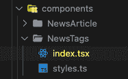

将以下代码添加到`styles.ts`文件中:

```
import {StyleSheet} from 'react-native';
export default StyleSheet.create({
  list: {
    maxHeight: 40,
  },
  contentContainer: {
    paddingHorizontal: 24,
    alignItems: 'center',
    justifyContent: 'center',
  },
});

```

要显示`categories`的水平列表，在`NewsTags/index.tsx`文件中添加以下代码:

```
import React from 'react';
import {FlatList} from 'react-native';
import {NewsCategory} from '../../constants';
import {Tag} from '../Tag';
import styles from './styles';

export const NewsTags: React.FC<{
  selectedCategory: String;
  setSelectedCategory: Function;
}> = ({selectedCategory, setSelectedCategory}) => {
  return (
    <FlatList
      horizontal
      showsHorizontalScrollIndicator={false}
      data={Object.keys(NewsCategory)}
      keyExtractor={(item: string) => item}
      renderItem={({item}: any) => (
        <Tag
          category={item}
          selectedCategory={selectedCategory}
          setSelectedCategory={setSelectedCategory}
        />
      )}
      style={styles.list}
      contentContainerStyle={styles.contentContainer}
    />
  );
};

```

在上面的代码中，我们渲染了`NewsCategory`对象中的所有`keys`。在`renderItem`内部，我们已经通过了`Tag`组件，这个组件我们还没有创建。让我们现在创建它。在组件中添加一个名为`Tag`的文件夹，并创建两个文件，如下图所示:

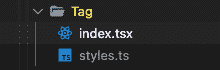

将下面的代码粘贴到`styles.ts`文件中:

```
import {StyleSheet} from 'react-native';
export default StyleSheet.create({
  container: {
    borderWidth: 1,
    borderColor: '#FFA500',
    borderRadius: 12,
    height: 28,
    paddingHorizontal: 14,
    justifyContent: 'center',
    alignItems: 'center',
    marginRight: 24,
    backgroundColor: '#FFA50066',
  },
  text: {
    fontSize: 14,
    fontWeight: '500',
  },
  selected: {
    backgroundColor: '#FF8800',
    borderColor: '#FF6600',
  },
});

```

为了实际呈现一个`Tag`组件，将下面的代码添加到`index.tsx`文件中:

```
import React, {useCallback} from 'react';
import {Text, TouchableOpacity, useColorScheme} from 'react-native';
import styles from './styles';

export const Tag: React.FC<{
  category: String;
  selectedCategory: String;
  setSelectedCategory: Function;
}> = ({category, selectedCategory, setSelectedCategory}) => {
  const textColor = useColorScheme() === 'dark' ? '#fff' : '#000';
  const handlePress = useCallback(() => {
    setSelectedCategory(category);
  }, [category, setSelectedCategory]);
  return (
    <TouchableOpacity
      style={[
        styles.container,
        selectedCategory === category && styles.selected,
      ]}
      onPress={handlePress}>
      <Text style={[styles.text, {color: textColor}]}>{`${
        category.charAt(0).toUpperCase() + category.slice(1)
      }`}</Text>
    </TouchableOpacity>
  );
};

```

上面的代码是一个简单的`view`，它呈现了一个`category`名称文本。按下时，会将`selectedCategory`设置为那个`category`。

最后，我们将修改`getNewsFeed`动作方法，以便它返回所选新闻类别的新闻提要。修改`actions.ts`中的`getNewsFeed`方法如下:

```
export const getNewsFeed =
  (setIsLoading: Function, category: String = NewsCategory.business) =>
  async (dispatch: Function) => {
    try {
      setIsLoading(true);
      const res = await apiClient.get(
        `top-headlines?language=en&category=${category}`,
      );
      setIsLoading(false);
      if (res.status === 200) {
        dispatch({
          type: GET_NEWS_FEED,
          payload: res?.data?.articles,
        });
      } else {
        console.warn('Something went wrong');
      }
    } catch (error) {
      console.error(error);
    }
};

```

现在，我们可以选择我们想要查看的特定新闻`category`。输出如下图所示:

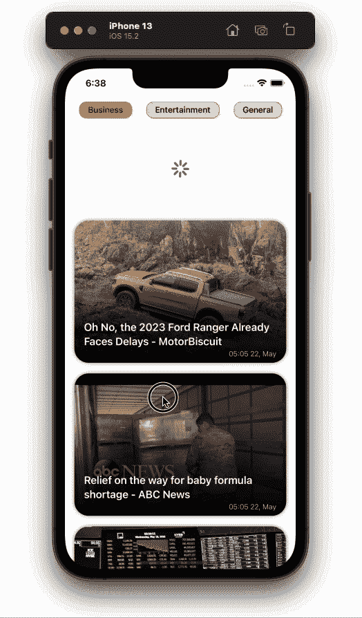

## 使用特定关键字搜索新闻

我们将在应用程序中实现的最后一个特性是使用`string`搜索查询来搜索一条特定的新闻。逻辑很简单。我们将在屏幕顶部显示一个`TextInput`。当用户在`TextInput`中键入一些内容时，我们将查询 [NewsAPI 搜索端点](https://newsapi.org/docs/get-started#search)以获得搜索结果，然后在提要中显示它。

首先，我们来添加所需的`redux` `actions`。将以下代码添加到您的`actions.ts`中:

```
export const searchNews =
  (searchTerm: string = '', setIsLoading: Function = () => {}) =>
  async (dispatch: Function) => {
    try {
      setIsLoading(true);
      const res = await apiClient.get(`everything?q=${searchTerm}`);
      setIsLoading(false);
      if (res.status === 200) {
        dispatch({
          type: SEARCH_NEWS,
          payload: res?.data?.articles,
        });
      } else {
        console.warn('Something went wrong');
      }
    } catch (error) {
      console.error(error);
    }
};

export const resetSearchResults = () => (dispatch: Function) => {
  dispatch({
    type: RESET_SEARCH_RESULTS,
  });
};

```

我们还需要给我们的约化子添加一些额外的状态。将以下代码添加到您的`reducers.ts`中:

```
import {GET_NEWS_FEED, RESET_SEARCH_RESULTS, SEARCH_NEWS} from './actions';

const initialState = {
  newsFeed: [],
  searchResults: [],
};
const feedReducer = (
  state = initialState,
  action: {type: String; payload: any},
) => {
  switch (action.type) {
    case GET_NEWS_FEED:
      return {...state, newsFeed: action.payload};
    case SEARCH_NEWS:
      return {...state, searchResults: action.payload};
    case RESET_SEARCH_RESULTS:
      return {...state, searchResults: []};
    default:
      return state;
  }
};
export default feedReducer;

```

现在我们的状态已经设置好了，让我们实现搜索功能。将下面的代码添加到您的`feed/index.tsx`中:

```
import React, {useCallback, useEffect, useState} from 'react';
import {FlatList, RefreshControl, useColorScheme, View} from 'react-native';
import uuid from 'react-native-uuid';
import {useDispatch, useSelector} from 'react-redux';
import {NewsArticle, NewsTags, SearchInput} from '../../components';
import {NewsCategory} from '../../constants';
import {getNewsFeed} from '../../redux/actions';
import styles from './styles';

export const Feed: React.FC = () => {
  const {newsFeed, searchResults} = useSelector(
    (state: any) => state.feedReducer,
  );
  const [isLoading, setIsLoading] = useState(false);
  const [selectedCategory, setSelectedCategory] = useState(
    NewsCategory.business,
  );
  const [searchText, setSearchText] = useState('');
  const dispatch: Function = useDispatch();
  useEffect(() => {
    dispatch(getNewsFeed(setIsLoading, selectedCategory));
  }, [dispatch, selectedCategory]);
  const handleRefresh = useCallback(() => {
    dispatch(getNewsFeed(setIsLoading, selectedCategory));
  }, [dispatch, selectedCategory]);
  const backgroundColor = useColorScheme() === 'dark' ? '#000' : '#fff';
  return (
    <View style={[styles.container, {backgroundColor}]}>
      <SearchInput
        searchText={searchText}
        setSearchText={setSearchText}
        setIsLoading={setIsLoading}
      />
      {!searchText?.trim() && (
        <NewsTags
          selectedCategory={selectedCategory}
          setSelectedCategory={setSelectedCategory}
        />
      )}
      <FlatList
        keyExtractor={() => uuid.v4()?.toString()}
        showsVerticalScrollIndicator={false}
        data={searchText?.trim() ? searchResults : newsFeed}
        renderItem={({item, index}: any) => (
          <NewsArticle post={item} />
        )}
        refreshControl={
          <RefreshControl refreshing={isLoading} onRefresh={handleRefresh} />
        }
        style={styles.list}
      />
    </View>
  );
};

```

请注意，我们添加了一个名为`SearchInput`的新组件。让我们在代码中创建它。在`components`文件夹中，创建一个名为`SearchInput`的文件夹，并将里面的文件命名为`styles.ts`和`index.tsx`:

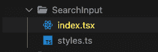

将以下代码添加到`styles.ts`文件中:

```
import {StyleSheet} from 'react-native';

export default StyleSheet.create({
  container: {
    height: 40,
    marginHorizontal: 24,
    marginBottom: 8,
    borderRadius: 20,
    paddingHorizontal: 24,
    fontWeight: '400',
  },
});

```

在编写`SearchInput`的代码之前，我们首先需要安装一个库:

```
yarn add lodash

```

我们使用`lodash`在`searchInput`的`onChangeText`方法上实现`debounce`方法。最后，将以下代码添加到`SearchInput/index.tsx`文件中:

```
import React, {useCallback} from 'react';
import {TextInput, useColorScheme} from 'react-native';
import {useDispatch} from 'react-redux';
import {resetSearchResults, searchNews} from '../../redux/actions';
import styles from './styles';
import {debounce} from 'lodash';

export const SearchInput: React.FC<{
  searchText: string;
  setSearchText: Function;
  setIsLoading: Function;
}> = ({searchText, setSearchText, setIsLoading}) => {
  const backgroundColor = useColorScheme() === 'dark' ? '#333' : '#ddd';
  const placeholderColor = useColorScheme() === 'dark' ? '#eee' : '#111';
  const color = useColorScheme() === 'dark' ? '#fff' : '#000';
  const dispatch: Function = useDispatch();
  const searchForText = useCallback(
    debounce((text: string) => {
      if (text?.trim().length > 0) {
        dispatch(searchNews(text, setIsLoading));
      } else {
        dispatch(resetSearchResults());
      }
    }, 1000),
    [setSearchText, dispatch, setIsLoading],
  );
  return (
    <TextInput
      placeholder={'Search'}
      placeholderTextColor={placeholderColor}
      style={[styles.container, {backgroundColor, color}]}
      value={searchText}
      onChangeText={(text: string) => {
        setSearchText(text);
        searchForText(text);
      }}
      maxLength={40}
      returnKeyType={'search'}
    />
  );
};

```

这样，我们就在新闻提要应用程序中实现了搜索功能。输出将类似于下面的 gif:


## 添加共享过渡导航

我们的应用程序即将完成。我们只是少了一样东西，那就是屏幕。

正如您在上面的输出中看到的，共享的过渡效果是使用 [`react-navigation-shared-element`](https://github.com/IjzerenHein/react-navigation-shared-element) 在两个屏幕之间实现的。

首先，让我们将所有必需的依赖项添加到项目中:

```
yarn add @react-navigation/native @react-navigation/stack react-native-safe-area-context react-native-screens

```

现在，实现共享过渡:

```
yarn add react-navigation-shared-element react-native-shared-element

```

要在我们的应用程序中设置导航，在项目的根目录下创建一个名为`navigation.tsx`的新文件，并向其中添加以下代码:

```
import {NavigationContainer} from '@react-navigation/native';
import React from 'react';
import {createSharedElementStackNavigator} from 'react-navigation-shared-element';
import {Feed} from './src/screens/feed';
import {NewsDetails} from './src/screens/NewsDetails';

const Stack = createSharedElementStackNavigator();

export const RootNavigation = () => {
  return (
    <NavigationContainer>
      <Stack.Navigator
        initialRouteName="Feed"
        screenOptions={{headerShown: false}}>
        <Stack.Screen name="Feed" component={Feed} />
        <Stack.Screen
          name="NewsDetails"
          component={NewsDetails}
          options={{
            cardStyleInterpolator: ({current: {progress}}) => {
              return {
                cardStyle: {
                  opacity: progress,
                },
              };
            },
          }}
        />
      </Stack.Navigator>
    </NavigationContainer>
  );
};

```

注意，我们在`SharedElementsStackNavigator`中添加了两个屏幕。第一个是我们默认的`Feed`屏幕，另一个是`NewsDetails`屏幕，我们还没有创建。

让我们创建`NewsDetails`屏幕并将`shared elements`映射添加到它的组件中。在`screens`文件夹中新建一个名为`NewsDetails`的文件夹，并添加以下两个文件:


将以下代码添加到`styles.ts`文件中:

```
import {StyleSheet} from 'react-native';

export default StyleSheet.create({
  container: {
    flex: 1,
  },
  contentContainer: {
    paddingBottom: 120,
  },
  image: {
    height: 500,
    width: '100%',
    borderBottomLeftRadius: 50,
    borderBottomRightRadius: 50,
  },
  crossContainer: {
    position: 'absolute',
    top: 60,
    left: 30,
    zIndex: 9,
  },
  cross: {
    height: 34,
    width: 34,
  },
  title: {
    fontSize: 24,
    fontWeight: '600',
    lineHeight: 30,
    paddingHorizontal: 24,
    marginVertical: 18,
  },
  content: {
    fontSize: 16,
    fontWeight: '400',
    lineHeight: 22,
    paddingHorizontal: 24,
  },
  readMoreContainer: {
    position: 'absolute',
    paddingTop: 14,
    paddingBottom: 28,
    paddingHorizontal: 24,
    bottom: 0,
    width: '100%',
  },
  readMoreText: {
    fontSize: 13,
    fontWeight: '300',
    lineHeight: 22,
  },
  link: {
    color: '#00beff',
    textDecorationLine: 'underline',
    textDecorationStyle: 'solid',
    textDecorationColor: '#00beff',
  },
});

```

要在屏幕上显示新闻详情，请将下面的代码粘贴到`index.tsx`中:

```
import {useNavigation} from '@react-navigation/native';
import React, {useCallback} from 'react';
import {
  Image,
  Linking,
  ScrollView,
  Text,
  TouchableOpacity,
  useColorScheme,
  View,
} from 'react-native';
import {SharedElement} from 'react-navigation-shared-element';
import {Back} from '../../../assets';
import styles from './styles';

interface Route {
  params: {
    article: {
      author: string;
      title: string;
      urlToImage: string;
      publishedAt: string;
      url: string;
      content: string;
    };
    articleIndex: number;
  };
}
export const NewsDetails: React.FC<{route: Route}> = ({route}) => {
  const {article, articleIndex} = route?.params;
  const navigation = useNavigation();
  const goBack = useCallback(() => {
    navigation.goBack();
  }, [navigation]);
  const backgroundColor = useColorScheme() === 'dark' ? '#000' : '#fff';
  const color = useColorScheme() === 'dark' ? '#fff' : '#000';
  const contentColor = useColorScheme() === 'dark' ? '#bbb' : '#444';
  const readMoreBgColor = useColorScheme() === 'dark' ? '#222' : '#ddd';
  const handleURLPress = useCallback(() => {
    Linking.openURL(article?.url);
  }, [article]);

  return (
    <>
      <TouchableOpacity style={styles.crossContainer} onPress={goBack}>
        <Image style={styles.cross} source={Back} />
      </TouchableOpacity>
      <ScrollView
        bounces={false}
        showsVerticalScrollIndicator={false}
        style={[styles.container, {backgroundColor}]}
        contentContainerStyle={styles.contentContainer}>
        <SharedElement id={`article#${articleIndex}-Image`}>
          <Image
            style={styles.image}
            source={{uri: article?.urlToImage ?? 'https://picsum.photos/1000'}}
            resizeMode={'cover'}
          />
        </SharedElement>
        <Text style={[styles.title, {color}]}>{article?.title}</Text>
        <Text style={[styles.content, {color: contentColor}]}>
          {article?.content}
        </Text>
      </ScrollView>
      <View
        style={[styles.readMoreContainer, {backgroundColor: readMoreBgColor}]}>
        <Text style={[styles.readMoreText, {color}]} numberOfLines={2}>
          Read more at{' '}
          <Text style={styles.link} onPress={handleURLPress}>
            {article?.url}
          </Text>
        </Text>
      </View>
    </>
  );
};

(NewsDetails as any).sharedElements = (route: any) => {
  const {articleIndex} = route.params;
  return [`article#${articleIndex}-Image`];
};

```

我们只需要从提要屏幕传递正确的共享元素映射。但是，在此之前，我们需要渲染`navigation`而不是`App.tsx`文件中的`Feed`组件。将以下代码添加到`App.tsx`:

```
import React from 'react';
import {ActivityIndicator} from 'react-native';
import {Provider} from 'react-redux';
import {PersistGate} from 'redux-persist/integration/react';
import {RootNavigation} from './Navigation';
import {persistor, store} from './src/redux/store';

const App: React.FC = () => {
  return (
    <Provider store={store}>
      <PersistGate
        loading={<ActivityIndicator size={'large'} color={'#000'} />}
        persistor={persistor}>
        <RootNavigation />
      </PersistGate>
    </Provider>
  );
};
export default App;

```

现在，让我们继续讨论`NewsArticle`组件。在`NewsArticle/index.tsx`文件中进行以下更改:

```
import {useNavigation} from '@react-navigation/native';
import moment from 'moment';
import React, {useCallback} from 'react';
import {Image, Text, TouchableOpacity} from 'react-native';
import LinearGradient from 'react-native-linear-gradient';
import {SharedElement} from 'react-navigation-shared-element';
import styles from './styles';

type Post = {
  title: string;
  urlToImage: string;
  publishedAt: string;
  url: string;
  author: string;
};

export const NewsArticle: React.FC<{
  post: Post;
  index: number;
}> = ({post, index}) => {
  const navigation: any = useNavigation();
  const handleNavigate = useCallback(() => {
    navigation.navigate('NewsDetails', {article: post, articleIndex: index});
  }, [index, navigation, post]);
  return (
    <TouchableOpacity
      activeOpacity={1}
      style={styles.container}
      onPress={handleNavigate}>
      <SharedElement
        style={styles.imageContainer}
        id={`article#${index}-Image`}>
        <Image
          source={{
            uri:
              post?.urlToImage ??
              `https://picsum.photos/${Math.floor(Math.random() * 1000)}`,
            cache: 'force-cache',
          }}
          resizeMode={'cover'}
          style={styles.image}
        />
      </SharedElement>
      <LinearGradient
        colors={['#0000', '#000A', '#000']}
        style={styles.titleContainer}>
        <Text style={styles.text}>{post?.title}</Text>
        <Text style={styles.timestamp}>
          {moment(post?.publishedAt).format('HH:MM DD, MMMM')}
        </Text>
      </LinearGradient>
    </TouchableOpacity>
  );
};

```

在上面的代码中，我们将`Image`包装在`SharedElement`中，并传递给它一个 ID，这个 ID 在两个屏幕上都是通用的。在实现了所有相应的更改后，我们的应用程序将看起来如下图所示:

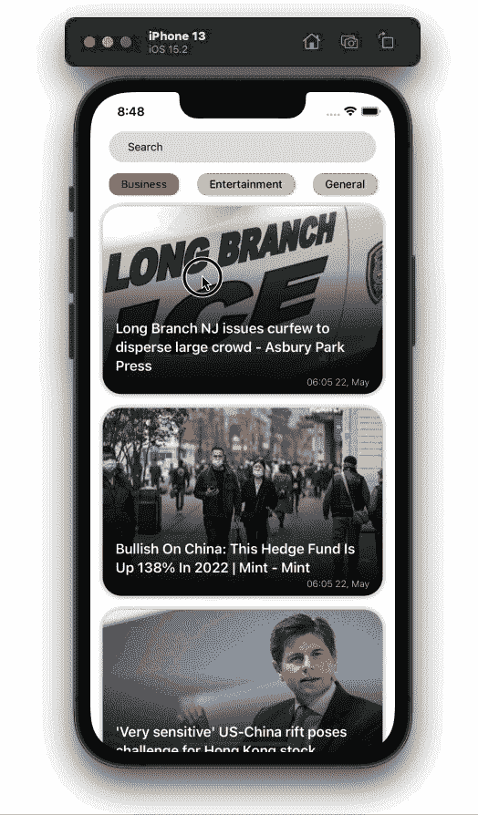

结论

## 正如您在教程中看到的，使用 React Native 创建新闻提要应用程序相当容易。本文只是一个演示，解释了我们如何与 REST API 进行交互，但是您可以走得更远，比如使用 WebSockets 进行实时更新，或者使用 GraphQL API。

如果你想让这个应用程序更有用，你可以在`NewsDetail`屏幕中给应用程序添加一个`webview`，当用户按下链接阅读更多关于文章的内容时，你可以直接在`webview`中打开链接，而不是在外部浏览器中打开。我希望你喜欢这篇文章，并快乐编码！

[LogRocket](https://lp.logrocket.com/blg/react-native-signup) :即时重现 React 原生应用中的问题。

## [LogRocket](https://lp.logrocket.com/blg/react-native-signup) 是一款 React 原生监控解决方案，可帮助您即时重现问题、确定 bug 的优先级并了解 React 原生应用的性能。

[](https://lp.logrocket.com/blg/react-native-signup)

LogRocket 还可以向你展示用户是如何与你的应用程序互动的，从而帮助你提高转化率和产品使用率。LogRocket 的产品分析功能揭示了用户不完成特定流程或不采用新功能的原因。

开始主动监控您的 React 原生应用— [免费试用 LogRocket】。](https://lp.logrocket.com/blg/react-native-signup)

Start proactively monitoring your React Native apps — [try LogRocket for free](https://lp.logrocket.com/blg/react-native-signup).