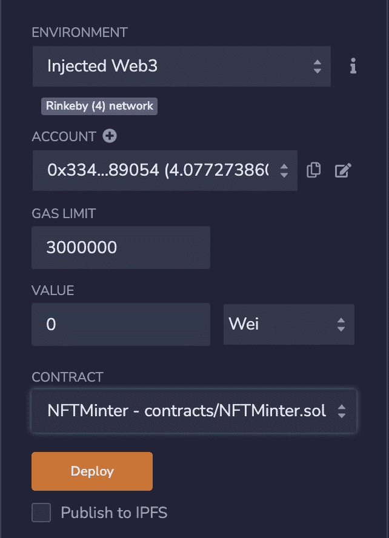
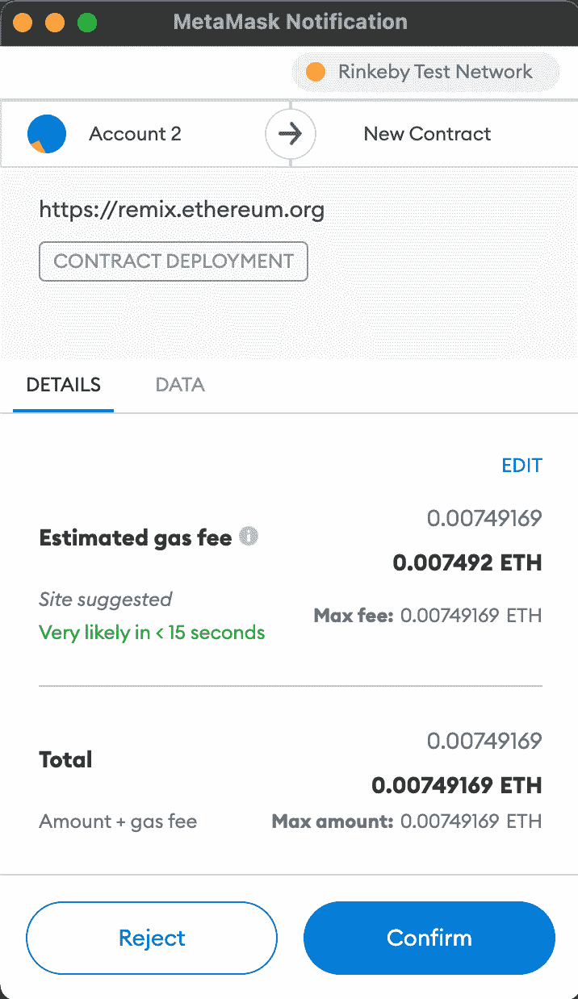
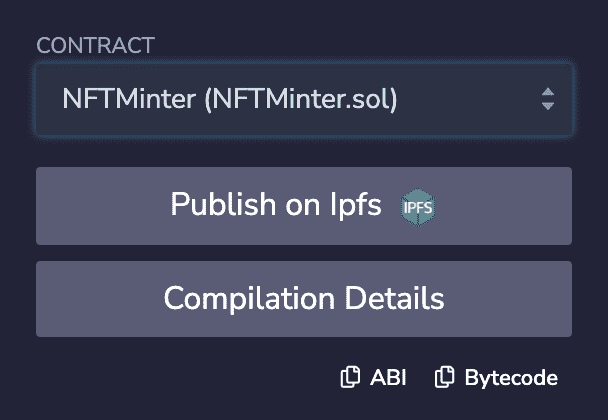
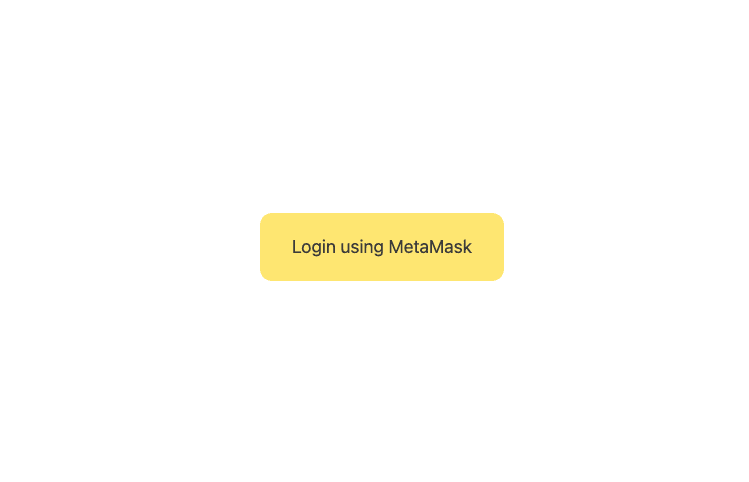
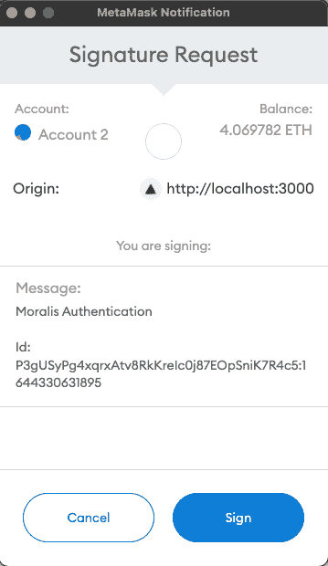

# 使用 Moralis、Solidity 和 Next.js - LogRocket 博客创建你自己的 NFT minter

> 原文：<https://blog.logrocket.com/create-nft-minter-moralis-solidity-next-js/>

NFT 现在是一种趋势；每个人都想买一个好看的 NFT，创作者和开发者都在利用这个机会。创作者绘制或构建 NFT 来销售，而开发者可以创建基于 NFT 的应用程序。

为了利用这一趋势，我们将创建一个 Web3 应用程序，帮助非开发人员创造 NFT。我们还将在 Next.js 中使用 [Moralis 来简化 Web3 操作，并使用 Solidity 来创建我们自己的 NFT 智能合约。](https://blog.logrocket.com/using-moralis-nextjs/)

## 要求

*   React 和 Next.js 的工作知识
*   固体和混合 IDE 的工作知识
*   [Node.js](https://nodejs.org) 已安装
*   代码编辑器(我更喜欢 [Visual Studio 代码](https://code.visualstudio.com)
*   与 Rinkeby 测试网络连接的 meta mask Wallet–我们不会在本文中讨论 mainnet，但是，如果您愿意，可以使用 mainnet

如果你在教程的某个地方卡住了，请随意参考 [GitHub 库](https://github.com/atharvadeosthale/nft-minter-nextjs-solidity)。

## 建立我们的合同

在我们继续 NFT minter 的前端之前，我们需要在区块链的 Rinkeby 以太坊上创建和部署一个智能合约。打开 [Remix IDE](https://blog.logrocket.com/debugging-ethereum-transactions-remix-ide/) ，在**合同**文件夹下，新建一个 Solidity 文件。

我把它命名为`NFTMinter.sol`:

```
// SPDX-License-Identifier: Unlicense
pragma solidity ^0.8.4;
import "@openzeppelin/contracts/token/ERC721/extensions/ERC721Enumerable.sol";
import "@openzeppelin/contracts/token/ERC721/extensions/ERC721URIStorage.sol";
import "@openzeppelin/contracts/token/ERC721/ERC721.sol";
import "@openzeppelin/contracts/utils/math/SafeMath.sol";
contract MinterYT is ERC721, ERC721Enumerable, ERC721URIStorage {
    using SafeMath for uint256;
    uint public constant mintPrice = 0;

    function _beforeTokenTransfer(address from, address to, uint256 tokenId)
        internal
        override(ERC721, ERC721Enumerable)
    {
        super._beforeTokenTransfer(from, to, tokenId);
    }
    function _burn(uint256 tokenId) internal override(ERC721, ERC721URIStorage) {
        super._burn(tokenId);
    }
    function tokenURI(uint256 tokenId)
        public
        view
        override(ERC721, ERC721URIStorage)
        returns (string memory)
    {
        return super.tokenURI(tokenId);
    }
    function supportsInterface(bytes4 interfaceId)
        public
        view
        override(ERC721, ERC721Enumerable)
        returns (bool)
    {
        return super.supportsInterface(interfaceId);
    }
    constructor() ERC721("YTMinter", "YTM") {}
    function mint(string memory _uri) public payable {
        uint256 mintIndex = totalSupply();
        _safeMint(msg.sender, mintIndex);
        _setTokenURI(mintIndex, _uri);
    }
}

```

下面是上面代码中发生的情况:

首先，我们导入 OpenZeppelin 文件来创建 NFT 智能合约。这些不同的文件有我们的契约可以扩展到的类。

接下来，我们将我们的智能契约扩展到`ERC721`、基本的 OpenZeppelin 文件(`ERC721`是令牌类型)、`ERC721Enumerable`，以便我们可以跟踪生成的令牌数量和令牌 id，以及`ERC721URIStorage`，以便我们可以在生成 NFT 时存储元数据 URL。这使得像 [OpenSea](https://opensea.io) 这样的网站可以从元数据中提取图像、名称和描述。

我们还将函数`_beforeTokenTransfer`、`_burn`、`tokenURI`和`supportsInterface`覆盖到它们的父类函数。不这样做将导致 Solidity 编译器抛出一个错误，因为它将混淆父类中的重复函数。

然后，我们创建一个构造函数来指定我们的`ERC721`标记的名称和符号`constructor() ERC721("NFTMinter", "NTM") {}`。您可以相应地更改参数。

接下来，我们创建一个`mint`函数，它将执行 NFT 铸造操作。我们将把元数据 URL 作为参数中的`uri`传入，以便我们可以存储元数据。

最后，我们正在获取令牌的数量，这样我们就可以获取当前的令牌 ID 并将其分配给一个新的 NFT。我们使用`_safeMint`函数铸造 NFT，并传入`msg.sender`(表示 NFT 应该进入发出请求的钱包)和`_uri`作为参数。然后，我们为 NFT 设置了一个象征性的 URI。

现在我们的 NFT 合同准备好了。通过按`Control+S` (Windows)或`Command+S` (Mac)来编译合同。转到**部署**选项卡，您应该会看到以下配置:



确保您连接到 MetaMask 上的 Rinkeby 网络，并且您有一些测试 ETH(您可以从任何[水龙头](https://faucets.chain.link/rinkeby)获得)，因为合同将部署在连接的网络上。

此外，确保您有正确的合同集来部署(选择列表中的最后一个，因为列表中充满了 OpenZeppelin 合同)。现在点击**部署**。您应该会看到类似于以下内容的元掩码弹出窗口:



按**确认**确认交易，并在区块链上部署合同。该过程需要几秒钟才能完成。

现在，在 **Deploy** 选项卡的 **Deployed contracts** 部分，您应该可以看到您的部署和合同地址。通过点击它，您可以看到各种功能并执行它们，但我们将通过 Next.js 应用程序直接与这个智能合约进行交互。

请确保您记下了合同地址，因为我们需要它在前端与合同进行交互。我们还需要注意契约 ABI，它指示智能契约中可用的各种功能的细节。

要获得 ABI，请转到**编译**选项卡，您应该在下半部分看到这个:



点击 **ABI** 按钮复制 ABI。把它记下来，因为我们以后还会用到它。

## 创建 Moralis 服务器

现在我们需要建立一个道德服务器。如果你还没有一个新账户，就去 Moralis 网站创建一个新账户。在仪表板中，点击顶部的**创建新服务器**。选择 **Testnet** 服务器，因为我们将在这里处理 Testnet。


输入你的实例名，它的位置(班加罗尔离我很近，所以我选择了它)并选择 **Eth (Rinkeby)** 。点击**添加实例**，您的服务器将很快创建完成。点击**查看详情**并记下**应用 ID** 和**服务器 URL** ，因为我们在前端需要它来与 Moralis 服务器通信。

## 设置 Next.js 应用程序

现在让我们进入应用程序的前端。要设置 Next.js 应用程序，请转到一个安全目录，并在终端中使用以下命令:

```
npx create-next-app nft-minter --example with-tailwindcss

```

请随意用您自己的项目名称替换`nft-minter`。我们还使用了示例`with-tailwindcss`，以便默认安装[顺风 CSS](https://blog.logrocket.com/styling-remix-applications-tailwind-css/) 来执行最小样式。

让我们为我们的项目安装一些依赖项。运行以下命令:

```
npm install moralis react-moralis web3

```

`Moralis`是 Moralis 的基础包，`react-moralis`为我们提供了各种方便的钩子，`web3`包用于与智能合约通信(目前 Moralis 只支持执行只读智能合约，因此安装了`web3`)。

进入项目目录，创建一个名为`.env.local`的新文件来保存我们的环境变量。在这里，我们将添加我们的 Moralis 服务器详细信息:

```
NEXT_PUBLIC_APP_ID=(app id here)
NEXT_PUBLIC_SERVER_URL=(server url here)

```

我们使用`NEXT_PUBLIC_`作为前缀，以便 Next.js 知道这些环境变量可以安全地暴露给客户端，并且不是密钥。

现在，您可以通过运行以下命令来启动开发服务器:

```
npm run dev

```

现在创建一个名为`contract.js`的新文件，您将在其中存储您的智能合约信息。这是我的文件，确保你更换了你的`contractAddress`和`contractABI`:

```
export const contractAddress = "0xC68c6266BA08c63BD71fEbaaEFb62a7c61bB38F3";
export const contractABI = [
  {
    inputs: [],
    stateMutability: "nonpayable",
    type: "constructor",
  },
  {
    anonymous: false,
    inputs: [
      {
        indexed: true,
        internalType: "address",
        name: "owner",
        type: "address",
      },
      {
        indexed: true,
        internalType: "address",
        name: "approved",
        type: "address",
      },
      {
        indexed: true,
        internalType: "uint256",
        name: "tokenId",
        type: "uint256",
      },
    ],
    name: "Approval",
    type: "event",
  },
  {
    anonymous: false,
    inputs: [
      {
        indexed: true,
        internalType: "address",
        name: "owner",
        type: "address",
      },
      {
        indexed: true,
        internalType: "address",
        name: "operator",
        type: "address",
      },
      {
        indexed: false,
        internalType: "bool",
        name: "approved",
        type: "bool",
      },
    ],
    name: "ApprovalForAll",
    type: "event",
  },
  {
    anonymous: false,
    inputs: [
      {
        indexed: true,
        internalType: "address",
        name: "from",
        type: "address",
      },
      {
        indexed: true,
        internalType: "address",
        name: "to",
        type: "address",
      },
      {
        indexed: true,
        internalType: "uint256",
        name: "tokenId",
        type: "uint256",
      },
    ],
    name: "Transfer",
    type: "event",
  },
  {
    inputs: [
      {
        internalType: "address",
        name: "to",
        type: "address",
      },
      {
        internalType: "uint256",
        name: "tokenId",
        type: "uint256",
      },
    ],
    name: "approve",
    outputs: [],
    stateMutability: "nonpayable",
    type: "function",
  },
  {
    inputs: [
      {
        internalType: "address",
        name: "owner",
        type: "address",
      },
    ],
    name: "balanceOf",
    outputs: [
      {
        internalType: "uint256",
        name: "",
        type: "uint256",
      },
    ],
    stateMutability: "view",
    type: "function",
  },
  {
    inputs: [
      {
        internalType: "uint256",
        name: "tokenId",
        type: "uint256",
      },
    ],
    name: "getApproved",
    outputs: [
      {
        internalType: "address",
        name: "",
        type: "address",
      },
    ],
    stateMutability: "view",
    type: "function",
  },
  {
    inputs: [
      {
        internalType: "address",
        name: "owner",
        type: "address",
      },
      {
        internalType: "address",
        name: "operator",
        type: "address",
      },
    ],
    name: "isApprovedForAll",
    outputs: [
      {
        internalType: "bool",
        name: "",
        type: "bool",
      },
    ],
    stateMutability: "view",
    type: "function",
  },
  {
    inputs: [
      {
        internalType: "string",
        name: "_uri",
        type: "string",
      },
    ],
    name: "mint",
    outputs: [],
    stateMutability: "payable",
    type: "function",
  },
  {
    inputs: [],
    name: "mintPrice",
    outputs: [
      {
        internalType: "uint256",
        name: "",
        type: "uint256",
      },
    ],
    stateMutability: "view",
    type: "function",
  },
  {
    inputs: [],
    name: "name",
    outputs: [
      {
        internalType: "string",
        name: "",
        type: "string",
      },
    ],
    stateMutability: "view",
    type: "function",
  },
  {
    inputs: [
      {
        internalType: "uint256",
        name: "tokenId",
        type: "uint256",
      },
    ],
    name: "ownerOf",
    outputs: [
      {
        internalType: "address",
        name: "",
        type: "address",
      },
    ],
    stateMutability: "view",
    type: "function",
  },
  {
    inputs: [
      {
        internalType: "address",
        name: "from",
        type: "address",
      },
      {
        internalType: "address",
        name: "to",
        type: "address",
      },
      {
        internalType: "uint256",
        name: "tokenId",
        type: "uint256",
      },
    ],
    name: "safeTransferFrom",
    outputs: [],
    stateMutability: "nonpayable",
    type: "function",
  },
  {
    inputs: [
      {
        internalType: "address",
        name: "from",
        type: "address",
      },
      {
        internalType: "address",
        name: "to",
        type: "address",
      },
      {
        internalType: "uint256",
        name: "tokenId",
        type: "uint256",
      },
      {
        internalType: "bytes",
        name: "_data",
        type: "bytes",
      },
    ],
    name: "safeTransferFrom",
    outputs: [],
    stateMutability: "nonpayable",
    type: "function",
  },
  {
    inputs: [
      {
        internalType: "address",
        name: "operator",
        type: "address",
      },
      {
        internalType: "bool",
        name: "approved",
        type: "bool",
      },
    ],
    name: "setApprovalForAll",
    outputs: [],
    stateMutability: "nonpayable",
    type: "function",
  },
  {
    inputs: [
      {
        internalType: "bytes4",
        name: "interfaceId",
        type: "bytes4",
      },
    ],
    name: "supportsInterface",
    outputs: [
      {
        internalType: "bool",
        name: "",
        type: "bool",
      },
    ],
    stateMutability: "view",
    type: "function",
  },
  {
    inputs: [],
    name: "symbol",
    outputs: [
      {
        internalType: "string",
        name: "",
        type: "string",
      },
    ],
    stateMutability: "view",
    type: "function",
  },
  {
    inputs: [
      {
        internalType: "uint256",
        name: "index",
        type: "uint256",
      },
    ],
    name: "tokenByIndex",
    outputs: [
      {
        internalType: "uint256",
        name: "",
        type: "uint256",
      },
    ],
    stateMutability: "view",
    type: "function",
  },
  {
    inputs: [
      {
        internalType: "address",
        name: "owner",
        type: "address",
      },
      {
        internalType: "uint256",
        name: "index",
        type: "uint256",
      },
    ],
    name: "tokenOfOwnerByIndex",
    outputs: [
      {
        internalType: "uint256",
        name: "",
        type: "uint256",
      },
    ],
    stateMutability: "view",
    type: "function",
  },
  {
    inputs: [
      {
        internalType: "uint256",
        name: "tokenId",
        type: "uint256",
      },
    ],
    name: "tokenURI",
    outputs: [
      {
        internalType: "string",
        name: "",
        type: "string",
      },
    ],
    stateMutability: "view",
    type: "function",
  },
  {
    inputs: [],
    name: "totalSupply",
    outputs: [
      {
        internalType: "uint256",
        name: "",
        type: "uint256",
      },
    ],
    stateMutability: "view",
    type: "function",
  },
  {
    inputs: [
      {
        internalType: "address",
        name: "from",
        type: "address",
      },
      {
        internalType: "address",
        name: "to",
        type: "address",
      },
      {
        internalType: "uint256",
        name: "tokenId",
        type: "uint256",
      },
    ],
    name: "transferFrom",
    outputs: [],
    stateMutability: "nonpayable",
    type: "function",
  },
];

```

现在，转到`pages`文件夹，将`_app.tsx`和`index.tsx`分别重命名为`_app.js`和`index.js`，因为在本教程中我们不会处理 TypeScript。

让我们用 Moralis 提供者包装整个应用程序，这样我们就可以在整个应用程序中使用各种 Moralis 钩子。为此，您的`app.js`文件应该如下所示:

```
import { MoralisProvider } from "react-moralis";
import "../styles/globals.css";
function MyApp({ Component, pageProps }) {
  return (
    <MoralisProvider
      appId={process.env.NEXT_PUBLIC_APP_ID}
      serverUrl={process.env.NEXT_PUBLIC_SERVER_URL}
    >
      <Component {...pageProps} />
    </MoralisProvider>
  );
}
export default MyApp;

```

这里，我们将`Component`(这是我们的应用程序)包装在`MoralisProvider`中，并从环境变量传入`appId`和`serverUrl`，这样我们就可以连接到我们的 Moralis 服务器。

现在，让我们用 Moralis 准备我们的登录屏幕。这将在网页上启用 MetaMask 登录。您的`index.js`文件应该如下所示:

```
import Head from "next/head";
import { useRouter } from "next/router";
import { useEffect } from "react";
import { useMoralis } from "react-moralis";
export default function Home() {
  const { authenticate, isAuthenticated, logout } = useMoralis();
  const router = useRouter();
  useEffect(() => {
    if (isAuthenticated) router.replace("/dashboard");
  }, [isAuthenticated]);
  return (
    <div className="flex w-screen h-screen items-center justify-center">
      <Head>
        <title>NFT Minter</title>
        <link rel="icon" href="/favicon.ico" />
      </Head>
      <button
        onClick={authenticate}
        className="bg-yellow-300 px-8 py-5 rounded-xl text-lg animate-pulse"
      >
        Login using MetaMask
      </button>
    </div>
  );
}

```

我们在上面的代码中执行了以下操作:

首先，我们使用`useMoralis()`钩子来获取认证状态，并使用一个函数来轻松地认证用户。

然后，我们有一个依赖于`isAuthenticated`的`useEffect()`钩子，这样每当用户身份验证状态改变时，我们可以检查用户是否通过了身份验证，如果是，就进行重定向。

最后，我们在按钮`onClick`上添加了`authenticate`功能，这样每当用户使用元掩码点击**登录时，Moralis 就会为我们处理元掩码认证。**

现在，当您访问 [http://localhost:3000/](http://localhost:3000/) 时，您应该会看到这样的屏幕:



单击该按钮时，您应该会看到用于身份验证的元掩码弹出窗口:



当您通过按下**符号**批准交易时，您应该会看到 404 页面，这是预期的，因为我们还没有在仪表板页面上工作。

说到仪表板，让我们开始工作吧！在`pages`文件夹中，创建一个名为`dashboard`的新文件夹(这与我们的路线相匹配)，并在该文件夹中创建一个新文件`index.js`。

以下是该文件的基本布局:

```
import { useRouter } from "next/router";
import { useEffect, useState } from "react";
import { useMoralis } from "react-moralis";
import Moralis from "moralis";
import { contractABI, contractAddress } from "../../contract";

function Dashboard() {
  const { isAuthenticated, logout, user } = useMoralis();
  const [name, setName] = useState("");
  const [description, setDescription] = useState("");
  const [file, setFile] = useState(null);
  const router = useRouter();
  const onSubmit = async (e) => {
    // do something
  };
  useEffect(() => {
    if (!isAuthenticated) router.replace("/");
  }, [isAuthenticated]);
  return (
    <div className="flex w-screen h-screen items-center justify-center">
      <form onSubmit={onSubmit}>
        <div>
          <input
            type="text"
            className="border-[1px] p-2 text-lg border-black w-full"
            value={name}
            placeholder="Name"
            onChange={(e) => setName(e.target.value)}
          />
        </div>
        <div className="mt-3">
          <input
            type="text"
            className="border-[1px] p-2 text-lg border-black w-full"
            value={description}
            placeholder="Description"
            onChange={(e) => setDescription(e.target.value)}
          />
        </div>
        <div className="mt-3">
          <input
            type="file"
            className="border-[1px] p-2 text-lg border-black"
            onChange={(e) => setFile(e.target.files[0])}
          />
        </div>
        <button
          type="submit"
          className="mt-5 w-full p-5 bg-green-700 text-white text-lg rounded-xl animate-pulse"
        >
          Mint now!
        </button>
        <button
          onClick={logout}
          className="mt-5 w-full p-5 bg-red-700 text-white text-lg rounded-xl"
        >
          Logout
        </button>
      </form>
    </div>
  );
}
export default Dashboard;

```

上面的代码非常简单；这是一个表单的布局，我们正在创建状态来跟踪它。我们还会检查用户在访问该页面时是否经过身份验证，并相应地进行重定向。

因为我们将与智能合约通信，所以我们需要使用名为`web3`的包，因为 Moralis 目前只支持只读智能合约。在`imports`部分使用下面的代码来初始化这个包:

```
const web3 = new Web3(Web3.givenProvider);

```

这将初始化`web3`包，并通知它使用元掩码作为提供者。

现在，让我们处理`onSubmit`函数，它将帮助我们铸造 NFT:

```
const onSubmit = async (e) => {
  e.preventDefault();
  try {
    // Attempt to save image to IPFS
    const file1 = new Moralis.File(file.name, file);
    await file1.saveIPFS();
    const file1url = file1.ipfs();
    // Generate metadata and save to IPFS
    const metadata = {
      name,
      description,
      image: file1url,
    };
    const file2 = new Moralis.File(`${name}metadata.json`, {
      base64: Buffer.from(JSON.stringify(metadata)).toString("base64"),
    });
    await file2.saveIPFS();
    const metadataurl = file2.ipfs();
    // Interact with smart contract
    const contract = new web3.eth.Contract(contractABI, contractAddress);
    const response = await contract.methods
      .mint(metadataurl)
      .send({ from: user.get("ethAddress") });
    // Get token id
    const tokenId = response.events.Transfer.returnValues.tokenId;
    // Display alert
    alert(
      `NFT successfully minted. Contract address - ${contractAddress} and Token ID - ${tokenId}`
    );
  } catch (err) {
    console.error(err);
    alert("An error occured!");
  }
};

```

在上面的代码中，我们执行了以下操作:

*   发生错误时使用 try/catch 块
*   将用户上传的图片保存到 image 谢天谢地，道德使这变得容易
*   获取图像的 URL，因为我们需要它作为元数据
*   用 NFT `name`、`description`和`image`(我们之前收集的 URL)构建元数据
*   将这个元数据转换成 JSON 字符串，然后转换成`base64`字符串。这样，Moralis 可以将它转换成一个文件，并保存到 IPFS

多简单啊！我们还获得了元数据的 URL。

最后，我们通过传入我们的`contractABI`和`contractAddress`来初始化我们的契约，运行`mint`函数，并传入我们在 Solidity 契约中期望的元数据 URL。然后，我们从响应中提取令牌 ID，并向用户显示`contractAddress`和`tokenId`，以备将来参考。

如果您访问仪表板，您应该会看到这样的屏幕:


一旦您输入 NFT 的名称、描述和图像，并在 MetaMask 中对交易进行身份验证，您应该会在身份验证后在您的个人资料下的 [OpenSea Testnets](https://testnets.opensea.io) 中看到该 NFT。


现在你可以在任何市场上出售这个 NFT！请记住，这将需要一些时间来为这个 NFT 人口在开放海洋，所以要有耐心，如果 NFT 不会立即出现。

## 结论

你可以用 Web3 做很多事情。NFTs、Dao 等等！这篇教程只是一个基本的演示，展示了在 Moralis 的帮助下你可以做些什么。

我建议在这个教程里多探索，多实现自己的想法。

## 加入像 Bitso 和 Coinsquare 这样的组织，他们使用 LogRocket 主动监控他们的 Web3 应用

影响用户在您的应用中激活和交易的能力的客户端问题会极大地影响您的底线。如果您对监控 UX 问题、自动显示 JavaScript 错误、跟踪缓慢的网络请求和组件加载时间感兴趣，

[try LogRocket](https://lp.logrocket.com/blg/web3-signup)

.

[](https://lp.logrocket.com/blg/web3-signup)[https://logrocket.com/signup/](https://lp.logrocket.com/blg/web3-signup)

LogRocket 就像是网络和移动应用的 DVR，记录你的网络应用或网站上发生的一切。您可以汇总和报告关键的前端性能指标，重放用户会话和应用程序状态，记录网络请求，并自动显示所有错误，而不是猜测问题发生的原因。

现代化您调试 web 和移动应用的方式— [开始免费监控](https://lp.logrocket.com/blg/web3-signup)。