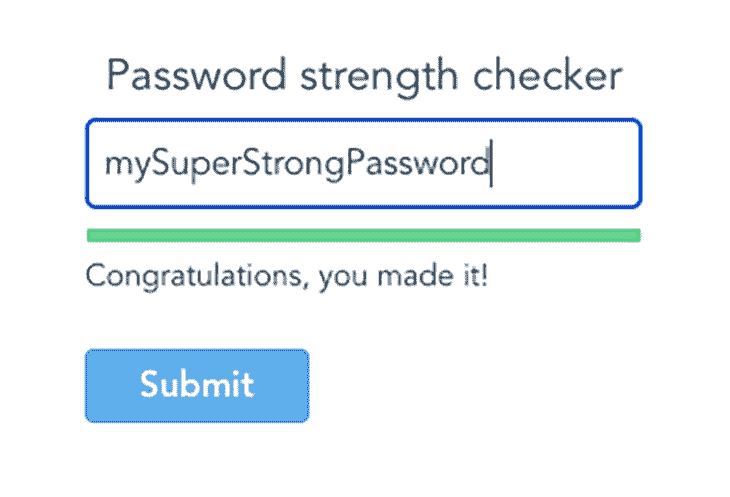
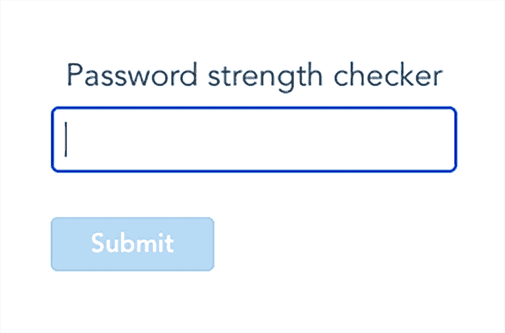
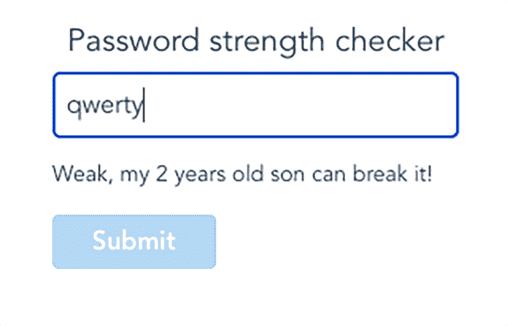

# 如何用 Vue 创建密码强度检查器

> 原文：<https://blog.logrocket.com/create-password-strength-checker-vue/>

我敢打赌，你已经注意到，今天大多数应用程序都要求你设置一个符合特定规则的密码。这些规则可能是最小长度，包括或排除特殊字符、大写或小写字母等，在大多数情况下，这些规则足以确保您的密码是强有力的。但是我们可以更进一步，使用一个名为 [`zxcvbn`](https://github.com/zxcvbn-ts/zxcvbn) 的库来检查我们的密码强度。

## zxcvbn 是什么？

`zxcvbn`是一个受密码破解者启发的密码强度估计器。通过模式匹配和保守估计，它对 40000 个常用密码、常用名字姓氏、维基百科中的流行词、不同语言和不同国家的常用词以及其他常用模式进行识别和加权，如日期、重复(`aaa`)、序列(`abcd`)、键盘模式(`qwertyuiop`)等等。



下面是密码检查器做的一些事情，我们将在这篇文章中讨论:

*   允许用户输入任何密码
*   检查每次输入更改的密码分数
*   使用彩色进度条和消息提供视觉反馈
*   达到指定分数时启用提交按钮

### 你会在这篇文章中发现什么

在本文中，我将向您展示如何:

1.  [用 Tailwind CSS 创建一个基本的表单模板](#create-basic-form-template-tailwind-css)
2.  [用`zxcvbn`](#build-password-score-component-zxcvbn) 构建密码评分组件
3.  [手柄按钮状态](#handle-button-state)
4.  向表单添加一个颜色编码的动画进度条

我在 [StackBlitz](https://stackblitz.com/edit/maz-calculator-qdhnqx) 设置了一个演示，这样你就可以看到我们的目标是什么。

好吧，这就是我们想要的，让我们实现它吧！

## 步骤 1:用 Tailwind CSS 创建一个基本的表单模板

让我们从创建表单的基本模板开始。我们将使用 Tailwind CSS 来使样式更加简单快捷。

在我们的`PasswordInputForm`组件的模板部分，添加一个`input`和一个`button`:

```
<!-- PasswordInputForm.vue -->
<template>
  <div class="container mx-auto w-64">
    <input
      class="block w-full my-1 p-2 border border-grey-30 rounded leading-normal text-grey-80"
      type="text"
    />
    <button
      class="mt-6 px-6 py-1 leading-lg select-none bg-blue-400 text-white font-semibold border border-blue-500 rounded"
    >
      Submit
    </button>
  </div>
</template>

```

现在我们有了一些标记，让我们给组件添加一些属性，让它更具交互性。在我们组件的`script`部分，添加`password`和`isPasswordStrong`属性，这两个属性都是[反应和可变`ref`对象](https://vuejs.org/api/reactivity-core.html#ref)。

```
// PasswordInputForm.vue
<script>
import { ref } from "vue";

export default {
  setup() {
    const password = ref("");
    const isPasswordStrong = ref(false);

    return { password, isPasswordStrong };
  },
};
</script>

```

在这个阶段，我们需要做的最后一件事是将新创建的属性绑定到模板。我们使用 [`v-model`指令](https://vuejs.org/api/built-in-directives.html#v-model)将`password`属性绑定到`input`元素，这允许我们在每次用户更改输入时跟踪当前值，并将该值分配给我们的 reactive `password` ref。

```
<!-- PasswordInputForm.vue -->
<input
  class="block w-full my-1 p-2 border border-grey-30 rounded leading-normal text-grey-80"
  type="text"
  v-model="password"
/>

```

在我们的演示中，我们还可以根据道具的值使用`isPasswordStrong`来启用或禁用蓝色的**提交**按钮。我们可以通过[有条件地为按钮设置适当的类](https://vuejs.org/guide/essentials/class-and-style.html#binding-html-classes)来实现。

```
<!-- PasswordInputForm.vue -->
<button
  class="mt-6 px-6 py-1 leading-lg select-none bg-blue-400 text-white font-semibold border border-blue-500 rounded"
  :class="[
    {
      'cursor-not-allowed opacity-50 pointer-events-hover': !isPasswordStrong,
    },
  ]"
>
  Submit
</button>

```

完成后，我们得到了一个基本模板，如下所示:



> Vue.js 的启动项目

步骤 2:用`zxcvbn`构建密码分数组件

## 我们的输入准备好了。当我们更改输入时，它会反映组件实例的适当属性。让我们实现代码逻辑，它将允许我们获得密码的分数。

我们将把所有这些逻辑封装到一个名为`PasswordScore`的独立组件中。在这一步中，我们还将向用户显示一条消息，表明当前密码的强度。

和以前一样，我们将从一个简单的组件模板开始。

在`script`部分，添加一个[道具](https://vuejs.org/guide/components/props.html#props)选项，它定义了我们的组件将从外部世界接受什么。我们只需要一个`value`属性来告诉我们当前用户的输入是什么，因此我们可以将该属性标记为`required`——这将迫使我们总是将该属性从父组件传递到子组件。

```
<!-- PasswordScore.vue -->
<template>
  <div class="relative select-none">
    <p class="absolute mt-1 text-sm">
      // Here we will show the message to the user
    </p>
  </div>
</template>

```

我们有组件中的值。现在，我们需要使用`zxcvbn`库来检索该值的分数。

```
<!-- PasswordScore.vue -->
<script>
export default {
  props: {
    value: {
      type: String,
      required: true,
    },
  }
}
</script>

```

第一步是将所需的库元素导入我们的组件。我们在`script`部分的顶部这样做。

接下来，我们需要通过设置适当的选项来初始化这个库。我们希望在创建组件时立即初始化库。为了触发组件创建的逻辑，我们只需要将它放在该组件的`setup`函数中。对于可以传递给`zxcvbn` 的[可用选项的详细描述，我建议查看 zxcvbn 文档。](https://zxcvbn-ts.github.io/zxcvbn/guide/options/#setoptions)

```
<!-- PasswordScore.vue -->
<script>
import { zxcvbn, zxcvbnOptions } from "@zxcvbn-ts/core";
import zxcvbnCommonPackage from "@zxcvbn-ts/language-common";
import zxcvbnEnPackage from "@zxcvbn-ts/language-en";

export default {
  ...
}
</script>

```

使用 zxcvbn 乐谱库

```
// PasswordScore.vue
export default {
  ...

  setup() {
    const options = {
        dictionary: {
          ...zxcvbnCommonPackage.dictionary,
          ...zxcvbnEnPackage.dictionary,
        },
        graphs: zxcvbnCommonPackage.adjacencyGraphs,
        translations: zxcvbnEnPackage.translations,
      };
      zxcvbnOptions.setOptions(options);
    }
}
</script>

```

### 好了，我们都准备好开始使用乐谱库了。让我们停下来想一想我们想要做什么:每次值改变时，获得输入值的分数。

获得基于另一个反应值的值的最好方法是使用一个[计算属性](https://vuejs.org/guide/essentials/computed.html#computed-properties)。因此，让我们定义一个名为`score`的计算属性。从 Vue 导入一个`computed`助手，并使用该助手为一个`const`赋值。

在 computed 属性中，首先检查该值是否存在，或者它是否为空字符串。如果后者是`true`，我们可以为自己节省一些时间，只需返回`0`。

```
// PasswordScore.vue
export default {
  import { computed } from "vue";
  ...

  setup(props) {
    ...
    const score = computed(() => {
      const hasValue = props.value && props.value.length > 0;

      if (!hasValue) {
        return 0;
      }

      return zxcvbn(props.value).score + 1;
    });
    ...
  }
  ...
}

```

如果值不为空，我们使用`zxcvbn`，将我们的`value`传递给它。看看我们在这里如何使用道具——道具作为第一个参数传递给`setup`函数，然后使用`props.xyz`检索。然后 zxcvbn 将返回一个带有`score`属性的对象。

太好了！我们的`score` computed 属性将在每次输入值改变时重新计算，并为我们返回一个分值。但是我们如何向用户展示这个价值呢？

显示 zxcvbn 分数值

### 让我们再实现两个计算属性来帮助我们向用户显示一条指示当前分数的消息。

第一个将包含我们可以向用户显示的所有潜在描述和颜色代码。

第二个函数提取并返回我们想要显示给用户的描述。它的工作原理和上面一样:首先，我们检查值是否存在，并且它不是一个空字符串；然后，如果它存在，我们从 descriptions 数组中返回适当的元素。如果它不存在，我们返回一个通用消息，鼓励用户使用输入。

```
// PasswordScore.vue
export default {
  import { computed } from "vue";
  ...

  setup(props) {
    ...
    const descriptions = computed(() => [
      {
        color: "bg-red-600",
        label: "Weak, my 2 years old son can break it!",
      },
      { color: "bg-red-300", label: "Still weak, keep on trying!" },
      { color: "bg-yellow-400", label: "We are getting there..." },
      { color: "bg-green-200", label: "Nice, but you can still do better" },
      {
        color: "bg-green-400",
        label: "Congratulations, you made it!",
      },
    ]);
    ...
  }
  ...
}

```

好了，现在我们已经准备好了描述，我们仍然需要向用户展示它。让我们用 Vue 的[模板语法](https://vuejs.org/guide/essentials/template-syntax.html#template-syntax)来做。

```
// PasswordScore.vue
export default {
  import { computed } from "vue";
  ...

  setup(props) {
    ...
    const description = computed(() =>
      props.value && props.value.length > 0
        ? descriptions.value[score.value - 1]
        : {
            color: "bg-transparent",
            label: "Start typing to check your password",
          }
    );
    ...
  }
  ...
}

```

还有一件事我们需要记住:在 setup 函数中定义的、我们想在模板中使用的每个属性也需要由 setup 函数返回。

```
<!-- PasswordScore.vue -->
<template>
  <div class="relative select-none">
    <p class="absolute mt-1 text-sm">
      {{ description.label }}
    </p>
  </div>
</template>

```

由于我们想在`PasswordInputForm`组件中使用我们的`PasswordScore`组件，我们需要像导入乐谱库一样导入`PasswordScore`组件，并使用 [`components`选项](https://vuejs.org/api/options-misc.html#components)注册它，这使得它可用于组件实例。

```
// PasswordScore.vue
export default {
  import { computed } from "vue";
  ...

  setup(props) {
    ...
    return { description };
    ...
  }
  ...
}

```

然后，我们可以在模板部分使用该组件，如下所示。

```
<!-- PasswordInputForm.vue -->
<script>
...
import PasswordScore from './PasswordScore.vue';

export default {
  components: {
    PasswordScore,
  },
  ...
};
</script>

```

第二步到此为止！完成这一步后，我们应该会看到类似这样的内容:

```
<!-- PasswordInputForm.vue -->
<template>
  <div class="container mx-auto w-64">
    ...
    <PasswordScore
      :value="password"
      class="mt-2 mb-6"
    />
    ...
  </div>
</template>

```



Vue.js 的启动项目

> 下一步，我们将使用**提交**按钮，使其在分数达到我们的标准时可以点击。

步骤 3:处理按钮状态

在这一步中，当分数的值≥ `4`时，我们将启用**提交**按钮，当分数低于该阈值时，再次禁用该按钮。

## 为此，我们需要检测何时达到阈值。这也是我们可以使用计算属性来完成的事情！

这一次，我们称之为`isPasswordStrong`，这是一个我强烈推荐用于所有布尔类型变量的命名约定，因为从长远来看，它使得编码和读取代码更加容易。

现在我们有了这个值，我们需要与父组件通信，告诉它值发生了变化，按钮应该根据我们设置的阈值被启用或禁用。我们可以通过[发出一个事件](https://vuejs.org/guide/components/events.html#component-events)来做到这一点。

要发出一个事件，我们需要首先用组件上的`emits`属性来定义它。最终，我们将定义两个事件:

```
// PasswordScore.vue
export default {
  import { computed } from "vue";
  ...

  setup(props) {
    ...
    const isPasswordStrong = computed(() => score.value >= 4);
    ...
  }
  ...
}

```

当密码变强时(`passed`)

当密码变弱时(`failed`)

1.  让我们继续设置，以便在`isPasswordStrong`的值改变时发出这些事件。我们不能在 computed 属性中这样做，因为 computed 属性不应该产生任何副作用——在我们的例子中，发出事件和改变按钮状态是一种副作用。
2.  使用 Vue 观察器

```
// PasswordScore.vue
export default {
  import { computed } from "vue";
  ...

  setup(props) {
    ...
    emits: ["passed", "failed"],
    ...
  }
  ...
}
```

但是，不要害怕！Vue 为这种情况提供了合适的工具:一个[观察器](https://vuejs.org/guide/essentials/watchers.html#basic-example)。观察器寻找组件反应属性的变化，并允许我们在变化发生时执行任何逻辑。

### 首先，我们需要从 Vue 导入一个助手，这与我们导入计算属性的方式相同。

然后，我们在`setup`函数中定义我们的观察器。

在定义观察器时，我们向它传递两个参数:

```
// PasswordScore.vue
export default {
  import { computed, watch } from "vue";
  ...
}

```

我们想要观察的反应性质

```
// PasswordScore.vue
export default {
  import { computed, watch } from "vue";
  ...

  setup(props, { emit }) {
    ...
    watch(isPasswordStrong, (value) => {
      value ? emit("passed") : emit("failed");
    });
    ...
  }
  ...
}

```

当属性值改变时，我们希望执行的回调

1.  回调可以访问我们正在监视的属性的当前和以前的值，但是在我们的例子中，我们只需要当前值。
2.  有了当前值，我们现在可以在回调中向父组件发出适当的事件。

`emit`法从何而来？

还有一点我应该指出:`emit`方法来自传递给`setup`函数的第二个参数。第二个参数是一个`context`对象，它包含一些更有用的元素，但是我将留给您自己去深入研究。🙂

### 因此，我们向父组件发出了事件。现在，我们需要捕捉该事件，并在父组件中处理它。

我们已经使用内置的 [`v-on`指令](https://vuejs.org/api/built-in-directives.html#v-on)(或`@`简写)观察任何子组件中的事件。让我们转而观察由`PasswordScore`组件发出的两个事件。

当我们检测到一个适当的事件发生时，我们设置我们的`isPasswordStrong`反应属性的值。这将触发应用于按钮的类的变化，导致按钮相应地被禁用或启用。

好了，我们现在有了一个表单，它检查输入的分数，以文本框消息的形式向用户显示结果，并在密码足够强时启用按钮。它应该是这样的:

```
<!-- PasswordInputForm.vue -->
<template>
  <div class="container mx-auto w-64">
    ...
    <PasswordScore
      :value="password"
      class="mt-2 mb-6"
      @passed="isPasswordStrong = true"
      @failed="isPasswordStrong = false"
    />
    ...
  </div>
</template>

```

Vue.js 的启动项目

```
<!-- PasswordInputForm.vue -->
<button
  class="mt-6 px-6 py-1 leading-lg select-none bg-blue-400 text-white font-semibold border border-blue-500 rounded"
  :class="[
    {
      'cursor-not-allowed opacity-50 pointer-events-hover': !isPasswordStrong,
    },
  ]"
>
  Submit
</button>

```

这就足够了，但是我们想让它更吸引人。接下来，我们将添加一个漂亮的进度条，它会在每次分数变化时显示动画并改变颜色。

> 步骤 4:在表单中添加一个颜色编码的动画进度条

让我们从进度条的模板开始。我们将把它们保存在一个名为`BaseProgressBar`的独立组件中。

在新组件的模板部分，添加两个`div`元素:

## 一个静态包装，将显示我们的进度条的边界

更具活力的包装将会改变:

基于`width`计算属性的宽度

1.  它的颜色，基于从`PasswordScore`组件传递的`color`属性
2.  为了设置我们的进度条的`width`，我们使用[内联样式绑定](https://vuejs.org/guide/essentials/class-and-style.html#binding-inline-styles)，并基于我们当前的得分值将一个百分比值赋给我们的`div`元素的一个原始样式`width`属性。对于颜色，我们使用 [HTML 类绑定](https://vuejs.org/guide/essentials/class-and-style.html#binding-html-classes)，并分配一个负责改变`div`背景颜色的 Tailwind 类。
    1.  在`script`部分，我们添加了另一个定义三个属性的 props 选项:
    2.  `max`:我们的`value`属性的最大允许值

```
<template>
  <div class="flex h-2 border border-grey-30 rounded">
    <div
      :style="{ width: `${width}%` }"
      :class="[color]"
      class="progress-bar flex h-full"
    />
  </div>
</template>
```

`value`:我们想要显示的与`max`值相关的当前值

背景色 Tailwind 类，用来改变我们进度条的颜色

1.  现在，在`setup`函数中，我们定义了一个 computed 属性，该属性负责根据`max`和`value`属性计算条形的当前宽度。
2.  就这样，我们的进度条准备好了！现在，我们需要在`PasswordScore`组件中使用它。
    和以前一样，我们导入组件并注册它:
3.  最后，我们使用模板部分中组件。使用[属性绑定](https://vuejs.org/guide/essentials/template-syntax.html#attribute-bindings)将属性传递给组件:

`value`:我们的`score`值

```
<!-- BaseProgressBar.vue -->
<script>
import { computed } from 'vue';

export default {
  props: {
    max: {
      type: Number,
      required: true,
    },

    value: {
      type: Number,
      required: true,
    },

    color: {
      type: String,
      default: 'bg-transparent',
    },
  },

  setup(props) {
    const width = computed(() => (props.value / props.max) * 100);
    return { width };
  },
};
</script>

```

`max`:最大分数值，可以从`descriptions`的长度中检索

```
<!-- PasswordScore.vue -->
<script>
...
import BaseProgressBar from './BaseProgressBar.vue';

export default {
  components: {
    BaseProgressBar,
  },
  ...
}
</script>

```

`color`:我们当前的描述颜色

*   Vue.js 的启动项目
*   我们走吧。我们的密码分数检查工具已经准备好了！
*   摘要

```
<!-- PasswordScore.vue -->
<template>
  <div class="relative select-none">
    <BaseProgressBar
      :value="score"
      :max="descriptions.length"
      :color="description.color"
    />
    <p class="absolute mt-1 text-sm">
      {{ description.label }}
    </p>
  </div>
</template>
```

> 让我们回顾一下我们刚刚完成的内容。我们创建了两个组件:一个用于密码检查表单，另一个使用我们的密码和`zxcvbn`来获得该密码的分数。然后，我们实现了基于分数启用或禁用我们的**提交**按钮的逻辑。最后，我们添加了一个进度条，向用户提供关于当前分数的反馈。

唷，我们涵盖了很多！希望这能给你的工具箱带来新的技巧，也给你一个 Vue 的实际使用案例。

像用户一样体验您的 Vue 应用

## 调试 Vue.js 应用程序可能会很困难，尤其是当用户会话期间有几十个(如果不是几百个)突变时。如果您对监视和跟踪生产中所有用户的 Vue 突变感兴趣，

.

LogRocket 就像是网络和移动应用程序的 DVR，记录你的 Vue 应用程序中发生的一切，包括网络请求、JavaScript 错误、性能问题等等。您可以汇总并报告问题发生时应用程序的状态，而不是猜测问题发生的原因。

## LogRocket Vuex 插件将 Vuex 突变记录到 LogRocket 控制台，为您提供导致错误的环境，以及出现问题时应用程序的状态。

现代化您调试 Vue 应用的方式- [开始免费监控](https://lp.logrocket.com/blg/vue-signup)。

[try LogRocket](https://lp.logrocket.com/blg/vue-signup)

.

[](https://lp.logrocket.com/blg/vue-signup)[https://logrocket.com/signup/](https://lp.logrocket.com/blg/vue-signup)

[LogRocket](https://lp.logrocket.com/blg/vue-signup) is like a DVR for web and mobile apps, recording literally everything that happens in your Vue apps including network requests, JavaScript errors, performance problems, and much more. Instead of guessing why problems happen, you can aggregate and report on what state your application was in when an issue occurred.

The LogRocket Vuex plugin logs Vuex mutations to the LogRocket console, giving you context around what led to an error, and what state the application was in when an issue occurred.

Modernize how you debug your Vue apps - [Start monitoring for free](https://lp.logrocket.com/blg/vue-signup).