# 在 React Native 中创建和定制单选按钮

> 原文：<https://blog.logrocket.com/create-radio-buttons-react-native/>

当让客户在多个选项之间进行选择时，单选按钮元素至关重要。举个例子，假设你拥有一个成功的 app，想要获取用户的主题偏好(针对明暗模式)。在这种情况下，在单选按钮组中显示所有可用选项是明智的。

一个臭名昭著的单选按钮组使用案例是 Google 的搜索设置:

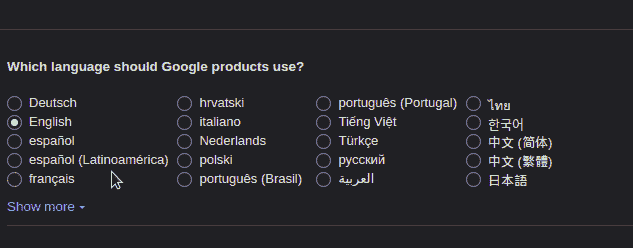

在本指南中，您将学习如何使用 [React 本地库](https://blog.logrocket.com/react-native-component-libraries/)构建单选按钮表单。此外，我们还将编写一些代码来设计我们的 radio 元素。

这将是结果:

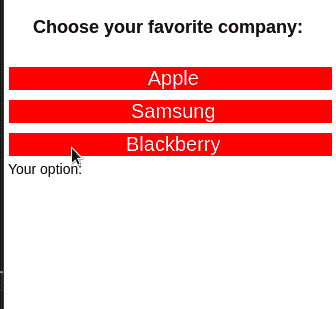

我们将讨论以下主题:

## 入门指南

在编写一些代码之前，我们需要首先初始化我们的应用程序库。要使用 Expo 搭建 React 本地项目，请执行以下 Bash 命令:

```
expo init radio-button-tutorial

```

接下来，在项目目录的根目录下创建一个`components`文件夹。在这个文件夹中，我们将存储自定义的 React 模块。这将有助于代码组织:

```
#in your project dir
mkdir components

```

最后，您的项目文件夹结构应该如下所示:

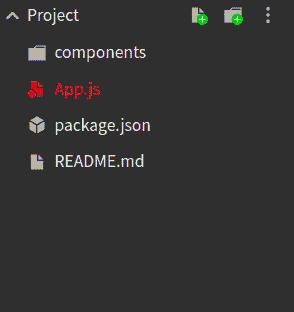

## 创建我们的单选按钮

### 设置我们的单选按钮组件

在文章的这一部分，我们将编写一些代码来显示用户可用选择的列表。

首先，导航到您的`components`文件夹。在那里，创建一个名为`RadioButton.js`的文件。

在`RadioButton.js`文件中，编写以下代码片段:

```
import React from 'react';
import { View, Text } from 'react-native';

export default function RadioButton({ data, onSelect }) {
  return (
    <View>
      {data.map((item) => {
        return <Text> {item.value}</Text>;
      })}
    </View>
  );
}

```

从这段代码中可以得出一些推论:

*   `RadioButton`模块将接受两个道具:`data`和`onSelect`。这里，`data`将是我们的用户选项数组。此外，`onSelect`将是一个处理函数，如果用户做出选择，它将运行
*   后来，我们在我们的`data`数组上使用了`map`函数
*   `map`方法将帮助我们显示数组中每一项的`value`字段

让我们来测试一下！

在`App.js`中，用以下代码替换所有代码:

```
import React from 'react';
import { Text, View, StyleSheet } from 'react-native';
import RadioButton from './components/RadioButton';
export default function App() {
  const data = [
    { value: 'Apple' },
    { value: 'Samsung' },
    { value: 'Blackberry' },
  ];
  return (
    <View style={styles.container}>
      <Text style={styles.paragraph}>Choose your favorite company: </Text>
      <RadioButton data={data} />
    </View>
  );
}

```

在上面的代码中，我们创建了一个名为`data`的数组。该变量包含用户的选择列表。后来，我们将这个变量传递到了`RadioButton`组件的`data`属性中。因此，这将呈现我们的列表。

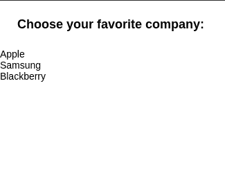

### 使项目可点击并显示用户输入

在本节中，我们将使用 [React Native 的可压缩 API](https://reactnative.dev/docs/pressable) 来使我们的列表具有交互性。

为此，转到`RadioButton.js`并将`return`模块修改如下:

```
import {Pressable} from 'react-native'; //additional import.
//code to change of 'return' block in RadioButton.js
return (
  <View>
    {data.map((item) => {
      return (
        <Pressable onPress={() => alert("Your choice: " + item.value)}> {/* onPress handler runs when item is clicked.*/}
          <Text> {item.value}</Text>
        </Pressable>
      );
    })}
  </View>
);

```

在这段代码中，我们使用`Pressable`组件告诉 React Native，如果用户点击任何项目，它应该在一个单独的弹出窗口中显示用户的选择。

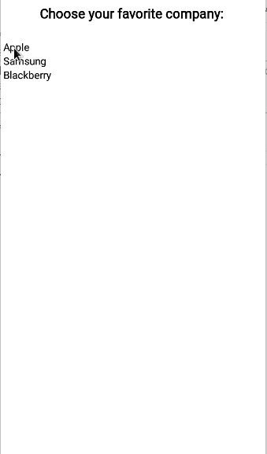

### 构建单选按钮功能

在`RadioButton.js`文件中，添加以下代码片段:

```
import { useState } from "react";

const [userOption, setUserOption] = useState(null);

return (
  <View>
    {data.map((item) => {
      return (
        /*Change the 'onPress' handler here */
        <Pressable onPress={() => setUserOption(item.value)}>
          <Text> {item.value}</Text>
        </Pressable>
      );
    })}
    <Text> User option: {userOption}</Text>
  </View>
);

```

这是这一块的细目分类:

*   首先，声明一个`userOption`钩子。这将存储用户的当前选择。它的初始值将是`null`
*   稍后，使用`onPress`处理程序告诉 React 将`userOption`的值更新为用户当前的选择
*   最后，显示`userOption`的值

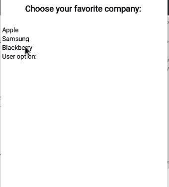

### 定制我们的单选按钮

这里，我们的计划是使用[样式表 API](https://reactnative.dev/docs/stylesheet) 来装饰我们的 radio 表单。这将有助于改善我们的应用程序的用户体验。

为此，在您的`components`文件夹中创建一个名为`styles.js`的新文件。在这里，编写以下代码:

```
import { StyleSheet } from 'react-native';
const styles = StyleSheet.create({
  option: {
    fontSize: 20,
    color: 'white',
    textAlign: 'center',
  },
  unselected: {
    backgroundColor: 'red',
    margin: 5,
  },
  selected: {
    backgroundColor: 'blue',
    margin: 6,
    padding: 10,
    borderRadius: 10,
  },
});
export default styles;

```

下面简单解释一下:

*   属性将负责显示用户选项的文本样式。这里，我们增加了它的字体大小，改变了它的颜色和对齐值
*   顾名思义，`unselected`会对没有选中的元素进行修饰。这里，我们正在修改它的背景颜色
*   `selected`样式将应用于用户选择的项目。在这种情况下，我们改变它的填充，并使用`borderRadius`属性来圆化元素的边框

完成后，现在是时候应用我们的风格了。

为此，在`RadioButton.js`中编写这段代码:

```
//code to change in 'return' block
data.map((item) => {
  return (
    <Pressable
      style={ //Line 5
        item.value === userOption ? styles.selected : styles.unselected
      } /*Add style here */ //Line 7
      onPress={() => setUserOption(item.value)}
    >
      {/* add style here */}
      <Text style={styles.option}> {item.value}</Text>
    </Pressable>
  );
});

```

请注意，在第 5–7 行，我们首先检查用户是否点击了特定的元素。如果满足这个条件，React Native 将使用`selected`样式。

否则，将应用`unselected`样式。

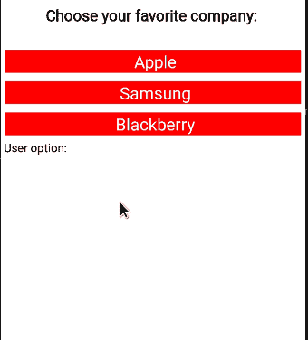

### 使用我们的`onSelect`处理程序

在`RadioButton.js`中，编辑您的代码，如下所示:

```
//extra code removed for brevity.
const selectHandler = (value) => {
  onSelect(value);
  setUserOption(value);
};

return (
  <View>
    {data.map((item) => {
      return (
        <Pressable onPress={() => selectHandler(item.value)}>
        {/* Further code... */}
        <Text> User option: {userOption}</Text> {/* remove this line */} 

```

这里，注意我们已经改变了`onPress`处理程序来运行`selectHandler`函数。因此，这将运行`onSelect`方法并更新`userOption`状态的值。

现在是时候使用我们的自定义处理函数了。为此，导航回`App.js`并添加该块:

```
import { useState } from "react";

const [option, setOption] = useState(null);
return (
  <View style={styles.container}>
    <Text style={styles.paragraph}>Choose your favorite company: </Text>
    {/* add 'onSelect' handler */}
    <RadioButton data={data} onSelect={(value) => setOption(value)} />
    <Text> Your option: {option}</Text>
  </View>
);

```

在这段代码中，我们首先声明了一个`option`状态。后来，我们使用`onSelect`钩子告诉 React，如果用户点击任何项目，就更新`option`的值。最后，React 会向 UI 显示`option`的值。

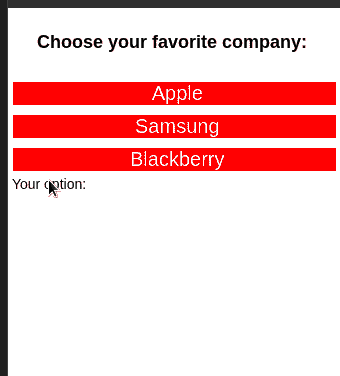

恭喜你。您现在已经构建了一个自定义单选按钮！

最后，您的`RadioButton.js`文件应该是这样的:

```
import React, { useState } from 'react';
import { View, Text, Pressable } from 'react-native';
import styles from './styles';

export default function RadioButton({ data, onSelect }) {
  const [userOption, setUserOption] = useState(null);
  const selectHandler = (value) => {
    onSelect(value);
    setUserOption(value);
  };
  return (
    <View>
      {data.map((item) => {
        return (
          <Pressable
            style={
              item.value === userOption ? styles.selected : styles.unselected
            }
            onPress={() => selectHandler(item.value)}>
            <Text style={styles.option}> {item.value}</Text>
          </Pressable>
        );
      })}
    </View>
  );
}

```

而`App.js`应该有这个代码:

```
import React, { useState } from 'react';
import { Text, View, StyleSheet } from 'react-native';
import RadioButton from './components/RadioButton';

export default function App() {
  const [option, setOption] = useState(null);
  const data = [
    { value: 'Apple' },
    { value: 'Samsung' },
    { value: 'Blackberry' },
  ];
  return (
    <View style={styles.container}>
      <Text style={styles.paragraph}>Choose your favorite company: </Text>
      <RadioButton data={data} onSelect={(value) => setOption(value)} />
      <Text> Your option: {option}</Text> 
    </View>
  );
}
const styles = StyleSheet.create({
  paragraph: {
    margin: 24,
    fontSize: 18,
    fontWeight: 'bold',
    textAlign: 'center',
  },
});

```

## 可供选择的事物

如果您不想构建自己的单选按钮解决方案，React Native 社区提供了允许高度定制的预构建单选组件。

### 反应-本机-简单-单选按钮

要在您的项目中安装此包，请使用以下终端命令:

```
npm i react-native-simple-radio-button 

```

此代码示例通过 react-native-simple-单选按钮库呈现单选按钮组:

```
import RadioForm from 'react-native-simple-radio-button';

export default function ReactSimpleButton() {
  const [chosenOption, setChosenOption] = useState('apple'); //will store our current user options
  const options = [
    { label: 'Apple', value: 'apple' },
    { label: 'Samsung', value: 'samsung' },
  ]; //create our options for radio group
  return (
    <View>
      <Text> {chosenOption}</Text>
      <RadioForm
        radio_props={options}
        initial={0} //initial value of this group
        onPress={(value) => {
          setChosenOption(value);
        }} //if the user changes options, set the new value
      />
    </View>
  );
}

```

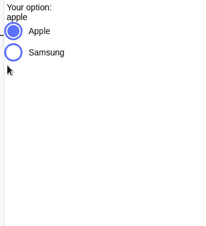

### 反应-本机-单选按钮-组

您可以通过 npm 或 Yarn 将单选按钮组合并到您的应用程序中，如下所示:

```
npm i react-native-radio-buttons

```

要使用此模块绘制单选按钮组，请编写以下代码块:

```
import RadioGroup from 'react-native-radio-buttons-group';
export default function App() {
  //create our options
  const radioButtonsData = [
    {
      id: '1', // acts as primary key, should be unique and non-empty string
      label: 'Apple',
      value: 'apple',
    },
    {
      id: '2',
      label: 'Samsung',
      value: 'samsung',
    },
  ];
  const [radioButtons, setRadioButtons] = useState('apple'); //pass in our data to this state. This will store the current user's choice
  const setValue = (value) => {
    var newArray = value.filter((item)=>item.selected===true); //get the items that are selected
    setRadioButtons(newArray[0].value); //set the selected value in this Hook
  };
  return (
    <View>
      {/* The onPress handler tells React to change the value of the radioButtons Hook*/}
      <RadioGroup
        radioButtons={radioButtonsData} //pass in our array
        onPress={(value) => setValue(value)}
      />
      <Text>{radioButtons}</Text> {/*Display the value of the current user choice */}
    </View>
  );
}

```

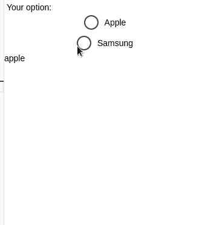

### 使用 React 原生纸张

React Native Paper 是 React Native 生态系统中使用最广泛的组件库之一。除了单选按钮，它们还提供了应用程序栏、徽章等等。

以下终端命令将为您的项目安装 React Native Paper:

```
npm install react-native-paper

```

要显示几个简单的单选按钮:

```
import { RadioButton } from 'react-native-paper';

export default function ReactPaper() {
  const [checked, setChecked] = React.useState('Apple'); //initial choice
  return (
    <View>
    {/*Create first radio button */}
      <RadioButton
        value="Apple" 
        status={ checked === 'Apple' ? 'checked' : 'unchecked' } //if the value of checked is Apple, then select this button
        onPress={() => setChecked('Apple')} //when pressed, set the value of the checked Hook to 'Apple'
      />
      <RadioButton
        value="Samsung"
        status={ checked === 'Samsung' ? 'checked' : 'unchecked' }
        onPress={() => setChecked('Samsung')}
      />
      <Text> {checked}</Text>
    </View>
  );
};

```

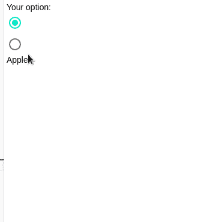

## 结论

你可以在这里访问这个项目的[世博小吃](https://snack.expo.dev/@hussainarifkl/radiobutton-tutorial)。

在本文中，您了解了如何在 React Native 中构建一个定制的单选按钮，该按钮不仅外观漂亮，而且非常快速和稳定。不想构建自己的 radio 元素？没问题！你可以使用[分段控件库](https://github.com/react-native-segmented-control/segmented-control/)甚至 [React Native Paper 的 RadioButton 组件](https://callstack.github.io/react-native-paper/radio-button.html)。它们是很好的选择，可以帮助你在短时间内开始工作。

感谢您的阅读！

## 使用 [LogRocket](https://lp.logrocket.com/blg/signup) 消除传统错误报告的干扰

[](https://lp.logrocket.com/blg/signup)

[LogRocket](https://lp.logrocket.com/blg/signup) 是一个数字体验分析解决方案，它可以保护您免受数百个假阳性错误警报的影响，只针对几个真正重要的项目。LogRocket 会告诉您应用程序中实际影响用户的最具影响力的 bug 和 UX 问题。

然后，使用具有深层技术遥测的会话重放来确切地查看用户看到了什么以及是什么导致了问题，就像你在他们身后看一样。

LogRocket 自动聚合客户端错误、JS 异常、前端性能指标和用户交互。然后 LogRocket 使用机器学习来告诉你哪些问题正在影响大多数用户，并提供你需要修复它的上下文。

关注重要的 bug—[今天就试试 LogRocket】。](https://lp.logrocket.com/blg/signup-issue-free)

## [LogRocket](https://lp.logrocket.com/blg/react-native-signup) :即时重现 React 原生应用中的问题。

[](https://lp.logrocket.com/blg/react-native-signup)

[LogRocket](https://lp.logrocket.com/blg/react-native-signup) 是一款 React 原生监控解决方案，可帮助您即时重现问题、确定 bug 的优先级并了解 React 原生应用的性能。

LogRocket 还可以向你展示用户是如何与你的应用程序互动的，从而帮助你提高转化率和产品使用率。LogRocket 的产品分析功能揭示了用户不完成特定流程或不采用新功能的原因。

开始主动监控您的 React 原生应用— [免费试用 LogRocket】。](https://lp.logrocket.com/blg/react-native-signup)