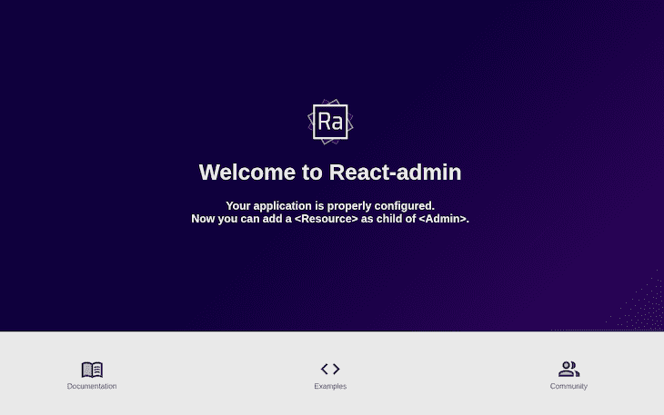
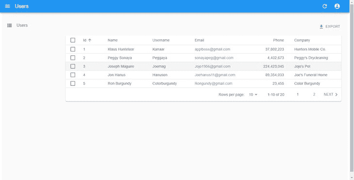
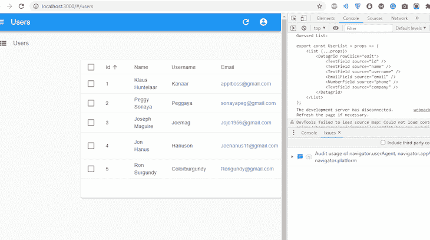
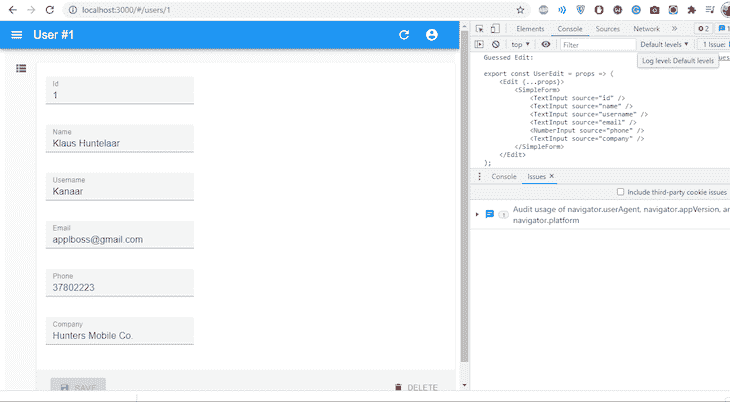

# 如何创建 React 管理面板

> 原文：<https://blog.logrocket.com/create-react-admin-panel/>

***编者按**:本帖最后更新于 2021 年 8 月 12 日。它可能仍然包含过时的信息。*

许多 web 应用程序已经从仅仅显示内容的静态网站发展到用户访问内容并与之交互的动态网页。这些内容通常由发送和接收数据的 API 提供支持。

通常，管理页面会对这些数据进行排序和处理，通常是通过构建一个接口，并通过向 API 发送请求来连接每个端点。在引入`react-admin`之前，这是一个繁琐的过程。

在这篇博文中，我们将了解`react-admin`如何为 React 应用搭建管理界面。

## 什么是`react-admin`？

`react-admin`是一个通过消费 API 来构建管理界面的框架，包括 RESET、GraphQL 或 custom。我们也不需要担心样式格式，因为`react-admin`是以 [Material-UI 为主题的，这是一个用来设计应用程序界面](https://blog.logrocket.com/using-material-ui-in-react-native/)的 React 库。

## 开始使用`react-admin`

让我们首先创建一个`new-react-admin`文件夹，并将`package.json`、`concurrently`和`json-server`安装在一个新的`server`文件夹中:

```
# install package.json, concurrently & json-server

npm init -y
npm install json-server
npm install concurrently

```

我们将为它创建一个 npm 脚本，而不是全局安装`json-server`。打开`package.json`文件，替换`scripts`对象的默认值:

```
// /new-react-admin/server/package.json
# - "test": "echo \"Error: no test specified \" && exit 1"

+ "server": "json-server --watch db.json --port 5000",
+ "client": "npm start --prefix admin-demo",
+ "dev": "concurrently \"npm run server\" \"npm run client\""

# "admin-demo" will be the name of our react app

```

在上面的代码块中，我们希望运行`json-server`并观察一个名为`db.json`的文件，该文件保存了我们将使用的伪 REST API 生成的数据。默认情况下，它运行在端口 3000 上，这阻止了我们的 React 应用程序运行。相反，我们将它设置为端口 5000。

[Concurrently 是一个框架](https://www.npmjs.com/package/concurrently)，使 API 和 React app 能够同时运行，而不是分别在不同的终端运行。如上所示，`client`脚本被分配来启动 React 应用程序，`dev`脚本同时运行`server`和`client`脚本。

现在，我们可以在一个名为`admin-demo`的新文件夹中创建一个 React 项目，并在其目录中安装`react-admin`:

```
npx create-react-app admin-demo
cd admin-demo
# install react-admin
npm install react-admin 

```

然后，在 React app 的`package.json`文件中添加一个`proxy`；将`proxy`设置为`server`脚本 url:

```
// /new-react-admin/admin-demo/package.json
"proxy": "http://localhost:5000" 

```

接下来，我们需要用一些数据填充`db.json`文件。以下是我们将使用的数据示例:

```
// /new-react-admin/server/db.json

{
"users": [
    {
      "id": "1",
      "name": "Klaus Huntelaar",
      "username": "Kanaar",
      "email": "[email protected]",
      "phone": 37802223,
      "company": "Hunters Mobile Co."
    },
    {
      "id": "2",
      "name": "Peggy Sonaya",
      "username": "Peggaya",
      "email": "[email protected]",
      "phone": 4402673,
      "company": "Peggy's Drycleaning"
    },
    {
      "id": "3",
      "name": "Joseph Maguire",
      "username": "Joemag",
      "email": "[email protected]",
      "phone": 224423045,
      "company": "Jojo's Pot"
    },
    {
      "id": "4",
      "name": "Jon Hanus",
      "username": "Hanuson",
      "email": "[email protected]",
      "phone": 89354033,
      "company": "Joe's Funeral Home"
    },
    {
      "id": "5",
      "name": "Ron Burgundy",
      "username": "Colorburgundy",
      "email": "[email protected]",
      "phone": 23455,
      "company": "Color Burgundy"
    }
]
}

```

## 使用 guessers 修改和过滤数据

对于一个管理页面来说，拥有 [CRUD 功能](https://blog.logrocket.com/crud-react-graphql-examples/)是非常必要的。我们将使用数据提供者来展示`react-admin`是如何做到这一点的。 [Simple](https://www.npmjs.com/package/ra-data-simple-rest) [REST](https://www.npmjs.com/package/ra-data-simple-rest) 是一个数据提供者，它使用简单的 GET 参数来适应 REST APIs，这些参数用于过滤和排序。

我们首先需要在我们的`react-admin`应用程序中安装简单的 REST:

```
// /new-react-admin/admin-demo
npm install ra-data-simple-rest

```

我们试试用`db.json`取数据。为此，`react-admin`使用它的根组件`<Admin>`来提供 API 和应用程序之间的数据交换。用以下内容替换`src/App.js`中的默认语法:

```
import React from 'react'
import { Admin} from 'react-admin'
import restProvider from 'ra-data-simple-rest'

const dataProvider = restProvider('http://localhost:3000');

function App() {
  return (
      <Admin dataProvider={dataProvider} />
    );
  }
export default App;

```

现在，将目录从 React 应用程序更改到主文件夹`cd ..`，并在此时运行`npm` `dev`，应该会在浏览器中呈现一个带有确认消息的应用程序:



为了显示来自`db.json`文件的数据，API 服务器需要有一个内容范围值，以防止它抛出错误。在中间件的帮助下，我们将创建一个名为`range.js`的文件，该文件具有设置要显示的内容数量的功能:

```
// /new-react-admin/server/range.js
module.exports = (req, res, next) => {
    res.header('Content-Range', 'posts 0-20/20')
    next()
}

```

为了运行中间件功能，我们必须将`--middlewares ./range.js`添加到`package.json`文件的`server`脚本中。

### 如何在 React 中使用猜测

虽然仍在开发中，`react-admin`通过“猜测者”创建管理界面猜测者从 API 接收数据，确定数据的种类，并决定数据应该以何种格式显示。

让我们尝试通过应用 guessers 来显示用户列表:

```
import React from 'react'
import { Admin, Resource,ListGuesser } from 'react-admin'
import restProvider from 'ra-data-simple-rest'

const dataProvider = restProvider('http://localhost:3000');

function App() {
    return (
      <Admin dataProvider={dataProvider}>
        <Resource name="users" list={ListGuesser} />
      </Admin>
    );
  }
export default App;

```

在上面的代码块中，`<resource>`元素负责将`name`属性映射到 API 中的一个端点。这里`<resource>`将`users`值附加到我们的 API，并从 API 获取用户数据。

### 使用`<ListGuesser>`组件

`list`属性使用`<ListGuesser>`组件将这些数据显示为用户列表。



`<ListGuesser>`不能用于生产，因此必须用定制组件替换。guessers 的一个很棒的特性是在浏览器的控制台上显示从 API 中检索到的数据的源代码。

让我们来看看`<ListGuesser>`显示了什么:



这向我们展示了应该如何创建用户列表。让我们在应用程序中复制这些数据。在项目的`src`文件夹中，创建一个文件，并将其命名为`User.js`:

```
/src/components/User.js
import React from 'react';
import { List, Datagrid, TextField, EmailField, EditButton, DeleteButton } from 'react-admin';

export const UserList = (props) => {
    return (
        <List {...props}>
            <Datagrid>
            <TextField source="id" />
                <TextField source="name" />
                <TextField source="username" />
                <EmailField source="email" />
                <TextField source="phone" />
                <TextField source="company" label="Company" />
                <EditButton basePath="/users" />
                <DeleteButton basePath="/users" />
            </Datagrid>
        </List>
    )
}

```

在上面的代码块中，做了一些修改。首先，我们使用了`<EmailField>`元素使电子邮件栏上的链接可点击。然后，我们在 company 列中添加了一个`label`属性，使它们的标题更加美观。

让我们导航到`App.js`，用`UserList`替换`ListGuesser`:

```
/src/App.js
import React, { Component } from "react";
import { Admin, Resource } from "react-admin";
import { UserList } from './components/User';
import restProvider from 'ra-data-simple-rest';

const dataProvider = restProvider('http://localhost:3000')
function App() {
  return (
      <Admin dataProvider={dataProvider}>
        <Resource name="users" list={UserList} />
      </Admin>
    );
  }
export default App;

```

### 使用`EditGuesser`组件

管理页面应该能够编辑，删除和创建数据。`react-admin`也是通过使用 guessers 来实现的。在`UserList`中添加这一行新代码:

```
// /src/components/User.js  
import {EditButton, DeleteButton} from 'react-admin'              
<EditButton basePath="/users" />
<DeleteButton basePath="/users" />

```

编辑管理页面的数据。在`App.js`中，从`react-admin`导入`EditGuesser`:

```
src/App.js
import React from 'react';
import { Admin, Resource, EditGuesser } from "react-admin";
import { UserList } from './components/User';
import restProvider from 'ra-data-simple-rest';

const dataProvider = restProvider('http://localhost:3000')
function App() {
  return (
      <Admin dataProvider={dataProvider}>
        <Resource
          name="users"
          list={UserList}
          edit={EditGuesser}
        />
      </Admin>
    );
  }
}

```

现在，我们可以在管理界面上编辑用户详细信息:

 [https://www.youtube.com/embed/X-VNSgeLh7M?version=3&rel=1&showsearch=0&showinfo=1&iv_load_policy=1&fs=1&hl=en-US&autohide=2&wmode=transparent](https://www.youtube.com/embed/X-VNSgeLh7M?version=3&rel=1&showsearch=0&showinfo=1&iv_load_policy=1&fs=1&hl=en-US&autohide=2&wmode=transparent)

视频

需要注意的一件重要事情是，我们用于伪 API 的数据提供者 simple REST 具有编辑和创建功能。这里发生的情况是，`react-admin`显示了在向`db.json`文件中的数据发送更新查询时所做的更改。

与列出用户类似，查看我们的控制台可以让我们知道应该输入什么作为标记。下面是我们使用`EditGuesser`后的结果:



现在，让我们在应用程序中复制控制台的标记。在`users.js`中追加下面的代码示例:

```
//src/components/User.js
import React from 'react';
import { Edit, SimpleForm, TextInput } from 'react-admin';

export const UserEdit = (props) => {
    return (
        <Edit title='Edit User' {...props}>
            <SimpleForm>
            <TextInput disabled source="id" />
                <TextInput source="name" />
                <TextInput source="username" />
                <TextInput source="email" />
                <TextInput source="phone" />
                <TextInput source="company"/>
            </SimpleForm>
        </Edit>
    )
}

```

`TextInput`元素中的`disabled`属性防止敏感属性被编辑。在`App.js`中，将`EditGuesser`替换为`UserEdit`:

```
//src/App.js
import React, { Component } from "react";
import { Admin, Resource } from "react-admin";
import  { UserList, UserEdit }  "./components/authProvider";
import jsonServerProvider from "ra-data-json-server";

const dataProvider = restProvider('http://localhost:3000')
function App() {
  return (
      <Admin dataProvider={dataProvider}>
        <Resource name="users" list={UserList} edit={UserEdit} />
      </Admin>
    );
  }
}
export default App;

```

### 添加新用户

创建新用户的过程与编辑几乎相同，除了我们必须在`db.json`文件中创建一个新的集合。在`users.js`中，复制下面的代码示例:

```
//src/components/User.js
import React from 'react';
import { Create, SimpleForm, TextInput } from 'react-admin';

export const UserCreate = (props) => {
    return (
        <Create title='Create User' {...props}>
            <SimpleForm>
            <TextInput type="number" source="id" />
                <TextInput source="name" />
                <TextInput source="username" />
                <TextInput source="email" />
                <TextInput source="phone" />
                <TextInput source="company"/>
            </SimpleForm>
        </Create>
    )
}

```

现在，在`App.js`中，添加`UserCreate`组件:

```
//src/App.js
import React, { Component } from "react";
import { Admin, Resource } from "react-admin";
import  { UserList, UserEdit, UserCreate }  from './components/User';
const dataProvider = restProvider('http://localhost:3000')
function App() {
  return (
    <Admin dataProvider={dataProvider}>
      <Resource name="users" list={UserList} create={UserCreate} edit={UserEdit} />
    </Admin>
  );
}
export default App;

```

在我们的界面上，让我们尝试创建一个新用户:

 [https://www.youtube.com/embed/da6RASqHDCE?version=3&rel=1&showsearch=0&showinfo=1&iv_load_policy=1&fs=1&hl=en-US&autohide=2&wmode=transparent](https://www.youtube.com/embed/da6RASqHDCE?version=3&rel=1&showsearch=0&showinfo=1&iv_load_policy=1&fs=1&hl=en-US&autohide=2&wmode=transparent)

视频

与我们试图编辑用户的详细信息时发生的情况类似，乐观呈现也会发生。这解释了为什么在上面代码片段的最后几秒，我们新创建的用户在消息`NOT FOUND`出现之前显示了一会儿。

## `react-admin`认证

每个管理页面都需要一个认证过程。它可以是基本的，也可以稍微复杂一点，比如 [JSON Web Tokens (JWT)](https://blog.logrocket.com/jwt-authentication-best-practices/) 或者 [OAuth](https://blog.logrocket.com/implementing-oauth-2-0-in-node-js/) 。

尽管默认情况下，`react-admin`应用程序不需要认证就能运行，但是将认证集成到管理页面中仍然是最佳实践。

让我们灵活地实施认证。Simple REST 没有认证模型，所以我们将创建一个伪认证过程，它接受任何值作为`username`和`password`，并将这些值存储在`localStorage`中。

在我们的`src`文件夹中，创建一个名为`authProvider`的文件:

```
// src/components/authProvider.js
import { AUTH_LOGIN, AUTH_LOGOUT, AUTH_ERROR, AUTH_CHECK } from 'react-admin';

   export const authProvider = (type, params) => {
    // when a user tries to log in 
    if (type === AUTH_LOGIN) {
     const { username } = params;
     localStorage.setItem('username', username)
     return Promise.resolve();
    }
    // when a user tries to logout
    if (type === AUTH_LOGOUT) {
        localStorage.removeItem('username');
     return Promise.resolve();
    }
    // when the API throws an error
    if (type === AUTH_ERROR) {
     const { status } = params;
     if (status === 401 || status === 403) {
      localStorage.removeItem('username');
      return Promise.reject()
     }
     return Promise.resolve()
    }
    // when a user navigates to a new location
    if (type === AUTH_CHECK) {
     return localStorage.getItem('username') ?
      Promise.resolve() :
      Promise.reject();
    }
    return Promise.reject('Unknown Method');
   };

```

然后转到`App.js`并传递`<Admin>`组件中的`authProvider`属性:

```
//src/App.js
import React from 'react'
import { Admin, Resource } from 'react-admin'
import restProvider from 'ra-data-simple-rest'
import { authProvider } from "./components/authProvider";
import { UserList, UserEdit, UserCreate} from './components/User';

const dataProvider = restProvider('http://localhost:3000')
function App() {
  return (
    <Admin dataProvider={dataProvider} authProvider={authProvider}>
      <Resource name="users" list={UserList} create={UserCreate} edit={UserEdit} />
    </Admin>
  );
}
export default App;

```

现在，当我们重新启动应用程序时，我们首先进入一个登录页面:

 [https://www.youtube.com/embed/s-oLKoEp5gA?version=3&rel=1&showsearch=0&showinfo=1&iv_load_policy=1&fs=1&hl=en-US&autohide=2&wmode=transparent](https://www.youtube.com/embed/s-oLKoEp5gA?version=3&rel=1&showsearch=0&showinfo=1&iv_load_policy=1&fs=1&hl=en-US&autohide=2&wmode=transparent)

视频

## 摘要

创建管理应用程序不再像以前那样复杂。有了 [React 的`react-admin`](https://blog.logrocket.com/?post_type=post&s=react&orderby=relevance&order=DESC&post_type=post) ，我们可以很容易地搭建管理界面。认证过程同样重要，在这里也不排除。

你可以在 [GitHub](https://github.com/fullstackmafia/new-react-admin) 上找到这个项目的源代码。

## 使用 LogRocket 消除传统反应错误报告的噪音

[LogRocket](https://lp.logrocket.com/blg/react-signup-issue-free)

是一款 React analytics 解决方案，可保护您免受数百个误报错误警报的影响，只针对少数真正重要的项目。LogRocket 告诉您 React 应用程序中实际影响用户的最具影响力的 bug 和 UX 问题。

[ ](https://lp.logrocket.com/blg/react-signup-general) [  ](https://lp.logrocket.com/blg/react-signup-general) [LogRocket](https://lp.logrocket.com/blg/react-signup-issue-free)

自动聚合客户端错误、反应错误边界、还原状态、缓慢的组件加载时间、JS 异常、前端性能指标和用户交互。然后，LogRocket 使用机器学习来通知您影响大多数用户的最具影响力的问题，并提供您修复它所需的上下文。

关注重要的 React bug—[今天就试试 LogRocket】。](https://lp.logrocket.com/blg/react-signup-issue-free)