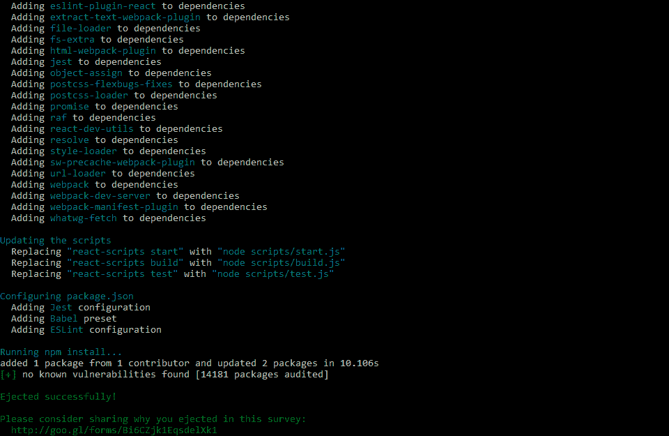

# 创建 React 应用程序:快速设置指南

> 原文：<https://blog.logrocket.com/create-react-app-a-quick-setup-guide-b812f0aad03c/>

***编者按:*** *这篇博文于 2021 年 6 月回顾并更新了相关信息。*

[创建 React 应用](https://github.com/facebook/create-react-app)是创建 React 应用最流行的工具之一。为什么？

因为只有三个依赖项，你就可以支持 React、JSX、ES6、polyfills、开发服务器、自动前缀 CSS、测试、服务工作者等等。

这篇文章提供了一个快速指南，用这个工具设置一个 React 应用程序，并配置它的一些更重要的特性。

使用此工具的唯一先决条件是安装 Node.js 版本 6 或更高版本。

### 使用创建 React 应用程序创建 React 应用程序

使用以下命令之一创建新应用程序:

```
#Using npx
npx create-react-app app-name

#Using npm init <initializer>
npm init react-app app-name

#Using yarn 0.25+
yarn create react-app app-name
```

这些命令使用应用程序的给定应用程序名称和初始项目结构创建一个目录(参见模板[此处](https://github.com/facebook/create-react-app/blob/master/packages/cra-template/template/README.md))，并安装数百个包作为依赖项。

现在，如果您查看生成的`package.json`文件，您只会看到三个依赖项:react、react-dom 和 react-scripts。

react-scripts 是处理所有配置的库，并带来了项目的大多数依赖项，如 babel、ESlint 和 webpack(如果你好奇，请查看其 [package.json](https://github.com/facebook/create-react-app/blob/master/packages/react-scripts/package.json) 文件中的完整列表)。

理解 React-脚本是理解 Create React 应用程序内部工作的关键。

### 升级依赖项的版本

依赖关系如此之少的一个好处是它们很容易升级或降级。

您只需执行带有标志`— — save — -save-exact`的`npm install`来指定确切的版本。`package.json`将被更新，新版本的依赖项将被下载。

例如，要更改到 react-scripts 的 1.1.4 版，请执行:

```
npm install --save --save-exact [email protected]
# or yarn add --exact [email protected]
```

另外，不要忘记查阅 [react-scripts](https://github.com/facebook/create-react-app/blob/master/CHANGELOG.md) 和 [React](https://github.com/facebook/react/blob/master/CHANGELOG.md) 的变更日志，寻找突破性的变更。

### 在创建 React 应用程序和 ESLint 中配置林挺

ESLint 是默认配置的(你可以在这里看到配置[，它的输出显示在终端和浏览器控制台上。](https://github.com/facebook/create-react-app/blob/master/packages/react-scripts/package.json)

正式来说，[你不能覆盖这个配置](https://github.com/facebook/create-react-app/issues/808)。如果你想加强一种编码风格，你可以安装并使用[更漂亮的](https://github.com/jlongster/prettier)(现在还没有集成)。

您唯一能做的就是配置您的代码编辑器来报告林挺警告，方法是为您的编辑器安装一个 ESLint 插件，并将一个`.eslintrc`文件添加到项目根目录:

```
{
  "extends": "react-app"
}
```

或者，您可以将您的自定义规则添加到该文件中，但是它们只能在您的编辑器中工作。

非正式地，您可以使用类似于 [react-app-rewired 的东西来覆盖默认配置](https://medium.com/@adamdziendziel/custom-eslint-config-with-create-react-app-d6f66e8d61)。

### 启动应用程序

要运行应用程序，执行`npm start`，这是一个快捷方式:

```
react-scripts start
```

这个脚本执行一个 Webpack 开发服务器:

*   启用热重新加载(如果您对应用程序进行了更改，将在浏览器中重新加载以反映该更改)
*   默认使用端口`3000`(如果所选端口被占用，则使用另一个端口)

在 Mac 中，如果安装了 Chrome，应用程序会在 Chrome 中打开。否则，与其他操作系统一样，将使用默认浏览器。

此外，错误会显示在控制台终端和浏览器中。

你可以在这里看到完整的启动脚本[。](https://github.com/facebook/create-react-app/blob/master/packages/react-scripts/scripts/start.js)

### 添加图像和样式

添加图像、样式或使用其他文件(如字体)时，您有两种选择:

*   `src`文件夹，使用模块系统
*   `public`文件夹，作为静态资产

放在`src`文件夹中的所有东西都将由 Webpack 处理，这意味着文件将被缩小并包含在构建时生成的包中。

这也意味着资产可以用 JavaScript 导入:

```
import './styles.css';
import logo from './logo.png';
// ...
const image = ;
```

导入小于 10，000 字节的图像会返回数据 URI，而不是实际图像的路径，只要它们具有以下扩展名:

使用这个文件夹的另一个好处是，如果没有正确引用文件，或者不小心删除了文件，就会产生编译错误。

另一方面，您也可以将文件添加到`public`文件夹中。然而，你会错过上面描述的优点，因为它们不会被 webpack 处理，它们只会被复制到`build`文件夹中。

另外要记住的是，你不能在`public`文件夹中引用`src`文件夹中的文件。

然而，要引用`public`文件夹中的文件，您可以像这样使用变量`PUBLIC_URL`:

```

```

或者用 JavaScript 中的变量`process.env.PUBLIC_URL`:

```
const image = ;
```

### 使用 Create React 应用程序设置环境变量

除了变量`PUBLIC_URL`，还有一个特殊的内置环境变量`NODE_ENV`，它不能被覆盖:

*   使用`npm start`时取值`development`
*   使用`npm run build`时取值`production`
*   使用`npm test`时取值`test`

您还可以定义将在构建时注入的自定义环境变量。它们必须以`REACT_APP_`开头，否则会被忽略。

您可以使用终端来定义它们:

```
#Windows
set "REACT_APP_TITLE=App" && npm start

#Powershell
($env:REACT_APP_TITLE = "App") -and (npm start)

#Linux and mac
REACT_APP_TITLE=App npm start
```

或者项目根目录中的下列文件之一(左边的文件比右边的文件优先级高):

*   使用`npm start`时:`.env.development.local`、`.env.development`、`.env.local`、`.env`
*   使用`npm run build`时:`.env.production.local`、`.env.production`、`.env.local`、`.env`
*   使用`npm test`时:`.env.test.local`、`.env.test`、`.env`

如前所述，所有这些变量都可以与组件中的`process.env`一起使用:

```
render() {
  return (
    <div>
      {process.env.NODE_ENV}
    </div>
  );
}
```

或者在`public/index.html`:

```
<title>%REACT_APP_TITLE%</title>
```

除了`NODE_ENV`之外，您还可以为开发设置设置其他预定义的环境变量，如`BROWSER`、`HOST`和`PORT`，以及一些生产设置，如`PUBLIC_URL`和`GENERATE_SOURCEMAP`。

点击查看完整列表[。](https://github.com/facebook/create-react-app/blob/master/packages/cra-template/template/README.md)

### 代理服务器请求

在同一个服务器和端口上服务你的应用的前端和后端是很常见的。但是，您不能这样做，因为 Create React App 在其自己的开发服务器中运行应用程序。

所以你有三个选择。

* * *

### 更多来自 LogRocket 的精彩文章:

* * *

第一种方法是在另一个端口上运行后端服务器，并发出如下请求:

```
fetch('http://localhost:5000/endpoint')
```

使用这种方法，您需要在您的服务器上设置 [CORS](https://en.wikipedia.org/wiki/Cross-origin_resource_sharing) 头[。](https://enable-cors.org/server_expressjs.html)

第二个是告诉开发服务器通过向您的`package.json`文件添加一个代理字段来将任何请求代理到您的后端服务器。例如，使用:

```
{
  ...
  "scripts": {
    ...
  },
  "proxy": "http://localhost:5000"
}
```

而不是提出这样的请求:

```
fetch('http://localhost:5000/endpoint')
```

重新启动服务器后，您应该像这样设置它们:

```
fetch('/endpoint')
```

如果这还不够，第三个选项是单独配置每个端点的代理，如下所示:

```
{
  ...
  "scripts": {
    ...
  },
  "proxy": {
    "/api": { // Matches any request starting with /api
      "target": "http://localhost:5000/api",
      "timeout": 5000
      ...
    },
    "/socket": {
      "target": "http://localhost:5000/api",
      "ws": true // Indicate this is a WebSocket proxy.
      ...
    }
  }
}
```

配置属性与 [http-proxy-middleware](https://github.com/chimurai/http-proxy-middleware#options) 或 [http-proxy](https://github.com/nodejitsu/node-http-proxy#options) 支持的属性相同。

### 配置渐进式 web 应用程序

一名[服务人员](https://developers.google.com/web/fundamentals/primers/service-workers/)在`src/index.js`登记。如果您不想启用它，只需移除对`registerServiceWorker()`的调用。

服务人员仅在应用程序的生产版本中启用。但是，如果已经执行了应用程序，则服务人员将已经安装在浏览器中，应该使用`unregister()`将其删除:

```
import { unregister } from './registerServiceWorker';
```

服务人员需要 HTTPS(否则注册将失败，尽管应用程序将保持功能)。然而，为了便于本地测试，这并不适用于本地主机。

在`public/manifest.json`有一个 [web 应用清单](https://developers.google.com/web/fundamentals/web-app-manifest/)，您可以在其中配置应用名称、图标和其他关于您应用的元数据。

### 测试应用程序

Create React App 使用 [Jest](https://facebook.github.io/jest/) 作为其测试运行器，使用 [jsdom](https://github.com/jsdom/jsdom) 来提供浏览器全局变量，如`window`或`document`。

测试文件应该遵循以下命名约定:

*   如果它们以`.js/.jsx/.mjs`结尾，那么这些文件应该位于名为`__tests__`的目录中(与表达式`<rootDir>/src/**/__tests__/**/*.{js,jsx,mjs}`相匹配)
*   它们应该以`.test.js`或`.specs.js`结尾(匹配表达式`<rootDir>/src/**/?(*.)(spec|test).{js,jsx,mjs}`)

执行 npm 测试将通过执行以下脚本来运行测试:

```
react-scripts test --env=jsdom
```

你可以在这里看到完整的脚本[。](https://github.com/facebook/create-react-app/blob/master/packages/react-scripts/scripts/test.js)

测试将在观察模式下运行。每次保存文件时，测试都会重新运行。然而，这种模式还包括一个交互式命令行界面，可以选择输入测试名称模式，以避免运行所有测试。

如果您只需要在运行测试之前执行或配置一些东西，那么将它添加到文件`src/setupTests.js`中，它将在任何测试之前自动执行。

如果您需要一个覆盖率报告，您可以执行命令`npm test --coverage`，可选地在`package.json`文件中配置选项:

例如:

```
{
  ...
  "scripts": {

  },
  "jest": {
    "coverageReporters": ["json"],
    "coverageThreshold": {
      "global": {
        "lines": 80
      }
    },
  }
}
```

### 部署应用程序

您可以使用 npm 运行构建在构建目录中创建应用程序的生产版本，这是以下操作的快捷方式:

```
react-scripts build
```

你可以在这里看到完整的脚本[。](https://github.com/facebook/create-react-app/blob/master/packages/react-scripts/scripts/build.js)

在这之后，你可以将这个构建目录的内容复制到一个 web 服务器上，或者使用像 [http-server](https://github.com/indexzero/http-server) 或 [serve](https://github.com/zeit/serve) 这样的包来测试这个目录中的应用程序。

需要考虑的一点是，Create React App 假设您将在服务器根托管您的应用程序。如果不是这样，您需要在您的`package.json`文件中指定 homepage 字段，这样就可以推断出正确的根路径:

```
{
  ...
  "scripts": {
    ...
  },
  "homepage": "http://example.com/myapp"
}
```

但是，如果您没有使用带有 HTML5 推状态历史 API 的路由器，或者根本没有使用路由，您可以使用点号来确保所有资源路径都相对于 index.html:

```
"homepage": "."
```

在 Create React App[的用户手册中，您可以找到使用以下方法部署您的应用](https://create-react-app.dev/docs/deployment/)的说明:

*   表达
*   蔚蓝的
*   重火力点
*   GitHub 页面
*   赫罗库
*   网络生活
*   现在
*   S3 和云锋
*   汹涌

### 正在弹出应用程序

弹出会将所有配置文件、脚本和依赖项复制到您的项目，同时删除对`react-scripts`的依赖项。

执行`npm run eject`来执行该操作。

以下是输出的摘录:



这里你可以看到它执行的整个脚本。

此操作无法恢复。当工具提供的配置选项对您来说不够用时，请使用它。

### 结论

这篇文章介绍了使用 Create React App 时可以配置的最重要的特性。现在你可能想仔细看看 Create React 应用的核心 [react-scripts](https://github.com/facebook/create-react-app/tree/master/packages/react-scripts) ，以深入了解它是如何工作的。

尽管 Create React App 是一个流行的工具，但它并不适合所有人。根据您正在开发的应用程序的类型，可能有更好的选择。比如静态站点的[盖茨比](https://github.com/gatsbyjs/gatsby)或者服务器端渲染的 [Next.js](https://github.com/zeit/next.js/) 。在这里咨询[更多选择](https://github.com/facebook/create-react-app#popular-alternatives)。

## 使用 LogRocket 消除传统反应错误报告的噪音

[LogRocket](https://lp.logrocket.com/blg/react-signup-issue-free)

是一款 React analytics 解决方案，可保护您免受数百个误报错误警报的影响，只针对少数真正重要的项目。LogRocket 告诉您 React 应用程序中实际影响用户的最具影响力的 bug 和 UX 问题。

[ ](https://lp.logrocket.com/blg/react-signup-general) [  ](https://lp.logrocket.com/blg/react-signup-general) [LogRocket](https://lp.logrocket.com/blg/react-signup-issue-free)

自动聚合客户端错误、反应错误边界、还原状态、缓慢的组件加载时间、JS 异常、前端性能指标和用户交互。然后，LogRocket 使用机器学习来通知您影响大多数用户的最具影响力的问题，并提供您修复它所需的上下文。

关注重要的 React bug—[今天就试试 LogRocket】。](https://lp.logrocket.com/blg/react-signup-issue-free)

* * *