# 比较 Create React App 与 Next.js 的性能差异

> 原文：<https://blog.logrocket.com/create-react-app-vs-next-js-performance-differences/>

***编者按:**本帖于 2022 年 7 月 28 日更新，以反映 Next.js 和 Create React App 的当前版本，比较[图像优化](#next-js-vs-create-react-app-performance-image-optimization)和[代码拆分](#next-js-vs-create-react-app-performance-code-splitting)的性能差异，回顾一些 [Next.js 限制](#limitations-next-js)，并提供关于[在 Create React App 和 Next.js](#migrating-create-react-app-next-js) 之间迁移的信息。*

Next.js vs. Create React App:提高单页应用性能的最好方法是什么？在本文中，我们将用一些数据来解开这个问题。但是首先，我们需要明白我们到底在比较什么。

我们将涵盖:

## Next.js 与 Create React App:理解框架

理解 Next.js 和 Create React App 之间性能差异的第一步是理解框架本身。让我们进一步了解每个选项，并定义 SSR 和 CSR 等重要术语。

### Next.js 是什么？

Next.js 是一个由 Vercel (以前的 Zeit)构建的 [React 框架，让 React 应用程序更容易进行服务器端渲染(SSR ),而不管你的数据来自哪里。](https://vercel.com/)

Next.js 还支持静态导出，以及新增的[增量静态再生](https://blog.logrocket.com/incremental-static-regeneration-with-next-js/)。然而，出于本文的目的，我们将重点关注它的服务器端渲染(SSR)功能。

### 什么是 Create React App？

[Create React App 由 Meta](https://create-react-app.dev/docs/getting-started/) 官方支持，用于为 React 创建单页应用(spa)。同样，出于本文的目的，我们关注术语“单页”

### 如何在单页 React 应用程序中支持 SSR 和 CSR

Next.js 是利用 React 支持服务器端呈现(SSR)的一种方式。同样，创建 React 应用程序是利用 React 支持客户端渲染(CSR)的一种方式。

对于这两种选择，还有其他的框架，但是我们在这篇文章中真正比较的是每种渲染策略如何影响 web 应用程序的性能。我们只是碰巧使用了两个比较流行的框架来进行比较。

## next . js vs . Create React App:SSR 是否提高了应用性能？

让我们从比较 Next.js 与 Create React App 时可以问的许多其他问题中的一个开始我们的实验:SSR 是否提高了应用程序的性能？

沃尔玛实验室发表了一篇名为“[服务器端渲染优于客户端渲染的优势](https://medium.com/walmartlabs/the-benefits-of-server-side-rendering-over-client-side-rendering-5d07ff2cefe8)”的文章他们还提供了一些优秀的图表，展示 SSR 与 CSR 性能之间的根本差异。

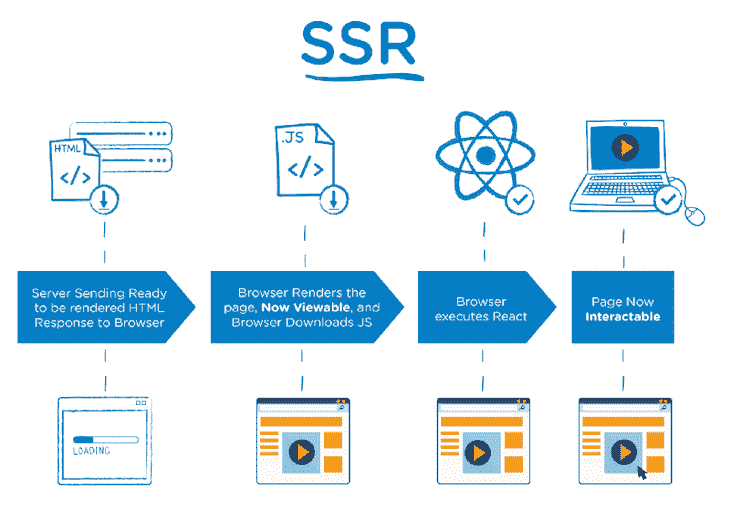

请记住，您可以使用 Next.js 等框架在 React 应用程序中支持 SSR，而 Create React App 等框架使您能够支持 CSR。

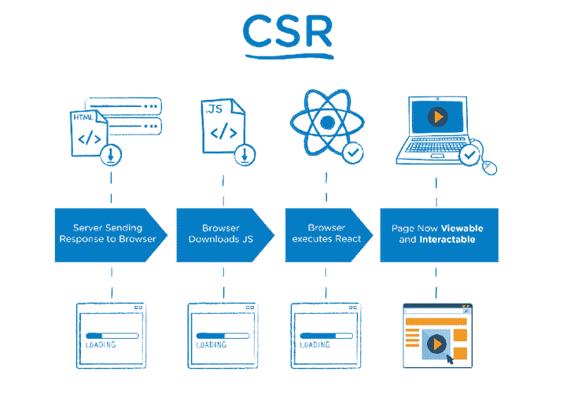

这些图表假设 SSR 可以比 CSR 更快地将 HTML 传送到浏览器。因此，让我们假设用 SSR 构建的 web 应用程序比用 CSR 构建的性能更好。

注意，沃尔玛实验室的文章指出同步 SSR 是`renderToString`的瓶颈。从 [React 16 和光纤增强](https://hackernoon.com/whats-new-with-server-side-rendering-in-react-16-9b0d78585d67)开始，这不再是一个问题。

### 构建两个相同的 spa 来比较 Next.js 并创建 React 应用程序

测试我们假设的最好方法是构建两个具有相同功能和 UI 的应用程序。我们希望它尽可能模拟真实世界的应用程序，因此我们将设置一些参数。

应用程序必须:

*   从 API 获取数据
*   呈现大量的内容
*   承载一些 JavaScript 重量

### 比较 Next.js 和 Create React 应用程序时的移动注意事项

软件开发人员通常被高性能的计算机和速度惊人的办公网络惯坏了；我们并不总是像用户一样体验我们的应用程序。

记住这一点，在优化性能时，考虑网络和 CPU 限制是很重要的。移动设备通常处理能力较低，因此繁重的 JavaScript 文件解析和昂贵的渲染会降低性能。

幸运的是， [Chrome 提供了一个名为 Lighthouse](https://blog.logrocket.com/lighthouse-and-how-to-use-it-more-effectively/) 的开发工具，这让我们很容易站在用户的角度，了解他们的体验。你可以在 Chrome DevTools 的“灯塔”面板下找到这个。

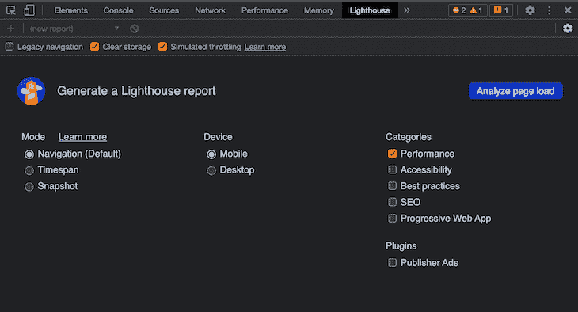

我们将使用上面显示的精确设置:

*   移动装置
*   模拟节流
*   清理存储
*   表演

### 比较 Next.js 和 Create React 应用程序时的地理注意事项

如果你住在北加州，你很可能整天在 AWS 地区 us-west-1(北加州)的服务器上。在这种情况下，您体验到的应用程序与美国或世界其他地方的用户体验不一样。

因此，为了测试的目的，演示应用和 API 被部署到澳大利亚的悉尼(具体来说， [Vercel 的 syd1 地区](https://vercel.com/docs/concepts/edge-network/regions))。客户端的浏览器将访问来自美国科罗拉多州博尔德的应用程序。

博尔德和悉尼之间的距离是 8318 英里(13386 公里)。


看看这对于这两个应用程序之间的数据获取意味着什么:

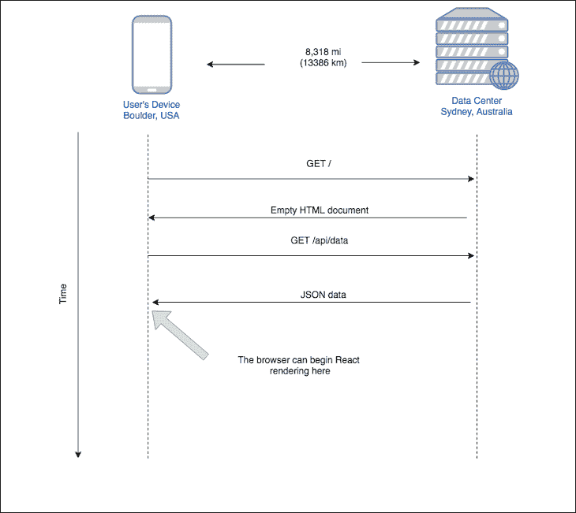

上图说明了地理距离对 CSR 数据获取的影响。下图说明了相同的情况，但用于 SSR 数据提取:

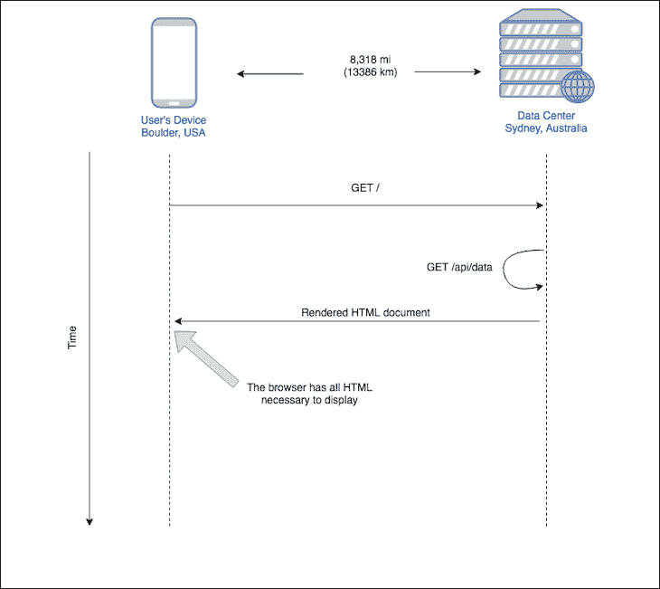

为了避免 Chrome 扩展对我们应用的页面加载性能产生负面影响，我们将在匿名模式下分析它的性能。

### 两个应用程序，一个 API:设置 Create React App 和 Next.js

这两个应用的代码可以在我的 GitHub 中找到。您可以通过以下链接查看每个申请的结果:

所有代码都在 monorepo 中:

*   `/cra`包含应用程序的 Create React App 版本
*   `/nextjs`包含 Next.js 版本
*   包含两个应用程序都使用的模拟 API

用户界面看起来是一样的。请记住，Create React 应用程序有一个 CSR UI，而下一个应用程序有一个 SSR UI:

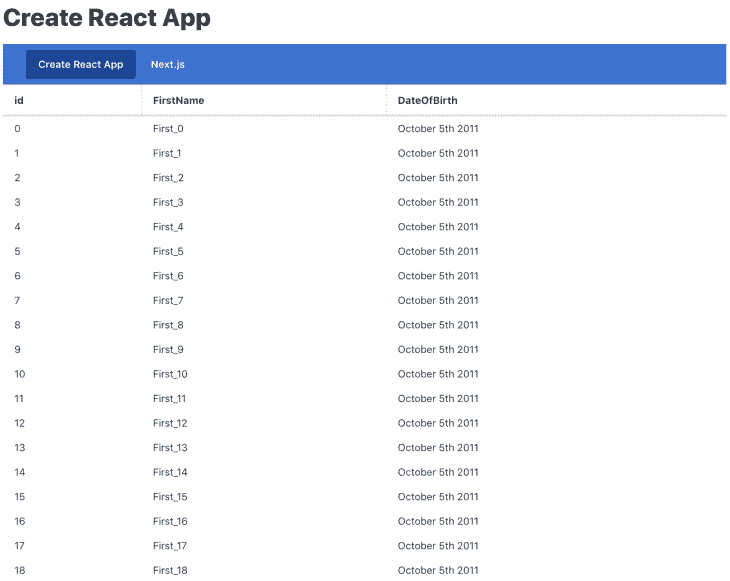

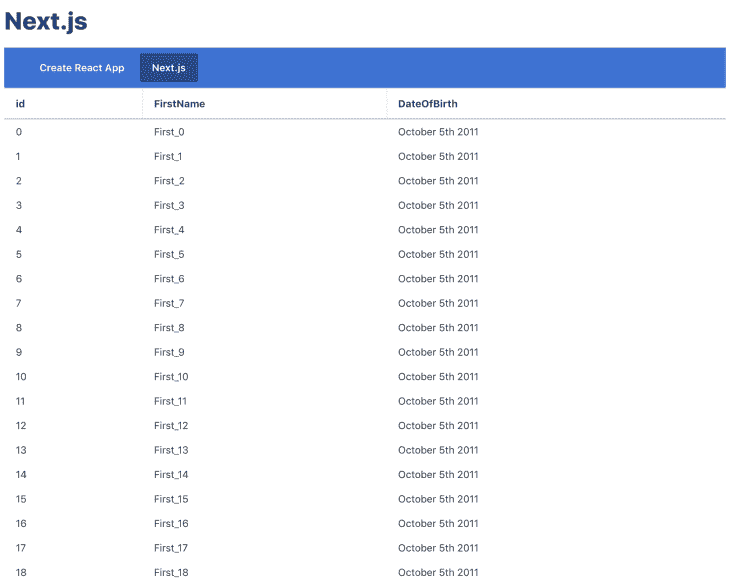

JSX 几乎一模一样。请参见下面的创建 React 应用程序代码:

```
// Create React App
<ThemeProvider>
  <div>
    <Text as="h1">Create React App</Text>
    <PrimaryNav align="left" maxItemWidth="20rem">
      <NavItem href="/" selected>Create React App</NavItem>
      <NavItem href="/nextjs">Next.js</NavItem>
    </PrimaryNav>
    <Table
      data={users}
      rowKey="id"
      title="Users"
      hideTitle />
  </div>
</ThemeProvider>

```

现在将其与下面的 Next.js 代码进行比较:

```
// Next.js
<ThemeProvider>
  <div>
    <Text as="h1">Next.js</Text>
    <PrimaryNav align="left" maxItemWidth="20rem">
      <NavItem href="/">Create React App</NavItem>
      <NavItem href="/nextjs" selected>Next.js</NavItem>
    </PrimaryNav>
    <Table
      data={users}
      rowKey="id"
      title="Users"
      hideTitle />
  </div>
</ThemeProvider>

```

我们一会儿会谈到`ThemeProvider`和其他组件是什么。

请注意，虽然上面的大部分代码对于 Create React App 和 Next.js 是相同的，但代码在如何从 API 获取数据方面有所不同。请参见下面的创建 React 应用程序代码:

```
// Create React App
// This all executes in the browser
const [users, setUsers] = useState([]);
useEffect(() => {
  const fetchData = async () => {
    const resp = await axios.get('/api/data');
    const users = resp.data.map(user => {
      return {
        id: user.id,
        FirstName: user.FirstName,
        DateOfBirth: moment(user.DateOfBirth).format('MMMM Do YYYY'),
      }
    });
    setUsers(users);
  };
  fetchData();
}, []);

```

Next.js 代码如下所示:

```
// Next.js
// This all executes on the server on first load
Index.getInitialProps = async({ req }) => {
  const resp = await axios.get(`http://${req.headers.host}/api/data`);
  const users = resp.data.map(user => {
    return {
      id: user.id,
      FirstName: user.FirstName,
      DateOfBirth: moment(user.DateOfBirth).format('MMMM Do YYYY'),
    }
  });
  return { users };
}

```

`getInitialProps`是一个特殊的函数，Next.js 使用它来填充 Next.js 中页面的初始数据。你可以在 Next.js 文档中了解更多关于[获取数据的信息。](https://nextjs.org/docs#fetching-data-and-component-lifecycle)

那么所有这些组件是什么，我们为什么要使用 Moment.js？

我们还[引入了 Moment.js](https://momentjs.com/) ,因为它是一个更大的依赖项，增加了一些 JavaScript 权重，以及在呈现组件树时需要进行的一些额外处理。

我们使用的实际库并不重要；重点是更接近普通应用程序的重量，而不需要花费时间来构建所有这些。

### Next.js 与 Create React 应用程序:性能结果

以下是我们的 Create React App (CSR)应用程序的全页面加载的 Lighthouse 结果:

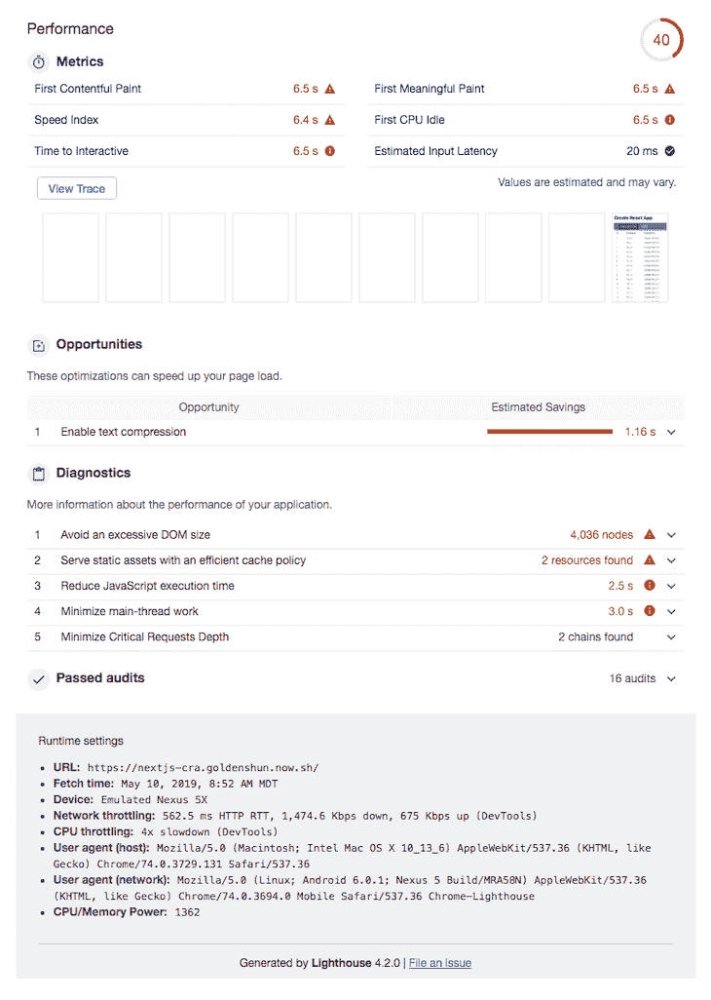

在下面，您可以看到我们的 Next.js (SSR)应用程序的完整页面加载的 Lighthouse 结果:

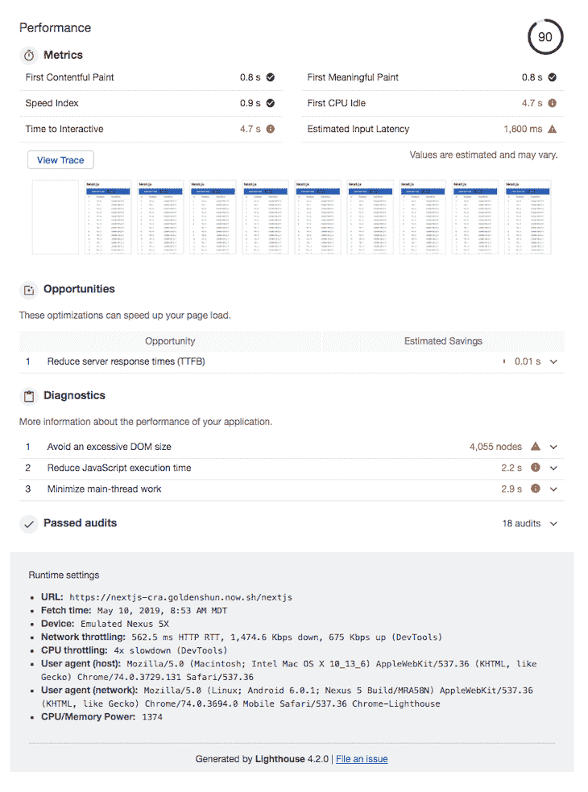

根据总体得分，您可以看到我们的 Next.js 应用程序(SSR)比我们的 Create React App (CSR)应用程序表现得更好。要了解这些指标的细节，请阅读 [Lighthouse 评分指南](https://developers.google.com/web/tools/lighthouse/v3/scoring)。

对我们的目的来说，最显著的区别之一是第一次有意义的绘画。请参见下面的区别:

*   创建 React 应用程序:6.5s
*   Next.js: 0.8s

根据[谷歌的第一个有意义的绘画文档](https://developers.google.com/web/tools/lighthouse/audits/first-meaningful-paint)，这个指标“确定了用户感觉页面主要内容可见的时间。”

灯塔也帮助我们将这些差异形象化。查看 Create React App (CSR，上图)和 Next.js (SSR，下图)之间的对比:

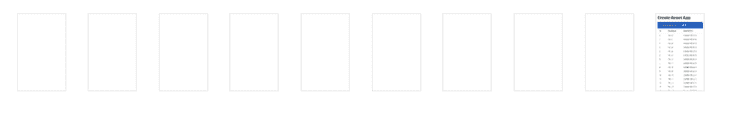

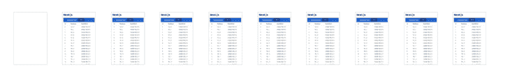

上面的画面看起来熟悉吗？它们应该可以，因为它们模拟了我们之前看到的图表，当时我们假设 SSR 可以比 CSR 更快地向浏览器交付 HTML。基于这些结果，它可以！

要自己查看 Lighthouse 结果，请遵循以下步骤:

1.  下载 [CRA](https://www.dropbox.com/s/g6ezatrz1iushgo/lighthouse-cra?dl=0) 和 [Next.js](https://www.dropbox.com/s/i71x8in664eb95t/lighthouse-nextjs?dl=0) 的文件
2.  在 Chrome 浏览器中打开 https://googlechrome.github.io/lighthouse/viewer/
3.  将下载的文件拖入 Chrome 中的 Lighthouse Viewer

## Next.js 与 Create React 应用程序性能:图像优化

谈到图像优化，CRA 没有太多的提供。在这种情况下，Next.js 再次胜过 CRA。

Next.js 有一个名为 `[next/image](https://blog.logrocket.com/next-js-automatic-image-optimization-next-image/)`的[内置图像组件，这是一个经过修改的 HTML ``元素，内置了许多渲染图像的性能优化。它是在版本 10 中引入的。](https://blog.logrocket.com/next-js-automatic-image-optimization-next-image/)

`next/image`组件使用现代图像格式提供特定于设备的图像。它还通过仅在图像进入视窗时加载图像来加速页面加载，并提供模糊占位符选项。

## Next.js 与 Create React 应用程序性能:代码拆分

说到性能，代码分割是另一个需要考虑的重要因素。

将应用程序包分割成每个入口点所需的较小部分称为代码分割。目标是通过只加载运行该页面所需的代码来减少应用程序的初始加载时间。

为了使用 Create React App 正确执行代码拆分，开发人员必须投入大量精力并使用额外的库。坚持使用动态`import()`语法是明智的，因为这是在 Create React 应用程序中管理代码拆分的推荐技术，Webpack 会在遇到它时立即开始对应用程序进行代码拆分。

在 Next.js 中，`pages/directory`中的每个文件在构建阶段都会被自动代码分割成自己的 JavaScript 包；因此，代码分割是开箱即用的。此外，页面之间共享的任何代码都被分成一个单独的包，以避免在后续导航中重新下载相同的代码。

在初始页面加载之后， [Next.js 可以开始为用户可能访问的任何后续页面预加载代码](https://nextjs.org/docs/api-reference/next/link#:~:text=Defaults%20to%20false-,prefetch,-%2D%20Prefetch%20the%20page)。在典型的 Create React 应用程序中，这将需要大量代码，有时还需要额外的库。

## Next.js 的局限性

虽然 Next.js 是一个很好的框架，但是它在开发方面有一些缺点。

比如 Next.js 在服务器端的开发复杂度相对较高。一些 JavaScript 插件和库，如 Bootstrap 和其他支持 DOM 操作的库，被设计为只能在客户端运行，这需要开发人员付出额外的努力来处理客户端和服务器端的验证，以确定何时导入和使用这样的库。

此外，Next.js 需要 Node.js 服务器在服务器端运行 JavaScript。因此，在使用 Next.js 创建应用程序之前，您必须首先设置服务器。

## 从 Create React 应用程序迁移到 Next.js

如果您正在考虑将现有的非弹出 Create React App 项目迁移到 Next.js，Next.js 团队在官方 Next.js 文档中记录了关于迁移到 Next.js 的分步指南[。](https://nextjs.org/docs/migrating/from-create-react-app)

## 结论

我们以一个问题开始了我们的实验:SSR 能提高应用程序的性能吗？

为了研究这个问题，我们构建了两个几乎相同的应用程序，一个通过 Create React App 使用客户端渲染，另一个通过 Next.js 使用服务器端渲染。

我们模拟的灯塔结果显示，Next.js 应用程序在所有重要类别中都有更好的指标，特别是首次有意义的绘画(减少 87.69%)、首次有内容的绘画(减少 87.69%)和交互时间(减少 27.69%)。

结果不言自明。您对 Next.js 和 Create React 应用程序的体验如何？

## [LogRocket](https://lp.logrocket.com/blg/react-signup-general) :全面了解您的生产 React 应用

调试 React 应用程序可能很困难，尤其是当用户遇到难以重现的问题时。如果您对监视和跟踪 Redux 状态、自动显示 JavaScript 错误以及跟踪缓慢的网络请求和组件加载时间感兴趣，

[try LogRocket](https://lp.logrocket.com/blg/react-signup-general)

.

[ ](https://lp.logrocket.com/blg/react-signup-general) [](https://lp.logrocket.com/blg/react-signup-general) 

LogRocket 结合了会话回放、产品分析和错误跟踪，使软件团队能够创建理想的 web 和移动产品体验。这对你来说意味着什么？

LogRocket 不是猜测错误发生的原因，也不是要求用户提供截图和日志转储，而是让您回放问题，就像它们发生在您自己的浏览器中一样，以快速了解哪里出错了。

不再有嘈杂的警报。智能错误跟踪允许您对问题进行分类，然后从中学习。获得有影响的用户问题的通知，而不是误报。警报越少，有用的信号越多。

LogRocket Redux 中间件包为您的用户会话增加了一层额外的可见性。LogRocket 记录 Redux 存储中的所有操作和状态。

现代化您调试 React 应用的方式— [开始免费监控](https://lp.logrocket.com/blg/react-signup-general)。