# 用 Dialogflow CX 博客创建一个 React 聊天助手

> 原文：<https://blog.logrocket.com/create-react-chat-assistant-dialogflow-cx/>

当你访问一个使用聊天机器人助手的网站时，你有没有想过它是如何工作的？

在这篇文章中，我将向你展示如何使用 Dialogflow 构建一个聊天助手。最棒的是。我们将用 React 来做这件事。我们将回顾什么是 Dialogflow，解释它的各种组件，并将其与 React 应用程序集成。

到本文结束时，您将拥有一个使用 React 构建的功能正常的 Dialogflow 聊天机器人助手，并将其添加到您的作品集中。耶！！！

你可以从我的 [GitHub](https://github.com/chinedu360/blogbotapp.git) 克隆这个项目，喜欢的话请留个星。😊

## 先决条件

要设置我们的 Dialogflow 聊天机器人，我们需要以下内容:

*   Gmail 帐户(这将使我们能够创建 Dialogflow CX 代理)
*   访问谷歌云

但是首先，让我们看看什么是对话流 CX…

## 什么是对话流 CX？

对话流 CX 是一个对话式人工智能平台，简称 CAIP，用于构建对话式用户界面。它可以用来实现几种类型的虚拟代理，如语音机器人、聊天机器人和电话网关，最好的部分是它支持 50 多种不同的语言。

现在我们知道什么是对话流 CX，让我们设置我们的环境。

## 设置我们的环境

第一步是开放一个谷歌云项目。

您将被要求登录，如果您有 Gmail 帐户，请使用您的凭据登录。之后，您将被重定向到一个控制面板。

接下来，点击**创建项目**。

之后，我们必须输入项目名称。在我们的例子中，我们将使用`blog-post-bot`。

第二个要选择的是上级组织，然后点击**创建**:


之后，您将看到一个类似下图的控制面板:


现在让我们启用 Dialogflow API。

为了使用 Dialogflow，我们必须[为我们的项目启用 Dialogflow API](https://dialogflow.cloud.google.com/cx/projects) 。我们可以在弹出的控制面板上这样做，类似于下图:

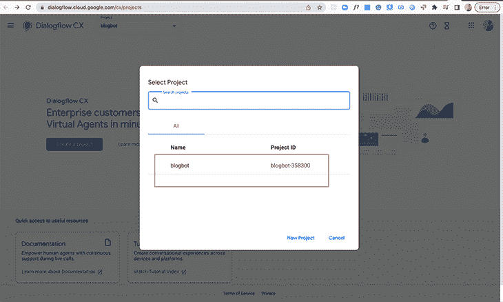

选择我们最初创建的项目，您将看到下面的屏幕。点击**启用 API** :

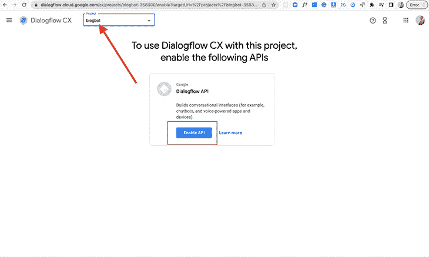

然后会出现另一个屏幕提示您创建代理。完成初始基本代理设置的表单:

*   设置显示名称
*   保留默认位置:`us-central1 (Iowa, USA)`
*   设置您的首选时区。我把我的设置为`(GMT+1:00) Africa/Casablanca`
*   将该语言作为默认语言，或者随意设置自己的语言
*   点击**创建**

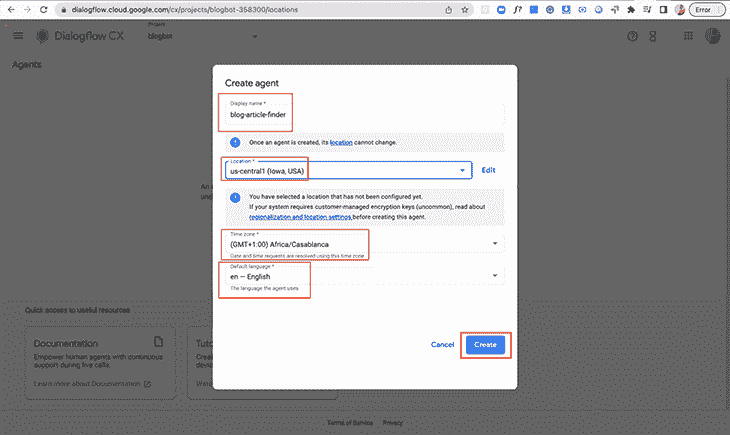

在我们的代理创建之后，我们会看到一个名为“默认启动流”的仪表板控制面板底部会弹出一个小窗口，告诉我们我们的代理已成功创建:

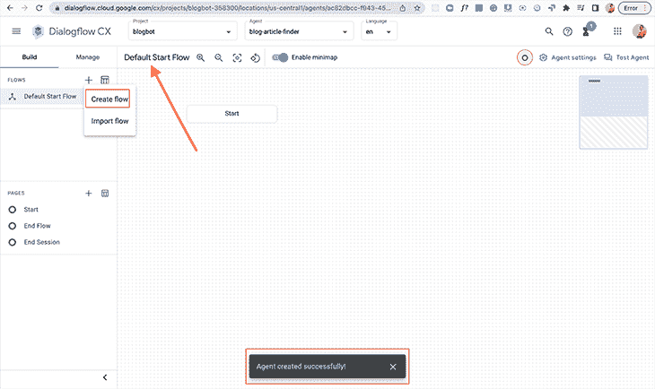

## CX 的对话流是什么？

“流量”是“CX 流量”对话中的一个新概念。它们使我们能够创建包含许多主题的复杂对话。

我们正在构建的 bot 将为我们提供不同的文章，如博客文章类别、文章建议和最受欢迎的文章。

这样，我们将有三个对话主题，我们将把它们分成三个不同的流程:

*   种类
*   建议的文章
*   最佳文章

接下来，我们将设置我们的流。

## 创造我们的流动

在上图中，你可以看到左边工具条上的 **+** 图标。点击**创建流**并输入名称“类别”按下`Enter`键。

我们已经成功创建了我们的第一个流量！现在，继续为“推荐文章”和“最佳文章”做同样的事情

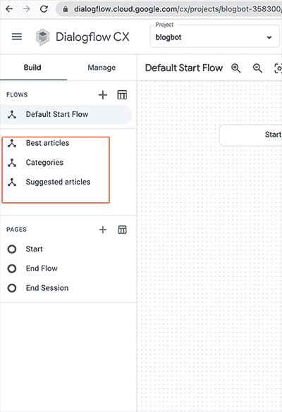

## 对话流模拟器

在 Dialogflow CX 仪表板上，我们有一个模拟器。这允许我们模拟我们的机器人，测试我们的对话。

在我们仪表板的右上角，点击**测试代理**。

为了快速测试我们的机器人，我们可以说`Hi`。我们的虚拟代理将使用默认的欢迎消息进行响应，如下图所示:

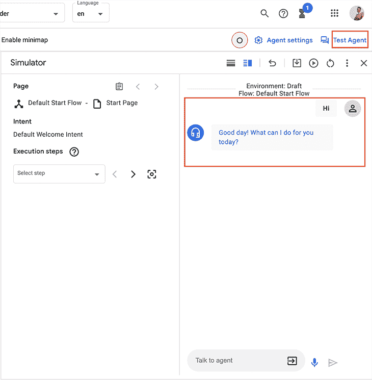

让我们把欢迎词改成更个性化的——更友好、更热情、更有趣的。

在您的仪表板左侧，点击**默认启动流程**，然后点击**启动树**节点打开页面。

***注意:**，在左边栏的**页面**部分，自动选择**开始***

在**开始**，在**路线**下，点击**默认欢迎意向**。在右侧，将打开另一个面板，在该面板中查找**履行**部分，并删除所有**代理说**条目。在下面添加我们的自定义文本:

`You are most welcome, I am Chinedu, a blog bot. I can do many things. You can read tech articles from many categories, get the best articles, and I can suggest great articles in case you don't have any in mind, I'm sure you'd love it! Let's get reading…`

接下来，我们制作一些快速回复按钮，类似于我们在常规机器人上看到的按钮。我们称之为建议芯片。

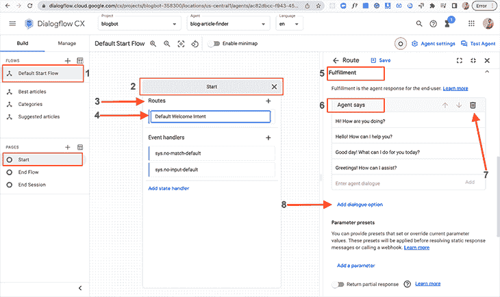

在**履行**下，有一个叫做**的链接添加对话选项。**点击它，然后点击**自定义有效载荷**，并在点击**保存**之前粘贴以下代码片段:

```
{
    "richContent": [
      [
        {
          "type": "chips",
          "options": [
            {
              "text": "Categories"
            },
            {
              "text": "Best articles"
            },
            {
              "text": "Suggested articles"
            }
          ]
        }
      ]
    ]
  }

```

现在，让我们继续在模拟器中测试我们的欢迎意图:

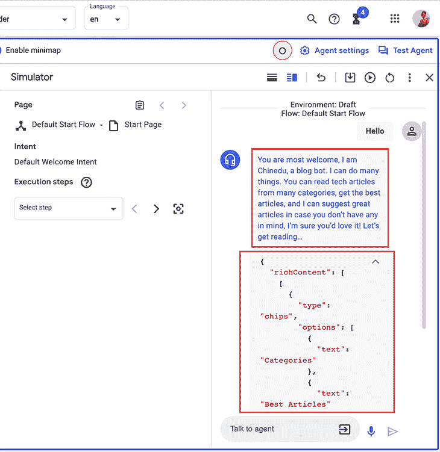

当我们发送`Hi`时，我们会收到自定义消息。你可能已经注意到，我们不能查看我们的芯片。为了实现这一目标，我们需要整合。为此，我们将使用 React，并将 React 应用程序设置为与我们的 Dialogflow bot 集成。

但在此之前，我们需要实现这样的 web 集成:

*   在左侧工具条中，点击**管理**
*   向下滚动到**集成**
*   从仪表板中选择 **Dialogflow Messenger**
*   点击**连接**
*   会出现一个弹出窗口，点击**启用**

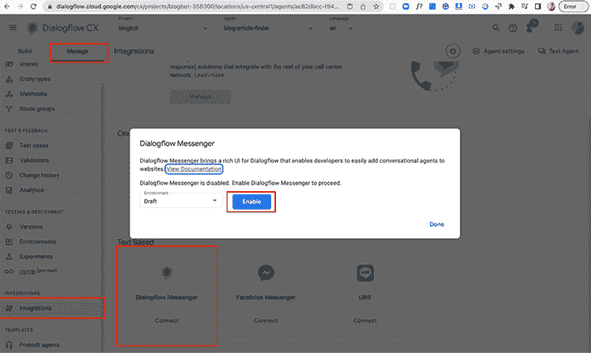

此后，将显示另一个弹出窗口，其中包含我们集成所需的 JavaScript 代码:

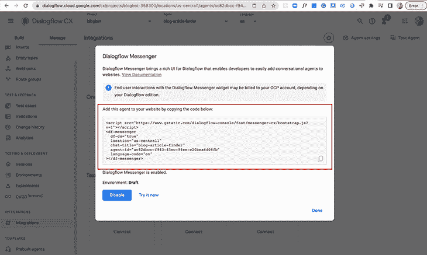

要做一个快速演示，我们可以点击**立即尝试**按钮。

## 设置我们的 React 应用程序

在您的终端中，通过运行以下代码创建一个新的 React 项目:

```
npx create-react-app blogbotapp

```

接下来，`cd`进入我们的应用程序，用您最喜欢的代码编辑器打开它，并键入 run `npm start`。

接下来，我们将代码片段添加到 React 应用程序的 public 文件夹中的 HTML 文件主体中:

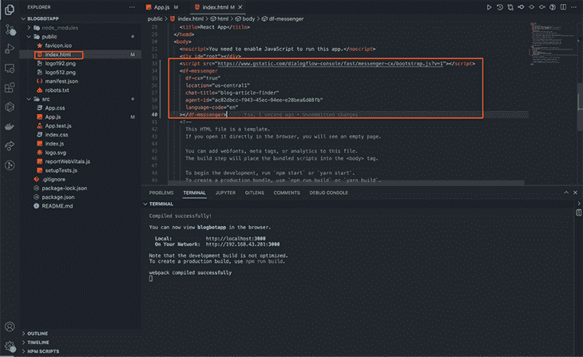

一切就绪！这样，我们已经成功地设置了 React 应用程序，我们可以在 Dialogflow CX 仪表板上看到一切都运行良好，就像我们的模拟器一样。

让我们回到配置我们的机器人和设置我们的实体。

### 三种实体类型是什么？

实体用于从用户输入中识别和提取有用的数据。

我们将很快创建我们的实体，但 Dialogflow 提供了可用于匹配日期、电子邮件、颜色、货币、电话号码、地址等的实体。

在 Dialogflow 中有三种类型的实体:

*   系统实体
*   会话实体
*   开发商实体

让我们继续为我们的类别、最佳文章和推荐文章选项创建自定义实体。

### “类别”的实体

首先，点击**管理**，然后点击**实体类型。**如果仪表板打开，点击按钮**创建新的**。

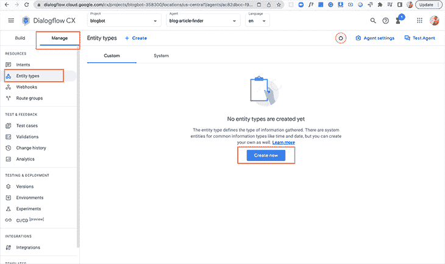

将出现一个仪表板，您可以在其中输入显示名称。在显示实体的表中，输入以下实体及其同义词:

*   react.js(同同义词:React，React，React.js，reactjs，Reactjs，React。JS)
*   Node.js(同同义词:Node，node.js，Node.js，Node。JS，NODE。JS，nodejs，NODEJS，Nodejs)
*   数据结构和算法(同义词:算法，算法，算法，算法，数据，数据，数据结构，数据结构和算法，dsa，结构，DSA，数据结构和算法，数据结构和算法，数据结构和算法，数据结构和算法)

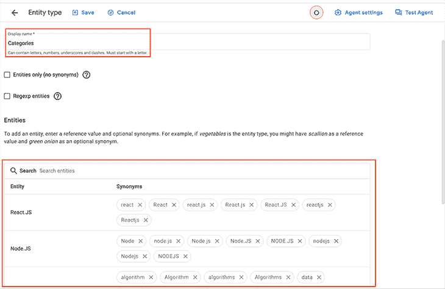

之后，点击**高级** **设置**下拉菜单，勾选**模糊匹配**和**编辑日志**复选框。

模糊匹配在这种情况下很有帮助，如果我们拼错了一个名字，它可以将它匹配到正确的实体。

在日志中编辑有助于在我们拼写错误的情况下纠正日志中的名称。

之后，点击**保存**，对另外两个实体做同样的操作。

保存我们的第一个实体后，返回到仪表板，我们可以看到我们的第一个实体@Categories。要创建新实体，点击 **+** **创建**。

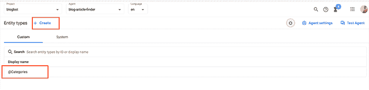

### “最佳文章”实体

*   Javascript:如何实现队列(同义词:Javascript queue，JavaScript:如何实现队列，队列，队列，队列，队列，队列)
*   70+ JavaScript 库(同义词:70+ JavaScript 库框架工具和插件、插件、插件、插件、插件、插件、工具、工具、工具、工具、工具、框架、框架、框架、框架、框架。库、库、javascript 库)
*   大 O 符号(同义词:大 O，大 O，大 O 符号，符号，大 O 符号)

### “建议文章”的实体

*   高速缓存(带有同义词:高速缓存、重定向、高速缓存、重定向、高速缓存、重定向)
*   Nest.js 与 loopback(同义词:NESTJS 与 Loopback、nestjs、Nestjs、Loopback、loopback4)

接下来，我们设定我们的意图。

## 意图是什么？

在对话流 CX 中，意图包含检测用户想要什么的逻辑。它们只包含训练短语，因此可以重复使用。

***注意:根据文档，训练短语在意图中使用实体。这有助于获得变量输入，因此在创建意图之前创建实体类型是个好习惯***

 **训练短语是用户可能键入或说出的示例短语。如果用户输入与定义的短语之一相似，则 Dialogflow 匹配该意图。

此外，我们不需要匹配所有内容，因为 Dialogflow 具有内置的机器学习功能，可以用其他类似的短语扩展我们的列表。

意图使用三种不同的前缀:

*   重定向(对于使用 NLU 获取页面的意图)
*   确认/拒绝(对于是或否的意向培训短语)
*   补充(在意图是一个可以在流程中随时返回的附加问题的情况下)

## 我们如何创造意图？

要创建意向，点击**管理**，然后点击**意向**。在仪表板顶部，点击 **+创建**按钮。

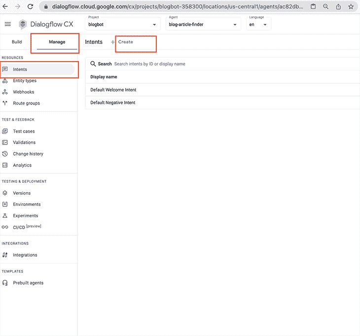

我将继续为@ Catergories 实体创建意图，然后我将为其他实体提供短语，使您能够自己完成这项工作。

你可以想象更多的训练短语。建议每个意图有 10 个以上的训练短语，以涵盖用户可能触发它的不同方式。

在显示**显示名称**的输入框中，输入`redirect.categories.overview`。

对描述进行同样的操作:

`Categories.description: The types of articles we have.`

之后，我们向下滚动并创建训练短语:

*   `Can I see a list of all the available categories of articles?`
*   `What articles can I read?`
*   `I would like to see the categories of articles available`
*   `Which categories of tech articles do you have`
*   `Which categories are currently available`
*   `Which category`
*   `Which articles`
*   `What articles can I read?`

做完这些后，点击**保存**。

现在，继续创造新的意图。

## 页面和状态处理程序

Dialogflow CX 对话可以被描述为[有限状态自动化](https://en.wikipedia.org/wiki/Finite-state_machine)。

我举个例子解释一下…

拿自动取款机(ATM)来说。ATM 具有以下状态:等待信用卡/借记卡、输入您的 pin/密码、选择您的银行、选择取款金额、给钱，以及当用户提供某个输入时，在不同状态之间移动。

插入你的卡会改变 ATM 机的状态，从等待信用卡/借记卡变为输入你的 pin/密码。

在 Dialogflow CX 虚拟代理中，我们使用页面来模拟这些状态。

有三种类型的路由通过处理页面之间的转换来控制对话状态:

*   条件路由:根据会话中存储的特定条件更改页面
*   意图路线:改变页面是基于用户所说的/想要的
*   事件处理程序:当应该处理某个事件时，就会改变页面(例如，不处理匹配，不处理输入)

发送回用户的响应被称为对话话语。它们由两种类型的履行来定义:

*   动态实施:当实施 webhook 被调用以获得动态响应时
*   静态履行:当提供静态履行回应时

我们不会去创造动态履行。对于我们的博客机器人，我们将专注于静态履行响应。

我们将在默认的开始流程中创建页面:

*   首先点击**构建**
*   点击**默认启动流程**
*   点击左侧工具条中**页面**下的**开始**
*   接下来，点击**路线**旁边的 **+** 图标
*   点击**意向**输入下拉菜单
*   添加`redirect.categories.overview`
*   向下滚动到**转换**并选择我们最初创建的**类别**流
*   最后，点击**保存**
*   我们对`redirect.bestArticles.overview`、 `redirect.reactjs`、 `redirect.nodejs`、`redirect.datastructures-and-algorithims`、`redirect.suggestedArticles.overview`和 `redirect.end`重复相同的过程

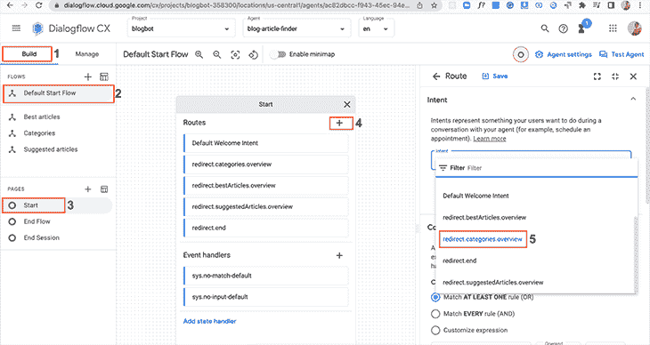

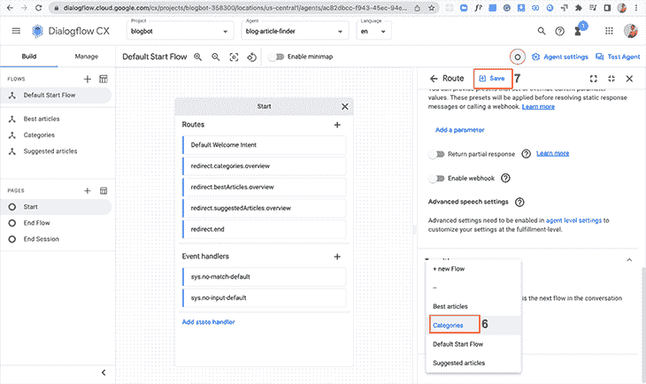

你可能已经注意到**结束会话**和**流**。**结束流程**关闭流程并跳回到上一个活动流程，而**结束会话**关闭整个聊天会话。

接下来，我们为流创建页面，从类别开始。以下聊天记录用于“类别”流程:

```
Message from user: "Hello"

Bot response: "You are most welcome, I am Chinedu, a certified comrade and a blog bot. I can do many things. You can read tech articles from many categories, get the best articles, and I can suggest great articles in case you don't have any in mind, I'm sure you'd love it! Let's get reading…"

Message from user: "Can I see a list of all the available categories of articles?"

Bot response: "We have the following categories you could read from: React.js, Node.js, Data Structures and Algorithms.Which categories would you love to read from?"

Message from user: "React.js"

Bot response: "Awesome! Everyone loves React.js"

```

让我们连接页面:

*   首先点击**构建**
*   点击**类别**
*   点击**开始**下的**页面**
*   接下来，点击**路线**旁边的 **+** 图标
*   点击**意图**输入下拉菜单
*   添加`redirect.categories.overview`
*   向下滚动到**过渡**，选择**页面**，选择 **+新页面**。
*   使用页面名称 **: `Category Overview`**
*   最后，点击**保存**
*   我们对`redirect.bestArticles.overview`、`redirect.reactjs`、`redirect.nodejs`、`redirect.datastructures-and-algorithims`和`redirect.suggestedArticles.overview` 重复同样的过程

我们将继续添加静态实现:

*   在**类别**中，点击**类别概述**
*   点击**条目履行**部分下的**编辑履行**
*   粘贴静态履行消息:`We have the following categories you could read from: React.js, Node.js, Data Structures and Algorithms.`
*   点击**保存**

我们对“最佳文章”概述和“建议文章”概述做同样的事情 **:**

*   `Do you want to read some of our best articles?`
*   `You don't have anything in mind to read? I could suggest articles for you to read.`

让我们看看参数和它们的用途。

参数用于捕获我们期望用户在会话中提供的值。

每个参数都有一个实体和名称。

让我们为“类别概述”页面创建参数:

*   点击**类别概述**页面
*   点击**参数**块中的 **+** 。添加类别参数
*   输入显示名称:`category`
*   选择一个实体类型:`@Category`
*   勾选所需的**框**
*   勾选 **日志**中**修订** **的复选框**

如果虚拟代理没有收集 category 参数，我们可以向用户发送一个响应:

`Please, what category of article do you have in mind?`

接下来，让我们添加一个提供丰富建议的对话选项。

点击**添加对话选项**，添加如下 JSON 代码:

```
{
  "richContent": [
    [
      {
        "options": [
          {
            "text": "React.js"
          },
          {
            "text": "Node.js"
          },
          {
            "text": "Data Structures and Algorithms"
          }
        ],
        "type": "chips"
      }
    ]
  ]
}

```

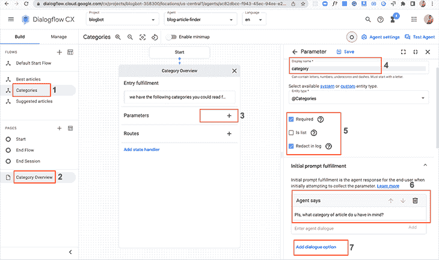

我们可以处理不同的后备履行提示。我们用参数事件处理程序来做这件事。有各种内置的事件处理程序可供选择，比如我们将要使用的无匹配默认和无输入默认。

*   在同一页面上，向下滚动到**事件处理程序**部分
*   点击**添加事件处理程序**
*   选择事件:`No-match default`
*   然后粘贴以下静态履行文本:`I could not get that, can you specify the category you need? You can choose React.js, Node.js, and Data Structures and Algorithms. What category of articles would you like to read?`
*   点击**保存**
*   点击**添加事件处理程序**
*   选择事件:`No-input default`
*   然后粘贴静态消息:`I am sorry, I could not get the category you need. You can choose React.js, Node.js, and Data Structures and Algorithms. What category of articles would you like to read?`
*   点击**保存**

**页面条件路线**

当与页面条件路由结合使用时，参数往往非常强大。当条件评估为`true`时，调用相应的页面路由。

对于我们的博客机器人，我们收集一系列参数，因此我们将创建一个表单来检查我们的条件是否满足。

在“类别概述”页面上创建条件路线。

这里，我们创建了一个条件路径，一旦知道了艺术家，它将转移到下一页。

在我们选择了我们想要的类别之后，我们的机器人会做一些非常简单的事情。它向我们传递了一个很好的信息“React.js，不错的选择。”

在“最佳文章”流程中，我们单击**最佳文章**，点击路线旁边的 **+** ，并将以下内容粘贴到自定义有效负载中:

```
{
  "richContent": [
    [
      {
        "options": [
          {
            "link": "https://blog.logrocket.com/add-redis-cache-nestjs-app/",
            "text": "Redis in Nestjs"
          },
          {
            "link": "https://blog.logrocket.com/build-strongly-typed-polymorphic-components-react-typescript/",
            "text": "React.js polymorphic component"
          }
        ],
        "type": "chips"
      }
    ]
  ]
}

```

将意图更改为我们最初创建的“最佳文章”页面，并将条件设置为`At least match one rule`。

之后，我们希望创建另一条结束会话的路线。

我们对建议的文章做同样的事情。创建一个名为“建议文章”的新意图，同时粘贴以下有效负载并创建结束会话路线:

```
{
  "richContent": [
    [
      {
        "options": [
          {
            "link": "https://www.ddevguys.com/bigo-notation-summarized",
            "text": "Big O Notation Summarized"
          },
          {
            "link": "https://www.ddevguys.com/javascript-how-to-implement-the-linked-list-data-structure-part3",
            "text": "Linked-list"
          },          {
            "link": "https://www.ddevguys.com/javascript-how-to-implement-a-queue",
            "text": "Implement a queue."
          }
        ],
        "type": "chips"
      }
    ]
  ]
}

```

有了这个，我们已经能够构建一个非常简单的机器人，在我们选择了一个类别后，它会向我们发送一条很酷的消息，向我们发送我们最好的文章，还会向我们推荐文章。

唷…

## 结论

我们回顾了使用 Dialogflow CX 和 React 构建聊天机器人的过程。这个应用程序和聊天机器人可以在很多方面进行改进，这取决于你的项目要求和你想要实现的目标。

这只是 Dialogflow CX 可以做什么以及它有多强大的一个基本概述。

如果你做到了这一点，你确实是一个传奇，因为这是一个漫长的传奇。我真的很感谢你花时间读这封信。

如果你喜欢，请留下反馈！如果你想真正深入到对话流 CX，我希望听到你们所有人的声音。

在那之前，继续编码。非常爱。

## [LogRocket](https://lp.logrocket.com/blg/react-signup-general) :全面了解您的生产 React 应用

调试 React 应用程序可能很困难，尤其是当用户遇到难以重现的问题时。如果您对监视和跟踪 Redux 状态、自动显示 JavaScript 错误以及跟踪缓慢的网络请求和组件加载时间感兴趣，

[try LogRocket](https://lp.logrocket.com/blg/react-signup-general)

.

[ ](https://lp.logrocket.com/blg/react-signup-general) [](https://lp.logrocket.com/blg/react-signup-general) 

LogRocket 结合了会话回放、产品分析和错误跟踪，使软件团队能够创建理想的 web 和移动产品体验。这对你来说意味着什么？

LogRocket 不是猜测错误发生的原因，也不是要求用户提供截图和日志转储，而是让您回放问题，就像它们发生在您自己的浏览器中一样，以快速了解哪里出错了。

不再有嘈杂的警报。智能错误跟踪允许您对问题进行分类，然后从中学习。获得有影响的用户问题的通知，而不是误报。警报越少，有用的信号越多。

LogRocket Redux 中间件包为您的用户会话增加了一层额外的可见性。LogRocket 记录 Redux 存储中的所有操作和状态。

现代化您调试 React 应用的方式— [开始免费监控](https://lp.logrocket.com/blg/react-signup-general)。**