# 使用 Ignite 样板文件创建 React 本机应用程序

> 原文：<https://blog.logrocket.com/create-react-native-app-using-ignite-boilerplate/>

在本教程中，我们将了解一下 [React 本机 Ignite 样板文件](https://github.com/infinitered/ignite)。具体来说，我们将用它来构建一个应用程序。在本教程结束时，您应该能够在自己的 React 本地项目中使用 Ignite。

我们将讨论以下主题:

*   使用 Ignite 创建新的 React 本地项目
*   点燃文件夹结构
*   加速开发的发电机
*   设计系统
*   定制组件
*   带反应导航的导航
*   用于状态管理的 MobX 状态树
*   调试用电抗器
*   隔离组件开发的故事书
*   测试数据存储的 Jest
*   端到端测试的排毒

## 目录

## 先决条件

本教程假设您已经有了创建 React 本地应用的经验，并且您的机器已经安装了 [React 本地开发环境](https://reactnative.dev/docs/environment-setup)。

Ignite 使用 TypeScript，因此 TypeScript 知识会很有用，尽管您应该能够在没有任何 TypeScript 经验的情况下学习本教程。

## 什么是 Ignite？

Ignite 是 React 本地项目的样板文件。它是由 Infinite Red 的团队创建的，主要是因为他们在项目中使用了 React Native。这意味着 Ignite 包含了他们应用于自己项目的所有最佳实践。

您可以[从他们的文档中了解关于 Ignite](https://github.com/infinitered/ignite) 的更多信息。

## 使用 Ignite 创建新的 React 本地项目

首先，您可以使用以下命令创建一个新的 Ignite 项目:

```
npx ignite-cli new HealthTracker

```

这将生成一个新的 React 本地项目，具有我在介绍中提到的所有功能。请注意，这将生成一个裸露的 React 原生项目。如果你想用 [Expo](https://expo.dev/) 代替，那么指定`--expo`选项如下:

```
npx ignite-cli new HealthTracker --expo

```

这是您生成新项目时的样子:

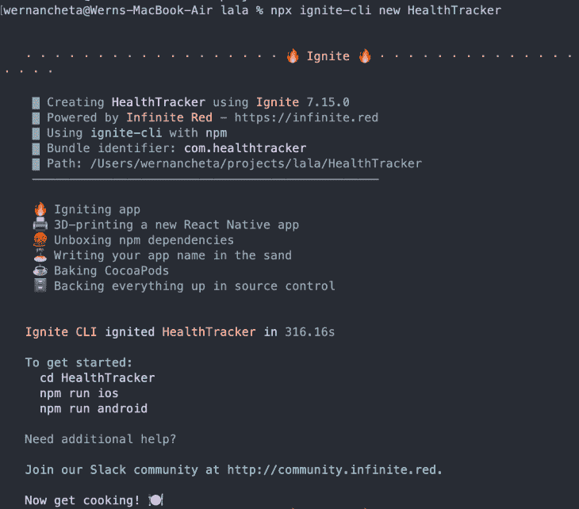

如果您在安装时遇到问题，请务必查看 GitHub repo 上的[故障排除](https://github.com/infinitered/ignite#troubleshooting)部分。就我个人而言，我在初始化 Ignite 项目时遇到了一个问题，因为我没有安装 Node 的 LTS 版本。在撰写本文时，它的版本是 16.6.0。

安装后，您现在可以像在一个简单的 React 原生项目中一样运行该应用程序:

```
npx react-native run-android
npx react-native run-ios

```

您应该会看到这个欢迎屏幕:

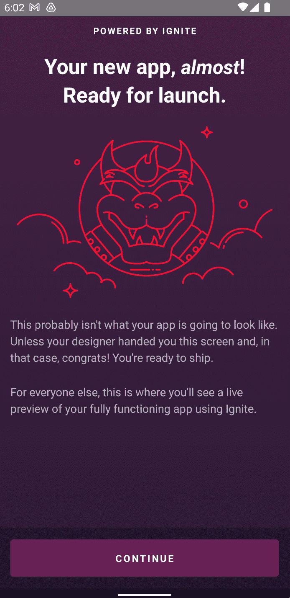

当您按下**继续**时，它会显示如何使用的快速指南:

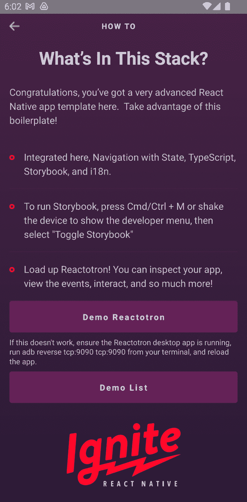

### 其他依赖项

除了 Ignite 依赖项之外，应用本身也依赖于以下库:

下面是安装所有这些组件的命令:

```
npm install date-fns random-id @react-navigation/bottom-tabs react-native-vector-icons

```

不要忘记遵循如何设置库的附加说明。这些通常会在他们的 GitHub 回购中指出，我在上面已经链接过了。

## 点燃文件夹结构

以下文件夹将出现在新生成的 Ignite 项目中。它上面已经有一些文件了。我们的项目并不需要其中的大部分，但在构建应用程序时将其作为参考是很有用的。

*   这是你的导航器、配置、组件、屏幕、主题、实用程序以及其他所有与你的应用程序直接相关的东西的所在位置
    *   `components` —这是所有组件将驻留的地方。每个组件都有自己的文件夹，并且包含组件文件及其故事文件。如果有任何特定于组件的资产，它们也可以驻留在这里
    *   `i18n` —包含应用程序的翻译文件
    *   `models` —您所有的应用模型及其测试文件都将驻留在这里。如果您有其他与模型相关的文件，比如类型，它们也应该驻留在这里
    *   所有导航器和导航工具都将驻留在这里
    *   `screens` —这是所有屏幕组件将驻留的地方。每个屏幕都有自己的文件夹。屏幕直接需要的任何文件都应该添加到同一个文件夹中
    *   这是应用程序主题的所在。这包括字体、版式、颜色和间距
    *   `utils` —放置整个应用程序中使用的助手和实用程序的地方
    *   `app.tsx` —应用程序的入口点
*   `bin` —包含初始化新应用程序时 Ignite 使用的设置和安装后脚本
*   `e2e`——这是您放置所有与排毒端到端测试相关的文件的地方
*   `ignite` —包含所有 Ignite 生成器模板
*   这是所有故事书配置和故事将驻留的地方
*   `test` —包含 Jest 配置和模拟

## 项目概述

既然所有的基础都已经处理好了，现在让我们来看看我们将在本教程中构建什么。我们将建立一个简单的健康跟踪应用程序，有三个屏幕。

### 创建食物屏幕

该屏幕用于添加用户通常食用的食物。这包括对食物健康程度的 1 到 5 级评价，1 级为最不健康，5 级为最健康。

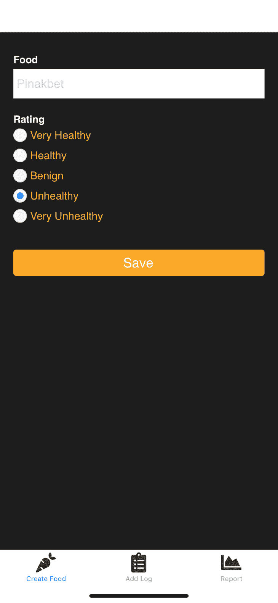

### 记录食物屏幕

该屏幕用于记录用户正在食用的食物。

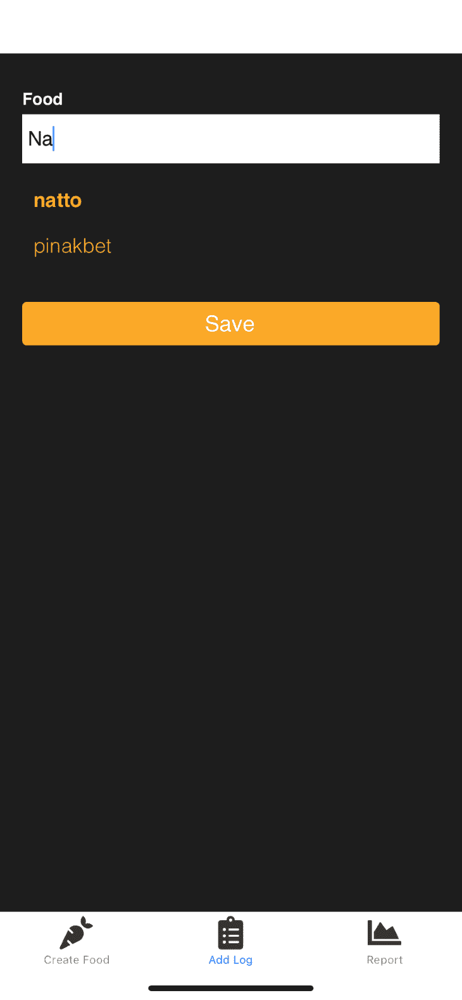

### 报告屏幕

最后，该屏幕用于显示用户在特定时间段内所吃食物的总体评级。

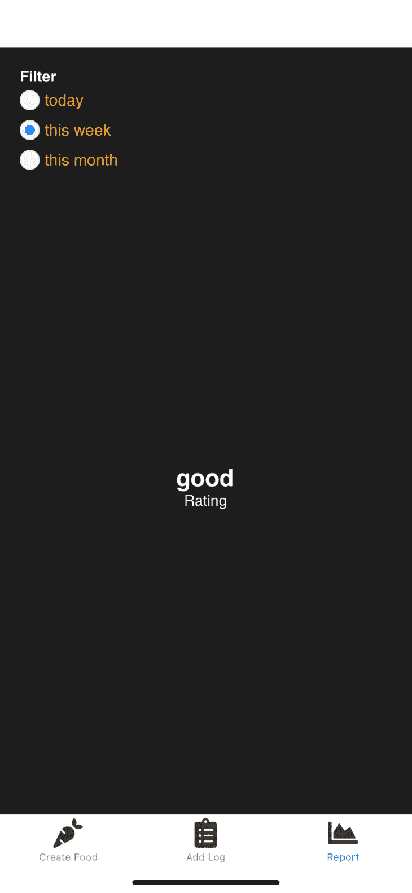

你可以在这个 [GitHub repo](https://github.com/anchetaWern/React-Native-Ignite-HealthTracker) 上找到该应用的完整源代码。

## 构建应用程序

现在是时候开始构建应用程序了。首先，创建添加新食物的屏幕:

```
npx ignite-cli generate screen create-food

```

这将生成`app/screens/create-food/create-food-screen.tsx`文件。使用 Ignite 的生成器生成的所有新屏幕都将在`app/screens`目录中创建一个新文件夹。它还会自动将其添加到`app/screens/index.ts`文件中。

### 发电机

这就是生成器的强大之处:它们让您的生活变得简单，因为您不再需要手动创建您想要创建的文件。它们也已经带有一些默认代码；这使得从一开始就遵循特定的标准变得容易。

但是对于 Ignite 来说，只有一个标准，那就是 Infinite Red 的标准。如果您想创建自己的标准，Ignite 还提供了一种方法来创建自己的生成器，或者至少定制 Ignite 已经有的生成器。但是我们不会在本教程中讨论这个问题。你可以通过[查看文档](https://github.com/infinitered/ignite/blob/master/docs/Generators.md#making-your-own-generators)来了解。

### 航行

Ignite 使用 [React 导航](https://reactnavigation.org/)实现导航。它允许我们根据用户当前导航到的位置显示不同的屏幕。如果你之前看过欢迎屏幕，这个屏幕使用了一个[堆栈导航器](https://reactnavigation.org/docs/stack-navigator/)。您可以在`app/navigators/app-navigator.tsx`文件中找到代码。下面是该文件的一个片段:

```
// app/navigators/app-navigator.tsx

import { createNativeStackNavigator } from "@react-navigation/native-stack"
import { WelcomeScreen, DemoScreen, DemoListScreen } from "../screens"

export type NavigatorParamList = {
  welcome: undefined
  demo: undefined
  demoList: undefined
  // 🔥 Your screens go here
}

// Documentation: https://reactnavigation.org/docs/stack-navigator/
const Stack = createNativeStackNavigator<NavigatorParamList>()

const AppStack = () => {
  return (
    <Stack.Navigator
      screenOptions={{
        headerShown: false,
      }}
      initialRouteName="welcome"
    >
      <Stack.Screen name="welcome" component={WelcomeScreen} />
      <Stack.Screen name="demo" component={DemoScreen} />
      <Stack.Screen name="demoList" component={DemoListScreen} />
      {/** 🔥 Your screens go here */}
    </Stack.Navigator>
  )
}

```

如果你以前使用过 React 导航，这应该很容易理解。如果没有，那么您可以查看以前就该主题编写的一些教程:

因此，为了显示我们新创建的屏幕，我们需要首先导入它:

```
import { CreateFoodScreen } from "../screens"

```

然后把它加在`NavigatorParamList`上:

```
export type NavigatorParamList = {
  CreateFoodScreen: undefined
}

```

最后，我们将它添加到 stack navigator 下，并将其设置为初始屏幕:

```
const AppStack = () => {
  return (
    <Stack.Navigator
      screenOptions={{
        headerShown: false,
      }}
      initialRouteName="createfood"
    >
      <Stack.Screen name="createfood" component={CreateFoodScreen} />
    </Stack.Navigator>
  )
}

```

这将显示创建食物屏幕。继续创建其余的屏幕:

```
npx ignite-cli generate screen food-logger
npx ignite-cli generate screen report

```

### 底部选项卡导航器

我们实际上不会使用堆栈导航器。我们将使用[底部选项卡导航器](https://reactnavigation.org/docs/bottom-tab-navigator/)来代替。

更新`app/navigators/app-navigator.tsx`文件以包含并使用所有屏幕:

```
// app/navigators/app-navigator.tsx
import Icon from "react-native-vector-icons/FontAwesome5"

import { CreateFoodScreen, FoodLoggerScreen, ReportScreen } from "../screens"

export type NavigatorParamList = {
  createFood: undefined
  foodLogger: undefined
  report: undefined
}

const Tab = createBottomTabNavigator<NavigatorParamList>()

const AppStack = () => {
  return (
    <Tab.Navigator
      screenOptions={{
        headerShown: false,
      }}
      initialRouteName="createFood"
    >
      <Tab.Screen
        name="createFood"
        component={CreateFoodScreen}
        options={{
          tabBarIcon: () => <Icon name="carrot" size={30} color="#333" />,
          title: "Create Food",
        }}
      />

      <Tab.Screen
        name="foodLogger"
        component={FoodLoggerScreen}
        options={{
          tabBarIcon: () => <Icon name="clipboard-list" size={30} color="#333" />,
          title: "Add Log",
        }}
      />

      <Tab.Screen
        name="report"
        component={ReportScreen}
        options={{
          tabBarIcon: () => <Icon name="chart-area" size={30} color="#333" />,
          title: "Report",
        }}
      />
    </Tab.Navigator>
  )
}

```

完成后，您应该会看到所有可以使用底部选项卡导航的屏幕:

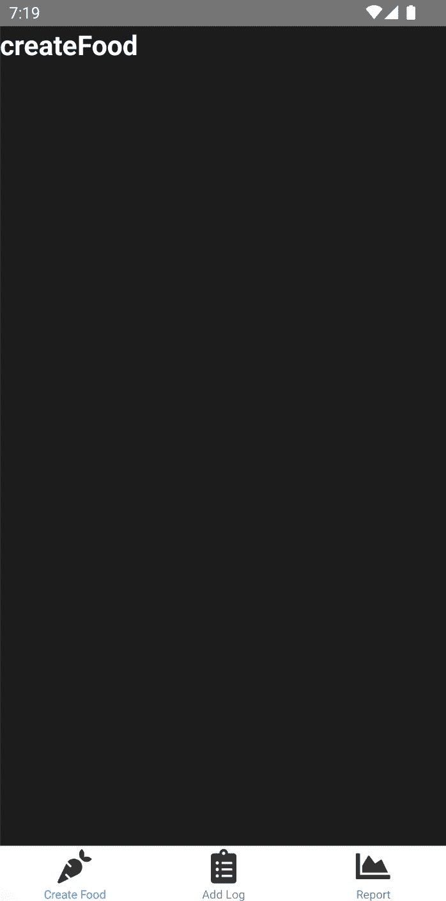

### 成分

在添加屏幕功能之前，我们先来看看如何使用 Ignite 创建新组件。Ignite 已经提供了一些组件，可以用来构建应用程序的 UI。它们的设计考虑到了灵活性和可定制性，因此您应该能够轻松应用自己的定制设计系统。

您可以使用生成器创建新零部件:

```
npx ignite-cli generate component Radio

```

这将在`app/components`目录下创建一个新文件夹。文件夹中有两个文件:一个用于组件本身，另一个用于故事书测试。让我们首先添加实际组件的代码:

```
// app/components/radio/radio.tsx
import * as React from "react"
import { TextStyle, View, ViewStyle, TouchableOpacity } from "react-native"
import { observer } from "mobx-react-lite"
import { color, typography } from "../../theme"
import { Text } from "../text/text"
import { RadioProps } from "./radio.props"

const CONTAINER: ViewStyle = {
  flexDirection: "row",
  alignItems: "center",
  marginRight: 45,
  marginBottom: 10,
}

const ICON: ViewStyle = {
  height: 10,
  width: 10,
  borderRadius: 7,
  backgroundColor: "#187DE6",
}

const TEXT: TextStyle = {
  fontFamily: typography.primary,
  fontSize: 16,
  color: color.primary,
  marginLeft: 5,
}

const BODY: ViewStyle = {
  height: 20,
  width: 20,
  backgroundColor: "#F8F8F8",
  borderRadius: 10,
  borderWidth: 1,
  borderColor: "#E6E6E6",
  alignItems: "center",
  justifyContent: "center",
}

/**
 * Describe your component here
 */
export const Radio = observer(function Radio(props: RadioProps) {
  const { style, item, selected, setSelected } = props
  const styles = Object.assign({}, CONTAINER, style)

  return (
    <View style={styles}>
      <TouchableOpacity
        onPress={() => {
          setSelected(item.value)
        }}
        style={BODY}
      >
        {selected ? <View style={ICON} /> : null}
      </TouchableOpacity>
      <TouchableOpacity
        onPress={() => {
          setSelected(item.value)
        }}
      >
        <Text style={TEXT}>{item.title}</Text>
      </TouchableOpacity>
    </View>
  )
})

```

prop 类型与代码的其余部分是分开的。这是关于你可以作为道具传入什么值(以及它们的类型)的文档。这也是 Ignite 默认使用 TypeScript 的原因之一。由于类型被大量使用，它在代码库中不会像二等公民一样:

```
// app/components/radio/radio.props.ts
import React from "react"
import { StyleProp, ViewStyle } from "react-native"

export interface RadioProps {
  /**
   * An optional style override useful for padding & margin.
   */
  style?: StyleProp<ViewStyle>

  item?: Object

  selected?: boolean

  setSelected: Function
}

```

### 设计系统

Ignite 让定制应用程序的外观变得非常容易。与更改`app/theme`文件夹中的应用主题相关的所有内容。以下是这些文件的简要概述:

*   `palette.ts` —您可以在此添加应用程序的调色板
*   `color.ts` —为颜色赋予更多的描述性角色(例如，主要、错误、警告)
*   `spacing.ts` —用于指定空白尺寸
*   `timing.ts` —用于动画计时
*   `typography.ts` —用于改变字体样式

您也可以使用自定义字体。将自定义字体复制到`theme/fonts`文件夹中。

接下来，您需要将其复制到 Xcode 项目中。您可以使用 React 原生矢量图标使用的同一`Fonts`文件夹:


接下来，将其添加到`UIAppFonts`字段下的`ios/HealthTracker/Info.plist file`:

```
<key>UIAppFonts</key>
<array>

  <string>Zocial.ttf</string>
  <string>PassionsConflict-Regular.ttf</string>
</array>

```

最后，用字体的名称更新`app/theme/typography.ts`文件。这是区分大小写的，所以请确保使用该字体的文件名:

```
// app/theme/typography.ts
export const typography = {
  /**
   * The primary font.  Used in most places.
   */
  primary: Platform.select({
    ios: "PassionsConflict-Regular",
    android: "PassionsConflict-Regular",
  }),

```

完成后，自定义字体就可用了。请注意，这不会改变应用程序中使用的所有字体。如您所见，底部标签文本仍然使用默认字体。我让你自己去想:

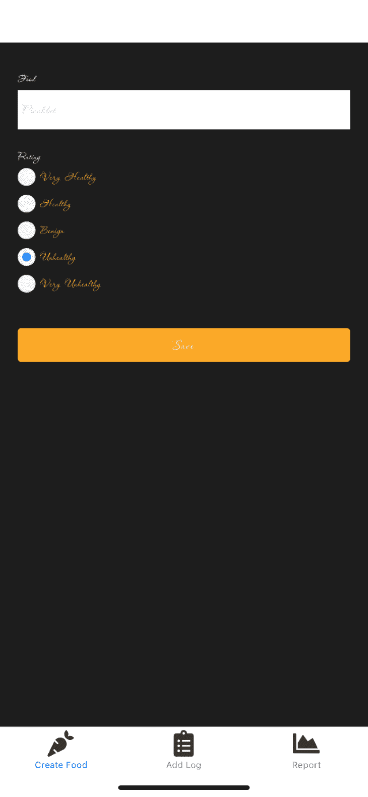

对于 Android，请参考您项目中的`assets/fonts/custom-fonts.md`文件，了解如何在 Android 中使用自定义字体。

### 故事书

使用 Ignite 的一个主要优点是，它使得在项目中采用最佳实践变得非常容易。

这些最佳实践之一是隔离组件开发和测试。这项工作的最佳工具是故事书。通过简单地使用组件生成器，您已经可以免费获得它了。因此，您所要做的就是更新代码，为组件添加每个可能的用例:

```
// app/components/radio/radio.story.tsx

import * as React from "react"
import { storiesOf } from "@storybook/react-native"
import { StoryScreen, Story, UseCase } from "../../../storybook/views"

import { Radio } from "./radio"

declare let module

storiesOf("Radio", module)
  .addDecorator((fn) => <StoryScreen>{fn()}</StoryScreen>)
  .add("States", () => (
    <Story>
      <UseCase text="Unselected" usage="When not yet selected.">
        <Radio
          item={{ title: "title", value: "value" }}
          setSelected={false}
          setSelected={() => {
            console.log("selected radio")
          }}
        />
      </UseCase>

      <UseCase text="Selected" usage="When selected.">
        <Radio
          item={{ title: "title", value: "value" }}
          selected
          setSelected={() => {
            console.log("selected radio")
          }}
        />
      </UseCase>
    </Story>
  ))

```

如果你是故事书的新手，一定要浏览一下[故事书的 React Native 教程](https://storybook.js.org/tutorials/intro-to-storybook/react-native/en/get-started/)。

要查看 Storybook，请在项目的根目录下执行以下命令:

```
npm run storybook

```

这将打开一个新的浏览器窗口，但我们并不真的需要它，所以你可以关闭它。在模拟器上，按下 **Ctrl** + **M** (或 **Command** + **M** )查看应用程序中的组件。这显示了 React 本地开发菜单。点击**切换故事书**:

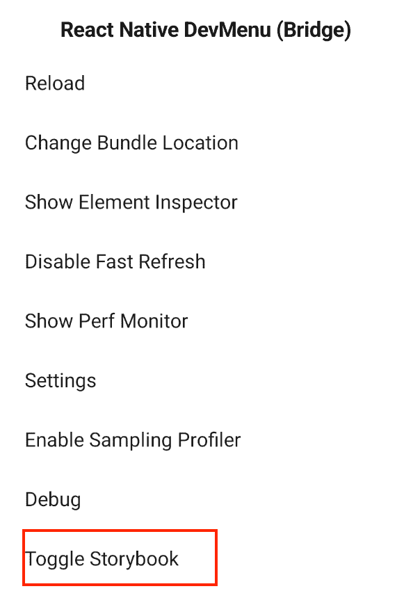

单击它将显示默认的文本组件。点击左下角的**导航器**，将会显示所有已经添加到故事书的组件。默认情况下，Ignite 的所有内置组件都已经列在这里了。您也可以使用过滤器来搜索特定组件:

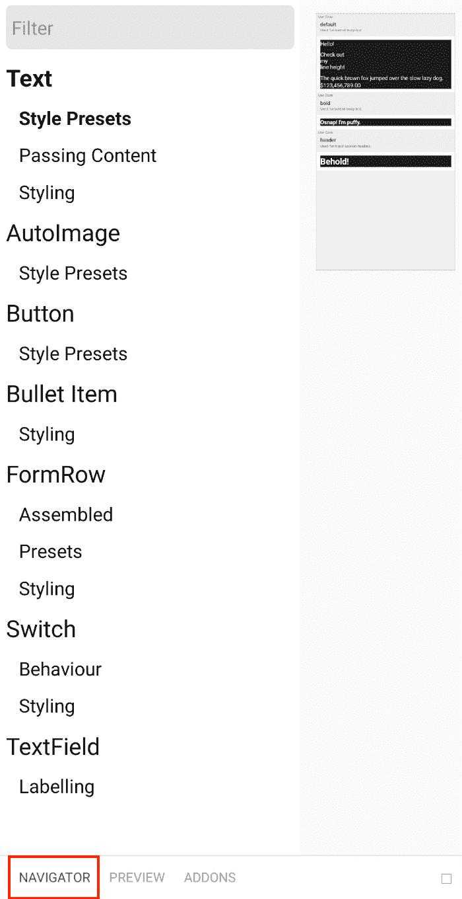

我们刚刚创建的 radio 组件不会在此列出。您需要首先将它添加到`storybook/storybook-registry.ts`文件中，因为当您生成一个新组件时，它不会自动添加到这里:

```
// storybook/storybook-registry.ts
require("../app/components/header/header.story")

// add this
require("../app/components/radio/radio.story")

```

完成后，您应该会看到无线电组件:

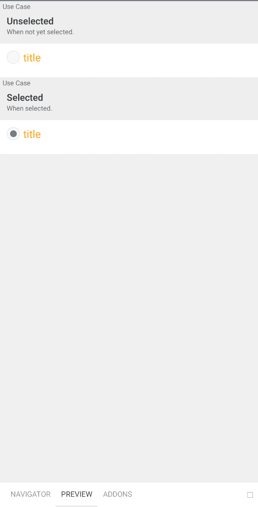

### 创建食物屏幕

现在让我们回到创建食物屏幕:

```
// app/screens/create-food/create-food-screen.tsx

import React, { FC, useState, useEffect } from "react"
import { observer } from "mobx-react-lite"
import { ViewStyle } from "react-native"
import { StackScreenProps } from "@react-navigation/stack"

var randomId = require("random-id")

import { NavigatorParamList } from "../../navigators"
import { Screen, Text, TextField, Button, Radio, Spacer } from "../../components"

import { color } from "../../theme"

import { FoodStoreModel } from "../../models/food-store/food-store"

import { food_ratings } from "../../config/app"

import { useStores } from "../../models"

const ROOT_STYLE: ViewStyle = {
  backgroundColor: color.palette.black,
  flex: 1,
  padding: 20,
}

export const CreateFoodScreen: FC<StackScreenProps<NavigatorParamList, "createFood">> = observer(
  ({ navigation }) => {
    const [food, setFood] = useState("")
    const [rating, setRating] = useState(2)

    const [saveButtonText, setSaveButtonText] = useState("Save")

    const { foodStore } = useStores()

    const resetForm = () => {
      setFood("")
      setRating(2)
    }

    const saveFood = () => {
      foodStore.saveFood({
        id: randomId(10),
        name: food,
        rating,
      })

      resetForm()

      setSaveButtonText("Saved!")

      setTimeout(() => {
        setSaveButtonText("Save")
      }, 1800)
    }

    return (
      <Screen style={ROOT_STYLE} preset="scroll">
        <TextField
          onChangeText={(value) => setFood(value)}
          inputStyle={{ color: color.palette.black }}
          value={food}
          label="Food"
          placeholder="Pinakbet"
          testID="food"
        />

        <Spacer size={10} />

        <Text preset="bold" text="Rating" />
        {food_ratings.map((item, index) => {
          const selected = item.rating === rating
          return (
            <Radio
              item={{ title: item.title, value: item.rating }}
              key={index}
              selected={selected}
              setSelected={setRating}
            />
          )
        })}

        <Spacer size={30} />

        <Button text={saveButtonText} preset="large" onPress={saveFood} />
      </Screen>
    )
    // },
  },
)

```

从上面的代码中，您可以看到它遵循 React Native 中屏幕代码的常见模式:顶部导入，然后是样式，最后是屏幕主体。只要你在所有的屏幕代码中应用相同的模式，任何事情都会发生。

请使用 [GitHub repo](https://github.com/anchetaWern/React-Native-Ignite-HealthTracker) 作为上述代码使用的所有代码的参考，因为我们不会在本教程中遍历所有代码。

### MobX 状态树库

在创建食物屏幕的代码中，我们使用了`FoodStoreModel`作为数据存储。实现这一点的底层库是 [MobX-state-tree](https://mobx-state-tree.js.org/intro/welcome) 。

如果你已经使用过 [MobX](https://mobx.js.org/README.html) ，这两者之间的主要区别在于 MobX-state-tree 提供了一个结构，否则将是一个普通的 MobX。MobX-state-tree 允许您轻松实现应用程序数据的集中存储，拍摄快照，并从快照恢复应用程序状态。

仍然在`app/screens/create-food/create-food-screen.tsx`文件中，这里是我们如何使用 MobX-state-tree 的。首先，您需要导入商店模型:

```
import { FoodStoreModel } from "../../models/food-store/food-store"

```

接下来，导入`useStores`上下文。这允许您访问添加到根存储的所有存储:

```
import { useStores } from "../../models"

```

然后，您可以使用它来访问`foodStore`:

```
const { foodStore } = useStores()

```

这允许您调用存储中的任何方法。这包括保存食物的方法:

```
foodStore.saveFood({
  id: randomId(10),
  name: food,
  rating,
})

```

您可以通过执行以下命令在 Ignite 中生成模型:

```
npx ignite-cli generate model <name of model>

```

在本例中，我们希望生成食品商店模型:

```
npx ignite-cli generate model food-store

```

这将在`app/models`目录下创建一个名为`food-store`的新文件夹。文件夹中有两个文件:`food-store.ts`是模型本身的文件，`food-store.test.ts`是模型的 Jest 测试。在本教程的后面部分，我们将看看如何使用 Jest 来测试模型。

在模型中，您需要声明以下内容:

*   道具—该模型的字段。在这种情况下，我们只有一个数组`foods`。我们可以通过使用另一个模型(`FoodModel`)来指定各个字段的数据类型
*   视图—允许您返回、过滤或排序存储的数据。所有视图都可以像模型中的属性一样被访问
*   操作—这些是在存储中操作数据的方法。在这种情况下，我们只想向它推送新数据

以下是食品店模型的代码:

```
// app/models/food-store/food-store.ts
import { Instance, SnapshotIn, SnapshotOut, types } from "mobx-state-tree"

import { FoodModel, FoodSnapshotIn } from "../food/food"
/**
 * Model description here for TypeScript hints.
 */

export const FoodStoreModel = types
  .model("FoodStore")
  .props({
    foods: types.optional(types.array(FoodModel), []),
  })
  .views((self) => ({
    get allFoods() {
      return self.foods
    },
  })) // eslint-disable-line @typescript-eslint/no-unused-vars
  .actions((self) => ({
    saveFood: (foodSnapshot: FoodSnapshotIn) => {
      self.foods.push(foodSnapshot)
    },
  })) // eslint-disable-line @typescript-eslint/no-unused-vars

export interface FoodStore extends Instance<typeof FoodStoreModel> {}
export interface FoodStoreSnapshotOut extends SnapshotOut<typeof FoodStoreModel> {}
export interface FoodStoreSnapshotIn extends SnapshotIn<typeof FoodStoreModel> {}
export const createFoodStoreDefaultModel = () => types.optional(FoodStoreModel, {})

```

接下来，生成食物模型:

```
npx ignite-cli generate model food

```

这是食物模型的代码。这允许您指定需要传递给食品商店模型的每个对象的形状:

```
// app/models/food/food.ts
import { Instance, SnapshotIn, SnapshotOut, types } from "mobx-state-tree"

/**
 * Model description here for TypeScript hints.
 */

export const FoodModel = types
  .model("Food")
  .props({
    id: types.identifier,
    name: types.string,
    rating: types.integer,
  })
  .views((self) => ({})) // eslint-disable-line @typescript-eslint/no-unused-vars
  .actions((self) => ({})) // eslint-disable-line @typescript-eslint/no-unused-vars

export interface Food extends Instance<typeof FoodModel> {}
export interface FoodSnapshotOut extends SnapshotOut<typeof FoodModel> {}
export interface FoodSnapshotIn extends SnapshotIn<typeof FoodModel> {}
export const createFoodDefaultModel = () => types.optional(FoodModel, {})

```

最后一步是将食物存储包含在根存储中。如果您想要全局访问您创建的每个商店，您需要对它们执行此操作:

```
// app/models/root-store/root-store.ts

// ...
import { FoodStoreModel } from "../../models/food-store/food-store" // add this

export const RootStoreModel = types.model("RootStore").props({
  // ...
  // add this
  foodStore: types.optional(FoodStoreModel, {} as any),

})

```

### 用 Jest 测试模型

Jest 是一个 JavaScript 测试框架。默认情况下，每次生成新模型时，Ignite 都会生成一个测试。我们之前已经创建了食品店模型，所以它应该在`app/models/food-store/food-store.test.ts`生成了相应的测试文件。添加以下代码来验证保存新食物的 API 是否有效。我们可以分三步实施测试:

1.  创建食品店模型的新实例
2.  调用`saveFood()`方法
3.  使用 Jest 比较由`allFoods`视图返回的值和我们期望的硬编码值

代码如下:

```
// app/models/food-store/food-store.test.ts

import { FoodStoreModel } from "./food-store"

test("can be created", () => {
  const instance = FoodStoreModel.create()

  instance.saveFood({
    id: "somerandomid123",
    name: "fried chicken",
    rating: 2,
  })

  expect(instance.allFoods).toStrictEqual([
    {
      id: "somerandomid123",
      name: "fried chicken",
      rating: 2,
    },
  ])
})

```

要运行所有测试:

```
npm run test

```

这将返回以下内容:

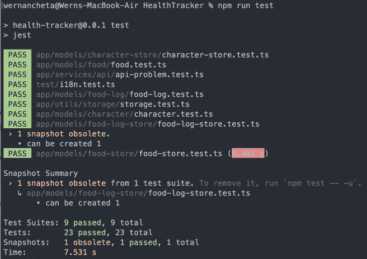

如果您想要运行一个特定的测试(例如，只运行食品商店中的测试)，您可以使用文件的名称来实现:

```
npm run test -t 'food-store'

```

### 食物记录器屏幕

回到屏幕，我们需要实现的下一个是食物记录器屏幕:

```
npx ignite-cli generate screen food-logger

```

该屏幕允许用户搜索和选择通过创建食物屏幕添加的食物。保存后，它会设置食物的详细信息和日期。日期是至关重要的一部分，因为它是用于稍后在报告屏幕中对数据进行排序的。以下是食物记录器屏幕的代码:

```
// app/screens/food-logger/food-logger-screen.tsx

import React, { FC, useState } from "react"
import { observer } from "mobx-react-lite"
import { ViewStyle } from "react-native"
import { StackScreenProps } from "@react-navigation/stack"

var randomId = require("random-id")

import { NavigatorParamList } from "../../navigators"
import { Screen, Text, TextField, SelectableText, Button, Spacer } from "../../components"

import { color } from "../../theme"

import { useStores } from "../../models"

const ROOT_STYLE: ViewStyle = {
  backgroundColor: color.palette.black,
  flex: 1,
  padding: 20,
}

export const FoodLoggerScreen: FC<StackScreenProps<NavigatorParamList, "foodLogger">> = observer(
  function FoodLoggerScreen() {
    const { foodStore, foodLogStore } = useStores()

    const [food, setFood] = useState("")
    const [selectedFood, setSelectedFood] = useState(null)

    const filteredFoods = food
      ? foodStore.allFoods.filter((item) => {
          return item.name.toLowerCase().includes(food.toLowerCase())
        })
      : []

    const hasNoFoods = foodStore.allFoods.length === 0
    const hasFoodsButNotFiltered = foodStore.allFoods.length > 0 && filteredFoods.length === 0

    const resetForm = () => {
      setFood("")
      setSelectedFood(null)
    }

    const saveLog = () => {
      const selected_food_data = foodStore.allFoods.find((item) => item.id === selectedFood)

      foodLogStore.saveLog({
        id: randomId(10),
        food_id: selectedFood,
        rating: selected_food_data.rating,
        date: new Date(),
      })

      resetForm()
    }

    return (
      <Screen style={ROOT_STYLE} preset="scroll">
        <TextField
          onChangeText={(value) => setFood(value)}
          inputStyle={{ color: color.palette.black }}
          value={food}
          label="Food"
          placeholder="Pinakbet"
        />

        {hasNoFoods && <Text text="Create some foods first.." />}

        {hasFoodsButNotFiltered && <Text text="Type something.." />}

        {filteredFoods.map((item) => {
          const isSelected = item.id === selectedFood
          return (
            <SelectableText
              text={item.name}
              key={item.id}
              id={item.id}
              setSelected={setSelectedFood}
              isSelected={isSelected}
            />
          )
        })}

        <Spacer size={30} />

        <Button text="Save" preset="large" onPress={saveLog} />
      </Screen>
    )
  },
)

```

您可以在 repo 中查看`SelectableText`组件、食物日志存储和食物日志模型的代码。

### 报告屏幕

最后，我们看到了报告屏幕:

```
npx ignite-cli generate screen report

```

这允许用户从过滤所基于的一组时间范围列表中进行选择。在 [date-fns](https://date-fns.org/) 库的帮助下，实现变得更加容易。从那里开始，我们所做的就是使用`reduce`并求平均值来找出结果属于哪个等级:

```
import React, { FC, useState, useEffect } from "react"
import { observer } from "mobx-react-lite"
import { ViewStyle, View } from "react-native"
import { StackScreenProps } from "@react-navigation/stack"

import { isToday, isThisWeek, isThisMonth } from "date-fns"

import { NavigatorParamList } from "../../navigators"
import { Screen, Text, Radio } from "../../components"

import { isWhatPercentOf } from "../../utils/numbers"

import { color, spacing } from "../../theme"

import { time_ranges, health_ratings } from "../../config/app"

import { useStores } from "../../models"

const ROOT_STYLE: ViewStyle = {
  backgroundColor: color.palette.black,
  flex: 1,
  padding: spacing.large,
}

const RATING_CONTAINER_STYLE: ViewStyle = {
  flex: 1,
  justifyContent: "center",
  alignItems: "center",
}

export const ReportScreen: FC<StackScreenProps<NavigatorParamList, "report">> = observer(
  function ReportScreen({ navigation }) {
    const { foodLogStore } = useStores()

    const [timeRange, setTimeRange] = useState("today")
    const [rating, setRating] = useState("---")

    const getRating = (timeRange) => {
      const filteredLog = foodLogStore.allLogs.filter((item) => {
        const currentDateTime = item.date

        if (timeRange === "today") {
          return isToday(currentDateTime)
        } else if (timeRange === "this week") {
          return isThisWeek(currentDateTime)
        } else if (timeRange === "this month") {
          return isThisMonth(currentDateTime)
        }
        return false
      })

      const ratings = filteredLog.map((item) => {
        return item.rating
      })

      const reduced = ratings.reduce((a, b) => a + b, 0)

      const avg = reduced / ratings.length
      const max_avg = (5 * ratings.length) / ratings.length

      const percent = isWhatPercentOf(avg, max_avg)

      const found = health_ratings.find((item) => {
        return percent >= item.range[0] && percent <= item.range[1]
      })

      if (found) {
        setRating(found.title)
      }
    }

    useEffect(() => {
      const unsubscribe = navigation.addListener("focus", () => {
        getRating(timeRange)
      })

      // Return the function to unsubscribe from the event so it gets removed on unmount
      return unsubscribe
    }, [navigation, timeRange])

    useEffect(() => {
      getRating(timeRange)
    }, [timeRange])

    return (
      <Screen style={ROOT_STYLE} preset="scroll">
        <View>
          <Text preset="bold" text="Filter" />
          {time_ranges.map((item, index) => {
            const selected = item == timeRange
            return (
              <Radio
                item={{ title: item, value: item }}
                key={index}
                selected={selected}
                setSelected={setTimeRange}
              />
            )
          })}
        </View>

        <View style={RATING_CONTAINER_STYLE}>
          <Text preset="header" text={rating} />
          <Text text="Rating" />
        </View>
      </Screen>
    )
  },
)

```

你知道该怎么做:检查所有丢失代码的回购。

### 用 Reactotron 调试

使用`console.log()`来调试所有的东西没有错，但是为了更快的反馈循环，我推荐 [Reactotron](https://github.com/infinitered/reactotron) 来调试你的 React 原生应用。如果您还没有安装它，请继续安装。

为了让 Reactotron 检测到应用程序，Reactotron 必须在应用程序之前首先启动。因此，如果您已经有一个正在运行的应用程序实例，请停止它，启动 Reactotron，然后再次启动应用程序。

Reactotron 看起来是这样的:

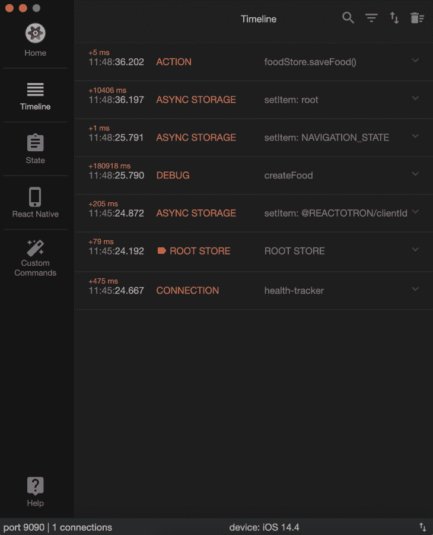

大多数时候，你只会触及**时间线**和**状态**。从上面的截图可以看出，它已经默认记录了异步存储、导航和 MobX-state-tree 存储。

想要类似`console.log()`的东西，还是可以的:

```
import Reactotron from "reactotron-react-native"

Reactotron.log('something')

```

还可以监控店铺。这里我添加了`foodStore.foods`用于监控，所以每次我保存一个新的食物，它都会被添加到这个数组中:

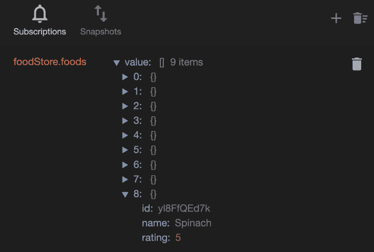

这就是如何使用 Reactotron 的快速教程。如果你想了解更多，请务必查看 Reactotron 文档。

### 利用 Detox 进行端到端测试

[Detox](https://wix.github.io/Detox/) 是 React 原生应用的端到端测试自动化框架。

Ignite 只负责在项目本身内部设置排毒。你仍然需要在你的机器中设置排毒依赖来让它工作。我们不会在本教程中详细介绍排毒，所以一定要看看下面的指南，以便做好准备。

跳过在您的项目中设置 Detox 的说明，因为在您使用 Ignite 生成新项目时，Ignite 已经被考虑到了:

设置好机器后，打开项目目录根目录下的`package.json`文件，并更新`detox.configurations.ios.sim.debug.build`属性:

```
"xcodebuild -workspace ios/HealthTracker.xcworkspace -scheme HealthTracker -sdk iphonesimulator -derivedDataPath ios/build"

```

您还需要将设备`name`和`os`更新为您机器上安装的东西。您可以通过执行以下命令列出所有可用的模拟器:

```
xcrun simctl list devices available

```

这将返回如下内容:

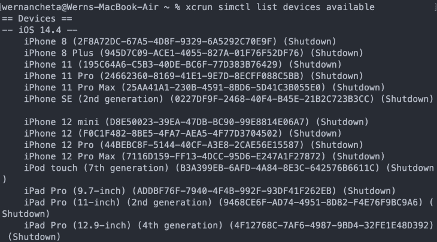

因此，如果你想使用 iPhone 11 进行测试，你的排毒配置应该是这样的:

```
"detox": {
    "test-runner": "jest",
    "configurations": {
      "ios.sim.debug": {
        "binaryPath": "ios/build/Build/Products/Debug-iphonesimulator/HealthTracker.app",
        "build": "xcodebuild -workspace ios/HealthTracker.xcworkspace -scheme HealthTracker -sdk iphonesimulator -derivedDataPath ios/build",
        "type": "ios.simulator",
        "device": {
          "name": "iPhone 11",
          "os": "iOS 14.4"
        }
      },
    }
  },

```

接下来，您可以添加测试。我们将只为 create food 屏幕添加测试:

```
// e2e/firstTest.spec.js

const { reloadApp } = require("./reload")

describe("Example", () => {
  beforeEach(async () => {
    await reloadApp()
  })

  it("should save the food", async () => {
    // check if the food input field is displayed on the screen
    await expect(element(by.text("Food"))).toBeVisible()

    // type "Fries" in the text field for entering the name of the food
    await element(by.id("food")).typeText("Fries")

    // verify if "Fries" has indeed been typed in to the text field
    await expect(element(by.text("Fries"))).toExist()

    // tap on the rating for "Very Healthy"
    await element(by.text("Very Healthy")).tap()

    // tap the save button
    await element(by.text("Save")).tap()

    // check if the text of the save button has changed to "Saved!"
    // indicating that the code for saving has indeed been called
    await expect(element(by.text("Saved!"))).toBeVisible()

    // check if the form has been reset
    await expect(element(by.text("Fries"))).toNotExist()
  })
})

```

接下来，您需要构建应用程序:

```
npm run build:e2e

```

如果您检查`package.json`文件，这将简单地调用`detox build -c ios.sim.debug`命令。

一旦完成了应用程序的构建，您现在就可以运行测试了:

```
npm run test:e2e

```

它看起来是这样的:

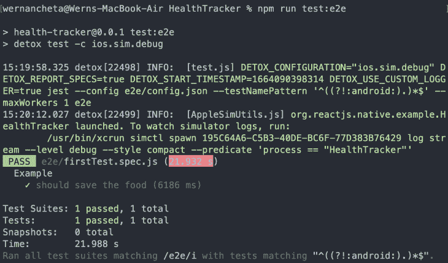

我们只讲述了如何在 iOS 模拟器上设置和运行 Detox。如果你想在 Android 上运行你的测试，一定要查看 Android 上运行排毒的官方指南。

## 结论

此时，您应该有信心在自己的 React 原生项目中使用 Ignite。如您所见，Ignite 使得遵循 React 本地应用开发的最佳实践变得非常容易。它节省了大量的时间，尤其是在创建新项目时，因为你不再需要从头开始设置一切。

Ignite 附带了一个关于应该如何做事情的意见，但它为您提供了全面定制应用外观和感觉以及如何编写代码所需的所有工具。

## [LogRocket](https://lp.logrocket.com/blg/react-native-signup) :即时重现 React 原生应用中的问题。

[](https://lp.logrocket.com/blg/react-native-signup)

[LogRocket](https://lp.logrocket.com/blg/react-native-signup) 是一款 React 原生监控解决方案，可帮助您即时重现问题、确定 bug 的优先级并了解 React 原生应用的性能。

LogRocket 还可以向你展示用户是如何与你的应用程序互动的，从而帮助你提高转化率和产品使用率。LogRocket 的产品分析功能揭示了用户不完成特定流程或不采用新功能的原因。

开始主动监控您的 React 原生应用— [免费试用 LogRocket】。](https://lp.logrocket.com/blg/react-native-signup)