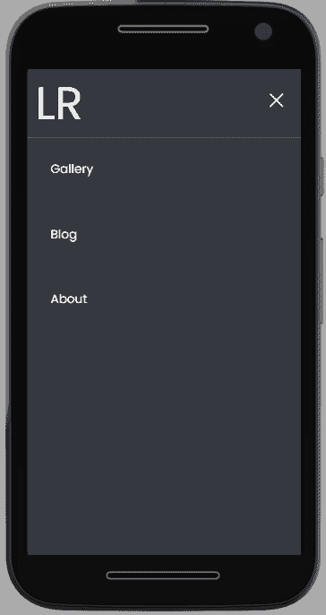
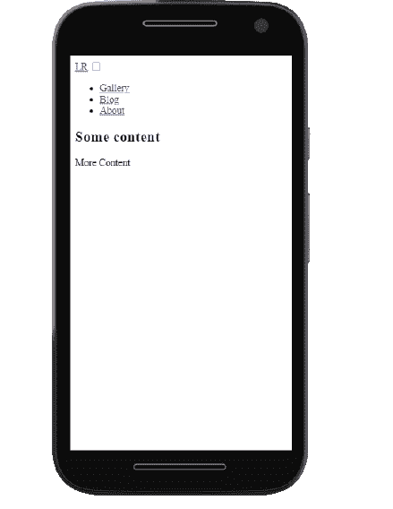
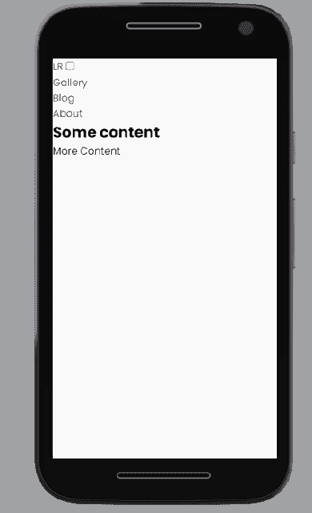
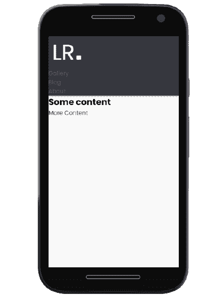
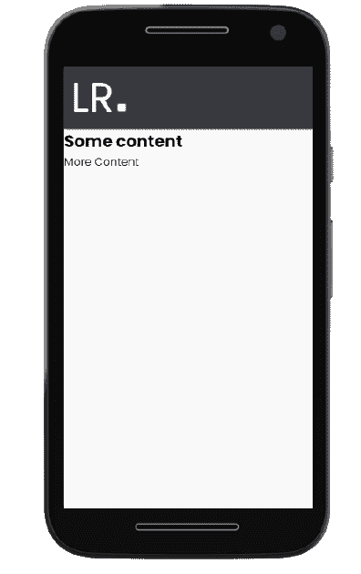
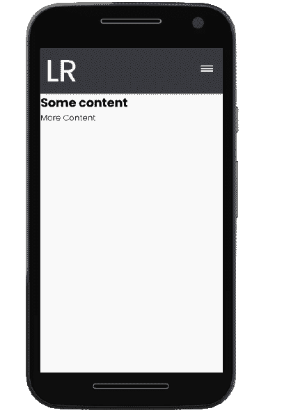

# 用 CSS 创建一个响应式移动菜单

> 原文：<https://blog.logrocket.com/create-responsive-mobile-menu-with-css-no-javascript/>

清晰、简洁、直观的导航菜单对于优化网站用户体验至关重要。菜单的响应能力也是一个关键因素。在撰写本文时，[全球近 59%的网络流量来自手机](https://www.statista.com/statistics/277125/share-of-website-traffic-coming-from-mobile-devices/)。

凭借移动优先的响应式设计，开发人员从最小的屏幕尺寸开始，然后逐步扩大，为更大的屏幕尺寸添加更多特性和功能。生成的网页将自动调整到用户浏览器窗口的大小。

然而，正如响应菜单对于网站的 UX 一样重要，没有必要用 JavaScript 来构建它。本教程将回顾如何只用 HTML 和 CSS 创建一个移动优先的响应菜单。

向前跳:

有许多技术可以用来构建响应式移动菜单。一种常见的做法是使用没有一行 JavaScript 的纯 CSS。这种技术包括使用一个简单的 HTML 列表结构来开发一个链接菜单，可以根据设备的屏幕大小对其进行不同的样式和呈现。

在本教程中，我们将使用 CSS 为移动设备、平板电脑和桌面设备构建以下响应式菜单:

Mobile view.

Tablet view.

Desktop view.

对于较小的屏幕，用户必须点击一个汉堡包图标来显示菜单项。较大的屏幕将在导航栏中显示内嵌的菜单项。

在本教程中，我们将建立一个响应菜单，包括一个汉堡图标，完全来自纯 HTML 和 CSS。我们的最终结果将是这样的:



Mobile view, with hamburger icon opened to reveal the menu items.

我们来试试吧！

## 入门指南

使用您喜欢的文本编辑器，比如 VS 代码，在一个公共文件夹中创建两个文件:

*   `index.html`对于 HTML 代码
*   `style.css`对于 CSS 代码

复制`index.html`文件路径，粘贴到浏览器中预览 app。

## 添加 HTML

将以下代码添加到`index.html`文件中:

```
<html lang="en">
<head>
    <meta charset="UTF-8">
    <meta http-equiv="X-UA-Compatible" content="IE=edge">
    <meta name="viewport" content="width=device-width, initial-scale=1.0">
    <!-- App title -->
    <title>Responsive Pure CSS Menu</title>
    <!-- Link CSS file -->
    <link rel="stylesheet" href="style.css">
</head>
<body>
    <!-- Navigation bar -->
    <header class="header">
        <!-- Logo -->
        <a href="#" class="logo">LR</a>
        <!-- Hamburger icon -->
        <input class="side-menu" type="checkbox" id="side-menu"/>
        <label class="hamb" for="side-menu"><span class="hamb-line"></span></label>
        <!-- Menu -->
        <nav class="nav">
            <ul class="menu">
                <li><a href="#">Gallery</a></li>
                <li><a href="#">Blog</a> </li>
                <li><a href="#">About</a></li>
            </ul>
        </nav>
    </header>
    <!-- Main content -->
    <main>
        <article>
            <h1>
                Some content
            </h1>
            <p>
                More Content
            </p>
        </article>
    </main>
</body>
</html>

```

这段代码包含了网页的结构和内容。它还包括对 CSS 样式表的引用。

我们使用`header`和`main`语义标签来分离导航栏和页面的主要内容。

我们使用`<a>`锚标签添加一个标志。

最后，我们使用`checkbox` hack 创建了一个汉堡菜单。使用这种策略，我们可以根据复选框是否被选中来设计菜单的样式。

我们使用一个`label`标签来定义汉堡菜单图标。标签`input`用于根据复选框的状态有条件地显示菜单(类别`side-menu`)。

然后，我们将菜单项作为链接列表元素`<li>`添加到无序列表`ul`中。标签`nav`作为列表容器。

以下是只有 HTML 的输出:



## 添加 CSS

现在，我们将使用 CSS 来设计不同的 UI 组件和功能:

### 设计内容和背景的样式

我们将把下面的代码添加到`style.css`文件中，以调整 HTML 内容的外观:

```
/* Theming */
@import url("https://fonts.googleapis.com/css2?family=Poppins:[email protected];700&display=swap"); /* import font */

:root{
    --white: #f9f9f9;
    --black: #36383F;
    --gray: #85888C;
} /* variables*/

/* Reset */
*{
    margin: 0;
    padding: 0;
    box-sizing: border-box;
}
body{
    background-color: var(--white);
    font-family: "Poppins", sans-serif;
}
a{
    text-decoration: none;
}
ul{
    list-style: none;
}

```

这段代码导入 Poppins Google 字体供应用程序使用。

我们为应用程序中使用的颜色定义 CSS 变量。然后，我们使用 CSS reset 删除浏览器对`margin`、`padding`、`box-sizing`、`text-decoration`、`list-style`的默认设置。

我们还为页面内容指定了一个白色的`background-color`和弹出按钮`font-family`。

下面是输出，显示了样式化的内容和背景:



### 设计页眉和徽标的样式

下面的代码将黑色的`background-color`和灰色的`box-shadow`添加到标题中。为了让标题在滚动时保持在屏幕的顶部，我们指定了一个粘性的`position`和一个相对于`top`的零偏移量。我们还调整割台，使其延伸到设备的整个`width`:

```
/* Header */
.header{
    background-color: var(--black);
    box-shadow: 1px 1px 5px 0px var(--gray);
    position: sticky;
    top: 0;
    width: 100%;
}
/* Logo */
.logo{
    display: inline-block;
    color: var(--white);
    font-size: 60px;
    margin-left: 10px;
}

```

我们通过指定`color`、`font-size`和`left-margin`来设计徽标的样式。不要与填充混淆，`[[margin]](https://blog.logrocket.com/css-margin-vs-padding/)`[是标识周围的区域，将它与其他元素](https://blog.logrocket.com/css-margin-vs-padding/)分开。

下面是输出，显示了样式化的标题和徽标:



在下面的代码中，我们为`nav`元素指定 100%的`width`和`height`属性，以使内容适合屏幕。然后，我们指定一个固定的`position`将导航菜单覆盖在主应用程序内容的顶部。我们还为`nav`元素选择了一个黑色的`background-color`，并指定来自`nav`元素的任何`overflow`内容都应该被隐藏。

对于菜单链接元素，我们指定了一个`block`格式显示，添加了`padding`和`color`，并在悬停时将`background-color`从白色变为灰色。

最后，我们使用 CSS `[[transition]](https://blog.logrocket.com/css-transitions-animating-hamburger-menu-button/)` [属性](https://blog.logrocket.com/css-transitions-animating-hamburger-menu-button/)和一个为零的`max-height`来默认隐藏`nav`元素，但是当点击菜单图标时显示它:

```
/* Nav menu */
.nav{
    width: 100%;
    height: 100%;
    position: fixed;
    background-color: var(--black);
    overflow: hidden;

}
.menu a{
    display: block;
    padding: 30px;
    color: var(--white);
}
.menu a:hover{
    background-color: var(--gray);
}
.nav{
    max-height: 0;
    transition: max-height .5s ease-out;
}

```

以下是显示样式化导航菜单的输出:



在下面的代码中，我们指定当用户与汉堡菜单交互时应该显示一个指针`cursor`。我们将`label`元素放在右边，并添加一些填充。

接下来，我们设计`span`元素的样式来创建三个菜单图标行。

我们使用 [CSS 伪元素`[::before]`和`span`元素上的`[::after]`](https://blog.logrocket.com/a-guide-to-css-pseudo-elements/) 来定义三个汉堡图标行。

`.hamb-line`选择器定义中心线或第二条线。`.hamb-line::before`和`.hamb-line::after`分别将第一条线和第三条线`5px`定位在中心线的上方和下方。

最后，我们使用`.side-menu`上的`display`属性来隐藏复选框:

```
/* Menu Icon */
.hamb{
    cursor: pointer;
    float: right;
    padding: 40px 20px;
}/* Style label tag */

.hamb-line {
    background: var(--white);
    display: block;
    height: 2px;
    position: relative;
    width: 24px;

} /* Style span tag */

.hamb-line::before,
.hamb-line::after{
    background: var(--white);
    content: '';
    display: block;
    height: 100%;
    position: absolute;
    transition: all .2s ease-out;
    width: 100%;
}
.hamb-line::before{
    top: 5px;
}
.hamb-line::after{
    top: -5px;
}

.side-menu {
    display: none;
} /* Hide checkbox */

```

以下是输出，显示了风格化的汉堡菜单:



在下面的代码中，我们设计了汉堡菜单图标的样式，以改变它被选中时的外观。首先，当复选框被选中时，我们指定`nav`元素的`max-height`(类`.side-menu:checked`)。

然后，我们遵循一个两步过程来创建一个“x”形的关闭图标，以指示复选框已被选中。首先，我们通过将汉堡图标的`background`设置为`transparent`来隐藏它的第二行。然后，我们将第一条线和第三条线分别旋转-45 度和 45 度，形成一个“x”形:

```
/* Toggle menu icon */
.side-menu:checked ~ nav{
    max-height: 100%;
}
.side-menu:checked ~ .hamb .hamb-line {
    background: transparent;
}
.side-menu:checked ~ .hamb .hamb-line::before {
    transform: rotate(-45deg);
    top:0;
}
.side-menu:checked ~ .hamb .hamb-line::after {
    transform: rotate(45deg);
    top:0;
}

```

以下是显示切换菜单的输出:

### 增加响应能力

我们可以通过使用媒体查询来有条件地包含 CSS 属性，从而使应用程序具有响应性。换句话说，只有当条件集有效时，媒体查询中的属性才会应用于网页。

```
/* Responsiveness */
@media (min-width: 768px) {
    .nav{
        max-height: none;
        top: 0;
        position: relative;
        float: right;
        width: fit-content;
        background-color: transparent;
    }
    .menu li{
        float: left;
    }
    .menu a:hover{
        background-color: transparent;
        color: var(--gray);

    }

    .hamb{
        display: none;
    }
}

```

在这段代码中，我们添加了一个设备条件设置为 768px `min-width`的`@media`规则。我们希望最小宽度的设备能够看到完整的导航菜单，而不是汉堡包菜单。

我们通过将`nav`元素的`max-height`属性设置为`none`来移除它。

我们将`nav`元素放置在屏幕的右上角，并将其宽度指定为`fit-content`。

我们在`nav`的左边`float`了菜单列表项。我们指定悬停时背景颜色为透明，菜单列表项为灰色。

最后，我们使用`display`属性隐藏汉堡包菜单图标。

这是风格完整的应用程序:


该视频展示了该应用的响应用户界面:

CSS position 属性可用于在网页上定位导航菜单。top、right、bottom 和 left 属性可用于在页面上定位元素。

在固定定位的情况下，尽管滚动，导航菜单将保持在相同的位置。这可能会导致导航栏与网页上的某些内容重叠。页面内容将调整以适合左边的空白:

Initial fixed position

Fixed position after scroll

相对定位相对于页面放置元素。但是，页面上的其他内容不会调整以适应左边的空白:

Initial relative position

Relative position after scroll

另一方面，粘性定位将导航条设置为与其他内容一起滚动，直到到达指定的偏移量。页面内容不会调整以适应左边的空白，而是在定位的导航栏下滚动:

Initial sticky position

Sticky position after scroll

如下所示更新`.header`元素的样式，将`position`属性从`fixed`更改为`relative`再更改为`sticky`，并注意行为是如何变化的:

```
.header{
    background-color: var(--black);
    box-shadow: 1px 1px 5px 0px var(--grey);
    position: sticky;
    top: 100px;
    width: 100%;
}

```

您可以将菜单项嵌套在其他菜单项中。这减少了导航条占用的空间，并使你的链接有条理，使用户更容易浏览你的网站。

要添加子菜单，请更新`index.html`文件以包含额外的`li`元素，如下所示。`fa fa-caret-down`图标可以通过[给你的 HTML 文件添加一个](https://blog.logrocket.com/7-popular-icon-libraries-you-can-use-for-free/) `[font-awesome](https://blog.logrocket.com/7-popular-icon-libraries-you-can-use-for-free/)` [脚本标签](https://blog.logrocket.com/7-popular-icon-libraries-you-can-use-for-free/)来获得:

```
....   
<link rel="stylesheet" href="https://cdnjs.cloudflare.com/ajax/libs/font-awesome/4.7.0/css/font-awesome.min.css">

...
<li class="subnav">
  <p class="subnavbtn">Contact <i class="fa fa-caret-down"></i></p>
  <div class="subnav-content">
      <a href="#">Email</a>
      <a href="#">Twitter</a>
      <a href="#">Phone</a>
  </div>
</li>
...

```

然后，您可以更新样式表，在鼠标悬停时隐藏和显示子菜单，如下所示:

```
...
/* Sub nav */
.subnav-content {
    background-color:  var(--white);
    width: 100%;
    z-index: 1;
    padding: 20px 0 ;
    display: none;
  }
.subnav-content a {
    color: var(--black);
    text-decoration: none;
    padding: 0;
    margin: 10px 0;
    text-align: center;
}
.subnav:hover .subnav-content {
    display: block;
}
....
@media (min-width: 768px) {
   ....
    /* Sub nav */
    .subnav-content {
        padding: 20px 0 ;
        display: none;
        background-color:  var(--black);
    }
    .subnav-content a {
        color: white;
    }
}

```

该视频演示了应用程序的子菜单:

## 水平与垂直移动导航条

基于偏好，移动导航菜单可以水平或垂直显示。对于水平导航，导航链接放在页面主要内容的前面。相比之下，使用垂直导航，链接是沿着页面的边排列的。垂直导航菜单通常用汉堡按钮打开和关闭。

### 水平移动导航栏的利与弊

水平移动导航条是更受欢迎的选择，因为它用在大多数网站上。对说英语的人来说，从左到右的顺序感觉更自然。此外，这种布局鼓励导航菜单上更简洁的导航链接描述。

但是，这种布局为添加链接提供了有限的空间。因此，添加顶级链接很有挑战性，而下拉菜单可能会与网页内容重叠。

### 垂直移动导航栏的利与弊

与水平移动导航栏布局相比，垂直移动导航栏为附加链接提供了更多空间。因此，导航链接的名称可以更长，添加新链接也更简单。

然而，这种灵活性会阻碍导航菜单上有组织的和简洁的导航链接。此外，由于这种布局不太常见和直观，用户在使用导航时可能会遇到一些困难。

与子菜单延伸到下方的水平导航条相比，用户可能还会发现很难访问延伸到侧面的子菜单。

比较以下垂直和水平移动导航条示例:

## 结论

在本教程中，我们仅使用 HTML 和 CSS 设计并构建了一个移动优先的响应式菜单，没有使用 JavaScript。本文中使用的完整代码是在 GitHub 的特定分支上可以获得的[。](https://github.com/Ivy-Walobwa/responsive-pure-css-menu)

本文中使用的技术只是构建响应式移动菜单的众多方法之一。通过尝试不同的方法，你可以决定你更喜欢哪一种。编码快乐！

## 你的前端是否占用了用户的 CPU？

随着 web 前端变得越来越复杂，资源贪婪的特性对浏览器的要求越来越高。如果您对监控和跟踪生产环境中所有用户的客户端 CPU 使用、内存使用等感兴趣，

[try LogRocket](https://lp.logrocket.com/blg/css-signup)

.

[](https://lp.logrocket.com/blg/css-signup)[https://logrocket.com/signup/](https://lp.logrocket.com/blg/css-signup)

LogRocket 就像是网络和移动应用的 DVR，记录你的网络应用或网站上发生的一切。您可以汇总和报告关键的前端性能指标，重放用户会话和应用程序状态，记录网络请求，并自动显示所有错误，而不是猜测问题发生的原因。

现代化您调试 web 和移动应用的方式— [开始免费监控](https://lp.logrocket.com/blg/css-signup)。