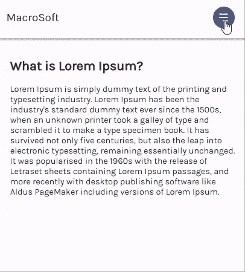
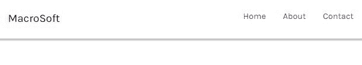
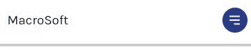
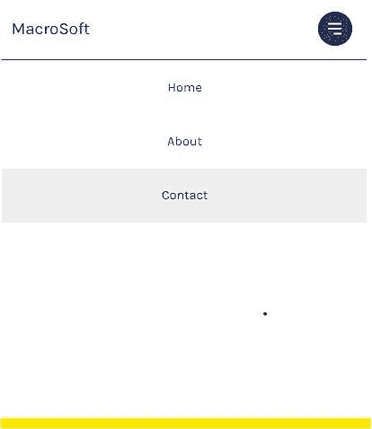

# 用 React 和 CSS 创建一个响应式导航条

> 原文：<https://blog.logrocket.com/create-responsive-navbar-react-css/>

为最终用户设计响应性导航菜单从来都不是一件容易的事情。前端开发人员必须考虑某些参数，如设备断点和可访问性，以创建愉快的导航体验。在 React 这样的前端框架中，这可能会变得更具挑战性，因为 CSS-in-JS 往往会变得棘手。

在这篇文章中，你将学习如何用 CSS 和 React 钩子创建一个响应式导航条。你可以修改源代码并在这里查看实时项目。



## 先决条件

要跟随本教程，您需要:

*   对 React 和 React 挂钩的基本理解
*   一些 CSS 知识——特别是 Flexbox

现在，让我们建立一个新的 React 应用程序！

## 创建项目

要在 CodeSandbox 中引导一个新的 React 项目，打开一个新的浏览器选项卡并键入`react.new`。这将创建一个 starter React 应用程序:

```

// App.js
import "./styles.css";
export default function App() {
  return (
    <div className="App">
      <h1>Hello CodeSandbox</h1>
      <h2>Start editing to see some magic happen!</h2>
    </div>
  );
}

```

目前，应用程序的默认样式表位于根位置，在`styles.css`中。让我们编辑这个文件，给页面布局一个我们自己的感觉:

```
// styles.css
@import url("https://fonts.googleapis.com/css2?family=Karla:[email protected];400&display=swap");

* {
  box-sizing: border-box;
  margin: 0;
  padding: 0;
}

body {
  font-family: "Karla", -apple-system, BlinkMacSystemFont, "Segoe UI", "Roboto",
    "Oxygen", "Ubuntu", "Cantarell", "Fira Sans", "Droid Sans", "Helvetica Neue",
    sans-serif;
  -webkit-font-smoothing: antialiased;
  -moz-osx-font-smoothing: grayscale;
}

.container {
  max-width: 90%;
  margin-right: auto;
  margin-left: auto;
  padding: 1rem;
}

article h1 {
  margin: 1rem 0;
}

```

上面的规则将 Karla 设置为文档的主要字体，并包含一个用于填充和对齐页面内容的`container`类。

完成后，让我们在`App.js`中编写一些标记来显示内容:

```

// App.js
import Navbar from "./components/Navbar";
import "./styles.css";

function App() {
  return (
    <div>
      <Navbar />
      <div className="container">
        <article>
          <h1>What is Lorem Ipsum? </h1>
          Lorem Ipsum is simply dummy text of the printing and typesetting industry...
        </article>
      </div>
    </div>
  );
}

export default App;

```

注意第二行的`Navbar`组件导入。我已经通过 CodeSandbox 的侧栏在下面的文件路径中创建了`Navbar.js`文件:`src/components/Navbar.js`。

到目前为止，这个文件的内容是组件的默认导出语句，允许您将其导入到`App.js`:

```

// Navbar.js 
export default function Navbar() {
  return (
    <nav>Navigation</nav>
    )
}

```

## 了解导航布局

我们的目标是创建一个响应式导航条，它最初以水平布局显示导航菜单— `ul`元素。到达移动视窗时，菜单重新定位在导航条下，并跨越屏幕的剩余高度和宽度。

这种布局将通过合并 Flexbox 和 CSS 定位规则来实现。

将后续代码块中的标记写入`Navbar.js`:

```

// Navbar.js
export default function Navbar() {
  return (
    <nav className="navigation">
      <a href="/" className="brand-name">
        MacroSoft
      </a>
      <button className="hamburger">
        {/* icon from heroicons.com */}
        <svg

          className="h-5 w-5"
          viewBox="0 0 20 20"
          fill="white"
        >
          <path
            fillRule="evenodd"
            d="M3 5a1 1 0 011-1h12a1 1 0 110 2H4a1 1 0 01-1-1zM3 10a1 1 0 011-1h12a1 1 0 110 2H4a1 1 0 01-1-1zM9 15a1 1 0 011-1h6a1 1 0 110 2h-6a1 1 0 01-1-1z"
            clipRule="evenodd"
          />
        </svg>
      </button>
      <div
        className="navigation-menu">
        <ul>
          <li>
            <a href="/home">Home</a>
          </li>
          <li>
            <a href="/about">About</a>
          </li>
          <li>
            <a href="/contact">Contact</a>
          </li>
        </ul>
      </div>
    </nav>
  );
}

```

上面的标记包括`brand-name`、`hamburger`图标和`navigation-menu`，这是我们 navbar 的三个元素。

现在让我们开始设计这个组件的样式。

## 样式化导航栏组件

在下面的文件路径中为 navbar 组件创建样式表:`src/styles/navbar.css`

并导入到`Navbar.js`:

```

// Navbar.js
import "../styles/navbar.css"
export default function Navbar() {
  return(
    {/* navbar markup */}
  )
}

```

我们将从`navigation`类开始:

```
// navbar.css
.navigation {
  height: 60px;
  width: 100%;
  display: flex;
  align-items: center;
  position: relative;
  padding: 0.5rem 0rem;
  background-color: #fff;
  color: black;
  box-shadow: 0 2px 2px 2px rgba(9, 9, 9, 0.23);
}

```

在这里，我们将导航条的`width`设置为`100%`,这样它就覆盖了设备的整个宽度。通过使这个元素成为一个 flex 容器并给它分配一个特定的`height`属性，Flexbox 允许我们使用`align-items`属性来垂直居中 flex 项目。

此外，在这个元素上将`position`设置为`relative`可以确保任何子元素的`position`值都是相对于它来确定的。你马上就会看到这个效果。

让我们来设计`brand-name`和`navigation-menu`:

```
// navbar.css
.brand-name {
  text-decoration: none;
  color: black;
  font-size: 1.3rem;
  margin-left: 1rem;
}
.navigation-menu {
  margin-left: auto;
}

```

上面代码块中的主要规则是应用于`navigation-menu`的`margin-left: auto`规则。这通过占据菜单左边的可用空间将菜单推到最右边。

现在我们可以设计`navigation-menu`的子元素了:

```
// navbar.css
.navigation-menu ul {
  display: flex;
  padding: 0;
}
.navigation-menu li {
  // removes default disc bullet for li tags and applies margin to left & right side
  list-style-type: none;
  margin: 0 1rem;
}
.navigation-menu li a {
  // increases the surface area of the anchor tag to span more than just the anchor text
  text-decoration: none;
  display: block;
  width: 100%;
}

```

`ul`元素上的`display: flex`将它变成一个 flex 容器。然后，子`li`元素被排列在`row`中，这是`flex-direction`属性的默认值。其他规则用于使导航链接看起来更好。



让我们继续用`hamburger`类来设计菜单图标的样式:

```
// navbar.css
.hamburger {
  // removes default border on button element
  border: 0;
  height: 40px;
  width: 40px;
  padding: 0.5rem;
  border-radius: 50%;
  background-color: #283b8b;
  cursor: pointer;
  transition: background-color 0.2s ease-in-out;
// positions the icon to the right and center aligns it vertically
  position: absolute;
  top: 50%;
  right: 25px;
  transform: translateY(-50%);
  display: none;
}
.hamburger:hover {
  background-color: #2642af;
}

```

这里，我们使用 CSS 定位将菜单图标定位在导航栏的右侧。

记住父元素`nav`的位置被设置为`relative`。因此，当图标的`position`属性设置为`absolute`时，我们可以使用`top`和`transform`属性将图标沿着父元素的边界垂直居中。如果你想知道 CSS 定位是如何工作的，请阅读更多关于 CSS 定位的内容。

因为我们希望菜单图标在到达移动视窗之前保持隐藏，所以让我们将它的`display`属性设置为`none`，并继续使用 CSS 媒体查询来设置移动布局的样式。

媒体查询是一项 CSS 功能，可让您指定内容布局如何响应不同的条件，例如视窗宽度的变化。

使用`@media`规则编写查询，后跟目标媒体类型和应用样式的断点:

```
@media screen and (max-width: 768px) {
  // rules go here
}

```

此处，`max-width: 768px`确保仅当设备宽度在`768px`或更低时才实施样式。

现在让我们显示汉堡图标:

```
// navbar.css
@media screen and (max-width: 768px) {
  .hamburger {
    display: block;
  }
}

```

并隐藏`navigation-menu`中的`ul`元素:

```
// navbar.css
@media screen and (max-width: 768px) {
  .navigation-menu ul {
    display: none;
  }
}

```

到目前为止，您的手机布局应该是这样的:



通常，导航栏有两种可能的视图:展开的和隐藏的。通过让不同的类控制这两个 navbar 视图，您可以在您的应用程序中实现这一点。

我们将从设计菜单的扩展版本开始。随后，您将看到如何使用钩子在这两个视图之间切换:

```
// navbar.css
@media screen and (max-width: 768px) {
  .navigation-menu ul {
    // navigation menu is positioned to start 60px from the top of the document (which is directly below the navbar)
    position: absolute;
    top: 60px;
    left: 0;
    // stacks the li tags vertically 
    flex-direction: column;
   // makes menu span full height and width
    width: 100%;
    height: calc(100vh - 77px);
    background-color: white;
    border-top: 1px solid black;
  }
  .navigation-menu li {
    // centers link text and strips off margin
    text-align: center;
    margin: 0;
  }
  .navigation-menu li a {
    color: black;
    // increases the surface area of the anchor tag to span the full width of the menu
    width: 100%;
    padding: 1.5rem 0;
  }
  .navigation-menu li:hover {
    background-color: #eee;
  }
}

```

上图中，我们将导航栏`60px`放置在文档顶部——导航栏的正下方。为了确定这个元素的高度，我使用了 CSS `calc`函数，我将解释为什么。

理想情况下，我们希望菜单通过使用视口高度单位`vh`跨越文档的整个高度。但是因为视口单元考虑了页面上的所有元素，所以`60px` navbar 增加了页面的整体高度，导致导航菜单从屏幕底部获取额外的视口单元，从而产生垂直滚动条。

`calc`函数通过允许我们在指定 CSS 属性值时执行计算来帮助我们解决这个问题。因此，从`100vh`中减去`60px`得到导航菜单的准确高度。

前面的样式应该会产生下面的布局(黄色区域表示文档的结尾):



然而，因为我们希望另一个类控制导航菜单的显示，我们将把它的`display`设置为`none`:

```
// navbar.css
@media screen and (max-width: 768px) {
  .navigation-menu ul {
    /* previous styles */
    dipslay: none;
  }
}

```

并创建一个附加到`navigation-menu`的`expanded`类，将`display`属性设置回`block`:

```
// navbar.css
@media screen and (max-width: 768px) {
  .navigation-menu.expanded ul {
    display: block;
  }
}

```

在这个阶段，您只能通过手动编辑`Navbar.js`中的标记以包含`expanded`类来观察 navbar 的两种状态。

除非您的用户是 devtools 专家，否则您不会想在这一点上停止开发。让我们使用 React 的`useState`钩子，使用菜单图标在不同的导航栏视图之间切换。

## 用`useState`切换导航栏视图

为了监控导航菜单的当前状态，我们将状态引入到`Navbar`组件中。

创建一个`isNavExpanded`状态，并给它一个初始值`false`，如下所示:

```

// Navbar.js
import { useState } from "react;
import "../styles/navbar.css";
export default function Navbar(){
  const [isNavExpanded, setIsNavExpanded] = useState(false)

  return (
    <nav className="navigation">
      <a href="/" className="brand-name">
        MacroSoft
      </a>
      <button className="hamburger" >
        {/* hamburger svg code... */}
      </button>
      {/* nav menu code... */}
    </nav>
  )
}

```

现在让我们使用`button`元素上的`onClick`事件处理程序来切换`isNavExpanded`状态:

```
// Navbar.js
import { useState } from "react;
import "../styles/navbar.css";
export default function Navbar(){
  const [isNavExpanded, setIsNavExpanded] = useState(false)

  return (
    <nav className="navigation">
      <a href="/" className="brand-name">
        MacroSoft
      </a>
      <button
        className="hamburger"
        onClick={() => {
          setIsNavExpanded(!isNavExpanded);
        }}
      >
        {/* hamburger svg code... */}
      </button>
      {/* nav menu code... */}
    </nav>
  )
}

```

这里，我们在`onClick`事件处理程序中调用了一个匿名箭头函数。该函数使用更新函数`setIsNavExpanded`来反转`isNavExpanded`状态的当前值。

这意味着无论何时点击图标，`isNavExpanded`都会在`true`和`false`之间切换。

现在可以使用 JavaScript 三元运算符根据`isNavExpanded`的值有条件地为导航菜单选择合适的类名:

```
// Navbar.js
import { useState } from "react"
import "../styles/navbar.css"

export default function Navbar() {
  const [isNavExpanded, setIsNavExpanded] = useState(false)

  return (
    <nav className="navigation">
      <a href="/" className="brand-name">
        MacroSoft
      </a>
      <button
        className="hamburger"
        onClick={() => {
          setIsNavExpanded(!isNavExpanded)
        }}
      >
        {/* hamburger svg code... */}
      </button>
      <div
        className={
          isNavExpanded ? "navigation-menu expanded" : "navigation-menu"
        }
      >
        <ul>
          <li>
            <a href="/home">Home</a>
          </li>
          <li>
            <a href="/about">About</a>
          </li>
          <li>
            <a href="/contact">Contact</a>
          </li>
        </ul>
      </div>
    </nav>
  );
}

```

就这样结束了！现在你应该有一个功能齐全，反应灵敏的导航条。


## 结论

导航菜单在 web 应用程序的整体体验中扮演着重要的角色。当你的用户试图理解你的应用时，它通常是你接触的第一个组件。因此，让它尽可能地有组织和易于访问会对你有好处，因为它能提升用户体验，甚至 SEO 性能。

## [LogRocket](https://lp.logrocket.com/blg/react-signup-general) :全面了解您的生产 React 应用

调试 React 应用程序可能很困难，尤其是当用户遇到难以重现的问题时。如果您对监视和跟踪 Redux 状态、自动显示 JavaScript 错误以及跟踪缓慢的网络请求和组件加载时间感兴趣，

[try LogRocket](https://lp.logrocket.com/blg/react-signup-general)

.

[ ](https://lp.logrocket.com/blg/react-signup-general) [](https://lp.logrocket.com/blg/react-signup-general) 

LogRocket 结合了会话回放、产品分析和错误跟踪，使软件团队能够创建理想的 web 和移动产品体验。这对你来说意味着什么？

LogRocket 不是猜测错误发生的原因，也不是要求用户提供截图和日志转储，而是让您回放问题，就像它们发生在您自己的浏览器中一样，以快速了解哪里出错了。

不再有嘈杂的警报。智能错误跟踪允许您对问题进行分类，然后从中学习。获得有影响的用户问题的通知，而不是误报。警报越少，有用的信号越多。

LogRocket Redux 中间件包为您的用户会话增加了一层额外的可见性。LogRocket 记录 Redux 存储中的所有操作和状态。

现代化您调试 React 应用的方式— [开始免费监控](https://lp.logrocket.com/blg/react-signup-general)。