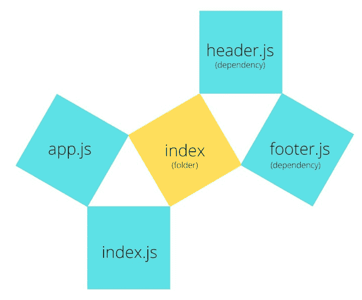
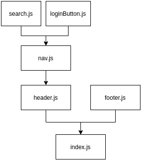
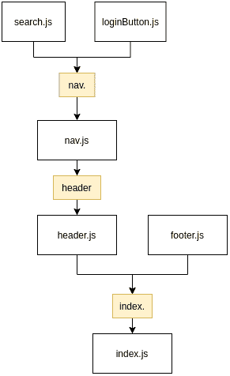
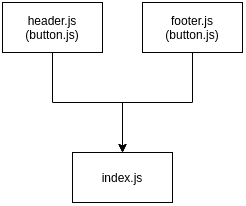
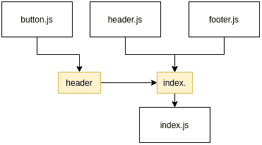

# 使用 Destiny 创建可伸缩的 JavaScript 和 TypeScript 文件结构

> 原文：<https://blog.logrocket.com/create-scalable-javascript-and-typescript-file-structures-with-destiny/>

我已经在我的个人项目中使用 JavaScript 和 TypeScript 很长时间了。我的一些更有趣的项目随着它们的发展，最终积累了无数的新文件。文件数量的增加变得如此笨拙，以至于我发现自己很难找到导出的函数。这听起来熟悉吗？

在本教程中，我们将向您展示如何使用[命运](https://github.com/benawad/destiny)根据[分形树](https://www.youtube.com/watch?v=0jjeOYMjmDU&vl=en)的概念重构您的 JavaScript 和 TypeScript 应用程序。

Destiny 是一个开源项目，可以在 [npm](https://www.youtube.com/watch?v=0jjeOYMjmDU&vl=en) 上获得，它扫描文件夹中的文件依赖关系，并将文件放置在分形结构中，它们“注定”在那里。

## 分形树概念

考虑一个正方形。现在在它上面放两个小方块，这样这三个方块在中间形成一个三角形。将同样的过程应用到两个更小的方块上(一次又一次，取决于文件的数量)，你就有了一棵分形树。

Destiny 采用同样的方法来构建文件。如果某个文件有依赖项，它将被移动到与该文件同名的文件夹中。它遵循的原则是，“重复这个单元，直到所有的依赖项都被构建好，一个接一个。”

## 分形文件结构的好处

分形允许您:

*   专注于你的代码，不要担心依赖关系
*   管理复杂的文件结构
*   更快扩展
*   避免手动重建项目的耗时任务

当多人处理一个项目时，有时很难在文件结构方面达成一致。通常，程序员会简单地搜索项目中的所有依赖项，以理解文件结构格式。Destiny 的目标是创建对文件结构的共同理解，这样开发团队可以更有效地合作。

下面是一个文件结构的分形表示。`index.js`是主文件，`header.js`和`footer.js`是该主文件的从属文件。理想情况下，依赖项放在一个名为`index`的文件夹中，这个文件夹与主文件名相同。



## 命运是如何运作的

Destiny 扫描选定的文件夹，并根据文件的依赖关系放置文件。它遵循下面概述的步骤来重新构建依赖关系。

1.  扫描选定的文件夹
2.  根据 JavaScript/TypeScript 文件的导入方式创建一个有向图
3.  基于[有向图](https://en.wikipedia.org/wiki/Directed_graph)创建一个分形图
4.  移动分形应用程序结构中的文件

为了更好地理解 Destiny 是如何工作的，我创建了一个项目，演示了使用 Destiny 前后的文件结构。

### 使用 Destiny 之前的结构

├──页脚. js

├── header.js

├──指数

├──登录按钮. js

ship . js(船. js)

search.js(搜索. js)

如您所见，这个文件结构是一个失败。如果不逐个检查所有这些文件，没有人可能理解项目中的依赖关系。

现在让我们看看我们项目的依赖图。



对于我们的`index.js`文件，在多级层次结构中有多个依赖项。`header.js`和`footer.js`是`index.js`的依赖，`header.js`也有自己的依赖。

现在让我们看看命运是如何改变文件结构的。

### 使用 Destiny 后的结构

使用 Destiny 创建了一个分形结构后，我们的项目将如下所示。黄色方框代表一个文件夹，其名称写在里面。



这就是文件应该如何以分形的方式构建。

现在让我们看看将 Destiny 应用到我们的项目后是什么样子。您可以简单地遍历文件结构，了解不同组件之间的关系和依赖关系。例如，索引文件夹包含页眉和页脚。此外，标题由包含登录按钮和搜索栏的 nav 组件组成。很简单，对吧？

├──指数

│ ├──页脚. js

─标头

──船舶

│ │ │ ├── loginButton.js

── search.js

── nav.js

─ header.js

index.js

## 从 CLI 使用 Destiny

在您的项目中安装和使用 Destiny 非常容易。如果您使用 npm，请编写以下命令来全局安装 Destiny。

```
npm i -g destiny

```

如果您使用 yarn，请使用以下命令。

```
yarn global add destiny

```

要在文件夹中使用 Destiny:

```
destiny &lt;path to source files>

# example

destiny ./src

```

如果您在 React 项目中使用 Destiny，安装 Destiny 并使用以下命令扫描您的`src`文件夹中的所有文件和文件夹。

```
npx destiny "src/**/*.*"

```

此命令尚未应用于该结构。为此，您需要一个`write`标志来应用更改。你可以使用`- w`或`--write`来应用文件结构的改变。

```
npx destiny -w "src/**/*.*"

```

## **共享依赖关系**

如果有某个文件是`header.js`和`footer.js`都需要的，而`index.js`不需要，该怎么办？

命运号很容易解决这个问题。在`index`文件夹下创建一个名为`shared`的新文件夹，生成`/index/shared`路径。这里，共享依赖项位于最高依赖文件的旁边。



在上图中，`header.js`和`footer.js`有一个名为`_button.js`的依赖项(放在方括号内)。这个`button.js`文件必须移动到索引文件夹下的一个新文件夹中。

使用 Destiny 后，文件结构应该是这样的:



如图所示，分形结构已经被命运号应用，文件也相应地被放置。

这就是我们的文件夹树现在的样子。下面是一个共享依赖项目的结构。

├──指数

│ ├──页脚. js

│ ├── header.js

│ └──分享

button . js

index.js

## 其他流行的文件结构

还有许多其他文件结构格式，包括:

*   模型-视图-控制器(MVC)
*   按功能组织
*   按类型组织

### MVC 模式

[MVC 模式](https://en.wikipedia.org/wiki/Model%E2%80%93view%E2%80%93controller)是构建应用程序的经典例子。用户通过控制器与视图交互并操纵模型中的数据。为了结束循环，模型用新数据更新视图，用户可以再次看到这些数据。这是 JavaScript、Python、PHP、Java 和 C#等流行编程语言中的一种流行模式。

### 按功能组织

本质上，当您按功能组织时，您是根据应用程序的功能区域来组织文件的。例如，所有与处理电子邮件相关的功能都放在一个`email`文件夹中。

您可以通过在更高级别的功能文件夹中分组更具体的功能来进一步扩展这种方法。例如，让我们假设你有一个发送和显示电子邮件的功能。您可以进一步将`email`文件夹分为`send`和`receive`文件夹。

### 按类型组织

当你按类型组织文件时，你会得到一个与 MVC 非常相似的方法。类型可以是服务、控制器、域或任何其他类型的文件，如数据库模型。然而，随着应用程序的增长，您可能会积累服务。因此，当按类型组织时，您将最终在类型文件夹中按特征组织，以保持文件结构的整洁。

## 结论

Destiny 是由开发人员 Ben Awad 创建的，用于管理 React 应用程序的文件结构。一开始，这个工具在被改成 Destiny 之前叫做 butter-CLI。

在大多数情况下，当开发人员开始一个项目时，项目是整洁的和结构良好的——所有的文件和文件夹都在它们正确的位置，并且依赖关系得到了适当的管理。但是久而久之，保持你的文件结构整洁需要付出更大的努力。您可以在组件之间移动功能，并创建许多共享文件夹。通常，您最终会发现文件及其共享依赖项的漩涡。

Destiny 旨在帮助您大规模地管理文件，并使文件结构易于为您项目中的其他开发人员所理解。截至本文撰写之时，Destiny 在 GitHub 上拥有超过 27000 名明星和 16 名贡献者，拥有坚实的追随者。

## [LogRocket](https://lp.logrocket.com/blg/typescript-signup) :全面了解您的网络和移动应用

[](https://lp.logrocket.com/blg/typescript-signup)

LogRocket 是一个前端应用程序监控解决方案，可以让您回放问题，就像问题发生在您自己的浏览器中一样。LogRocket 不需要猜测错误发生的原因，也不需要向用户询问截图和日志转储，而是让您重放会话以快速了解哪里出错了。它可以与任何应用程序完美配合，不管是什么框架，并且有插件可以记录来自 Redux、Vuex 和@ngrx/store 的额外上下文。

除了记录 Redux 操作和状态，LogRocket 还记录控制台日志、JavaScript 错误、堆栈跟踪、带有头+正文的网络请求/响应、浏览器元数据和自定义日志。它还使用 DOM 来记录页面上的 HTML 和 CSS，甚至为最复杂的单页面和移动应用程序重新创建像素级完美视频。

## 通过理解上下文，更容易地调试 JavaScript 错误

调试代码总是一项单调乏味的任务。但是你越了解自己的错误，就越容易改正。

LogRocket 让你以新的独特的方式理解这些错误。我们的前端监控解决方案跟踪用户与您的 JavaScript 前端的互动，让您能够准确找出导致错误的用户行为。

[](https://lp.logrocket.com/blg/javascript-signup)

LogRocket 记录控制台日志、页面加载时间、堆栈跟踪、慢速网络请求/响应(带有标题+正文)、浏览器元数据和自定义日志。理解您的 JavaScript 代码的影响从来没有这么简单过！

[Try it for free](https://lp.logrocket.com/blg/javascript-signup)

.

[Try it for free](https://lp.logrocket.com/blg/typescript-signup)

.