# 从头开始创建搜索栏

> 原文：<https://blog.logrocket.com/create-search-bar-react-from-scratch/>

搜索栏有助于筛选出需要的内容，并为用户找到他们想要的结果。

您可能会想，有几个 React 库可以帮助您在几秒钟内建立一个搜索组件——为什么要浪费时间写一堆行来创建已经存在的东西呢？

或者，您可能想知道为什么在您的项目中使用库来实现搜索栏并不总是最好的主意。这里有一些想法。

下面是 npm 上一个流行包的详细报告。

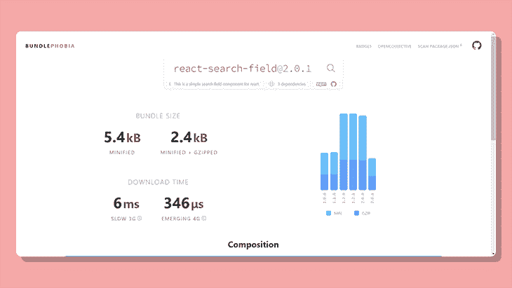

Source: [BundlePhobia](https://bundlephobia.com/package/react-search-field@2.0.1)

即使我们考虑库的缩小版本，它对于包含在一个项目中也是相当大的。我们下面的代码大约有 746 字节，比任何库都要少得多！

从头开始创建搜索栏的另一个优点是，它比库更具可定制性。无论你在一个项目中使用多少库，从状态管理到组件，基础知识对于一个开发者来说仍然是非常重要的。

在本教程中，我们将尝试复制一个搜索栏，跟踪输入字段中的任何变化，并过滤掉网站上的数据。更具体地说，我们将构建一个搜索栏，根据标题过滤博客文章。

以下是我们将在本文中涉及的内容:

1.  [设置启动文件](#setting-up-starting-files)
2.  [为搜索栏生成模拟数据](#generating-mock-data-search-bar)
3.  [显示模拟数据](#displaying-mock-data)
4.  [设计搜索栏的样式](#styling-search-bar)
5.  [使搜索栏起作用](#making-search-bar-functional)

## 设置启动文件

继续使用 [Create React App](https://blog.logrocket.com/tag/create-react-app) 初始化一个新的 React 项目。

```
npx create-react-app search-bar-tutorial

```

前往根文件，删除所有不必要的文件。

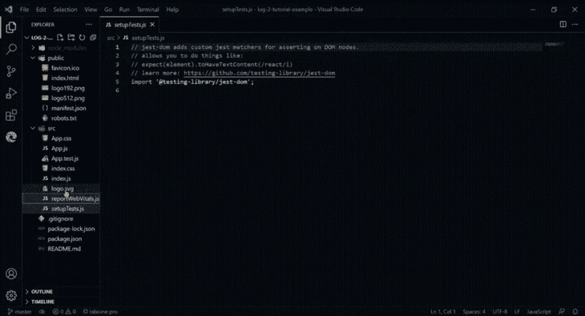

打开`App.js`文件，清除原始 JSX 元素。

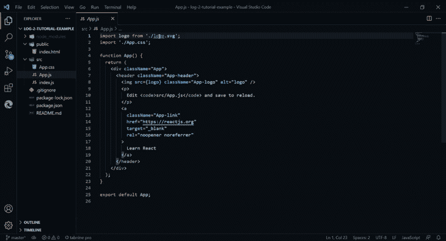

现在，为用户创建一个输入字段来输入查询。

```
export default function App (){
  return {
    <div>
      <input placeholder="Enter Post Title"/>
    </div>
 }
}

```

## 为搜索栏生成模拟数据

接下来，让我们为搜索栏创建一些模拟数据进行过滤。您既可以创建自己的模拟数据，也可以直接进入 [Mockaroo](https://www.mockaroo.com/) 并轻松生成一些模拟数据。

继续在模拟数据中输入您需要的字段。

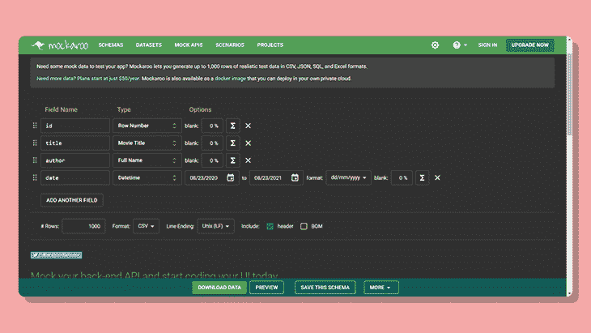

您创建的行数应该基本上与您在模拟数据中接收的对象数相同，所以如果您减少默认的`1000`的数量会更好。确保将文件类型设置为 JSON。

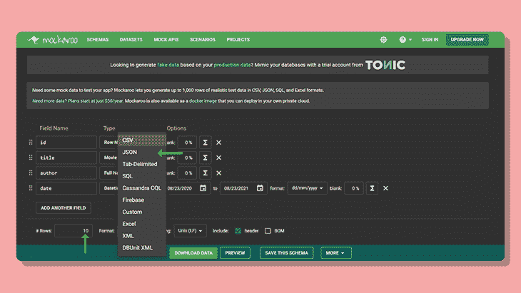

点击 **Preview** ，将所有模拟数据复制到代码编辑器中。

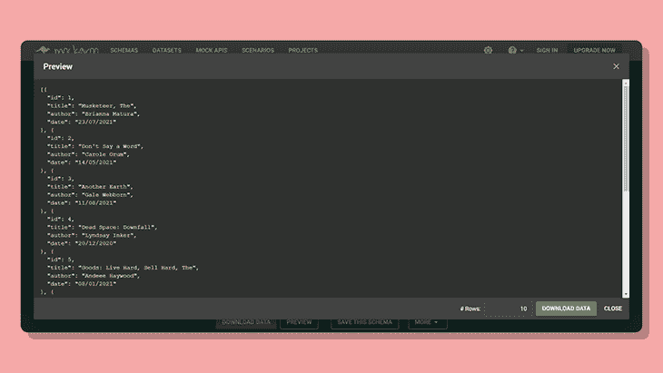

制作一个单独的文件—姑且称之为`mock-data.json` —并粘贴生成的数据。JSON 文件看起来会像这样:

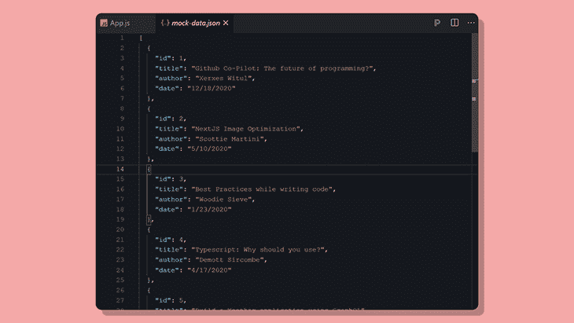

## 显示模拟数据

现在，在我们真正使搜索栏起作用之前，让我们映射所有的数据并显示在应用程序上。

导入 JSON 数据，就像这样:

```
import Data from "../mock-data.json"

```

由于模拟数据是一个数组，我们将使用 JavaScript ES6 `Map`函数遍历数组中的每个对象，并使用 JSX 显示它。

```
{
  Data.map((post) => (
    <div key={post.id}>
      <p>{post.title}</p>
      <p>{post.author}</p>
    </div>
  ));
}

```

结果是这样的:

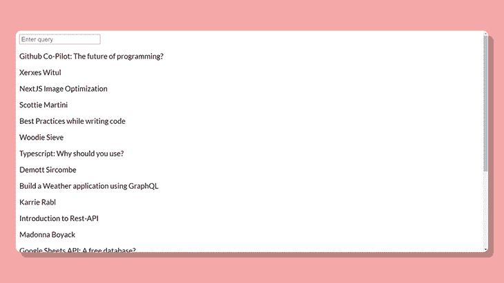

## 设置搜索栏的样式

造型不是必须的，但是没有任何 CSS 有什么乐趣？如果你擅长样式演示，请随意[跳到下一部分](#making-search-bar-functional)。

让我们试着将每个元素居中，包括搜索栏。父元素有一个类名`app`，所以我们将把它放在中心位置。

在`styles.css`文件中，指向`.app`类名并应用`flex`属性。

```
.app {
  display: flex;
  flex-direction: column;
  justify-content: center;
  align-items: center;
}

```

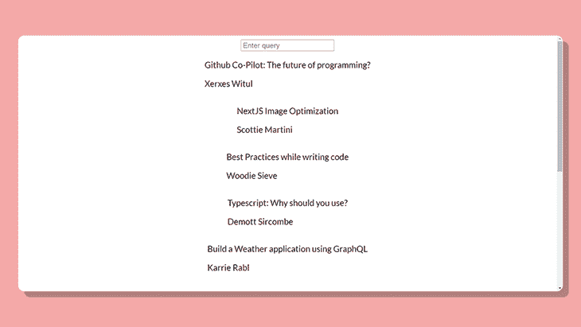

帖子看起来还是很无聊。让我们为每个帖子制作一张卡片。给`Map`函数中的 JSX 元素分配一个类名。

```
//App.js
{
  Data.map((post) => (
    <div className="box" key={post.id}>
      <p>{post.title}</p>
      <p>{post.author}</p>
    </div>
  ));
}

```

为了区分每张卡片，我们将使用 border 属性，并使四角变圆。

```
/* App.css */
.box {
  text-align: left;
  border: black ridge 1px;
  border-radius: 10px;
  margin: 3px;
  width: 20rem;
  padding-left: 10px;
}

```

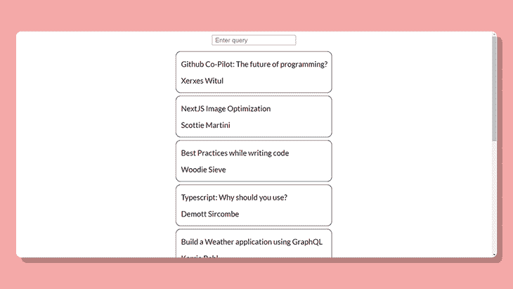

样式完成后，现在让我们回到本教程的重点——使搜索栏具有功能性！

## 使搜索栏起作用

现在是有趣的部分！每当用户在输入字段中键入内容时，我们都希望跟踪每个变化。为此，我们使用 [`useState`钩子](https://blog.logrocket.com/react-hooks-state-management/)并在输入字段发生变化时设置状态。

```
import Data from "../mock-data.json";
import {useState} from "react";

export default function App (){
  const [query, setQuery] = useState("")
  return {
    <div>
      <input placeholder="Enter Post Title" onChange={event => setQuery(event.target.value)} />
    {
      Data.map((post, index) => {
        <div key={index}>
          <p>{post.title}</p>
          <p>{post.author}</p>
        </div>
      })
    }
    </div>
 }
}

```

完成之后，接下来我们要做的事情是查看输入的查询是否匹配任何模拟数据。在我们的示例中，我们将查看文章标题是否与输入的查询匹配。这种方法将支持部分匹配和完全匹配。

更简单地说，如果用户输入一个字母，该函数将返回包含该字母的所有文章标题。类似地，如果用户输入一个有效的单词，搜索函数将返回一个数组，其中包含包含该单词的文章标题。

在这种情况下,`Filter`方法是完美的。它返回一个满足指定条件的数组—这里的条件是返回一个与用户输入相匹配的新数组。

```
Data.filter(post => {
  if (query === "") {
    //if query is empty
    return post;
  } else if (post.title.toLowerCase().includes(query.toLowerCase())) {
    //returns filtered array
    return post;
  }
});

```

让我们直说吧。如果用户没有输入任何东西，我们可以说输入字段没有被使用,`filter`函数将返回原始数组。

如果输入的查询匹配任何数据(在我们的例子中，是来自示例博客的文章标题)，那么它将返回一个新数组，其中包含与用户输入的查询匹配的对象。为了避免由字母大写引起的任何错误，最好将用户输入的查询和模拟数据中的`post.title`都转换成小写。这样，无论用户输入什么，即使都是小写字母，我们的过滤器仍然能够输出匹配结果，如果找到一个匹配结果的话。

为了显示过滤后的数据，我们将把它与之前的`Map`函数结合起来。

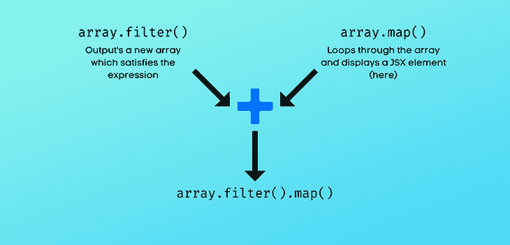

您的最终代码应该如下所示:

```
{
  Data.filter(post => {
    if (query === '') {
      return post;
    } else if (post.title.toLowerCase().includes(query.toLowerCase())) {
      return post;
    }
  }).map((post, index) => (
    <div className="box" key={index}>
      <p>{post.title}</p>
      <p>{post.author}</p>
    </div>
  ))
}

```

就是这样！干得好。搜索栏应该已经准备好了。🚀

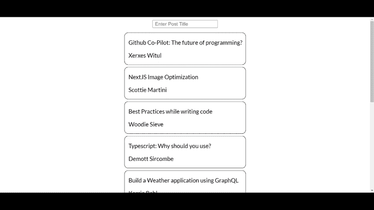

## 结论

现在你已经知道如何在 React 中从头开始创建一个搜索栏，你可以根据项目需求进一步定制它。您可以让它调用某个 API，并以类似的方式显示数据。

此外，我们遇到了一些 JavaScript ES6 函数，它们非常方便，可以用于其他应用程序，例如对过滤的数据进行排序，以按照您想要的顺序(日期、字母、时间等)显示数据。)使用`sort()`功能。

最终，与其他第三方包相比，从头创建的最大优势无疑是组件的灵活性。你打算让你的搜索栏做什么？

## [LogRocket](https://lp.logrocket.com/blg/react-signup-general) :全面了解您的生产 React 应用

调试 React 应用程序可能很困难，尤其是当用户遇到难以重现的问题时。如果您对监视和跟踪 Redux 状态、自动显示 JavaScript 错误以及跟踪缓慢的网络请求和组件加载时间感兴趣，

[try LogRocket](https://lp.logrocket.com/blg/react-signup-general)

.

[ ](https://lp.logrocket.com/blg/react-signup-general) [](https://lp.logrocket.com/blg/react-signup-general) 

LogRocket 结合了会话回放、产品分析和错误跟踪，使软件团队能够创建理想的 web 和移动产品体验。这对你来说意味着什么？

LogRocket 不是猜测错误发生的原因，也不是要求用户提供截图和日志转储，而是让您回放问题，就像它们发生在您自己的浏览器中一样，以快速了解哪里出错了。

不再有嘈杂的警报。智能错误跟踪允许您对问题进行分类，然后从中学习。获得有影响的用户问题的通知，而不是误报。警报越少，有用的信号越多。

LogRocket Redux 中间件包为您的用户会话增加了一层额外的可见性。LogRocket 记录 Redux 存储中的所有操作和状态。

现代化您调试 React 应用的方式— [开始免费监控](https://lp.logrocket.com/blg/react-signup-general)。