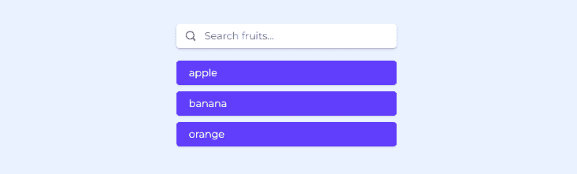
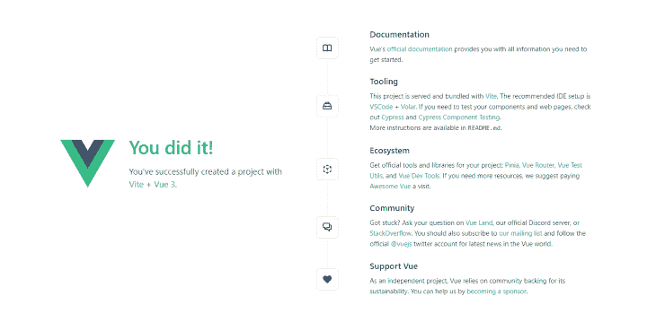
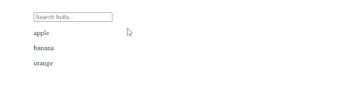
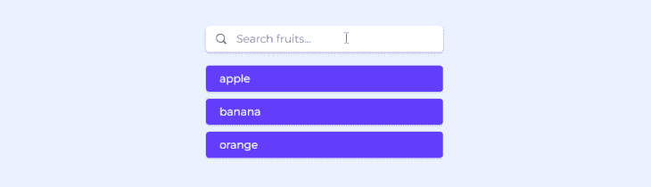

# 如何在 Vue - LogRocket 博客中创建搜索栏

> 原文：<https://blog.logrocket.com/create-search-bar-vue/>

### 目录

互联网是信息的海洋。为了轻松找到我们要找的信息，我们依赖搜索栏，几乎每个应用程序或网站都使用搜索栏。

在本教程中，我们将在 [Vue.js](https://vuejs.org/) 中构建一个自定义搜索栏，这是一个非常有用的 [JavaScript](https://developer.mozilla.org/en-US/docs/Web/JavaScript) 框架，用于构建快速、轻量级的用户界面。



搜索栏有许多不同的形状和形式。我们的搜索栏示例将过滤一个现有的水果列表，您将学习如何构建布局、创建逻辑和设计搜索栏的样式。

在我们的例子中，不会有任何复杂的算法来处理搜索查询，但是我们将使用一个简单的函数根据用户输入的查询过滤出结果。

为了提高 UX，搜索结果将实时返回，这意味着它们将随着用户的输入而更新，而无需点击任何东西来提交搜索查询以执行。

当搜索查询没有结果时，我们还将通过向用户返回信息性消息来跟踪场景。

## 设置 Vue

首先，在您的终端中运行`npm init [[email protected]](/cdn-cgi/l/email-protection)`。这将执行 [create-vue](https://github.com/vuejs/create-vue) ，这是 vue 的一个官方搭建工具，用于创建全功能的 Vue 项目。

您将被要求在终端向导中为您的项目命名。我们把我们的 app 叫做`vue-search-app`。当询问项目的进一步配置时，按下**键进入**选项。

之后，运行`cd vue-search-app`和`npm install`为项目设置所有必要的依赖关系。

接下来，运行`npm run dev`，这将为您的新 Vue 应用启动一个开发服务器。在浏览器中打开 [http://localhost:3000](http://localhost:3000) 即可访问。



## 在 Vue 中创建搜索栏组件

导航到`src`文件夹并找到`App.vue`文件。我们将从头开始编写所有内容，所以请确保您首先从`App.vue`中删除所有内容。然后，包含以下代码:

```
<template>
   <input type="text" v-model="input" placeholder="Search fruits..." />
  <div class="item fruit" v-for="fruit in filteredList()" :key="fruit">
    <p>{{ fruit }}</p>
  </div>
  <div class="item error" v-if="input&&!filteredList().length">
     <p>No results found!</p>
  </div>
</template>
```

在 Vue 中，所有的[单文件组件](https://vuejs.org/guide/scaling-up/sfc.html)必须包装在`template`标签中。Vue 将把里面的所有东西编译到虚拟 DOM 中。

我们还创建了`input`字段本身。我们将类型设置为`text`,因为我们将在其中输入搜索查询。我们还为它添加了一个内置指令`v-model`，这将允许我们在键入的值和数据属性之间创建一个双向绑定。我们还包含了一个定制的`placeholder`值，提示用户执行搜索操作。

然后，我们创建了将被返回的搜索项。我们使用内置的`v-for`指令来呈现基于`fruits`数组的段落中的条目列表，我们将在下一节中创建该数组。我们还传递了`:key`属性，这是在 VueJS 中循环元素时的推荐做法。

最后，我们创建了一个`error`元素，如果搜索查询没有结果，就会显示这个元素。为此，我们使用内置的`v-if`指令来检查是否有输入，以及过滤函数是否没有结果。如果两个条件都满足，则呈现元素。

对于这两个`div`元素，我们还包含了`class`属性，因此我们可以稍后对它们进行样式化。它们都将包含`item`类，而`fruit`和`error`类将用于分配不同的样式规则。

## 添加数据和逻辑

为了向组件添加数据和逻辑，我们将编写一些 JavaScript。Vue 允许我们通过将它包装在`<script>`标签中，将它写在同一个`App.vue`文件中。

在我们之前创建的`template`标签下，包含以下代码:

```
<script setup>
import { ref } from "vue";
let input = ref("");
const fruits = ["apple", "banana", "orange"];
function filteredList() {
  return fruits.filter((fruit) =>
    fruit.toLowerCase().includes(input.value.toLowerCase())
  );
}
</script>
```

我们首先在开始的`<script>`标签中包含了`setup`，这是 Vue v3.2 中引入的编译时语法糖，允许我们用更少的样板文件编写代码。

然后，我们导入了`ref`属性，这将让我们在搜索栏中存储用户输入。为此，我们创建了一个新变量`input`，它将使用导入的`ref`。

接下来，我们创建了`fruit`数组，它将保存我们将要遍历的数据。通常，数据来自数据库，但是对于本教程，我们将使用简单的虚拟数据。

最后，我们创建了一个`filteredList`函数，该函数将再次检查用户在`fruits`数组中输入的每个单词，并将只返回那些包含搜索查询的元素。

如果我们检查浏览器，我们现在应该看到一个无样式的功能搜索栏。



## 导入搜索图标

Vue 对项目中的资产使用简单的文件结构。在`src`中，您将找到`assets`文件夹，在这里您可以包含您想要使用的静态资产。要访问它们，只需提供文件的路径，比如`App.vue`中的`assets/image.svg`。

在我们的应用程序中，我们将使用一个 SVG 搜索图标来使搜索输入区域更吸引人，并通过突出显示搜索输入区域来改进 UI。你可以在 svgrepo.com 或 flaticon.com 的网站上下载一些不错的搜索图标。

下载完成后，重命名图标`search-icon.svg`并放入`assets`文件夹。

## 设置搜索栏的样式

我们可以直接在`App.vue`文件中设计我们的搜索栏。唯一的要求是所有的样式规则必须包含在`<style>`标签中。

在我们之前创建的`<script>`标签下，包含以下样式规则:

```
<style>
@import url("https://fonts.googleapis.com/css2?family=Montserrat&display=swap");

* {
  padding: 0;
  margin: 0;
  box-sizing: border-box;
  font-family: "Montserrat", sans-serif;
}

body {
  padding: 20px;
  min-height: 100vh;
  background-color: rgb(234, 242, 255);
}

input {
  display: block;
  width: 350px;
  margin: 20px auto;
  padding: 10px 45px;
  background: white url("assets/search-icon.svg") no-repeat 15px center;
  background-size: 15px 15px;
  font-size: 16px;
  border: none;
  border-radius: 5px;
  box-shadow: rgba(50, 50, 93, 0.25) 0px 2px 5px -1px,
    rgba(0, 0, 0, 0.3) 0px 1px 3px -1px;
}

.item {
  width: 350px;
  margin: 0 auto 10px auto;
  padding: 10px 20px;
  color: white;
  border-radius: 5px;
  box-shadow: rgba(0, 0, 0, 0.1) 0px 1px 3px 0px,
    rgba(0, 0, 0, 0.06) 0px 1px 2px 0px;
}

.fruit {
  background-color: rgb(97, 62, 252);
  cursor: pointer;
}

.error {
  background-color: tomato;
}
</style>
```

在样式规则的顶部，我们使用了`import`语法来导入 [Montserrat](https://fonts.google.com/specimen/Montserrat) 字体，这样我们就可以在我们的搜索组件中使用它。你可以在谷歌字体的众多选择中挑选一个——它们都是免费的。

然后，我们为应用程序中使用的所有元素创建了自定义重置规则，这样就没有样式的默认值，并且应用程序在所有浏览器上看起来都一样。我们移除了默认的`padding`和`margin`，并设置了`box-sizing`以在宽度和高度中包含填充和边距，并设置每个元素使用导入的 Montserrat 字体。

然后，我们将`body`设置为使用屏幕的整个高度，添加一些填充，并将背景颜色设置为浅蓝色。

对于`input`元素，我们设置了具体的宽度，添加了一些边距和填充，并设置了字体大小。我们使用`background`属性设置背景颜色，导入搜索图标，并将其放置在输入字段中。我们还移除了自定义边框，将边角设置为略微圆角，并为输入添加了漂亮的阴影效果。

对于返回的元素，我们设置了一个特定的宽度，并添加了一些`margin`和`padding`。我们将角设置成稍微圆一点的，并加入了阴影效果，我们将字体颜色设置为白色。

最后，我们给了`fruit`和`error`一些单独的背景颜色样式规则，并将光标设置为当悬停在`fruit`项目上时变成指针。

## 测试 Vue 中的搜索栏

现在，检查您的开发服务器是否还在运行。如果是，访问浏览器并再次打开 [http://localhost:3000](http://localhost:3000) 。如果服务器不工作，首先运行命令`npm run dev`。

你应该会看到一个功能齐全的设计好的搜索栏，可以在你写的时候过滤掉条目。尝试用真值和错值测试它，看看它是否能处理这两种情况:



## 结论

在本教程中，我们创建了一个全功能的搜索栏。我们回顾了指令概念，比如数据绑定、循环、条件呈现，以及使用 refs 存储用户提供的输入值。

我们还避免了任何样式和组件库，而是从头开始创建我们自己的定制样式。我们还学习了如何在输入栏中包含自己的图标。

希望您学到了一些有用的东西，下次您在从事 Vue 项目时，您将知道如何实现一个搜索栏来帮助您的用户找到他们正在寻找的内容。

## 像用户一样体验您的 Vue 应用

调试 Vue.js 应用程序可能会很困难，尤其是当用户会话期间有几十个(如果不是几百个)突变时。如果您对监视和跟踪生产中所有用户的 Vue 突变感兴趣，

[try LogRocket](https://lp.logrocket.com/blg/vue-signup)

.

[](https://lp.logrocket.com/blg/vue-signup)[https://logrocket.com/signup/](https://lp.logrocket.com/blg/vue-signup)

LogRocket 就像是网络和移动应用程序的 DVR，记录你的 Vue 应用程序中发生的一切，包括网络请求、JavaScript 错误、性能问题等等。您可以汇总并报告问题发生时应用程序的状态，而不是猜测问题发生的原因。

LogRocket Vuex 插件将 Vuex 突变记录到 LogRocket 控制台，为您提供导致错误的环境，以及出现问题时应用程序的状态。

现代化您调试 Vue 应用的方式- [开始免费监控](https://lp.logrocket.com/blg/vue-signup)。