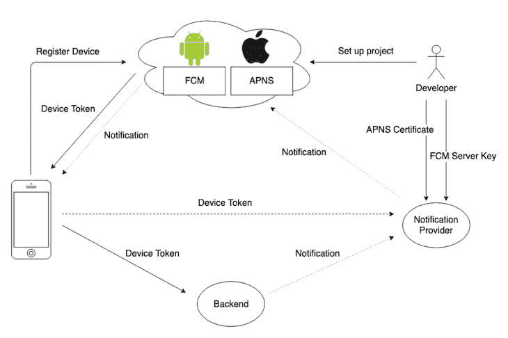
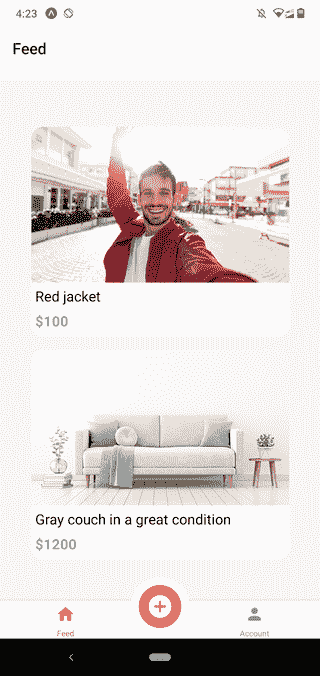
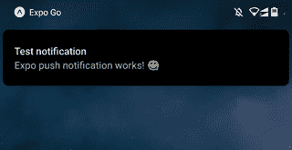
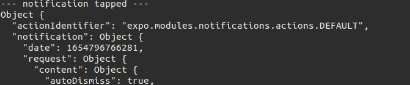
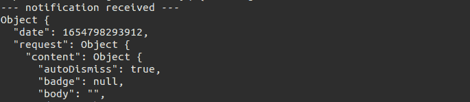

# 如何在 React Native - LogRocket 博客中创建和发送推送通知

> 原文：<https://blog.logrocket.com/create-send-push-notifications-react-native/>

***编者按:*** *本文于 2022 年 6 月 10 日更新，以包括更多关于 Expo、Firebase 和 React Native 的最新信息，并为清晰起见进行了重新组织。*

推送通知——应用程序发送给安装了它的用户的消息——已经成为为企业和用户构建应用程序时要考虑的一个重要方面。

推送通知类似于短信，但发送时不需要任何费用。因此，许多企业现在更喜欢推送通知，向安装了应用程序的用户发送信息和警报。在本文中，我们将看看 [React Native](https://blog.logrocket.com/tag/react-native/) 中的推送通知。

### 内容

## 什么是推送通知？

推送通知是由用户已安装的应用程序的制作者发送的消息或警报。有两种主要类型的通知，即前台和后台通知。

前台通知是当应用程序当前打开并运行时用户收到的通知类型，而后台通知是在应用程序当前是否打开时发送的。
推送通知在移动应用开发领域很受欢迎，原因有很多，包括:

*   使公司能够以较低的成本为产品和报价做广告
*   改善整体用户体验
*   更快地发送交易收据
*   转化更多用户
*   它们是可靠的——当用户打开手机时，他们总是会收到离线信息

## React Native 中的推送通知架构



谈到 React Native 中的推送通知，有几种方法可以设置它们:

*   特定于本机平台的通知服务(FCM/APN)
*   世博会推送通知服务和其他云服务
*   React 本机库，如 react-native-push-notification

### 特定于本机平台的通知服务(FCM/APN)

Android 和 iOS 平台都提供了用于接收推送通知的特定于原生平台的 API。 [Firebase 云消息(FCM)](https://blog.logrocket.com/react-native-push-notifications-firebase-cloud-messaging/) 帮助为 Android 设备发送推送通知，为 iOS 设备发送苹果推送通知服务(APNs)。我们可以使用 React Native Firebase 库在 Android 上集成 FCM，使用 [push-notification-ios](https://github.com/react-native-push-notification/ios) 库在 ios 上集成 APN。

此外，React Native Firebase 库提供了一种通过 FCM 在 iOS 上接收推送通知的方式。您可以从 Node.js 服务器向注册了 [firebase-admin](https://github.com/firebase/firebase-admin-node) 和 [node-apn](https://github.com/node-apn/node-apn) 的移动设备发送远程通知。

### 世博会推送通知和其他云服务

FCM 和 APN 都是特定于平台的原生推送通知服务，所以如果我们直接使用这些原生推送通知服务，我们通常必须在应用的前端和后端使用不同的库。因此，一些云服务提供了使用统一源代码的 FCM 和 APN 的方法。

流行的推送通知服务有:

*   亚马逊简单通知服务(SNS)
*   [一个信号](https://blog.logrocket.com/implement-push-notifications-react-native-onesignal/)
*   Azure 通知中心
*   世博会推送通知

这些通知服务在本地推送通知系统之上提供了一个抽象层，并带有一个托管的中间推送通知服务器(见上图)。

### React 本机库，如 react-native-push-notification

像[react-native-push-notification](https://github.com/zo0r/react-native-push-notification)和[react-native-notifications](https://github.com/wix/react-native-notifications)这样的库提供本地模块来接收远程通知，并通过统一的库 API 轻松显示本地通知。

您可以对这些库直接使用 FCM/APN 或托管推送通知服务。我们必须使用 Expo 中的裸工作流来使用这些库，因为这些不包含在 Expo 应用程序中。

## React 本机演示中的推送通知

要在 React 本机应用程序中使用推送通知，首先我们需要注册应用程序以获得推送通知令牌。此令牌是唯一标识每个设备的长字符串。然后，我们将令牌存储在服务器上的数据库中，发送通知，并处理收到的我们发送的通知。

在我们深入研究之前，我们将为已经开发的项目添加推送通知。这个项目是一个销售二手物品的电子商务反应本地应用程序。

要将其源代码下载到您的计算机中，请在终端中运行以下命令:

```
git clone https://github.com/codezri/Done-With-It-App.git

```

接下来，我们将安装项目所需的依赖项，并启动 React 本地开发服务器:

```
yarn install 
yarn start 

```

以上命令安装依赖项并启动 Expo 开发服务器，因此您可以通过在 Android 或 iOS 上使用 Expo 应用程序来测试您的应用程序。示例应用程序看起来如下，带有一个工作的后端(我们将在讨论移动前端代码后设置应用程序后端):



接下来，我们将从 React Native Expo 获得一个推送通知令牌，以开始接收应用程序的通知。

## 获取推送通知令牌

要在 React 本机应用程序中使用推送通知，首先我们需要注册应用程序以获得推送通知令牌。这里，我们将在 Expo 中使用通知 API。

为此，让我们将`cd`放入`navigation`目录和`AppNavigator`组件中。这里我们要从 Expo 中派生出一个令牌。下面让我们从 Expo 中获取`Notifications`功能:

```
import * as Notifications from 'expo-notifications';

```

上述功能帮助我们请求用户许可来发送推送通知和接收特定设备的唯一 Expo 通知令牌。

现在，我们将在`AppNavigator`组件中编写一个异步函数，它将从 React Native Expo 请求一个令牌:

```
async function registerForPushNotificationsAsync() {
    let token;

    const { status: existingStatus } = await Notifications.getPermissionsAsync();
    let finalStatus = existingStatus;

    if (existingStatus !== 'granted') {
        const { status } = await Notifications.requestPermissionsAsync();
        finalStatus = status;
    }
    if (finalStatus !== 'granted') {
        alert('Failed to get push token for push notification!');
        return;
    }
    token = (await Notifications.getExpoPushTokenAsync()).data;
    console.log(token);

    return token;
}

```

在上面的代码中，我们使用最近安装的`expo-notifications`模块来获得用户对通知的许可。该函数等待接收通知许可状态。

接下来，我们检查权限是否被授予，如果没有，我们显示一个错误警告并立即从函数返回。如果令牌请求过程成功，我们从函数返回令牌。此外，目前，出于开发目的，我们将 Expo 令牌记录到控制台。

为了在我们的应用程序中调用上述函数，我们将使用来自`React`的`useEffect`钩子:

```
const AppNavigator = () => {
    useEffect(() => {
        registerForPushNotificationsAsync();
    }, []);

```

在上面的代码中，我们传递了从`re``act`导入的`useEffect`钩子，并传递了一个函数`registerForPushNotificationsAsync`，以确保它只被调用一次。

现在，通过 Expo 应用程序打开应用程序。打开应用程序后，您可以在控制台上看到 Expo 推送通知令牌。当新用户打开应用程序时，将生成这个唯一的令牌，因此我们可以将这些令牌存储在服务器中，并以编程方式向所有注册的设备发送通知。将令牌保存在某个地方—我们将很快使用它来测试通知。

## 发送测试通知

我们可以通过添加推送通知令牌，使用 [Expo 通知工具](https://expo.dev/notifications)向设备发送测试通知。转到博览会通知工具，输入您的令牌，输入标题和描述，将您的应用程序保留在后台，然后单击**发送通知**按钮发送测试通知。

现在，您可以在设备上看到通知，如以下预览所示:



如果您需要在应用程序处于前台时显示通知，您可以将以下配置添加到`AppNavigator.js`源文件中:

```
Notifications.setNotificationHandler({
  handleNotification: async () => ({
    shouldShowAlert: true
  }),
});

const AppNavigator = () => {
// ----
// ----

```

现在我们已经手动测试了 Expo 通知，让我们将推送通知令牌存储在服务器中，并以编程方式发送通知。

## 在项目中存储推送通知令牌

为了存储和使用来自服务器的推送通知，我们需要配置应用程序用户界面，使其能够注册新用户和设备。

为此，让我们转到项目中的`api`目录，打开一个名为`expoPushTokens.js`的新文件。然后执行以下操作:

```
import client from './client';
const register = (pushToken) => client.post('/expoPushTokens', { token: pushToken });
export default {
    register,
}

```

在上面的代码中，我们首先导入客户机模块，它也在`api`目录中。
我们定义一个采用`pushToken`的函数`register`。现在，我们将一个客户端或新用户发布到后端`/expoPushToken`的`url`。在请求的主体中，我们将添加一个设置为`pushToken`的对象`token`。然后，我们将使用`register`方法导出为默认对象。

接下来，我们返回到`AppNavigator`组件，我们将把令牌发送到服务器，而不是在控制台上记录令牌:

```
const AppNavigator = () => {

    useEffect(() => {
        registerForPushNotificationsAsync()
            .then(token => expoPushTokensApi.register(token));
    }, []);

```

现在，我们正在发送新用户，以获得令牌和用户信息到我们的后端服务器。稍后，我们可以使用这些令牌向所有注册的设备发送通知。

* * *

### 更多来自 LogRocket 的精彩文章:

* * *

## 在服务器上发送通知

要向服务器发送推送通知，我们需要使用 Expo 提供的 SDK 之一。如果您访问[文档](https://docs.expo.dev/push-notifications/sending-notifications/)，它为我们提供了如何在服务器上以多种语言实现推送通知的信息。

在本教程中，我将使用 Node.js 服务器。[这里的](https://github.com/iamfortune/DoneWithIt-Backend)是我在本教程中使用的服务器源代码的链接。我们将访问服务器中的`utilities`目录，并将`Expo` SDK 包含在其中。为此，我们首先执行以下操作:

```
git clone https://github.com/iamfortune/DoneWithIt-Backend.git

```

`cd`到新克隆的 Git 存储库中。接下来，我们使用以下命令安装`npm`包:

```
npm install 

```

接下来，将您计算机的本地网络 IP 地址添加到 React Native app 的 [`baseURL`](https://github.com/codezri/Done-With-It-App/blob/8e7a384a00319d3bef82a7d2983522841dd25aa3/app/api/client.js#L4) 和 backend project 的 [`assetsBaseUrl`](https://github.com/iamfortune/DoneWithIt-Backend/blob/9b481c2530af12347d718966d91ac465ccbdd800/config/development.json#L2) 中。

然后，我们开始我们的开发服务器:

```
npm start 

```

如果您将计算机和移动设备放在同一个网络上，您可以在 React Native 应用程序中看到一些预包含的列表。

现在，转到`pushNotifications.js`文件并将`Expo` SDK 添加到包中:

```
npm i expo-server-sdk
const { Expo } = require("expo-server-sdk");

```

接下来，我们将编写一个函数来接收我们的推送通知——推送令牌和我们想要发送给用户的消息。然后，我们将创建一个新的 chunk 方法来处理推送通知:

```
const sendPushNotification = async (targetExpoPushToken, message) => {
  const expo = new Expo();
  const chunks = expo.chunkPushNotifications([
    { to: targetExpoPushToken, sound: "default", body: message }
  ]);

```

现在，您可以在服务器代码的任何地方调用`sendPushNotification`函数，根据 Expo 推送通知令牌向任何设备发送通知，如下所示:

```
const { Expo } = require('expo-server-sdk');
const sendPushNotification = require('../utilities/pushNotifications');
// ----
// ----
if (Expo.isExpoPushToken(expoPushToken)) {
  await sendPushNotification(expoPushToken, message);
}
// ----

```

您可以在`[routes/messages.js](https://github.com/iamfortune/DoneWithIt-Backend/blob/9b481c2530af12347d718966d91ac465ccbdd800/routes/messages.js#L57)`文件中查看`sendPushNotification`函数的用法示例。接下来，让我们确定如何处理我们在 React 本机应用程序中收到的通知。

## 在 React Native 中处理收到的通知

为了处理收到的通知，首先我们需要一个事件侦听器，每次用户点击通知时都会调用它。

让我们在接收通知对象的`AppNavigator`函数中添加一个事件监听器:

```
const AppNavigator = () => {

    const responseListener = useRef();

    useEffect(() => {
        registerForPushNotificationsAsync()
            .then(token => expoPushTokensApi.register(token));

        // Works when app is foregrounded, backgrounded, or killed
        responseListener.current = Notifications.addNotificationResponseReceivedListener(response => {
            console.log('--- notification tapped ---');
            console.log(response);
            console.log('------');
        });

        // Unsubscribe from events
        return () => {
            Notifications.removeNotificationSubscription(responseListener.current);
        };
    }, []);
// ----
// ----

```

一旦您通过 Expo push notification tool 发送测试通知并点击传入通知，您将在控制台上看到通知点击响应，如下所示。



Expo notifications 包提供了一个监听器，如果应用程序是前景化的，它可以检测到来的通知事件。一旦您的前台应用程序通过 Expo 推送通知系统收到通知，以下代码片段将记录特定的通知对象:

```
// ----
// ----

Notifications.setNotificationHandler({
  handleNotification: async () => ({
    shouldShowAlert: true
  }),
});

const AppNavigator = () => {

    const notificationListener = useRef();

    useEffect(() => {
        registerForPushNotificationsAsync()
            .then(token => expoPushTokensApi.register(token));

        notificationListener.current = Notifications.addNotificationReceivedListener(notification => {
            console.log('--- notification received ---');
            console.log(notification);
            console.log('------');
        });

        // Unsubscribe from events
        return () => {
            Notifications.removeNotificationSubscription(notificationListener.current);
        };
    }, []);
// ----
// ----

```

如果您的应用程序在前台，上面的代码会记录通知对象。看下面的预告。



你可以从[这个 GitHub 库](https://github.com/codezri/Done-With-It-App)中浏览这个 React 原生应用的完整源代码。此外，您可以从[GitHub 库](https://github.com/iamfortune/DoneWithIt-Backend)中浏览完整的服务器端代码。

请注意，在这里，我在没有设置 FCM 的情况下收到了 Android 设备的通知，因为我使用 Expo 应用程序进行开发。如果您需要在没有 Expo 应用程序的情况下测试您的应用程序，或者您希望将您的应用程序部署到 Google Play 或 Apple App Store，请确保正确生成 FCM 和 APNs 凭据。官方 [Expo 文档](https://docs.expo.dev/push-notifications/push-notifications-setup/#credentials)可以指导您为生产应用设置 FCM 和 APN。

借助 Expo 应用，您无需 FCM/APNs 配置即可开发和测试您的应用。

## 结论

在本文中，我们已经了解了为什么推送通知很受欢迎，并且在应用程序世界中仍然如此，我们还了解了如何在 React 本机应用程序中发送推送通知，方法是添加通知令牌，从服务器发送通知，并使用 Expo 通知 API 在用户设备上显示通知。

## [LogRocket](https://lp.logrocket.com/blg/react-native-signup) :即时重现 React 原生应用中的问题。

[](https://lp.logrocket.com/blg/react-native-signup)

[LogRocket](https://lp.logrocket.com/blg/react-native-signup) 是一款 React 原生监控解决方案，可帮助您即时重现问题、确定 bug 的优先级并了解 React 原生应用的性能。

LogRocket 还可以向你展示用户是如何与你的应用程序互动的，从而帮助你提高转化率和产品使用率。LogRocket 的产品分析功能揭示了用户不完成特定流程或不采用新功能的原因。

开始主动监控您的 React 原生应用— [免费试用 LogRocket】。](https://lp.logrocket.com/blg/react-native-signup)