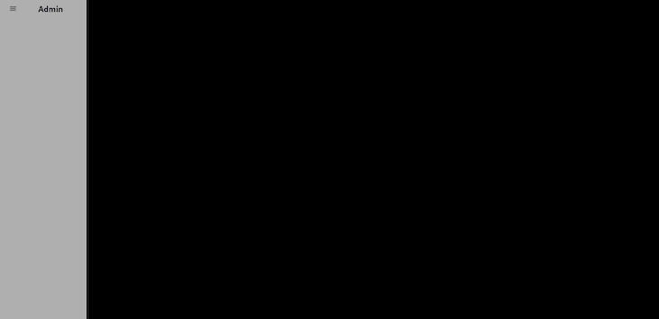
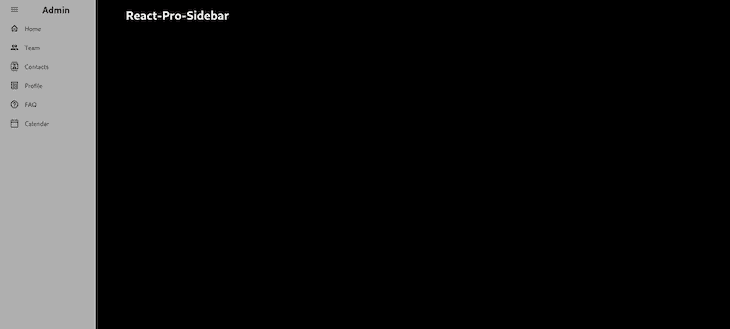
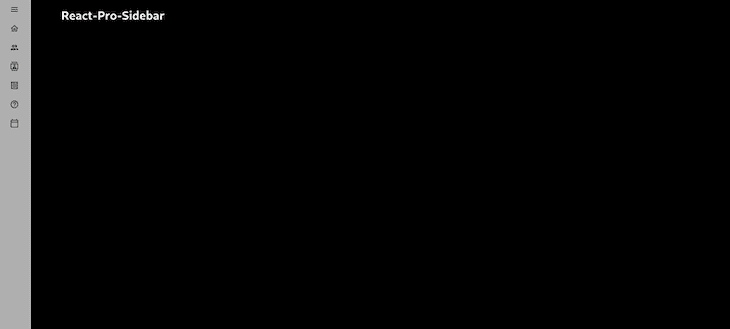
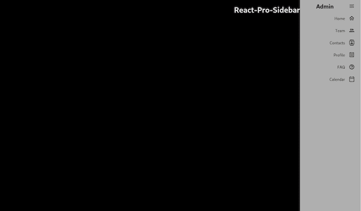
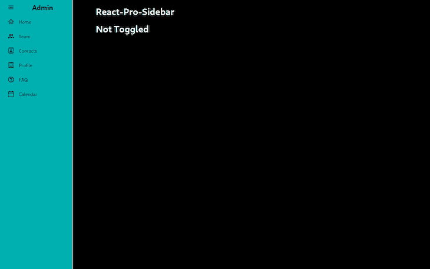
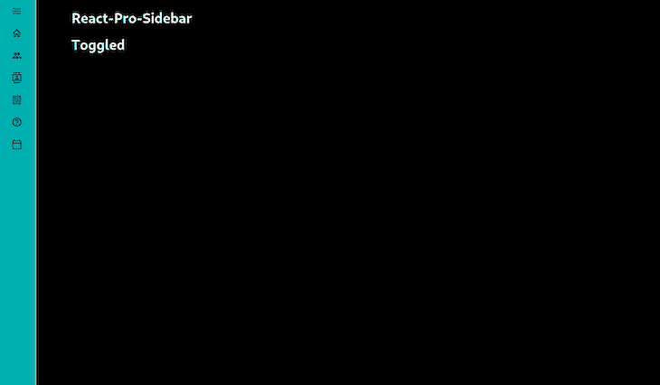
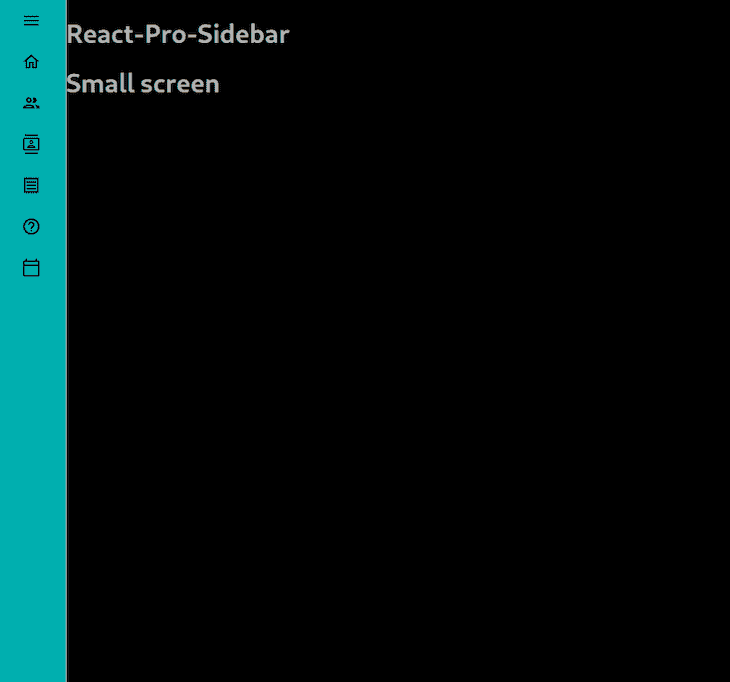

# 使用 react-pro-sidebar 和 MUI 创建平滑的侧边栏

> 原文：<https://blog.logrocket.com/create-sidebar-react-pro-sidebar-mui/>

当我们想要提供引人注目的用户体验时，导航是 web 开发中一个非常重要的方面，用户应该能够知道他们在哪里，并在页面之间快速切换，而不会迷路。

为了确保流畅的浏览，我们倾向于添加一个顶部或侧面的导航栏，但是实现这个功能非常耗时，所以在这些用例中，一个更快的替代方案会很有用。

幸运的是，我们对许多问题都有现成的解决方案，包括这个问题！

在本教程中，我将向您展示如何使用 react-pro-sidebar 向 react 应用程序添加动画侧边栏。为了积极的用户体验，我们还将利用材质 UI 图标来获得更专业的美感。

*向前跳转:*

## 我们在建造什么？

我们将建立一个简单的应用程序，包括一个侧栏和一个主页。

主页上只有一个标题，而侧边栏将有多个相邻图标的元素来展示其功能。

当用户点击侧边栏时，它会折叠，只有再次点击时才会展开。

正如他们的文档中提到的，“react-pro-sidebar 提供了一组用于创建高级和可定制的侧边导航的组件。”简而言之，它使得在 React 中创建侧边栏变得轻而易举——这对我们来说是个好消息！

虽然周围有其他竞争对手，react-pro-sidebar 在社区中非常受欢迎，在我看来是这个特定用例最安全的赌注。如果你想了解更多关于这个包的信息，你可以在阅读本教程的同时查阅官方文档。

## 什么是米隆？

[材质 UI](https://blog.logrocket.com/definitive-guide-react-material/) 图标是我们今天要用的一组图标。你不需要用 MUI 来做你的造型或者完全不需要了解它；对于本教程，您唯一需要做的事情就是安装相关的包，我们稍后会讲到。

根据我的经验，MUI 图标可以实现快速开发，因为我们不需要在各个地方寻找不同的图标，我们需要的一切都可以在这里找到。总的来说，我发现 MUI 在我的项目中非常有用，并强烈推荐使用它。

## 安装依赖项

首先，让我们通过在终端中输入`npx create-react-app sidebar-project`命令，用 React CLI 创建 React 应用程序。

当然，你可以为这个项目选择任何你想要的名字，我用`sidebar-project`作为这个教程的名字。

现在，我们需要为这个教程安装材质 UI，它的图标，和 react-pro-sidebar。

让我们进入刚刚创建的`sidebar-project`应用程序，在终端上输入以下命令:

`npm install @mui/icons-material @mui/material @emotion/styled @emotion/react react-pro-sidebar`

现在，我们可以走了！

为了使用 react-pro-sidebar，我们需要将我们的组件包装在一个从包中导入的`ProSidebarProvider`组件中。

看看我包装申请的`index.js`:

```
import React from "react";
import ReactDOM from "react-dom/client";
import "./index.css";
import App from "./App";
import { ProSidebarProvider } from "react-pro-sidebar";
const root = ReactDOM.createRoot(document.getElementById("root"));
root.render(
  <React.StrictMode>
    <ProSidebarProvider>
      <App />
    </ProSidebarProvider>
  </React.StrictMode>
);

```

## 添加全局样式

在我们开始构建逻辑之前，我想添加一些全局 CSS，所以我将转到`index.css`文件并在那里添加两行代码。

在`body`标签中，我将为现有线条添加一个高度为`100vh`的黑色背景。

完成后，它应该是这样的:

```
body {
  margin: 0;
  font-family: -apple-system, BlinkMacSystemFont, "Segoe UI", "Roboto", "Oxygen",
    "Ubuntu", "Cantarell", "Fira Sans", "Droid Sans", "Helvetica Neue",
    sans-serif;
  -webkit-font-smoothing: antialiased;
  -moz-osx-font-smoothing: grayscale;
  /* additions here*/
  height: 100vh;
  background: black;
}
code {
  font-family: source-code-pro, Menlo, Monaco, Consolas, "Courier New",
    monospace;
}

```

## 构建应用程序

现在我们的应用程序已经包装好了，我们有了全局样式，我们可以开始构建我们的逻辑了。

* * *

### 更多来自 LogRocket 的精彩文章:

* * *

让我们转到我们的`App.js`文件，从从`react-pro-sidebar`包导入以下内容开始:

`import { Sidebar, Menu, MenuItem, useProSidebar } from "react-pro-sidebar";`

虽然前三个导入与 UI 有关，`useProSidebar`是一个钩子，它让我们可以访问和管理侧栏状态。在 react-pro-sidebar 文档中，是这样解释的:

> `collapseSidebar: (collapsed?: boolean) => void`:可以更新侧边栏折叠状态的功能。

现在，我们需要导入将用于侧边栏的图标。我们不一定要使用这些图标，但是我喜欢使用它们，因为它们有助于使侧边栏看起来更专业一点，正如你在现实世界的用例中可能期望的那样。

所以，就在我们的第一次导入下，让我们粘贴这些行:

```
import HomeOutlinedIcon from "@mui/icons-material/HomeOutlined";
import PeopleOutlinedIcon from "@mui/icons-material/PeopleOutlined";
import ContactsOutlinedIcon from "@mui/icons-material/ContactsOutlined";
import ReceiptOutlinedIcon from "@mui/icons-material/ReceiptOutlined";
import CalendarTodayOutlinedIcon from "@mui/icons-material/CalendarTodayOutlined";
import HelpOutlineOutlinedIcon from "@mui/icons-material/HelpOutlineOutlined";
import MenuOutlinedIcon from "@mui/icons-material/MenuOutlined";

```

既然我们已经完成了进口，我们可以开始使用它们了。

像往常一样，我们首先有一个空的功能组件。然后，我们可以开始向 div 添加一些样式，使用 ID`app`，这样组件将获得整个窗口的高度并使用 flexbox——这是因为我们希望在它旁边有一个侧边栏和一个基本标题。

我们还可以添加一个常量`collapseSidebar`，它使用来自 react-pro-sidebar 包的`useProSidebar`钩子。如前所述，这个钩子将帮助我们实现折叠功能。

```
function App() {
const { collapseSidebar } = useProSidebar();
  return (
    <div id="app" style={({ height: "100vh" }, { display: "flex" })}>
    </div>
  );
}

export default App;

```

在这个 div 中，我将添加一个`Sidebar`组件，它包装了一个`Menu`组件和一些从 react-pro-sidebar 导入的`MenuItem`组件。

我们还将向`Sidebar`输入一个高度`100vh`，这样它就占据了屏幕的整个高度。

接下来，我们将第一个`MenuItem`添加到`Menu`包装器中。然后，我们从 Material UI 添加`menuOutlinedIcon`，然后添加一个样式，将我们放入其中的文本居中对齐，最后添加一个触发上面定义的`collapseSidebar`钩子的`onClick`事件。

我们还将额外添加一个包含文本`Admin`的`h2`元素，这就是对齐样式的原因:

```
<Sidebar style={{ height: "100vh" }}>
        <Menu>
          <MenuItem
            icon={<MenuOutlinedIcon />}
            onClick={() => {
              collapseSidebar();
            }}
            style={{ textAlign: "center" }}
          >
            {" "}
            <h2>Admin</h2>
          </MenuItem>
        </Menu>
      </Sidebar>

```

很简单！现在，如果我们点击`Admin`文本，侧边栏应该折叠；它甚至会负责删除文本，只为我们留下图标。这有多方便？



现在，让我们添加剩余的菜单项。仍然在`Menu`包装器中，在我们写的最后一行下面，输入以下内容:

```
                    <MenuItem icon={<HomeOutlinedIcon />}>Home</MenuItem>
          <MenuItem icon={<PeopleOutlinedIcon />}>Team</MenuItem>
          <MenuItem icon={<ContactsOutlinedIcon />}>Contacts</MenuItem>
          <MenuItem icon={<ReceiptOutlinedIcon />}>Profile</MenuItem>
          <MenuItem icon={<HelpOutlineOutlinedIcon />}>FAQ</MenuItem>
          <MenuItem icon={<CalendarTodayOutlinedIcon />}>Calendar</MenuItem>

```

然后，关闭`Menu`标签，添加标题；我们灵活的理由:

```
            <main>
        <h1 style={{ color: "white", marginLeft: "5rem" }}>
          React-Pro-Sidebar
        </h1>
      </main>

```

我们的应用程序现在应该是这样的:



如果我们按下`Admin`文本，侧边栏就会折叠起来，看起来是这样的:



这是目前为止我们组件的最终版本:

```
import { Sidebar, Menu, MenuItem, useProSidebar } from "react-pro-sidebar";
import HomeOutlinedIcon from "@mui/icons-material/HomeOutlined";
import PeopleOutlinedIcon from "@mui/icons-material/PeopleOutlined";
import ContactsOutlinedIcon from "@mui/icons-material/ContactsOutlined";
import ReceiptOutlinedIcon from "@mui/icons-material/ReceiptOutlined";
import CalendarTodayOutlinedIcon from "@mui/icons-material/CalendarTodayOutlined";
import HelpOutlineOutlinedIcon from "@mui/icons-material/HelpOutlineOutlined";
import MenuOutlinedIcon from "@mui/icons-material/MenuOutlined";

function App() {
  const { collapseSidebar } = useProSidebar();

  return (
    <div id="app" style={({ height: "100vh" }, { display: "flex" })}>
      <Sidebar style={{ height: "100vh" }}>
        <Menu>
          <MenuItem
            icon={<MenuOutlinedIcon />}
            onClick={() => {
              collapseSidebar();
            }}
            style={{ textAlign: "center" }}
          >
            {" "}
            <h2>Admin</h2>
          </MenuItem>

          <MenuItem icon={<HomeOutlinedIcon />}>Home</MenuItem>
          <MenuItem icon={<PeopleOutlinedIcon />}>Team</MenuItem>
          <MenuItem icon={<ContactsOutlinedIcon />}>Contacts</MenuItem>
          <MenuItem icon={<ReceiptOutlinedIcon />}>Profile</MenuItem>
          <MenuItem icon={<HelpOutlineOutlinedIcon />}>FAQ</MenuItem>
          <MenuItem icon={<CalendarTodayOutlinedIcon />}>Calendar</MenuItem>
        </Menu>
      </Sidebar>
      <main>
        <h1 style={{ color: "white", marginLeft: "5rem" }}>
          React-Pro-Sidebar
        </h1>
      </main>
    </div>
  );
}

export default App;

```

现在，假设我们希望侧边栏位于页面的右侧。

我们可以使用 react-pro-sidebar 中的`rtl`(从右到左)prop 轻松做到这一点。为此，我们将对上面的代码做一些小的修改。

首先，让我们在`useProSidebar`钩子中导入`rtl`道具，以及`collapseSidebar`道具:`const { collapseSidebar, rtl } = useProSidebar();`。

然后，让我们反转页面的`flexDirection`,因为目前它先显示侧边栏，然后显示主体。

然而，由于我们很快将反转侧边栏，它看起来会很奇怪。所以，我们将翻转页面，然后将`rtl`道具设置为`true`，默认为`false`。查看以下片段:

```
function App() {
  const { collapseSidebar, rtl } = useProSidebar();
  return (
    <div
      id="app"
      style={
//add flexDirection: "row-reverse" here
        ({ height: "100vh" }, { display: "flex", flexDirection: "row-reverse" })
      }
    >
//add rtl={true}, which was false by default.
      <Sidebar rtl={true} style={{ height: "100vh" }}>
        <Menu>

```

现在，应用程序应该看起来像这样:



现在，让我们为我们的应用程序添加更多的功能。

我们希望改变侧边栏的背景颜色，并且能够通过切换来折叠它，同时跟踪它的切换状态。

首先，我们将应用程序更改为其原始状态，侧边栏位于左侧。然后，通过向我们的`Sidebar`元素添加以下内容来更改背景颜色:`backgroundColor="rgb(0, 249, 249, 0.7)"`。

接下来，添加一个`toggle`函数，根据侧边栏是否切换，将`true`或`false`记录到控制台。从菜单项中删除`collapseSidebar`功能，并将`toggle`功能添加到标题上的`onClick`事件中。

最后，我们将在屏幕上添加一些指定切换状态的文本来演示发生了什么。

让我们来看看它的运行情况。这是我写的`toggle`函数:

```
function App() {
  const { collapseSidebar, toggleSidebar, collapsed, toggled, broken, rtl } =
    useProSidebar();
  const toggle = () => {
    toggleSidebar();
    if (toggled) {
      console.log(true);
      collapseSidebar();
    } else {
      console.log(false);
      collapseSidebar();
    }
  };
 return (
    <div
      id="app"
      style={({ height: "100vh" }, { display: "flex", flexDirection: "row" })}
    >
      <Sidebar
//change background color
        backgroundColor="rgb(0, 249, 249, 0.7)"
        rtl={false}
        style={{ height: "100vh" }}
      >
...

```

在主语句中，我们可以添加以下内容:

```
      <main>
        <h1
          onClick={() => {
            toggle();
          }}
          style={{ color: "white", marginLeft: "5rem" }}
        >
          React-Pro-Sidebar
        </h1>
        {toggled ? (
          <h1 style={{ color: "white", marginLeft: "5rem" }}>Toggled</h1>
        ) : (
          <h1 style={{ color: "white", marginLeft: "5rem" }}>Not Toggled</h1>
        )}
      </main>

```

现在，每当我们点击屏幕上的`React-Pro-Sidebar`标题，它下面的标题就会随之改变。查看下图中切换和未切换的变化。





侧边栏的背景颜色已经改变，我可以通过切换功能跟踪侧边栏的状态。

### 断点和过渡持续时间

如果我们愿意，我们可以给应用程序添加更多的功能，例如改变侧边栏的过渡持续时间或添加断点来练习不同的行为。

例如，侧边栏的默认过渡持续时间是 300 毫秒，但我想让它慢一点，所以我们可以将其设置为 800 毫秒。我还想在屏幕更小的时候加一些文字说“小屏幕”；为此，我们必须在侧边栏中再添加两个道具，如下所示:

```
  <Sidebar
        breakPoint="sm"
        transitionDuration={800}
...

```

现在，为了控制断点，我们将使用`broken`方法:

```
...      
        {broken && (
          <h1 style={{ color: "white", marginLeft: "5rem" }}>Small screen</h1>
        )}
      </main>

```



以上文字只会在较小的屏幕上显示。

同样值得注意的是，使用带有`react-pro-sidebar`的断点有以下行为:当在小屏幕上时，在每个“未切换”状态，侧边栏将消失，当再次切换到“切换”状态时，侧边栏将显示为宽，然后在下一个周期变窄。

让我告诉你它是如何工作的。

为了便于理解，我们将使屏幕变得更小，并恢复上一个示例中的“切换”/“未切换”消息:


如果我们折叠上一个例子中的侧边栏，你可以看到它将完全消失。如果我们再次单击，它将显示为宽，但不透明度更低，以便下面的文本可以很容易地阅读。

从我的经验来看，我很有信心这种行为捕捉到了在小屏幕上使用侧边栏时所有可能的用户输入。

## 结论

在本教程中，我们看到了如何使用 react-pro-sidebar 包添加一个响应性的动态侧边栏。我们还展示了如何将它与材料 UI 图标相结合，使我们能够快速创建流畅的侧边栏，同时保持真实项目中应有的专业外观。

如果你想看看这个版本的完成版本，请随意查看[回购](https://github.com/muratcan-yuksel/react-pro-sidebar)。请在评论中告诉我你使用 react-pro-sidebar 的体验。

## [LogRocket](https://lp.logrocket.com/blg/react-signup-general) :全面了解您的生产 React 应用

调试 React 应用程序可能很困难，尤其是当用户遇到难以重现的问题时。如果您对监视和跟踪 Redux 状态、自动显示 JavaScript 错误以及跟踪缓慢的网络请求和组件加载时间感兴趣，

[try LogRocket](https://lp.logrocket.com/blg/react-signup-general)

.

[ ](https://lp.logrocket.com/blg/react-signup-general) [](https://lp.logrocket.com/blg/react-signup-general) 

LogRocket 结合了会话回放、产品分析和错误跟踪，使软件团队能够创建理想的 web 和移动产品体验。这对你来说意味着什么？

LogRocket 不是猜测错误发生的原因，也不是要求用户提供截图和日志转储，而是让您回放问题，就像它们发生在您自己的浏览器中一样，以快速了解哪里出错了。

不再有嘈杂的警报。智能错误跟踪允许您对问题进行分类，然后从中学习。获得有影响的用户问题的通知，而不是误报。警报越少，有用的信号越多。

LogRocket Redux 中间件包为您的用户会话增加了一层额外的可见性。LogRocket 记录 Redux 存储中的所有操作和状态。

现代化您调试 React 应用的方式— [开始免费监控](https://lp.logrocket.com/blg/react-signup-general)。