# 如何用 CSS 创建一个倾斜的高光

> 原文：<https://blog.logrocket.com/create-skewed-highlight-css/>

高光用来强调或引起对某事的注意。比如看实体书的时候，可以用荧光笔把重要的文字突出来。同样，你可以用谷歌文档这样的编辑工具在线高亮显示文本。

在线突出显示通常是直的、矩形的和彩色的笔画，以引起对某些文本的注意。我们已经知道我们可以用 [CSS](https://blog.logrocket.com/tag/css/) 做一些很棒的东西，但是，在这篇文章中，我们将讨论如何用 CSS 创建一个倾斜的高光。我们开始吧！

*向前跳转:*

## 使用`background-image`属性创建倾斜的高光

我们将使用 CSS [`background-image`](https://blog.logrocket.com/css-full-page-background/#setting-background-image:~:text=full%2Dpage%20backgrounds-,Setting%20a%20background%20image,-The%20most%20basic) 属性和 [`linear-gradient`](https://blog.logrocket.com/how-create-double-border-css/#styling-css-linear-gradient-function:~:text=%2Dclip%20property%3A-,Styling%20with%20CSS%20linear%2Dgradient()%20function,-As%20a%20last) 来创建一个倾斜的高光。以下是我们想要实现的目标:

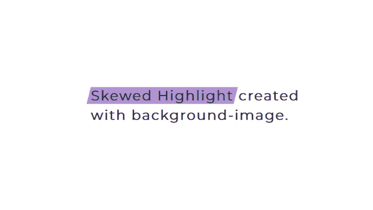

首先，您需要一些文本。这里有一个例子:

```
<body>
    <div class="container">
      <h1>
        <span>Skewed Highlight</span> 
        created with background-image.
      </h1>
    </div>
  </body>

```

将要突出显示的部分包含在`span`标签中。现在，让我们通过添加一个`background-color`来突出显示文本:

```
h1 span {
  background-color: #b393d3;
}

```


上面的代码图像是由前面的代码生成的，但是正如您所看到的，高光没有倾斜。为了使它倾斜，我们将用 [`gradients`](https://blog.logrocket.com/guide-adding-gradients-tailwind-css/) 将文本分成三部分，如下图所示:

```
h1 span {
  background-image: 
    linear-gradient(to bottom right, transparent 50%, #b393d3 50%),
    linear-gradient(#b393d3, #b393d3),
    linear-gradient(to top left, transparent 50%, #b393d3 50%);
}

```

第一个`gradient`在高光的左侧创建一个斜坡。第二个`gradient`两个色挡上颜色相同，保证中间颜色均匀。最后，最后一个`gradient`创造了斜坡的尽头。在这之后，高光将保持笔直，所以我们必须调整大小和[正确定位它](https://blog.logrocket.com/css-reference-guide-position/)。

下面是完整的 CSS 语法:

```
h1 span {
  background-image: linear-gradient(
      to bottom right,
      transparent 50%,
      #b393d3 50%
    ),
    linear-gradient(#b393d3, #b393d3),
    linear-gradient(to top left, transparent 50%, #b393d3 50%);
  background-repeat: no-repeat;
  background-size: 10px 40px, calc(100% - 20px) 40px, 10px 40px;
  background-position: left center, center, right;
}

```

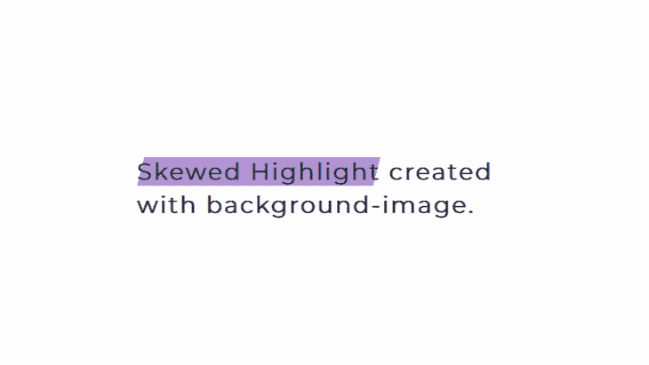

### 向倾斜的高光添加填充

在这一点上，亮点并没有覆盖整个文本。为了解决这个问题，我们将添加一些 [`padding`](https://blog.logrocket.com/css-reference-guide-padding/) 。这将在突出显示的文本和下一个单词之间创建一个空格。要删除它，我们将把`margin`减少与添加的`padding`相同的数量，如下面的代码所示:

```
h1 span {
  padding: 10px;
  margin: -10px;
  background-image: linear-gradient(
      to bottom right,
      transparent 50%,
      #b393d3 50%
    ),
    linear-gradient(#b393d3, #b393d3),
    linear-gradient(to top left, transparent 50%, #b393d3 50%);
  background-repeat: no-repeat;
  background-size: 10px 40px, calc(100% - 20px) 40px, 10px 40px;
  background-position: left center, center, right;
}

```

看笔 [歪斜高亮](https://codepen.io/oscar-jite/pen/NWBgqjo)由 Oscar-Jite([@ Oscar-Jite](https://codepen.io/oscar-jite))
上[码笔](https://codepen.io)。

下面是每个渐变对文本的影响:

`linear-gradient(to bottom right, transparent 50%, red 50%),`:


`linear-gradient(red, red),`:

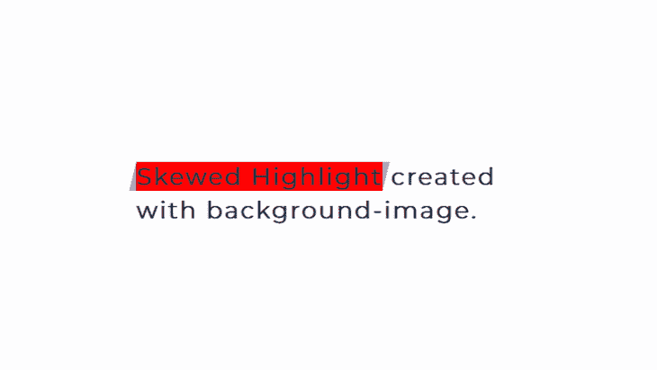

`linear-gradient (to top left, transparent 50%, red 50%);`:

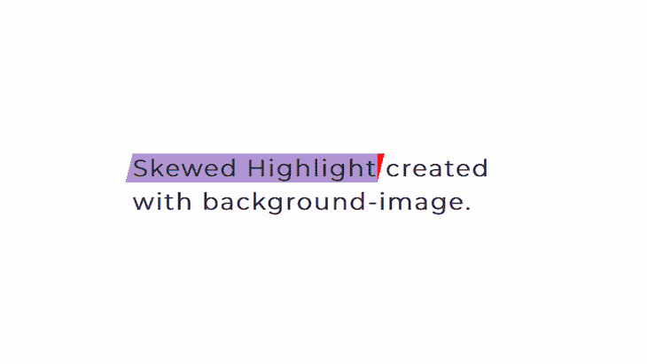

这是用 CSS 创建倾斜高光的一种方法。如果你仔细观察有角度的边缘，它们有点参差不齐，所以我们将尝试另一种方法。

## 使用伪元素创建倾斜高光

对于这种方法，突出显示的是一个 [`:before`伪元素](https://blog.logrocket.com/css-before-after-custom-animations-transitions/)。添加伪元素后，您将使用 [`transform` CSS 属性](https://blog.logrocket.com/deep-dive-css-individual-transform-properties/)在特定方向倾斜元素。

这是 CSS:

```
h1 span {
  position: relative;
  z-index: 1;
}
h1 span::before {
  content: "";
  position: absolute;
  top: 0;
  bottom: 0;
  left: -5px;
  right: -5px;
  background-color: #b393d3;
  transform: skew(-15deg);
  z-index: -1;
}

```

结果如下:

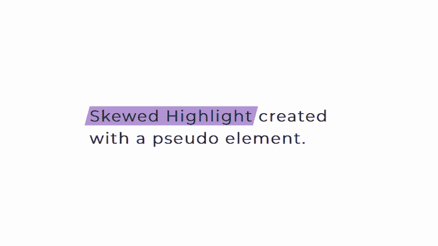

这种方法在高光的所有边上都产生了平滑的边缘。让我们仔细看看:

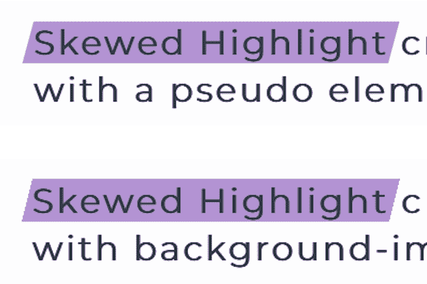

也更容易创建倾斜的高光，因为你主要关心的是倾斜的角度。看看下面这个例子:

看 [CodePen](https://codepen.io) 上 Oscar-Jite([@ Oscar-Jite](https://codepen.io/oscar-jite))
斜插一个伪元素的笔。

添加第二个亮点

### 如果您想添加第二个突出显示，只需用相同的标签包装该部分，并使用相同的样式，如下所示:

现在，你有两个亮点:

```
<div class="container">
    <h1>
      <span>Skewed Highlight</span> 
      created with a <span>pseudo element</span>.
    </h1>
  </div>

```

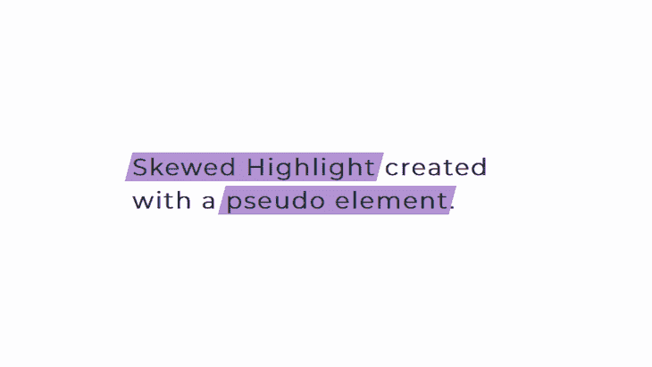

默认情况下，`skew`的方向在 x 轴上。通常，x 轴和 y 轴分别使用`skewX()`和`skewY()`。您也可以将两个值放在括号中，用逗号分隔，从而将它们包含在一起:

现在，我们有一个在 x 轴和 y 轴上都倾斜的高光:

```
h1 span::before {
  transform: skew(15deg,-2deg);
}

```

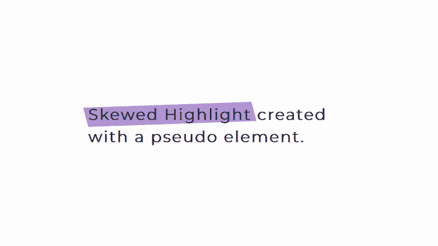

使用`clip-path`创建倾斜高光

## 到目前为止，亮点两端都是倾斜的。然而，如果我们想要一端歪斜或不同的歪斜方向呢？

这可以通过改变`linear-gradient`的方向用`background-image`来完成。但是，正如我们所看到的，渐变会在高光周围产生锯齿状边缘。解决方法是使用 [`clip-path`](https://blog.logrocket.com/guide-to-css-animations-using-clip-path/) 属性来创建高亮的形状。

我们可以用这个[伟大的工具](https://bennettfeely.com/clippy/)做出`clip-path`形状:

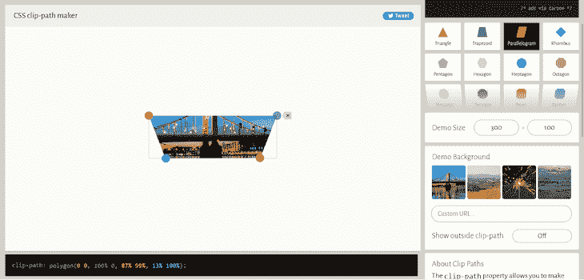

使用相同的文本，让我们倾斜突出显示的一端:

结果如下:

```
h1 span::before {
  content: "";
  position: absolute;
  top: 0;
  bottom: 0;
  left: -5px;
  right: -9px;
  background-color: #b393d3;
  clip-path: polygon(0 0, 100% 0, 97% 100%, 0% 100%);
  z-index: -1;
}

```

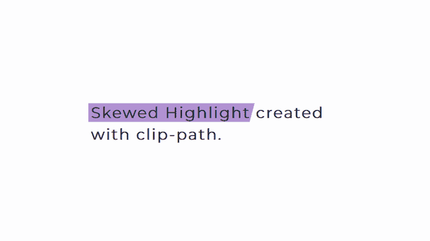

您可以创建几个形状，但是因为文本区域很小，所以使突出显示适合需要反复试验。以下是一些例子:

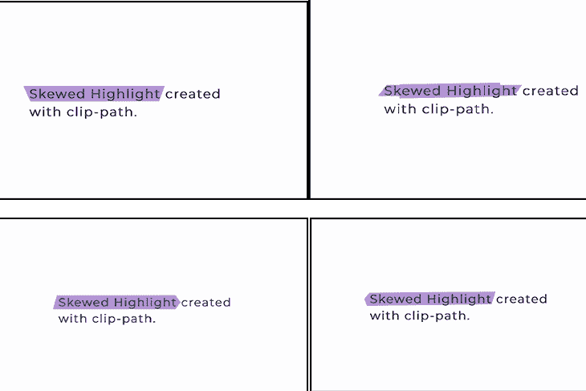

这就对了。我们已经介绍了如何用 CSS 创建一个倾斜的高光。你可以选择适合你的方法，并将其应用于一些文本。

缓解可访问性问题

## 尽管突出显示文本可以改善网站的视觉效果，但是请记住，它不应该影响网站的可访问性。网页可访问性意味着每个人都可以毫无问题地使用你的网站。因为我们处理的是文本，所以主要的可访问性问题围绕着可读性。以下是减轻这些担忧的一些建议。

使用高对比度的颜色

### 突出显示的颜色应该与文本的颜色截然不同。用户阅读文本应该没有问题。寻找色盲者可以辨别的颜色组合也是一个好主意。例如，你应该尽量避免红色和绿色。为了挑选正确的颜色，考虑使用[调色板工具](https://blog.logrocket.com/6-javascript-tools-color-generation/)。

文本到语音转换功能

### 你应该考虑的另一群人是那些有视觉障碍的人，他们可能需要阅读软件。文本到语音转换软件应该能够检测到突出显示的文本。当使用 CSS 时，记住可访问性是很重要的。你可以参考我们的[指南，用 CSS](https://blog.logrocket.com/a-guide-to-improving-web-accessibility-with-css/) 提高网页可访问性，了解更多。

浏览器支持

## 我们使用了一些不同的属性，所以了解它们在不同浏览器上的[兼容性很重要。所有现代浏览器都支持`linear-gradient`，对于 Safari，你需要前缀`-webkit-`，对于 Firefox，你需要前缀`-moz-`，对于 Opera，你需要前缀`-o-`。](https://caniuse.com/)

每个现代浏览器都支持`:before`伪元素。Internet Explorer v7 及以下版本不支持，你要记住 Internet Explorer v8 不支持`content`。

函数有很好的支持，但是需要 Safari、Opera 和 Firefox 的厂商前缀。Internet Explorer v10 及更低版本不支持`clip-path`属性。最后，复杂的形状有不同的支持。

结论

## 高亮可以吸引人们对重要信息的注意，或者你可能只是想给你的网页添加一点颜色。你可以使用带有`background-image`属性的渐变或者在伪元素上使用`skew`来创建一个倾斜的高光。如果你想通过改变形状来增加亮点的味道，T2 可以帮你。

你的前端是否占用了用户的 CPU？

## 随着 web 前端变得越来越复杂，资源贪婪的特性对浏览器的要求越来越高。如果您对监控和跟踪生产环境中所有用户的客户端 CPU 使用、内存使用等感兴趣，

.

[try LogRocket](https://lp.logrocket.com/blg/css-signup)

LogRocket 就像是网络和移动应用的 DVR，记录你的网络应用或网站上发生的一切。您可以汇总和报告关键的前端性能指标，重放用户会话和应用程序状态，记录网络请求，并自动显示所有错误，而不是猜测问题发生的原因。

[](https://lp.logrocket.com/blg/css-signup)[https://logrocket.com/signup/](https://lp.logrocket.com/blg/css-signup)

现代化您调试 web 和移动应用的方式— [开始免费监控](https://lp.logrocket.com/blg/css-signup)。

Modernize how you debug web and mobile apps — [Start monitoring for free](https://lp.logrocket.com/blg/css-signup).