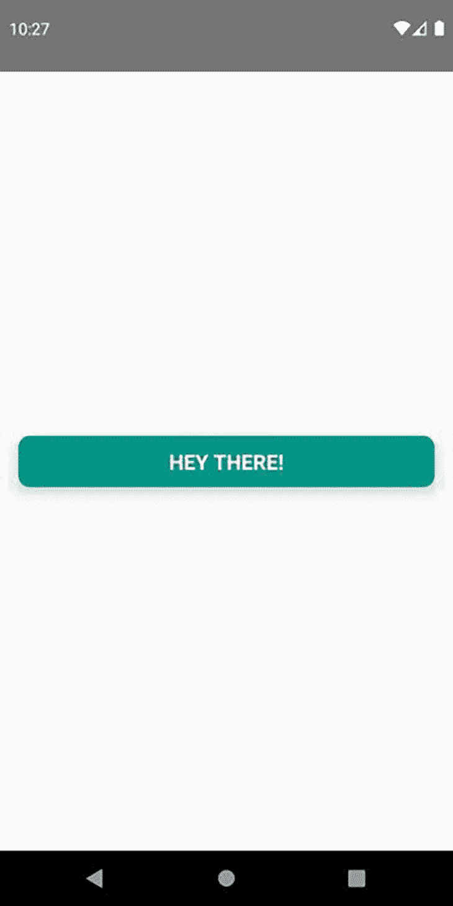
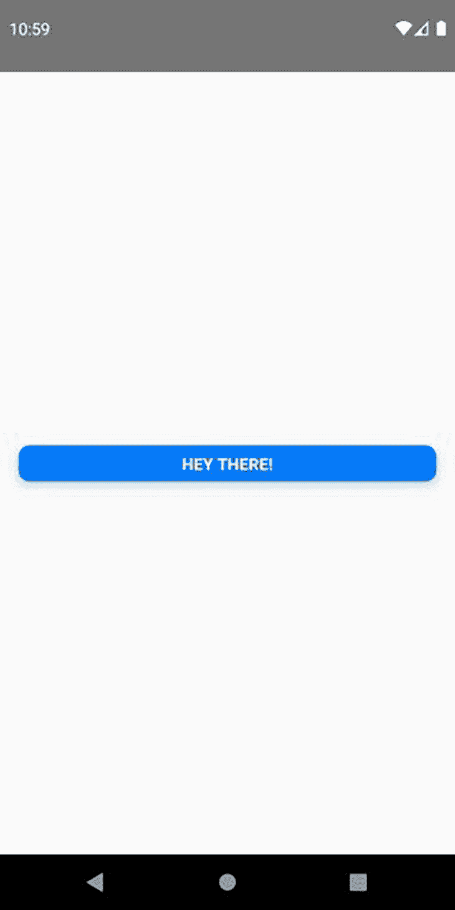
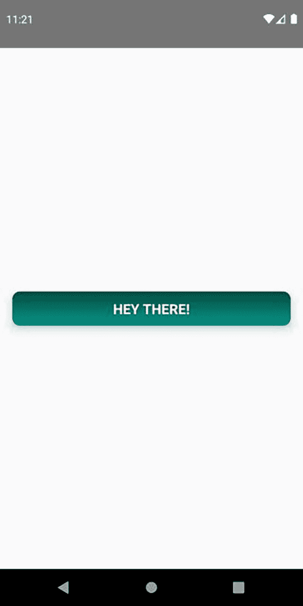
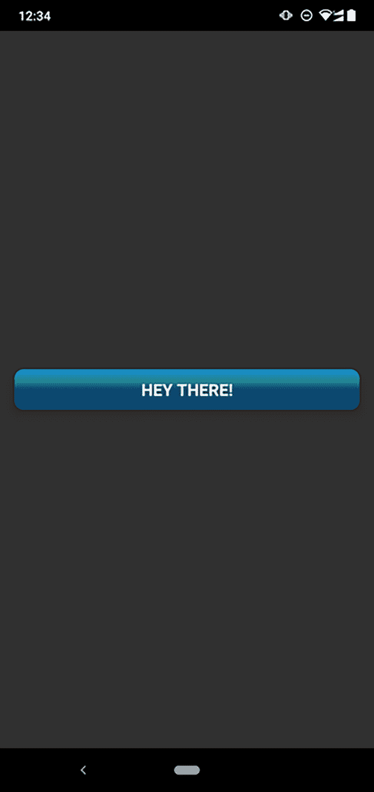
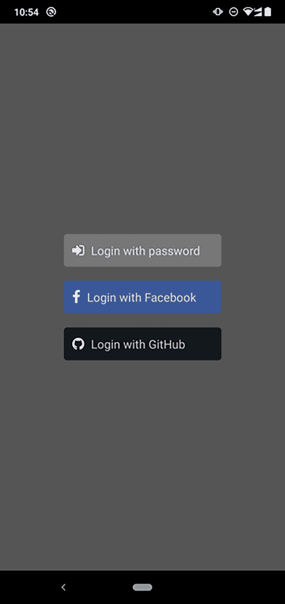
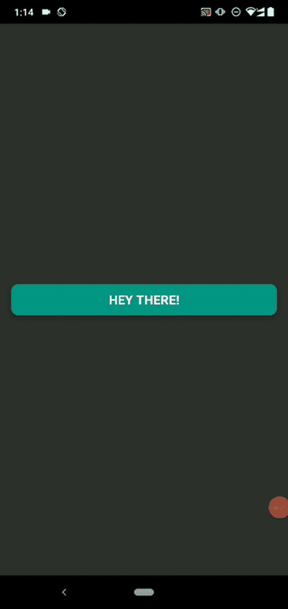
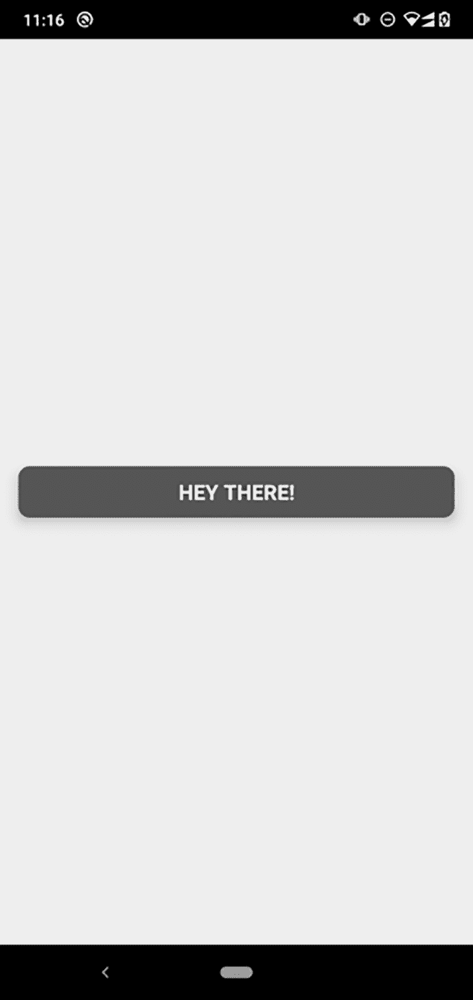

# 如何在 React Native - LogRocket 博客中创建和设计自定义按钮

> 原文：<https://blog.logrocket.com/create-style-custom-buttons-react-native/>

***编者按*** *:本帖更新于 2022 年 1 月 14 日，旨在改进教程并包括一个“现代”按钮样式示例。*

React Native 是构建原生移动应用程序的优秀框架。它允许你构建可以在 iOS 和 Android 平台上运行的应用，但是核心 UI 组件如`<Button />`在每个平台上会有所不同。这是因为 React Native 呈现特定于平台的 UI 元素，结果是样式和定制选项有限(React Native 官方[文档](https://reactnative.dev/docs/button)也承认这一点)。

出于这一原因以及许多其他原因，知道如何创建无论在什么操作系统下看起来都一致的按钮是非常重要的。在本指南中，我们将带您了解如何在 React Native 中创建各种类型的自定义按钮，包括:

*   使用`<TouchableOpacity />`组件构建具有不同背景颜色、大小、边框样式和文本样式的按钮
*   带有颜色渐变图案的样式按钮
*   设计带有矢量图标的现代按钮(基本的登录按钮，包括带有脸书和 GitHub 选项的按钮)
*   带有 CSS-in-JS 库的 CSS 样式的按钮

## 设置您的项目

运行以下命令开始。

```
npx react-native init CustomButtonDemo

```

从`App.js`文件中删除所有样板代码，并添加以下代码。

```
import React from "react";
import { View, Button, StyleSheet } from "react-native";

const App = () => {
  return (
    <View style={styles.screenContainer}>
      <Button title="Hey there!" />
    </View>
  );
};

const styles = StyleSheet.create({
  screenContainer: {
    flex: 1,
    justifyContent: "center",
    padding: 16
  }
});

export default App;

```

在上面的代码块中，一个核心组件`<Button />`被声明并包装在一个容器中。`StyleSheet`是 React Native framework 提供的 API，作为对 CSS 样式表的抽象。

## 使用`<TouchableOpacity />`创建自定义按钮组件

现在您已经设置了主屏幕，是时候将注意力转向自定义按钮组件了。

```
const AppButton = props => (
    // ...
)

```

将自定义按钮组件命名为`AppButton`。

从`react-native`进口`<TouchableOpacity />`和`<Text />`组件。

```
import { View, Button, StyleSheet, TouchableOpacity, Text } from "react-native";

```

要创建定制按钮，您需要定制`<TouchableOpacity />`组件并在其中包含`<Text />`组件来显示按钮文本。

```
const AppButton = ({ onPress, title }) => (
  <TouchableOpacity onPress={onPress} style={styles.appButtonContainer}>
    <Text style={styles.appButtonText}>{title}</Text>
  </TouchableOpacity>
);

```

接下来，创建`StyleSheet`属性来设计按钮的样式。

```
const styles = StyleSheet.create({
  // ...
  appButtonContainer: {
    elevation: 8,
    backgroundColor: "#009688",
    borderRadius: 10,
    paddingVertical: 10,
    paddingHorizontal: 12
  },
  appButtonText: {
    fontSize: 18,
    color: "#fff",
    fontWeight: "bold",
    alignSelf: "center",
    textTransform: "uppercase"
  }
});

```

自定义按钮现在应该如下所示:



`<TouchableOpacity />`顾名思义，是一个可触摸的组件，意思是它能对用户的触摸做出反应。当您按下按钮时，不透明度会降低。你可以通过给`<TouchableOpacity />`组件传递一个`activeOpacity`道具来控制不透明度。

```
const AppButton = ({ onPress, title }) => (
  <TouchableOpacity
    activeOpacity={0.8}
    onPress={onPress}
    style={styles.appButtonContainer}
  >
    <Text style={styles.appButtonText}>{title}</Text>
  </TouchableOpacity>
);

```

如果您想要更改应用程序中所有自定义按钮的不透明度，请使用`defaultProps`属性。`defaultProps`是一个 React 组件属性，为 prop 参数设置默认值。

导入`TouchableOpacity`后，在文件顶部添加下面一行。

```
TouchableOpacity.defaultProps = { activeOpacity: 0.8 };

```

`onPress` prop 期望用户按下按钮时执行的函数或函数引用。

这一部分的完整代码如下:

```
import React from "react";
import { View, Button, StyleSheet, TouchableOpacity, Text } from "react-native";

TouchableOpacity.defaultProps = { activeOpacity: 0.8 };

const AppButton = ({ onPress, title }) => (
  <TouchableOpacity onPress={onPress} style={styles.appButtonContainer}>
    <Text style={styles.appButtonText}>{title}</Text>
  </TouchableOpacity>
);

const App = () => {
  return (
    <View style={styles.screenContainer}>
      <AppButton title="Hey there!" size="sm" backgroundColor="#007bff" />
    </View>
  );
};

const styles = StyleSheet.create({
  screenContainer: {
    flex: 1,
    justifyContent: "center",
    padding: 16
  },
  appButtonContainer: {
    elevation: 8,
    backgroundColor: "#009688",
    borderRadius: 10,
    paddingVertical: 10,
    paddingHorizontal: 12
  },
  appButtonText: {
    fontSize: 18,
    color: "#fff",
    fontWeight: "bold",
    alignSelf: "center",
    textTransform: "uppercase"
  }
});

export default App;

```

## 通过添加更多的道具，在 React Native 中为按钮添加样式

因为它是一个定制的按钮组件，你可以自由添加额外的道具。例如，您可以添加一个道具来更改按钮大小或更改背景颜色。

```
const AppButton = ({ onPress, title, size, backgroundColor }) => (
  <TouchableOpacity
    onPress={onPress}
    style={[
      styles.appButtonContainer,
      size === "sm" && {
        paddingHorizontal: 8,
        paddingVertical: 6,
        elevation: 6
      },
      backgroundColor && { backgroundColor }
    ]}
  >
    <Text style={[styles.appButtonText, size === "sm" && { fontSize: 14 }]}>
      {title}
    </Text>
  </TouchableOpacity>
);

// ...
<AppButton title="Hey there!" size="sm" backgroundColor="#007bff" />;

```

您将在屏幕上看到以下结果。



## 带有线性渐变背景的自定义按钮

默认情况下，React Native 没有在容器中创建线性渐变背景的 API。幸运的是，React Native 有另一个实用程序库，可以用来创建线性渐变颜色。它非常灵活，并提供了各种道具来根据您的需要定制您的预建组件的渐变样式。你可以在 [GitHub](https://github.com/react-native-community/react-native-linear-gradient#readme) 上了解更多关于线性渐变库的内容。

运行以下命令将该库包含在您的项目中。

```
npm i react-native-linear-gradient

```

接下来，从`react-native-linear-gradient`库中导入`<LinearGradient />`组件。

```
import LinearGradient from "react-native-linear-gradient";

```

您需要在`<AppButton />`组件中做一些调整。将`<TouchableOpacity />`组件缠绕在`<LinearGradient />`组件上，并将样式道具添加到`<LinearGradient />`组件上。

```
const AppButton = ({ onPress, title }) => (
  <TouchableOpacity onPress={onPress}>
    <LinearGradient
      colors={["#004d40", "#009688"]}
      style={styles.appButtonContainer}
    >
      <Text style={styles.appButtonText}>{title}</Text>
    </LinearGradient>
  </TouchableOpacity>
);

```

`LinearGradient`中的`colors`属性接受一个数组，该数组包含将用于创建线性渐变的颜色值。



请查看下面这一部分的完整代码。

```
import React from "react";
import { View, Button, StyleSheet, TouchableOpacity, Text } from "react-native";
import LinearGradient from "react-native-linear-gradient";

TouchableOpacity.defaultProps = { activeOpacity: 0.8 };

const AppButton = ({ onPress, title }) => (
  <TouchableOpacity onPress={onPress}>
    <LinearGradient
      colors={["#004d40", "#009688"]}
      style={styles.appButtonContainer}
    >
      <Text style={styles.appButtonText}>{title}</Text>
    </LinearGradient>
  </TouchableOpacity>
);

const App = () => {
  return (
    <View style={styles.screenContainer}>
      <AppButton title="Hey there!" size="sm" backgroundColor="#007bff" />
    </View>
  );
};

const styles = StyleSheet.create({
  screenContainer: {
    flex: 1,
    justifyContent: "center",
    padding: 16
  },
  appButtonContainer: {
    elevation: 8,
    borderRadius: 10,
    paddingVertical: 10,
    paddingHorizontal: 12
  },
  appButtonText: {
    fontSize: 18,
    color: "#fff",
    fontWeight: "bold",
    alignSelf: "center",
    textTransform: "uppercase"
  }
});

export default App;

```

让我们看另一个例子。下面的`<AppButton/>`定义创建了一个基于渐变样式的定制按钮，带有蓝色渐变和霓虹绿色光线。

```
const AppButton = ({ onPress, title }) => (
  <TouchableOpacity onPress={onPress}>
    <LinearGradient
      colors={["#1387d4", "#259399", "#0b466e"]}
      start={{x: 0, y: 0}} // Gradient starting coordinates
      end={{x: 0, y: 0.5}} // Gradient ending coordinates
      style={styles.appButtonContainer}
    >
      <Text style={styles.appButtonText}>{title}</Text>
    </LinearGradient>
  </TouchableOpacity>
);

```

这里我们可以使用`start`和`end`道具来控制渐变位置。上面的组件定义产生了下面的按钮。



同样，您可以构建自己的渐变按钮样式，以满足设计原型中的样式要求。

## 用矢量图标构建自定义按钮

React 本地开发人员通常必须根据他们收到的设计原型创建带有图标的按钮。这些图标按钮广泛用于登录屏幕、仪表板和各种移动应用程序屏幕。现在，我们将使用几个矢量图标来创建一些按钮。

创建这些特殊按钮有两种主要方法:

1.  通过用`<View/>`包装`<Text/>`元素和`<Image/>`元素，从头开始构建一个按钮组件
2.  使用库中预先构建的组件

你可以用 [`react-native-vector-icons`库](https://github.com/oblador/react-native-vector-icons)轻松创建这些类型的按钮。

让我们为登录页面创建几个不同的按钮。这是我们完成后登录页面的外观。



首先，用下面的命令添加矢量图标库。

```
npm i react-native-vector-icons

```

接下来，从库中导入`<Icon />`组件，如下所示。

```
import Icon from 'react-native-vector-icons/FontAwesome';

```

现在我们可以用下面的定义创建一个可重用的图标按钮。

```
const AppButton = ({ onPress, icon, title, backgroundColor }) => (
  <View style={styles.appButtonContainer}>
    <Icon.Button
      name={icon}
      backgroundColor={backgroundColor}
      onPress={onPress}
      style={styles.appButton}
    >
      <Text style={styles.appButtonText}>{title}</Text>
    </Icon.Button>
  </View>
);

```

图标按钮组件准备就绪。可以通过发送不同的道具来配置:`onPress`、`icon`、`title`、`backgroundColor`。查看下面示例登录页面的源代码。

```
import React from "react";
import { View, StyleSheet, Text } from "react-native";
import Icon from 'react-native-vector-icons/FontAwesome';

const AppButton = ({ onPress, icon, title, backgroundColor }) => (
  <View style={styles.appButtonContainer}>
    <Icon.Button
      name={icon}
      backgroundColor={backgroundColor}
      onPress={onPress}
      style={styles.appButton}
    >
      <Text style={styles.appButtonText}>{title}</Text>
    </Icon.Button>
  </View>
);

const App = () => {
  return (
    <View style={styles.screenContainer}>
      <AppButton icon="sign-in" title="Login with password" backgroundColor="#777"/>
      <AppButton icon="facebook" title="Login with Facebook" backgroundColor="#3b5998"/>
      <AppButton icon="github" title="Login with GitHub" backgroundColor="#14191e"/>
    </View>
  );
};

const styles = StyleSheet.create({
  screenContainer: {
    flex: 1,
    justifyContent: "center",
    padding: 80,
    backgroundColor: "#555",
  },
  appButton: {
    padding: 12,
  },
  appButtonText: {
    fontSize: 17,
  },
  appButtonContainer: {
    paddingVertical: 10,
    paddingHorizontal: 12,
  },
});

export default App;

```

上面的源代码通过发送不同的道具来配置同一个`<AppButton/>`组件定义。

## 使用状态控制按钮样式

与任何 React 应用程序一样，您可以基于状态的当前值向组件添加样式。例如，如果您想在按钮被按下后的一段时间内禁用该按钮，该按钮必须具有禁用的背景颜色，以便用户知道它暂时处于非活动状态。

在`StyleSheet`对象中添加一个样式属性来表示禁用的颜色。在这个例子中，我们将使用黑色。

```
const styles = StyleSheet.create({
  // ...
  appButtonDisabled: {
    backgroundColor: "#000"
  }
});

```

接下来，重构`<AppButton />`组件并使用[的`useState`钩子](https://blog.logrocket.com/a-guide-to-usestate-in-react-ecb9952e406c/)来改变禁用状态。

```
const AppButton = ({ title }) => {
  const [isDisabled, setDisabled] = useState(false);

  const handlePress = () => {
    setDisabled(true);
    setTimeout(() => setDisabled(false), 3000);
  };

  return (
    <TouchableOpacity
      onPress={handlePress}
      style={[
        styles.appButtonContainer,
        isDisabled && styles.appButtonDisabled
      ]}
      disabled={isDisabled}
    >
      <Text style={styles.appButtonText}>{title}</Text>
    </TouchableOpacity>
  );
};

```

您可以向`TouchableOpacity`组件传递一个`disabled`属性来禁用`onPress`行为。您可以将一组样式对象传递给`style`道具。

当`isDisabled`设置为`true`时，可以使用`&&`操作符将`appButtonDisabled`属性添加到`style`道具数组中。

上面的实现通过显示不同的样式来禁用按钮三秒钟，如下所示。



## 如何用`styled-components`设计原生按钮

是一个 CSS-in-JS 库，使你能够用自己的风格编写每个组件，并将代码封装在一个单独的位置。

React Native 遵循特定的规范来设计这些组件的样式。比如所有的 CSS 属性名都必须写成`camelCase`——`background-color`应该指定为`backgroundColor`，`border-width`为`borderWidth`等等。

对于一个从 web 开发背景开始着手移动应用程序开发的开发人员来说，这可能有点令人迷惑。`styled-components`库使您能够编写用于样式化 React 本地组件的本地 CSS。在幕后，`styled-components`只是将 CSS 文本转换成 React 本机`StyleSheet`对象。

运行以下命令来安装`styled-components`。

```
yarn add styled-components

```

导入库。

```
import styled from "styled-components";

```

重构代码以实现`styled-components`。

分别用`ButtonContainer`和`ButtonText`更换`TouchableOpacity`和`Text`组件。这些新组件将使用来自`styled-components`的语法创建。

```
const AppButton = ({ onPress, title }) => (
  <ButtonContainer onPress={onPress}>
    <ButtonText>{title}</ButtonText>
  </ButtonContainer>
);

```

`styled-components`使用带标签的模板文字，通过反斜线(`)来设置组件的样式。每个样式化的组件都必须有一个 React 本地组件与之相连。

```
const ButtonContainer = styled.TouchableOpacity``;

const ButtonText = styled.Text``;

```

在反斜线内，添加 CSS 规则。

```
const ButtonContainer = styled.TouchableOpacity`
  elevation: 8;
  border-radius: 10px;
  padding-vertical: 10px;
  padding-horizontal: 12px;
`;

const ButtonText = styled.Text`
  font-size: 18;
  color: #fff;
  font-weight: bold;
  align-self: center;
  text-transform: uppercase;
`;

```

将所有内容放在一起，您的代码应该类似于按钮的包装视图:

```
import React from "react";
import { View, Button, TouchableOpacity, Text } from "react-native";
import styled from "styled-components";

TouchableOpacity.defaultProps = { activeOpacity: 0.8 };

const ButtonContainer = styled.TouchableOpacity`
  elevation: 8;
  border-radius: 10px;
  padding-vertical: 10px;
  padding-horizontal: 12px;
  background-color: #555;
`;

const ButtonText = styled.Text`
  font-size: 18px;
  color: #fff;
  font-weight: bold;
  align-self: center;
  text-transform: uppercase;
`;

const AppContainer = styled.View`
  flex: 1;
  justify-content: center;
  padding: 16px;
  background-color: #eee;
`;

const AppButton = ({ onPress, title }) => (
  <ButtonContainer onPress={onPress}>
    <ButtonText>{title}</ButtonText>
  </ButtonContainer>
);

const App = () => {
  return (
    <AppContainer>
      <AppButton title="Hey there!"/>
    </AppContainer>
  );
};

export default App;

```

上面的源代码使用来自`styled-components`库的类似 CSS 的语法生成了下面的应用程序。



Emotion 也是一个 CSS-in-JS 库，支持对 React 原生组件进行样式化，因此您可以使用 [`@emotion-native`包](https://www.npmjs.com/package/@emotion/native)用 CSS 语法创建自定义 React 原生按钮。Emotion 以非常相似的语法提供了`styled-components`提供的几乎所有特性。

## 结论

其他一些包装了`<TouchableOpacity/>`的 npm 包为 React Native 提供了预建的定制按钮，具有一些特性，如图标支持、主题化、定制颜色等。但是，这些库在开发人员社区中不是很受欢迎，因为自定义按钮创建和全功能 UI 工具包很容易。例如，您可以使用本教程中介绍的步骤轻松构建任何自定义按钮。另一方面，你可以使用像 Native Base 这样的全功能 UI 套件，它提供了许多预置的[自定义按钮样式](https://docs.nativebase.io/button)。

作为开发人员，您必须构建 UI 组件来匹配您的设计团队提出的任何参考或设计。你有责任让 UI 组件看起来和你的客户的计划或原型一样精确。

您可以做的事情还很多，但是本指南中的步骤将帮助您在开始使用 React Native 创建自定义 UI 组件时找到立足点。

## [LogRocket](https://lp.logrocket.com/blg/react-native-signup) :即时重现 React 原生应用中的问题。

[](https://lp.logrocket.com/blg/react-native-signup)

[LogRocket](https://lp.logrocket.com/blg/react-native-signup) 是一款 React 原生监控解决方案，可帮助您即时重现问题、确定 bug 的优先级并了解 React 原生应用的性能。

LogRocket 还可以向你展示用户是如何与你的应用程序互动的，从而帮助你提高转化率和产品使用率。LogRocket 的产品分析功能揭示了用户不完成特定流程或不采用新功能的原因。

开始主动监控您的 React 原生应用— [免费试用 LogRocket】。](https://lp.logrocket.com/blg/react-native-signup)