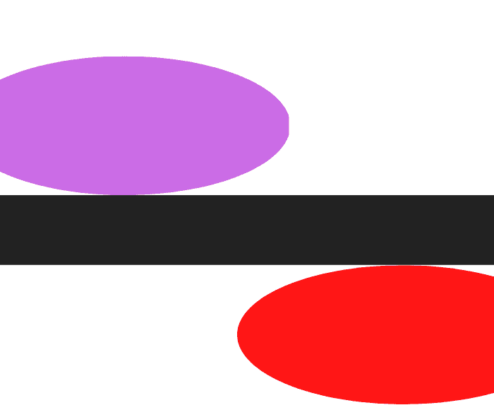
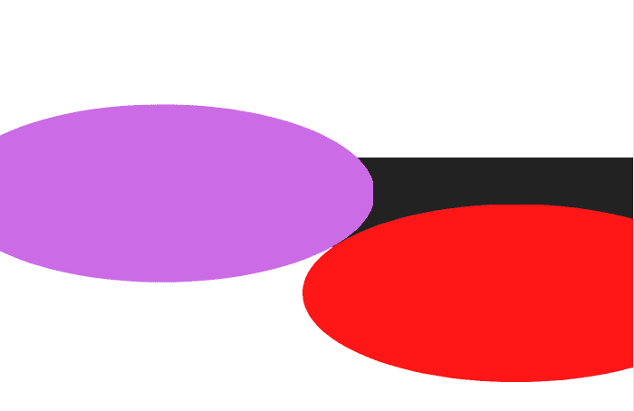
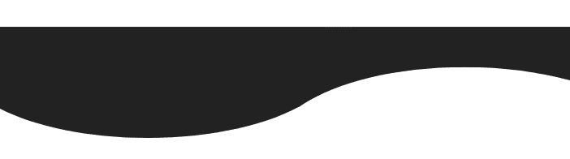
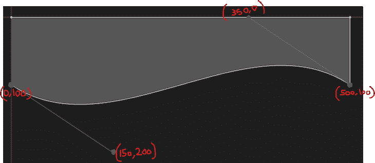

# 如何使用 CSS 和 SVG 创建波浪背景

> 原文：<https://blog.logrocket.com/create-wavy-background-using-css-svg/>

有趣、吸引眼球的视觉效果可以让你的网站给浏览者留下深刻印象。如今，波浪背景是网页设计的流行趋势，然而，波浪是出了名的难以实现的形状。在本文中，我们将学习如何使用 CSS 和 SVG 创建几种简单的 waves，然后将它们实现到实际的 UI 中。

*向前跳转:*

## 项目概述

创建波浪形状背后的基本思想是创建一个矩形元素，上下各有一个椭圆形:



如下图所示，通过重叠矩形顶部的两个椭圆，我们可以创建一个波浪的形状:



如果我们把紫色的椭圆形变成黑色，把红色的椭圆形变成白色，我们的波浪就完成了！我们可以使用`clip-path`移除矩形顶部多余的紫色部分，我们将在后面讨论:



## 用 CSS 创建波浪

为了在 CSS 中创建这种类型的波浪效果，首先，我们将创建一个`wave` div，它将有一个相对位置和一个固定的高度和宽度。然后，我们将为紫色和红色椭圆创建两个伪类。我们将根据上面的图片给每个人一个绝对的位置，以及一个固定的高度和宽度。

我们将使用`top`属性来上下移动椭圆，并使用`border-radius`给它们一个圆形:

```
<head>
    <style>
        body {
            overflow: hidden;
            margin: 0;
            padding: 0;
        }

        .wave {
            display: block;
            position: relative;
            height: 40px;
            width: 100%;
            background: rgb(57, 27, 112);
            transform: scale(1, 1);
        }

        .wave:before {
            content: "";
            display: block;
            position: absolute;
            border-radius: 100%;
            width: 100%;
            height: 300px;
            background-color: white;
            right: -25%;
            top: 20px
        }

        .wave:after {
            content: "";
            display: block;
            position: absolute;
            border-radius: 100%;
            width: 100%;
            height: 300px;
            background-color: rgb(57, 27, 112);
            left: -25%;
            top: -240px;
            clip-path: ellipse(100% 15% at -15% 100%);
        }
    </style>
</head>
<body>
    <div class="wave">
    </div>
</body>

```

这里有一些重要的事情需要注意。首先，您不必更改代码中的任何值来手动调整波浪的高度和宽度。相反，我们在`wave`类中有一个`transform`尺度，我们可以用它来放大或缩小`x`和`y`方向的波形。

我们在`after`元素中使用`clip-path`,这样紫色的圆圈，如上图所示，不会超过矩形的高度:

参见钢笔 [伪元素 CSS 波](https://codepen.io/saleh-mubashar/pen/vYaNwmZ)由萨利赫-穆巴沙尔([@萨利赫-穆巴沙尔](https://codepen.io/saleh-mubashar) )
上 [CodePen](https://codepen.io) 。

## 用 SVG 创建波

可以说，使用 SVG 比使用 CSS 更容易创建像波浪这样的形状和其他类似的复杂设计。让我们在 SVG 中创建同样的波形。

首先，我们需要对 SVG 形状如何工作有一个基本的了解。SVG `path`元素将为我们完成大部分工作。下面是我们将使用的命令的简要概述:

*   `M`:移动到；需要两个`x`和`y`参数
*   `L`:行到；采用两个`x`和`y`参数，创建一条从当前位置到新位置的线
*   `C`:曲线到；将三组坐标作为参数来创建贝塞尔曲线

现在，让我们创建一个简单的波:

参见 [CodePen 上](https://codepen.io) [@saleh-mubashar](https://codepen.io/saleh-mubashar) )
笔[简单 SVG 波](https://codepen.io/saleh-mubashar/pen/OJwMXMd)由 Saleh-Mubashar。

在 HTML 中，你可以看到我们用来创建这个 wave 的简单的四行 SVG 代码。我们来分解一下。

`viewBox`SVG 中的元素基本上决定了 SVG 整体的宽度和高度。对于`path`，我们首先在`0,100`位置有一个`M`命令。基本上，我们正在向坐标`0,100`移动。`100`表示 y 轴下方的`100 px`。

接下来，我们有一条贝塞尔曲线，`C`。我们给了它三个坐标，代表波的最大和最小点。最后，`L`在矩形的左右两边创建直线。

一般来说，创建 wave、可视化 wave 以及使用 SVG 的一个好方法是使用 SVG 路径编辑器。看一看下面的[我们的 wave](https://yqnn.github.io/svg-path-editor/#P=M0,100C150,200350,0500,100L500,00L_0,0) :



## 示例设计

最后，我们将使用 CSS 和 SVG waves 创建一个简单的 web 设计。该设计非常简单，由一个标题、一些文本和一个虚拟按钮组成，但是您可以根据需要在其上进行构建。对于布局，我们将使用 display flex。我们将在蓝色背景的底部实现波浪。

使用 CSS 方法，我们只需在容器后添加带有类`wave`的 div:

参见 [CodePen](https://codepen.io) 上 Saleh-Mubashar([@ Saleh-Mubashar](https://codepen.io/saleh-mubashar))
的笔 [CSS 波浪设计](https://codepen.io/saleh-mubashar/pen/qBybRQK)。

SVG 方法类似，但是我们直接在容器后面添加 SVG 代码。结果将是相同的:

参见 [CodePen](https://codepen.io) 上 Saleh-Mubashar([@ Saleh-Mubashar](https://codepen.io/saleh-mubashar))
的 Pen [SVG Wave Design](https://codepen.io/saleh-mubashar/pen/GRBoWmp) 。

## SVG 分层波

另一种常见的波浪设计包括使用多个波浪来形成分层效果。为了重现这一点，我们将制作三个相似的波，只是在振幅和频率上略有不同。下面是第一波的代码:

```
<svg viewBox="0 0 500 200">
  <path d="M 0 50 C 150 150 300 0 500 80 L 500 0 L 0 0" fill="rgb(57, 27, 112)"></path>
</svg>

```

它类似于我们之前讨论过的那个，只是高度更小。对于第二波，我们将创建另一个类似的波，但有一些微小的不同:

```
<path d="M 0 50 C 150 150 330 -30 500 50 L 500 0 L 0 0" fill="#0E7452" opacity="0.8"></path>

```

下面是第三次浪潮的路径:

```
 <path d="M 0 50 C 215 150 250 0 500 100 L 500 0 L 0 0" fill="#0E7452" opacity="0.5"></path>

```

为了让它看起来更好，你可以调整每个波浪的不透明度和填充度。为了创建分层效果，我们不会为第二波和第三波创建单独的 SVG 元素。相反，我们将把它们的路径添加到为第一波创建的 SVG 元素中。

下面是组合代码:

```
<svg viewBox="0 0 500 200">
  <path d="M 0 50 C 150 150 300 0 500 80 L 500 0 L 0 0" fill="rgb(57, 27, 112)"></path>
  <path d="M 0 50 C 150 150 330 -30 500 50 L 500 0 L 0 0" fill="#0E7452" opacity="0.8"></path>
 <path d="M 0 50 C 215 150 250 0 500 100 L 500 0 L 0 0" fill="#0E7452" opacity="0.5"></path>
</svg>

```

参见 [CodePen](https://codepen.io) 上 Saleh-Mubashar([@ Saleh-Mubashar](https://codepen.io/saleh-mubashar))
的 Pen [SVG 分层波](https://codepen.io/saleh-mubashar/pen/oNMzBmw)。

有几个在线工具可以帮助你创建 SVG 波形。其中包括:

1.  SVGPathEditor :你可以创建一个 SVG 路径，实时查看它，并使用图形编辑它，或者你可以使用接口创建一个新的 wave，而不必编写任何代码
2.  [Get Waves](https://getwaves.io/) :一个有用的随机波发生器，输出 SVG 代码
3.  SVG Wave :一个有用的 wave creator，它可以让你对 Wave 进行分层和样式化，而不需要编写 SVG

## 结论

众所周知，波浪很难制造。在本教程中，我们学习了如何使用 CSS 和 SVG 创建一些不同类型的波。如果你决定在你的项目中使用你在本教程中学到的任何东西，请留下评论，让我知道。感谢阅读！

## 你的前端是否占用了用户的 CPU？

随着 web 前端变得越来越复杂，资源贪婪的特性对浏览器的要求越来越高。如果您对监控和跟踪生产环境中所有用户的客户端 CPU 使用、内存使用等感兴趣，

[try LogRocket](https://lp.logrocket.com/blg/css-signup)

.

[](https://lp.logrocket.com/blg/css-signup)[https://logrocket.com/signup/](https://lp.logrocket.com/blg/css-signup)

LogRocket 就像是网络和移动应用的 DVR，记录你的网络应用或网站上发生的一切。您可以汇总和报告关键的前端性能指标，重放用户会话和应用程序状态，记录网络请求，并自动显示所有错误，而不是猜测问题发生的原因。

现代化您调试 web 和移动应用的方式— [开始免费监控](https://lp.logrocket.com/blg/css-signup)。