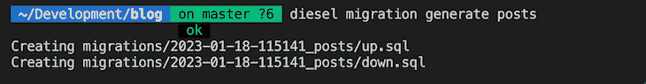
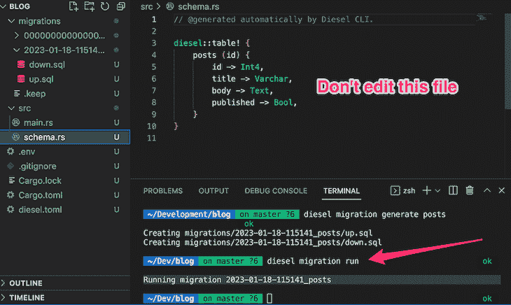
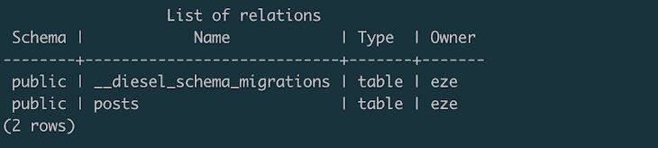
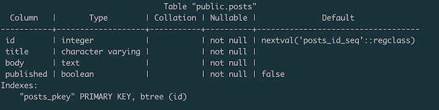
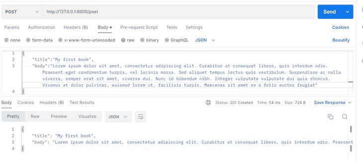
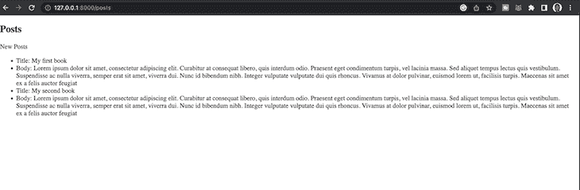

# 如何用 Rocket 和 Diesel 在 Rust 中创建 web 应用程序

> 原文：<https://blog.logrocket.com/create-web-app-rust-rocket-diesel/>

根据 [Stack Overflow](https://insights.stackoverflow.com/survey) 的一项调查，七年来， [Rust](https://blog.logrocket.com/tag/rust/) 编程语言一直被评为最受欢迎的编程语言。它的流行源于它对[安全性、性能、内置内存管理和并发特性](https://blog.logrocket.com/why-is-rust-popular/)的关注。所有这些原因使它成为构建 web 应用程序的绝佳选择。

然而，Rust 是一种系统编程语言。如何使用它来创建 web 应用程序？进入[火箭](https://rocket.rs/)、 [Actix](http://actix.rs) 、 [Warp](https://docs.rs/warp/latest/warp/) 等等。这些 web 框架使开发人员能够使用 Rust 创建 web 应用程序。

Rocket 和 Diesel 为在 Rust 中构建 web 应用程序提供了强大而高效的工具集。在本文的其余部分，我们将介绍如何使用 Rust、Rocket 和 Diesel 创建 web 应用程序。我们将介绍如何设置开发环境、检查不同的组件、设置 API 端点以及呈现 HTML。

为了从这件作品中获得终极价值，你需要对 Rust 有一个[的基本了解。您还需要安装并运行 Rust 和 PostgreSQL 数据库。你可以按照](https://blog.logrocket.com/getting-up-to-speed-with-rust/)[的文档](https://doc.rust-lang.org/book/ch01-01-installation.html)为你的操作系统安装 Rust，从[官网](https://www.postgresql.org/download/)为你的操作系统下载 PostgreSQL。如果您使用的是 macOS，则可以通过在终端上运行以下命令来快速安装并启动 PostgreSQL 数据库:

```
brew update && brew install postgresql && brew services start postgresql

```

让我们开始吧！

*向前跳转:*

## 火箭和柴油介绍

Rocket 是一个 [Rust web framework](https://blog.logrocket.com/rust-web-apps-using-rocket-framework/) ，内置了开发人员创建高效安全的 web 应用程序所需的工具，同时保持灵活性、可用性、内存和类型安全，语法简洁明了。

作为大多数 web 框架的惯例，Rocket 允许您使用[对象关系映射器](https://blog.logrocket.com/11-database-drivers-and-orms-for-rust-that-are-ready-for-production/) (ORMs)作为应用程序的数据访问层。 [Rocket 是 ORM 不可知的](https://rocket.rs/v0.5-rc/guide/state/#databases)，这意味着你可以使用任何你选择的 Rust ORM 来访问你的 Rocket 应用程序中的数据库。在本文中，我们将使用 [Diesel](https://diesel.rs/) ORM 作为我们的选择，因为它是最流行的 Rust ORMs 之一。在编写的时候，Diesel ORM 支持 [PostgreSQL](https://blog.logrocket.com/tag/postgresql/) **，** [MySQL](https://blog.logrocket.com/5-ways-rapidly-improve-mysql-database-performance/) **，**和 [SQLite](https://blog.logrocket.com/create-api-rust-sqlite-rocket/) 数据库。

## 设置火箭和柴油

首先，让我们用 [Cargo](https://blog.logrocket.com/demystifying-cargo-in-rust/) 创建一个新的 [Rust 二进制应用程序](https://doc.rust-lang.org/cargo/guide/creating-a-new-project.html)，如下所示:

```
cargo new blog --bin 

```

当您运行上面的命令时，将自动生成一个具有以下结构的`blog`目录:

```
.
├── Cargo.toml
└── src
    └── main.rs

```

接下来，我们需要将 Diesel、Rocket 和其他依赖项添加到`Cargo.toml`文件中。这些附加依赖项包括:

```
#Cargo.toml
[package]
name = "blog"
version = "0.1.0"
edition = "2021"

[dependencies]
rocket = { version = "0.5.0-rc.2", features=["json"]}
diesel = { version = "2.0.0", features = ["postgres", "r2d2"] }
dotenvy = "0.15"
serde = "1.0.152"

[dependencies.rocket_dyn_templates]
features = ["handlebars"]

[dependencies.rocket_contrib]
version = "0.4.4"
default-features = false
features = ["json"]

```

现在，我们有了所有的依赖项。请注意，我启用了`features`中的`json`，使`[serde json](https://api.rocket.rs/master/rocket/serde/json/struct.Json.html)`在 Rocket 应用程序中可用。我还为 Diesel 启用了`postgres`和`[r2d2](https://docs.rs/diesel/latest/diesel/r2d2/index.html)`，使 PostgreSQL 和连接池特性可用。

### 安装 Diesel CLI

Diesel 提供了一个 [CLI](https://crates.io/crates/diesel_cli) ，允许您管理和自动化 Diesel 设置数据库重置和数据库迁移过程。通过运行以下命令安装 Diesel CLI:

```
cargo install diesel_cli --no-default-features --features postgres

```

> 注意:确保您已经安装了 PostgreSQL 否则，你会有错误。

接下来，创建一个`.env`文件并添加您的数据库连接字符串，如下所示:

```
DATABASE_URL=postgres://username:[email protected]/blog

```

请记住，数据库`blog`必须存在于您的`Postgres`数据库中。从那里，在你的终端上运行`diesel setup`命令。

该命令将创建一个带有必要配置的`migration`文件和一个`diesel.toml`文件，如下所示:

```
├── Cargo.toml
├── diesel.toml
├── migrations
│   └── 00000000000000_diesel_initial_setup
│       ├── down.sql
│       └── up.sql
└── src
    └── main.rs

```

因为这个项目是一个 blog，有一个 posts 表来存储所有的文章，所以我们需要用`diesel migration generate posts`代码创建一个迁移。

运行该命令后，响应应该如下所示:



现在打开`migration`目录下的`up.sql`文件，里面应该没有内容了。接下来，添加 SQL 查询，用下面的代码创建`posts`表:

```
CREATE TABLE posts (
  id SERIAL PRIMARY KEY,
  title VARCHAR NOT NULL,
  body TEXT NOT NULL,
  published BOOLEAN NOT NULL DEFAULT FALSE
)

```

同样，打开`down.sql`文件并添加一个查询来删除`table`:

```
-- This file should undo anything in `up.sql`
DROP TABLE posts

```

### 运行迁移

一旦这些文件被更新，我们就可以运行迁移。您需要创建`down.sql`文件，并确保它是准确的，这样您就可以用一个简单的命令快速回滚您的迁移。要应用我们刚刚对`migration`文件所做的更改，运行`diesel migration run`命令。您会注意到`schema.rs`文件和数据库`table`将被创建。它应该是这样的:



以下是该表在 PostgreSQL 中的外观:





要重做`migration`，运行`diesel migration redo`命令。我们刚刚创建的表将从 Postgres 数据库中删除。当然，当你有真实的数据时，这不是你想做的事情，因为你会删除所有的东西。到目前为止，我们已经设置了 Diesel。我们需要建立博客文章模型，以允许 Rocket 有效地与模式进行交互。

## 建造火箭模型

为了构建火箭模型，创建一个`Models`目录和一个`mod.rs`文件。然后，向其中添加以下内容:

```
// models/mod.rs
use super::schema::posts;
use diesel::{prelude::*};
use serde::{Serialize, Deserialize};

#[derive(Queryable, Insertable, Serialize, Deserialize)]
#[diesel(table_name = posts)]
pub struct Post {
    pub id: i32,
    pub title: String,
    pub body: String,
    pub published: bool,
}

```

请注意，我们正在派生`Queryable, Insertable, Serialize, Deserialize`。`Queryable`将允许我们在表上运行选择查询。如果你不希望表格是可选的，你可以忽略它，和`Insertable`一样。`Insertable`允许您在数据库中创建记录。最后，`Serialize`和`Deserialize`自动允许您序列化和反序列化表。

如果您正在跟进，您的应用程序结构应该如下所示:

```
.
├── Cargo.lock
├── Cargo.toml
├── diesel.toml
├── target
├── migrations
│   ├── 00000000000000_diesel_initial_setup
│   │   ├── down.sql
│   │   └── up.sql
│   └── 2023-01-18-115141_posts
│       ├── down.sql
│       └── up.sql
└── src
    ├── main.rs
    ├── models
    │   └── mod.rs
    └── schema.rs

```

至此，我们已经万事俱备了！现在，让我们编写一个服务，通过 API 创建一篇博客文章，并在浏览器中显示它——这样，我们就可以看到如何处理这两种情况。在提供创建和查看博客文章的服务之前，让我们连接到数据库。

### 连接到数据库

创建一个`services`目录，并将以下内容添加到`mod.rs`文件中:

```
extern crate diesel;
extern crate rocket;
use diesel::pg::PgConnection;
use diesel::prelude::*;
use dotenvy::dotenv;
use rocket::response::{status::Created, Debug};
use rocket::serde::{json::Json, Deserialize, Serialize};
use rocket::{get, post };
use crate::models;
use crate::schema;
use rocket_dyn_templates::{context, Template};
use std::env;

pub fn establish_connection_pg() -> PgConnection {
    dotenv().ok();
    let database_url = env::var("DATABASE_URL").expect("DATABASE_URL must be set");
    PgConnection::establish(&database_url)
        .unwrap_or_else(|_| panic!("Error connecting to {}", database_url))
}

```

在上面的代码中，我们导入了将在服务中使用的所有必要的`crates`，并创建了 Postgres `connection`函数。当我们从数据库中创建和查询数据时，我们将重用这个函数。现在我们有了一个数据库连接，让我们实现一个在数据库中创建记录的函数。

## 创建帖子

用 Diesel ORM 创建记录非常简单。我们将首先创建一个 struct，它表示我们期望从客户端获得的数据的结构，并通过如下所示的 derive 属性启用`Serialization`:

```
//service/mod.rs

#[derive(Serialize, Deserialize)]
pub struct NewPost {
    title: String,
    body: String,
}

```

接下来，我们将创建从客户端接收数据并对其进行处理的实际函数:

```
type Result<T, E = Debug<diesel::result::Error>> = std::result::Result<T, E>;

#[post("/post", format = "json", data = "<post>")]
pub fn create_post(post: Json<NewPost>) -> Result<Created<Json<NewPost>>> {
    use self::schema::posts::dsl::*;
    use models::Post;
    let connection = &mut establish_connection_pg();

    let new_post = Post {
        id: 1,
        title: post.title.to_string(),
        body: post.body.to_string(),
        published: true,
    };

    diesel::insert_into(self::schema::posts::dsl::posts)
        .values(&new_post)
        .execute(connection)
        .expect("Error saving new post");
    Ok(Created::new("/").body(post))
}

```

上面的`create_post`函数接受一个`post`对象作为参数，并返回一个`Result that`可能是一个`error`或一个成功的创建。属性`#[post("/posts")]`表明这是一个`POST`请求。`Created`响应返回一个`200`状态码，如果插入成功，该行`Created::new("/").body(post)`返回`200`状态码和刚刚插入的`record`作为`JSON Deserialized object`。

## 如何查看帖子

现在我们可以创建记录了，让我们创建在浏览器中查看我们已经创建的记录的功能。创建逻辑是针对一个 [Rest API](https://blog.logrocket.com/building-rest-api-rust-rhai-actix-web/) 的。现在我们需要处理 HTML 模板:

```
#[get("/posts")]
pub fn list() -> Template {
    use self::models::Post;
    let connection = &mut establish_connection_pg();
    let results = self::schema::posts::dsl::posts
        .load::<Post>(connection)
        .expect("Error loading posts");
    Template::render("posts", context! {posts: &results, count: results.len()})
}

```

在上面的代码中，我们请求了`posts`表中的所有帖子。注意，`#[get("/posts")]`属性表明这是一个`GET`请求。我们也可以使用一个`filter`来获取发布的文章。例如，下面的代码将获取所有已发布的帖子:

```
let results = self::schema::posts::dsl::posts
        .filter(published.eq(true))
        .load::<Post>(connection)
        .expect("Error loading posts");

```

注意这个函数返回一个`Template`，对吗？还记得我们添加了`handlebars`作为模板引擎的`Cargo.toml`文件吗？该函数将返回一个`template`，`handlebars`将负责剩下的部分:

```
[dependencies.rocket_dyn_templates]
features = ["handlebars"]

```

让我们仔细看看回应:

```
Template::render("posts", context! {posts: &results, count: results.len()})

```

第一个参数是车把的模板文件名。我们还没有创建它，所以让我们这样做。首先，创建一个名为`templates`的目录，并添加文件`posts.html.hbs`。确保名字中有`HTML`。否则，Rocket 可能无法将该文件识别为模板。

添加以下代码作为文件内容:

```
<!DOCTYPE html>
<html lang="en">
<head>
    <meta charset="UTF-8">
    <meta http-equiv="X-UA-Compatible" content="IE=edge">
    <meta name="viewport" content="width=device-width, initial-scale=1.0">
    <title>Blog Posts</title>
</head>
<body>
    <section id="hello">
        <h1>Posts</h1>
        New Posts
        <ul>
            {{#each posts}}
            <li>Title: {{ this.title }}</li>
            <li>Body: {{ this.body }}</li>
            {{else}}
            <p> No posts yet</p>
            {{/each}}
        </ul>
    </section>
</body>
</html>

```

我们使用模板中的`#each`循环来遍历帖子并单独显示内容。现在，您的目录结构应该如下所示:

```
.
├── Cargo.lock
├── Cargo.toml
├── diesel.toml
├── migrations
│   ├── 00000000000000_diesel_initial_setup
│   │   ├── down.sql
│   │   └── up.sql
│   └── 2023-01-18-115141_posts
│       ├── down.sql
│       └── up.sql
├── src
│   ├── main.rs
│   ├── models
│   │   └── mod.rs
│   ├── schema.rs
│   └── services
│       └── mod.rs
└── templates
    └── posts.html.hbs

```

最后，让我们添加一个`route`并测试应用程序。打开`main.rs`文件，用以下内容替换现有的`"Hello, World!"`功能:

```
extern crate rocket;
use rocket::{launch, routes};
use rocket_dyn_templates::{ Template };
mod services;
pub mod  models;
pub mod  schema;

#[launch]
fn rocket() -> _ {
    rocket::build()
        .mount("/", routes![services::create_post])
        .mount("/", routes![services::list])
        .attach(Template::fairing())
}

```

在上面的代码中，我们导入了生成主函数的`[launch](https://api.rocket.rs/master/rocket/attr.launch.html)`宏——应用程序的入口点并返回`Rocket<Build>`。你必须挂载每一个你想添加的`route`。我们使用`attach`方法来呈现模板，并将`[fairing](https://api.rocket.rs/v0.4/rocket/fairing/trait.Fairing.html)`特征传递给它。

就是这样。我们现在准备测试应用程序。如果你坚持到这一点，你就是真正的 MVP。

## 使用 Postman 和 web 浏览器进行测试

至此，我们已经完成了最困难的部分。让我们来做有趣的部分，在这里您将看到我们所构建的是如何工作的。首先，通过在终端上运行`cargo run`命令来编译和运行应用程序。如果一切顺利，您应该会看到这样的内容:


通过您的浏览器(`GET`请求)转到`[http://127.0.0.1:8000/posts](http://127.0.0.1:8000/posts)`查看您创建的所有帖子。最初，不会有帖子。让我们用[邮递员](https://blog.logrocket.com/how-automate-api-tests-postman/)创建一个。因此，我们将向`/post`端点发出一个`HTTP POST`请求来创建一篇博客文章:



当我们在浏览器上再次查看时，应该会看到我们的新帖子。



## 结论

本文教我们如何用 Rust、Rocket 和 Diesel 创建一个 web 应用程序。我们探讨了如何创建 API 端点、插入和读取数据库，以及如何呈现 HTML 模板。我希望你喜欢读它，就像我喜欢写它一样。为了进一步阅读，我鼓励你阅读这篇关于用 Rocket 构建 web 应用的文章。

您还应该查看构建的演示应用程序的 GitHub repo 。如果你对此感到困惑，这应该是一个主要的参考点。

## [log rocket](https://lp.logrocket.com/blg/rust-signup):Rust 应用的 web 前端的全面可见性

调试 Rust 应用程序可能很困难，尤其是当用户遇到难以重现的问题时。如果您对监控和跟踪 Rust 应用程序的性能、自动显示错误、跟踪缓慢的网络请求和加载时间感兴趣，

[try LogRocket](https://lp.logrocket.com/blg/rust-signup)

.

[](https://lp.logrocket.com/blg/rust-signup)

LogRocket 就像是网络和移动应用程序的 DVR，记录你的 Rust 应用程序上发生的一切。您可以汇总并报告问题发生时应用程序的状态，而不是猜测问题发生的原因。LogRocket 还可以监控应用的性能，报告客户端 CPU 负载、客户端内存使用等指标。

现代化调试 Rust 应用的方式— [开始免费监控](https://lp.logrocket.com/blg/rust-signup)。