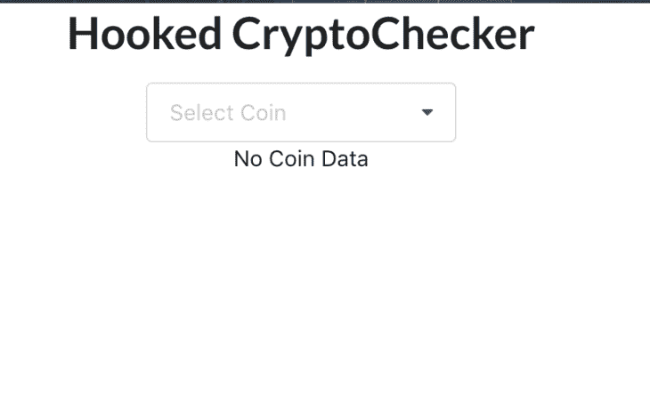
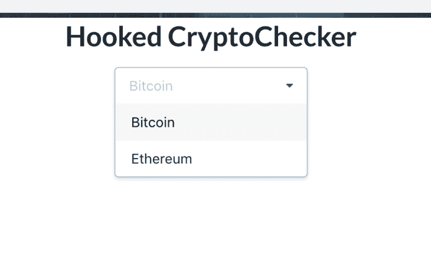
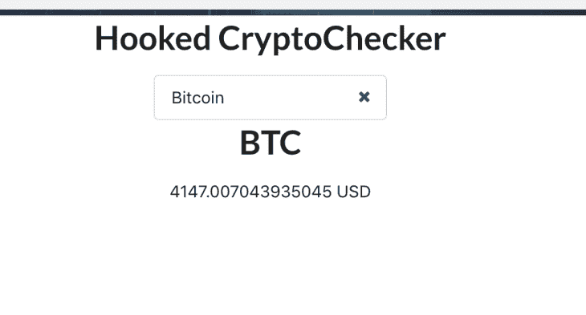

# 如何创建自己的自定义 React 钩子

> 原文：<https://blog.logrocket.com/create-your-own-custom-react-hooks/>

***编者按**:这篇文章最后一次更新并验证准确性是在 2022 年 9 月 16 日。*

React 挂钩开启了编写功能组件的全新方式，允许我们添加类组件可用的特性，比如有状态逻辑。

为此，React 主要使用了`useState`和`useEffect`钩子，它们分别允许你[定义一个状态对象](https://reactjs.org/docs/hooks-state.html)和一个更新它的函数，以及[在一个功能组件](https://reactjs.org/docs/hooks-effect.html)中执行副作用。你可以把它想象成类组件中的生命周期事件。

在本教程中，我们将探索 React 中定制钩子的入门。

## 目录

## React 挂钩的使用规则

在 React 中，自定义钩子是一个以单词“use”开头的函数，可能会调用其他钩子。“useWhatever”命名约定主要允许 linter 在如何使用这些钩子时发现错误，例如，它们的使用违反钩子规则的场景。

React 钩子的一般规则也适用于定制钩子；其中包括:

*   只调用顶层的钩子。不要在循环、条件或嵌套函数中调用钩子
*   仅从 React 函数组件调用挂钩
*   不要从常规的 JavaScript 函数中调用钩子

只有一个地方可以调用钩子，那就是你自己的定制钩子。之所以有这些规则，是因为 React 依赖于钩子被调用的顺序来将钩子与某个本地状态相关联。在条件中放置一个钩子可能会改变这个顺序，导致后续的钩子不能被调用，并且很可能会导致 bug。

React 文档中使用一个带有几个挂钩的表单对此进行了说明，如下所示:

```
function Form() {
// 1\. Use the name state variable
const [name, setName] = useState('Mary');

// 2\. Use an effect for persisting the form
useEffect(function persistForm() {
localStorage.setItem('formData', name);
});

// 3\. Use the surname state variable
const [surname, setSurname] = useState('Poppins');

// 4\. Use an effect for updating the title
useEffect(function updateTitle() {
document.title = name + ' ' + surname;
});

// ...
}

These hooks are called in the following order on two renders:
// ------------
// First render
// ------------
useState('Mary') // 1\. Initialize the name state variable with 'Mary'
useEffect(persistForm) // 2\. Add an effect for persisting the form
useState('Poppins') // 3\. Initialize the surname state variable with 'Poppins'
useEffect(updateTitle) // 4\. Add an effect for updating the title
// -------------
// Second render
// -------------
useState('Mary') // 1\. Read the name state variable (argument is ignored)
useEffect(persistForm) // 2\. Replace the effect for persisting the form
useState('Poppins') // 3\. Read the surname state variable (argument is ignored)
useEffect(updateTitle) // 4\. Replace the effect for updating the title
// ...

```

在一个条件中调用第二个钩子，以便它只在输入数据时保存，如下所示，这违反了钩子的规则:

```
if (name !== '') {
useEffect(function persistForm() {
   localStorage.setItem('formData', name);
});
}

```

结果是第三个和第四个挂钩无法读取状态并应用各自所需的效果。幸运的是，我们可以通过移动钩子内部的条件来解决这个问题:

```
useEffect(function persistForm() {
// 
 We're not breaking the first rule anymore
if (name !== '') {
  localStorage.setItem('formData', name);
 }
});

```

你可以在 React 文档的部分的[钩子规则中找到更多信息。](https://reactjs.org/docs/hooks-rules.html)

## 构建自定义 React 挂钩的好处

在我们希望跨不同组件实现`useState`和`useEffect`挂钩的场景中，使用定制挂钩是一种有效的解决方案。

有了定制的 React 钩子，我们可以在不同的组件之间以一种优化的、可伸缩的格式轻松地重用有状态逻辑。定制挂钩还会产生一个干净的结构化代码库，减少 React 项目中的复杂性和冗余。

您可以创建用于处理不同用例的定制钩子的类型没有限制，只要它们遵循 React 钩子的规则。

## 创建我们的 React 应用

让我们学习如何创建我们自己的自定义 React 挂钩。为此，我们将构建一个使用自定义 React 钩子的小应用程序。

我们的应用程序将是一个基本的加密货币检查器，允许我们检查一些流行的加密货币的美元价值。对于这个演示，我们将只检查以太坊和比特币，但您可以按照相同的步骤添加其他硬币。

为了启动并运行我们的应用程序，我们将使用 Create React App 为我们的应用程序生成样板代码，并且我们将使用来自[语义 UI React](https://react.semantic-ui.com/) 的下拉组件。

要引导您的应用程序，请在控制台中运行以下代码:

```
npx create-react-app hooked-cryptochecker

```

接下来，我们将安装我们的两个依赖项，`semantic-ui-react`和`dotenv`。在您的终端中，运行以下命令:

```
yarn add semantic-ui-react semantic-ui css dotenv

```

您需要将`.env`添加到您的`.gitigignore`文件中，因为 CRA 生成的默认`gitignore`不包含它。在这里，我们将放置环境变量。

为了获得以太坊和比特币的当前值，我们将使用来自 [CoinAPI.io](https://www.coinapi.io/) 的 API。为此，我们需要获得一个 API 密钥。幸运的是，这些都是免费的，所以去 CoinAPI 获取你的吧。

一旦有了 API 密匙，在项目的根目录下创建一个`.env`文件，并将 API 密匙粘贴到那里。在`App.js`或`Index.js`中，粘贴以下代码来加载环境变量:

```
require('dotenv').config()

Import semantic-ui’s stylesheet into the index.js file:

import 'semantic-ui-css/semantic.min.css'

```

## 创建自定义挂钩

现在我们已经设置好了，让我们进入应用程序的核心部分。通过运行下面的代码，在`src`目录下创建一个`components`目录:

```
mkdir src/components

```

在`components`目录中创建一个名为`CryptoChecker.jsx`的文件，并将以下代码放入其中:

```
import React, { useState, useEffect } from "react";
import { Dropdown } from "semantic-ui-react";

const coinAPIKey = process.env.REACT_APP_COIN_API_KEY;

const CryptoChecker = () => {
 const [coinName, setCoinName] = useState(null);

 const useCryptoFetcher = () => {
   const [coinData, setCoinData] = useState(null);
   const [fetched, setFetched] = useState(false);
   const [loading, setLoading] = useState(false);

   useEffect(() => {
     const coinUrl = `https://rest.coinapi.io/v1/exchangerate/${coinName}/USD`;
     setLoading(true);
     if (coinName) {
       fetch(coinUrl, {
         headers: {
           "X-CoinAPI-Key": coinAPIKey,
         },
       })
         .then((res) => {
           if (!coinUrl) {
             setFetched(false);
             return null;
           }
           if (!res.ok) {
             setFetched(false);
             return null;
           } else {
             return res.json();
           }
         })
         .then((data) => {
           setLoading(false);
           setFetched(true);
           setCoinData(data);
         });
     }
   }, [coinName]);
   return [coinData, loading, fetched];
 };

 const mapCoinData = () => {
   if (!fetched) return <div>No data fetched</div>;
   if (loading) return <div>Loading...</div>;
   if (!coinData) {
     return <div>No Coin Data</div>;
   } else {
     return (
       <div>
         <h1>{coinName}</h1>
         <div>{coinData.rate} USD</div>
       </div>
     );
   }
 };

 const [coinData, loading, fetched] = useCryptoFetcher();
 const coinOptions = [
   {
     key: "BTC",
     value: "BTC",
     text: "Bitcoin",
   },
   {
     key: "ETH",
     value: "ETH",
     text: "Ethereum",
   },
 ];

 return (
   <div>
     <Dropdown
       placeholder="Select Coin"
       clearable
       selection
       options={coinOptions}
       onChange={(e, { value }) => setCoinName(value)}
     />
     <br />
     {mapCoinData()}
   </div>
 );
};

export default CryptoChecker;

```

让我们检查一下我们的组件，看看它是如何工作的。是我们的功能组件，它返回一个下拉菜单，允许我们选择想要检查的硬币。在它下面，我们将显示硬币的名称及其美元价值。

我们使用了`useState`钩子来初始化我们要搜索的硬币的名称，并将其放置在 state 中。然后，我们使用它来设置 URL，我们将点击它来获取我们的硬币数据。

接下来，您会注意到一个名为`useCryptoFetcher`的函数，这是我们的自定义钩子。它返回硬币数据以及我们的 API 调用状态，加载或完成，以及一个名为`fetched`的布尔值，它告诉我们何时获取了任何数据。

我们的定制钩子同时使用了`useEffect`和`useState`钩子。我们使用`useState`钩子将硬币数据放置在状态中，并更新 API 调用的状态，以了解数据何时被加载以及调用何时完成。我们使用`useEffect`钩子来触发对 CoinAPI.io 的调用，以获取硬币的汇率值。

我们通过向它传递第二个参数来优化`useEffect`钩子，第二个参数是一个包含 URL 的数组，它确保副作用只在 URL 改变时才被应用。这避免了不必要的重新渲染以及重复的 API 调用。

我们还检查了`coinName`变量，以确保我们只在它不为空时进行 API 调用。这通过在页面第一次加载时阻止 API 调用来优化组件。

名为`mapCoinData`的函数使用自定义钩子返回的数据，根据返回的值改变 DOM 中显示的内容。为了使这些值对`mapCoinData`可用，我们将从`useCryptoFetcher`中析构它，把它放在我们组件的一般范围内。

名为`coinOptions`的数组包含了下拉列表中的硬币名称。在这里，你可以提供更多的选项，如果你想获取其他硬币的价值。

我们的组件已经可以使用了，并配有一个个性化的钩子来添加一些功能。让我们继续编辑`App.js`将其添加到我们的应用程序中。它应该类似于下面的代码:

```
import React, { Component } from 'react';
import './App.css';
import CryptoChecker from './components/CryptoChecker';
require('dotenv').config()

class App extends Component {
 render() {
   return (
     <div className="App">
       <h1>Hooked CryptoChecker</h1>
       <CryptoChecker />
     </div>
   );
 }
}

export default App;

```

现在，让我们启动我们的应用程序，看看它的神奇之处。在您的终端中，运行`yarn start`命令并测试应用程序:



React Hooks CryptoChecker no coin selected



Select CryptoChecker coin



CryptoChecker Bitcoin selected

其核心是，用钩子获取数据与 React 中使用的大多数其他数据获取方法一样:

*   跟踪进行 API 调用所需的变量，从发送到运行调用的触发器的数据
*   使用您喜欢的方法进行 API 调用，例如 Fetch、Axios 等。
*   跟踪加载和错误状态
*   跟踪返回的响应
*   显示相关数据

## 结论

定制钩子确实开辟了编写组件的新途径，允许您根据自己的喜好定制功能。 [useHooks 是一个很好的资源](https://usehooks.com/),可以查看一些已经存在于不同用例中的定制钩子的例子。

总的来说，钩子为我们如何编写 React 应用程序增加了很多灵活性，最大限度地减少了对基于类的组件的需求。您可以使用 React 内置的一些[附加挂钩](https://reactjs.org/docs/hooks-reference.html)来扩展这些挂钩的功能，以创建您自己的更令人惊叹的挂钩。

## 使用 LogRocket 消除传统反应错误报告的噪音

[LogRocket](https://lp.logrocket.com/blg/react-signup-issue-free)

是一款 React analytics 解决方案，可保护您免受数百个误报错误警报的影响，只针对少数真正重要的项目。LogRocket 告诉您 React 应用程序中实际影响用户的最具影响力的 bug 和 UX 问题。

[ ](https://lp.logrocket.com/blg/react-signup-general) [  ](https://lp.logrocket.com/blg/react-signup-general) [LogRocket](https://lp.logrocket.com/blg/react-signup-issue-free)

自动聚合客户端错误、反应错误边界、还原状态、缓慢的组件加载时间、JS 异常、前端性能指标和用户交互。然后，LogRocket 使用机器学习来通知您影响大多数用户的最具影响力的问题，并提供您修复它所需的上下文。

关注重要的 React bug—[今天就试试 LogRocket】。](https://lp.logrocket.com/blg/react-signup-issue-free)