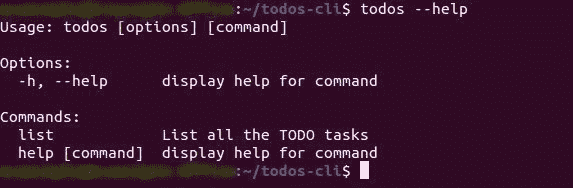

# 使用 Node.js 创建 CLI 工具

> 原文：<https://blog.logrocket.com/creating-a-cli-tool-with-node-js/>

## 什么是 CLI 工具？

CLI 工具允许您直接从终端或命令行提示符运行某些任务或操作。它们可以使用不同的编程语言构建，创建 CLI 工具的一种方法是使用 Node.js。

在本文中，您将了解如何使用 Node.js 创建一个 CLI 工具，测试它，然后在 npm 上发布它。

我们将创建一个名为`todos-cli`的工具，允许用户查看他们的待办事项列表，向其中添加项目，然后勾选这些项目。

你可以在这个 [GitHub 库](https://github.com/shahednasser/todos-cli)上找到本教程的完整代码。

## 设置项目

首先，创建一个保存 CLI 工具的目录:

```
mkdir todos-cli
cd todos-cli

```

接下来，我们将初始化 Node.js 项目:

```
npm init

```

你将被要求输入一些信息。如果您愿意，可以通过将参数`-y`传递给命令来跳过这一步:

```
npm init -y

```

这将把信息设置为默认值。完成后，我们需要安装一些有助于创建 CLI 工具的软件包。这些是:

1.  commander :这个包使得创建 CLI 工具更加容易。它提供了允许我们设置命令、选项等等的功能
2.  这个包可以让我们将彩色信息打印到控制台上。它将帮助我们使我们的 CLI 工具看起来漂亮
3.  这个包允许我们在用户的机器上保存持久的信息。我们将使用它来保存用户的待办事项列表

要安装这些软件包，请运行:

```
npm i commander chalk conf

```

软件包安装完成后，我们就可以开始开发 CLI 工具了。

## 创建 CLI 工具

在项目的根目录下创建一个文件`index.js`。这将是 CLI 工具的主要入口，该工具将初始化它将拥有的命令。

**注意:**如果您使用 Windows 进行开发，请确保行尾字符设置为`LF`而不是`CRLF`，否则该工具将无法工作。大多数编码编辑器都可以设置这个选项。此外，在 Windows 上测试可能行不通，所以我建议要么使用另一个操作系统，要么使用用于 Linux (WSL)的 [Windows 子系统](https://docs.microsoft.com/en-us/windows/wsl/)。不过，你最终发布的工具将可以在所有操作系统上正常工作。

为了确保您的 CLI 工具正常工作，请将以下代码添加到`index.js`的开头:

```
#! /usr/bin/env node

```

接下来，要创建具有基本配置和功能的 CLI，我们可以使用`commander`。首先，让我们要求`commander`的`program`:

```
const { program } = require('commander')

```

要声明一个命令，我们将使用以下函数:

1.  `program.command`:取一个定义命令格式的字符串
2.  `program.description`:为用户描述命令。当用户使用选项`--help`执行我们的工具时，这很有帮助
3.  `program.option`:该命令可以采用的选项，如果有的话
4.  `program.action`:该命令执行的动作，将是一个函数

我们将使用这些函数来声明我们的命令。但是这个 CLI 工具的命令是什么呢？

我们需要以下命令:

1.  `todos list`:这将列出用户待办事项列表中的任务
2.  `todos add`:这将向用户的待办事项列表中添加一个新任务
3.  `todos mark-done`:将列表中的特定任务或所有任务标记为`done`

### 设置列表命令

list 命令将只显示用户之前添加的任务列表。它不需要任何选择。用户应该能够通过在终端中运行以下命令来运行它:

```
todos list

```

在`index.js`中，在我们之前添加的代码下方添加以下内容:

```
program
    .command('list')
    .description('List all the TODO tasks')
    .action(list)

```

如您所见，我们在 CLI 工具中使用了`command`函数来声明该命令。您传递的参数是一个字符串，它显示了预期命令的格式。当用户使用`--help`选项运行我们的工具时，我们也使用`description`函数向用户描述这个命令。最后，我们将动作分配给一个名为`list`的函数，我们很快就会创建这个函数。

将我们的命令保存在单独的文件中有助于使我们的代码易于阅读和维护。

现在，创建文件`commands/list.js`。这个文件将保存用户在终端中运行`to-dos list`时运行的函数。这个函数将从配置中检索任务列表并显示它们。

为了存储和检索任务，我们将使用`conf`包。它具有以下功能:

1.  在一个特定的键下设置我们需要的信息
2.  `get`:获取我们之前在特定键下设置的信息

所以，让我们从在`commands/list.js`中请求和实例化 conf 开始:

```
const conf = new (require('conf'))()

```

接下来，我们需要实现 list 函数，我们将导出该函数用于`index.js`:

```
function list () {

}

```

`list`函数没有任何参数，因为 list 命令没有任何选项或参数。

在 list 函数中，我们将检索关键字`todo-list`下的数据，这将是一个数组并显示每个 TODO 任务。`todo-list`将是以下格式的对象数组:

```
{
  text, //string, the text of the todo task
  done, //boolean, whether the todo task is marked done or not
}

```

现在我们知道了数据的结构，让我们回到`list`函数。我们需要做的第一件事是检索待办任务列表:

```
const todoList = conf.get('todo-list')

```

接下来，如果用户的待办事项列表中有任务，我们将遍历它们，用绿色显示已经完成的任务，用黄色显示尚未完成的任务。我们还会在一开始用蓝色告知用户每种颜色的含义。

如果用户的待办事项列表中没有任何任务，我们会用红色显示一条消息，表明他们的待办事项列表中没有任何任务。

正如我们之前提到的，我们将使用`chalk`给终端用户的消息着色。所以，让我们要求它在`commands/list.js`的开头`conf`之后:

```
const conf = new (require('conf'))()
const chalk = require('chalk')

//rest of our code

```

然后，在`list`函数中，让我们添加前面提到的 if 条件:

```
const todoList = conf.get('todo-list')

if (todoList && todoList.length) {
  //user has tasks in todoList
} else {
  //user does not have tasks in todoList
}

```

让我们先做第`else`部分。我们需要显示一条消息，告诉用户他们的待办事项列表中没有任何任务。我们需要使用`chalk`将其显示为红色:

```
else {
  //user does not have tasks in todoList
  console.log(
    chalk.red.bold('You don\'t have any tasks yet.')
  )
}

```

正如你从代码中看到的，我们可以使用`chalk.COLOR`用`chalk`输出不同颜色的消息，你可以使用`chalk.COLOR.bold`使它加粗。`COLOR`可以是红色、蓝色、黄色、绿色等。

`list`函数的部分用例完成。下一部分是当用户有任务时显示任务。首先，我们将向用户显示一条消息，详细说明任务的颜色含义:

```
if (todoList && todoList.length) {
        console.log(
            chalk.blue.bold('Tasks in green are done. Tasks in yellow are still not done.')
        )
}

```

在这里，我们用蓝色粗体显示它。

接下来，我们将循环执行`todoList`，对于每个任务，检查它是否完成，如果完成，则以绿色显示。如果不是，用黄色显示:

```
todoList.forEach((task, index) => {
            if (task.done) {
                console.log(
                    chalk.greenBright(`${index}. ${task.text}`)
                )
            } else {
                console.log(
                    chalk.yellowBright(`${index}. ${task.text}`)
                )
            }
        })

```

我们的`list`功能完成了！最后，为了能够在`index.js`中使用它，让我们导出函数:

```
module.exports = list

```

`command/list.js`的完整代码应该是:

```
const conf = new (require('conf'))()
const chalk = require('chalk')
function list () {
    const todoList = conf.get('todo-list')
    if (todoList && todoList.length) {
        console.log(
            chalk.blue.bold('Tasks in green are done. Tasks in yellow are still not done.')
        )
        todoList.forEach((task, index) => {
            if (task.done) {
                console.log(
                    chalk.greenBright(`${index}. ${task.text}`)
                )
            } else {
                console.log(
                    chalk.yellowBright(`${index}. ${task.text}`)
                )
            }
        })
    } else {
        console.log(
            chalk.red.bold('You don\'t have any tasks yet.')
        )
    }
}
module.exports = list

```

让我们回到`index.js`。我们只需要要求`list`:

```
const list = require('./commands/list')

```

然后，在文件末尾添加以下内容:

```
program.parse()

```

这是`commander`所必需的。一旦我们完成了命令声明，我们就解析用户的输入，这样`commander`就可以判断出用户正在运行哪个命令并执行它。

## 测试 CLI 工具

我们的 CLI 现在可以测试了。测试的第一步是在`package.json`中添加以下键:

```
"bin": {
    "todos": "./index.js"
}

```

`todos`将在终端运行命令时从我们的`todos-cli`命令中使用。你想怎么改都行。我们把它指向`index.js`，因为这是我们的主要入口。

这一步不仅对测试工具很重要，对以后发布它也很重要。所以，一定要补充。

接下来，我们将运行以下命令，在我们的计算机上全局安装我们的软件包:

```
npm i -g

```

一旦完成，我们现在就可以直接从终端运行我们的工具了！让我们通过运行来测试它:

```
todos --help

```

您将看到关于我们的 CLI 的信息，并且可以看到`list`位于 Commands:



现在，让我们尝试运行 list 命令:

```
todos list

```

它只会告诉我们，我们还没有任何任务。现在让我们实现一个添加任务的新命令。

### 添加命令

`add`命令将接受一个参数，它将是任务的文本。下面是该命令的一个示例。

```
todos add "Make Dinner"

```

“制作晚餐”是将成为任务文本的参数。我们使用引号是因为其中有一个空格。您也可以尝试使用`\`来逃离空格。如果文本中没有空格，那么引用是不必要的。

要添加新命令，在`list`命令声明下的`index.js`和`program.parse()`之前，添加以下内容:

```
program
    .command('add <task>')
    .description('Add a new TODO task')
    .action(add)

```

如你所见，我们传递给了`command`函数`add <task>`，其中`<task>`是用户传递的参数。在`commander`中，当需要一个论点时，我们使用`<ARG_NAME>`，而如果它是可选的，我们使用`[ARG_NAME]`。此外，您赋予参数的名称就是传递给`action`中函数的参数名称。

现在，我们需要实现`add`函数。像我们对`list`所做的一样，让我们用以下内容创建文件`commands/add.js`:

```
const conf = new (require('conf'))()
const chalk = require('chalk')

function add (task) {

}

module.exports = add

```

注意，我们将`task`传递给了`add`函数，这将是用户传递的参数。

`add`函数将获取`task`并使用`conf`将其存储在`todos-list`数组中。然后，我们将使用`chalk`向用户显示绿色的成功消息。

我们将首先从`conf`中检索`todo-list`，然后将新任务推送到数组中，然后使用`conf.set`来设置`todo-list`的新值。

下面是`add`函数的完整代码:

```
function add (task) {
    //get the current todo-list
    let todosList = conf.get('todo-list')

    if (!todosList) {
        //default value for todos-list
        todosList = []
    }

    //push the new task to the todos-list
    todosList.push({
        text: task,
        done: false
    })

    //set todos-list in conf
    conf.set('todo-list', todosList)

    //display message to user
    console.log(
        chalk.green.bold('Task has been added successfully!')
    )
}

```

这很简单！在创建了 list 命令之后，事情变得越来越清晰，越来越容易理解。

现在，我们回到`index.js`并需要我们刚刚创建的`add`函数:

```
const add = require('./commands/add')

```

让我们来测试一下。在您的终端中，运行:

```
todos add "Make Dinner"

```

我们将得到消息，“任务已成功添加！”绿色的。要检查任务是否已被添加，请在您的终端中运行:

```
todos list

```

您可以看到刚刚添加的任务。尝试添加一些任务来查看列表的增长。

我们将添加的最后一个命令是`mark-done`命令，它将任务标记为`done`。

### `mark-done`命令

默认情况下,`mark-done`命令会将所有任务标记为完成。然而，如果我们给它传递`--tasks`选项，后跟至少一个我们想要标记为完成的任务的索引，它将只把那些标记为完成。

这里有一个例子。

```
todos mark-done --tasks 1 2

```

为了本教程的简单，我们只使用任务的索引来标记它们已经完成。在现实生活的用例中，您可能会为任务分配 id，而这些 id 将是唯一的和随机的。

让我们在`add`命令下面声明我们的新命令:

```
program
    .command('mark-done')
    .description('Mark commands done')
    .option('-t, --tasks <tasks...>', 'The tasks to mark done. If not specified, all tasks will be marked done.')
    .action(markDone)

```

该命令与之前命令的主要区别在于`option`功能的使用。第一个参数是选项的格式。`-t, --tasks`表示用户可以使用`-t`或`--tasks`通过该选项。`<tasks...>`表示它可以有多个任务，但是因为我们使用了`<>`，这意味着它应该至少包含一个。第二个参数是选项的描述。这在用户运行`todos mark-done --help`时很有用。

接下来，我们将创建`markDone`函数。就像我们之前做的一样，让我们用以下内容创建文件`commands/markDone.js`:

```
const conf = new (require('conf'))()
const chalk = require('chalk')

function markDone({tasks}) {

}
module.exports = markDone

```

如您所见，`markDone`接受了一个包含`tasks`属性的对象。如果用户将`-t`或`--tasks`选项传递给命令，`tasks`将是用户传递的值的数组。否则，它将是未定义的。

我们需要在`markDone`函数中做的是从`conf`中检索`todo-list`数组。如果`todo-list`不为空，则循环遍历它。如果`tasks`是一个至少包含一项的数组，那么只将用户输入的索引任务标记为完成。如果`tasks`未定义，则将所有任务标记为完成。

这将是`markDone`功能:

```
function markDone({tasks}) {
    let todosList = conf.get('todo-list')

    if (todosList) {
        //loop over the todo list tasks
        todosList = todosList.map((task, index) => {
            //check if the user specified the tasks to mark done
            if (tasks) {
                //check if this task is one of the tasks the user specified
                if (tasks.indexOf(index.toString()) !== -1) {
                    //mark only specified tasks by user as done
                    task.done = true
                }
            } else {
                //if the user didn't specify tasks, mark all as done
                task.done = true
            }
            return task
        });

        //set the new todo-list
        conf.set('todo-list', todosList)
    }

    //show the user a message
    console.log(
        chalk.green.bold('Tasks have been marked as done successfully')
    )
}

```

我们在`map`中循环`todosList`(如果它不是空的)。然后，我们检查是否定义了`tasks`(这意味着用户已经将特定的任务标记为完成)。

如果定义了`tasks`，通过检查索引是否在`tasks`数组中，检查迭代中的当前任务项是否是用户指定的任务之一。注意，我们使用的是`index.toString()`，因为`tasks`数组将保存用户以字符串形式输入的标记。如果索引是`tasks`数组的一部分，将其标记为 done，否则什么都不会改变。

然而，如果没有定义`tasks`，那么，正如我们之前提到的，我们将把所有项目标记为完成。一旦循环完成，我们有了更新的列表，我们就使用`conf.set`将`todo-list`设置为新的数组。最后，我们向用户显示一条成功消息。

最后，让我们回到`index.js`并要求我们的`markDone`函数:

```
const markDone = require('./commands/markDone')

```

现在，我们可以测试一下。尝试首先通过运行以下命令来标记所有已完成的任务:

```
todos mark-done

```

如果一切正常，您可以运行`todos list`并看到所有项目现在都是绿色的。

接下来，尝试添加几个任务，然后使用它们的索引标记那些已完成的任务，这是一个将单个任务标记为已完成的示例:

```
todos mark-done -t 1

```

或者标记多个任务:

```
todos mark-done -t 1 3 6

```

您可以尝试任何组合，然后检查哪些标记为完成，哪些没有使用`todos list`命令。

我们的 CLI 工具完成了！`todos-cli`现在允许用户添加任务，查看任务，并将其标记为完成。

下一步也是最后一步是发布您的 CLI 工具。

## 发布 CLI 工具

用 Node.js 构建的 CLI 工具作为一个包发布在 [NPM](https://www.npmjs.com/) 上。因此，如果您还没有 NPM 帐户，您需要创建一个。

创建您的 NPM 帐户后，在您的终端目录下运行您的项目:

```
npm login

```

将要求您输入用户名、密码和电子邮件。如果一切正确，您将登录。

接下来，运行以下命令:

```
npm publish

```

此命令将在 npm 上公开发布您的 CLI 工具。如果存在另一个同名的包，您可能会得到一个错误。如果是这样，您需要在`package.json`中更改包的名称

```
"name": "PACKAGE_NAME",

```

请记住,`PACKAGE_NAME`不同于我们用于 CLI 命令的名称。`PACKAGE_NAME`用于在您的机器上安装工具，但是您在`bin`中指定为密钥的名称是用于从终端访问工具的名称。

如果 npm 上没有其他包具有相同的名称，您的包将是公共的，可供使用！要安装它，请运行:

```
npm i -g <PACKAGE_NAME>

```

`<PACKAGE_NAME>`是您为包选择的名称。请注意，如果您已经在开发过程中运行了包中的`npm i -g`，那么最好在使用工具目录中的`npm remove -g`安装您发布的包之前删除它。

## 更新 CLI 工具包

如果以后需要更新 CLI 工具包，可以使用以下命令:

```
npm version <UPDATE_TYPE>

```

`<UPDATE_TYPE>`可以是下列之一:

1.  `patch`:小小的改变。这将只增加版本的最后一个数字。这通常用于修复 bug 或做一些小的修改，这些修改不应该影响最终用户对您的工具或软件包的使用语法
2.  `minor`:微小的变化。这将增加版本的第二个数字。这通常用于你的包或工具中的微小变化，可能增加功能但保持旧的完整
3.  `major`:重大的变化。这将增加版本的第一个数字。这通常用于您的包或工具中可能影响最终用户使用的较大变化

你可以去[这里](https://docs.npmjs.com/about-semantic-versioning)阅读更多关于版本控制的内容。

## 结论

恭喜你，你学会了如何使用 Node.js 创建一个 CLI 工具。可能性是无穷的，所以去创建一些令人敬畏的东西吧！

## 200 只显示器出现故障，生产中网络请求缓慢

部署基于节点的 web 应用程序或网站是容易的部分。确保您的节点实例继续为您的应用程序提供资源是事情变得更加困难的地方。如果您对确保对后端或第三方服务的请求成功感兴趣，

[try LogRocket](https://lp.logrocket.com/blg/node-signup)

.

[](https://lp.logrocket.com/blg/node-signup)[https://logrocket.com/signup/](https://lp.logrocket.com/blg/node-signup)

LogRocket 就像是网络和移动应用程序的 DVR，记录下用户与你的应用程序交互时发生的一切。您可以汇总并报告有问题的网络请求，以快速了解根本原因，而不是猜测问题发生的原因。

LogRocket 检测您的应用程序以记录基线性能计时，如页面加载时间、到达第一个字节的时间、慢速网络请求，还记录 Redux、NgRx 和 Vuex 操作/状态。

[Start monitoring for free](https://lp.logrocket.com/blg/node-signup)

.