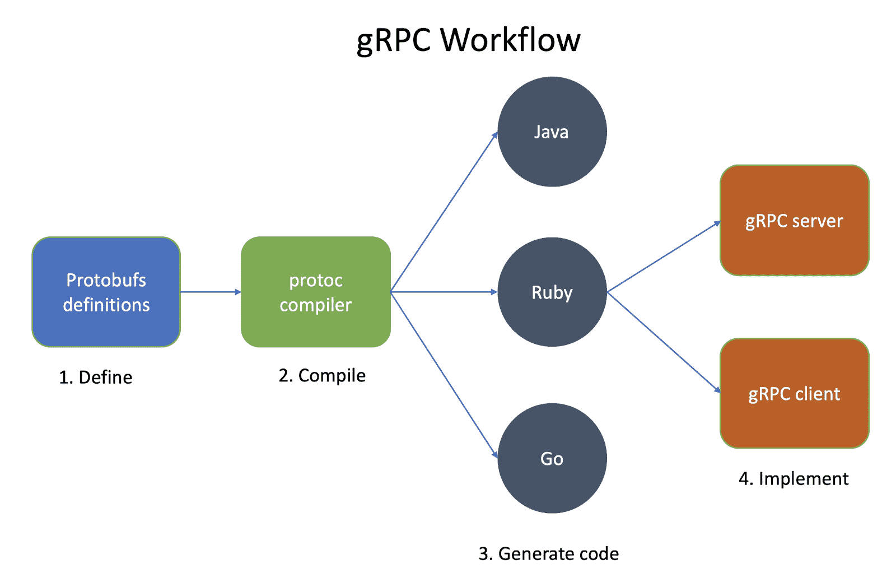
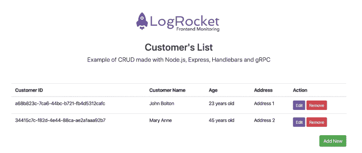
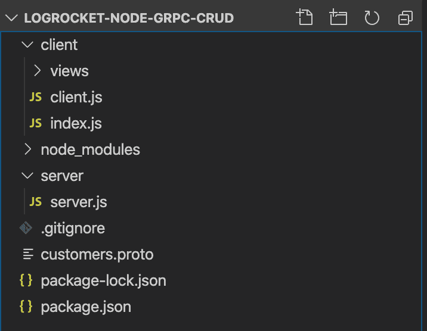

# 用 Node、Express 和 gRPC - LogRocket Blog 创建 CRUD API

> 原文：<https://blog.logrocket.com/creating-a-crud-api-with-node-express-and-grpc/>

在网络世界中，速度变得越来越有价值。

开发人员推出新版本的软件、框架和库时，无疑投入了大量时间来减少加载时间、请求处理和资源消耗。

例如，HTTP/2 诞生于无数的优化之中，这些优化将网络引向了一个比我们以往任何时候都更健壮、更快速、更轻便的领域。

RPC(代表远程过程调用)是一种众所周知的方法，当您需要稍微远程化或分布式时，它会很有吸引力。在企业服务器和复杂的大量代码需要设置的时代，它曾经占据统治地位。

经过多年的孤立，谷歌重新设计了它，并给它注入了新的光芒。

gRPC 是一个现代的开源高性能 RPC 框架，可以在任何环境下运行。

借助对负载平衡、跟踪、运行状况检查和身份验证的可插拔支持，它可以高效地连接数据中心内和数据中心间的服务。

它也适用于分布式计算的最后一英里，将设备、移动应用程序和浏览器连接到后端服务。

它支持 HTTP/2、跨平台和开源。就尺寸而言，它也很紧凑。

gRPC 可以与许多编程语言一起工作，比如 Java、Go、Ruby、Python 等等。

继续检查他们的官方文档[链接](https://grpc.io/docs/quickstart/)(以及它的 [GitHub 页面](https://github.com/grpc/grpc))来检查是否有对你的支持。

即使你的语言没有列在那里，你也可以在 Docker 图片中使用 [web 特性](https://grpc.io/docs/tutorials/basic/web/)。

它的工作流程是这样的:



gRPC Workflow

整个体系结构基于已知的客户机-服务器结构。

gRPC 客户端应用程序可以向服务器应用程序发出直接请求。客户机和服务器都包含一个公共接口，就像一个契约，在这个契约中，它决定了每个操作将具有的方法、类型和返回。

服务器确保接口将由其服务提供，而客户端有存根来保证方法是相似的。

例如，它还使用[协议缓冲区](https://developers.google.com/protocol-buffers)来序列化和反序列化请求和响应数据，而不是 JSON 或 XML。

协议缓冲区是 Google 的语言中立、平台中立、可扩展的机制，用于序列化结构化数据——想想 XML，但是更小、更快、更简单。

您只需定义一次数据的结构化方式，然后就可以使用特殊生成的源代码轻松地在每种支持的语言中的各种数据流之间写入和读取结构化数据。

首先，您需要创建并定义 protobuf 文件，该文件将包含根据协议本身指定的接口定义语言编写的代码(稍后将详细介绍)。

有了手头的文件，您可以通过`protoc`编译器将其编译成所需的语言代码。

整个过程都是秘密进行的，所以不要担心，你不会看到太多的样板代码。最后，随着生成的代码，您可以进入服务器和客户端的实现。

我们将构建一个全功能的 CRUD API 应用程序，使用一个引导接口来管理内存中客户列表的操作(由服务器应用程序管理)，而不是想象。

这是我们的应用程序最终的样子:



Customer’s CRUD application

## 设置

本教程的要求非常简单:

*   Node.js 和 npm(最新版本)
*   您选择的 IDE

为了简单起见，我们不打算使用任何类型的数据库——条目列表将保存在服务器应用程序的内存中。

这将非常接近地模拟数据库的使用，因为当服务器启动时数据就在那里，而客户机可以根据您的需要重启多次。你可以随意加入任何你想要的框架或特性。

接下来，在您选择的文件夹中，创建以下结构的文件夹和文件:



Project’s structure

您也可以选择分别创建客户端和服务器应用程序。

我们将它们放在一起以简化最终的结构。

现在，在命令行的根文件夹中运行以下命令:

```
npm install --save grpc @grpc/proto-loader uuid express hbs body-parser
```

前两次安装将处理 gRPC 服务器，并将我们的 protobuf 文件加载到客户机和服务器代码的实现中。`Uuid`将有助于为我们的客户创建随机散列 id，但是您也可以使用数字来简化(例如，虽然这样您的代码将已经准备好切换到 MongoDB)。

您可能想知道，如果我们在不同的协议下开发 API，为什么我们在这里使用 Express(用于 HTTP 处理)。

[Express](https://expressjs.com/) 将只服务于我们视图的路由系统。每个 CRUD 操作都需要到达客户机(顺便说一下，这是一个 HTTP 服务器)，客户机将通过 gRPC 与服务器应用程序进行通信。

虽然您可以从 web 页面调用 gRPC 方法，但我不推荐这样做，因为有很多缺点。

请记住，gRPC 是为了加快后端的速度，比如从一个微服务到另一个微服务。为了服务于首页、移动应用或任何其他类型的图形用户界面，你必须调整你的架构。

最后，我们有用于页面模板化的[手柄](https://handlebarsjs.com/)(我们不会在这里讨论它的细节，但是您可以使用 EJS 或任何其他用于节点应用程序的模板系统)，和[主体解析器](https://www.npmjs.com/package/body-parser)，用于在处理程序之前在中间件中转换传入的请求主体，在`req.body`属性下可用。

当访问请求参数时，这将使我们的生活更容易。

您的最终`package.json`文件应该如下所示:

```
{
  "name": "logrocket_customers_grpc",
  "version": "1.0.0",
  "description": "LogRocket CRUD with gRPC and Node",
  "main": "server.js",
  "scripts": {
    "start": "node server/server.js"
  },
  "author": "Diogo Souza",
  "license": "MIT",
  "dependencies": {
    "@grpc/proto-loader": "^0.5.3",
    "body-parser": "^1.18.3",
    "express": "^4.17.1",
    "grpc": "^1.24.2",
    "hbs": "^4.1.0",
    "uuid": "^7.0.2"
  }
}
```

## 服务器

让我们来看看代码，从我们的 protobuf 文件开始，`customers.proto`:

```
syntax = "proto3";

service CustomerService {
    rpc GetAll (Empty) returns (CustomerList) {}
    rpc Get (CustomerRequestId) returns (Customer) {}
    rpc Insert (Customer) returns (Customer) {}
    rpc Update (Customer) returns (Customer) {}
    rpc Remove (CustomerRequestId) returns (Empty) {}
}

message Empty {}

message Customer {
    string id = 1;
    string name = 2;
    int32 age = 3;
    string address = 4;
}

message CustomerList {
    repeated Customer customers = 1;
}

message CustomerRequestId {
    string id = 1;
}
```

第一行说明了我们将使用的 protobuf 的版本——在本例中，是最新的版本。

内容的语法重组了很多 JSON。服务是我们已经讨论过的接口契约。在这里，您将放置每个 gRPC 调用的方法名、参数和返回类型。

如果类型不是基本类型，则必须通过 message 关键字来声明。请参考[文档](https://developers.google.com/protocol-buffers/docs/proto3)查看所有允许的类型。

消息的每个属性都必须接收一个数字值，该值表示该属性在堆栈中的顺序，从 1 开始。

最后，对于数组，需要在声明的属性前使用 repeated 关键字。

有了原型，让我们创建我们的`server.js`代码:

```
const PROTO_PATH = "./customers.proto";

var grpc = require("grpc");
var protoLoader = require("@grpc/proto-loader");

var packageDefinition = protoLoader.loadSync(PROTO_PATH, {
    keepCase: true,
    longs: String,
    enums: String,
    arrays: true
});

var customersProto = grpc.loadPackageDefinition(packageDefinition);

const { v4: uuidv4 } = require("uuid");

const server = new grpc.Server();
const customers = [
    {
        id: "a68b823c-7ca6-44bc-b721-fb4d5312cafc",
        name: "John Bolton",
        age: 23,
        address: "Address 1"
    },
    {
        id: "34415c7c-f82d-4e44-88ca-ae2a1aaa92b7",
        name: "Mary Anne",
        age: 45,
        address: "Address 2"
    }
];

server.addService(customersProto.CustomerService.service, {
    getAll: (_, callback) => {
        callback(null, { customers });
    },

    get: (call, callback) => {
        let customer = customers.find(n => n.id == call.request.id);

        if (customer) {
            callback(null, customer);
        } else {
            callback({
                code: grpc.status.NOT_FOUND,
                details: "Not found"
            });
        }
    },

    insert: (call, callback) => {
        let customer = call.request;

        customer.id = uuidv4();
        customers.push(customer);
        callback(null, customer);
    },

    update: (call, callback) => {
        let existingCustomer = customers.find(n => n.id == call.request.id);

        if (existingCustomer) {
            existingCustomer.name = call.request.name;
            existingCustomer.age = call.request.age;
            existingCustomer.address = call.request.address;
            callback(null, existingCustomer);
        } else {
            callback({
                code: grpc.status.NOT_FOUND,
                details: "Not found"
            });
        }
    },

    remove: (call, callback) => {
        let existingCustomerIndex = customers.findIndex(
            n => n.id == call.request.id
        );

        if (existingCustomerIndex != -1) {
            customers.splice(existingCustomerIndex, 1);
            callback(null, {});
        } else {
            callback({
                code: grpc.status.NOT_FOUND,
                details: "Not found"
            });
        }
    }
});

server.bind("127.0.0.1:30043", grpc.ServerCredentials.createInsecure());
console.log("Server running at http://127.0.0.1:30043");
server.start();
```

例如，因为它是一个服务器，所以它看起来很像一个 Express 代码的结构。你有一个 IP 和一个端口，然后你启动一些东西。

一些要点:

首先，将原型文件路径导入到一个常量中。

然后，`require``grpc`和`@grpc/proto-loader`都包了。他们会让奇迹发生。为了将 proto 转录成 JavaScript 对象，您需要首先设置它的包定义。`protoLoader`将通过接收原型文件所在的路径作为第一个参数，设置属性作为第二个参数来完成这项任务。

一旦有了包定义对象，就将它传递给`grpc`对象的`loadPackageDefinition`函数，该函数又将它返回给您。然后，您可以通过`Server()`功能创建服务器。

`customers`数组是我们的内存数据库。

我们已经对两个客户进行了初始化，所以当应用程序启动时，你可以看到一些数据。在服务器上，我们需要告诉`server`对象它将处理哪些服务(在我们的例子中，是我们在 proto 文件中创建的`CustomerService`)。每个操作都必须将它们的名称分别与原型匹配。它们的代码很简单，非常直观，所以请继续查看它们。

最后，将服务器连接绑定到所需的 IP 和端口，并启动它。`bind()`函数接收身份验证对象作为第二个参数，但是为了简单起见，您可能会注意到，我们会不安全地使用它(不推荐用于生产)。

服务器搞定了。很简单，不是吗？现在，您可以通过发出以下命令来启动它:

```
npm start
```

然而，它不能被测试，因为你需要一个合适的客户机，它理解服务器所服务的 protobuf 契约。

### 客户

现在让我们构建我们的客户端应用程序，从`client.js`代码开始:

```
const PROTO_PATH = "../customers.proto";

const grpc = require("grpc");
const protoLoader = require("@grpc/proto-loader");

var packageDefinition = protoLoader.loadSync(PROTO_PATH, {
    keepCase: true,
    longs: String,
    enums: String,
    arrays: true
});

const CustomerService = grpc.loadPackageDefinition(packageDefinition).CustomerService;
const client = new CustomerService(
    "localhost:30043",
    grpc.credentials.createInsecure()
);

module.exports = client;
```

该文件将专门处理我们与 gRPC 服务器的通信。

注意，它的初始结构与服务器文件中的完全相同，因为相同的 gRPC 对象处理客户机和服务器实例。

这里唯一的区别是没有像`Client()`这样的方法。

我们所需要的就是加载包定义并创建一个新的服务——与我们在服务器中创建的服务相同——通过相同的 IP 和端口。如果设置了凭据，第二个参数也必须满足这些设置。

就是这样。

为了使用这个服务契约，我们需要首先实现我们的 Express 代码。因此，在`index.js`文件中，插入以下内容:

```
const client = require("./client");

const path = require("path");
const express = require("express");
const bodyParser = require("body-parser");

const app = express();

app.set("views", path.join(__dirname, "views"));
app.set("view engine", "hbs");

app.use(bodyParser.json());
app.use(bodyParser.urlencoded({ extended: false }));

app.get("/", (req, res) => {
    client.getAll(null, (err, data) => {
        if (!err) {
            res.render("customers", {
                results: data.customers
            });
        }
    });
});

app.post("/save", (req, res) => {
    let newCustomer = {
        name: req.body.name,
        age: req.body.age,
        address: req.body.address
    };

    client.insert(newCustomer, (err, data) => {
        if (err) throw err;

        console.log("Customer created successfully", data);
        res.redirect("/");
    });
});

app.post("/update", (req, res) => {
    const updateCustomer = {
        id: req.body.id,
        name: req.body.name,
        age: req.body.age,
        address: req.body.address
    };

    client.update(updateCustomer, (err, data) => {
        if (err) throw err;

        console.log("Customer updated successfully", data);
        res.redirect("/");
    });
});

app.post("/remove", (req, res) => {
    client.remove({ id: req.body.customer_id }, (err, _) => {
        if (err) throw err;

        console.log("Customer removed successfully");
        res.redirect("/");
    });
});

const PORT = process.env.PORT || 3000;
app.listen(PORT, () => {
    console.log("Server running at port %d", PORT);
});
```

在您导入了`requires`，从`express()`函数创建了`app`，并设置了每个 CRUD HTTP 函数之后，剩下的就是调用接口契约提供的每个动作。

还要注意，对于所有这些，我们都从请求`body`中恢复输入值(承蒙`body-parser`)。

不要忘记，每个`client`函数必须符合 proto 文件中定义的完全相同的名称。

最后但同样重要的是，这是`customers.hbs`文件的代码:

```
<html lang="en">

<head>
    <meta charset="utf-8">
    <title>LogRocket CRUD with gRPC and Node</title>
    <link rel="stylesheet" href="https://stackpath.bootstrapcdn.com/bootstrap/4.3.1/css/bootstrap.min.css"
        integrity="sha384-ggOyR0iXCbMQv3Xipma34MD+dH/1fQ784/j6cY/iJTQUOhcWr7x9JvoRxT2MZw1T" crossorigin="anonymous">
    <style>
        .logrocket {
            background-color: #764abc;
            color: white;
        }
    </style>
</head>

<body>
    <div class="container">
        <div class="py-5 text-center">
            
            <h2>Customer's List</h2>
            <p class="lead">Example of CRUD made with Node.js, Express, Handlebars and gRPC</p>
        </div>

        <table class="table" id="customers_table">
            <thead>
                <tr>
                    <th>Customer ID</th>
                    <th>Customer Name</th>
                    <th>Age</th>
                    <th>Address</th>
                    <th>Action</th>
                </tr>
            </thead>
            <tbody>
                {{#each results}}
                <tr>
                    <td>{{ id }}</td>
                    <td>{{ name }}</td>
                    <td>{{ age }} years old</td>
                    <td>{{ address }}</td>
                    <td>
                        <a href="javascript:void(0);" class="btn btn-sm edit logrocket" data-id="{{ id }}"
                            data-name="{{ name }}" data-age="{{ age }}" data-address="{{ address }}">Edit</a>
                        <a href="javascript:void(0);" class="btn btn-sm btn-danger remove" data-id="{{ id }}">Remove</a>
                    </td>
                </tr>
                {{else}}
                <tr>
                    <td colspan="5" class="text-center">No data to display.</td>
                </tr>
                {{/each}}
            </tbody>
        </table>
        <button class="btn btn-success float-right" data-toggle="modal" data-target="#newCustomerModal">Add New</button>
    </div>

    <!-- New Customer Modal -->
    <form action="/save" method="post">
        <div class="modal fade" id="newCustomerModal" role="dialog">
            <div class="modal-dialog" role="document">
                <div class="modal-content">
                    <div class="modal-header">
                        <h4 class="modal-title">New Customer</h4>
                        <button type="button" class="close" data-dismiss="modal">
                            <span>&times;</span>
                        </button>
                    </div>
                    <div class="modal-body">
                        <div class="form-group">
                            <input type="text" name="name" class="form-control" placeholder="Customer Name"
                                required="required">
                        </div>

                        <div class="form-group">
                            <input type="number" name="age" class="form-control" placeholder="Age" required="required">
                        </div>

                        <div class="form-group">
                            <input type="text" name="address" class="form-control" placeholder="Address"
                                required="required">
                        </div>
                    </div>
                    <div class="modal-footer">
                        <button type="button" class="btn btn-secondary" data-dismiss="modal">Close</button>
                        <button type="submit" class="btn logrocket">Create</button>
                    </div>
                </div>
            </div>
        </div>
    </form>

    <!-- Edit Customer Modal -->
    <form action="/update" method="post">
        <div class="modal fade" id="editCustomerModal" role="dialog">
            <div class="modal-dialog" role="document">
                <div class="modal-content">
                    <div class="modal-header">
                        <h4 class="modal-title">Edit Customer</h4>
                        <button type="button" class="close" data-dismiss="modal">
                            <span>&times;</span>
                        </button>
                    </div>
                    <div class="modal-body">
                        <div class="form-group">
                            <input type="text" name="name" class="form-control name" placeholder="Customer Name"
                                required="required">
                        </div>

                        <div class="form-group">
                            <input type="number" name="age" class="form-control age" placeholder="Age"
                                required="required">
                        </div>

                        <div class="form-group">
                            <input type="text" name="address" class="form-control address" placeholder="Address"
                                required="required">
                        </div>
                    </div>
                    <div class="modal-footer">
                        <input type="hidden" name="id" class="customer_id">
                        <button type="button" class="btn btn-secondary" data-dismiss="modal">Close</button>
                        <button type="submit" class="btn logrocket">Update</button>
                    </div>
                </div>
            </div>
        </div>
    </form>

    <!-- Remove Customer Modal -->
    <form id="add-row-form" action="/remove" method="post">
        <div class="modal fade" id="removeCustomerModal" role="dialog" aria-labelledby="myModalLabel">
            <div class="modal-dialog">
                <div class="modal-content">
                    <div class="modal-header">
                        <h4 class="modal-title"></h4>Remove Customer</h4>
                        <button type="button" class="close" data-dismiss="modal"><span>&times;</span></button>
                    </div>
                    <div class="modal-body">
                        Are you sure?
                    </div>
                    <div class="modal-footer">
                        <input type="hidden" name="customer_id" class="form-control customer_id_removal"
                            required="required">
                        <button type="button" class="btn btn-default" data-dismiss="modal">Close</button>
                        <button type="submit" class="btn logrocket">Remove</button>
                    </div>
                </div>
            </div>
        </div>
    </form>

    <script src="https://code.jquery.com/jquery-3.3.1.slim.min.js"
        integrity="sha384-q8i/X+965DzO0rT7abK41JStQIAqVgRVzpbzo5smXKp4YfRvH+8abtTE1Pi6jizo"
        crossorigin="anonymous"></script>
    <script src="https://stackpath.bootstrapcdn.com/bootstrap/4.3.1/js/bootstrap.min.js"
        integrity="sha384-JjSmVgyd0p3pXB1rRibZUAYoIIy6OrQ6VrjIEaFf/nJGzIxFDsf4x0xIM+B07jRM"
        crossorigin="anonymous"></script>
    <script>
        $(document).ready(function () {
            $('#customers_table').on('click', '.edit', function () {
                $('#editCustomerModal').modal('show');

                $('.customer_id').val($(this).data('id'));
                $('.name').val($(this).data('name'));
                $('.age').val($(this).data('age'));
                $('.address').val($(this).data('address'));
            }).on('click', '.remove', function () {
                $('#removeCustomerModal').modal('show');

                $('.customer_id_removal').val($(this).data('id'));
            });
        });
    </script>
</body>

</html>
```

这有点冗长，尤其是因为我决定通过引导模式将整个 CRUD UIs 创建到同一个页面中，而不是重定向和设置许多不同的页面。

在页面的开头和结尾，我们分别找到了 Bootstrap 和 jQuery 的 CSS 和 JS 文件的导入。

主桌通过以下方式利用把手进行教学:

```
{{#each results}}
…
{{else}}
…
{{/each}}
```

这里的`else`有助于在列表中没有可用元素时配置文本。关于编辑和删除操作的链接，我们设置了 HTML `data`属性来帮助打开模态。

每次我们打开 edit a modal 时，它的每个输入都必须用该行值的对应值填充。删除操作也是如此，尽管这里我们只需要 id。

在第一个 div 的末尾，我们可以看到添加新客户的链接，这也触发了相应的模式。

就在下面，有三个情态动词。

它们彼此非常相似，因为它们只持有 HTML 结构。

逻辑实际上是放在 HTML 末尾的 JavaScript 部分。

这里，我们使用 jQuery 来打开模型本身，并简化将每个模型的输入值(通过`val`函数)更改为其对应的`data`属性值的工作。

我们完了。现在，您可以通过发出以下命令在另一个命令行窗口中启动客户端:

```
node index
```

然后，在服务器也启动的情况下，转到 [http://localhost:3000/](http://localhost:3000/) 并进行测试。

## 结论

你可以在这里找到这个项目[的最终源代码。](https://github.com/diogosouza/logrocket-node-grpc-crud/)

现在，您可以将它部署到云或生产服务器上，或者在您自己的项目中从一个适度的 POC 开始，看看它与您的 REST APIs 相比有多快。

但是使用 gRPC 可以做更多的事情。您可以插入身份验证以使其更加安全、超时、双向流、健壮的错误处理机制、通道等等。

确保阅读[文档](https://grpc.io/docs/)以检查其更多功能。

## 200 只显示器出现故障，生产中网络请求缓慢

部署基于节点的 web 应用程序或网站是容易的部分。确保您的节点实例继续为您的应用程序提供资源是事情变得更加困难的地方。如果您对确保对后端或第三方服务的请求成功感兴趣，

[try LogRocket](https://lp.logrocket.com/blg/node-signup)

.

[](https://lp.logrocket.com/blg/node-signup)[https://logrocket.com/signup/](https://lp.logrocket.com/blg/node-signup)

LogRocket 就像是网络和移动应用程序的 DVR，记录下用户与你的应用程序交互时发生的一切。您可以汇总并报告有问题的网络请求，以快速了解根本原因，而不是猜测问题发生的原因。

LogRocket 检测您的应用程序以记录基线性能计时，如页面加载时间、到达第一个字节的时间、慢速网络请求，还记录 Redux、NgRx 和 Vuex 操作/状态。

[Start monitoring for free](https://lp.logrocket.com/blg/node-signup)

.