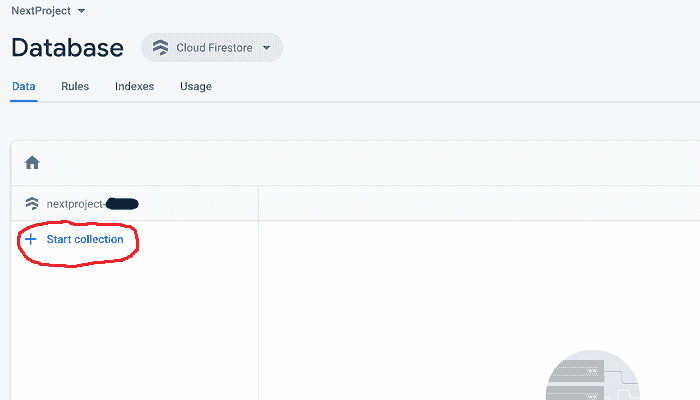
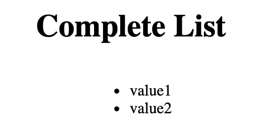

# 在 Angular 中创建 CRUD Firebase 文档

> 原文：<https://blog.logrocket.com/creating-a-crud-firebase-documents-in-angular/>

Firebase 是 Google 开发的一个开发平台，安装起来既快捷又简单。在本教程中，我们将设置一个集成 Firebase/Firestore 和 Angular 的基本应用程序。我们将使用一个名为 AngularFire 的包——Firebase 的官方角度库——以及 Firebase SDK 本身。

使用云服务变得越来越流行，因为它节省了时间，而不必创建自己的安全性、维护等。有了谷歌的 Firebase，我们将建立一个免费的 Firestore 作为我们的数据库。

Firebase 也提供了一个实时数据库，但是它把所有东西都存储在一个大的 JSON 树中。

这使得数据库更简单，但通过我们将使用的云 Firestore，有了灵活的文档，使其对于更大的数据更具可伸缩性。如果你不熟悉数据库，Firestore 也更快，总体上更直观。

## 设置 Firebase 控制台

首先，您需要在 Firebase 控制台上设置您的项目。先去[这里](https://console.firebase.google.com/)找控制台。

创建一个项目，给它起一个名字，然后完成所有步骤。完成后，您将看到项目概述。

不，我们需要添加一个应用程序。您应该在项目概述页面上。在这里你会看到“从添加 Firebase 到你的应用开始”。

通过点击“>”按钮(这是为了添加一个 web 应用程序)来完成此操作。你可以在这里设置主机，但我们不会在本教程中涉及。

继续注册应用程序。在下一页，您将看到设置 Firebase SDK 的脚本。这些是有用的，但是我们将在后面看到如果你在这一页上错过了它们，如何得到我们需要的一切。继续，继续安慰。

## 初始化 firestorm 并创建第一个文档

在 Firebase 控制台的左侧窗格中，您可以在“开发”下找到“数据库”选项卡。点击它，你将被带到一个页面，在那里你可以点击“创建数据库”。将出现一个模式，您可以在其中选择生产模式或测试模式；我们想要测试模式。这是不安全的，但对测试来说很好。

如果继续，您将被要求选择一个位置。去挑选一个合适的。按下“完成”后，将需要几分钟来设置 Firestore。

当完成时，你将在你的 Firestore。继续并选择“开始收集”。



它将要求您创建一个收藏 ID；对于我们的例子，我们就把它命名为“testCollection”。点击下一步，它会带你到创建你的第一个文件的形式。

我们会将文档 ID 留空，Firestore 会自动为您生成。在字段下，只需输入“字段”。然后，您将看到默认类型为“string”。现在没有理由改变这一点，所以就让它保持原样吧。在“值”下，键入“值 1”。点击保存，你会看到你已经创建了你的第一份文件！

对于我们后面的例子，让我们创建第二个文档。在中间一栏，您会看到“+添加文档”继续点击它，您将返回到文档创建表单。

在这里，只需在字段下键入“字段”,在值下键入“值 2”。单击保存。现在我们有两份文件。

## 开始一个新的角度项目

让我们用 Angular CLI(命令行界面)制作我们的前端项目。打开终端窗口并全局安装 Angular CLI:

```
npm install -g @angular/cli
```

安装后，您可以运行`ng`命令。

在终端中，键入以下内容:

```
ng new your-app-name
```

您可以随意命名您的项目。

* * *

### 更多来自 LogRocket 的精彩文章:

* * *

一旦开始，Angular CLI 将引导您完成几个配置选项。

您可以添加路由，然后选择希望 Angular 为您的应用程序生成的样式表格式。

在这之后，它将通过其余部分，并创建您的角度应用程序。

完成后，继续将终端目录更改为我们刚刚创建的目录:

```
cd your-app-name
```

在 Angular 应用的目录中，你可以在本地运行`ng serve` build 并服务你的应用。

## 在 Angular 应用程序中设置 Firebase

让我们通过在 Angular 项目目录下的终端中运行以下命令来获得 Firebase SDK:

```
npm i --save firebase
```

现在，Firebase 已添加到您的项目中。

转到 Firebase 控制台。在左侧菜单中，您会看到“项目概述”，旁边有一个齿轮图标。单击图标，然后在弹出窗口中单击项目设置。在这里，转到常规选项卡，并滚动到底部。

在“Firebase SDK snippet”下，单击 CDN 旁边的单选按钮(默认为自动)。在这里，您可以找到将您的应用程序连接到 Firebase 所需的一切。F

找到`firebaseConfig`变量——我们需要将该信息复制到 Angular 应用程序中。看起来是这样的(除了所有内容都会正确填写):

```
var firebaseConfig = {
  apiKey: "************************************",
  authDomain: "*************.firebaseapp.com",
  databaseURL: "https://************.firebaseio.com",
  projectId: "***************",
  storageBucket: "****************.appspot.com",
  messagingSenderId: "*************",
  appId: "********************************",
  measurementId: "****************",
};
```

在 Angular 应用程序中，导航到生成的文件`app.module.ts`(如果您通过 CLI 创建了 Angular 项目:`src > app > app.module.ts`)。在这个文件中，你可以粘贴整个`firebaseConfig`变量(就在 imports 下面就可以了)。

下一步是下载 npm 包`angular/fire`。有了这个包，你将能够轻松地与 Firebase 交互。

您可以使用以下代码行在项目中安装该包:

```
npm i angular/fire
```

安装后，我们可以将它添加到`app.module.ts`文件中:

```
import { AngularFireModule } from @angular/fire';
```

现在，在导入数组中，通过添加以下代码行来初始化应用程序中的 Firebase:

```
AngularFireModule.initializeApp(firebaseConfig)
```

这个导入一般是针对 Firebase 的，但是如果我们想要添加某些服务，您将需要单独添加这些服务。

对于 Firestore，在文件顶部添加以下内容:

```
import { AngularFirestoreModule } from '@angular/fire/firestore';
```

然后，在底部附近的导入数组中:

```
AngularFirestoreModule
```

## 在应用程序中实现

此时，在我们的 Angular 应用程序中创建一两个组件可能是有意义的。您可以在项目中使用 CLI 在应用程序中创建新组件。

让我们通过在终端中键入命令来创建一个 home 组件:

```
ng g c home
```

“g . c”代表“生成组件”。这将生成一个主文件夹，下面有四个文件:一个 HTML 文件、一个 SCSS 文件(或者您正在使用的任何样式)、一个类型脚本文件和一个. spec 文件。

如果您想跳过添加。规格文件，将此标志添加到您的生成命令中:

```
ng g c home --skipTests=true
```

我们将在我们的 home 组件中执行我们的逻辑，但是不要忘记将它添加到我们的`app.component.html`文件中。您总是可以将 home 组件添加到路由器中，但是为了简单起见，让我们只将它添加到 HTML 中。

如果您像我一样设置了一个 home 组件，那么选择器将是“app-home ”,所以您可以像这样将它添加到`app.component.html`文件中的某个位置

```
<app-home></app-home>
```

之后，让我们开始在 home 组件中进行操作。

之前，我们在 Firestore 中创建了一个名为`testCollection`的集合；其中有两个文档或对象。让我们先来看看“阅读”这两篇来自 Firestore 的文档。

## 阅读

在`home.component.ts`文件中，我们可以通过我们的 Angular/fire 包导入 Firestore:

```
import { AngularFirestore } from "@angular/fire/firestore";
```

导入后，我们可以像这样在构造函数中初始化它:

```
constructor(private firestore: AngularFirestore) {}
```

那就是给我们进口的`AngularFirestore`起“Firestore”的别名——给它起你喜欢的任何名字。

`ngOnInit`函数是一个从 Firestore 直接读取 gitgo 的完美地方。

看一下这段代码:

```
this.firestore
  .collection("testCollection")
  .get()
  .subscribe((ss) => {
    ss.docs.forEach((doc) => {
      this.myArray.push(doc.data());
    });
  });
```

让我们一步一步来:正如您可能知道的，`this.firestore`指的是我们在构造函数中为`AngularFirestore`创建的别名。

`.collection('testCollection')`是我们如何引用我们之前创建的集合，而`.get()`只是简单地获取整个集合(我们稍后将讨论查询集合中的单个文档)。

当我们`.subscribe`到 firestore 时，它本质上是异步等待 API 返回数据。从技术上来说，subscribe 来自 RxJS，是一个可观察对象，当有变化时会更新。

现在，Firestore 总是返回数据的快照，这就是为什么我们给它起了别名`ss`。在我们数据库的快照下面是 docs，这是我们想要的数据，我们可以使用`.forEach`数组方法来循环遍历 docs 数组。

在上面的例子中，我们从 Firebase Firestore 获得了`doc.data()`。这将是整个文档，在我们的例子中是一个具有一个属性的对象。因此，当我们将它推入数组时，我们需要将数组初始化为以下代码:

```
myArray: any[] = []
```

这允许我们在 HTML 中看到它，删除那里的内容，并用以下内容替换它:

```
<ul>
        <li *ngFor='let doc of myArray'>
            {{doc.field}}
        </li>
    </ul
```



太好了！我们已经成功地从 Firestore 中读取了数据。

## 写

首先，我们把`ReactFormsModule`加到`app.module.ts`上，像这样:

```
import { ReactiveFormsModule } from "@Angular/forms";
```

另外，将`ReactiveFormsModule`添加到底部附近的导入数组中。

在我们的`home.component.html`文件中，让我们添加一个表单来捕获和发送新数据。写下这样的话:

```
<form [formGroup]="this.form">
  <input
    placeholder="New Value"
    formControlName="newValue"
    type="text"
    class="input-field col s12"
  />
  <button (click)="onSubmit()">
    Submit
  </button>
</form>
```

现在，如果您使用了上面的 HTML，将下面的导入添加到我们的`home.component.ts`文件中:

```
import { FormControl, FormGroup } from "@Angular/forms";
```

然后，在我们的类中，添加:

```
form = new FormGroup({
        newValue: new FormControl('')
    })`
```

这将接受来自 HTML，表单和我们的输入，与`newValue`的`formControlName`。

因此，我们将从 HTML 中获取用户输入的字符串，并将其作为 Firestore 中新文档的值发送。我们可以通过使用以下函数来实现:

```
onSubmit() {
        this.firestore.collection('testCollection').add({
            field: this.form.value.newValue
        })
        .then(res => {
            console.log(res);
            this.form.reset();
        })
        .catch(e => {
            console.log(e);
        })
    }
```

与我们在 Firestore 上阅读的方式相同，我们这次将使用相同的参考资料来收集我们的产品:

```
this.firestore.collection('testCollection')
```

这一次，我们将添加一个带有`.add`的文档。我们希望将对象与我们收到的文本一起添加:

```
.add({field: this.form.valule.newValue})
```

这可能看起来很奇怪，但这是因为我们正在获取表单的值。在那里，我们得到我们命名为`newValue`的属性。所以才是`value.newValue`。

函数的其余部分只是一个`.then`和`.catch`来处理 Firestore 的响应。

当写入 Firestore 时，响应(成功时)将是一个大而奇怪的对象。

因为我们没有读取任何内容，所以这些处理程序的唯一用途是在我们写完 Firestore 后想立即做点什么(就像我们在调用`.reset()`清除表单时所做的那样)。

如果您继续运行这个应用程序(`ng serve`)，您会注意到在输入一个新值并提交给 Firebase 之后，它不会出现在我们的列表中。如果写入成功，您可以刷新页面，它应该会显示出来。这是为什么呢？

这是因为在我们写信给我们的 Firestore 后，我们没有阅读新的变化。按照我们当前的`ngOnInit`函数的设置方式，我们没有观察到变化。

为了查看新数据，我们需要改变读取数据的方式:

```
ngOnInit() {
        this.docs = [];
        const collectionRef = this.db.collection('testCollection');
        const collectionInstance = collectionRef.valueChanges();
        collectionInstance.subscribe(ss => this.myArray = ss);
    }
```

现在我们已经订阅了。您会看到，在向数据库添加新文档后，它也会被添加到我们应用程序的列表中。主要区别是我们现在订阅了`.valueChanges()`。

## 询问

让我们添加另一个表单，我们可以使用它来根据文档的值查询 Firestore:

```
<form [formGroup]="this.secondForm">
  <input
    placeholder="value1"
    formControlName="valueToGet"
    type="text"
    class="input-field col s12"
  />
  <button (click)="onQuery()">
    Query
  </button>
</form>
```

为简单起见，它与第一种形式完全一样，只是名称和功能不同。请随意命名，但要确保使用新名称，而不是我们在之前的表单中使用的名称。

在 typescript 文件中，确保在类的顶部初始化窗体:

```
secondForm = new FormGroup({ valueToGet: new FormControl('') })
```

同样，在我们初始化所有东西的地方，添加`single: any;`作为变量来放置我们查询的文档，添加`message: string;`作为错误消息的变量。

至此，让我们开始构建我们的`onQuery`函数。

```
onQuery() {
    if (!this.secondForm.value.valueToGet) {
      this.message = 'Cannot be empty';
      this.single = null;
    } else {
      this.firestore.collection('testCollection', ref => ref.where("field", "==", this.secondForm.value.valueToGet)).get()
        .subscribe(ss => {
          if (ss.docs.length === 0) {
            this.message = 'Document not found! Try again!';
            this.single = null;
          } else {
            ss.docs.forEach(doc => {
              this.message = '';
              this.single = doc.data();
            })
          }
        })
    }
  }
```

首先，我们看看用户是否输入了任何东西。输入可以在`this.secondForm.value.valueToGet`中找到。

因此，如果它是空的，我们希望返回一条消息，而不是发送一个空字符串来查询 Firebase。在这个“if”检查中，我还要确保我们的“single”变量是空的，因为我们以前可能已经成功地查询过了，但是现在我们只想发送表单不能为空的消息。

如果它不是空的，我们继续查询我们的 Firestore。您会注意到“collection”参数中的一些新内容——在 Angular 中，我们实际上是在该参数中进行查询的。`ref`是对集合的引用，`.where`是在 Firestore 集合中查询文档的最常见方式。

在`.where`方法中，我们首先告诉 Firebase 在每个文档中查询什么字段。我们所有的字段都是简单的“字段”，所以这很容易。

然后，我们用一个比较器，`==`，就是问字段`isEqual`是否。您也可以使用其他比较器，如`<`、`>=`等。

最后，第三个参数告诉 Firebase 将该字段与什么进行比较——在我们的例子中，我们希望将来自用户的输入值放在这里，并查看它是否在 Firestore 的任何地方显示为一个值。

关于 Firestore 限制的快速说明:使用`.where`方法进行查询是有限制的。

你可以检查有没有差一个字母的东西，或者是小写的，而 Firestore 把它保存为大写，它不会返回它。你可以在前端做些事情来帮忙，比如让每个用户输入的内容都是小写的，以匹配 Firestore，但这只能做到这一步。

当然，你可以把整个 Firestore 拉到前端(就像我们正在做的那样)。虽然查询会更好，但如果你的 Firestore 很大，可能就不理想了。进行全文搜索的建议方式是使用 [Algolia](https://firebase.google.com/docs/firestore/solutions/search) 。

我们将`.get()`因为我们正在读取值，我们将`.subscribe`像我们读取整个集合时一样。

然而，在我们从 Firestore 获得快照后，我们希望进行“if”检查，以查看是否有任何内容被返回。即使 Firestore 中没有匹配项，您也可以查看快照，看它是否不会为空。

但是，如果我们的查询没有匹配项，快照上的`docs`属性将为空(确切地说是一个空数组)。这就是我们如何判断我们的查询是否匹配任何东西。

同样，我们将发回消息并将变量`single`设置为空。如果我们确实找到了匹配，那么我们想做相反的事情，将消息设置为空，并将变量`single`设置为返回的数据。

现在我们有了数据，让我们回到`home.component.html`。让我们添加一些 HTML 来处理我们的“消息”和“单个”变量:

```
<p style="color: red;">{{message || null}}</p>

<div *ngIf="single">
  <h1>{{single.field}}</h1>
  <button style="background-color: lightblue">Edit</button>
  <button style="background-color: red">Delete</button>
</div>
```

这里很简单。我们使用`*ngIf`指令只显示找到的匹配文档。您应该还记得，如果没有找到“single ”,我们将它设置为 null，这样整个`*ngIf` `div`都将被隐藏。“消息”也是如此，如果它被设置为空字符串。

您还会注意到我们为下一部分添加了按钮，因为我们仍然需要能够编辑和删除！

## 更新

从现在开始，获取我们查询的文档的`id`将会对我们有很大的帮助。

我们知道我们只会编辑或删除那个被查询的文档，所以让我们获取它的`id`。正如你可能注意到的，当我们从我们的应用程序创建文档时，我们没有给它们一个`id`。

另外，当我们一开始在 Firestore 中创建文档时，我们让 Firestore 自动生成`id`s；同样的情况也发生在我们通过应用程序创建的应用程序上。那么，我们如何得到`id` s 呢？

在我们的`onQuery`函数中，让我们像这样设置对数据库查询的引用:

```
const docRef = this.firestore.collection('testCollection', ref => ref.where("field", "==", this.secondForm.value.valueToGet));
```

断开`.get()`和其后的所有内容，然后，在另一行，使用我们的引用，像这样:

```
docRef.get().subscribe(ss => ...)
```

…等等。本质上是一回事。

现在，在 subscribe 方法下面，让我们添加另一行来获取文档`id`:

```
docRef.snapshotChanges().forEach((changes) => {
  changes.map((a) => {
    this.id = a.payload.doc.id;
  });
});
```

显然，我们需要在顶部初始化`this.id`:`id: string = ''`。但是，现在我们已经有了在将要创建的编辑和删除函数中使用的 id。

回到我们的`home.component.html`文件，将我们之前创建的编辑按钮更改为以下内容:

```
<button style='background-color: lightblue' (click)='openEdit()'>Edit</button>
```

使用这个`openEdit()`函数，在我们的 TypeScript 文件中，我们可以初始化一个编辑变量:

```
edit: boolean = false
```

并创建`openEdit`函数来切换它:

```
openEdit() { this.edit = !this.edit};
```

每次调用该函数，都会使编辑变量从 false 变为 true，或者从 true 变为 false。

现在，在我们的 HTML 文件中，添加下面的表单。当 edit 为真时，它将出现:

```
<form *ngIf="edit" [formGroup]="this.editForm">
  <input
    placeholder="{{single.field}}"
    formControlName="replaceValue"
    type="text"
    class="input-field col s12"
  />
  <button (click)="onRename()">
    Rename
  </button>
</form>
<p style="color: red;">{{message2 || null}}</p>
```

又是另一种形式。这里重要的一点是我们不会覆盖整个文档——我们会保留`id`,但是这个字段会变成我们在这里输入的内容——这是我们的目标。

在`home.component.ts`中，初始化`message2`变量来处理一个空输入，并初始化表单，就像我们对其他表单所做的那样。然后创建一个`onRename`函数。

```
onRename() {
        if (!this.editForm.value.replaceValue) {
            this.message2 = "Cannot Be Empty!";
        } else {
            this.firestore.collection('testCollection').doc(this.id).update({ field: this.editForm.value.replaceValue });
            this.edit = false;
            this.message2 = '';
            this.single = null;
        }
    }
```

这里有一些新的东西需要注意。

首先，我们使用`.doc`方法，并放入我们从前面的步骤中得到的`id`。它基于`id`而不是查询来获取文档。

接下来，我们使用`.update`方法。这只会覆盖我们指定的属性，而不是覆盖整个文档的`.set`。换句话说，如果我们在文档中有三个字段，我们可以用如下的更新方法只覆盖其中一个。

我们再次重读了 Firestore 上的文档列表。然后，我们可以压缩单个查询、编辑框和之前存在的任何消息。

## 删除

我们要做的删除基本上与我们的更新相同，只是我们将使用 delete 方法。

首先，在我们的 html 中，让我们更改删除按钮:

```
<button style='background-color: red' (click)='delete()'>Delete</button>
```

现在，要做的就是创建`delete`函数。

在允许用户删除对象之前，放入一个警告可能是明智的。将以下代码添加到 TypeScript 文件中:

```
delete() {
        if (confirm('Delete?')) {
            this.db.collection('testCollection').doc(this.id).delete();
            this.edit = false;
            this.single = null;
        }
    }
```

`confirm('Delete')`会弹出一个在删除前必须确认的警告——它只是避免用户无意中删除一些东西。

之后，我们简单地通过存储的`id`获取文档，并对其调用 delete 方法。就这么简单。

## 结论

您现在已经成功创建了一个可以创建、阅读、更新和删除 Firestore 文档的 Angular 应用程序！如你所见，Firebase Firestore 易于使用，随时可用。这可以很容易地升级到数千个复杂的文档。

既然你已经对 Firestore 的基础有了很好的了解，那就来看看[官方文档](https://firebase.google.com/docs/firestore/solutions)中更高级的主题吧。

## 像用户一样体验 Angular 应用程序

调试 Angular 应用程序可能很困难，尤其是当用户遇到难以重现的问题时。如果您对监视和跟踪生产中所有用户的角度状态和动作感兴趣，

[try LogRocket](https://lp.logrocket.com/blg/angular-signup)

.

[](https://lp.logrocket.com/blg/angular-signup)[https://logrocket.com/signup/](https://lp.logrocket.com/blg/angular-signup)

LogRocket 就像是网络和移动应用程序的 DVR，记录你网站上发生的一切，包括网络请求、JavaScript 错误等等。您可以汇总并报告问题发生时应用程序的状态，而不是猜测问题发生的原因。

LogRocket NgRx 插件将角度状态和动作记录到 LogRocket 控制台，为您提供导致错误的环境，以及出现问题时应用程序的状态。

现代化调试 Angular 应用的方式- [开始免费监控](https://lp.logrocket.com/blg/angular-signup)。