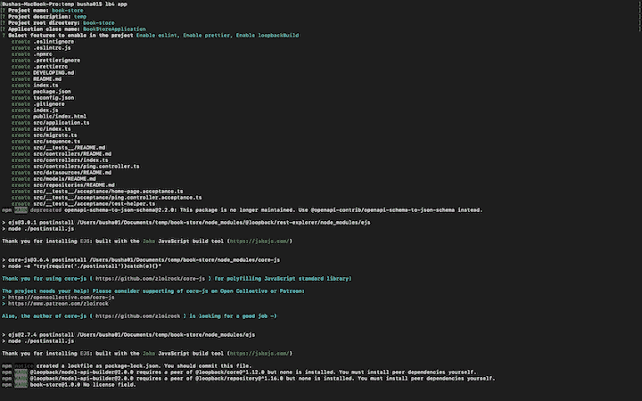
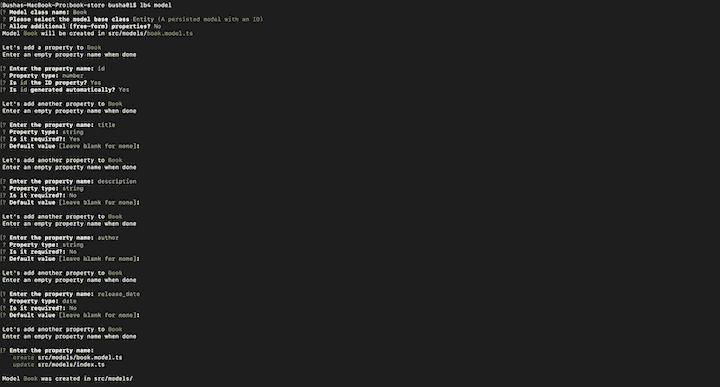
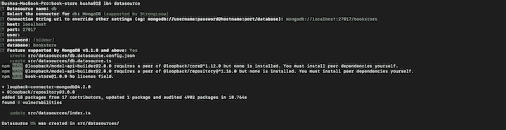
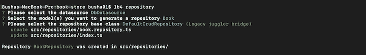
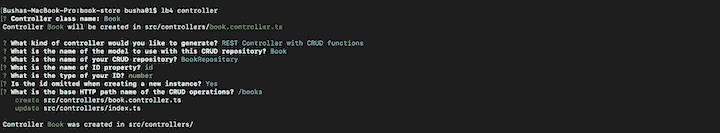
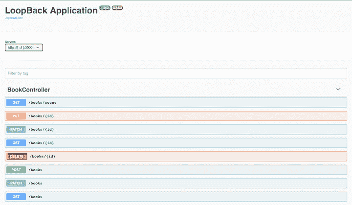

# 使用 LoopBack 创建动态应用程序

> 原文：<https://blog.logrocket.com/creating-a-dynamic-application-with-loopback/>

Node.js 是一个流行的 JavaScript 框架，有一个强大的、不断增长的社区。在生态系统提供的众多东西中， [LoopBack](https://loopback.io/) 是构建 API 和微服务的优秀框架。

根据[官方文档](https://developer.ibm.com/open/projects/loopback/)，“LoopBack 是一个高度可扩展的、开源的 Node.js 和基于 Express 的 TypeScript 框架，使您能够快速创建由数据库和 SOAP 或 REST 服务等后端系统组成的 API 和微服务。”

express . js——仍然是最受欢迎的 [Node.js 框架](https://snipcart.com/blog/graphql-nodejs-express-tutorial)——快速、非个性化、极简，但它缺乏成熟的 web 应用程序框架中常见的大多数功能。因为它是独立的，所以您必须做大量的决策，比如创建支持您的后端的结构和识别最合适的包。你真的需要知道你在做什么，你要去哪里。

使用 LoopBack，您的项目具有预定义的结构。您可以使用 [OpenAPI](https://www.openapis.org/) 标准来定义 API 端点和模式。您还可以使用连接器轻松地与数据库、web 服务和其他平台集成。LoopBack 提供了一个内置的 API explorer，您可以使用它来测试端点。

## 我们将建造什么

对于本教程，您需要在您的机器上安装 Node.js (v8+)以及一个文本编辑器。

我们将使用 LoopBack 构建一个书店应用程序。我们的应用程序将实现基本的 CRUD 操作，我们将演示如何使用 LoopBack 的 CLI 和 API explorer。

## 引导您的应用程序

为了引导回送应用程序，我们将使用回送 CLI。运行以下命令来安装它。

```
npm i -g @loopback/cli

```

现在您的机器上已经有了环回 CLI 工具。接下来，使用 CLI 工具创建一个新项目。转到您的项目目录并运行以下命令:

```
lb4 app

```

这是一个交互式命令，提示您回答几个问题来设置新项目。你需要输入应用的名称；我们就叫它`book``-store`。对于项目描述，可以输入`A dynamic application with Loopback`。当要求输入根目录和应用程序类名时，按 enter 键保持默认值。最后，对于功能，启用 beauty、ESLint 和`loopBackBuild`。

这个过程应该是这样的:



创建项目后，通过运行以下命令启动应用程序。

```
# Move into the app directory
cd book-store

# Start application
npm start

```

您应该在您的终端上看到一条消息，带有一个`URL`来测试。当您打开`URL`时，您应该会看到一个`JSON`显示在您的浏览器中。

## 添加图书模型

因为您正在构建一个简单的书店，所以您希望您的应用程序能够存储和检索来自数据源的书籍。为了实现这一点，我们需要构建一个描述您的域对象(数据类型)的模型。

LoopBack 提供了装饰器——`@model`和`@property`——使得定义的模型是可扩展的。您可以使用`@model`装饰器来配置模型设置(例如启用严格模式或隐藏某个属性)，使用`@property`装饰器来定义模型属性特征(例如，将属性类型指定为字符串或布尔值，或者将属性设置为必填)。

下一步是创建一个包含属性列表的 book 实体——即，`id`、`title`、`description`、`author`和`release_date`。您可以使用 LoopBack 的交互式命令来创建模型。

在您的应用程序目录中运行以下命令，并回答提示以生成您的图书模型。

```
lb4 model

```

如果您使用的是同一个终端窗口，您可能需要停止服务器的运行。在 Mac 上，您可以使用 Ctrl+C 来停止服务器。

下面是创建模型的过程:



对于要在数据库中持久化的模型，该模型必须有一个`id`属性，并从`Entity`基类继承。

## 设置数据源

通过提供必要的配置属性，LoopBack 中的数据源充当连接到各种数据源的接口，例如数据库、REST 服务、SOAP web 服务或 gRPC 微服务。在上一节中，您根据模型应该接受的数据类型定义了模型。这里，您需要定义数据是如何存储的。

在 LoopBack 中，应该使用 CLI 提供的`lb4 datasource`命令来生成数据源。当您运行这个命令时，您将被询问一些问题。下面是您应该提供的回答的截图。



注意:在用户和密码字段中，您可以通过按 enter 键跳过这些值，因为这只是一个示例应用程序。

在上面的截图中，指定的数据源连接被命名为`db`，您选择了 MongoDB 作为数据源连接器。LoopBack 提供了其他连接类型供您选择，如 Redis、MySQL、[PostgreSQL](https://blog.logrocket.com/getting-started-with-postgres-in-your-react-app/)和 REST 服务。

## 添加图书存储库

现在您已经有了一个模型和一个数据源，您需要创建一个存储库来处理图书模型对底层数据源的操作。

对于执行 CRUD 操作的存储库，它需要使用`DefaultCrudRepository`类，该类将模型与数据源绑定在一起。利用 LoopBack CLI 为您的应用程序创建存储库。

在项目文件夹中，运行以下命令:

```
lb4 repository

```

你的回答应该是这样的:



现在在你喜欢的编辑器中打开`src/repositories/book.repository.ts`文件，比如 [VSCode](https://blog.logrocket.com/learn-these-keyboard-shortcuts-to-become-a-vs-code-ninja/) 。在文件中，用下面的代码片段替换它:

```
// src/repositories/book.repository.ts

import {DefaultCrudRepository} from '@loopback/repository';
import {Book, BookRelations} from '../models';
import {DbDataSource} from '../datasources';
import {inject} from '@loopback/core';
export class BookRepository extends DefaultCrudRepository<
  Book,
  typeof Book.prototype.id,
  BookRelations
> {
  constructor(@inject('datasources.db') dataSource: DbDataSource) {
    super(Book, dataSource);
  }
  public findByTitle(title: string) {
    return this.findOne({where: {title}});
  }
  public findByAuthor(author: string) {
    return this.findOne({where: {author}});
  }
}

```

`BookRepository`类扩展了`DefaultCrudRepository`类。这使得像创建一本新书一样处理基本的 crud 操作成为可能。您还可以向存储库中添加定制方法来执行更多的操作，如`findByTitle`和`findByAuthor`。

## 添加图书控制器

到目前为止，您已经实现了模型、数据源和存储库，但是您在哪里定义处理应用程序请求的逻辑呢？在 LoopBack 中，您可以在`Controller`类中这样做。控制器处理应用程序的请求-响应生命周期。

根据[官方文档](https://loopback.io/doc/en/lb4/Controllers.html)，控制器“实现应用程序的业务逻辑，并充当 HTTP/REST API 和域/数据库模型之间的桥梁。”

在 LoopBack 中，您需要为您的路由指定一个基本的响应对象——也就是说，如果发出请求，您的 API 响应将会是什么样子。这个对象被称为 API 规范，它可以使用 [OpenAPI 规范](https://github.com/OAI/OpenAPI-Specification/blob/master/versions/3.0.0.md#oasObject)。如果您查看应用程序中的`PingController`(位于`src/controllers/ping.controller.ts`)，有一个`PING_RESPONSE`变量作为`ping()`方法的 API 规范。

控制器上的每个方法都用于处理来自 HTTP/REST API 端点的传入请求，执行一些逻辑，并返回响应。

有多种方式来定义到控制器方法的路由。您可以在位于`src/application.ts`文件中的主应用程序构造函数中定义一个到控制器方法的路径。

```
// ... in your application constructor
this.route('get', '/ping', PING_RESPONSE, PingController, 'ping');

```

另一种方式是使用装饰器，比如`@get`和`@post`，用路由的元数据来注释控制器方法。

```
// Map to `GET /ping`
@get('/ping', {
  responses: {
    '200': PING_RESPONSE,
  },
})

```

装饰器是简单的修改类、属性、方法或方法参数的函数。

现在，通过在终端中运行以下命令来创建一个`BookController`类:

```
lb4 controller

```

这个过程应该是这样的:



如果你打开位于`src/controllers`中的`book.controller.ts`文件，你会看到这个类处理大部分的 CRUD 操作，并与`BookRepository`类交互。在这个类中，这些方法使用 decorators 定义了它们的路由。

在`BookController`类中，您将找到处理创建新书操作的`create`方法。您将看到`BookRepository`类，它与图书模型和应用程序数据源交互来创建一本新书。在这个方法之上，路由`/books`是使用`@post`装饰器和`responses`对象定义的，前者表示一个`POST`请求，后者是响应 API 规范。

## 测试您的应用

像任何项目一样，你应该测试你的应用程序，以确保它正常工作。使用以下命令运行您的应用程序。

```
npm start

```

在浏览器中打开`[http://127.0.0.1:3000/explorer](http://127.0.0.1:3000/explorer)`。您应该看到 API explorer 显示了为您的`BookController`类定义的所有端点。

您可以使用 explorer 界面测试新添加的端点。下面的屏幕截图显示了向`/books`端点发出的 post 请求，该请求用于在 MongoDB 数据源中存储一本新书。



## 结论

如您所见，LoopBack 为您节省了大量手工工作。它的 CLI 提供了广泛的命令，可以做几乎任何事情，从创建模型、存储库和控制器，到为应用程序配置数据源。

LoopBack 可用于各种场景，包括 CRUD 操作(访问数据库)以及与其他基础设施和服务的集成。最后，开始使用 LoopBack 很简单，因为学习曲线很低。作为一个框架，LoopBack 有很大的潜力为 Node.js 社区带来无数的好处。

## 200 只显示器出现故障，生产中网络请求缓慢

部署基于节点的 web 应用程序或网站是容易的部分。确保您的节点实例继续为您的应用程序提供资源是事情变得更加困难的地方。如果您对确保对后端或第三方服务的请求成功感兴趣，

[try LogRocket](https://lp.logrocket.com/blg/node-signup)

.

[](https://lp.logrocket.com/blg/node-signup)[https://logrocket.com/signup/](https://lp.logrocket.com/blg/node-signup)

LogRocket 就像是网络和移动应用程序的 DVR，记录下用户与你的应用程序交互时发生的一切。您可以汇总并报告有问题的网络请求，以快速了解根本原因，而不是猜测问题发生的原因。

LogRocket 检测您的应用程序以记录基线性能计时，如页面加载时间、到达第一个字节的时间、慢速网络请求，还记录 Redux、NgRx 和 Vuex 操作/状态。

[Start monitoring for free](https://lp.logrocket.com/blg/node-signup)

.