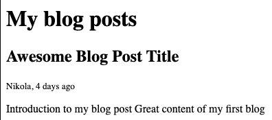
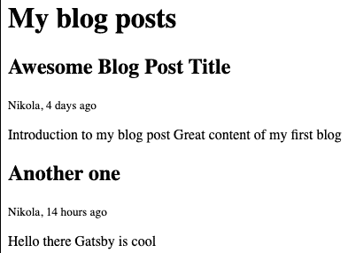
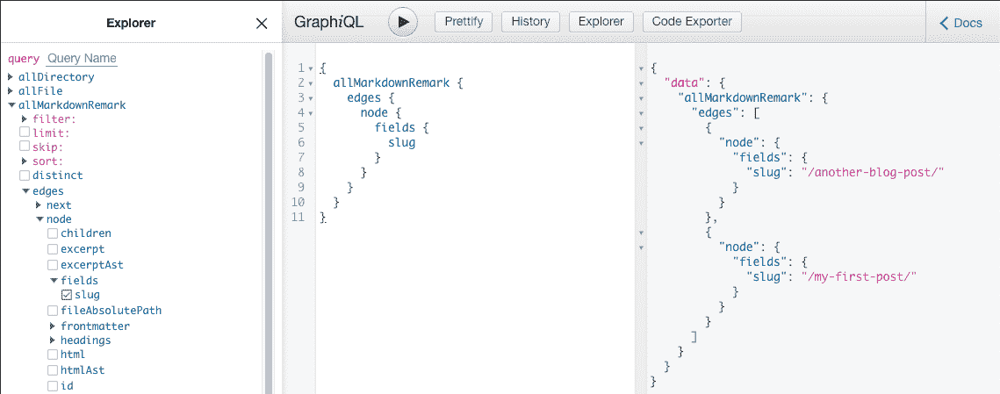

# 从头开始创建盖茨比博客

> 原文：<https://blog.logrocket.com/creating-a-gatsby-blog-from-scratch/>

欢迎来到 Gatsby(或 Gatby.js)，这是一个强大的静态站点生成框架，它利用了 GraphQL 和 React。随着时间的推移，盖茨比的知名度越来越高，越来越多的人开始使用它。其中一个原因是它能够帮助你直接快速地创建一个简单的静态网站。

你只需拿出他们的一个入门套件，在 Netlify 上注册一个账户，然后你就有了一个网站。

我以前也是这样建立网站的。我看到了一个可以毫不费力地立即创建博客的机会，于是就去了。但是后来当我试图在我的博客上添加一些复杂的逻辑时，出现了一个问题。我真的不明白幕后发生了什么。盖茨比在做什么，为什么看起来那么神奇？因此，我决定后退一步，从头开始创建一个盖茨比博客。

在这篇文章中，我将分享如何从一个简单的盖茨比初学者工具包建立一个博客，并解释盖茨比是如何在幕后工作的。这篇文章应该能让你明白这个固执己见的静态网站框架是如何运作的，以及你如何定制它来满足你的需求。

## 所需工具

在我们开始之前，您需要在您的机器上设置一些东西。

快速检查你的终端中是否有带`node --version`的 Node.js。你应该用 Node.js 得到 npm，但是用`npm --version`快速检查一下。如果两个命令都返回一个版本，就可以开始了。如果没有，你可以遵循 npm 网站上的[指示。](https://www.npmjs.com/get-npm)

现在我们已经解决了这个问题，我们可以在本地安装 Gatsby CLI。需要 Gatsby CLI 来调用命令，这些命令将生成我们的 repo，启动我们的开发服务器，甚至构建我们博客的生产代码。要安装它，您可以执行以下操作:

```
npm install -g gatsby-cli
```

快速验证盖茨比安装了`gatsby --version`。在安装并检查了我们开始开发所需的所有东西之后，我们可以开始深入研究了。

## 正在初始化回购

要开始这个博客，我们将使用来自 Gatsby 的简单的 [hello-world 启动工具包](https://github.com/gatsbyjs/gatsby-starter-hello-world)。这个工具包是一个简约的，一开始不会给你太多。我们这样做是为了更好地理解盖茨比及其内在。如果你想快速建立你的网站，你可以随时选择加入[盖茨比的其他工具包](https://www.gatsbyjs.org/starters/?v=2)。

让我们创建我们的工作目录:

```
gatsby new my-new-blog https://github.com/gatsbyjs/gatsby-starter-hello-world
```

在 Gatsby CLI 完成所有安装后，我们可以使用`cd my-new-blog`进入我们博客的目录，并使用`gatsby develop`启动服务器。这个命令将为我们设置一些东西，并使我们的网站在`[http://localhost:8000/](http://localhost:8000/)`可用。

打开就能看到平常的“Hello world！”。耶！我们的博客与生俱来。但是刚才发生了什么？是的，我们在终端上运行了几个命令，并在我们的新博客上向全世界问好，但这是怎么发生的呢？让我们从查看`src/pages/index.js`文件开始:

```
import React from "react"

export default function Home() {
  return <div>Hello world!</div>
}
```

一个非常简单的 React 组件，它只是向世界问好。当我们运行`gatsby develop`时，它会识别`src/pages/index.js`文件，并将其视为我们博客根页面的逻辑。盖茨比自己发现了这一点，这就是为什么我们在访问索引页面时会看到“Hello world”文本。

如果你试图对这个文件做一些改变，监视我们目录中所有改变的服务器会自动更新网站。多整洁啊！

只有一个文件并使用 Gatsby 听起来有些矫枉过正(确实如此)。这就是为什么我们会在我们的博客上添加内容，并解释整个过程。

## 盖茨比和 GraphQL

GraphQL 是一种查询您的 API 并获取您需要的数据的语言，非常强调一个请求就能完成。能够在一个请求中收集大量数据意味着您不必多次往返于您的服务器。

除此之外，您还需要定义一个模式作为查询的基础。盖茨比很聪明地做到了这一点。为了更好地理解 Gatsby 和 GraphQL 是如何工作的，让我们首先向我们的网站添加一些数据。

你可能想添加的第一件事是关于你的博客的一些一般信息——例如，你的网站的标题和描述对任何访问者都是有用的。让我们在`gatsby-config.js`文件中定义这些数据。我们将在以后的一些其他工作中使用这个文件，但是现在，让我们这样做:

```
module.exports = {
  /* Your site config here */
  siteMetadata: {
    title: 'My New Blog',
    description: 'This is my awesome blog I made from scratch!'  
  },
  plugins: [],
}
```

现在，让我们在浏览器中向用户显示这些数据。如果我们转到`src/pages/index.js`，我们可以添加一个简单的 GraphQL 查询来获取我们刚刚添加的数据:

```
import React from "react"
import { graphql } from "gatsby"

export default function Home({ data }) {
  const { title, description } = data.site.siteMetadata

  return (
    <div>
      <h1>{title}</h1>
      <p>{description}</p>
    </div>
  )
}

export const pageQuery = graphql`
  query MetadataQuery {
    site {
      siteMetadata {
        title
        description
      }
    }
  }
`
```

在文件的底部，我们将放置 GraphQL 查询，该查询将获取我们之前添加到`gastby-config.js`中的标题和描述。GraphQL 使这些数据可用，Gatsby 进行提取。我们不必显式调用查询。获取将在构建过程中为我们完成。

这种高效的构建过程就是 Gatsby 被定义为“快得令人作呕”的原因，因为它在数据加载到浏览器之前就完成了所有的页面数据获取。当然，您可以在组件中编写一些额外的获取逻辑，但是这些逻辑不会以相同的方式加载。

Gatsby 将在构建过程中(当我们运行`gatsby develop`时)通过识别在`src/pages/index.js`中有一些 GraphQL 逻辑来使这些数据对 GraphQL 可用。此外，我们添加到`gatsby-config.js`中的`siteMetadata`对象将对 GraphQL 可用。

如果您愿意，可以在`[http://localhost:8000/___graphiql](http://localhost:8000/___graphiql)`查看 GraphiQL 工具中还有什么可用的。当您运行服务器时，您可以在本地使用它。

我们成功地将一些数据放入我们的单页博客中，并且我们设法弄清楚盖茨比是如何处理数据的。但这仍然不在有人会读的博客附近。我们需要让它变得友好一点。再加一张可爱狗狗的图片，为《盖茨比》中添加和读取文件做铺垫。

## 管理图片

为了让我们的博客更吸引人，我们将添加一张图片。我会把我在网上找到的一张可爱狗狗的图片添加到一个新的目录:`src/images`。

最终的路径应该是这样的:`src/images/cute-dog.jpg`。为了以 Gatsby 的方式显示这个图像，我们需要安装一个 Gatsby 插件。插件是有用的库，在构建盖茨比网站时让我们的生活变得更容易，有很多有用的插件你可以在这里浏览[。主要思想是不要为通常的任务和功能编写解决方案，比如](https://www.gatsbyjs.org/plugins/) [SEO](https://www.gatsbyjs.org/packages/gatsby-plugin-seo/) 、 [RSS](https://www.gatsbyjs.org/packages/gatsby-plugin-feed) 、离线支持，以及——你猜对了——[图片](https://www.gatsbyjs.org/packages/gatsby-image)。

我们将要使用的这个叫做 [gatsby-source-filesystem](https://www.gatsbyjs.org/packages/gatsby-source-filesystem/) 。从它的名字就可以看出它与文件有某种联系。你是正确的！这个插件将帮助我们使用 GraphQL 查询可爱的小狗图片。

要安装它，请运行以下命令:

```
npm install --save gatsby-source-filesystem
```

然后，如果你记得`gatsby-config.js`，我们会用它告诉盖茨比我们有它的插件，就像这样:

```
module.exports = {
  /* Your site config here */
  siteMetadata: {
    title: "Myasd New Blog",
    description: "This is my awesome blog I made from scratch!",
  },
  plugins: [
    {
      resolve: `gatsby-source-filesystem`,
      options: {
        name: `images`,
        path: `${__dirname}/src/images/`,
      },
    },
  ],
}
```

除了我们在上一步中添加的数据，我们现在添加了关于`gatsby-source-filesystem`插件的细节。在选项中，我们指定了源的名称——“images”——并指定了图像所在的路径。

定义名称是一个重要的步骤，您可能想知道为什么我们需要设置它。Gatsby 可以从不同的来源读取数据——不仅仅是我们的文件系统。来源的另一个例子是 [WordPress](https://wordpress.com/) 或[contentiful](https://www.contentful.com/)。因此，我们的文件系统只是我们可以存储图像或博客文章的一种可能性，为“图像”设置一个`name`可以帮助我们区分不同的来源，并在将来以另一种方式处理它们。

无论如何，在我们添加插件后，如果我们在终端中查看我们正在运行的服务器，应该会有以下消息:

```
warn develop process needs to be restarted to apply the changes to gatsby-config.js
```

我们需要重启服务器，让 Gatsby 获得新的插件。让我们重新启动服务器。众所周知，盖茨比[的](https://github.com/gatsbyjs/gatsby/issues/18048)和`npm install`有问题，所以如果你在添加`gatsby-source-filesystem`插件时遇到错误，请确保添加`rm -rf node_modules && npm install`或`npm install react react-dom gatsby`。

服务器启动后，我们可以尝试获取我们的`src/pages/index.js`文件中的图像:

```
import React from "react"
import { graphql } from "gatsby"

export default function Home({ data }) {
  const { title, description } = data.site.siteMetadata

  return (
    <div>
      <h1>{title}</h1>
      <p>{description}</p>

      
    </div>
  )
}

export const pageQuery = graphql`
  query MetadataQuery {
    site {
      siteMetadata {
        title
        description
      }
    }

    image: file(base: { eq: "cute-dog.jpg" }) {
      publicURL
    }
  }
`
```

我们扩展了 GraphQL 查询来搜索名为“cute-dog.jpg”的文件。然后，我们告诉 GraphQL 将该文件命名为 image，这样我们就可以在代码的后面有意义地引用它。最后，在我们的代码中，我们放置了一个 JSX 图像标签，并在那里引用了该图像的公共 URL。

瞧，我们得到了显示在我们页面上的图像:


我们建立的一切都很好，但我们的博客上仍然没有任何博客帖子，所以让我们在下一章添加它们。

## 处理降价文件

自从杰基尔 T2 时代以来，使用 Markdown 这种轻量级标记语言编写内容变得流行起来。我们将为我们的博客做同样的事情。让我们在`src/blog/my-first-post.md`中添加我们的第一篇博文:

```
---
title: Awesome Blog Post Title
author: Nikola
date: 2020-07-15
---

## Introduction to my blog post

Great content of my first blog
```

顶部是代表帖子一般信息的封面内容。接下来是内容。让我们不要一开始就在这里撒野，使用简单的内容，我们可以在以后的基础上构建。

因为我们添加了`src/blog`目录，并且我们计划在那里存储所有的 Markdown 文件，所以让我们在我们的`gatsby-config.js`中定义它:

```
  plugins: [
    {
      resolve: `gatsby-source-filesystem`,
      options: {
        name: `images`,
        path: `${__dirname}/src/images/`,
      },
    },
    {
      resolve: `gatsby-source-filesystem`,
      options: {
        name: `blog`,
        path: `${__dirname}/src/blog/`,
      },
    },
  ],
```

现在我们有两个盖茨比应该知道的地方:`src/images`和`src/blog`。我们可以继续使用与获取图像类似的查询，但是让我们[试试 Gatsby 提供的](https://www.gatsbyjs.org/packages/gatsby-transformer-remark/)插件`gatsby-transformer-remark`。这个插件允许你使用 [Remark](https://remark.js.org/) ，一个降价处理器，并减少花费在解析所有降价文件上的时间。

您可以使用以下方式安装此插件:

```
npm install --save gatsby-transformer-remark
```

放在`gatsby-config.js`里面:

```
  plugins: [
    {
      resolve: `gatsby-source-filesystem`,
      options: {
        name: `images`,
        path: `${__dirname}/src/images/`,
      },
    },
    {
      resolve: `gatsby-source-filesystem`,
      options: {
        name: `blog`,
        path: `${__dirname}/src/blog/`,
      },
    },
    `gatsby-transformer-remark`,
  ],
```

现在我们重启`gatsby develop`服务器。完美！为了展示我们的博客文章，我们将在`src/pages/blog.js`中为它创建一个单独的页面:

```
import React from "react"
import { graphql } from "gatsby"

export default function Blog({ data }) {
  const { posts } = data.blog

  return (
    <div>
      <h1>My blog posts</h1>

      {posts.map(post => (
        <article key={post.id}>
          <h2>{post.frontmatter.title}</h2>
          <small>{post.frontmatter.author}, {post.frontmatter.date}</small>
          <p>{post.excerpt}</p>
        </article>
      ))}
    </div>
  )
}

export const pageQuery = graphql`
  query MyQuery {
    blog: allMarkdownRemark {
      posts: nodes {
        frontmatter {
          date(fromNow: true)
          title
          author
        }
        excerpt
        id
      }
    }
  }
`
```

这里，我们使用`allMarkdownRemark`查询所有的降价文件，它可以从我们安装的插件`gatsby-transformer-remark`中获得。

这使得我们可以直接获取包括`date`、`title`和`author`在内的前端物质。我们还可以向`date(fromNow: true)`传递一个参数，它显示相对时间，例如，“5 天前”如果没有`gatsby-transformer-remark`，我们将不得不以某种方式自己解析它。

然后，在博客组件中，我们向用户列出所有的博客文章及其信息。请注意，我们没有任何博客文章的链接，但我们稍后会添加。

幸运的是，盖茨比将接受所有这些变化，并在`/blog`时打开新的一页。如果我们转到`/blog`，我们应该会看到这样的内容:



您可以在`src/blog`中添加另一个 Markdown 文件，它将自动被 Gatsby 获取。



相当酷！但是我如何访问一篇独立的博客文章呢？这就是事情变得棘手的地方。请继续阅读，了解如何做到这一点。

## 动态创建页面

要创建所有博客文章的链接，我们需要告诉 Gatsby 为我们创建它们。这一部分是你应该保持大部分注意力的地方，因为我们现在开始玩 Gatsby 的内部。到目前为止，我们已经安装了插件，添加了数据，并编写了一些 Markdown 和 JSX，但现在是时候开始了。

### 摆弄节点

首先，让我们了解一下《盖茨比》中的“节点”一词。正如 [Gatsby docs 所说](https://www.gatsbyjs.org/docs/node-interface/)，节点是 Gatsby 数据系统的中心。在 Gatsby 中，我们添加的所有数据都表示为节点对象。

如果您回过头来查看我们获取所有降价帖子的查询，您会发现我们查询的是`nodes`。`gatsby-source-filesystem`“扫描”我们告诉它的目录，并为这些目录中的每个文件创建节点。然后`gatsby-markdown-remark`来了，解析节点内的数据，并向那些节点对象添加额外的字段。

此外，Gatsby 还根据这些节点的内容总结并提出了这些节点的 GraphQL 模式。哇，可能一次要接受很多东西。我敢打赌，如果我们看到一个例子，它会更容易。

让我们从为我们的每篇博客文章创建一个 slug 开始。例如，由于我们添加了`src/blog/my-first-post.md`，我们希望在访问`/my-first-post`时看到那篇博文。为此，我们将利用`gatsby-source-filesystem`自带的`createFilePath`功能来完成这项工作。

刚刚创建了一个 slug，我们还将创建一个我们在上一节中描述的节点。制作 slug 最好的地方是盖茨比公开的`[onCreateNode](https://www.gatsbyjs.org/docs/node-apis/#onCreateNode)` API。像我们这样的插件和用户可以在创建或更新节点时使用`onCreateNode`来定制节点或做其他事情。

像这样的逻辑放在`gatsby-node.js`中，我们将创建一个新文件:

```
const { createFilePath } = require(`gatsby-source-filesystem`)

exports.onCreateNode = ({ node, getNode, actions }) => {
  const { createNodeField } = actions

  if (node.internal.type === `MarkdownRemark`) {
    const slug = createFilePath({ node, getNode, basePath: `pages` })

    createNodeField({
      node,
      name: `slug`,
      value: slug,
    })
  }
}
```

如果您继续并重新启动服务器，快速打开本地 GraphiQL 工具(`[http://localhost:8000/___graphiql](http://localhost:8000/___graphiql)`)，并使用以下查询来查询 slugs:

```
{
  allMarkdownRemark {
    edges {
      node {
        fields {
          slug
        }
      }
    }
  }
}
```

您应该会看到我们之前添加的两篇 Markdown 博客文章:



相当整洁！我们告诉 Gatsby 用字段`slug`展开每个 Markdown 节点，我们可以用它将用户重定向到我们的博客文章。

但是等等，如果你尝试访问`/another-blog-post`，会得到 404。这很好，因为我们没有创建实际的页面，我们只是生成了 slugs。按照下一节学习如何做到这一点。

### 以编程方式生成页面

幸运的是，Gatsby 公开了 API，这让我们可以做到这一点。但是，在我们继续向`gatsby-node.js`添加更多逻辑之前，我们需要做一些别的事情。由于 Gatsby 页面使用 React，因此每个页面都需要一个 React 组件来呈现数据。为此，我们将为我们的博客文章创建一个组件，并将其放入`src/templates/blog-post.js`:

```
import React from "react"

export default function BlogPost() {
  return <div>Hello blog post</div>
}
```

如您所见，它是一个简单的组件，不利用任何数据。我们以后会改变这一点。我们必须有某种 React 组件来告诉 Gatsby 呈现我们的博客帖子。

至此，让我们给`gatsby-node.js`添加一些逻辑来创建实际的博客文章页面:

```
const path = require(`path`)
const { createFilePath } = require(`gatsby-source-filesystem`)

exports.onCreateNode = ({ node, getNode, actions }) => {
  const { createNodeField } = actions

  if (node.internal.type === `MarkdownRemark`) {
    const slug = createFilePath({ node, getNode, basePath: `pages` })

    createNodeField({
      node,
      name: `slug`,
      value: slug,
    })
  }
}

exports.createPages = async ({ graphql, actions }) => {
  const { createPage } = actions
  const result = await graphql(`
    query {
      allMarkdownRemark {
        edges {
          node {
            fields {
              slug
            }
          }
        }
      }
    }
  `)

  result.data.allMarkdownRemark.edges.forEach(({ node }) => {
    createPage({
      path: node.fields.slug,
      component: path.resolve(`./src/templates/blog-post.js`),
      context: {
        // Data passed to context is available
        // in page queries as GraphQL variables.
        slug: node.fields.slug,
      },
    })
  })
}
```

我们在页面创建逻辑中添加了看似很多的代码。简而言之，事情是这样的:

*   我们查询所有的降价页面并得到它们的 slugs
*   然后，我们遍历所有这些并调用`createPage`
*   在`createPage`中，我们指定了页面的路径，我们刚刚添加的组件`src/templates/blog-post.js`，并且我们传入了上下文，稍后我们将对此进行解释

如果您继续并重启您的服务器并尝试访问`[http://localhost:8000/my-first-post/](http://localhost:8000/my-first-post/)`，您应该会看到我们之前在组件中添加的简单的“Hello blog post”文本。相反，我们应该看到我们放在降价文件中的内容。

让我们把`src/templates/blog-post.js`改成这样:

```
import React from "react"
import { graphql } from "gatsby"

export default function BlogPost({ data }) {
  const post = data.markdownRemark

  return (
    <div>
      <h1>{post.frontmatter.title}</h1>
      <small>{post.frontmatter.date}</small>
      <div dangerouslySetInnerHTML={{ __html: post.html }} />
    </div>
  )
}
export const query = graphql`
  query BlogQuery($slug: String!) {
    markdownRemark(fields: { slug: { eq: $slug } }) {
      html
      frontmatter {
        title
        date
      }
    }
  }
`

```

现在，我们使用 Markdown 文件中的数据，而不是只显示“Hello blog post”需要注意的一点是，我们使用了在`gatsby-node.js`中创建页面时指定的`$slug`变量。

`slug`也可以作为`BlogPost`组件内部的道具。使用我们在`createPage`中定义的`slug`，我们然后查询匹配节点的 Markdown 节点。然后，在组件中，我们使用在查询中指定的字段来正确显示博客文章。如果你现在打开`[http://localhost:8000/my-first-post/](http://localhost:8000/my-first-post/)`，你应该会看到你在 Markdown 文件中定义的博文。

这是相当激烈的，试图创建 slugs 和页面，并显示文件内的数据。恭喜你走到这一步！作为蛋糕上的樱桃，让我们通过从我们的博客页面链接到那些博客帖子来把它绑起来。

## 收尾工作

如你所知，我们创建了`/blog`页面，但是我们没有从主页链接到它。让我们快速添加到`src/pages/index.js`中:

```
<Link to="/blog">Read my blog</Link>
```

然后，让我们从博客页面链接到每篇博文:

```
import React from "react"
import { graphql, Link } from "gatsby"

export default function Blog({ data }) {
  const { posts } = data.blog

  return (
    <div>
      <h1>My blog posts</h1>

      {posts.map(post => (
        <article key={post.id}>
          <Link to={post.fields.slug}>
            <h2>{post.frontmatter.title}</h2>
          </Link>
          <small>
            {post.frontmatter.author}, {post.frontmatter.date}
          </small>
          <p>{post.excerpt}</p>
        </article>
      ))}
    </div>
  )
}

export const pageQuery = graphql`
  query MyQuery {
    blog: allMarkdownRemark {
      posts: nodes {
        fields {
          slug
        }
        frontmatter {
          date(fromNow: true)
          title
          author
        }
        excerpt
        id
      }
    }
  }
`
```

我们从 Gatsby 导入了`Link`组件，它将为我们处理路由。然后，我们在 GraphQL 查询中查询这个 slug。我们稍后使用这个 slug 来形成每个博客文章的链接。就是这样！你刚刚用盖茨比从头开始建立了一个简单的博客。

### 可以尝试的想法

我们建立的博客帖子看起来还远未完成，但从现在开始应该会很容易。你已经具备了扩展博客的所有基础。以下是一些你可以尝试的想法:

*   将博客文章路径切换到从`/blog/*`(提示:当我们调用`createPage`时编辑`path`变量)
*   显示主页上的所有帖子
*   给你的博客添加一些风格
*   部署它，让世界知道你要说什么！

## 结论

为成功而喝彩！如果您已经到了这一步，那么您应该已经学会了如何构建一个简单的博客，并且对 Gatbsy 的内部有了一个高层次的理解。现在，节点的概念和 Gatsby 处理数据的方式对您来说应该是轻而易举的事情。还有，我希望盖茨比的魔法对你来说有点去神秘化了。

总而言之，Gatsby 是一个快速建立静态站点的好工具。有许多其他的工具和方法来实现它，但是理解本质和幕后发生的事情总是朝着正确的方向迈出的一步。我希望这些知识能在未来伴随你，帮助你建立伟大的网站。

如果你喜欢这篇文章，考虑与你的朋友和同事分享。

下次见，干杯！