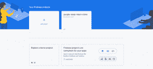
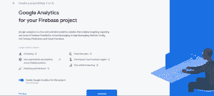
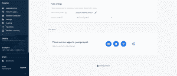
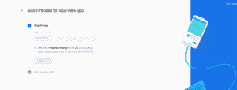
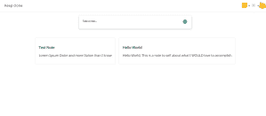
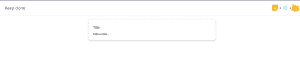

# 用 React 和 Firebase 创建 Google Keep 克隆

> 原文：<https://blog.logrocket.com/creating-a-google-keep-clone-with-react-and-firebase/>

在本文中，我们将使用 React、React Hooks、样式化组件和 Firebase 创建一个 Google Keep 的克隆。Google Keep 是一款笔记应用，我们将复制的一些功能包括创建笔记并将其存储在 Firebase 中。

这是我们将要实现的目标:[keep-react-clone . net lify . app](https://keep-react-clone.netlify.app/)。

## 先决条件

你需要 React(功能组件)、React 钩子和 JavaScript 的基础知识。

另外，确保你的机器上安装了[节点> = 8.10 和 npm > = 5.6](https://nodejs.org/en/) 。你可以在这里安装 [Node.js。](https://nodejs.org/)

## 我们开始吧

首先，让我们创建一个 React 应用程序:

```
npx create-react-app google-keep-clone
cd google-keep-clone
```

现在我们将安装 Firebase:

```
npm install --save firebase
```

还安装样式组件:

```
npm install --save styled-components
```

要创建 Firebase 项目，请打开 [firebase 控制台](https://console.firebase.google.com/)，登录并点击“添加项目”创建一个项目



然后填写您的项目名称:


在下一页，您可以决定启用 Google Analytics:



最后，创建项目。

完成后，它会将您带到 Firebase 控制台:


在 Firebase 控制台上，单击项目概述旁边的设置图标，并导航到项目设置。

向下滚动到您的应用程序，然后单击 web 应用程序按钮:



现在，您应该有一个打开的界面来注册 web 应用程序。填写昵称并点击按钮:



现在，它应该显示您的 Firebase 配置详细信息，复制脚本标记中的所有内容。

回到我们的代码，在您的 src 文件夹中创建一个 Firebase.js 文件，导入我们安装的 Firebase，并将您从配置细节中获得的所有内容粘贴到脚本标记中。

不要忘记导出 Firebase，因为这是您将要导入到 React 组件中的文件。

你应该有这样的东西:

```
import firebase from 'firebase';
  const firebaseConfig = {
    apiKey: "xxxxxxxxxx",
    authDomain: "keep-react-clone.firebaseapp.com",
    databaseURL: "https://keep-react-clone.firebaseio.com",
    projectId: "keep-react-clone",
    storageBucket: "keep-react-clone.appspot.com",
    messagingSenderId: "xxxxxxxx",
    appId: "xxxxxxxxxx",
    measurementId: "xxxxxxx"
  };

  firebase.initializeApp(firebaseConfig);
  firebase.analytics();
  export default firebase
```

注意:“xxxxxxxx”只是一个占位符，您的占位符将是实际的字符。

清除 App.js 中的默认设置，这样就只剩下 React 和 CSS 导入以及 App 组件了。

现在将 Firebase 文件导入其中:

```
import firebase from ./firebase
```

## 构建布局

让我们创建我们的标题。

这是我们想要实现的目标。这应该不会太难:



让我们在 components 文件夹中创建一个 Header.js 文件(如果默认情况下没有看到 components 文件夹，请在 src 文件夹中创建它)。

我们将导入 React 和样式组件:

```
import React from "react";
import styled from "styled-components";
```

此外，导入您的徽标图像:

```
import keepLogo from '../assets/keep-logo.png'
import reactLogo from '../logo.svg'
import firebaseLogo from '../assets/firebase-logo.png'
```

之后，我们创建功能组件并将其导出:

```
const Header = () => {
   return ();
  };

 export default Header;
```

## 使用样式化组件创建元素

样式化组件帮助你在 JavaScript 中编写 CSS。通过这种方式，您可以创建具有预定义样式的可重用元素。

要创建一个导航，用一些样式来包装我们的标题，我们只需创建一个变量。然后，我们在我们的 CSS 样式中以前面加有`styled.(name of element)`的`backtick:`来调用它的值。

它看起来会像这样:

```
const Nav = styled.nav`
  display: flex;
  justify-content: space-between;
  align-items:center;
  padding: 4px 25px;
  border-bottom: 1px solid rgba(60, 64, 67, 0.2);
  `;
```

对右端的徽标包装进行同样的操作:

```
const ImgWrap = styled.div`
display: flex;
align-items:center;
`;
```

我们的图像元素:

```
const Img = styled.img`
width:40px;
height:40px;
`;
```

有了这些，我们可以更新我们的头函数，如下所示:

```
const Header = () => {
    return (
      <Nav>
        <p>Keep clone</p>
        <ImgWrap>
          
          <p>+</p>
          
          <p>+</p>
          
        </ImgWrap>
      </Nav>
    );
  };
```

移动到应用程序的主体，让我们创建一个 Main.js 文件，并像上面那样导入 React 和 styled 组件。

然后，我们创建一个名为 main 的功能组件，在这里我们返回主 HTML 元素。

```
const Main = () =>{ 
   return(
      <main>
      </main>
    )
  }
  export default Main
```

接下来，我们创建一个表单，其中包含注释标题的输入和注释正文的文本区域。对于我们样式化的组件，我们将其命名为`NoteInput`。

```
const NoteInput = styled.form`
  box-shadow: 0 1px 2px 0 rgba(60,64,67,.3),
    0 2px 6px 2px rgba(60,64,67,.15);
  width:600px;
  border-radius:8px;
  margin:20px auto;
  padding:20px;
  `
```

然后是标题和文本区的样式。

```
const Title = styled.input`
    border:none;
    color:#000;
    display:block;
    width:100%;
    font-size:18px;
    margin:10px 0;
    outline:none;
    &::placeholder{
      color:#3c4043;
      opacity:1;
    }
  `
```

```
const TextArea = styled.textarea`
      border:none;
      color:#000;
      display:block;
      width:100%;
      font-family: 'Noto Sans', sans-serif;
      font-size:13px;
      font-weight:bold;
      outline:none;
      resize: none;
      overflow: hidden;
      min-height: 10px;
      &::placeholder{
        color:#3c4043;
        opacity:1;
      }
  `
```

> 注意:我没有详细说明 CSS 样式，因为它们只是基本的样式，这篇文章的目的不是教 CSS。

让我们将我们的`NoteInput`、标题和文本区域添加到组件中:

```
const Main = () =>{ 
   return(
      <main>
       <NoteInput action="">
         <Title type="text" placeholder="Title"/> 
         <TextArea name="" id="" cols="30" rows="1" placeholder="Take a note..."/>
        </NoteInput>
      </main>
    )
  }
  export default Main
```

在我们的 App.js 文件中，我们必须导入 Header 和 Main 组件，以查看我们到目前为止所做的工作。我们还将导入`useState`和`UseEffect`，稍后我们会用到它们:

```
import React, { useState, useEffect } from "react";
import Header from "./components/Header";
import Main from "./components/Main";
```

您的浏览器中应该有这样的内容:



但是查看 Google Keep 应用程序，标题不会显示，直到你点击文本区域。为了实现这一点，我们将为`showInput`创建一个状态，并根据 textarea 是否被点击来切换它的值。

```
const [showInput, setShowInput] = useState(false);
```

让我们也为标题输入和文本区域创建状态:

```
const [textValue, setTextValue] = useState('');
const [titleValue, setTitleValue] = useState('');
```

然后，我们将把`showInput`、`textValue`、`titleValue`和它们的状态处理程序传递给主组件。

```
<Main
textValue = {textValue}
titleValue = {titleValue}
showInput={showInput}
onShowInput = {(state)=>setShowInput(state)}
onTextChange = {(state)=>setTextValue(state)}
onTitleChange = {state=>setTitleValue(state)}
/>
```

在 Main.js 中，我们可以将道具传递到我们的功能组件中，并动态显示标题输入:

```
{props.showInput ? <Title type="text" name="" id="" 
 placeholder="Title" 
 value={props.titleValue}
 onFocus={()=>props.onTitleFocus(true)}
 onBlur={()=>props.onTitleFocus(false)}
 onChange={(e)=>props.onTitleChange(e.target.value)}
 /> : ''
 }
```

我们还将为文本区域添加值和`onChange`事件，并将`showInput`设置为真`onFocus`。

```
<TextArea name="" id="" cols="30" rows="1" 
            placeholder="Take a note..." 
            value={props.textValue} 
            onFocus={()=> {
              props.onShowInput(true);
            }}
            onChange={(e)=>props.onTextChange(e.target.value)}
          />
```

文本区域不会随着文本自动增长，所以为了确保这一点，我们创建了一个`autoGrow`函数

```
const autoGrow = (elem) =>{
      elem.current.style.height = "5px";
      elem.current.style.height = (10 + 
      elem.current.scrollHeight)+"px";
    }
```

我们将使用`useRef`钩子将我们想要的元素传递给`autoGrow`函数。

要使用`useRef`，我们必须导入它，因此将您的导入更新为:

```
import React, { useRef} from 'react'
```

然后我们可以使用`useRef`钩子:

```
const textAreaRef = useRef(null);
```

我们将添加文本区域的 ref 值为`textAreaRef`:

```
ref={textAreaRef}
```

还要确保用`onFocus`，我们的 ref 被聚焦，用`onInput`，我们调用`autoGrow`函数。

这是我们现在更新的文本区:

```
<TextArea name="" id="" cols="30" rows="1" 
        placeholder="Take a note..." 
        value={props.textValue} onFocus={()=> {
         props.onShowInput(true);
         textAreaRef.current.focus();
        }} onInput={()=>autoGrow(textAreaRef)} ref={textAreaRef}  
        onChange={(e)=>props.onTextChange(e.target.value)}
/>
```

Google Keep 的工作方式是，当你点击文本框外部时，该注释会被添加到列表中。为了实现这一点，我们必须检查文本区域和标题输入是否被聚焦。

所以让我们回到 App.js 文件，创建两个新状态:`textFocused`和`titleFocused`。

```
const [textFocused, setTextFocused] = useState(false);
const [titleFocused, setTitleFocused] = useState(false);
```

像这样把它传递给你的主组件:

```
onTextFocus={(state) => setTextFocused(state)}
onTitleFocus={(state)=>setTitleFocused(state)}
```

回到我们的 Main.js 来创建标题。它的`onFocus`事件将把`textFocused`设置为真，而`onBlur`将把`textFocused`设置为假。

```
onFocus={()=>props.onTitleFocus(true)}
onBlur={()=>props.onTitleFocus(false)}
```

这同样适用于 TextArea:

```
onFocus={()=>props.onTitleFocus(true)}
onBlur={()=>props.onTextFocus(false)}
```

然后，我们将创建一个函数，当应用程序被单击时将调用该函数。该函数检查`textFocused`和`titleFocused`是否都为假，以及在添加新注释之前`textValue`或`titleValue`是否不为空。

```
const blurOut = () => {
    if (!textFocused && !titleFocused) {
      if(textValue !== '' || titleValue !== ''){
        setShowInput(false)
        let noteObj = {
          title:titleValue,
          text:textValue
        }
        setTextValue('');
        setTitleValue('')
      }
    }
  };
```

您会注意到我们只创建了一个注释对象。让我们为我们的笔记创建一个状态:

```
const [notes, setNotes] = useState([]);
```

我们可以在函数`blurOut`中的`setTitleValue(‘ ‘))`后添加这个。

```
setNotes([...notes, noteObj])
```

如果你想知道为什么我们使用 spread 操作符，这基本上是将`noteObj`添加到已经存在的音符中。你可以阅读更多关于[传播运营商](https://developer.mozilla.org/en-US/docs/Web/JavaScript/Reference/Operators/Spread_syntax)。

为了显示我们的注释，让我们为注释组件创建一个 Note.js 文件。

除了基本的造型，这里没有什么，所以你可以复制这个:

```
import React from 'react'
  import styled from "styled-components";

  const NoteDiv = styled.div`
  padding:20px;
  border:1px solid #e0e0e0;
  border-radius:8px;
  text-align:left;
  font-size:18px;
  margin:10px;
  min-width:300px;
  `
  const H = styled.h3`
  font-size:20px;
  font-weight:bold;`
  const Note = (props) =>{
    return(
      <NoteDiv>
        <H>{props.note.title}</H>
        <p>{props.note.text}</p>
      </NoteDiv>
    )
  }
  export default Note;
```

现在，将 Note.js 导入到 Main.js 组件中。我们将首先为名为`NoteCon`的笔记创建一个包装器:

```
const NoteCon = styled.div`
padding:20px;
display:flex;
flex-wrap:wrap;
justify-content:center;
`
```

我们将在`NoteInput`之后添加包装器，并将从 App.js 获得的注释映射到注释组件。如果你不知道 React 中的列表渲染，看看[这个](https://reactjs.org/docs/lists-and-keys.html) 。

```
<NoteCon>
 {props.notes.map((note,index)=><Note note={note} 
 key={index} />)}
</NoteCon>
```

回到 App.js，将 notes 作为道具传递给 Main 组件。

```
notes={notes}
```

我们还将调用 App 组件的`blurOut`函数`onClick`。

## 从 Firebase 存储和获取数据

我们到目前为止所做的不会持续。一旦你刷新，它就清除了。我们需要将 notes 信息存储到 Firebase，并在每次刷新时从那里获取它。

因为我们已经导入了 Firebase，所以我们可以调用 Firebase 数据库中的数据引用，并使用 Firebase 内置的方法来存储数据。

```
const db = firebase.database().ref('data');
db.push().set(noteObj)
```

我们更新后的`blurOut`函数应该是这样的(我使用`try...catch`进行错误处理):

```
const blurOut = () => {
    if (!textFocused && !titleFocused) {
      if(textValue !== '' || titleValue !== ''){
        setShowInput(false)
        let noteObj = {
          title:titleValue,
          text:textValue
        }
        setTextValue('');
        setTitleValue('')
        try{
          setNotes([...notes, noteObj])
            const db = firebase.database().ref('data');
            db.push().set(noteObj)
        }
        catch(error){
          console.log(error);
        }
      }
    }
  };
```

为了获取数据，让我们创建一个函数`getData`:

```
const getData = ()=>{}
```

然后，我们为注释创建一个空数组，遍历数据库中的每个值，并推送到我们的数组。在更新状态之前，我们最后检查以确保数组不为空:

```
const getData = ()=>{
    let notesArr = [];
    try{  
      const db = firebase.database().ref('data');
      db.orderByValue().once("value", snapshot =>{
        snapshot.forEach((note)=>{
          // console.log(notes)
          // setNotes([...notes, note.val()])
          notesArr.push(note.val());
        })

        if(notesArr.length !== 0){
         setNotes(notesArr)
        }
      })
     }
    catch(error){
       console.log(error)
    }
  };
```

记得我们导入了 useEffect 钩子。我们将在`useEffect`中调用我们的`getData`函数。

这个 React 钩子确保它的函数在页面呈现后立即被调用。

```
useEffect(()=>{
 getData();
}, [])
```

末尾的空数组意味着这个 useEffect 应该只运行一次，在组件被挂载的初始时间，这正是我们想要的。
作为参考，你可以查看这个[回购](https://github.com/Ajiva-D/google-keep-react-clone)，看看我实际做了什么。

## 结论

这样，我们就创建了一个简单的 Google Keep 克隆。但是，仍然缺少一些功能，例如编辑笔记、删除、分成不同的类别，甚至为每个用户创建不同的数据库帐户。

你可以自己尝试添加这些功能和更多功能，我很高兴看到你做了什么。你可以在推特上找到我。

## 使用 LogRocket 消除传统反应错误报告的噪音

[LogRocket](https://lp.logrocket.com/blg/react-signup-issue-free)

是一款 React analytics 解决方案，可保护您免受数百个误报错误警报的影响，只针对少数真正重要的项目。LogRocket 告诉您 React 应用程序中实际影响用户的最具影响力的 bug 和 UX 问题。

[ ](https://lp.logrocket.com/blg/react-signup-general) [  ](https://lp.logrocket.com/blg/react-signup-general) [LogRocket](https://lp.logrocket.com/blg/react-signup-issue-free)

自动聚合客户端错误、反应错误边界、还原状态、缓慢的组件加载时间、JS 异常、前端性能指标和用户交互。然后，LogRocket 使用机器学习来通知您影响大多数用户的最具影响力的问题，并提供您修复它所需的上下文。

关注重要的 React bug—[今天就试试 LogRocket】。](https://lp.logrocket.com/blg/react-signup-issue-free)