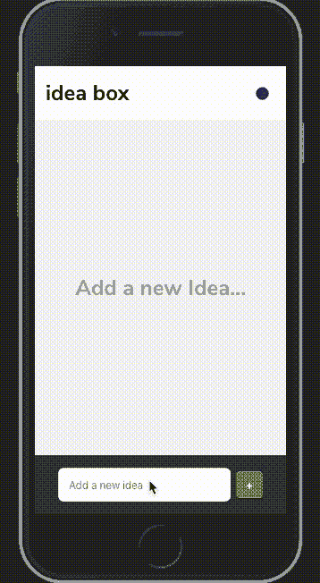
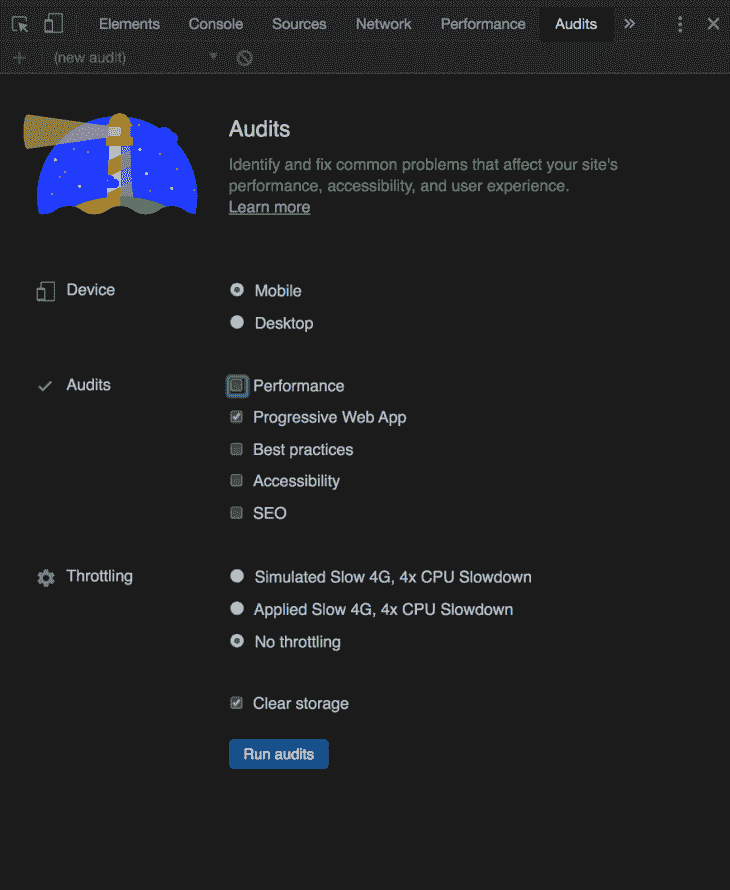
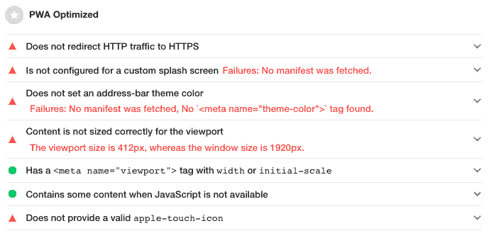
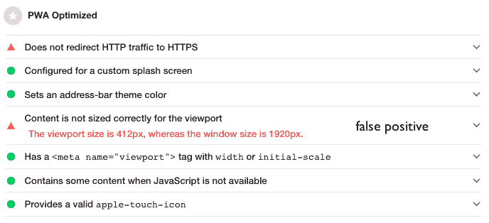
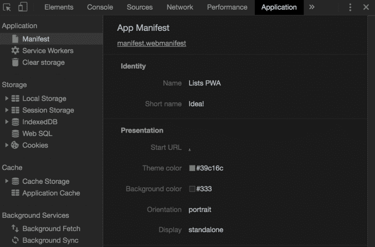
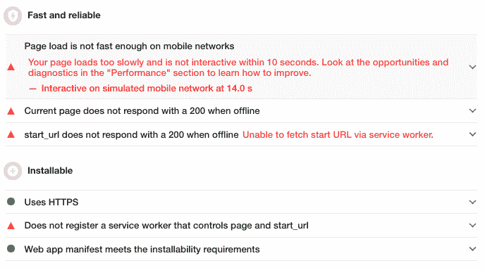
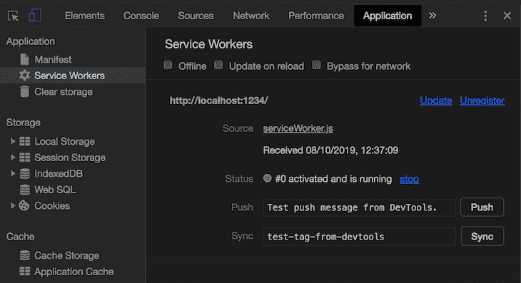
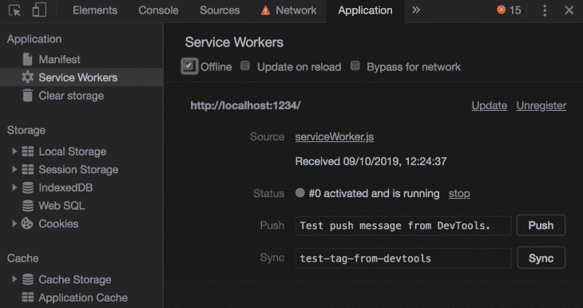

# 用 React 和 Firebase - LogRocket 博客创建一个“列表”PWA

> 原文：<https://blog.logrocket.com/creating-a-lists-pwa-with-react-and-firebase/>

渐进式网络应用程序(PWAs)基本上是外观和行为都像本地应用程序的网络应用程序。虽然性能不如原生应用或使用 React Native、NW.js 等设备特定框架构建的应用。，当您想要从现有的 web 代码库快速创建跨平台应用程序时，它们通常是解决方案。

在本教程中，我们将创建一个基于 React 和 [Firebase](https://firebase.google.com) 的简单 PWA。该应用程序将显示一个想法列表。我们将能够在列表中添加和删除想法，它也可以离线工作。我们将选择无服务器架构，让 Firebase 为我们处理繁重的工作，而不是为它构建服务器。

## 设定期望

在我们继续之前，我觉得概述一下这个教程是什么和不是什么是个好主意，这样我们就都在同一个(网页)页面上了🤭。

本教程假设了几件事:

*   你知道反应钩吗
*   您有一个 Firebase 帐户
*   你有 NoSQL 数据库的基本经验
*   你有时间完成这个教程(很长)

您将从本教程中学到什么:

*   如何使用 Firebase Firestore 实现 CRD(创建、读取、删除)功能
*   如何利用 Firebase 的实时功能
*   如何将您的应用程序部署到 Firebase
*   如何创建脱机工作的 PWA

从本教程中学不到的内容:

*   React 钩子如何工作
*   如何使用 Firebase 实现认证
*   生命和宇宙的意义

我们将首先构建应用程序，当所有功能完成后，我们将把它转换成 PWA。这只是为了以一种易于理解的方式组织教程。既然已经设定了预期，就该开始构建了！

你可以在我的 GitHub 上找到完成版本[的源代码。](https://github.com/ovieokeh/lists-pwa)

你可以在这里找到[托管版。](https://lists-pwa.web.app)



Our finished app.

## 构建应用程序

让我们谈一谈该应用程序的功能和组件，这样我们就知道我们正在进入什么。这个应用程序就像一个轻量级的笔记应用程序，你可以记录你一天中可能有的简短想法。你也有能力删除所说的想法。但是你不能编辑它们。

这款应用的另一个特点是它是实时的。如果我们都打开应用程序，我在我这边添加或删除了一个想法，你会同时获得更新，所以我们在任何给定的时间都有相同的想法列表。

现在，因为我们没有实现身份验证，并且因为我们共享一个数据库，所以您的想法将不是您的应用程序实例所独有的。如果您添加或删除了一个建议，连接到该应用程序的每个人都会看到您的更改。

我们也不会像在传统的 web 应用程序中那样创建自己的服务器来处理请求。相反，该应用程序将直接连接到一个数据库。如果你不知道 Firestore 是什么，只知道它是一个 NoSQL 数据库，提供即时同步。

欢迎使用无服务器😊。

所以，概括一下:

*   没有认证(尽量简单)
*   每个人都能看到每个人的变化
*   想法在应用程序的每个实例之间实时同步
*   没有服务器

## 设置 Firebase + React

首先，我们需要在 Firebase 上建立一个新项目，获取我们的凭证，并为它提供一个 Firestore 数据库。谢天谢地，这是一个非常简单的过程，不应该超过五分钟。

如果您有使用 Firebase 的经验，请继续创建一个新项目，创建一个 web 应用程序，并为其提供一个 Firestore 数据库。否则，[创建一个 Firebase 帐户](https://console.firebase.google.com/)，登录到您的控制台，并按照下面视频中的步骤进行设置。

 [https://www.youtube.com/embed/z4ag_b9tP8k?version=3&rel=1&showsearch=0&showinfo=1&iv_load_policy=1&fs=1&hl=en-US&autohide=2&wmode=transparent](https://www.youtube.com/embed/z4ag_b9tP8k?version=3&rel=1&showsearch=0&showinfo=1&iv_load_policy=1&fs=1&hl=en-US&autohide=2&wmode=transparent)

视频

请记住在过程结束时复制您的配置详细信息，并将其保存在某处以便于访问。我们以后会需要它。

现在我们已经完成了 Firebase 项目的创建，让我们在本地设置我们的项目。我将使用[包](https://parceljs.org)来捆绑应用程序，因为它不需要任何设置，我们也不需要高级功能。

打开您的终端(或 Windows 的命令提示符)并运行以下命令:

```
$ mkdir lists-pwa && cd lists-pwa
$ npm init -y
$ npm i -S firebase react react-dom
$ npm i -D parcel parcel-bundler
$ npm install -g firebase-tools
$ mkdir src

```

现在，仍然在同一个目录中，运行`firebase login`并登录到您的 Firebase 帐户。现在完成以下步骤:

1.  运行`firebase init`
2.  使用空格键，选择 **Firestore** 和**主持**并点击回车
3.  选择**使用现有项目**并点击回车
4.  从列表中选择新创建的项目，并按 enter 键
5.  一直按回车键，直到得到问题`Configure as a single-page app (rewrite all urls to /index.html)?`。键入`y`并按回车键

有些文件会自动为您生成。打开`firebase.json`并用以下内容替换内容:

```
{
  "firestore": {
    "rules": "firestore.rules",
    "indexes": "firestore.indexes.json"
  },
  "hosting": {
    "headers": [
      {
        "source": "/serviceWorker.js",
        "headers": [
          {
            "key": "Cache-Control",
            "value": "no-cache"
          }
        ]
      }
    ],
    "public": "build",
    "ignore": ["firebase.json", "**/.*", "**/node_modules/**"],
    "rewrites": [
      {
        "source": "**",
        "destination": "/index.html"
      }
    ]
  }
}
```

这将为您以后在尝试将应用程序部署到 Firebase 时省去很多麻烦。打开生成的`package.json`，用以下内容替换脚本部分:

```
"scripts": {
    "start": "parcel public/index.html",
    "build": "parcel build public/index.html --out-dir build --no-source-maps",
    "deploy": "npm run build && firebase deploy"
  },
```

## 设置 Firebase 上下文

如果你没有 React Context API 的经验，这里有一个很棒的教程[详细解释了它](https://www.toptal.com/react/react-context-api)。它只是允许我们将数据从父组件传递到子组件，而不需要使用`props`。这在处理嵌套在多个层中的子元素时非常有用。

在`src`文件夹中，创建另一个名为`firebase`的文件夹，并创建以下文件:

1.  `config.js`
2.  `index.js`
3.  `withFirebase.jsx`

打开`config.js`并粘贴到您之前在设置 Firebase 项目时复制的 Firebase 配置文件中，但是在它之前添加一个`export`关键字:

```
export const firebaseConfig = {
  apiKey: REPLACE_WITH_YOURS,
  authDomain: REPLACE_WITH_YOURS,
  databaseURL: REPLACE_WITH_YOURS,
  projectId: REPLACE_WITH_YOURS,
  storageBucket: REPLACE_WITH_YOURS,
  messagingSenderId: REPLACE_WITH_YOURS,
  appId: REPLACE_WITH_YOURS
}
```

初始化 Firebase 时需要此配置文件。

**注意**:我们没有为我们的 Firestore 数据库创建[安全规则](https://firebase.google.com/docs/firestore/security/get-started)，这意味着任何使用该应用程序的人都将对您的项目拥有读/写权限。你肯定不希望这样，所以请研究安全规则，并相应地保护你的应用程序。

打开`index.js`并粘贴以下内容:

```
import { createContext } from 'react'
import FirebaseApp from 'firebase/app'
import 'firebase/firestore'

import { firebaseConfig } from './config'

class Firebase {
  constructor() {
    if (!FirebaseApp.apps.length) {
      FirebaseApp.initializeApp(firebaseConfig)
      FirebaseApp.firestore()
        .enablePersistence({ synchronizeTabs: true })
        .catch(err => console.log(err))
    }

    // instance variables
    this.db = FirebaseApp.firestore()
    this.ideasCollection = this.db.collection('ideas')
  }
}

const FirebaseContext = createContext(null)

export { Firebase, FirebaseContext, FirebaseApp }
```

这是一个非常简单的文件。我们正在创建一个类`Firebase`，它将保存我们的 Firebase 实例。

在构造函数内部，我们首先检查当前是否有任何 Firebase 实例正在运行。如果没有，我们使用刚刚创建的配置初始化 Firebase，然后在 Firestore 实例上启用持久性。这使得我们的数据库即使在离线时也可用，并且当你的应用上线时，数据与实时数据库同步。

然后我们创建两个实例变量:`db`和`ideasCollection`。这将允许我们从 React 组件中与数据库进行交互。

然后，我们创建一个初始值为 null 的新上下文，并将其赋给一个名为`FirebaseContext`的变量。然后，在文件的结尾，我们导出`{ Firebase, FirebaseContext, FirebaseApp }`。

打开`withFirebase.jsx`并粘贴以下内容:

```
import React from 'react'
import { FirebaseContext } from '.'

export const withFirebase = Component => props => (
  <FirebaseContext.Consumer>
    {firebase => <Component {...props} firebase={firebase} />}
  </FirebaseContext.Consumer>
)
```

这是一个[高阶组件](https://reactjs.org/docs/higher-order-components.html)，它将向作为参数传递给它的任何组件提供我们在上面创建的 Firebase 实例。这只是为了方便起见，所以你不需要*来使用它，但是我建议你这样做以使你的代码更容易推理。*

## 编写我们的组件

好了，我们现在完成了与 Firebase 相关的所有工作。让我们编写组件代码，并在屏幕上显示一些东西！

**注意**:为了让本教程集中在主要主题上(React、Firebase、PWA)，我不打算包括样式的 CSS。你可以从[回购这里](https://github.com/ovieokeh/lists-pwa)。

在`src`中创建一个名为`components`的新文件夹。在这个文件夹中，我们只有两个组件:`App.jsx`和`Idea.jsx`。

在这里，`App`组件将完成繁重的工作，因为它将负责与数据库进行实际交互，以获取想法列表、添加新想法和删除现有想法。

`Idea`组件是一个简单的组件，只显示一个想法。但是，在我们开始为这些组件编写代码之前，我们必须先做一些事情。

打开`public/index.html`并用以下内容替换内容:

```
<!DOCTYPE html>
<html lang="en">
  <head>
    <meta charset="utf-8" />
    <meta name="viewport" content="width=device-width, initial-scale=1" />
    <title>Lists PWA</title>
  </head>
  <body>
    <noscript>You need to enable JavaScript to run this app.</noscript>
    <div id="root"></div>
    <script src="../src/index.js"></script>
  </body>
</html>
```

在`src`文件夹下，创建一个新文件`index.js`，打开它，粘贴如下内容:

```
import React from 'react'
import ReactDOM from 'react-dom'
import App from './components/App'
import { FirebaseContext, Firebase } from './firebase'

const rootNode = document.querySelector('#root')

ReactDOM.render(
  <FirebaseContext.Provider value={new Firebase()}>
    <App />
  </FirebaseContext.Provider>,
  rootNode
)
```

我们只是用我们之前创建的 Firebase 上下文包装我们的`App`组件，给出我们定义的 Firebase 类的一个实例的值，并呈现给 DOM。这将使我们的应用程序中的所有组件都可以访问 Firebase 实例，这样它们就可以通过我们的 HOC 直接与数据库交互，我们很快就会看到这一点。

现在让我们编写组件代码。我们将从`Idea.jsx`开始，因为它更简单，移动部件更少。

* * *

### 更多来自 LogRocket 的精彩文章:

* * *

## `Idea.jsx`

```
import React from 'react'
import './Idea.less'
const Idea = ({ idea, onDelete }) => (
  <div className="app__content__idea">
    <p className="app__content__idea__text">{idea.content}</p>
    <button
      type="button"
      className="app__btn app__content__idea__btn"
      id={idea.id}
      onClick={onDelete}
    >
      –
    </button>
  </div>
)

export default Idea
```

这是一个非常简单的组件。它所做的只是返回一个`div`,其中包含一些从其 props 接收的内容——这里没有什么可看的。从这里可以得到`Idea.less`T2 的代码。

**注意**:如果你用的是我的 Less 风格，在`src`下新建一个名为`variables.less`的文件，从这里获取内容[。否则，事情可能看起来不对。](https://github.com/ovieokeh/lists-pwa/blob/master/src/variables.less)

让我们继续一些更令人兴奋的事情。

## `App.jsx`

这是一个大得多的组件，所以我们将一点一点地分解它。

PS，你可以从这里得到`App.less` [的代码。](https://github.com/ovieokeh/lists-pwa/blob/master/src/components/App.less)

```
import React, { useState, useEffect, useRef } from 'react'
import Idea from './Idea'
import { withFirebase } from '../firebase/withFirebase'
import './App.less'

const App = props => {
  const { ideasCollection } = props.firebase
  const ideasContainer = useRef(null)
  const [idea, setIdeaInput] = useState('')
  const [ideas, setIdeas] = useState([])

  useEffect(() => {
    const unsubscribe = ideasCollection
      .orderBy('timestamp', 'desc')
      .onSnapshot(({ docs }) => {
        const ideasFromDB = []

        docs.forEach(doc => {
          const details = {
            id: doc.id,
            content: doc.data().idea,
            timestamp: doc.data().timestamp
          }

          ideasFromDB.push(details)
        })

        setIdeas(ideasFromDB)
      })

    return () => unsubscribe()
  }, [])

...to be continued below...
```

### 设置

好吧，让我们过一遍。马上，我们从从`withFirebase` HOC 获取的 Firebase 实例中检索`ideasCollection`实例变量(我们将组件包装在文件的末尾)。

然后我们创建一个新的对`section` HTML 元素的引用，它将保存来自数据库的想法列表(我们为什么这样做一会儿就清楚了)。我们还创建了两个状态变量，`idea`用于保存受控 HTML 输入元素的值，`ideas`用于保存数据库中的想法列表。

### 效果

然后我们创建一个`useEffect`钩子，大部分魔法都在这里发生。在这个钩子中，我们引用了`ideasCollection`中的文档集合，按照时间戳降序排列其中的文档，并为其附加了一个`onSnapShot`事件监听器。

这个[监听器监听集合上的变化](https://firebase.google.com/docs/firestore/query-data/listen)(创建、更新、删除)，并在每次检测到变化时调用更新的数据。

我们初始化一个新的空数组`ideasFromDB`，对于来自数据库的每个文档(例如，idea)，我们创建一个`details`对象来保存它的信息，并将该对象推送到`ideasFromDB`。

当我们完成所有想法的迭代后，我们用`ideasFromDB`更新`ideas`状态变量。然后，在`useEffect`调用结束时，我们通过调用函数`unsubscribe`取消对数据库监听的订阅，以避免内存泄漏。

```
...continuation...

const onIdeaDelete = event => {
  const { id } = event.target
  ideasCollection.doc(id).delete()
}

const onIdeaAdd = event => {
  event.preventDefault()

  if (!idea.trim().length) return

  setIdeaInput('')
  ideasContainer.current.scrollTop = 0 // scroll to top of container

  ideasCollection.add({
    idea,
    timestamp: new Date()
  })
}

const renderIdeas = () => {
  if (!ideas.length)
    return <h2 className="app__content__no-idea">Add a new Idea...</h2>

  return ideas.map(idea => (
    <Idea key={idea.id} idea={idea} onDelete={onIdeaDelete} />
  ))
}

...to be continued below...
```

接下来的代码要简单一些。让我们一个功能一个功能地过一遍。

### `onIdeaDelete`

这个函数处理删除一个想法。它是一个回调函数，传递给附加到删除按钮上的`onClick`处理程序，每一个想法都被呈现到 DOM 中。这也很简单。

每个创意上的所有删除按钮都有一个唯一的 ID，这也是 Firestore 数据库中创意的唯一 ID。因此，当按钮被单击时，我们从`event.target`对象中获得这个 ID，在`ideasCollection`集合中定位具有该 ID 的文档，并在其上调用一个 delete 方法。

这将从数据库中的想法集合中删除该想法，由于我们在`useEffect`调用中监听该集合的变化，这将导致`onSnapShot`监听器被触发。这反过来用新的想法列表减去我们刚刚删除的想法列表来更新我们的状态🤯。

Firebase 不就是牛逼吗？

### `onIdeaAdd`

该功能与`onIdeaDelete`功能正好相反。这是一个传递给附加在表单上的`onSubmit`处理程序的回调函数，该表单包含您添加新想法的输入。

首先，我们防止表单提交的默认行为，并检查输入是否为空。如果是，则在那里结束执行；否则，继续。然后，我们清除输入值，以允许添加新的想法。

还记得我们在设置中初始化的 HTML section 元素的引用吗？这就是我们需要它的原因。如果有太多的想法不能一次显示在屏幕上，我们可以向下滚动来查看旧的。

当在这个滚动位置时，如果我们添加一个新的想法，我们希望滚动到容器的顶部来查看最新的想法，因此我们将保存想法的 section 元素的`scrollTop`设置为`0`。这具有滚动到 HTML section 元素顶部的效果。

最后，我们引用数据库中的想法集合，`ideasCollection`，并在其上调用`add`方法。我们传递给它一个对象，该对象包含来自输入元素的值和当前日期的时间戳。

这将再次触发我们的`onSnapShot`监听器更新我们的想法列表，以便 ideas 状态变量得到更新以包含我们刚刚添加的最新想法。

### `renderIdeas`

这个函数完全按照它在 tin 上显示的那样工作。它负责将所有想法呈现给 DOM。

我们检查是否有任何想法可以呈现。如果没有，我们返回一个带有文本的`h2`元素:“添加一个新想法……”否则，我们映射想法的数组，对于每个想法，返回我们之前创建的哑`Idea`组件，并向其传递所需的道具。

这里没什么可看的。

```
...continuation...

  return (
    <div className="app">
      <header className="app__header">
        <h1 className="app__header__h1">Idea Box</h1>
      </header>

      <section ref={ideasContainer} className="app__content">
        {renderIdeas()}
      </section>

      <form className="app__footer" onSubmit={onIdeaAdd}>
        <input
          type="text"
          className="app__footer__input"
          placeholder="Add a new idea"
          value={idea}
          onChange={e => setIdeaInput(e.target.value)}
        />
        <button type="submit" className="app__btn app__footer__submit-btn">
          +
        </button>
      </form>
    </div>
  )
}

export default withFirebase(App)
```

这里的最后一段代码是返回 JSX 的返回语句。

在文件的最后，我们有一个默认的导出，导出用`withFirebase` HOC 包装的`App`组件。这就是将`firebase`作为道具注入组件的原因。

假设您从我的 GitHub repo 中为这两个组件复制了相应的`.less`文件，那么现在您就有了一个功能完整的应用程序。在你的终端中，运行`npm start`并从浏览器中打开`[http://localhost:1234](http://localhost:1234)`。

您应该看到您的应用程序正在运行。补充一个想法。删除它。打开另一个浏览器窗口，从那里添加一个想法。注意这两个窗口是如何自动同步的？这是 Firebase 完美完成的工作🔥。

我继续前进，并添加了一个主题切换器，因为为什么不呢？如果你想做同样的事情，从这里克隆 [repo。](https://github.com/ovieokeh/lists-pwa)

您可以通过运行`npm run deploy`将您的应用程序部署到 Firebase。

## 将应用程序转换为渐进式网络应用程序

如果你一直遵循这个教程，你就是一个摇滚明星⭐，你应该得到一枚金牌。我们已经完成了创建实际应用程序的大部分艰苦工作，现在剩下的就是将其转换为 PWA 并使其离线工作。

但要做到这一点，我们需要了解 PWAs 的两个关键组成部分:

1.  Web 应用程序清单
2.  服务人员

### web 应用程序清单

不要被“web app manifest”这个听起来令人印象深刻的名字所迷惑。这是一个相当简单的概念，我将让谷歌为您解释它:

> “ [web 应用程序清单](https://developer.mozilla.org/en-US/docs/Web/Manifest)是一个简单的 JSON 文件，它告诉浏览器关于您的 web 应用程序，以及当它‘安装’在用户的移动设备或桌面上时应该如何运行。Chrome 需要一个清单来显示[添加到主屏幕提示](https://developers.google.com/web/fundamentals/app-install-banners/)。
> 
> 一个典型的清单文件包括关于它应该使用的应用程序`name`、`icons`、启动时应该启动的`start_url`等信息。"

当我们创建一个 manifest 文件时，我们从我们的`index.html`文件的头部链接到它，以便浏览器可以拾取它并使用它。以下是您可以使用清单文件配置的应用程序的一些最重要的属性:

*   `name`:这是应用程序安装提示上使用的名称
*   这是在你的用户的主屏幕、启动器和空间有限的地方使用的名称。它是可选的
*   这是一个 image 对象的数组，表示在主屏幕、闪屏等地方使用的图标。对于不同的屏幕分辨率，每个对象通常是对同一图标的不同大小的引用
*   这告诉你的浏览器你的应用程序在安装时应该默认使用哪个 URL
*   这告诉你的浏览器你的应用应该看起来像本地应用、浏览器应用还是全屏应用

您可以在这里找到[可配置属性的完整列表。](https://developers.google.com/web/fundamentals/web-app-manifest#key_manifest_properties)

## 服务人员

服务人员更复杂，但非常强大。除了推送通知、后台同步等其他功能之外，它们使得离线网络体验成为可能。但是它们到底是什么呢？

简单地说，服务工作者是一个 JavaScript 脚本(我们需要为 JS 取一个新名字🤦)在后台运行，与网页分开。服务人员有点复杂，所以我们不会在这里一一介绍。相反，你可以在[谷歌开发者网站](https://developers.google.com/web/fundamentals/primers/service-workers)上阅读更多关于它们的内容，当你完成后，你可以回到这里获得它们的实际体验。

我假设你确实访问了上面的 Google 开发者链接，因为我们将使用一些你可能不熟悉的概念。如果这是你第一次与服务人员一起工作，请，如果你没有阅读它，现在是时候这样做了。

准备好了吗？我们能继续了吗？太好了。

## 使用 Lighthouse 审核应用程序

为了使开发 PWA 的过程尽可能简单和无缝，我们将使用一个名为 Lighthouse 的工具来审计我们的应用程序，以便我们确切地知道我们需要做什么来创建一个功能齐全的 PWA。

如果你已经使用 Chrome 浏览器，那么你的浏览器中已经安装了 Lighthouse。否则，你可能需要安装 Chrome 来跟进。

1.  通过运行`npm start`启动您的应用程序
2.  在你的 Chrome 浏览器中打开应用程序
3.  在 Mac 上点击`COMMAND + OPTION + J`，在 Windows 上点击`CTRL + SHIFT + J`，打开开发者工具
4.  打开**审计**标签，勾选**渐进式网络应用**复选框，然后点击**运行审计**如下:
    

你应该会得到一个可怕的结果，但这是意料之中的，因为我们没有做任何事情来使这个应用程序成为 PWA。请注意 **PWA 优化的**部分，因为这是我们首先要解决的问题。



What a horrible score 🤮

我们开始吧，好吗？

## 设置清单文件

让我们从 web 应用程序清单文件开始。这通常是一个链接到`index.html`文件的`manifest.json`文件，但是由于[包的工作方式](https://github.com/parcel-bundler/parcel/issues/235)，我们将不使用`.json`扩展名。相反，我们将使用一个`.webmanifest`扩展，但是内容将保持不变。

在`public`文件夹中，创建一个名为`manifest.webmanifest`的新文件，并将以下内容粘贴到其中:

```
{
  "name": "Lists PWA",
  "short_name": "Idea!",
  "icons": [
    {
      "src": "./icons/icon-128x128.png",
      "type": "image/png",
      "sizes": "128x128"
    },
    {
      "src": "./icons/icon-256x256.png",
      "type": "image/png",
      "sizes": "256x256"
    },
    {
      "src": "./icons/icon-512x512.png",
      "type": "image/png",
      "sizes": "512x512"
    }
  ],
  "start_url": ".",
  "display": "standalone",
  "background_color": "#333",
  "theme_color": "#39c16c",
  "orientation": "portrait"
}
```

注意，在`"icons"`部分，我们链接到了`/icons`文件夹下的`.png`文件。你可以从 [GitHub repo 这里](https://github.com/ovieokeh/lists-pwa/tree/master/public/icons)获得这些图片，或者你可以选择使用自定义图片。其他的事情应该是不言自明的。

现在让我们对`index.html`文件做一些修改。打开文件，将以下内容添加到`<head>`部分:

```
<link rel="shortcut icon" href="icons/icon-128x128.png" />
<link rel="manifest" href="manifest.webmanifest" />
<link rel="apple-touch-icon" href="icons/icon-512x512.png" />
<meta name="apple-mobile-web-app-capable" content="yes" />
<meta name="apple-mobile-web-app-status-bar-style" content="black" />
<meta name="apple-mobile-web-app-title" content="Lists PWA" />
<meta name="theme-color" content="#39c16c" />
<meta name="description" content="Lists PWA with React" />
```

事情是这样的:

1.  我们添加了一个快捷方式图标，显示在浏览器选项卡标题中
2.  我们链接到刚刚创建的清单文件
3.  因为 iOS 上的 Safari 还不支持 web 应用清单，所以我们添加了一些传统的 meta 标签来弥补(任何以`apple`为前缀的标签)
4.  我们给浏览器的地址栏添加了一个主题颜色，以匹配我们偏好的品牌颜色
5.  最后，我们添加了对我们的应用程序的简短描述

好了，现在把你的跑步 app 杀掉，重新启动，我们再来运行一次灯塔审计，看看现在得到了什么。



Much better!

请注意，我们现在在 **PWA 优化**部分获得了几乎完美的分数。**不会将 HTTP 流量重定向到 HTTPS** 无法在本地主机模式下修复。如果你在 Firebase 上运行测试，这应该也能通过。

仍然在浏览器控制台中，切换到**应用程序**选项卡，点击**应用程序**部分下的**清单**。您应该在这里看到来自`manifest.webmanifest`文件的详细信息，如下所示:



我们已经确认我们的清单文件工作正常，所以让我们修复 Lighthouse PWA 审计中的其他问题:



*   **快速可靠**:在移动网络上，页面加载速度不够快
*   **快速可靠**:当前页面离线时没有 200 响应
*   **快速可靠** : `start_url`离线时无 200 响应
*   **Installable** :不注册控制页面和 start_url 的服务人员

## 设置服务人员

为了修复上面列出的问题，我们需要向应用程序添加一个服务工作者(为了保持头脑清醒，从现在开始我将简称为 SW)。注册软件后，我们将缓存所有需要的文件，以便能够离线提供服务。

**注意**:为了让事情变得更简单，我建议在本教程的剩余部分用匿名标签打开你的应用程序。这是由[软件生命周期](https://developers.google.com/web/fundamentals/primers/service-workers/lifecycle)的性质决定的。(你有没有像我问的那样访问过[那个链接？](https://developers.google.com/web/fundamentals/primers/service-workers))

### 注册服务人员

在`public`文件夹下，创建一个名为`serviceWorker.js`的新文件，并暂时粘贴以下内容:`console.log('service worker registered')`。

现在打开`index.html`文件并添加一个新脚本:

```
<script>
  if ('serviceWorker' in navigator) {
    window.addEventListener('load', () => {
      navigator.serviceWorker.register('serviceWorker.js');
    });
  }
</script>
```

我们来剖析一下这个脚本。我们正在检查当前的浏览器是否支持 SWs ( [SW 支持](https://jakearchibald.github.io/isserviceworkerready/))，如果支持，我们向窗口对象添加一个`'load'`事件监听器。

一旦窗口被加载，我们告诉浏览器在位置`serviceWorker.js`注册 SW 文件。你可以把你的软件文件放在任何地方，但是我喜欢把它放在`public`文件夹里。

保存您的更改，在匿名模式下重新启动您的应用程序，然后打开控制台。您应该会看到记录的消息`service worker registered`。太好了。现在打开 DevTools 中的**应用程序**选项卡，点击**服务人员**。你应该看到我们的新软件运行。



现在，我们的软件正在运行，但是有点没用。让我们给它增加一些功能。

所以这是我们需要做的:

1.  安装软件后，缓存应用程序离线工作所需的所有文件
2.  当我们收到任何 GET network 请求时，我们将尝试使用实时数据进行响应，如果失败(由于缺少网络连接)，我们将使用缓存的数据进行响应

### 缓存所需的文件

打开`serviceWorker.js`文件，将内容替换为以下内容:

```
const version = 'v1/';
const assetsToCache = [
  '/',
  '/src.7ed060e2.js',
  '/src.7ed060e2.css',
  '/manifest.webmanifest',
  '/icon-128x128.3915c9ec.png',
  '/icon-256x256.3b420b72.png',
  '/icon-512x512.fd0e04dd.png',
];

self.addEventListener('install', (event) => {
  self.skipWaiting();

  event.waitUntil(
    caches
      .open(version + 'assetsToCache')
      .then((cache) => cache.addAll(assetsToCache))
      .then(() => console.log('assets cached')),
  );
});
```

这是怎么回事？首先，我们定义了两个变量:

1.  用于跟踪你的软件版本
2.  `assetsToCache`:我们要缓存的文件列表。这些文件是我们的应用程序正常工作所必需的

**注意**:以下部分仅适用于使用包裹捆绑应用程序的情况。

* * *

现在，请注意,`assetsToCache`数组中的文件名在文件扩展名前添加了一个随机的八个字母的字符串？

当 package 捆绑我们的应用程序时，它会将从文件内容生成的唯一哈希添加到文件名中，这意味着每次我们对文件内容进行更改时，哈希很可能是唯一的。这意味着每当我们对这些文件中的任何一个进行更改时，我们都必须更新这个数组。

幸运的是，我们可以很容易地解决这个问题，告诉 Parcel 基于文件的*位置*而不是内容生成散列。这样，只要我们不改变任何文件的位置，我们就可以保证散列是恒定的。

虽然每当我们改变数组的位置时，我们仍然需要更新数组，但是如果我们坚持使用默认的散列方案，这种情况不会那么频繁。

那么，我们如何告诉包裹使用位置？只需打开您的`package.json`并将`--no-content-hash`添加到构建脚本的*末端*即可。*这很重要。*

* * *

在初始化这些变量之后，我们向一个`self`对象添加一个事件监听器，这个对象指的是 SW 本身。

我们希望在 SW 开始运行时执行某些操作，所以我们指定我们正在监听哪个事件，在我们的例子中，就是`install`事件。然后我们提供一个回调函数，它接受一个`event`对象作为参数。

在这个回调中，我们调用 SW 上的`skipWaiting()`,这基本上是强制激活当前的 SW。请阅读关于[s](https://developers.google.com/web/fundamentals/primers/service-workers/lifecycle)[service](https://developers.google.com/web/fundamentals/primers/service-workers/lifecycle)[w](https://developers.google.com/web/fundamentals/primers/service-workers/lifecycle)[workers](https://developers.google.com/web/fundamentals/primers/service-workers/lifecycle)的生命周期，了解为什么会出现这一步。我不确定我能比谷歌开发者网站解释得更好。

然后，我们在传递给回调的`event`对象上调用一个`waitUntil()`方法，这有效地阻止了 SW 进入其生命周期的下一个阶段，直到我们传递给它的任何参数都被解决。让我们更详细地看看这个论点。

我们正在使用[缓存 API](https://developer.mozilla.org/en-US/docs/Web/API/Cache) ，所以我建议你在继续之前复习一下。我们打开一个名为`v1/assetsToCache`的缓存存储(如果它以前不存在，它将被创建)，它返回一个承诺。

然后，我们在结果上链接一个`.then`方法，并传入一个回调，该回调接受一个名为`cache`的参数，这是我们刚刚打开的缓存存储的一个实例。然后，我们在这个实例上调用`addAll()`方法，传入我们希望缓存的文件列表。完成后，我们将`assets cached`登录到控制台。

让我们回顾一下到目前为止我们所做的工作:

1.  创建一个新变量来保存我们的软件版本
2.  创建一个新数组来保存要缓存的文件列表
3.  在软件上添加一个“安装”事件监听器
4.  强制软件在其生命周期的“安装”阶段自行激活
5.  阻止软件进入下一阶段，直到所有文件都被缓存

### 在网络故障时提供缓存文件

将以下代码粘贴到前面的代码之后:

```
self.addEventListener('fetch', (event) => {
  if (event.request.method === 'GET') {
    event.respondWith(
      fetch(event.request).catch(() => {
        return caches.match(event.request);
      }),
    );
  }
});
```

我们想在用户网络瘫痪时提供缓存文件，这样他们就不会得到臭名昭著的 Chrome T-Rex。

因此，我们将为所有网络获取请求添加另一个事件侦听器，并检查它是否是一个 GET 请求(即，浏览器是否在请求资源？).如果是，我们将尝试从服务器获取资源，如果失败，则提供缓存的资源。我们如何做到这一点？

在传递给事件监听器的回调中，我们检查`event.request.method`是否等于 GET。如果不是(例如，用户添加了一个新的想法)，那么我们不会处理这个请求。请记住，我们在设置期间在 Firestore 实例中启用了持久性，因此 Firestore 将为我们处理这种情况。我们感兴趣的是处理 GET 请求。

因此，如果这是一个 GET 请求，我们将尝试使用 [Fetch API](https://developer.mozilla.org/en-US/docs/Web/API/Fetch_API) 向服务器查询所请求的数据。如果用户离线，这将会失败，所以我们在请求的结果上附加了一个`catch`方法。

在这个`catch`块中，我们从缓存存储中返回与请求的资源相匹配的缓存文件。这确保了应用程序永远不会知道网络关闭，因为它正在接收对请求的响应。

## 测试一切

我们已经做了我们需要的一切，使应用程序成为一个具有离线连接功能的全功能 PWA，所以让我们来测试它。

关闭你的应用程序(如果它正在运行),然后重新启动。打开 Chrome DevTools，切换到**应用**标签，点击**服务人员**，你应该会看到我们的软件被激活，运行起来就像高速公路上的 1968 克尔维特。太好了。

现在选中**离线**复选框，重新加载页面，如下所示:



请注意，您的应用程序甚至没有退缩。它一直在运转，好像世界一切都好。你可以关闭你的无线网络，尝试重新加载页面。请注意，它仍然显示良好。

现在让我们将应用程序部署到 Firebase，将其作为 PWA 安装在实际的移动设备上，并确认一切正常。

在移动设备上运行`npm run deploy`并访问 Firebase 为您提供的托管 URL。您应该会看到安装应用程序的提示。安装它，访问你的应用程序启动菜单，你应该看到“想法！”(或者你决定的任何名字)在本地应用列表中。

启动它，应用程序应该像一个本地应用程序一样加载，并带有一个闪屏。如果有人现在走进你正在使用的应用程序，他们将无法辨别这不是一个原生的移动应用程序。

## 结论

本教程很长，但是我们仅仅触及了 React + Firebase + PWAs 的皮毛。请将本教程看作是对构建渐进式 web 应用程序的奇妙世界的一个温和介绍。

虽然你当然可以直接使用服务工作者 API，但是有很多事情可能会出错，所以使用谷歌的工具箱更明智。它处理了大量繁重的工作，让您可以专注于真正重要的功能。例如，如果你检查回购上的版本，你会发现这正是我正在使用的。

我希望你喜欢这个教程，并快乐编码❤️！

## 使用 LogRocket 消除传统反应错误报告的噪音

[LogRocket](https://lp.logrocket.com/blg/react-signup-issue-free)

是一款 React analytics 解决方案，可保护您免受数百个误报错误警报的影响，只针对少数真正重要的项目。LogRocket 告诉您 React 应用程序中实际影响用户的最具影响力的 bug 和 UX 问题。

[ ](https://lp.logrocket.com/blg/react-signup-general) [  ](https://lp.logrocket.com/blg/react-signup-general) [LogRocket](https://lp.logrocket.com/blg/react-signup-issue-free)

自动聚合客户端错误、反应错误边界、还原状态、缓慢的组件加载时间、JS 异常、前端性能指标和用户交互。然后，LogRocket 使用机器学习来通知您影响大多数用户的最具影响力的问题，并提供您修复它所需的上下文。

关注重要的 React bug—[今天就试试 LogRocket】。](https://lp.logrocket.com/blg/react-signup-issue-free)