# 使用 Prisma 2 - LogRocket 博客创建 Node.js GraphQL 服务器

> 原文：<https://blog.logrocket.com/creating-a-node-js-graphql-server-using-prisma-2/>

## 介绍

[Prisma](https://www.prisma.io/) 是一个替代传统 ORM 的开源数据库工具包。它通过为 TypeScript 和 Node 自动生成的查询生成器使数据库访问变得容易。js。仅使用直观的 API 和普通的旧 JavaScript 对象，它使开发人员只需担心数据，而不用担心获取数据的原生数据库查询。

Prisma 由以下部分组成:

*   Prisma Client —为 Node.js 和 TypeScript 自动生成的类型安全查询生成器
*   Prisma Migrate ( **实验** ) —声明式数据建模和迁移系统
*   prisma Studio(**experimental**)—查看和编辑数据库中数据的 GUI

Prisma 目前支持的数据库有 PostgreSQL，MySQL，SQLite。在本文中，我们将构建一个基本的轮询 GraphQL 服务器。对 Prisma 有所了解会使这篇文章更容易理解。如果你不熟悉 Prisma，[阿克谢·卡达姆](https://blog.logrocket.com/author/deadcoder0904/)写了一篇很棒的[文章](https://blog.logrocket.com/an-introduction-to-prisma-2/)，应该可以帮你入门。当我们完成了服务器，你应该能够创建一个用户，用户可以创建一个投票，其他用户可以投票。

## 先决条件

如前所述，Prisma 和 [Node.js](https://nodejs.org/en/) 的基础知识将是必要的。确保您的机器上安装了[节点](https://nodejs.org/en/)和[纱线](https://yarnpkg.com/)，或 [npm](https://npmjs.com/) 。

## 入门指南

我们需要做的第一件事是在全球范围内安装 Prisma 2。如果您安装了 Prisma 的早期版本，您需要先卸载它，然后才能继续。要安装 Prisma，请在终端中运行以下任何命令:

```
npm install -g @prisma/cli
yarn global add @prisma/cli
```

## 设置

让我们为投票服务器创建文件夹结构:

```
$ mkdir voting-app
$ cd voting-app
$ touch README.md index.js .gitignore
```

您可以在 README.md 中添加对服务器功能的描述。gitignore 文件如下:

```
node_modules/
```

要生成不带提示的 package.json 文件，请运行以下命令:

```
$ npm init -y
```

package.json 文件的内容如下所示:

```
{
  "name": "voting-app",
  "version": "1.0.0",
  "description": "",
  "main": "app.js",
  "scripts": {
    "test": "echo \"Error: no test specified\" && exit 1"
  },
  "keywords": [],
  "author": "",
  "license": "ISC"
}
```

### 安装依赖项

```
$ yarn add graphql-tools graphql-yoga
```

### 用 Prisma 和 SQLite 建立我们的项目

在我们项目的根目录下创建一个名为`prisma`的文件夹，然后将一个名为`schema.prisma`的文件添加到该文件夹中。您可以使用以下命令来完成此操作:

```
mkdir prisma
touch prisma/schema.prisma
```

设置 Prisma 客户端需要使用`schema.prisma`。它由三部分组成:

*   数据源—定义您的数据库连接
*   生成器—表示您要生成 Prisma 客户端
*   数据模型—定义您的应用程序模型。应该至少有一个模型

打开`schema.prisma`文件并添加以下代码:

```
// 1
datasource db {
  provider = "sqlite"
  url = "file:./dev.db"
}

// 2
generator client {
  provider = "prisma-client-js"
}

// 3
model User {
  id          String @default(cuid()) @id
  name        String
  polls       Poll[]
}

// 4
model Poll {
  id          String  @default(cuid()) @id
  description String
  user        User
  options     Option[]
  votes       Vote[]

}

// 5
model Option {
  id          String  @default(cuid()) @id
  text        String
  poll        Poll
  votes       Vote[]
}

// 6
model Vote {
  id          String  @default(cuid()) @id
  user        User
  poll        Poll
  option      Option
}
```

我们到底加了什么？告诉 Prisma 我们的数据库正在使用 SQLite。我们还定义了这个投票应用程序将使用的模型。在这些模型中，我们定义了连接以及每个模型如何连接到另一个模型，如果有的话。

## 创建 SQLite 数据库

官方 [SQLite](https://www.sqlite.org/index.html) 网站将其定义为实现了一个[小](https://www.sqlite.org/footprint.html)、[快](https://www.sqlite.org/fasterthanfs.html)、[自含](https://www.sqlite.org/selfcontained.html)、[高可靠](https://www.sqlite.org/hirely.html)、[全功能](https://www.sqlite.org/fullsql.html)、SQL 数据库引擎的 C 语言库。它直接读写普通磁盘文件。

为了进行设置，我们使用 [Prisma Migrate](https://www.prisma.io/docs/reference/tools-and-interfaces/prisma-migrate) 。Prisma Migrate 是一个允许您对数据库进行更改(模式迁移)的工具，例如向现有表中添加列。

第一步是在您的 [Prisma 模式文件](https://www.prisma.io/docs/reference/tools-and-interfaces/prisma-schema/)中以 [Prisma 数据模型](https://www.prisma.io/docs/reference/tools-and-interfaces/prisma-schema/data-model/)的形式编写您的数据库模式。将数据模型映射到数据库模式是一个两步的过程，需要运行两个命令:

1.  `prisma migrate save --experimental`
2.  `prisma migrate up --experimental`

`prisma migrate save --experimental`将新的迁移保存到项目根文件夹中的`prisma/migrations`中，并更新数据库中的`_Migration`表。每次运行该命令时，都会保存一个新的迁移，并带有自己的`README.md`文件，详细说明有关迁移的信息。

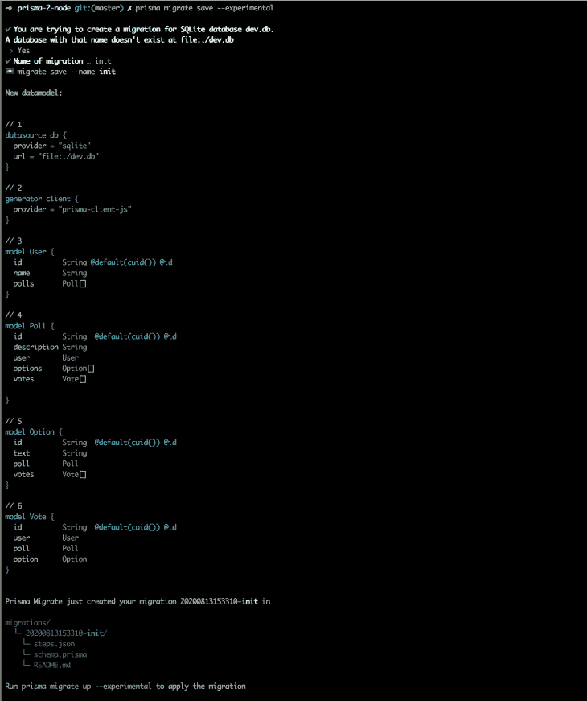

让我们通过在文件夹的根目录下运行以下命令来创建我们的第一个迁移:

```
npx prisma migrate save --experimental
```

第一次运行该命令时，系统会提示您创建一个新的数据库。选择选项 **Yes** 后，您需要为您的迁移添加一个名称。您会注意到，在运行该命令后，已经创建了一个迁移文件夹。

为了实际执行生成的迁移，您需要运行第二个命令:

```
npx prisma migrate up --experimental
```

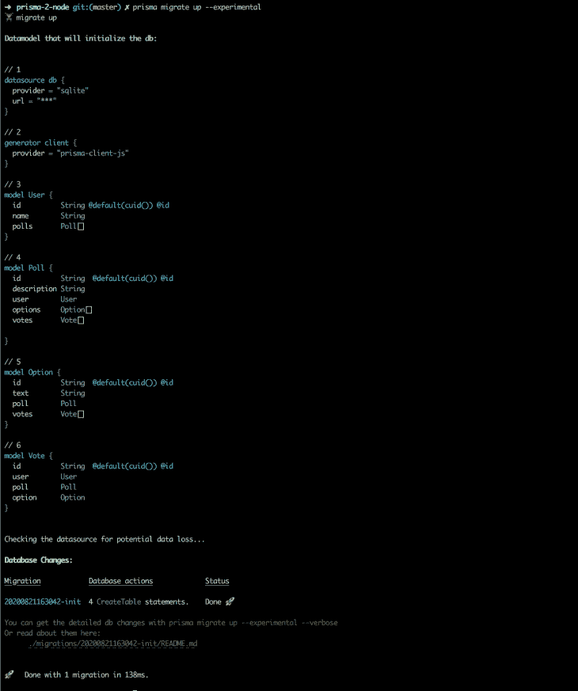

## 生成 Prisma 客户端

Prisma Client 是一个自动生成的、类型安全的查询生成器，专门为您的数据量身定制。我们已经准备好产生我们的客户。我们可以使用以下命令之一生成我们的客户端:

```
yarn add @prisma/client

prisma generate
```

注意，`yarn add @prisma/client`命令也运行`prisma generate`命令，该命令将 Prisma 客户端生成到`node_modules/@prisma/client`目录中:

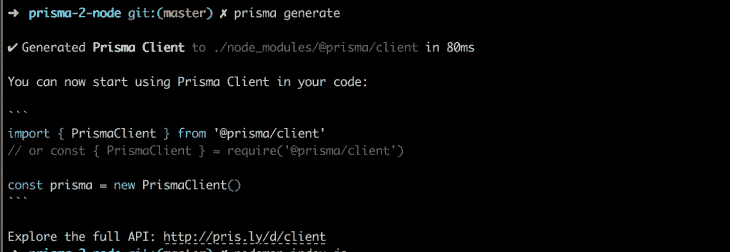

## 创建 GraphQL 服务器

打开我们之前创建的`index.js`文件，输入下面的代码:

```
const { GraphQLServer } = require('graphql-yoga')

const typeDefs = `
  type Query {
    hello(name: String): String!
  }
`

const resolvers = {
  Query: {
    hello: (_, { name }) => `Hello ${name || 'World'}`,
  },
}

const server = new GraphQLServer({
  typeDefs,
  resolvers,
})

const options = {
  port: 8000,
  endpoint: '/graphql',
  subscriptions: '/subscriptions',
  playground: '/playground',
}
server.start(options, ({ port }) =>
  console.log(
    `Server started, listening on port ${port} for incoming requests.`,
  ),
)
```

[Graphql-yoga](https://github.com/prisma-labs/graphql-yoga) 是一款全功能的 Graphql 服务器，专注于易用性、性能和出色的开发人员体验。您使用构造函数`GraphQLServer`创建服务器。此构造函数采用以下选项:

*   typeDefs —包含在 [SDL](https://blog.graph.cool/graphql-sdl-schema-definition-language-6755bcb9ce51) 中的 GraphQL 类型定义或类型定义的文件路径(如果未提供`schema`则需要)
*   解析器—包含在`typeDefs`中指定的字段的解析器(如果未提供`schema`则需要)
*   模式—一个 [`GraphQLSchema`](http://graphql.org/graphql-js/type/#graphqlschema) 的实例(如果没有提供`typeDefs`和`resolvers`则需要)

我们可以测试一下 GraphQL 服务器。运行以下命令启动服务器:

```
node index.js
```

为了测试我们创建的示例查询，导航到 [`http://localhost:8000/playground`](http://localhost:8000/playground) 。在左侧面板中输入以下查询。

```
query {
  hello(name: "John Doe")
}
```

按下 play 按钮，您应该会得到服务器的如下响应:

```
{
  "data": {
    "hello": "Hello John Doe"
  }
}
```

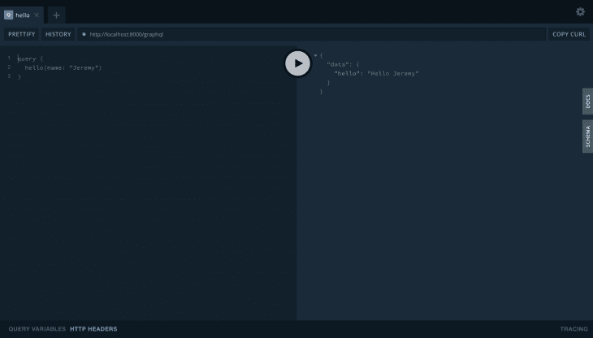

## 将 Prisma 客户端连接到 GraphQL 服务器

为了访问我们的 Prisma 客户机提供的数据库查询，我们需要导入生成的 Prisma 客户机库，并设置服务器来使用它。

将以下内容添加到您的`index.js`文件的顶部:

```
const { PrismaClient } = require('@prisma/client');
```

创建一个`PrismaClient`的实例，并通过上下文键将其传递给 GraphQL 服务器构造函数。上下文键包含通过解析器链传递的自定义数据。这可以作为一个对象传入，或者作为一个带有签名`(req: ContextParameters) => any`的函数传入。

```
const prisma = new PrismaClient()

const server = new GraphQLServer({
  typeDefs,
  resolvers,
  context: {
    prisma,
  }
})
```

当我构建 GraphQL 时，我喜欢使用 [GraphQL Tools](https://www.graphql-tools.com/docs/introduction/) ，它是一个 npm 包，是一个关于如何在 JavaScript 中构建 GraphQL 模式和解析器的自以为是的结构，遵循 GraphQL 优先的开发工作流。通过使用 graphql-tools 包中的`makeExecutableSchema`函数，您可以创建一个基于 [GraphQL 模式语言](https://graphql.org/learn/schema/)的 GraphQLSchema 实例。

让我们更新代码以使用 graphql-tools:

```
const { makeExecutableSchema } = require('@graphql-tools/schema');
.....

const schema = makeExecutableSchema({
  typeDefs,
  resolvers,
});

.....
const server = new GraphQLServer({
  schema,
  context: {
    prisma,
  }
})

.....
```

## 更新`typeDefs`

我们需要更新前面定义的`typeDefs`,以便根据我们在开始时创建的数据模型包含我们正在使用的所有类型。此外，我们需要添加 graphQL 服务器公开的所有查询和变化。我们将需要查询来获得用户，民意测验和投票。我们将创建的突变将用于创建用户、投票和投票。

用以下内容更新之前的`typeDefs`:

```
const typeDefs = `
  type User {
    id          :ID!
    name        :String!
    polls       :[Poll]
  }
  type Poll {
    id          :ID!
    description :String!
    user        :User!
    options     :[Option!]
    votes       :[Vote]
  }
  type Option {
    id          :ID!
    text        :String!
    poll        :Poll!
    votes       :[Vote]
  }
  type Vote {
    id          :ID!
    user        :User!
    poll        :Poll!
    option      :Option!
  }
  type Query {
    users: [User]
    polls: [Poll]
    votes: [Vote]
    user(id: ID!): User
    poll(id: ID!): Poll
  }
  type Mutation {
    createUser(
      name: String!
    ): User
    createPoll(
      description: String!
      id: ID!
      options: [String!]
    ): Poll
    createVote(
      userID: ID!
      pollID: ID!
      optionID: ID!
    ): Vote
  }
`;
```

## 更新解析程序

创建轮询需要用户与通过上下文传递给解析器的 Prisma 进行交互。我们需要更新我们之前创建的 resolvers 对象，以包含我们添加到`typeDefs`中的查询和变异。

### 创建用户

创建投票后，它将与特定用户相关联。因此，我们首先需要创建的是一个用户，然后可以创建投票。因为这是一个非常基本的例子，所以我们不会实现身份验证来验证创建投票的用户。我们只对使用 Prisma 2 创建基本 GraphQL 服务器的概念感兴趣。要创建用户，我们需要一个名称。这将通过`args`传递。我们的`createUser`解析器应该是这样的:

```
const resolvers = {
  Query: {
    ....
  },
  Mutation: {
    createUser: (parent, args, context, info) => {
      const newUser = context.prisma.user.create({
        data: {
          name: args.name,
        },
      })
      return newUser
    },
  },
}
```

我们可以在操场上测试创建一个用户。

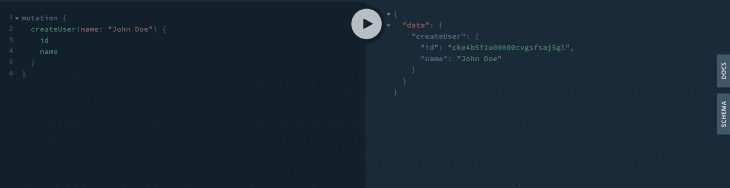

## 获取用户

您会注意到在`typeDefs`中，我们有通过 ID 获取单个用户或多个用户的查询。以下查询将帮助我们检索单个或多个用户及其相关投票:

```
const resolvers = {
  Query: {
    user: async (parent, args, context) => {
      const { id } = args
      return context.prisma.user.findOne({
        where: {
          id,
        },
        include: { polls: true }
      })
    },
    users: async (parent, args, context) => {
      return context.prisma.user.findMany({
        include: { polls: true }
      });
    },
  },
  Mutation: {
    ....
  }
}
```

`findOne`方法用于使用 ID 过滤器获取单个用户，而`findMany`方法获取符合特定标准的所有用户。在上面的例子中，我们获得了所有创建的用户，没有任何过滤器。如果您需要查询一个给定的数据集和嵌套字段，查询方法需要一个带有键`include`的选项对象。在这个键中，包含所有应该填充的嵌套字段，并将它们设置为 true。让我们来测试一下。

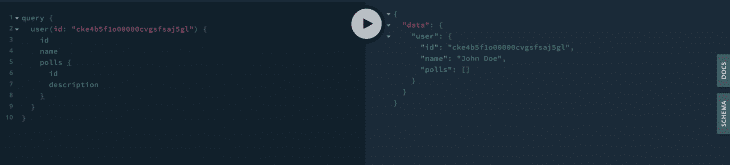

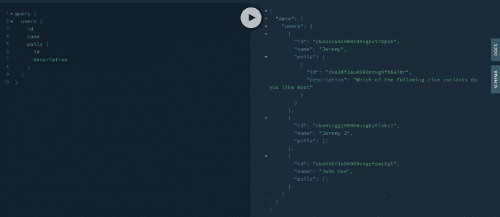

## 创建投票

创建的任何投票都将与特定用户相关联，因此我们需要在创建投票时传递用户的 ID。还将提供描述/问题。最后一个必需的值是一个字符串数组，包含用户可以投票的选项:

```
const resolvers = {
  Query: {
    ....
  },
  Mutation: {
    createPoll: (parent, args, context, info) => {
      const { description, id, options } = args
      const newPoll = context.prisma.poll.create({
        data: {
          description,
          user: {
            connect: { id }
          },
          options: {
            create: options.map(option => ({ text: option }))
          }
        }
      });
      return newPoll;
    }
  },
}
```

使用我们在上面创建的用户，我们可以创建一个样本投票:

```
mutation {
  createPoll(
    description: "which of the following rice based dishes do you like the most"
    id: "USERID"
    options: ["Nigerian Jollof Rice", "Ghanaian Jollof Rice", "Pilau", "Biryiani"]
  ) {
    id
    description
  }
}
```

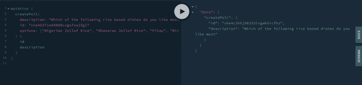

## 获得投票

获取单个投票或多个投票的查询将以与用户查询相同的方式构造。唯一的区别是我们查询的模型和要填充的嵌套字段。将以下代码添加到解析器定义中:

```
const resolvers = {
  Query: {
    ....
    poll: async (parent, args, context) => {
      const { id } = args
      return context.prisma.poll.findOne({
        where: {
          id,
        },
        include: {
          user: true,
          options: true,
          votes: {
            select: { user: true, option: true }
          }
        }
      })
    },
    polls: async (parent, args, context) => {
      return context.prisma.poll.findMany({
        include: {
          user: true,
          options: true,
          votes: {
            select: { user: true, option: true }
          }
        }
      })
    },
    ....
  },
  Mutation: {
    ....
  }
}
```

当您还需要检索深度嵌套的字段时，请注意`findMany`方法的`include`选项是如何构造的。

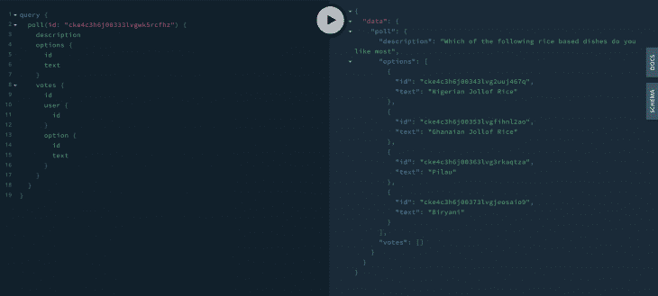

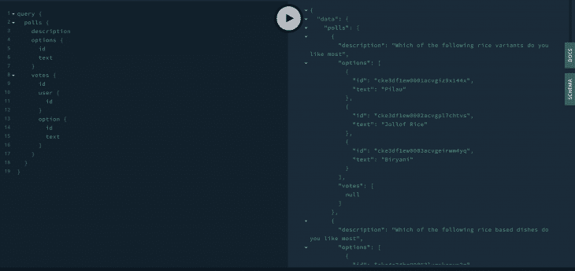

## 投票赞成一个选项

如果有一个与 GraphQL 服务器配对的用户界面，用户将能够进行投票，并得到他们可以投票的选项。在选择一个选项时，会触发一个突变，从而为特定的选项创建一个投票。投票需要与投票、投票选项和投票用户相关联。因此，创建投票的解析器将接收投票 ID、选项 ID 和用户 ID。它看起来会像这样:

```
const resolvers = {
  Query: {
    .....
  },
  Mutation: {
    .....
    createVote: (parent, args, context, info) => {
      const { userID, pollID, optionID } = args
      const newVote = context.prisma.vote.create({
        data: {
          user: {
            connect: { id: userID }
          },
          poll: {
            connect: { id: pollID }
          },
          option: {
            connect: { id: optionID }
          }
        }
      });
      return newVote;
    }
  },
}

```

让我们投票选出最好的米饭菜肴吧！
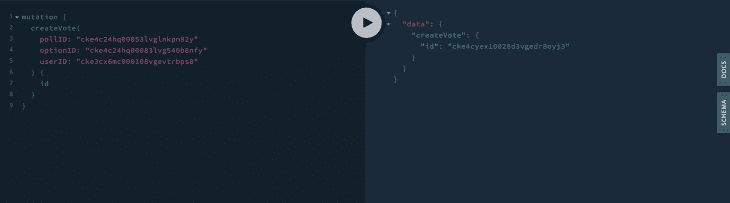

Querying the poll that we just voted on should show votes made for the poll with the name of the user that voted and the option that they chose.

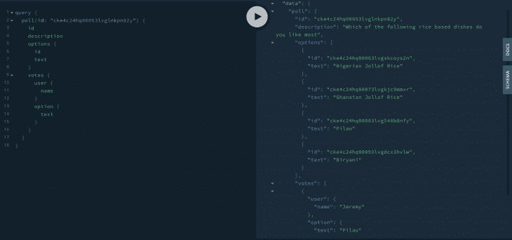

就是这样！我们设法创建了一个简单的 Node.js GraphQL 服务器，它可以用来创建用户、投票和在投票中投票。

`index.js`文件的最终代码将是:

```
const { PrismaClient } = require('@prisma/client');
const { GraphQLServer } = require("graphql-yoga");
const { makeExecutableSchema } = require("graphql-tools");
const typeDefs = `
  type User {
    id          :ID!
    name        :String!
    polls       :[Poll]
  }
  type Poll {
    id          :ID!
    description :String!
    user        :User!
    options     :[Option!]
    votes       :[Vote]
  }
  type Option {
    id          :ID!
    text        :String!
    poll        :Poll!
    votes       :[Vote]
  }
  type Vote {
    id          :ID!
    user        :User!
    poll        :Poll!
    option      :Option!
  }
  type Query {
    hello(name: String): String!
    users: [User]
    polls: [Poll]
    votes: [Vote]
    user(id: ID!): User
    poll(id: ID!): Poll
  }
  type Mutation {
    createUser(
      name: String!
    ): User
    createPoll(
      description: String!
      id: ID!
      options: [String!]
    ): Poll
    createVote(
      userID: ID!
      pollID: ID!
      optionID: ID!
    ): Vote
  }
`;

const resolvers = {
  Query: {
    users: async (parent, args, context) => {
      return context.prisma.user.findMany({
        include: { polls: true }
      });
    },
    polls: async (parent, args, context) => {
      return context.prisma.poll.findMany({
        include: {
          user: true,
          options: true,
          votes: {
            select: { user: true, option: true }
          }
        }
      })
    },
    user: async (parent, args, context) => {
      const { id } = args
      return context.prisma.user.findOne({
        where: {
          id,
        },
        include: { polls: true }
      })
    },
    poll: async (parent, args, context) => {
      const { id } = args
      return context.prisma.poll.findOne({
        where: {
          id,
        },
        include: {
          user: true,
          options: true,
          votes: {
            select: { user: true, option: true }
          }
        }
      })
    }
  },
  Mutation: {
    createUser: (parent, args, context, info) => {
      const newUser = context.prisma.user.create({
        data: {
          name: args.name,
        },
      })
      return newUser
    },
    createPoll: (parent, args, context, info) => {
      const { description, id, options } = args
      const newPoll = context.prisma.poll.create({
        data: {
          description,
          user: {
            connect: { id }
          },
          options: {
            create: options.map(option => ({ text: option }))
          }
        }
      });
      return newPoll;
    },
    createVote: (parent, args, context, info) => {
      const { userID, pollID, optionID } = args
      const newVote = context.prisma.vote.create({
        data: {
          user: {
            connect: { id: userID }
          },
          poll: {
            connect: { id: pollID }
          },
          option: {
            connect: { id: optionID }
          }
        }
      });
      return newVote;
    }
  },
}
const schema = makeExecutableSchema({
  typeDefs,
  resolvers,
});
const prisma = new PrismaClient()
const server = new GraphQLServer({
  schema,
  context: {
    prisma,
  }
})
const options = {
  port: 8000,
  endpoint: '/graphql',
  subscriptions: '/subscriptions',
  playground: '/playground',
}
server.start(options, ({ port }) =>
  console.log(
    `Server started, listening on port ${port} for incoming requests.`,
  ),
)
```

## 后续步骤

本文的目的是展示如何开始使用 Prisma 构建一个基本的 GraphQL 服务器。虽然我们创建了用户，但我们没有实现对用户进行身份验证的方法，也没有添加检查来防止像用户在自己的投票中投票或用户多次投票这样的事情。这通常是通过使用解析器指令来实现的，解析器指令可以检查令牌和用户角色的有效性，然后将它们的详细信息添加到上下文中。指令还可以用来限制用户可以访问的查询和变异。另一件要注意的事情是，我们将我们的`typeDefs`和解析器添加到了`index.js`文件中。在一个相当复杂的应用程序中，这些文件可能会变得很大，最好将它们分别放入各自的文件中。 [Prisma 网站](https://www.prisma.io/docs/)提供了许多与 Prisma 合作的好文档。您可以找到本文中没有涉及的各种 [CRUD](https://www.prisma.io/docs/reference/tools-and-interfaces/prisma-client/crud) (创建、读取、更新、删除)操作的信息，以及如何过滤和排序数据。

## 结论

使用原始查询来检索和操作数据有很多优点。在某些情况下，您会发现 Prisma 生成的查询可能不是最佳的。同样，在你的项目中使用 Prisma 也有好处。它提供了一种快速入门的方法，并且是您的软件库中的一个方便的工具包。本文使用的代码可以在 [GitHub](https://github.com/jkithome/prisma-2-node) 中找到。我很想听听您对 Prisma 的体验以及任何总体反馈。编码快乐！

## 监控生产中失败和缓慢的 GraphQL 请求

虽然 GraphQL 有一些调试请求和响应的特性，但确保 GraphQL 可靠地为您的生产应用程序提供资源是一件比较困难的事情。如果您对确保对后端或第三方服务的网络请求成功感兴趣，

[try LogRocket](https://lp.logrocket.com/blg/graphql-signup)

.

[](https://lp.logrocket.com/blg/graphql-signup)[https://logrocket.com/signup/](https://lp.logrocket.com/blg/graphql-signup)

LogRocket 就像是网络和移动应用的 DVR，记录下你网站上发生的每一件事。您可以汇总并报告有问题的 GraphQL 请求，以快速了解根本原因，而不是猜测问题发生的原因。此外，您可以跟踪 Apollo 客户机状态并检查 GraphQL 查询的键值对。

LogRocket 检测您的应用程序以记录基线性能计时，如页面加载时间、到达第一个字节的时间、慢速网络请求，还记录 Redux、NgRx 和 Vuex 操作/状态。

[Start monitoring for free](https://lp.logrocket.com/blg/graphql-signup)

.