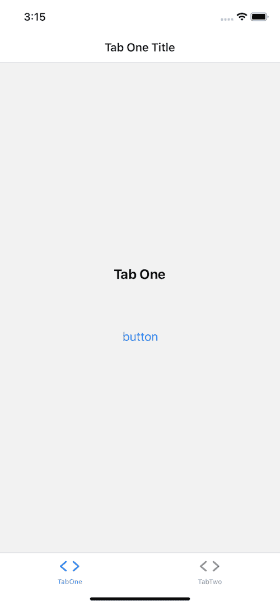
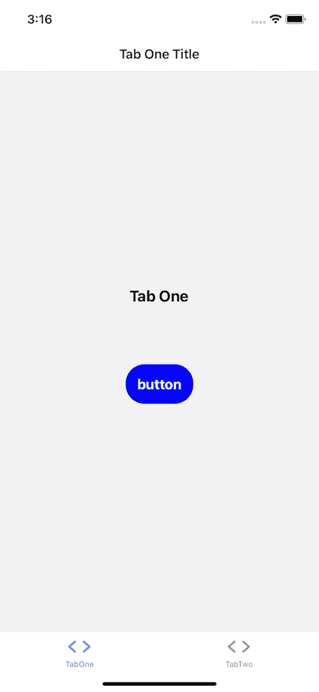
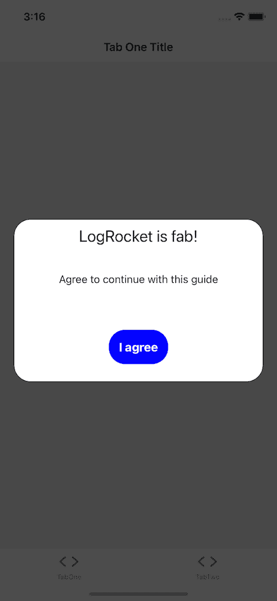
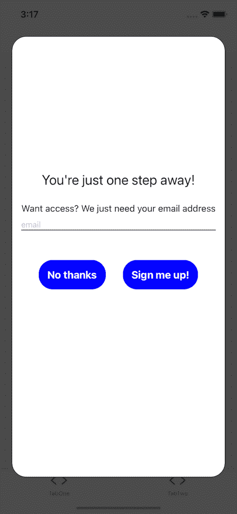

# 在 React Native - LogRocket 博客中创建弹出模式

> 原文：<https://blog.logrocket.com/creating-a-pop-up-modal-in-react-native/>

模态是改善用户界面的一个很好的工具。从本质上来说，[模态是一个出现在另一个屏幕上方的屏幕](https://blog.logrocket.com/top-react-modal-components-for-2021/),引导用户注意关键信息或引导他们进入流程的下一步。一个活跃的模态禁用原始屏幕，它仍然可见，提示用户与新屏幕交互。

在本教程中，我们将查看一些模态的实际用例，并通过在 React Native 中创建以下内容来提高我们对它们的理解:

*   当用户单击按钮时打开的模式
*   带有子组件的可重用模型
*   当用户导航到屏幕时打开的弹出模式

你可以在我的 [GitHub](https://github.com/claysimps/RNModalExample) 上找到这个项目的源代码。

## 初始化项目

首先，要初始化项目，请在终端中键入以下代码:

```
expo init projectName && cd projectName && expo start

```

如果你要将模态添加到一个现有的项目中，而不是从头开始，跳过这一步，将`react-native-modal`添加到你的项目中，并选择**标题**选项。

选择`tabs (TypeScript)`选项，它应该类似于下面的代码块:

```
tabs (TypeScript)     several example screens and tabs using react-navigation and TypeScript

```

将弹出一个浏览器窗口，显示打开 Expo 项目的说明。现在，您可以打开您最喜欢的 IDE。如果你正在使用 VS 代码，在你的终端中输入`code .`来打开它。

## 安装`react-native-modal`

`react-native-modal`如果你带着 React Native 的模态组件去美容院要求全面改造，你会得到什么。它建立在 React Native 的模态组件之上，提供了漂亮的动画和可定制的样式选项。

运行下面的代码来[安装`react-native-modal`T2:](https://github.com/react-native-modal/react-native-modal#react-native-modal)

```
yarn add react-native-modal

```

## 创建基本模型

模态是由前面的动作触发的，比如导航到屏幕或点击按钮。

打开`screens/TabOneScreen`。将代码更改为类似下面的代码块:

```
import * as React from "react";
import { Button, StyleSheet, Text, View } from "react-native";
import Modal from "react-native-modal";

export default function TabOneScreen() {

  const [isModalVisible, setIsModalVisible] = React.useState(false);

  const handleModal = () => setIsModalVisible(() => !isModalVisible);

  return (
    <View style={styles.container}>
      <Text style={styles.title}>Tab One</Text>
      <View style={styles.separator} />
      <Button title="button" onPress={handleModal} />
      <Modal isVisible={isModalVisible}>
        <View style={{ flex: 1 }}>
          <Text>Hello!</Text>
          <Button title="Hide modal" onPress={handleModal} />
        </View>
      </Modal>
    </View>
  );
}

const styles = StyleSheet.create({
  container: {
    flex: 1,
    alignItems: "center",
    justifyContent: "center",
  },
  title: {
    fontSize: 20,
    fontWeight: "bold",
  },
  text: {
    fontSize: 16,
    fontWeight: "400",
    textAlign: "center",
  },
  separator: {
    marginVertical: 30,
    height: 1,
    width: "80%",
  },
});

```

让我们仔细看看。

### `useState`

```
const [isModalVisible, setIsModalVisible] = React.useState(false);

```

React `useState`钩子返回`isModalVisible`，一个有状态值，和`setIsModalVisible`，一个更新它的函数。

初始状态是`false`，所以我们在改变状态之前看不到模态。在我们的例子中，我们将使用一个按钮。

### `handleModal`

```
const handleModal = () => setIsModalVisible(() => !isModalVisible);

```

按下按钮将调用`handleModal`并返回相反的状态。真变假，假变真。

### `<Modal />`

```
<Modal isVisible={isModalVisible}>

```

`Modal`有一个名为`isVisible`的属性，它接受一个布尔值。因为我们将`isModalVisible`传递给`isVisible`，所以情态动词知道它应该在什么时候出现。

您完成的模型将如下图所示:



## 创建可重用的模型

前面的例子创建了一个模态和打开关闭它的按钮。现在我们知道了这些步骤，让我们构建一个定制的模态和一个启动它的按钮。

让我们从一个简单的按钮开始，打开和关闭我们的模态。在`components`文件夹中，创建一个名为`Button.tsx`的新文件，并添加以下代码:

```
import React from "react";
import { StyleSheet, Text, TouchableOpacity, View } from "react-native";
export type ButtonProps = {
  title: string;
  onPress: () => void;
};
export const Button = ({ title, onPress }: ButtonProps) => {
  return (
    <TouchableOpacity style={styles.button} onPress={onPress}>
      <Text style={styles.text}>{title}</Text>
    </TouchableOpacity>
  );
};
const styles = StyleSheet.create({
  button: {
    backgroundColor: "blue",
    marginTop: 15,
    paddingVertical: 15,
    borderRadius: 25,
    width: "80%",
    alignItems: "center",
  },
  text: {
    color: "white",
    fontWeight: "700",
    fontSize: 18,
  },
});

```

您的输出应该如下图所示:



现在我们已经构建了一个按钮，我们将创建我们的模态。在您的`components`文件夹中，创建一个名为`Modal.tsx`的文件，并添加以下代码:

```
import React from "react";
import { StyleSheet, View, Text, Button } from "react-native";
import RNModal from "react-native-modal";
type ModalProps = {
  isVisible: boolean;
  children: React.ReactNode;
  [x: string]: any;
};
export const Modal = ({
  isVisible = false,
  children,
  ...props
}: ModalProps) => {
  return (
    <RNModal
      isVisible={isVisible}
      animationInTiming={1000}
      animationOutTiming={1000}
      backdropTransitionInTiming={800}
      backdropTransitionOutTiming={800}
      {...props}>
      {children}
    </RNModal>
  );
};

const ModalContainer = ({ children }: { children: React.ReactNode }) => (
  <View style={styles.container}>{children}</View>
);

const ModalHeader = ({ title }: { title: string }) => (
  <View style={styles.header}>
    <Text style={styles.text}>{title}</Text>
  </View>
);

const ModalBody = ({ children }: { children?: React.ReactNode }) => (
  <View style={styles.body}>{children}</View>
);

const ModalFooter = ({ children }: { children?: React.ReactNode }) => (
  <View style={styles.footer}>{children}</View>
);

const styles = StyleSheet.create({
  container: {
    backgroundColor: "#ffffff",
    borderRadius: 25,
    borderWidth: 1,
    borderColor: "#000",
    borderStyle: "solid",
  },
  header: {
    alignItems: "center",
    justifyContent: "center",
  },
  text: {
    paddingTop: 10,
    textAlign: "center",
    fontSize: 24,
  },
  body: {
    justifyContent: "center",
    paddingHorizontal: 15,
    minHeight: 100,
  },
  footer: {
    justifyContent: "center",
    alignItems: "center",
    padding: 10,
    flexDirection: "row",
  },
});

Modal.Header = ModalHeader;
Modal.Container = ModalContainer;
Modal.Body = ModalBody;
Modal.Footer = ModalFooter;

```

我们已经将第一个例子中的原始模态组件导出为`Modal`。你注意到`animation`和`backdropTransitions`道具了吗？这些道具赋予了原生模态组件我刚才说的改头换面。

有关可用道具的完整列表，请查看[文档](https://github.com/react-native-modal/react-native-modal#available-props)。

### 子组件和点符号

使用[点符号](https://reactjs.org/docs/jsx-in-depth.html#using-dot-notation-for-jsx-type)，我们将把`Modal`导出为一个带有子组件的模块。如果您想添加标题，您可以使用`Modal.Header`访问标题组件。

`ModalHeader`接受`title`属性中的字符串。`Modal.Container`、`Modal.Body`、`Modal.Footer`接受儿童。子组件可以是你想要的任何东西，比如图像、一些文本、按钮或者一个 [ScrollView](https://blog.logrocket.com/common-bugs-react-native-scrollview/) 。

现在我们有了一个模态和一个按钮，回到`screens/TabOneScreen`。只需两步，我们就能把它们组装起来。

通过将上面代码块中的导入语句分别更改为下面的代码块，导入我们的新按钮和模式:

```
import { Button, StyleSheet, Text, View } from "react-native";
import Modal from "react-native-modal";

import { StyleSheet, Text, View } from "react-native";
import { Button } from "../components/Button";
import { Modal } from "../components/Modal";

```

对 return 语句中的模态组件执行相同的操作:

```
<Modal isVisible={isModalVisible}>
  <View style={{ flex: 1 }}>
    <Text>Hello!</Text>
    <Button title="Hide modal" onPress={handleModal} />
  </View>
</Modal>

<Modal isVisible={isModalVisible}>
  <Modal.Container>
    <Modal.Header title="LogRocket is fab!" />
    <Modal.Body>
      <Text style={styles.text}>Agree to continue with this guide</Text>
      </Modal.Body>
    <Modal.Footer>
      <Button title="I agree" onPress={handleModal} />
    </Modal.Footer>
  </Modal.Container>
</Modal>

```

结果应该类似于下图:



你可以在 [GitHub 上找到所有的变化。](https://github.com/claysimps/RNModalExample/blob/modal-with-child-components/screens/TabOneScreen.tsx)

现在，我们有了一个模态，当我们告诉它时，它就会出现。让我们添加当我们想要提示用户看到或做某事时出现的弹出窗口。首先，我们将创建一个行动号召场景。

### 例子

让我们假设用户必须订阅才能访问特定的屏幕。如果用户登陆屏幕但没有订阅，我们希望创建一个行动号召。

转到`screens/TabTwoScreen`，将当前代码替换为以下代码:

```
import React, { useEffect } from "react";
import { StyleSheet, Text, TextInput, View } from "react-native";
import { Button } from "../components/Button";
import { Modal } from "../components/Modal";

export default function TabTwoScreen() {
  const [isModalVisible, setIsModalVisible] = React.useState(false);

  useEffect(() => {
    const checkForSubscription = setTimeout(() => {
      setIsModalVisible(() => !isModalVisible);
    }, 1500);
    return () => clearTimeout(checkForSubscription);
  }, []);

  const handleSignUp = () => {
    // sign up the user and close the modal
    setIsModalVisible(() => !isModalVisible);
  };

  const handleDecline = () => setIsModalVisible(() => !isModalVisible);

  return (
    <View style={styles.container}>
      <Text style={styles.title}>Premium stuff here</Text>
      <View style={styles.separator} />
      <Modal isVisible={isModalVisible}>
        <Modal.Container>
          <View style={styles.modal}>
            <Modal.Header title="You're just one step away!" />
            <Modal.Body>
              <Text style={styles.text}>
                Want access? We just need your email address
              </Text>
              <TextInput
                style={styles.input}
                placeholder="email"
                keyboardType="email-address"
              />
            </Modal.Body>
            <Modal.Footer>
              <View style={styles.button}>
                <Button title="No thanks" onPress={handleDecline} />
                <Button title="Sign me up!" onPress={handleSignUp} />
              </View>
            </Modal.Footer>
          </View>
        </Modal.Container>
      </Modal>
    </View>
  );
}

const styles = StyleSheet.create({
  container: {
    flex: 1,
    alignItems: "center",
    justifyContent: "center",
  },
  title: {
    fontSize: 20,
    fontWeight: "bold",
  },
  text: {
    fontSize: 16,
    fontWeight: "400",
    textAlign: "center",
  },
  separator: {
    marginVertical: 30,
    height: 1,
    width: "80%",
  },
  input: {
    paddingTop: 10,
    borderColor: "grey",
    borderBottomWidth: 2,
  },
  button: {
    flexDirection: "row",
    flex: 1,
    justifyContent: "center",
  },
  modal: {
    width: "100%",
    height: "90%",
    alignItems: "center",
    justifyContent: "center",
  },
});

```

`useEffect`当依赖关系数组中的依赖关系改变时重新渲染，由`[]`表示。`useEffect`使`Modal`组件在您导航到屏幕时出现。

由于我们没有传递任何依赖项，`useEffect`只会渲染一次。`setTimeout`用于模拟检查用户是否订阅:

```
useEffect(() => {
    // fake check to see if user is subscribed
    const checkForSubscription = setTimeout(() => {
      setIsModalVisible(() => !isModalVisible);
    }, 1500);
    return () => clearTimeout(checkForSubscription);
    // dependancy array 
  }, []);

```

您的模态应该如下图所示:



## 结论

在本教程中，我们学习了什么是模态以及它们是如何工作的。然后，我们创建了三个定制模型，可以改进任何 React 本地应用程序。

正如你所看到的，模态是实现行动号召的一个很好的工具。还有其他几个类似的库，比如[r](https://www.npmjs.com/package/react-native-modal-datetime-picker)eact-native-modal-datetime-picker，所以值得在 [npm](https://www.npmjs.com/search?q=modal%20react%20native) 上浏览。根据您的用例，您可能会节省一些构建定制组件的时间！

我希望你喜欢在本教程中学习情态动词。编码快乐！

## [LogRocket](https://lp.logrocket.com/blg/react-native-signup) :即时重现 React 原生应用中的问题。

[](https://lp.logrocket.com/blg/react-native-signup)

[LogRocket](https://lp.logrocket.com/blg/react-native-signup) 是一款 React 原生监控解决方案，可帮助您即时重现问题、确定 bug 的优先级并了解 React 原生应用的性能。

LogRocket 还可以向你展示用户是如何与你的应用程序互动的，从而帮助你提高转化率和产品使用率。LogRocket 的产品分析功能揭示了用户不完成特定流程或不采用新功能的原因。

开始主动监控您的 React 原生应用— [免费试用 LogRocket】。](https://lp.logrocket.com/blg/react-native-signup)