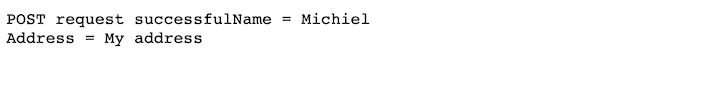

# 用 Golang - LogRocket 博客创建 web 服务器

> 原文：<https://blog.logrocket.com/creating-a-web-server-with-golang/>

Go 是创建简单而高效的 web 服务器和 web 服务的绝佳语言。它提供了一个内置的 HTTP 包，其中包含用于快速创建 web 或文件服务器的实用程序。

本教程的目标是创建一个可以接受 GET 请求并提供响应的 web 服务器。我们将使用服务器来服务静态文件，充当文件服务器。然后，我们将让 web 服务器响应来自表单提交的 POST 请求，比如联系表单。

事不宜迟，让我们探索如何用 Go 构建您的第一个 web 服务器。

## 设置

您需要 Go 版本 1.11 或更高版本来遵循本教程。

在本节中，我们将创建所有必要的文件并建立正确的文件结构。之后，我们将导入我们的包来测试设置是否工作。不要担心 Golang web 服务器的设置非常简单。

根据下面的结构创建下列文件和文件夹。文件`server.go`位于项目的根目录，文件夹`static`也是如此，它包含两个 HTML 文件:`index.html`和`form.html`。

```
- server.go
- static/
- - index.html
- - form.html

```

现在让我们写一些代码。打开`server.go`文件，导入所需的包。我们将使用`fmt`向终端打印有用的数据，使用`log`打印致命错误，以防 web 服务器崩溃。

`net/http`是最重要的包裹。它提供了创建 HTTP 客户端或服务器实现(如 Golang web 服务器)的所有功能。

```
package main

import (
    "fmt"
    "log"
    "net/http"
)

```

最后，让我们在`server.go`文件中添加一个简单的`main()`函数，向终端打印一条消息。

```
func main() {
    fmt.Printf("Starting server at port 8080\n")
}

```

要测试设置，用下面的命令启动虚拟服务器。

```
go run server.go

```

如果您按照设置进行操作，您应该在终端中看到以下输出。

```
Starting server at port 8080

```

如果一切顺利，下一步就是创建 web 服务器。

## 使用获取路由启动 web 服务器

在这个阶段，我们将创建一个 web 服务器，它实际上在端口 8080 上提供服务，并且可以响应传入的 GET 请求。

让我们修改`main()`函数中的代码，在端口 8080 启动一个 web 服务器。`ListenAndServe`方法由我们在第一步中导入的`http`包导出。这个方法允许我们启动 web 服务器并指定端口来监听传入的请求。

请注意，port 参数需要以冒号加标点符号的字符串形式传递。第二个参数接受一个处理程序来为 HTTP/2 配置服务器。然而，这对于本教程并不重要，所以我们可以安全地将`nil`作为第二个参数传递。

```
 func main() {
    fmt.Printf("Starting server at port 8080\n")
    if err := http.ListenAndServe(":8080", nil); err != nil {
        log.Fatal(err)
    }
}

```

此时，服务器可以启动，但是它仍然不知道如何处理请求。我们需要将处理程序传递给服务器，以便它知道如何响应传入的请求以及接受哪些请求。

我们将使用`HandleFunc`函数向 web 服务器添加路由处理程序。第一个参数接受它需要监听`/hello`的路径。在这里，您告诉服务器监听任何对`[http://localhost:8080/hello](http://localhost:8080/hello)`的请求。第二个参数接受一个函数，该函数包含正确响应请求的业务逻辑。

默认情况下，这个函数接受一个`ResponseWriter`来发回响应，接受一个`Request`对象来提供关于请求本身的更多信息。例如，您可以访问有关已发送邮件头的信息，这对验证请求很有用。

```
func main() {
    http.HandleFunc("/hello", func(w http.ResponseWriter, r *http.Request){
        fmt.Fprintf(w, "Hello!")
    })

    fmt.Printf("Starting server at port 8080\n")
    if err := http.ListenAndServe(":8080", nil); err != nil {
        log.Fatal(err)
    }
}

```

如您所见，当我们将这个响应传递给`ResponseWriter`时，处理程序发送一个`“Hello!”`消息。

* * *

### 更多来自 LogRocket 的精彩文章:

* * *

现在让我们试试这个设置。用`go run server.go`启动网络服务器并访问`[http://localhost:8080/hello](http://localhost:8080/hello)`。如果服务器回复了`"Hello!"`，你可以继续下一步，在这里你将学习如何为你的 Golang web 服务器路由增加基本的安全性。

## 为路由添加基本安全性

不言而喻，安全是重要的。让我们探讨一些基本策略来增强您的 Go web 服务器的安全性。

在此之前，我们应该花点时间增加代码的可读性。让我们创建`helloHandler`函数，它保存与`/hello`请求相关的所有逻辑。

```
func helloHandler(w http.ResponseWriter, r *http.Request) {
    if r.URL.Path != "/hello" {
        http.Error(w, "404 not found.", http.StatusNotFound)
        return
    }

    if r.Method != "GET" {
        http.Error(w, "Method is not supported.", http.StatusNotFound)
        return
    }

    fmt.Fprintf(w, "Hello!")
}

```

这个处理程序使用`Request`对象来检查请求的路径是否正确。这是一个关于如何使用`Request`对象的非常基本的例子。

如果路径不正确，服务器会向用户返回一个`StatusNotFound`错误。要向用户写一个错误，可以使用`http.Error`方法。请注意，`StatusNotFound`代码对应于一个 404 错误。所有状态代码都可以在 [Golang 文档](https://golang.org/pkg/net/http/#pkg-constants)中找到。

接下来，我们添加一个检查来验证请求的类型。如果方法与`GET`不对应，服务器返回一个新的错误。当两个检查都通过时，服务器返回其成功响应`"Hello!"`。

我们需要做的最后一件事是修改我们的`main()`函数中的`handleFunc`函数，以接受上面的`helloHandler`函数。

```
http.HandleFunc("/hello", helloHandler)

```

下面是你的`server.go`文件的完整代码。

```
package main

import (
    "fmt"
    "log"
    "net/http"
)

func helloHandler(w http.ResponseWriter, r *http.Request) {
    if r.URL.Path != "/hello" {
        http.Error(w, "404 not found.", http.StatusNotFound)
        return
    }

    if r.Method != "GET" {
        http.Error(w, "Method is not supported.", http.StatusNotFound)
        return
    }

    fmt.Fprintf(w, "Hello!")
}

func main() {
    http.HandleFunc("/hello", helloHandler) // Update this line of code

    fmt.Printf("Starting server at port 8080\n")
    if err := http.ListenAndServe(":8080", nil); err != nil {
        log.Fatal(err)
    }
}

```

接下来，我们将使用`go run server.go`启动 Go web 服务器。您可以通过使用诸如[邮递员](https://www.postman.com/)或 [cURL](https://curl.haxx.se/docs/httpscripting.html) 之类的工具向`[http://localhost:8080/hello](http://localhost:8080/hello)`发送 POST 请求来测试您的安全性。

## 启动静态 web 服务器

在这一步中，我们将创建一个简单的文件服务器来托管静态文件。这将是对 web 服务器的一个非常简单的添加。

为了确保我们在 web 服务器上提供内容，让我们修改位于`static`文件夹中的`index.html`文件。为了简单起见，只需在文件中添加一个标题“T2”如果您愿意，您可以添加更多的文件或样式文件，使您的 web 服务器看起来更好一些。

```
<html>
  <head>
    <title>Static Website</title>
  </head>
  <body>
    <h2>Static Website</h2>
  </body>
</html>

```

为了服务于`static`文件夹，您必须向`server.go`添加两行代码。第一行代码使用`FileServer`函数创建文件服务器对象。这个函数接受一个`http.Dir`类型的路径。因此，我们必须将字符串路径`“./static”`转换为`http.Dir`路径类型。

不要忘记指定`Handle`路由，它接受路径和文件服务器。该函数的作用方式与`HandleFunc`函数相同，除了[和](https://www.reddit.com/r/golang/comments/589wf4/whats_the_difference_between_httphandlefunc_and/)有一些小的不同。有关 [`FileServer`对象](https://golang.org/pkg/net/http/#FileServer)的更多信息，请查看[文档](https://golang.org/pkg/net/http/#FileServer)。

```
func main() {
    fileServer := http.FileServer(http.Dir("./static")) // New code
    http.Handle("/", fileServer) // New code
    http.HandleFunc("/hello", helloHandler)

    fmt.Printf("Starting server at port 8080\n")
    if err := http.ListenAndServe(":8080", nil); err != nil {
        log.Fatal(err)
    }
}

```

是时候试试代码了。用`go run server.go`启动服务器并访问`[http://localhost:8080/](http://localhost:8080/)`。你应该看到“`Static Website`”的标题。

## 接受表单提交发布请求

最后，web 服务器必须响应表单提交。

让我们向`static`文件夹中的`form.html`文件添加一些内容。请注意，表单操作被发送到`/form`。这意味着表单中的 POST 请求将被发送到`[http://localhost:8080/form](http://localhost:8080/form)`。表单本身要求输入两个变量:`name`和`address`。

```
<!DOCTYPE html>
<html>
<head>
  <meta charset="UTF-8" />
</head>
<body>
<div>
  <form method="POST" action="/form">     
      <label>Name</label><input name="name" type="text" value="" />
      <label>Address</label><input name="address" type="text" value="" />
      <input type="submit" value="submit" />
  </form>
</div>
</body>
</html>

```

下一步是创建处理程序来接受`/form`请求。`form.html`文件已经通过文件服务器提供，并且可以通过`[http://localhost:8080/form.html](http://localhost:8080/form.html)`访问。

首先，该函数必须调用`ParseForm()`来解析原始查询并更新`r.PostForm`和`r.Form`。这将允许我们通过`r.FormValue`方法访问`name`和`address`值。

在函数结束时，我们使用`fmt.Fprintf`将两个值都写入`ResponseWriter`。

```
func formHandler(w http.ResponseWriter, r *http.Request) {
    if err := r.ParseForm(); err != nil {
        fmt.Fprintf(w, "ParseForm() err: %v", err)
        return
    }
    fmt.Fprintf(w, "POST request successful")
    name := r.FormValue("name")
    address := r.FormValue("address")

    fmt.Fprintf(w, "Name = %s\n", name)
    fmt.Fprintf(w, "Address = %s\n", address)
}

```

不要忘记给`main()`函数添加新的表单处理程序路径。

```
http.HandleFunc("/form", formHandler)

```

现在，完整的代码如下所示。

```
package main

import (
    "fmt"
    "log"
    "net/http"
)

func formHandler(w http.ResponseWriter, r *http.Request) {
    if err := r.ParseForm(); err != nil {
        fmt.Fprintf(w, "ParseForm() err: %v", err)
        return
    }
    fmt.Fprintf(w, "POST request successful")
    name := r.FormValue("name")
    address := r.FormValue("address")
    fmt.Fprintf(w, "Name = %s\n", name)
    fmt.Fprintf(w, "Address = %s\n", address)
}

func helloHandler(w http.ResponseWriter, r *http.Request) {
    if r.URL.Path != "/hello" {
        http.Error(w, "404 not found.", http.StatusNotFound)
        return
    }

    if r.Method != "GET" {
        http.Error(w, "Method is not supported.", http.StatusNotFound)
        return
    }

    fmt.Fprintf(w, "Hello!")
}

func main() {
    fileServer := http.FileServer(http.Dir("./static"))
    http.Handle("/", fileServer)
    http.HandleFunc("/form", formHandler)
    http.HandleFunc("/hello", helloHandler)

    fmt.Printf("Starting server at port 8080\n")
    if err := http.ListenAndServe(":8080", nil); err != nil {
        log.Fatal(err)
    }
}

```

### 试用表单处理程序

我们可以通过用`go run server.go`启动服务器来测试表单。服务器启动时，访问`[http://localhost:8080/form.html](http://localhost:8080/form.html)`。您应该看到两个输入字段和一个提交按钮。


填完表格后，点击`submit`按钮。服务器应该处理您的 POST 请求，并在`[http://localhost:8080/form](http://localhost:8080/form)`响应页面上显示结果，如下图所示。



如果你看到上面的结果，你已经成功地创建了你的第一个 Golang 网络和文件服务器。恭喜你！

如果您想进一步探索 Golang web 服务器，Golang [HTTP 包文档](https://golang.org/pkg/net/http/#pkg-constants)中有很多很好的例子。这篇关于[用 Go](https://golang.org/doc/articles/wiki/) 编写 web 应用的教程是另一个很好的资源，它涵盖了大部分基础知识。

## 使用 [LogRocket](https://lp.logrocket.com/blg/signup) 消除传统错误报告的干扰

[](https://lp.logrocket.com/blg/signup)

[LogRocket](https://lp.logrocket.com/blg/signup) 是一个数字体验分析解决方案，它可以保护您免受数百个假阳性错误警报的影响，只针对几个真正重要的项目。LogRocket 会告诉您应用程序中实际影响用户的最具影响力的 bug 和 UX 问题。

然后，使用具有深层技术遥测的会话重放来确切地查看用户看到了什么以及是什么导致了问题，就像你在他们身后看一样。

LogRocket 自动聚合客户端错误、JS 异常、前端性能指标和用户交互。然后 LogRocket 使用机器学习来告诉你哪些问题正在影响大多数用户，并提供你需要修复它的上下文。

关注重要的 bug—[今天就试试 LogRocket】。](https://lp.logrocket.com/blg/signup-issue-free)