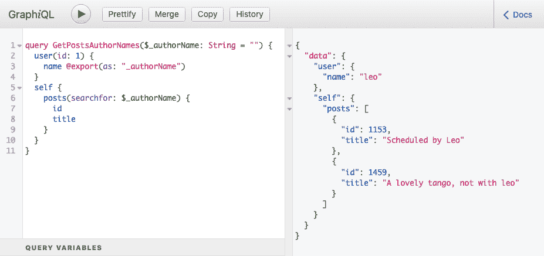
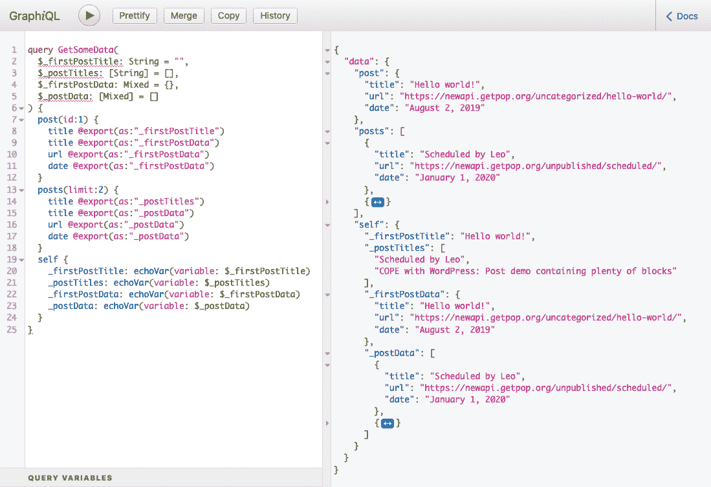
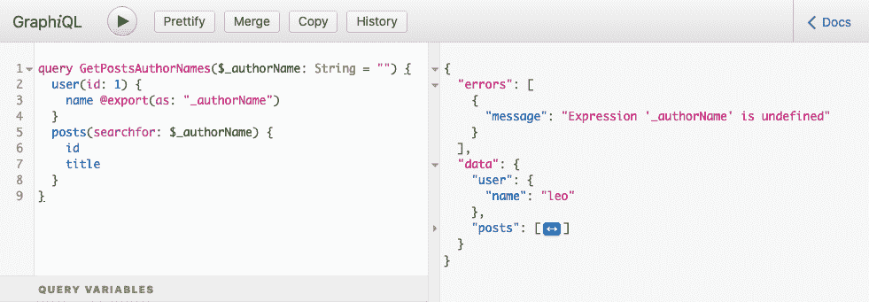
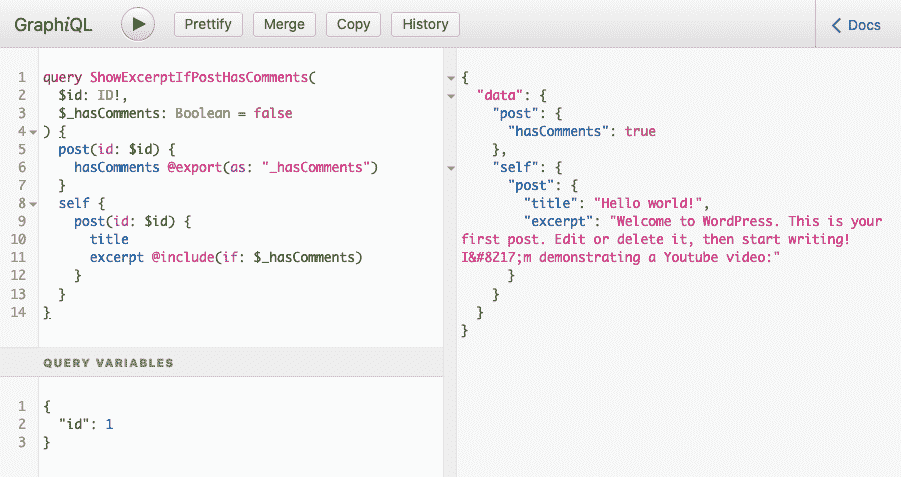
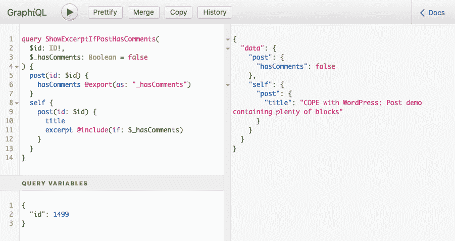

# 创建@export GraphQL 指令- LogRocket 博客

> 原文：<https://blog.logrocket.com/creating-an-export-graphql-directive/>

GraphQL 中的`@export`指令的目标是将一个字段(或一组字段)的值导出到一个变量中，我们可以在查询中的其他地方使用这个变量。

它最明显的用例是将两个查询合并成一个，这样就不需要第二个查询等待第一个查询执行，从而提高了性能。有人提议通过发布[【RFC】动态变量声明](https://github.com/graphql/graphql-spec/issues/583)将其添加到 GraphQL 规范中。

如何运用这一指令？假设我们想要搜索所有提到登录用户名字的帖子。通常，我们需要两个查询来完成这个任务。

我们首先检索用户的`name`:

```
query GetLoggedInUserName {
  me {
    name
  }
}
```

然后，在执行了第一个查询之后，我们可以将检索到的用户的`name`作为变量`$search`进行传递，以在第二个查询中执行搜索:

```
query GetPostsContainingString($search: String = "") {
  posts(search: $search) {
    id
    title
  }
}
```

`@export`指令将允许我们从一个字段中导出值，并通过一个动态变量将该值注入第二个字段，该变量的名称在参数`as`下定义，从而将两个查询合并为一个:

```
query GetPostsContainingLoggedInUserName($search: String = "") {
  me {
    name @export(as: "search")
  }
  posts(search: $search) {
    id
    title
  }
}
```

自从创建以来，这个问题没有从[稻草人阶段](https://github.com/graphql/graphql-spec/blob/master/CONTRIBUTING.md#stage-0-strawman)升级，因为它不容易实现。特别是`[graphql-js](https://github.com/graphql/graphql-js)`(JavaScript 中 GraphQL 的引用实现)通过承诺并行解析字段，所以它事先并不知道哪个字段会在哪个字段之前被解析。

这对`@export`来说是一个阻塞问题，因为导出值的字段必须在读取值的字段之前执行。因此，这个指令只能在 GraphQL 服务器中实现，这些服务器允许我们控制字段被解析的流程，或者哪些[支持查询批处理](https://github.com/graphql/graphql-spec/issues/583#issuecomment-491807207)。

[PoP 的 GraphQL](https://graphql-by-pop.com)是 PHP 中的一个 graph QL 服务器，幸运的是，它没有使用承诺或并行解析字段；它使用开发人员可以在查询本身中操纵的确定性顺序，按顺序解析它们。因此，它可以支持`@export`指令的执行。

因为这个指令最终可能成为规范的一部分，所以这个特定的解决方案必须尽可能地通用，只使用 GraphQL 规范中已经存在的特性，以便为其他 GraphQL 服务器提供一个遵循的模型，并且不要与最终的官方解决方案偏离太多，这样它就可以通过最少的重写进行调整。

在本文中，我将解释这个针对`@export`的特殊解决方案是如何工作的，以及它是如何设计的。

## 研究如何使用该指令

正如我们在上面的查询中看到的，`@export`必须处理从单个字段导出单个值:用户的`name`。

返回列表的字段也应该是可导出的。例如，在下面的查询中，导出的值是登录用户的朋友的名字列表(因此，`$search`变量的类型从`String`变成了`[String]`):

```
query GetPostsContainingLoggedInUserName($search: [String] = []) {
  me {
    friends {
      name @export(as: "search")
    }
  }
  posts(searchAny: $search) {
    id
    title
  }
}
```

请注意，参数`"as"`也用于定义导出列表的动态变量的名称，尽管[最初的提议](https://github.com/graphql/graphql-spec/issues/583#issue-442887842)建议了两个不同的参数:`"as"`用于单个值，而`"into"`用于列表。然而，我相信`"as"`适合这两种情况，并且使事情变得简单，所以我坚持使用它。

尽管在最初的提议中没有要求，但在某些情况下，我们可能还需要从同一个对象中导出几个属性。然后，`@export`应该允许我们将这些属性导出到同一个变量，作为值的字典。

例如，查询可以从用户导出`name`和`surname`字段，并有一个接收字典的`searchByAnyProperty`输入(输入类型改为`Map`):

```
query GetPostsContainingLoggedInUserName($search: Map = {}) {
  me {
    name @export(as: "search")
    surname @export(as: "search")
  }
  posts(searchByAnyProperty: $search) {
    id
    title
  }
}
```

然后，类似于从单个值升级到值列表，我们可以从单个字典升级到字典列表。

例如，我们可以从登录用户的朋友列表中导出字段`name`和`surname`(输入类型变为`[Map]`):

```
query GetPostsContainingLoggedInUserName($search: [Map] = []) {
  me {
    friends {
      name @export(as: "search")
      surname @export(as: "search")
    }
  }
  posts(searchAnyByAnyProperty: $search) {
    id
    title
  }
}
```

总之，`@export`必须能够处理这四种情况:

1.  从单个字段导出单个值
2.  从单个字段导出值列表
3.  导出值的字典，包含来自同一对象的多个字段
4.  导出值字典的列表，每个字典包含来自同一对象的多个字段

## 履行

下面的查询用`user(id: 1)`替换了字段`me`,否则非登录用户无法运行它。稍后，我们将回顾为什么变量名以`_`开头，为什么查询使用一个名为`self`的字段，以及为什么输入有一个默认值，尽管它从未被使用过。

处理上述所有四种情况的`@export`的实现是[这个](https://github.com/getpop/graphql/blob/109d194c11dd2510d0ea5ce42b88fb556397400c/src/DirectiveResolvers/ExportDirectiveResolver.php)。让我们看看它是如何表现的。

### 执行第一个案例

下面的查询将用户的`name`提取到变量`$_authorName`中，然后搜索包含该字符串的所有帖子:

```
query GetPostsAuthorNames($_authorName: String = "") {
  user(id: 1) {
    name @export(as: "_authorName")
  }
  self {
    posts(searchfor: $_authorName) {
      id
      title
    }
  }
}
```

当[运行查询](https://newapi.getpop.org/graphiql/?query=query%20GetPostsAuthorNames(%24_authorName%3A%20String%20%3D%20%22%22)%20%7B%0A%20%20user(id%3A%201)%20%7B%0A%20%20%20%20name%20%40export(as%3A%20%22_authorName%22)%0A%20%20%7D%0A%20%20self%20%7B%0A%20%20%20%20posts(searchfor%3A%20%24_authorName)%20%7B%0A%20%20%20%20%20%20id%0A%20%20%20%20%20%20title%0A%20%20%20%20%7D%0A%20%20%7D%0A%7D&operationName=GetPostsAuthorNames)时，它产生以下响应:



Running the first query.

它的工作原理是:在同一个查询中获取用户名`"leo"`，并搜索包含关键字`"leo"`的所有帖子。

### 执行所有四个案件

该查询包括`@export`必须处理的四种情况:

```
query GetSomeData(
  $_firstPostTitle: String = "",
  $_postTitles: [String] = [],
  $_firstPostData: Mixed = {},
  $_postData: [Mixed] = []
) {
  post(id: 1) {
    title @export(as:"_firstPostTitle")
    title @export(as:"_firstPostData")
    date @export(as:"_firstPostData")
  }
  posts(limit: 2) {
    title @export(as:"_postTitles")
    title @export(as:"_postData")
    date @export(as:"_postData")
  }
  self {
    _firstPostTitle: echoVar(variable: $_firstPostTitle)
    _postTitles: echoVar(variable: $_postTitles)
    _firstPostData: echoVar(variable: $_firstPostData)
    _postData: echoVar(variable: $_postData)
  }
}
```

它是这样工作的:

**情况 1**–`@export`单值:

```
post(id: 1) {
  title @export(as: "_firstPostTitle")
}
```

**案例二**–`@export`一个价值列表:

```
posts(limit: 2) {
  title @export(as: "_postTitles")
}
```

**案例 3**–`@export`字段/值的字典，包含来自同一个对象的两个属性(`title`和`date`):

```
post(id: 1) {
  title @export(as: "_firstPostData")
  date @export(as: "_firstPostData")
}
```

**案例 4**–`@export`字段/值字典列表:

```
posts(limit: 2) {
  title @export(as: "_postData")
  date @export(as: "_postData")
}
```

该查询使用字段`[echoVar](https://github.com/GraphQLByPoP/graphql/blob/9d2f983b8374222cda6e4eb87de0e268ccf6f7b0/src/FieldResolvers/ConditionalOnEnvironment/VariablesAsExpressions/VariablesAsExpressionsRootFieldResolver.php)`来可视化动态变量的内容。当运行查询时，它产生以下响应:



Running the second query.

同样，它是有效的，因为响应包含处理所有四种情况的结果:

**情况 1**–`@export`单值:

```
{
  "data": {
    "self": {
      "_firstPostTitle": "Hello world!"
    }
  }
}
```

**案例二**–`@export`一个价值列表:

```
{
  "data": {
    "self": {
      "_postTitles": [
        "Scheduled by Leo",
        "COPE with WordPress: Post demo containing plenty of blocks"
      ]
    }
  }
}
```

**案例 3**–`@export`字段/值的字典，包含来自同一个对象的两个属性(`title`和`date`):

```
{
  "data": {
    "self": {
      "_firstPostData": {
        "title": "Hello world!",
        "date": "August 2, 2019"
      }
    }
  }
}
```

**案例 4**–`@export`字段/值字典列表:

```
{
  "data": {
    "self": {
      "_postData": [
        {
          "title": "Scheduled by Leo",
          "date": "January 1, 2020"
        },
        {
          "title": "COPE with WordPress: Post demo containing plenty of blocks",
          "date": "August 8, 2019"
        }
      ]
    }
  }
}
```

## 该解决方案的缺陷

没有什么是完美的。为了让`@export`工作，查询必须编码成具有以下三个特性:

1.  动态变量的名称必须以`"_"`开头
2.  可能需要字段`self`来控制解析字段的顺序
3.  动态变量必须在操作名中声明为静态(即“普通”)变量，并且总是接收默认值

我将逐一解释为什么这些是强制性的，以及它们是如何工作的。

### 1.动态变量的名称必须以`"_"`开头

正如我们前面提到的,`@export`指令不是 GraphQL 规范的一部分，所以对于它的实现，不需要考虑语言本身。因此，GraphQL 服务器实现者必须找到自己的方法来满足他们的需求，而不要过多地偏离 GraphQL 语法，并期望有一天它能成为官方解决方案的一部分。

对于这个解决方案，我决定`@export`将这个值导出到一个普通变量中，作为`$variable`访问。请注意，这是一个可能因实现者而异的设计决策——例如， [Apollo 的`@export`指令](https://www.apollographql.com/docs/link/links/rest/#export-directive)是在条目`exportVariables`下访问的(就像`{exportVariables.id}`一样)，而不是在条目`args`下作为其输入。

因此，Apollo 的解决方案不需要我们在操作名中声明导出的变量，但是我的实现需要。

这个设计决策很难实现，因为静态变量和动态变量的行为不同:静态变量的值可以在解析查询时确定，而动态变量的值必须在运行时确定，也就是在读取变量的值时确定。然后，GraphQL 引擎必须能够判断用哪种方式处理变量，是静态方式还是动态方式。

给定约束，并且为了避免在查询中引入新的、不受支持的语法(比如有`$staticVariables`和`%dynamicVariables%`)，我发现的解决方案是让动态变量名以`"_"`开头，比如`$_dynamicVariable`。然后，如果变量名以`"_"`开头，GraphQL 引擎会将其视为动态的，在解析查询时不会解析它；否则，它被视为静态变量。

这个解决方案无疑是一个黑客，但它工作得很好。如果最终有一个针对`@export`指令的官方解决方案，并且它提供了关于如何区分动态和静态变量的指南，那么我的解决方案必须被修改。

### 2.可能需要字段`self`来控制解析字段的顺序

如果在将值导出到变量之前读取变量，那么`@export`指令将不起作用。因此，引擎需要提供一种方法来控制字段执行顺序。这是一个`graphql-js`无法轻易解决的问题，其结果是`@export`无法得到 GraphQL 规范的官方支持。

如前所述，GraphQL by PoP 确实提供了一种通过查询本身操纵字段执行顺序的方法。让我们看看它是如何工作的。

> **N.B.** :我已经在文章“[设计 GraphQL 服务器以获得最佳性能](https://blog.logrocket.com/designing-graphql-server-optimal-performance/)”和“[简化 GraphQL 数据模型](https://blog.logrocket.com/simplifying-the-graphql-data-model/)”中详细描述了 GraphQL 引擎如何解析字段并加载它们的数据。

引擎以迭代方式加载每种类型的数据，先解析查询中遇到的第一种类型的所有字段，然后解析查询中遇到的第二种类型的所有字段，依此类推，直到没有其他类型需要处理。

例如，以下查询涉及类型为`Director`、`Film`和`Actor`的对象:

```
{
  directors {
    name
    films {
      title
      actors {
        name
      }
    }
  }
}
```

由 GraphQL 引擎按以下顺序解析:


Dealing with types in iterations.

如果在处理之后，在查询中再次引用类型以检索未加载的数据(例如，从额外的对象或来自先前加载的对象的额外的字段)，则该类型被再次添加到迭代列表的末尾。

例如，假设我们还查询了`Actor`的`preferredDirector`字段(返回一个类型为`Director`的对象)，如下所示:

```
{
  directors {
    name
    films {
      title
      actors {
        name
        preferredDirector {
          name
        }
      }
    }
  }
}
```

然后，GraphQL 引擎将按以下顺序处理查询:


Repeated types in iterations.

让我们看看如何执行`@export`。对于我们的第一次尝试，我们像平常一样创建查询，不考虑字段的执行顺序:

```
query GetPostsAuthorNames($_authorName: String = "") {
  user(id: 1) {
    name @export(as: "_authorName")
  }
  posts(searchfor: $_authorName) {
    id
    title
  }
}
```

当[运行查询](https://newapi.getpop.org/graphiql/?query=query%20GetPostsAuthorNames(%24_authorName%3A%20String%20%3D%20%22%22)%20%7B%0A%20%20user(id%3A%201)%20%7B%0A%20%20%20%20name%20%40export(as%3A%20%22_authorName%22)%0A%20%20%7D%0A%20%20posts(searchfor%3A%20%24_authorName)%20%7B%0A%20%20%20%20id%0A%20%20%20%20title%0A%20%20%7D%0A%7D&operationName=GetPostsAuthorNames)时，它产生以下响应:



Executing a query using a variable.

其中包含以下错误:

```
{
  "errors": [
    {
      "message": "Expression '_authorName' is undefined",
    }
  ]
}
```

这个错误意味着当变量`$_authorName`被读取时，它还没有被设置——它是`undefined`。

让我们看看为什么会这样。首先，我们分析哪些类型出现在查询中，作为注释添加如下(type `ID`是一个自定义标量):

```
# Type: Root
query GetPostsAuthorNames($_authorName: String = "") {
  # Type: User
  user(id: 1) {
    # Type: String
    name @export(as: "_authorName")
  }
  # Type: Post
  posts(searchfor: $_authorName) {
    # Type: ID
    id
    # Type: String
    title
  }
}
```

为了处理类型并加载它们的数据，数据加载引擎将查询类型`Root`添加到 FIFO(先进先出)列表中，从而使`[Root]`成为传递给算法的初始列表。然后，它按顺序遍历这些类型，就像这样:

| **#** | **操作** | **列表** |
| 0 | 准备 FIFO 列表 | `[Root]` |
| 1a | 弹出列表的第一种类型(`Root`) | `[]` |
| 1b | 处理从根类型查询的所有字段:→ `user(id: 1)`→ `posts(searchfor: $_authorName)`将它们的类型(`User`和`Post`)添加到列表中 | `[User, Post]` |
| 2a | 弹出列表的第一种类型(`User`) | `[Post]` |
| 2b | 处理从`User`类型查询的字段:→ `name @export(as: "_authorName")`因为它是标量类型(`String`)，所以不需要将其添加到列表中 | `[Post]` |
| 3a | 弹出列表的第一种类型(`Post`) | `[]` |
| 3b | 处理从`Post`类型查询的所有字段:→ `id`→ `title`因为这些是标量类型(ID 和字符串)，所以不需要将它们添加到列表中 | `[]` |
| 四 | 列表为空，迭代结束 | 这里可以看出问题:`@export`是在步骤 **2b** 执行的，但是在步骤 **1b** 读取的。 |

正是在这里，我们需要控制现场执行流程。我实现的解决方案是延迟读取导出变量的时间，通过人工查询类型`Root`中的字段`[self](https://github.com/getpop/component-model/blob/57a27af3841da284ea59c6f7ff3a9b4c0befa472/src/FieldResolvers/CoreFieldResolver.php)`来实现。

`self`字段，顾名思义，返回相同的对象；应用于`Root`对象，它返回相同的`Root`对象。您可能会想:“如果我已经有了根对象，那么我为什么还需要再次检索它呢？”

因为随后 GraphQL 引擎的算法将需要在 FIFO 列表的末尾添加这个对`Root`的新引用，并且我们可以在每次迭代之前或之后故意分布查询的字段。

这是一种黑客行为，但它允许我们有效地控制字段被解析的顺序。

这就是为什么在上面的查询中字段`posts(searchfor: $_authorName)`被放在字段`self`中，并且[运行查询](https://newapi.getpop.org/graphiql/?query=query%20GetPostsAuthorNames(%24_authorName%3A%20String%20%3D%20%22%22)%20%7B%0A%20%20user(id%3A%201)%20%7B%0A%20%20%20%20name%20%40export(as%3A%20%22_authorName%22)%0A%20%20%7D%0A%20%20self%20%7B%0A%20%20%20%20posts(searchfor%3A%20%24_authorName)%20%7B%0A%20%20%20%20%20%20id%0A%20%20%20%20%20%20title%0A%20%20%20%20%7D%0A%20%20%7D%0A%7D&operationName=GetPostsAuthorNames)产生预期的响应:

让我们探索一下这个查询处理类型的顺序，以理解为什么它工作得很好:

```
query GetPostsAuthorNames($_authorName: String = "") {
  user(id: 1) {
    name @export(as: "_authorName")
  }
  self {
    posts(searchfor: $_authorName) {
      id
      title
    }
  }
}
```


Running the first query.

**#**

| **操作** | **列表** | 0 |
| 准备 FIFO 列表 | `[Root]` | 1a |
| 弹出列表的第一种类型(`Root`) | `[]` | 1b |
| 处理从根类型查询的所有字段: | → `user(id: 1)`→ `self`将它们的类型(`User`和`Root`)添加到列表中`[User, Root]` | 2a |
| 弹出列表的第一种类型(`User`) | `[Root]` | 2b |
| 处理从用户类型查询的字段: | → `name @export(as: "_authorName")`因为它是标量类型(`String`)，所以不需要将其添加到列表中`[Root]` | 3a |
| 弹出列表的第一种类型(根) | `[]` | 3b |
| 处理从根类型查询的字段: | → `posts(searchfor: $_authorName)`将其类型(`Post`)添加到列表中`[Post]` | 4a |
| 弹出列表的第一种类型(`Post`) | `[]` | 4b |
| 处理从帖子类型查询的所有字段: | → `id`→ `title`因为这些是标量类型(`ID`和`String`)，所以没有必要将它们添加到列表中`[]` | 5 |
| 列表为空，迭代结束 | 现在可以看到问题已经解决:`@export`在步骤 **2b** 执行，在步骤 **3b** 读取。 | 3.动态变量必须在操作名中声明为静态变量，并且总是接收默认值 |

GraphQL 解析器仍然将动态变量视为变量，因此它验证它已经被定义，并且它在解析时间上有一个值，否则它抛出一个错误`"The variable has not been set"`。

### 为了避免这种错误(它会中止查询的执行)，我们必须始终在操作名称中定义变量，并为该参数提供一个默认值，即使这个值不会被使用。

奖励:使`@skip`和`@include`动态化

我相信，在某些领域，GraphQL 目前还没有发挥出它的真正潜力。这就是关于`@skip`和`@include`指令的情况，如下查询所示:

## 这些指令通过参数`"if"`接收要评估的条件，该参数只能是实际的布尔值(`true`或`false`)或带有布尔值的变量(`$showExcerpt`)。就行为而言，这是相当静态的。

基于对象本身的一些属性执行`"if"`条件怎么样？例如，我们可能希望根据`Post`对象是否有注释来显示`excerpt`字段。

```
query GetPostTitleAndMaybeExcerpt(
  $showExcerpt: Bool!
) {
  post(id: 1) {
    id
    title
    excerpt @include(if: $showExcerpt)
  }
}
```

嗯，`@export`指令使这成为可能。对于此查询:

响应可能包含也可能不包含字段`excerpt`，这取决于所查询的帖子是否有评论。

我们去看看。[运行 ID 为`1`](https://newapi.getpop.org/graphiql/?query=query%20ShowExcerptIfPostHasComments(%0A%20%20%24id%3A%20ID!%2C%0A%20%20%24_hasComments%3A%20Boolean%20%3D%20false%0A)%20%7B%0A%20%20post(id%3A%20%24id)%20%7B%0A%20%20%20%20hasComments%20%40export(as%3A%20%22_hasComments%22)%0A%20%20%7D%0A%20%20self%20%7B%0A%20%20%20%20post(id%3A%20%24id)%20%7B%0A%20%20%20%20%20%20title%0A%20%20%20%20%20%20excerpt%20%40include(if%3A%20%24_hasComments)%0A%20%20%20%20%7D%0A%20%20%7D%0A%7D&operationName=ShowExcerptIfPostHasComments&variables=%7B%0A%20%20%22id%22%3A%201%0A%7D) 的帖子的查询会产生以下响应:

```
query ShowExcerptIfPostHasComments(
  $id: ID!,
  $_hasComments: Boolean = false
) {
  post(id: $id) {
    hasComments @export(as: "_hasComments")
  }
  self {
    post(id: $id) {
      title
      excerpt @include(if: $_hasComments)
    }
  }
}
```

[运行 ID 为`1499`](https://newapi.getpop.org/graphiql/?query=query%20ShowExcerptIfPostHasComments(%0A%20%20%24id%3A%20ID!%2C%0A%20%20%24_hasComments%3A%20Boolean%20%3D%20false%0A)%20%7B%0A%20%20post(id%3A%20%24id)%20%7B%0A%20%20%20%20hasComments%20%40export(as%3A%20%22_hasComments%22)%0A%20%20%7D%0A%20%20self%20%7B%0A%20%20%20%20post(id%3A%20%24id)%20%7B%0A%20%20%20%20%20%20title%0A%20%20%20%20%20%20excerpt%20%40include(if%3A%20%24_hasComments)%0A%20%20%20%20%7D%0A%20%20%7D%0A%7D&operationName=ShowExcerptIfPostHasComments&variables=%7B%0A%20%20%22id%22%3A%201499%0A%7D) 的帖子的查询会产生以下响应:

正如我们所看到的，`@include`变成了动态的:同一个查询基于被查询对象本身的某些属性产生不同的结果，而不是基于外部变量。



The response includes the excerpt field.

只有当导出的变量——在本例中是`$_hasComments`——涉及单个值时，这个特性才起作用，但对于列表来说，这个特性不起作用。这是因为算法在同一次迭代中为列表中的所有对象评估了`if`条件，相互覆盖；然后，当检查该结果以在算法的某个后续迭代中执行`@skip` / `@include`验证时，只有列表中最后一个对象的值可用。



The response does not include the excerpt field.

结论

在我的文章 [*GraphQL 指令被低估*](https://blog.logrocket.com/graphql-directives-are-underrated/) 中，我表达了为定制指令提供良好的支持可能是 GraphQL 服务器中需要注意的最重要的特性。

## `@export`指令提供了一个恰当的例子。因为这个指令可以提高我们的 API 的性能，所以社区要求将它添加到 GraphQL 规范中，但是由于技术上的困难，对它的支持被搁置了。然而，在找到正式的解决方案之前，我们可以尝试通过定制的指令来编码这种功能——只要 GraphQL 服务器允许我们这样做。

在本文中，我们探讨了 PoP 为 GraphQL 完成的`@export`的实现，包括为使解决方案尽可能通用而采取的设计决策，在此过程中发现了哪些问题，以及解决这些问题需要哪些妥协(或攻击)。

继续多看

本文是正在进行的关于概念化、设计和实现 GraphQL 服务器的系列文章的一部分。该系列的前几篇文章是:

## *[设计 GraphQL 服务器以获得最佳性能](https://blog.logrocket.com/designing-graphql-server-optimal-performance/)*

*[简化 GraphQL 数据模型](https://blog.logrocket.com/simplifying-the-graphql-data-model/)*

1.  *[graph QL 中模式优先与代码优先的开发](https://blog.logrocket.com/code-first-vs-schema-first-development-graphql/)*
2.  *[加速对 GraphQL 模式的修改](https://blog.logrocket.com/speeding-up-changes-to-the-graphql-schema/)*
3.  *[graph QL 中的版本控制字段](https://blog.logrocket.com/versioning-fields-graphql/)*
4.  *[GraphQL 指令被低估](https://blog.logrocket.com/graphql-directives-are-underrated/)*
5.  [*将 GraphQL 指令视为中间件*](https://blog.logrocket.com/treating-graphql-directives-as-middleware/)

7.  监控生产中失败和缓慢的 GraphQL 请求

虽然 GraphQL 有一些调试请求和响应的特性，但确保 GraphQL 可靠地为您的生产应用程序提供资源是一件比较困难的事情。如果您对确保对后端或第三方服务的网络请求成功感兴趣，

## .

LogRocket 就像是网络和移动应用的 DVR，记录下你网站上发生的每一件事。您可以汇总并报告有问题的 GraphQL 请求，以快速了解根本原因，而不是猜测问题发生的原因。此外，您可以跟踪 Apollo 客户机状态并检查 GraphQL 查询的键值对。

[try LogRocket](https://lp.logrocket.com/blg/graphql-signup)

LogRocket 检测您的应用程序以记录基线性能计时，如页面加载时间、到达第一个字节的时间、慢速网络请求，还记录 Redux、NgRx 和 Vuex 操作/状态。

[](https://lp.logrocket.com/blg/graphql-signup)[https://logrocket.com/signup/](https://lp.logrocket.com/blg/graphql-signup)

.

LogRocket instruments your app to record baseline performance timings such as page load time, time to first byte, slow network requests, and also logs Redux, NgRx, and Vuex actions/state.

[Start monitoring for free](https://lp.logrocket.com/blg/graphql-signup)

.