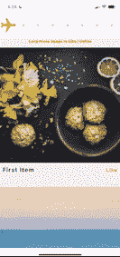
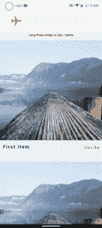
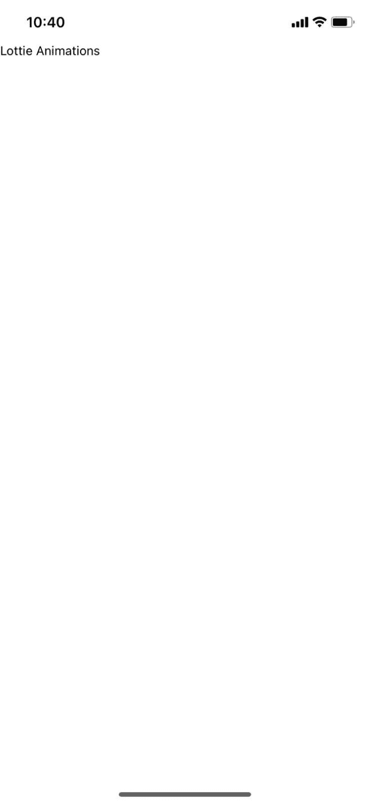
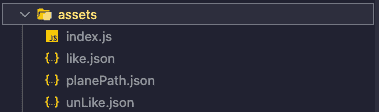
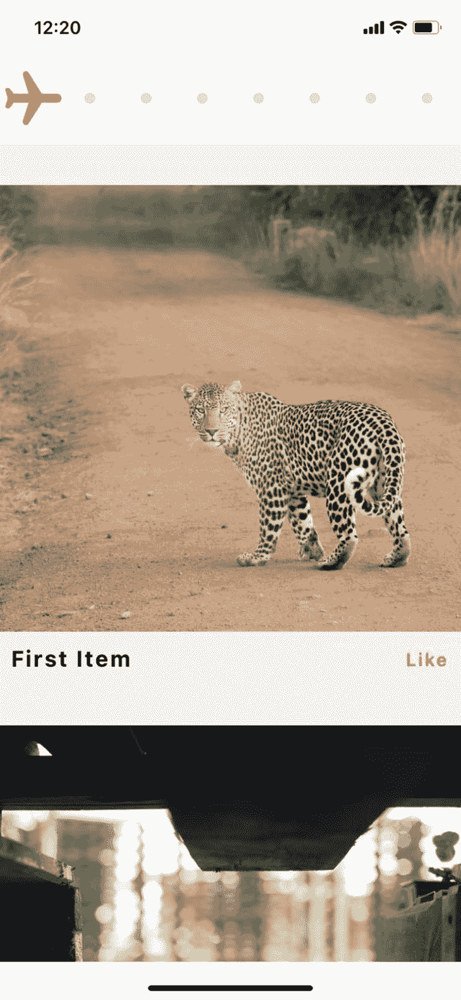

# 用 lottie-react-native 创作动画

> 原文：<https://blog.logrocket.com/creating-animations-lottie-react-native/>

## 洛蒂是什么？

Lottie 是一个开源的动画库，用于渲染基于 Lottie 的动画。基于 Lottie 的文件较小，但保留了它们的质量，并且可以进行交互。作为开发者，我们可以随时用代码操纵基于 Lottie 的动画。最成功和最著名的移动应用程序使用 Lottie 为其用户提供增强的视觉体验。

LottieFiles 最初是由 [Airbnb](https://medium.com/airbnb-engineering/introducing-lottie-4ff4a0afac0e) 推出的，用于无缝集成原生 iOS、Android 和 React 原生应用中的复杂动画。

从本质上来说，LottieFiles 是使用名为 [Bodymovin](https://aescripts.com/bodymovin/) 的扩展名从 [Adobe After Effects](https://www.adobe.com/in/products/aftereffects.html) 动画文件中直接导出的`JSON`文件。然后， [lottie-react-native](https://www.npmjs.com/package/lottie-react-native) 用于在 React Native 中本地渲染 lottie 动画。

## 在 React Native 中实现洛蒂动画

为了在我们的 React Native 项目中实现基于 Lottie 的动画，我们将使用 [lottie-react-native](https://www.npmjs.com/package/lottie-react-native) 库，它是原生 [iOS](https://github.com/airbnb/lottie-ios) 和 [Android](https://github.com/airbnb/lottie-android) 库的包装器。

我们还需要 LottieFiles，我们实际上希望在 UI 中以动画的形式显示它。

如果您有 After Effects 的经验，您可以创建自己的动画，并通过 Bodymovin 将其导出为 JSON 文件。

如果你是开发者，可以使用 [LottieFiles](https://lottiefiles.com/) 。他们有来自世界各地的人们已经创建的大量 Lottie 文件，所以你可以选择任何适合你的用例的动画。

## 洛蒂入门

我们将构建一个简单的 React 本地应用程序，它将有三个不同的动画:

*   一个随机图片列表。当我们向下滚动时，我们将在标题处看到一个滚动进度动画，它将根据列表的`scrollPosition`动态更新
*   当用户喜欢一张图片时的“喜欢”动画
*   当用户不喜欢图片时的“不喜欢”动画

用户界面如下所示:





> 您可以在这个[库](https://github.com/hrupesh/lottieAnimationsRN)中查看完整的代码。

我们开始吧！要创建新的 React 本地项目，请在终端窗口中键入以下内容:

```
react-native init LottieAnimations

```

我已经把这个项目命名为`LottieAnimations`。通过执行以下命令，您可以将终端中的当前工作目录更改为我们刚刚创建的项目:

```
cd <Your-Project-Name>

```

接下来，我们将在 iOS 项目中安装 Pods，方法是将`cwd`更改为`iOS`并执行以下命令:

```
cd iOS
pod install
cd ..

```

接下来，在 iOS 和 Android 上运行应用程序。如果使用纱线:

```
yarn ios
yarn android

```

如果您使用 npm:

```
npm run ios
npm run android

```

一旦应用程序在我们的设备上运行，您将看到默认的 React 本机样板代码。让我们删除`App.js`中的代码，并粘贴以下内容:

```
import React from 'react'
import { SafeAreaView, Text } from 'react-native'
const App = () => {
    return (
        <SafeAreaView>
            <Text>Lottie Animations</Text>
        </SafeAreaView>
    );
};
export default App;

```

现在，你应该会在屏幕上看到文字“洛蒂动画”。



现在，让我们给我们的应用程序添加一些样式。我们将样式保存在不同的文件中，以保持我们的`App.js`文件干净。在项目的根目录下创建一个`AppStyles.js`文件:

```
import {StyleSheet} from 'react-native';
export default StyleSheet.create({
  container: {
    flex: 1,
    backgroundColor: 'rgb(255, 255, 255)',
  },
  header: {
    height: 80,
    width: '100%',
    backgroundColor: 'rgb(255, 255, 255)',
    alignItems: 'stretch',
    justifyContent: 'center',
    zIndex: 1,
  },
});

```

这里，我们为`header`添加了一个样式对象，但是我们没有为它创建任何组件。让我们将`header`添加到我们的应用程序中。将这段代码添加到`SafeAreaView`组件内的`App.js`文件中:

```
      <StatusBar
        backgroundColor={'rgb(255, 255, 255)'}
        barStyle={'dark-content'}
      />
      <View style={styles.header}>
        {/* We will add Lottie Animation file here */}
      </View>

```

现在，让我们在`header`中添加动画。请注意，我们添加了一个`StatusBar`组件，我们将使用它来覆盖 Android 和 iOS 中的原生`StatusBar`的样式。

## 添加洛蒂动画反应原生

接下来，将 lottie-react-native 包安装到我们的项目中:

```
yarn add lottie-react-native [email protected]

```

> 注意:您需要根据您的 React Native 版本安装特定版本的`lottie-ios`，您可以在这里勾选[。](https://www.npmjs.com/package/lottie-react-native/v/5.0.1#:~:text=Versioning,the%20compatibility%20list%3A)

为 iOS 项目安装 pod。

```
cd ios
pod install

```

安装完成后，我们需要重新构建我们的应用程序，以便将库文件添加到原生 Android 中，并编译 iOS 项目。

```
yarn ios
yarn android

```

在我们从 lottie-react-native 添加`LottieView`组件之前，我们需要我们的资产或`JSON` Lottie 文件。如果你想添加一些其他洛蒂动画，你可以从[洛蒂文件](https://lottiefiles.com/)下载文件。为了节省你搜索动画的时间，你可以从[这里](https://github.com/hrupesh/lottieAnimationsRN/tree/main/assets)下载我在这个项目中使用的资源。

下载并保存在我们应用程序根目录下的`assets`文件夹中。现在，向该文件夹添加一个`index.js`文件，将资产导出到代码中。该目录将如下所示:



在`index.js`文件中添加以下代码:

```
const assets = {
  lottieFiles: {
    planePath: require('./planePath.json'),
    like: require('./like.json'),
    unLike: require('./unLike.json'),
  },
};
export default assets;

```

现在我们已经有了资产，我们可以在我们的 UI 上显示这些动画。

切换到`App.js`文件，导入`LottieView`组件，负责渲染洛蒂动画。

```
import LottieView from 'lottie-react-native';

```

然后将该组件添加到`header`:

```
  <View style={styles.header} >      
    <LottieView
      autoplay
      loop
      source={Assets.lottieFiles.planePath}
      colorFilters={[{keypath: 'Plane', color: 'rgb(255, 100, 0)'}]}
    />
  </View>

```

当您在设备上保存并运行应用程序时，您会看到动画自动在标题中运行。很酷吧。

请注意，我们使用`autoplay`和`loop`来让动画知道它应该在渲染后自动开始播放，并在完成后继续播放。

我们还使用了`colorFilters`道具，它可以用来改变动画文件中特定层的任何属性值。在我们的例子中，我们正在改变`Plane`的`color`。

这个组件为我们提供了一堆[有用的道具](https://github.com/lottie-react-native/lottie-react-native/blob/master/docs/api.md)。

## 创建滚动进度指示器动画

让我们创建一个动画，让用户知道他们在`ScrollView`中的位置。首先，向应用程序添加一个`List`。

创建一个名为`StaticData.js`的文件，并添加以下代码:

```
export const StaticData = [
  {key: 1, title: 'First Item', img: 'https://picsum.photos/800'},
  {key: 2, title: 'Second Item', img: 'https://picsum.photos/800'},
  {key: 3, title: 'Third Item', img: 'https://picsum.photos/800'},
  {key: 4, title: 'Fourth Item', img: 'https://picsum.photos/800'},
  {key: 5, title: 'Fifth Item', img: 'https://picsum.photos/800'},
  {key: 6, title: 'Sixth Item', img: 'https://picsum.photos/800'},
];

```

这将导出一个`StaticData`数组，我们将把它用作我们的`FlatList`的`DataSource`。

```
import { StaticData } from './StaticData';

```

现在，在`App.js`中添加`FlatList`以在 UI 上显示图像列表。

```
  <FlatList
    showsVerticalScrollIndicator={false}
    data={StaticData}
    keyExtractor={item => item?.key}
    renderItem={({item}) => <ImageCard data={item} />}
    contentContainerStyle={styles.list}
  />

```

注意，我们正在呈现一个在 UI 中显示图像的`ImageCard`组件，但是我们还没有创建这个组件。

在项目的根目录下创建一个`ImageCard.js`文件，并添加以下代码:

```
import LottieView from 'lottie-react-native';
import React, {useState} from 'react';
import {Image, Text, View} from 'react-native';
import styles from './AppStyles';
import Assets from './assets';

export const ImageCard = ({data}) => {
  const [isLiked, setIsLiked] = useState(false);

  return (
    <View
      key={data?.key}
      style={styles.item}
    >
      <Image
        source={{uri: data?.img}}
        resizeMode={'cover'}
        style={styles.itemImage}
      />
      <View style={styles.cardRow}>
        <Text style={styles.itemText}>{data?.title}</Text>
        <Text style={styles.likeText}>{isLiked ? 'UnLike' : 'Like'}</Text>
      </View>
    </View>
  );
};

```

这将显示一个图像，下面有一些数据。注意我们有`isLiked`状态，我们用它来表示喜欢和不喜欢的动画。

我们必须为这些新组件创建样式。将所有样式添加到我们的`AppStyles.js`后，它看起来会是这样的:

```
import {StyleSheet} from 'react-native';
export default StyleSheet.create({
  container: {
    flex: 1,
    backgroundColor: 'rgb(255, 255, 255)',
  },
  header: {
    height: 80,
    width: '100%',
    backgroundColor: 'rgb(255, 255, 255)',
    alignItems: 'stretch',
    justifyContent: 'center',
    zIndex: 1,
  },
  text: {
    fontSize: 30,
    color: '#fff',
  },
  list: {
    backgroundColor: 'rgb(240, 240, 240)',
    paddingVertical: 14,
  },
  item: {
    paddingVertical: 14,
    marginVertical: 10,
    zIndex: 1,
  },
  itemText: {
    color: 'rgb(0, 0, 0)',
    fontSize: 20,
    letterSpacing: 2,
    fontWeight: 'bold',
    paddingTop: 12,
  },
  likeText: {
    color: 'rgb(255, 100, 0)',
    fontWeight: '600',
    fontSize: 16,
    letterSpacing: 2,
  },
  itemImage: {
    height: 400,
    width: '100%',
  },
  cardRow: {
    flexDirection: 'row',
    justifyContent: 'space-between',
    alignItems: 'baseline',
    paddingHorizontal: 10,
  },
  infoText: {
    fontSize: 12,
    color: 'rgb(255, 100, 0)',
    fontWeight: '900',
    letterSpacing: 0.2,
    lineHeight: 12,
    textAlign: 'center',
    zIndex: 2,
    alignSelf: 'center',
    position: 'absolute',
    bottom: -24,
  },
  overlayLottie: {
    ...StyleSheet.absoluteFillObject,
    zIndex: 10,
    justifyContent: 'center',
    alignItems: 'center',
    backgroundColor: 'rgba(240, 240, 240, 0.4)',
  },
});

```

这些是我们将在这个项目中使用的所有样式，其用户界面如下所示:



让我们开始在头部动画我们的飞机！动画非常简单——我们只需要在用户滚动列表时改变我们的`LottieView`组件的`progress`属性。

我们将使用`FlatList`的`onScroll`事件，每次用户滚动列表时都会触发该事件。我们还会使用`scrollEventThrottle`，这样我们就不会错过任何来自`ScrollView` / `FlatList`的滚动事件。

进行这些更改后，`App.js`将如下所示:

```
import LottieView from 'lottie-react-native';
import React, {useRef} from 'react';
import {Animated, SafeAreaView, StatusBar, Text, View} from 'react-native';
import styles from './AppStyles';
import Assets from './assets';
import {ImageCard} from './ImageCard';
import {StaticData} from './StaticData';
const App = () => {
  const scrollPosition = useRef(new Animated.Value(0)).current;
  const handleScroll = ({nativeEvent}) => {
    const calculatedScrollPosition =
      nativeEvent.contentOffset.y /
      (nativeEvent.contentSize.height - nativeEvent.layoutMeasurement.height);
    scrollPosition.setValue(calculatedScrollPosition);
  };

  return (
    <SafeAreaView style={styles.container}>
      <StatusBar
        backgroundColor={'rgb(255, 255, 255)'}
        barStyle={'dark-content'}
      />
      <View style={styles.header}>
        <LottieView
          progress={scrollPosition.interpolate({
            inputRange: [0, 1],
            outputRange: [0, 1],
            extrapolate: 'clamp',
          })}
          source={Assets.lottieFiles.planePath}
          colorFilters={[{keypath: 'Plane', color: 'rgb(255, 100, 0)'}]}
        />
      </View>
      <FlatList
        bounces={false}
        showsVerticalScrollIndicator={false}
        scrollEventThrottle={1}
        onScroll={handleScroll}
        data={StaticData}
        keyExtractor={item => item?.key}
        renderItem={({item}) => <ImageCard data={item} />}
        contentContainerStyle={styles.list}
      />
    </SafeAreaView>
  );
};

export default App;

```

我们创建了以下内容:

*   `Animated`变量`scrollPosition`，它将跟踪用户在`ScrollView`中的位置
*   `handleScroll`方法，每次用户滚动列表时都会触发。它根据事件中接收的值计算用户的滚动位置，然后将该值设置为`scrollPosition`
*   我们的`LottieView`组件中的一个`progress`道具，使用了来自`0 to 1`的`scrollPosition`的`interpolated`值
*   我们已经在`FlatList`中将`bounces`设置为假，这样我们就不会在 iOS 中得到负的`scrollValues`

如果您保存并重新运行该应用程序，您将会看到当您滚动列表时，飞机会移动。

## 用 Lottie 创建喜欢和不喜欢的动画

让我们创造我们喜欢和不喜欢的动画。我们将使用的逻辑是这样的:当用户`longPresses`图片时，图片被喜欢。但是如果用户在喜欢该图像之后再次`longPresses`该图像，则该图像变得不喜欢。我们将为每个动作播放两秒钟的动画。

在`ImageCard.js`中修改之后，我们的文件看起来会是这样的:

```
import LottieView from 'lottie-react-native';
import React, {useRef, useState} from 'react';
import {Animated, Image, Pressable, Text, View} from 'react-native';
import styles from './AppStyles';
import Assets from './assets';
export const ImageCard = ({data}) => {
  const [isLiked, setIsLiked] = useState(false);
  const [processing, setProcessing] = useState(false);
  const animationProgress = useRef(new Animated.Value(0)).current;
  const showAnimation = () => {
    setProcessing(true);
    animationProgress.setValue(0);
    Animated.timing(animationProgress, {
      toValue: 1,
      duration: 2000,
      useNativeDriver: true,
    }).start(({finished}) => {
      if (finished) {
        setIsLiked(!isLiked);
        setProcessing(false);
      }
    });
  };
  return (
    <Pressable
      key={data?.key}
      style={styles.item}
      onLongPress={() => showAnimation()}>
      {processing && (
        <Animated.View
          style={[
            styles.overlayLottie,
            {
              opacity: animationProgress.interpolate({
                inputRange: [0, 0.1, 0.9, 1],
                outputRange: [0, 1, 1, 0],
                extrapolate: 'clamp',
              }),
            },
          ]}>
          <LottieView
            progress={animationProgress}
            source={
              isLiked ? Assets.lottieFiles.unLike : Assets.lottieFiles.like
            }
          />
        </Animated.View>
      )}
      <Image
        source={{uri: data?.img}}
        resizeMode={'cover'}
        style={styles.itemImage}
      />
      <View style={styles.cardRow}>
        <Text style={styles.itemText}>{data?.title}</Text>
        <Text style={styles.likeText}>{isLiked ? 'UnLike' : 'Like'}</Text>
      </View>
    </Pressable>
  );
};

```

我们来分析一下。我们添加了:

*   引入一个`processing`状态来确定是否有任何动画已经在进行中
*   `Animated` `animationProgress`处理`LottieView`的动画`progress`
*   `showAnimation`的方法是:
    *   将`processing`状态设置为 true，这样我们就知道动画正在进行中
    *   如果动画已经运行，将`animationProgress`重置为 0
    *   在`animationProgress`上开始 2 秒钟的动画，以及在 UI 线程上开始动画，这样 JS 线程不会被阻塞，用户可以继续滚动列表
    *   当动画结束时，我们切换`isLiked`状态并将`processing`标志设置为假

请注意，只有当动画正在进行中时，我们才会在图像上方的 UI 上显示动画覆盖图，并且我们已经将`LottieView`包裹在了`Animated.View`的周围。这是使用`animationProgress`的`interpolated`值作为`opacity`，以便覆盖容器在隐藏或显示时能够`fadeIn`和`fadeOut`。

最后，在我们实际的动画中，`LottieView`使用`animationProgress`作为动画的`progress`。我们根据`isLiked`状态改变动画文件的来源。例如，如果状态是`false`，即图像不被喜欢，那么我们显示喜欢的动画，反之亦然。

现在，如果你保存并重新运行应用程序，当你`longPress`图像时，你可以看到`Like`动画。如果你`longPress`同样的图像，你会看到`UnLike`的动画。

就是这样！我们已经学习了如何在 React Native 应用程序中使用 lottie-react-native 创建交互式动画。这个项目的完整代码可在[这里](https://github.com/hrupesh/lottieAnimationsRN)获得。

## 结论

基于 Lottie 的动画是网络和移动应用无缝精确动画的未来。当你想在应用程序中实现一个复杂的、高性能的、小尺寸的动画时，你应该使用它们。感谢阅读！

## [LogRocket](https://lp.logrocket.com/blg/react-native-signup) :即时重现 React 原生应用中的问题。

[](https://lp.logrocket.com/blg/react-native-signup)

[LogRocket](https://lp.logrocket.com/blg/react-native-signup) 是一款 React 原生监控解决方案，可帮助您即时重现问题、确定 bug 的优先级并了解 React 原生应用的性能。

LogRocket 还可以向你展示用户是如何与你的应用程序互动的，从而帮助你提高转化率和产品使用率。LogRocket 的产品分析功能揭示了用户不完成特定流程或不采用新功能的原因。

开始主动监控您的 React 原生应用— [免费试用 LogRocket】。](https://lp.logrocket.com/blg/react-native-signup)