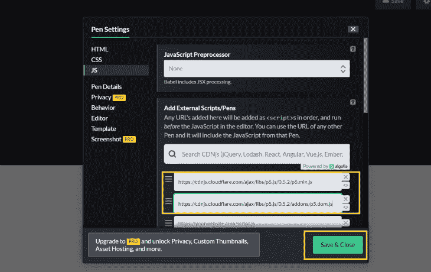

# 用 p5.js 创建动画

> 原文：<https://blog.logrocket.com/creating-animations-p5-js/>

P5.js 是一个 JavaScript 库，致力于让艺术家、设计师、教育工作者、初学者和其他任何人都可以访问和包含编码。它是免费和开源的，因为他们相信软件和学习软件的工具应该是每个人都可以使用的。

在这篇文章中，我们将回顾这个库，它的功能，并通过下面的部分提供一些如何使用它的例子:

## p5.js 是什么？

P5.js 基于 [Processing](https://processing.org/) ，这是一个由 Ben Fry 和 Casey Reas 创立的创意编码平台。Processing(以及基于过程的项目)的主要目标之一是让初学者尽可能容易地学习设计交互式的图形应用程序(同时为专业人员提供强大的工具)。

P5.js 是用 JavaScript 编写的，但最初是用 Processing 编写的。使用 JavaScript 编程语言的优势在于它的广泛可用性和对任何地方的支持。每个网络浏览器都有一个内置的 JavaScript 解释器，这意味着 p5.js 程序(通常)可以在任何网络浏览器中工作。

处理是视觉艺术的视觉编码工具。有趣的是，处理不仅仅是开发者的事，也是艺术家、设计师、研究人员和那些想要享受制作艺术的人的事。

如果你是 p5.js 的新手，你可以使用他们提供给我们的完美的在线编辑器，不需要任何设置。您还可以将 p5.js 与 HTML、CSS 和 JavaScript 代码一起使用。

如果想在 CodePen 中使用 p5.js，必须添加几样东西。在下一节中，我将指导您在 CodePen 中设置 p5.js。

## CodePen 中的 p5.js 入门

要在 CodePen 中测试 p5.js，首先点击页面右上角的**设置**按钮，调出设置菜单。



接下来，选择 **JS** 选项，并在**添加外部脚本/笔**部分添加链接。我们将向托管在内容交付网络上的库添加以下链接，以便将它们加载到我们的项目中:

```
https://cdnjs.cloudflare.com/ajax/libs/p5.js/0.5.2/p5.min.js

https://cdnjs.cloudflare.com/ajax/libs/p5.js/0.5.2/addons/p5.dom.js
```

`p5.min.js`是一个基本的 p5.js 库，`p5.dom.js`是一个额外的库，可以让你创建按钮和滑块。

添加链接后，点击**保存&关闭**。

## 使用 p5.js 有什么好处？

正如我们所知，p5.js 有一个丰富的图形库，这使得在画布上设计任何东西都很容易。还有很多好处，包括以下几点:

首先，p5.js 官方网站上的参考文档既全面又详尽，充分而全面地涵盖了关于框架许多方面的所有主题。

第二，开源编程语言社区通常乐于提供帮助并为某人指明正确的方向 p5.js 也不例外。如果你陷入困境，有一个强大的社区可以帮助你。

p5.js 的学习曲线相对容易——大多数人几天后就能设计出高度复杂的图形。

P5.js 教授除了创建视觉效果之外的其他概念，例如如何将其他电子设备连接到您的代码，在用户交互中加入声音效果，嵌入实时网络摄像头馈送等等。

最后，p5.js 提供了丰富的语音、声音、2D 和 3D 几何图形库。

## Processing 和 p5.js 有什么区别？

您可能认为处理与 p5.js 相同，但它们是不同的！

Processing 和 p5.js 都是 JavaScript 的版本，所以有些东西是相同的(比如`set()`和`draw()`函数)，但是有些东西(比如在嵌入式页面中工作)却非常不同。

对于处理，您需要用数据源声明一个画布区域，这将带您到一个 PDE(源代码)文件。P5.js 允许您直接向编辑器编写代码来执行。

P5.js 也有额外的库文件，例如，p5.dom.js 库允许您添加使用 p5.js 创建和操作 HTML 元素的选项。该库为您的画布提供了滑块、按钮、表单元素等更多内容。

* * *

### 更多来自 LogRocket 的精彩文章:

* * *

## 如何用 p5.js 制作动画

用 p5.js 可以制作很多动画，下面是几个你可以自己尝试的例子。

### 背景动画

> 没有描述

背景动画主要集中在画布上。通常，您可以将它作为网页上其他 web 元素的背景。

在这个例子中，我们制作了一个星形背景动画。在 sketch.js 中，我们为画布和星星创建了一个 **`setup()`** 函数。根据我们的鼠标悬停，一个`draw()`功能调整我们的背景恒星的速度。`Star.js`文件包含了函数`Star()`，它包含了我们的星星动画所需的属性。

旋转动画

### 添加外部样式表/笔此处添加的任何 URL 都将按顺序添加，并放在编辑器中的 CSS 之前。通过使用其 URL 和适当的 URL 扩展名，您可以使用另一个笔中的 CSS。JavaScript 预处理器巴贝尔包括 JSX 处理。

> Add External Stylesheets/Pens Any URLs added here will be added as s in order, and before the CSS in the editor. You can use the CSS from another Pen by using its URL and the proper URL extension. JavaScript Preprocessor Babel includes JSX processing.

旋转动画非常受欢迎，在 p5.js 中很容易制作。在上面的例子中，我们有形状函数，通过这些函数我们可以绘制其他形状。我们在这里使用`circle()`函数来画圆。对于旋转运动，我们在每个圆上使用`rotate()`功能。

3D 动画

### 添加外部样式表/笔此处添加的任何 URL 都将按顺序添加，并放在编辑器中的 CSS 之前。通过使用其 URL 和适当的 URL 扩展名，您可以使用另一个笔中的 CSS。JavaScript 预处理器巴贝尔包括 JSX 处理。

> Add External Stylesheets/Pens Any URLs added here will be added as s in order, and before the CSS in the editor. You can use the CSS from another Pen by using its URL and the proper URL extension. JavaScript Preprocessor Babel includes JSX processing.

P5.js 允许我们在三维平面中创建对象和动画。p5.js 最好的一点是它内置了创建基本 3D 对象的功能。

在上面的例子中，我们将一个 3D 物体精确地放置在一个开放的空间中。`box()`函数接受至少一个参数来指定立方体的大小。这些形状通过使用`translate()`功能来定位。我们在旋转运动的 3D 平面中对 X、Y 和 Z 轴形状使用`rotate()`功能。

正弦和余弦动画

### 添加外部样式表/笔此处添加的任何 URL 都将按顺序添加，并放在编辑器中的 CSS 之前。通过使用其 URL 和适当的 URL 扩展名，您可以使用另一个笔中的 CSS。JavaScript 预处理器巴贝尔包括 JSX 处理。

> Add External Stylesheets/Pens Any URLs added here will be added as s in order, and before the CSS in the editor. You can use the CSS from another Pen by using its URL and the proper URL extension. JavaScript Preprocessor Babel includes JSX processing.

对于这些动画，你不需要成为三角学大师。P5.js 提供了很少的三角函数，比如`acos()`、`asin()`、`atan()`、`atan2()`、`cos()`、`sin()`、`tan()`、`degrees()`、`radians()`、`angleMode()`。

这里，我们的例子由四个以波形运动的圆组成。`sin()`和`cos()`函数在我们的动画中引起运动。包括 0 到 2π之间的数字，返回-1 到 1 之间的数字。

使用函数的动画

### 参见 [CodePen](https://codepen.io) 上 Sharvari Raut([@ sharur 7](https://codepen.io/sharur7))
的 Pen [白鼠踪迹 p5.js](https://codepen.io/sharur7/pen/LYQxbBb) 。

See the Pen [white mouse trail p5.js](https://codepen.io/sharur7/pen/LYQxbBb) by Sharvari Raut ([@sharur7](https://codepen.io/sharur7))
on [CodePen](https://codepen.io).

数组访问操作符(方括号 `[]`内有一个整数)引用数组的索引。在这个例子中，它创建了一个 `p5.Vector`实例，然后调用它的`add()`函数。`push()`函数将一个元素添加到最后一个索引或数组的末尾。 `splice()`函数将一个索引作为参数，并从该索引中移除元素。`pop()`函数从数组末尾删除一个元素。 `unshift()`和`shift()`从数组的开始处添加和删除一个元素。

这段代码使用一组 `p5.Vector`实例来显示跟随鼠标的鼠标轨迹。每次调用`draw()`时，代码都会在数组末尾添加一个新的`p5.Vector`实例。然后代码使用 for 循环在鼠标轨迹中画出每个`p5.Vecto` r。

通过创建类制作动画

### [https://codepen.io/sharur7/pen/bGLgqYg](https://codepen.io/sharur7/pen/bGLgqYg)

对于类函数，定义一个类需要`class`关键字，然后给你的类起一个名字。在花括号`{}`中，写类的主体。主体由一个函数和一个您希望放在类中的构造函数组成。构造函数类似于函数，除了它有一个特殊的名字:`constructor`。

使用 new 关键字在`setup()`函数中创建一个新的圆形实例。`myCircle`变量现在指向一个包含变量`x = 150`、`y = 150`、`xSpeed = 1`和`ySpeed = 2`的圆形实例。

要在你的类中定义一个函数，给它一个名字，然后在括号`()`中列出所有的参数。`display()`函数画圆。`move()`功能处理圆圈的移动和弹跳。

使用颜色的动画

### 参见 [CodePen](https://codepen.io) 上 Sharvari Raut([@ sharur 7](https://codepen.io/sharur7))
的笔 [饱和条](https://codepen.io/sharur7/pen/GRQmZPm)。

See the Pen [Saturated Bars](https://codepen.io/sharur7/pen/GRQmZPm) by Sharvari Raut ([@sharur7](https://codepen.io/sharur7))
on [CodePen](https://codepen.io).

使用像`color()`、`colorMode()`和`fill()`这样的基本函数，我们可以在 p5.js 中创建图形。如果将光标垂直移动到每个条上，饱和度会改变。同样，你也可以对色调和灰度做同样的事情。

使用排版的动画

### 参见 [CodePen](https://codepen.io) 上的[笔
排版](https://codepen.io/sharur7/pen/MWQJvyv)by Sharvari Raut([@ sharur 7](https://codepen.io/sharur7))
。

See the Pen [typography](https://codepen.io/sharur7/pen/MWQJvyv) by Sharvari Raut ([@sharur7](https://codepen.io/sharur7))
on [CodePen](https://codepen.io).

在 p5.js 中，排版基本上与在 p5.js 中创建交互式文本图形是一样的。这些包括一些预定义的函数，这些函数对文本进行操作。利用这些功能，我们可以添加交互式文本动画。比如:`textToPoints()`和 `textFont()`这样的函数，用于文字修改，也可以用于创意动画。这里，在这个例子中，我们有 `text(int(angleRotate))`函数用于文本旋转。

结论

## 如果你是一名 web 开发人员，你会觉得使用 p5.js 很舒服，因为它是一个 JavaScript 库，你可以很容易地添加到你的项目中。它可以通过一些额外的库进行扩展，其中一些是 p5.js 内置的。除了 p5.js 默认提供的库，您可以通过探索其他库来获得大多数音频和语音、2D 和 3D 功能以及其他有用的工具。

您是否添加了新的 JS 库来提高性能或构建新特性？如果他们反其道而行之呢？

## 毫无疑问，前端变得越来越复杂。当您向应用程序添加新的 JavaScript 库和其他依赖项时，您将需要更多的可见性，以确保您的用户不会遇到未知的问题。

LogRocket 是一个前端应用程序监控解决方案，可以让您回放 JavaScript 错误，就像它们发生在您自己的浏览器中一样，这样您就可以更有效地对错误做出反应。

[LogRocket](https://lp.logrocket.com/blg/javascript-signup) 可以与任何应用程序完美配合，不管是什么框架，并且有插件可以记录来自 Redux、Vuex 和@ngrx/store 的额外上下文。您可以汇总并报告问题发生时应用程序的状态，而不是猜测问题发生的原因。LogRocket 还可以监控应用的性能，报告客户端 CPU 负载、客户端内存使用等指标。

[](https://lp.logrocket.com/blg/javascript-signup)[https://logrocket.com/signup/](https://lp.logrocket.com/blg/javascript-signup)

自信地构建— [开始免费监控](https://lp.logrocket.com/blg/javascript-signup)。

Build confidently — [Start monitoring for free](https://lp.logrocket.com/blg/javascript-signup).