# 使用 WebRTC - LogRocket 博客创建聊天应用程序

> 原文：<https://blog.logrocket.com/creating-chat-application-with-webrtc/>

***编者按:**本文于 2021 年 7 月进行了审查和更新，以确保在使用 WebRTC 构建聊天应用程序时信息准确和代码更新。*

## 什么是 WebRTC？

[WebRTC (Web 实时通信)](https://webrtc.org/)是一种规范，使 Web 浏览器、移动设备和本地客户端能够通过 API 交换视频、音频和一般信息。使用这种技术，通信通常是点对点的和直接的。

本质上，WebRTC 允许在硬件技术上轻松访问媒体设备。它的工作原理是通过[信令](https://developer.mozilla.org/en-US/docs/Web/API/WebRTC_API/Signaling_and_video_calling)实例化不同对等体之间的连接，然后实现或促进媒体数据的流式传输或交换。值得注意的是，这些技术是作为[开放网络标准/规范](https://www.w3.org/TR/webrtc/)实现的，并通过 JavaScript APIs 在所有主流浏览器中公开。

有几个库包装了浏览器的 WebRTC 实现，使 web 开发人员能够构建基于 WebRTC 的应用程序。它们包括 [simpleRTC](https://www.simplewebrtc.com/) 、 [peerJS](https://peerjs.com/) 、 [RTCMultiConnection](https://www.rtcmulticonnection.org/) 、 [webRTC.io、](https://github.com/webRTC-io/webRTC.io)等等。要了解这些库的具体实现，我们可以看看它们各自的文档。

在本文中，我们将学习如何使用 WebRTC 的浏览器实现来构建一个聊天应用程序。这是为了让我们了解 WebRTC 是如何工作的。

## 构建聊天应用时的常用术语

在我们继续之前，了解一些在 WebRTC 世界中使用的术语是很重要的。下面就让我们来探究其中的一些吧。

**信令:**确定对等体之间交换信息所需的通信协议、信道、媒体编解码器和格式、数据传输方法以及路由信息的过程。

**RTCPeerConnection:** 代表两个对等体之间的连接的接口，该接口监视连接的状态，并在数据交换后或不再需要连接时关闭连接。

**RTCDataChannel:** 构成网络隧道/通道的接口，可用于对等体之间的来回通信。一个数据通道与一个 RTCPeerConnection 相关联。

理论上，一个连接可以关联的最大通道数是 65，534(尽管这可能取决于浏览器)。

**STUN(NAT(网络地址转换器)会话遍历实用程序)服务器:**返回 NAT 后联网设备的 IP 地址、端口和连接状态。

**TURN(使用中继绕过 NAT)服务器:**一种协议，使设备能够从 NAT 或防火墙后面接收和发送数据。

**注意:**在某些情况下，如果对等体无法连接，TURN 服务器将用于在对等体之间传输数据。通常，TURN 服务器的运行成本很高，应该进行会话认证以防止未经授权的使用。

## 用 Node.js 构建信令服务器

在我们可以建立我们的聊天应用程序之前，我们需要一个信号服务器。我们将使用 Node.js 构建我们的服务器。我们的服务器将负责以下内容:

*   当新客户端连接时，保存已连接的`clientsNotifying`已连接客户端的列表
*   从一个客户端向另一个客户端发送连接提议
*   传输对连接提议的回答
*   客户端之间交换 [`IceCandidate`事件](https://developer.mozilla.org/en-US/docs/Web/API/RTCPeerConnection/icecandidate_event)
*   当客户端断开连接时通知用户

### 设置服务器

为我们的服务器创建以下文件夹结构:

```
signaling-server
├── README.md
├── .gitignore
└── index.js
```

或者，这可以通过终端以下列方式完成:

```
$ mkdir signaling-server
$ cd signaling-server
$ touch README.md index.js .gitignore
```

注意，我们可以在`README.md`文件中添加一个项目的描述。同样，我们应该确保将`node_modules`文件夹添加到`.gitignore`文件中，就像这样:

```
node_modules/
```

要生成没有提示的`package.json`文件，运行以下命令:

```
$ npm init -y
```

`package.json`文件的内容将如下所示:

```
{
  "name": "signaling-server",
  "version": "1.0.0",
  "description": "",
  "main": "index.js",
  "scripts": {
    "test": "echo \"Error: no test specified\" && exit 1"
  },
  "keywords": [],
  "author": "",
  "license": "ISC"
}
```

### 安装依赖项

所需的依赖项包括用于我们的服务器的`express`、用于 WebSocket 客户端-服务器连接的`ws`，以及用于生成随机标识符的`uuid`。要安装这些依赖项，我们可以运行下面的命令:

```
$ yarn add express uuid ws
```

现在，继续将以下代码添加到`index.js`文件中。

```
const express = require("express");
const WebSocket = require("ws");
const http = require("http");
const { v4: uuidv4 } = require('uuid');
const app = express();

const port = process.env.PORT || 9000;

//initialize a http server
const server = http.createServer(app);

//initialize the WebSocket server instance
const wss = new WebSocket.Server({ server });

wss.on("connection", ws => {
  ws.on("message", msg => {
    console.log("Received message: %s from client", msg);
  });
  //send immediate a feedback to the incoming connection
  ws.send(
    JSON.stringify({
      type: "connect",
      message: "Well hello there, I am a WebSocket server"
    })
  );
});

//start our server
server.listen(port, () => {
  console.log(`Signaling Server running on port: ${port}`);
});
```

这里，我们首先使用 Express 实例化一个简单的`http server`,然后在 Express 应用程序上添加一个 WebSocket 服务器。接下来，我们添加一个`connection`事件监听器，处理所有来自客户端的连接。

一旦客户端连接，我们会立即向他们发送一条消息，表明连接成功。我们还注册了一个`message`事件监听器来处理来自客户端的消息。为此，我们可以运行:

```
$ node index.js
```

注意，我们可以在项目的`package.json`文件的 scripts 标签中添加一个启动脚本。这将允许我们使用`yarn start`命令来运行我们的代码。

我们也可以使用 [wscat](https://www.npmjs.com/package/wscat) 工具或者[智能 WebSocket 客户端](https://chrome.google.com/webstore/detail/smart-websocket-client/omalebghpgejjiaoknljcfmglgbpocdp) chrome 扩展来测试你的服务器。如果安装了 wscat，启动服务器后，打开一个新的终端选项卡并运行:

```
$ wscat -c ws://localhost:9000
```

您应该看到以下内容:

```
[email protected] chatapp % ls
signaling-server
[email protected] chatapp % cd signaling-server 
[email protected] signaling-server % wscat -c ws://localhost:9000
Connected (press CTRL+C to quit)
< {"type":"connect","message":"Well hello there, I am a WebSocket server"} > 

```

### **用户连接**

因为我们最终将处理不同类型的消息，所以我们需要接受包含消息类型和其他相关数据的字符串化 JSON 消息。

因此，在继续之前，我们需要确保消息是有效的 JSON。将以下代码添加到`console.log`语句下的消息处理程序中:

```
ws.on("message", msg => {
    let data;
    //accepting only JSON messages
    try {
      data = JSON.parse(msg);
    } catch (e) {
      console.log("Invalid JSON");
      data = {};
    }
}
```

当用户连接时，我们需要给他们分配一个`id`，并确保他们选择的用户名没有被占用。还需要存储所有连接的用户。请注意，我们可以使用 Redis 来实现这一点。

让我们扩展一下消息处理程序。我们还将添加两个实用函数，用于向单个用户和除触发消息的用户之外的所有其他连接用户发送消息。

当用户登录时，我们将使用第一个实用函数发送回一个成功消息，显示所有已经连接的用户。我们还会通知所有连接的用户，有新用户登录了。

```
.....
//initialize the WebSocket server instance
const wss = new WebSocket.Server({ server });

// create an object to store users
let users = {};

// utility to send message to one user
const sendTo = (connection, message) => {
  connection.send(JSON.stringify(message));
};

// utility to send message to all users

const sendToAll = (clients, type, { id, name: userName }) => {
  Object.values(clients).forEach(client => {
    if (client.name !== userName) {
      client.send(
        JSON.stringify({
          type,
          user: { id, userName }
        })
      );
    }
  });
};

wss.on("connection", ws => {
  ws.on("message", msg => {
    let data;
    //accepting only JSON messages
    try {
      data = JSON.parse(msg);
    } catch (e) {
      console.log("Invalid JSON");
      data = {};
    }
    const { type, name } = data;
    //Handle message by type
    switch (type) {
      //when a user tries to login
      case "login":
        //Check if username is available
        if (users[name]) {
          sendTo(ws, {
            type: "login",
            success: false,
            message: "Username is unavailable"
          });
        } else {
          const id = uuidv4();
          const loggedIn = Object.values(
            users
          ).map(({ id, name: userName }) => ({ id, userName }));
          users[name] = ws;
          ws.name = name;
          ws.id = id;
          sendTo(ws, {
            type: "login",
            success: true,
            users: loggedIn
          });
          sendToAll(users, "updateUsers", ws);
        }
        break;
      default:
        sendTo(ws, {
          type: "error",
          message: "Command not found: " + type
        });
        break;
    }

  });
  //send immediate a feedback to the incoming connection
  ws.send(
    JSON.stringify({
      type: "connect",
      message: "Well hello there, I am a WebSocket server"
    })
  );
});
```

让我们尝试登录一个新用户，然后尝试使用相同的用户名登录，并提供一个未知的消息类型，看看会发生什么。注意，我们需要用`node index.js`命令启动服务器，还需要用 wscat 实用程序启动 ws connection 服务器实例。

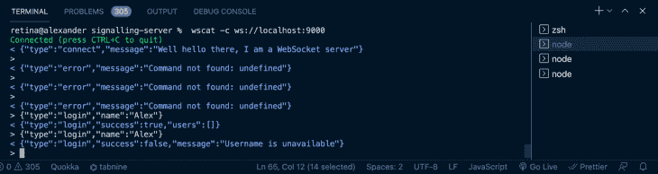

Login type event sent and detected by the server.

提出连接提议

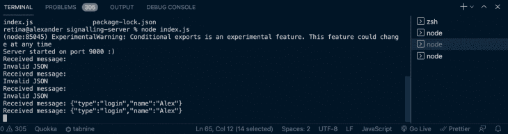

Login message received on the running server.

### 一旦用户成功连接，我们将希望与另一个用户建立连接。为此，我们需要向另一个用户发送连接提议。

一旦服务器收到要约消息，它需要在发送要约之前确认用户是否存在。

让我们为报价消息类型添加一个案例:

回答连接提议

```
ws.on("message", msg => {
  ....
  const { type, name, offer } = data;
  //Handle message by type
  switch (type) {
    ....
    case "offer":
      //Check if user to send offer to exists
      const offerRecipient = users[name];
      if (!!offerRecipient) {
        sendTo(offerRecipient, {
          type: "offer",
          offer,
          name: ws.name
        });
      } else {
        sendTo(ws, {
          type: "error",
          message: `User ${name} does not exist!`
        });
      }
      break;
    ...
  }
}
```

### 一旦客户端收到连接提议，他们将向提议创建者发送回复。服务器确保传递答案。当我们构建前端时，提供和回答过程将变得更加清晰。现在，让我们更新 switch 语句以包含此类型:

我们现在可以使用两个连接的用户来测试报价和答案交换，如下所示:

```
ws.on("message", msg => {
  ....
  const { type, name, offer, answer } = data;
  //Handle message by type
  switch (type) {
    ....
    case "answer":
      //Check if user to send answer to exists
      const answerRecipient = users[name];
      if (!!answerRecipient) {
        sendTo(answerRecipient, {
          type: "answer",
          answer,
        });
      } else {
        sendTo(ws, {
          type: "error",
          message: `User ${name} does not exist!`
        });
      }
      break;
    ...
  }
}
```

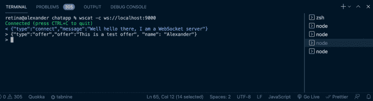

Offer event type sent to the client.

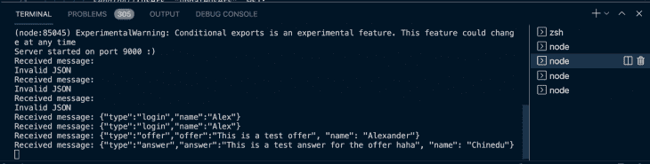

Both offer and answer event types are received by the server.

处理`IceCandidates`

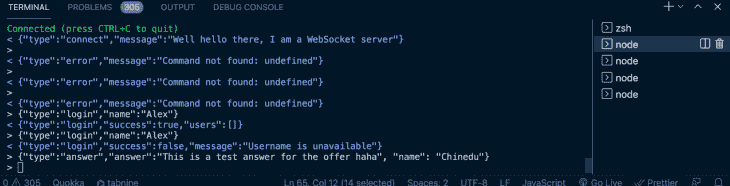

Answer event type sent to the other client.

### 一旦回答和提供过程完成，用户将开始互相发送`IceCandidates`，直到他们就最佳连接方式达成一致。

与大多数其他消息一样，服务器将只充当在用户之间传递消息的中介。现在，让我们更新 switch 语句以包含这种类型。

处理用户离开

```
ws.on("message", msg => {
  ....
  const { type, name, offer, answer, candidate} = data;
  //Handle message by type
  switch (type) {
    ....
    case "candidate":
      //Check if user to send candidate to exists
      const candidateRecipient = users[name];
      if (!!candidateRecipient) {
        sendTo(candidateRecipient, {
          type: "candidate",
          candidate
        });
      } else {
        sendTo(ws, {
          type: "error",
          message: `User ${name} does not exist!`
        });
      }
      break;
    ...
  }
}
```

### 当一个用户离开时，我们应该通知所有其他连接的用户该用户已经离开。

当连接断开时，我们还应该通知其他用户。

```
ws.on("message", msg => {
  ....
  //Handle message by type
  switch (type) {
    ....
    case "leave":
      sendToAll(users, "leave", ws);
      break;
    ...
  }
}
```

以下是我们完整的信令服务器的完整代码:

```
wss.on("connection", ws => {
  ...
  ws.on("close", function() {
      delete users[ws.name];
      sendToAll(users, "leave", ws);
    }
  });
  ...
}
```

信令服务器就绪后，我们现在可以开始构建聊天应用程序了。更多细节，我们可以参考位于[这里](https://github.com/jkithome/signalling-server/blob/master/index.js)的`index.js`文件。

```
const express = require("express");
const WebSocket = require("ws");
const http = require("http");
const uuidv4 = require("uuid/v4");

const app = express();

const port = process.env.PORT || 9000;

//initialize a http server
const server = http.createServer(app);

//initialize the WebSocket server instance
const wss = new WebSocket.Server({ server });

let users = {};

const sendTo = (connection, message) => {
  connection.send(JSON.stringify(message));
};

const sendToAll = (clients, type, { id, name: userName }) => {
  Object.values(clients).forEach(client => {
    if (client.name !== userName) {
      client.send(
        JSON.stringify({
          type,
          user: { id, userName }
        })
      );
    }
  });
};

wss.on("connection", ws => {
  ws.on("message", msg => {
    let data;
    //accept only JSON messages
    try {
      data = JSON.parse(msg);
    } catch (e) {
      console.log("Invalid JSON");
      data = {};
    }
    const { type, name, offer, answer, candidate } = data;
    switch (type) {
      //when a user tries to login
      case "login":
        //Check if username is available
        if (users[name]) {
          sendTo(ws, {
            type: "login",
            success: false,
            message: "Username is unavailable"
          });
        } else {
          const id = uuidv4();
          const loggedIn = Object.values(
            users
          ).map(({ id, name: userName }) => ({ id, userName }));
          users[name] = ws;
          ws.name = name;
          ws.id = id;
          sendTo(ws, {
            type: "login",
            success: true,
            users: loggedIn
          });
          sendToAll(users, "updateUsers", ws);
        }
        break;
      case "offer":
        //Check if user to send offer to exists
        const offerRecipient = users[name];
        if (!!offerRecipient) {
          sendTo(offerRecipient, {
            type: "offer",
            offer,
            name: ws.name
          });
        } else {
          sendTo(ws, {
            type: "error",
            message: `User ${name} does not exist!`
          });
        }
        break;
      case "answer":
        //Check if user to send answer to exists
        const answerRecipient = users[name];
        if (!!answerRecipient) {
          sendTo(answerRecipient, {
            type: "answer",
            answer,
          });
        } else {
          sendTo(ws, {
            type: "error",
            message: `User ${name} does not exist!`
          });
        }
        break;
      case "candidate":
        const candidateRecipient = users[name];
        if (!!candidateRecipient) {
          sendTo(candidateRecipient, {
            type: "candidate",
            candidate
          });
        }
        break;
      case "leave":
        sendToAll(users, "leave", ws);
        break;
      default:
        sendTo(ws, {
          type: "error",
          message: "Command not found: " + type
        });
        break;
    }
  });
  ws.on("close", function() {
    delete users[ws.name];
    sendToAll(users, "leave", ws);
  });
  //send immediately a feedback to the incoming connection
  ws.send(
    JSON.stringify({
      type: "connect",
      message: "Well hello there, I am a WebSocket server"
    })
  );
});
//start our server
server.listen(port, () => {
  console.log(`Signaling Server running on port: ${port}`);
});
```

构建客户端聊天应用程序

## 设置

### 我们的应用程序的文件夹结构如下所示:

大多数文件将在我们启动应用程序时创建。您可以使用以下任何命令引导项目:

```
simple-webrtc-chat-app
├── public
│   ├── index.html
│   ├── manifest.json
├── src
│   ├── App.js
│   ├── index.js
│   ├── Container.js
│   ├── Chat.js
│   ├── MessageBox.js
│   ├── UserList.js
├── .gitignore
├── README.md
└── package.json
```

**npx:**

**npm** `*npm init <initializer>*` *在 npm 6+ ) :*

```
$ npx create-react-app simple-webrtc-chat-app
```

**纱** `*[yarn create <starter-kit-package](https://yarnpkg.com/lang/en/docs/cli/create/)>*` *有纱 0.25+* ):

```
$ npm init react-app simple-webrtc-chat-app
```

创建完项目文件夹后，您可以打开并运行它:

```
$ yarn create react-app simple-webrtc-chat-app
```

这将在开发模式下运行应用程序。您可以使用链接[在浏览器中查看 http://localhost:3000/](http://localhost:3000/) 。此外，确保通过运行`npm install`或`yarn add`安装所需的依赖项。

```
cd simple-webrtc-chat-app
npm start //or
yarn start
```

安装附加依赖项

### 我们将需要几个库来帮助我们构建我们的聊天应用程序:[语义 UI React](https://react.semantic-ui.com/) 用于样式化， [date-fns](https://date-fns.org/) 用于操作日期，[React-bootstrap-sweet alert](http://djorg83.github.io/react-bootstrap-sweetalert/)用于显示成功和错误消息。

要安装它们，请运行以下命令:

为了主题化语义 UI 组件，我们需要语义 UI 样式表。最快的开始方式是使用 CDN。只需将此链接添加到公共文件夹中您的`index.html`文件的`<head>`:

```
$ yarn add date-fns semantic-ui-react react-bootstrap-sweetalert
```

组件设置

```
<link rel="stylesheet" href="//cdn.jsdelivr.net/npm/[email protected]/dist/semantic.min.css" />
```

### 我们的聊天应用程序有五个组成部分:

`App`组件，它将是应用程序的主要组件

*   将订阅[上下文](https://reactjs.org/docs/context.html)变化的`Container`组件
*   组件将创建一个到服务器的 WebSocket 连接，监听和处理消息，并与其他用户建立连接
*   `UserList`组件将列出当前在线的所有用户，即连接到信令服务器并且用户可以尝试连接的用户
*   `MessageBox`组件将显示连接的对等体之间的消息线程
*   `App`组件

```
# Navigate to source directory
$ cd src/
#Create new files
$ touch Container.js Chat.js UserList.js MessageBox.js
```

### 我们将创建上下文来保存用户之间的对等连接和用于信息交换的数据通道。每个上下文都有一个传递下来的函数，允许消费者更新上下文。

我们将为连接和通道呈现`Provider React`组件，并从 state 向它们传递一个值，该值一开始将为 null。

将以下代码添加到您的`App.js`文件中:

`Container`组件

```
```
import React, { useState, createContext } from "react";
import Container from "./Container";
const ConnectionContext = createContext({
  connection: null,
  updateConnection: () => {}
});
const ChannelContext = createContext({
  channel: null,
  updateChannel: () => {}
});
const App = () => {
  const [connection, setconnection] = useState(null);
  const [channel, setChannel] = useState(null);
  const updateConnection = conn => {
    setconnection(conn);
  };
  const updateChannel = chn => {
    setChannel(chn);
  };
  return ( 
  );
};
export const ConnectionConsumer = ConnectionContext.Consumer
export const ChannelConsumer = ChannelContext.Consumer
export default App;

```

```

### 为了让嵌套组件可以使用连接和通道作为道具，我们使用了`Context.Consumer`。这是一个订阅上下文变化的组件。

```
import React from "react";
import Chat from "./Chat";
import { ConnectionConsumer, ChannelConsumer} from "./App";
const Container = () => {
  return (
    <ConnectionConsumer>
      {({ connection, updateConnection }) => (
        <ChannelConsumer>
          {({ channel, updateChannel }) => (
            <Chat
              connection={connection}
              updateConnection={updateConnection}
              channel={channel}
              updateChannel={updateChannel}
            />
          )}
        </ChannelConsumer>
      )}
    </ConnectionConsumer>
  );
};
export default Container
```

您会注意到，我们为`App.js`中的连接和通道上下文导出了`Consumers`。我们将在`Container`组件中使用这些出口产品。

我们还将在这个组件中呈现`Chat`组件。

`Chat`组件

### 当组件第一次渲染时，我们使用`useEffect`创建一个 WebSocket 连接，并将其存储在一个`Ref`中。使用服务器 URL 创建连接。注意 URL 开头的`ws`。

如果您使用的是安全 URL，这将是`wss`。该连接将侦听消息并关闭事件。收到的消息将被添加到待处理状态。

组件的初始代码应该如下所示:

如果还没有与服务器建立连接，我们将显示一个加载程序。

```
import React, { Fragment, useState, useEffect, useRef } from "react";
import {
  Header,
  Loader
} from "semantic-ui-react";

const Chat = ({ connection, updateConnection, channel, updateChannel }) => {
  const webSocket = useRef(null);
  const [socketOpen, setSocketOpen] = useState(false);
  const [socketMessages, setSocketMessages] = useState([]);
  const [alert, setAlert] = useState(null);

  useEffect(() => {
// add the websocket url to env in production environment     
     webSocket.current = new WebSocket("ws://localhost:9000");
    webSocket.current.onmessage = message => {
      const data = JSON.parse(message.data);
      setSocketMessages(prev => [...prev, data]);
    };
    webSocket.current.onclose = () => {
      webSocket.current.close();
    };
    return () => webSocket.current.close();
  }, []);
  return (
    <div className="App">
      {alert}
      <Header as="h2" icon>
        <Icon name="users" />
        Simple WebRTC Chap App
      </Header>
      {(socketOpen && (
        <Fragment>
        </Fragment>
      )) || (
        <Loader size="massive" active inline="centered">
          Loading
        </Loader>
      )}
    </div>
  );
};
export default Chat;
```

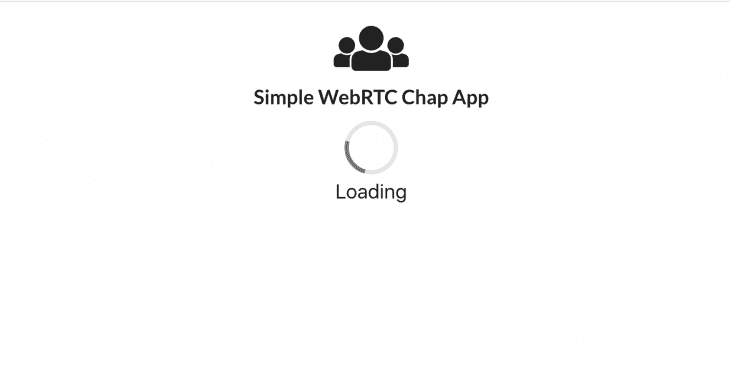

用户应该能够向服务器发送消息。下面的组件函数将使他们能够做到这一点。

为了处理我们从信令服务器收到的消息，我们将使用一个`useEffect`，每当`socketMessages`改变时，它将被触发。它将获取最后一条消息并进行处理。

```
const send = data => {
  webSocket.current.send(JSON.stringify(data));
};
```

当我们收到来自服务器的连接消息时，我们将更新`socketOpen`变量，以便呈现其他内容。还将处理登录、`updateUsers`、`removeUser`、提议、回答和候选人类型的消息。

```
useEffect(() => {
    let data = socketMessages.pop();
    if (data) {
      switch (data.type) {
        case "connect":
          setSocketOpen(true);
          break;
        default:
          break;
      }
    }
  }, [socketMessages]);
```

每条消息将调用各自的处理程序。我们将在后面定义处理程序。完整的`useEffect`应该是这样的:

用户登录

```
useEffect(() => {
    let data = socketMessages.pop();
    if (data) {
      switch (data.type) {
        case "connect":
          setSocketOpen(true);
          break;
        case "login":
          onLogin(data);
          break;
        case "updateUsers":
          updateUsersList(data);
          break;
        case "removeUser":
          removeUser(data);
          break;
        case "offer":
          onOffer(data);
          break;
        case "answer":
          onAnswer(data);
          break;
        case "candidate":
          onCandidate(data);
          break;
        default:
          break;
      }
    }
  }, [socketMessages]);
```

### 一旦与服务器建立了连接，我们将通过一个按钮呈现一个输入，允许用户输入他们的用户名和登录。

点击`handleLogin`功能，将使用用户选择的用户名向服务器发送登录消息。一旦用户成功登录，我们将显示他们的登录状态，而不是用户名输入。

如果他们的用户名已经被占用，我们会向他们显示一个提示。现在，我们可以将以下代码添加到`Chat component`中:

我们还需要为来自服务器的登录消息添加一个处理程序。

```
...
import {
  ...
  Icon,
  Input,
  Grid,
  Segment,
  Button,
} from "semantic-ui-react";

const Chat = ({ connection, updateConnection, channel, updateChannel }) => {
  ....
  const [isLoggedIn, setIsLoggedIn] = useState(false);
  const [name, setName] = useState("");
  const [loggingIn, setLoggingIn] = useState(false);

  ...
  const handleLogin = () => {
    setLoggingIn(true);
    send({
      type: "login",
      name
    });
  };

  return (
    <div className="App">
      ....
      {(socketOpen && (
        <Fragment>
          <Grid centered columns={4}>
            <Grid.Column>
              {(!isLoggedIn && (
                <Input
                  fluid
                  disabled={loggingIn}
                  type="text"
                  onChange={e => setName(e.target.value)}
                  placeholder="Username..."
                  action
                >
                  <input />
                  <Button
                    color="teal"
                    disabled={!name || loggingIn}
                    onClick={handleLogin}
                  >
                    <Icon name="sign-in" />
                    Login
                  </Button>
                </Input>
              )) || (
                <Segment raised textAlign="center" color="olive">
                  Logged In as: {name}
                </Segment>
              )}
            </Grid.Column>
          </Grid>
        </Fragment>
      )) || (
        ...
      )}
    </div>
  );
};
export default Chat;
```

```
const Chat = ({ connection, updateConnection, channel, updateChannel }) => {
  ...  
  const [users, setUsers] = useState([]);
  ...
  const onLogin = ({ success, message, users: loggedIn }) => {
      setLoggingIn(false);
      if (success) {
        setAlert(
          <SweetAlert
            success
            title="Success!"
            onConfirm={closeAlert}
            onCancel={closeAlert}
          >
            Logged in successfully!
          </SweetAlert>
        );
        setIsLoggedIn(true);
        setUsers(loggedIn);
      } else {
        setAlert(
          <SweetAlert
            warning
            confirmBtnBsStyle="danger"
            title="Failed"
            onConfirm={closeAlert}
            onCancel={closeAlert}
          >
            {message}
          </SweetAlert>
        );
      }
    };
    ...
}
```

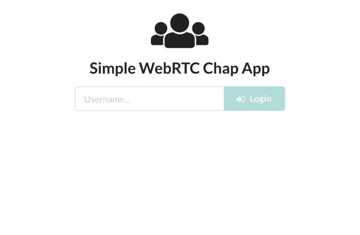

The login input.

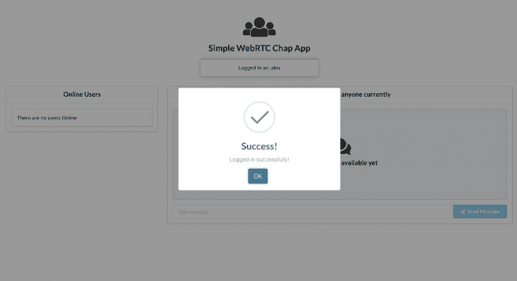

Login success.

如您所见，登录响应有一个包含当前登录用户的字段，我们将该字段分配给 state users 变量。

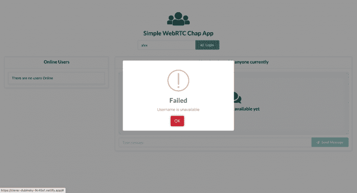

Already taken username login failure.

我们需要添加一个侧栏，列出所有在线用户。在我们继续其余的`Chat`组件之前，让我们先来看看`UsersList`组件。

`UsersList`组件

### 该组件将列出当前在线的所有用户。

每个列表将显示一个已连接用户的用户名和一个按钮，供我们的用户启动与另一个用户的连接过程。

如果用户已经连接到另一个用户，按钮文本将变为`Disconnect`，所有其他按钮将被禁用，以防止用户建立另一个连接，直到他们关闭当前连接。

如果用户正在连接到另一个对等方，则每个用户的连接按钮也将被禁用。该组件将从`Chat`组件接收用户、`toggleConnection`、`connectedTo`和`connecting`道具。

将以下代码添加到`src/UsersList.js`:

现在我们有了`UsersList`组件，我们需要将它导入到`Chat`组件中并呈现它。

```
import React from "react";
import {
  Grid,
  Segment,
  Card,
  List,
  Button,
  Image,
} from "semantic-ui-react";
import avatar from "./avatar.png";
const UsersList = ({ users, toggleConnection, connectedTo, connecting }) => {
  return (
    <Grid.Column width={5}>
      <Card fluid>
        <Card.Content header="Online Users" />
        <Card.Content textAlign="left">
          {(users.length && (
            <List divided verticalAlign="middle" size="large">
              {users.map(({ userName }) => (
                <List.Item key={userName}>
                  <List.Content floated="right">
                    <Button
                      onClick={() => {
                        toggleConnection(userName);
                      }}
                      disabled={!!connectedTo && connectedTo !== userName}
                      loading={connectedTo === userName && connecting}
                    >
                      {connectedTo === userName ? "Disconnect" : "Connect"}
                    </Button>
                  </List.Content>
                  <Image avatar src={avatar} />
                  <List.Content>
                    <List.Header>{userName}</List.Header>
                  </List.Content>
                </List.Item>
              ))}
            </List>
          )) || <Segment>There are no users Online</Segment>}
        </Card.Content>
      </Card>
    </Grid.Column>
  );
};
export default UsersList;
```

```
...
import UsersList from "./UsersList";

const Chat = ({ connection, updateConnection, channel, updateChannel }) => {
  ....
  const [connectedTo, setConnectedTo] = useState("");
  const connectedRef = useRef();
  const [connecting, setConnecting] = useState(false);

  ...
  const toggleConnection = userName => {
    if (connectedRef.current === userName) {
      setConnecting(true);
      setConnectedTo("");
      connectedRef.current = "";
      setConnecting(false);
    } else {
      setConnecting(true);
      setConnectedTo(userName);
      connectedRef.current = userName;
      // To be discussed later
      handleConnection(userName);
      setConnecting(false);
    }

  return (
    <div className="App">
      ....
      {(socketOpen && (
        <Fragment>
          ...
          <Grid>
            <UsersList
              users={users}
              toggleConnection={toggleConnection}
              connectedTo={connectedTo}
              connection={connecting}
            />
          </Grid>
        </Fragment>
      )) || (
        ...
      )}
    </div>
  );
};

```

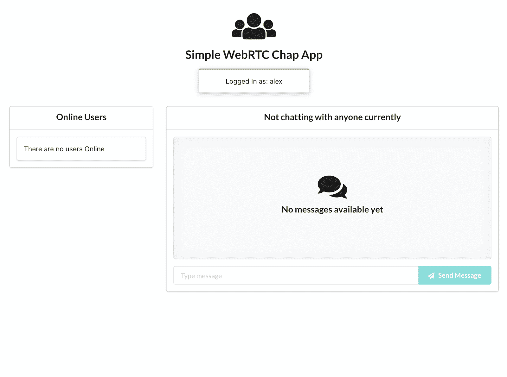

No other user online.

为聊天应用程序创建连接

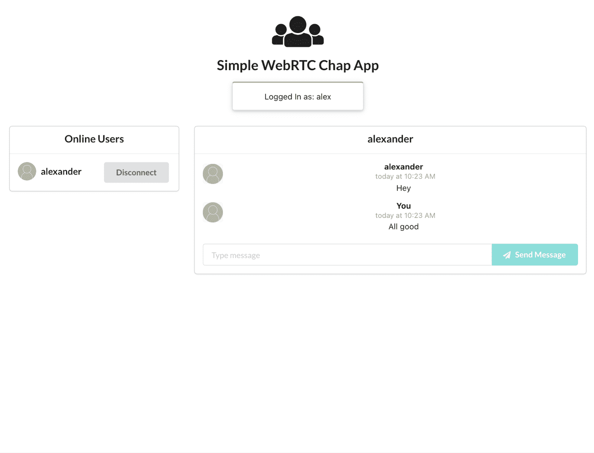

Showing online users.

## 成功登录后，我们应该创建一个新的 RTCPeerConnection，使用户能够与其他用户连接。

让我们添加一些代码来创建对等连接。

登录成功后，我们将创建一个新的 RTCPeerConnection。RTCPeerConnection 构造函数采用包含 STUN 和 TURN 服务器的配置。

在我们的例子中，我们将只使用 Google 的公共 STUN 服务器。我们将添加一个`oniceCandidate`处理程序，它将所有找到的 Icecandates 发送给其他用户。

另一个必须添加的处理程序是`ondatachannel`处理程序。当远程对等体通过调用`createDataChannel()`向连接添加数据通道时，将会触发此操作。

一旦创建了连接，我们将调用 context prop 方法`updateConnection`来用创建的通道更新上下文。

当触发`ondatachannel`处理程序时，我们添加一个`onmessage`处理程序，然后使用`updateChannel`将通道存储在上下文中。

该方法由接受连接请求的远程对等方触发。

发起连接的对等方创建自己的数据通道。修改`onLogin`方法，如下所示:

处理数据通道消息

```
const configuration = {
  iceServers: [{ url: "stun:stun.1.google.com:19302" }]
};

const Chat = ({ connection, updateConnection, channel, updateChannel }) => {
  ....
  const onLogin = ({ success, message, users: loggedIn }) => {
      setLoggingIn(false);
      if (success) {
        setAlert(
          <SweetAlert
            success
            title="Success!"
            onConfirm={closeAlert}
            onCancel={closeAlert}
          >
            Logged in successfully!
          </SweetAlert>
        );
        setIsLoggedIn(true);
        setUsers(loggedIn);
        let localConnection = new RTCPeerConnection(configuration);
        //when the browser finds an ice candidate we send it to another peer
        localConnection.onicecandidate = ({ candidate }) => {
          let connectedTo = connectedRef.current;
          if (candidate && !!connectedTo) {
            send({
              name: connectedTo,
              type: "candidate",
              candidate
            });
          }
        };
        localConnection.ondatachannel = event => {
          let receiveChannel = event.channel;
          receiveChannel.onopen = () => {
            console.log("Data channel is open and ready to be used.");
          };
          receiveChannel.onmessage = handleDataChannelMessageReceived;
          updateChannel(receiveChannel);
        };
        updateConnection(localConnection);
      } else {
        setAlert(
          <SweetAlert
            warning
            confirmBtnBsStyle="danger"
            title="Failed"
            onConfirm={closeAlert}
            onCancel={closeAlert}
          >
            {message}
          </SweetAlert>
        );
      }
  }
  ...
}
```

### 一旦数据通道打开，对等体就可以互相发送消息。

这些消息需要在接收时进行处理。

因为我们已经为`onmessage`事件分配了一个处理程序(当对等体收到消息时触发)，所以让我们看看它将做什么:

当收到消息时，我们首先检索现有的消息，然后再添加新消息。

```
const configuration = {
  iceServers: [{ url: "stun:stun.1.google.com:19302" }]
};

const Chat = ({ connection, updateConnection, channel, updateChannel }) => {
  ....
  const onLogin = ({ success, message, users: loggedIn }) => {
      setLoggingIn(false);
      if (success) {
        setAlert(
          <SweetAlert
            success
            title="Success!"
            onConfirm={closeAlert}
            onCancel={closeAlert}
          >
            Logged in successfully!
          </SweetAlert>
        );
        setIsLoggedIn(true);
        setUsers(loggedIn);
        let localConnection = new RTCPeerConnection(configuration);
        //when the browser finds an ice candidate we send it to another peer
        localConnection.onicecandidate = ({ candidate }) => {
          let connectedTo = connectedRef.current;
          if (candidate && !!connectedTo) {
            send({
              name: connectedTo,
              type: "candidate",
              candidate
            });
          }
        };
        localConnection.ondatachannel = event => {
          let receiveChannel = event.channel;
          receiveChannel.onopen = () => {
            console.log("Data channel is open and ready to be used.");
          };
          receiveChannel.onmessage = handleDataChannelMessageReceived;
          updateChannel(receiveChannel);
        };
        updateConnection(localConnection);
      } else {
        setAlert(
          <SweetAlert
            warning
            confirmBtnBsStyle="danger"
            title="Failed"
            onConfirm={closeAlert}
            onCancel={closeAlert}
          >
            {message}
          </SweetAlert>
        );
      }
  }
  ...
}
```

我们使用`messagesRef`和 messages 变量是因为组件方法是在功能组件中创建的:这些方法中的构造函数只能访问它们创建时的状态值。

我们使用 Ref 来确保我们检索的是最新的消息。然后，我们将更新后的消息存储在 messages 中，并使用它来呈现消息线程。

每封邮件都包含发件人。我们使用 sender 作为字段名来保存本地对等体和发送方之间的消息。

开始谈判

### 之前，在创建`UsersList`组件时，我们使用了`toggleConnection`函数来更新本地对等体想要连接的用户的状态。

我们将更进一步，在用户试图与另一个用户连接时调用一个`handleConnection`方法。

`handleConnection`方法将在本地对等连接上创建一个数据通道，然后向远程对等连接发送一个提议。

首先，我们需要更新`toggleConnection`方法来调用`handleConnection`方法:

要创建一个数据通道，您可以用通道的名称调用对等连接`createDataChannel`方法。

```
const toggleConnection = userName => {
  if (connectedRef.current === userName) {
    setConnecting(true);
    setConnectedTo("");
    connectedRef.current = "";
    setConnecting(false);
  } else {
    setConnecting(true);
    setConnectedTo(userName);
    connectedRef.current = userName;
    handleConnection(userName);
    setConnecting(false);
  }
};
```

我们添加了一个`onmessage`处理程序，就像我们为远程对等体创建的通道所做的那样。然后，我们用创建的通道更新上下文。

创建渠道后，是时候创建报价了。这是使用 RTCPeerConnection 接口的`createOffer`方法完成的。

```
const handleConnection = name => {
  let dataChannel = connection.createDataChannel("messenger");
  dataChannel.onerror = error => {
    setAlert(
      <SweetAlert
        warning
        confirmBtnBsStyle="danger"
        title="Failed"
        onConfirm={closeAlert}
        onCancel={closeAlert}
      >
        An error has occurred.
      </SweetAlert>
    );
  };
  dataChannel.onmessage = handleDataChannelMessageReceived;
  updateChannel(dataChannel);
};
```

`createOffer`方法启动 SDP( *会话描述协议*)提议的创建，目的是启动到远程对等体的新 WebRTC 连接。

该提议包括诸如编解码器、发起浏览器所支持的选项以及 ICE 代理已经收集的要通过信令服务器发送给潜在对等体的任何候选项之类的信息。

创建要约时，我们用要约调用 RTCPeerConnection 接口的`setLocalDescription`(会话描述)。此方法更新连接的本地描述，该描述定义了连接本地端的属性。

然后，我们通过信令服务器将提议发送给远程对等方。

将以下报价代码添加到`handleConnection`方法中:

处理来自远程对等方的提议

```
const handleConnection = name => {
    ...
    connection
      .createOffer()
      .then(offer => connection.setLocalDescription(offer))
      .then(() =>
        send({ type: "offer", offer: connection.localDescription, name })
      )
      .catch(e =>
        setAlert(
          <SweetAlert
            warning
            confirmBtnBsStyle="danger"
            title="Failed"
            onConfirm={closeAlert}
            onCancel={closeAlert}
          >
            An error has occurred.
          </SweetAlert>
        )
      );
  };
```

### 当一个对等体收到来自远程客户端的提议时，它会将其`connectedTo`值设置为远程对等体的用户名。

然后，我们用从远程对等点接收到的会话描述调用 RTCPeerConnection 接口的`setRemoteDescription`方法。

`setRemoteDescription`方法更新连接的远程描述，该描述指定了连接远端的属性。

更新远程描述后，我们创建一个响应。

这是使用连接的`createAnswer`方法完成的。该方法创建对来自远程对等体的提议的 SDP 应答。

然后，在将答案发送给远程对等点之前，我们调用`setLocalDescription`:

处理来自远程对等方的回答

```
const onOffer = ({ offer, name }) => {
  setConnectedTo(name);
  connectedRef.current = name;
  connection
    .setRemoteDescription(new RTCSessionDescription(offer))
    .then(() => connection.createAnswer())
    .then(answer => connection.setLocalDescription(answer))
    .then(() =>
      send({ type: "answer", answer: connection.localDescription, name })
    )
    .catch(e => {
      console.log({ e });
      setAlert(
        <SweetAlert
          warning
          confirmBtnBsStyle="danger"
          title="Failed"
          onConfirm={closeAlert}
          onCancel={closeAlert}
        >
          An error has occurred.
        </SweetAlert>
      );
    });
};
```

### 收到远程对等体的应答后，我们用收到的应答更新本地连接上的远程描述。

`onCandidate`处理器

```
const onAnswer = ({ answer }) => {
  connection.setRemoteDescription(new RTCSessionDescription(answer));
};
```

### 在协商过程中，每个对等体将发送 ICE 候选给另一个对等体。当一个对等体收到一个候选消息时，它调用 RTCPeerConnection 的`addIceCandidate`方法。

这将候选项添加到 RTCPeerConnection 的远程描述中。候选人的处理程序:

使用 WebRTC 聊天应用程序发送消息

```
const onCandidate = ({ candidate }) => {
  connection.addIceCandidate(new RTCIceCandidate(candidate));
};
```

## 数据通道的`send`方法使我们能够在对等体之间交换数据。我们的消息将包含消息发送的时间、发送者和文本。

如前所述，在处理收到的消息时，我们使用正在发送短信的用户的姓名来存储消息。让我们添加`sendMsg`方法。

其他实用功能

```
const Chat = ({ connection, updateConnection, channel, updateChannel }) => {
  ...

  const [message, setMessage] = useState("");

  ...
  const sendMsg = () => {
    const time = format(new Date(), "yyyy-MM-dd'T'HH:mm:ss.SSSxxx");
    let text = { time, message, name };
    let messages = messagesRef.current;
    let connectedTo = connectedRef.current;
    let userMessages = messages[connectedTo];
    if (messages[connectedTo]) {
      userMessages = [...userMessages, text];
      let newMessages = Object.assign({}, messages, {
        [connectedTo]: userMessages
      });
      messagesRef.current = newMessages;
      setMessages(newMessages);
    } else {
      userMessages = Object.assign({}, messages, { [connectedTo]: [text] });
      messagesRef.current = userMessages;
      setMessages(userMessages);
    }
    channel.send(JSON.stringify(text));
    setMessage("");
  };
  ...
}
```

### `MessageBox`组件

```
//close alerts
const closeAlert = () => {
  setAlert(null);
};
//add new user to users
const updateUsersList = ({ user }) => {
  setUsers(prev => [...prev, user]);
};
//remove a user from users
const removeUser = ({ user }) => {
  setUsers(prev => prev.filter(u => u.userName !== user.userName));
}
```

### `MessageBox`容器将显示对等体之间发送的消息线程。它还将有一个输入端，供对等体键入消息，并有一个按钮发送消息。

如果本地对等机没有连接到任何人，将会有一条消息指出这一点，并且输入将被禁用。将以下代码添加到`src/MessageBox.js`:

在`Chat`组件中导入`MessageBox`组件后，后者现在应该包含以下最终代码:

```
import React from "react";
import {
  Header,
  Icon,
  Input,
  Grid,
  Segment,
  Card,
  Sticky,
  Button,
  Comment
} from "semantic-ui-react";
import { formatRelative } from "date-fns";
import avatar from "./avatar.png";
const MessageBox = ({ messages, connectedTo, message, setMessage, sendMsg, name }) => {
  return (
    <Grid.Column width={11}>
      <Sticky>
        <Card fluid>
          <Card.Content
            header={
              !!connectedTo ? connectedTo : "Not chatting with anyone currently"
            }
          />
          <Card.Content>
            {!!connectedTo && messages[connectedTo] ? (
              <Comment.Group>
                {messages[connectedTo].map(({ name: sender, message: text, time }) => (
                  <Comment key={`msg-${name}-${time}`}>
                    <Comment.Avatar src={avatar} />
                    <Comment.Content>
                      <Comment.Author>{sender === name ? 'You' : sender}</Comment.Author>
                      <Comment.Metadata>
                        <span>
                          {formatRelative(new Date(time), new Date())}
                        </span>
                      </Comment.Metadata>
                      <Comment.Text>{text}</Comment.Text>
                    </Comment.Content>
                  </Comment>
                ))}
              </Comment.Group>
            ) : (
              <Segment placeholder>
                <Header icon>
                  <Icon name="discussions" />
                  No messages available yet
                </Header>
              </Segment>
            )}
            <Input
              fluid
              type="text"
              value={message}
              onChange={e => setMessage(e.target.value)}
              placeholder="Type message"
              action
            >
              <input />
              <Button color="teal" disabled={!message} onClick={sendMsg}>
                <Icon name="send" />
                Send Message
              </Button>
            </Input>
          </Card.Content>
        </Card>
      </Sticky>
    </Grid.Column>
  );
};
export default MessageBox;
```

我们完成的聊天应用程序应该是这样的:

```
import React, { Fragment, useState, useEffect, useRef } from "react";
import {
  Header,
  Icon,
  Input,
  Grid,
  Segment,
  Button,
  Loader
} from "semantic-ui-react";
import SweetAlert from "react-bootstrap-sweetalert";
import { format } from "date-fns";
import "./App.css";
import UsersList from "./UsersList";
import MessageBox from "./MessageBox";
// Use for remote connections
const configuration = {
  iceServers: [{ url: "stun:stun.1.google.com:19302" }]
};
// Use for local connections
// const configuration = null;
const Chat = ({ connection, updateConnection, channel, updateChannel }) => {
  const [socketOpen, setSocketOpen] = useState(false);
  const [socketMessages, setSocketMessages] = useState([]);
  const [isLoggedIn, setIsLoggedIn] = useState(false);
  const [name, setName] = useState("");
  const [loggingIn, setLoggingIn] = useState(false);
  const [users, setUsers] = useState([]);
  const [connectedTo, setConnectedTo] = useState("");
  const [connecting, setConnecting] = useState(false);
  const [alert, setAlert] = useState(null);
  const connectedRef = useRef();
  const webSocket = useRef(null);
  const [message, setMessage] = useState("");
  const messagesRef = useRef({});
  const [messages, setMessages] = useState({});
  useEffect(() => {
    webSocket.current = new WebSocket("ws://localhost:9000");
    webSocket.current.onmessage = message => {
      const data = JSON.parse(message.data);
      setSocketMessages(prev => [...prev, data]);
    };
    webSocket.current.onclose = () => {
      webSocket.current.close();
    };
    return () => webSocket.current.close();
  }, []);
  useEffect(() => {
    let data = socketMessages.pop();
    if (data) {
      switch (data.type) {
        case "connect":
          setSocketOpen(true);
          break;
        case "login":
          onLogin(data);
          break;
        case "updateUsers":
          updateUsersList(data);
          break;
        case "removeUser":
          removeUser(data);
          break;
        case "offer":
          onOffer(data);
          break;
        case "answer":
          onAnswer(data);
          break;
        case "candidate":
          onCandidate(data);
          break;
        default:
          break;
      }
    }
  }, [socketMessages]);
  const closeAlert = () => {
    setAlert(null);
  };
  const send = data => {
    webSocket.current.send(JSON.stringify(data));
  };
  const handleLogin = () => {
    setLoggingIn(true);
    send({
      type: "login",
      name
    });
  };
  const updateUsersList = ({ user }) => {
    setUsers(prev => [...prev, user]);
  };
  const removeUser = ({ user }) => {
    setUsers(prev => prev.filter(u => u.userName !== user.userName));
  }
  const handleDataChannelMessageReceived = ({ data }) => {
    const message = JSON.parse(data);
    const { name: user } = message;
    let messages = messagesRef.current;
    let userMessages = messages[user];
    if (userMessages) {
      userMessages = [...userMessages, message];
      let newMessages = Object.assign({}, messages, { [user]: userMessages });
      messagesRef.current = newMessages;
      setMessages(newMessages);
    } else {
      let newMessages = Object.assign({}, messages, { [user]: [message] });
      messagesRef.current = newMessages;
      setMessages(newMessages);
    }
  };
  const onLogin = ({ success, message, users: loggedIn }) => {
    setLoggingIn(false);
    if (success) {
      setAlert(
        <SweetAlert
          success
          title="Success!"
          onConfirm={closeAlert}
          onCancel={closeAlert}
        >
          Logged in successfully!
        </SweetAlert>
      );
      setIsLoggedIn(true);
      setUsers(loggedIn);
      let localConnection = new RTCPeerConnection(configuration);
      //when the browser finds an ice candidate we send it to another peer
      localConnection.onicecandidate = ({ candidate }) => {
        let connectedTo = connectedRef.current;
        if (candidate && !!connectedTo) {
          send({
            name: connectedTo,
            type: "candidate",
            candidate
          });
        }
      };
      localConnection.ondatachannel = event => {
        let receiveChannel = event.channel;
        receiveChannel.onopen = () => {
          console.log("Data channel is open and ready to be used.");
        };
        receiveChannel.onmessage = handleDataChannelMessageReceived;
        updateChannel(receiveChannel);
      };
      updateConnection(localConnection);
    } else {
      setAlert(
        <SweetAlert
          warning
          confirmBtnBsStyle="danger"
          title="Failed"
          onConfirm={closeAlert}
          onCancel={closeAlert}
        >
          {message}
        </SweetAlert>
      );
    }
  };
  //when somebody wants to message us
  const onOffer = ({ offer, name }) => {
    setConnectedTo(name);
    connectedRef.current = name;
    connection
      .setRemoteDescription(new RTCSessionDescription(offer))
      .then(() => connection.createAnswer())
      .then(answer => connection.setLocalDescription(answer))
      .then(() =>
        send({ type: "answer", answer: connection.localDescription, name })
      )
      .catch(e => {
        console.log({ e });
        setAlert(
          <SweetAlert
            warning
            confirmBtnBsStyle="danger"
            title="Failed"
            onConfirm={closeAlert}
            onCancel={closeAlert}
          >
            An error has occurred.
          </SweetAlert>
        );
      });
  };
  //when another user answers to our offer
  const onAnswer = ({ answer }) => {
    connection.setRemoteDescription(new RTCSessionDescription(answer));
  };
  //when we got ice candidate from another user
  const onCandidate = ({ candidate }) => {
    connection.addIceCandidate(new RTCIceCandidate(candidate));
  };
  //when a user clicks the send message button
  const sendMsg = () => {
    const time = format(new Date(), "yyyy-MM-dd'T'HH:mm:ss.SSSxxx");
    let text = { time, message, name };
    let messages = messagesRef.current;
    let connectedTo = connectedRef.current;
    let userMessages = messages[connectedTo];
    if (messages[connectedTo]) {
      userMessages = [...userMessages, text];
      let newMessages = Object.assign({}, messages, {
        [connectedTo]: userMessages
      });
      messagesRef.current = newMessages;
      setMessages(newMessages);
    } else {
      userMessages = Object.assign({}, messages, { [connectedTo]: [text] });
      messagesRef.current = userMessages;
      setMessages(userMessages);
    }
    channel.send(JSON.stringify(text));
    setMessage("");
  };
  const handleConnection = name => {
    let dataChannel = connection.createDataChannel("messenger");
    dataChannel.onerror = error => {
      setAlert(
        <SweetAlert
          warning
          confirmBtnBsStyle="danger"
          title="Failed"
          onConfirm={closeAlert}
          onCancel={closeAlert}
        >
          An error has occurred.
        </SweetAlert>
      );
    };
    dataChannel.onmessage = handleDataChannelMessageReceived;
    updateChannel(dataChannel);
    connection
      .createOffer()
      .then(offer => connection.setLocalDescription(offer))
      .then(() =>
        send({ type: "offer", offer: connection.localDescription, name })
      )
      .catch(e =>
        setAlert(
          <SweetAlert
            warning
            confirmBtnBsStyle="danger"
            title="Failed"
            onConfirm={closeAlert}
            onCancel={closeAlert}
          >
            An error has occurred.
          </SweetAlert>
        )
      );
  };
  const toggleConnection = userName => {
    if (connectedRef.current === userName) {
      setConnecting(true);
      setConnectedTo("");
      connectedRef.current = "";
      setConnecting(false);
    } else {
      setConnecting(true);
      setConnectedTo(userName);
      connectedRef.current = userName;
      handleConnection(userName);
      setConnecting(false);
    }
  };
  return (
    <div className="App">
      {alert}
      <Header as="h2" icon>
        <Icon name="users" />
        Simple WebRTC Chap App
      </Header>
      {(socketOpen && (
        <Fragment>
          <Grid centered columns={4}>
            <Grid.Column>
              {(!isLoggedIn && (
                <Input
                  fluid
                  disabled={loggingIn}
                  type="text"
                  onChange={e => setName(e.target.value)}
                  placeholder="Username..."
                  action
                >
                  <input />
                  <Button
                    color="teal"
                    disabled={!name || loggingIn}
                    onClick={handleLogin}
                  >
                    <Icon name="sign-in" />
                    Login
                  </Button>
                </Input>
              )) || (
                <Segment raised textAlign="center" color="olive">
                  Logged In as: {name}
                </Segment>
              )}
            </Grid.Column>
          </Grid>
          <Grid>
            <UsersList
              users={users}
              toggleConnection={toggleConnection}
              connectedTo={connectedTo}
              connection={connecting}
            />
            <MessageBox
              messages={messages}
              connectedTo={connectedTo}
              message={message}
              setMessage={setMessage}
              sendMsg={sendMsg}
              name={name}
            />
          </Grid>
        </Fragment>
      )) || (
        <Loader size="massive" active inline="centered">
          Loading
        </Loader>
      )}
    </div>
  );
};
export default Chat;
```

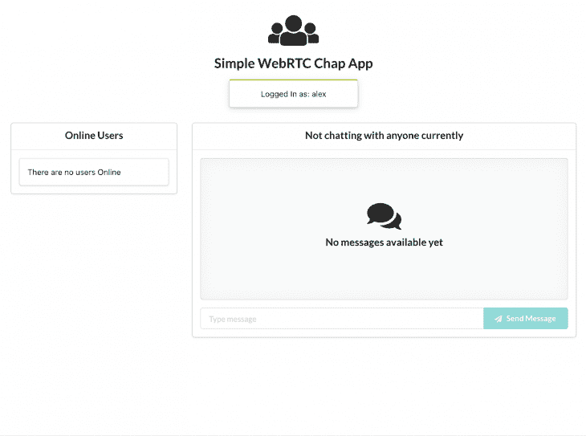

Logged in but not connected to another user.

就是这样！我们从头开始构建了一个 WebRTC 聊天应用程序。如果您想测试这个实现，您可以查看一下[演示](https://clever-dubinsky-9c45e1.netlify.com/)。请注意，演示可能无法在远程对等体上运行。


Logged in and chatting with another user.

为了让它工作，你需要增加一个服务器。你可以在你的设备上打开两个标签，然后连接，你应该可以看到应用程序的运行。

结论

## 在 GitHub 上可以找到[信令服务器](https://github.com/jkithome/signalling-server)和[聊天应用](https://github.com/jkithome/simple-webrtc-chat-app)的代码。本文绝不是详尽的，我们只是触及了 WebRTC 的基础。您可以通过添加处理 RTCPeerConnection close 和数据通道 close 来改进它。此外，多用户房间将是一个很好的下一步。

WebRTC 仍在开发中，并且经常发生变化。重要的是保持更新的变化，并相应地修改你的应用。

浏览器兼容性也是一个重要问题。你可以使用[适配器](https://github.com/webrtc/adapter)来确保你的应用可以跨不同的浏览器工作。我希望你喜欢这篇文章，并在评论中告诉我你的想法。

使用 [LogRocket](https://lp.logrocket.com/blg/signup) 消除传统错误报告的干扰

## [LogRocket](https://lp.logrocket.com/blg/signup) 是一个数字体验分析解决方案，它可以保护您免受数百个假阳性错误警报的影响，只针对几个真正重要的项目。LogRocket 会告诉您应用程序中实际影响用户的最具影响力的 bug 和 UX 问题。

[](https://lp.logrocket.com/blg/signup)

然后，使用具有深层技术遥测的会话重放来确切地查看用户看到了什么以及是什么导致了问题，就像你在他们身后看一样。

LogRocket 自动聚合客户端错误、JS 异常、前端性能指标和用户交互。然后 LogRocket 使用机器学习来告诉你哪些问题正在影响大多数用户，并提供你需要修复它的上下文。

关注重要的 bug—[今天就试试 LogRocket】。](https://lp.logrocket.com/blg/signup-issue-free)

Focus on the bugs that matter — [try LogRocket today](https://lp.logrocket.com/blg/signup-issue-free).*