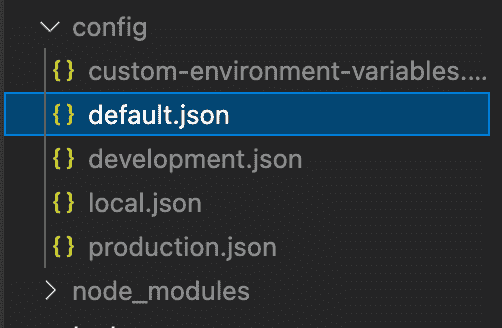
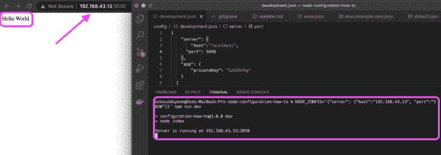

# 使用 node-config - LogRocket 博客在 Node.js 中创建配置文件

> 原文：<https://blog.logrocket.com/creating-configuration-files-node-js-using-node-config/>

管理跨不同环境的多个配置文件可能很有挑战性，有几个工具正在尝试用不同的方法解决这个问题。然而，在本文中，我们将学习如何使用 [node-config](https://github.com/lorenwest/node-config) 跨不同的部署环境创建和管理 Node.js 配置文件。

## 先决条件

*   [Node.js](http://nodejs.org) 10.x
*   节点基础知识

## 什么是节点配置？

Node-config 允许您在节点应用程序中为不同的部署环境创建配置文件。有了它，您可以定义一个默认的配置文件，以便在不同的环境中重复使用，然后将这个默认的配置扩展到其他的环境中，比如开发、试运行等等。

您可以使用一些临时命令行参数来覆盖这些参数，比如将`NODE_ENV=development`添加到您的命令行参数中。

Node-config 使创建和管理在所有部署环境中共享的一致配置界面变得更加容易。

为了更好地理解如何设置这个配置，让我们使用一个示例节点应用程序。首先，在您的终端上运行下面的命令来克隆这个库，或者从[这里](https://github.com/ezesundayeze/node-env-sample)下载并解压缩它。

```
bash
git clone https://github.com/ezesundayeze/node-env-sample

```

要安装节点依赖项，请运行:

```
bash
npm install

```

或者:

```
bash
yarn

```

## 设置节点配置

因为 node-config 是一个 npm 包，所以我们可以通过运行 npm 或 yarn 中的任何一个命令来安装它。

```
bash
npm install config
```

或者:

```
bash
yarn add config
```

## 支持的节点配置文件扩展名

Node-config 支持许多文件扩展名。在发布时，node-config ( `3.3.6`)的当前版本支持以下扩展:

```
- .json
- .json5
- .hjson
- .yaml or .yml
- .coffee
- .js
- .cson
- .properties
- .toml
- .ts
- .xml
```

这意味着您可以使用任何受支持的扩展名来创建您的配置文件，但是为您的项目选择一个扩展名并在整个构建过程中坚持使用它是有意义的。

在本教程中，我们将使用`.json`扩展。

## 创建默认环境变量

事实是，尽管您最终会为不同的环境拥有不同的文件，但仍会有一些变量在所有环境中保持不变。例如，`HOST`和`PORT​`变量。更重要的是，如果没有为特定的环境设置环境变量，您还希望您的应用程序能够使用这些变量。

创建一个`config`目录，并向其中添加一个`config/default.json`文件。这将是默认的配置文件，包含所有默认的环境变量。

在我们的示例应用程序中应该是这样的:

`config/default.json`

```
json
{
    "server": {
      "host": "localhost",
      "port": 0,
    }
  }
```

我们将在应用程序中通过导入`config`并使用`get`方法访问变量来访问它。

```
js
const config = require('config');
const port = config.get('server.port');
const host = config.get('server.host');
```

让我们创建一个`server.js`文件并添加下面的代码。

```
js
const express = require('express');
const config = require('config');
const app = express();
const port = config.get('server.port');
const host = config.get('server.host');

app.get('/', (req, res) => {
    res.send('Hello World');
});
const server = app.listen(port, host, (err) => {
    if (err) {
        console.log(err);
        process.exit(1);
    }
    console.log(`Server is running on ${host}:${server.address().port}`);
});
```

您可以以类似的方式在应用程序的其他部分使用 node-config。

## 扩展默认配置文件

您可以通过创建其他配置文件来扩展默认配置文件。例如，您可以为开发、生产、QA、试运行、本地等创建配置文件。让我们来看看我们将在应用程序中使用的配置文件的主要类型。



### 本地配置文件

创建本地配置文件是为了覆盖配置文件的部署版本。例如，对于您的开发部署，您可以拥有一个存储所有本地开发配置的`local-development.json`文件——它反映了您在部署的开发环境中所期望的行为。

所以，你可以有这样的东西:

```
local-{instance}.EXT
local-{deployment}.EXT
local-{deployment}-{instance}.EXT
```

### 简短和完整的主机名

如果要在多个实例上部署，还可以使用短主机名和完整主机名来定义特定平台上的配置文件。例如，您可以有一个`{short_hostname}`，它将代表您的服务器名称，直到第一个点。如果您的主机名是`demo.example.com`，那么配置可以是`demo.EXT` ( `demo.json`)。

另外，如果您的`{full_hostname}`是您的整个服务器名称，那么当`{short_hostname}`与其他机器发生冲突时，您可以使用它。因此，在您的主机名是`demo.example.com`的情况下，您的配置文件名将是`demo.example.com.json`。

### 自定义配置文件

您可能还想创建一个自定义配置文件来存放一些环境变量覆盖。Node-config 提供了对配置文件类型的支持，您可以用名称`custom-environment-variables.EXT (custom-environment-variables.json)`来定义该文件类型。

## 测试配置值

如果没有设置环境变量，使用它们的服务将会中断。因此，您应该确保您的环境变量已经过测试。Node-config 提供了多个实用程序，其中一个是`config.has()`方法，它允许您验证环境变量是否已设置。

您可以创建一个测试文件，或者将它添加到您的预提交钩子中，以确保您已经设置好了所有的配置文件。

下面是一个如何使用`config.has()`来检查配置变量是否存在的例子:

```
js
if (config.has('dbConfig')) { 
... 
}
```

你也可以在你的 [Jest 测试](https://blog.logrocket.com/tag/jest/)中使用它，就像这样:

```
js
const config = require('config');
test('Server config exist', () => {
    expect(config.has("server")).toBe(true);
});
test('Default config exist', () => {
    expect(config.has("server.port")).toBe(true);
    expect(config.has("server.host")).toBe(true);
});
```

## 使用命令行替代

使用命令行覆盖允许您从终端或命令行动态指定配置参数。您需要在启动应用程序时通过指定`NODE_CONFIG='{...}'`命令来设置配置。参数必须是 JSON 字符串格式。

这里有一个例子:

```
bash
NODE_CONFIG='{"server": {"host":"192.168.43.13", "port":"3030"}}' npm run dev
```



JSON 值两边的单引号允许您安全地使用双引号。在某些情况下，取决于你的操作系统，你可能需要对某些字符进行转义。您还可以使用命令行导出来避免总是键入命令。

在您的终端上运行下面的命令将覆盖您的服务器的主机和端口，或者您选择覆盖的任何其他配置。

```
bash
export NODE_CONFIG='{"server": {"host":"192.168.43.13", "port":"3030"}}'
```

如果您喜欢使用 JavaScript，可以在调用配置库之前将其添加到服务器文件中，如下所示:

```
js
const express = require('express');
process.env.NODE_CONFIG = '{"server": {"host":"localhost", "port":"3030"}}';
const config = require('config');
```

诀窍是在`config`加载之前将`NODE_CONFIG`变量设置为 JSON 字符串。

这是因为命令行替代优先于所有其他类型的替代。下面是一些在使用 node-config 时不能用作环境变量的保留字，因为该库提供的实现可能会与您的冲突。

```
get
has
util
getConfigSources
makeHidden
makeImmutable
setModuleDefaults
watch 
_attachProtoDeep
_cloneDeep
_diffDeep
```

这不是一个详尽的列表，所以一定要查看[文档](https://github.com/lorenwest/node-config/wiki)。

有几个插件可以集成到 node-config 中来增强它的使用。例如， [config-secrets](https://www.npmjs.com/package/config-secrets) 允许您使用 Docker 有效地使用 node-config [来管理容器中的秘密](https://github.com/lee5i3/config-secrets),[config-reloadable](https://www.npmjs.com/package/config-reloadable)允许您自动重新加载 node-config(您可能已经知道，配置不会在文件更改时自动加载)，而 [config-uncache](https://github.com/m19c/node-config-uncached) 插件允许您取消缓存您的配置变量。

## 结论

使用 node-config 时，有无数种方法可以配置您的节点应用程序。有了它，您可以轻松地管理您的配置文件，并根据您的需要扩展它们，从而在您的项目中实现最大的灵活性、可靠性和一致性。感谢阅读。

## 200 只显示器出现故障，生产中网络请求缓慢

部署基于节点的 web 应用程序或网站是容易的部分。确保您的节点实例继续为您的应用程序提供资源是事情变得更加困难的地方。如果您对确保对后端或第三方服务的请求成功感兴趣，

[try LogRocket](https://lp.logrocket.com/blg/node-signup)

.

[](https://lp.logrocket.com/blg/node-signup)[https://logrocket.com/signup/](https://lp.logrocket.com/blg/node-signup)

LogRocket 就像是网络和移动应用程序的 DVR，记录下用户与你的应用程序交互时发生的一切。您可以汇总并报告有问题的网络请求，以快速了解根本原因，而不是猜测问题发生的原因。

LogRocket 检测您的应用程序以记录基线性能计时，如页面加载时间、到达第一个字节的时间、慢速网络请求，还记录 Redux、NgRx 和 Vuex 操作/状态。

[Start monitoring for free](https://lp.logrocket.com/blg/node-signup)

.