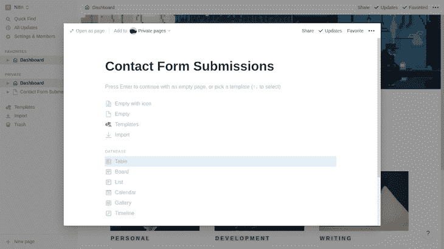
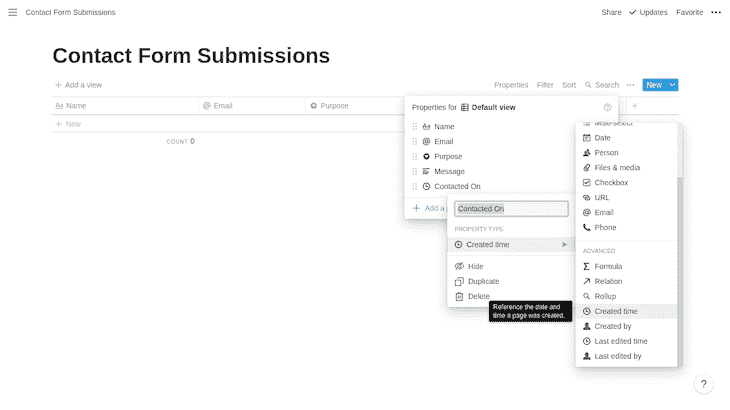
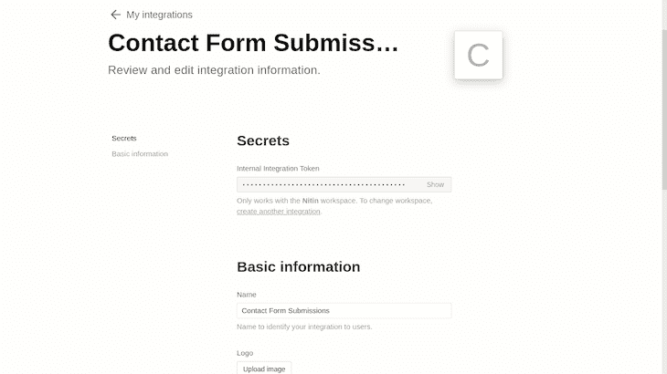
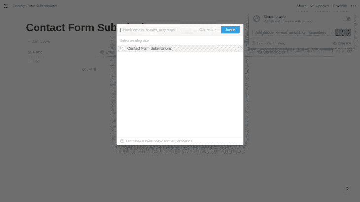
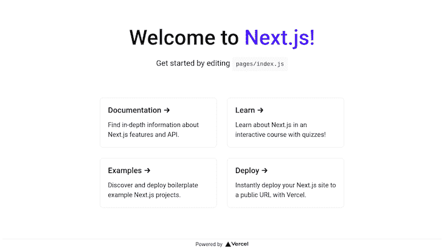
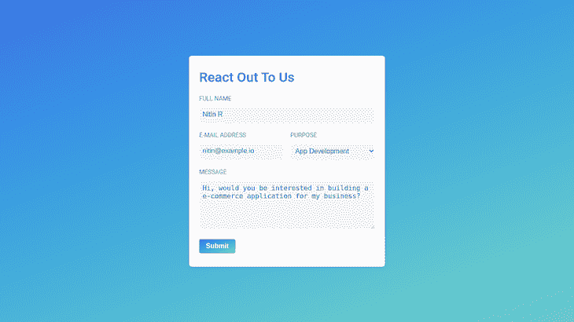
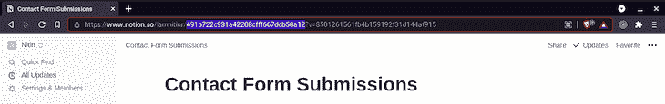
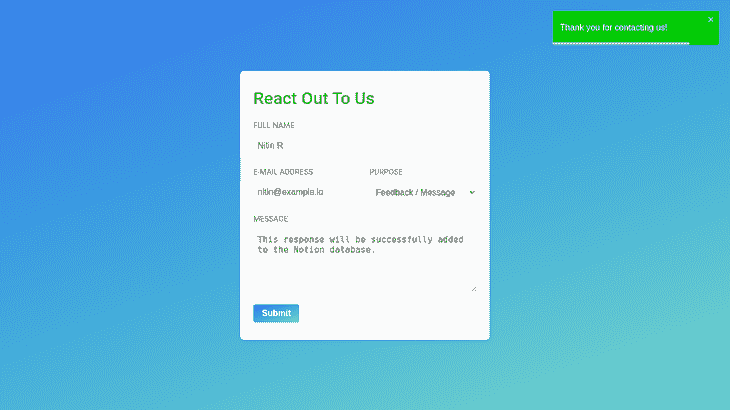
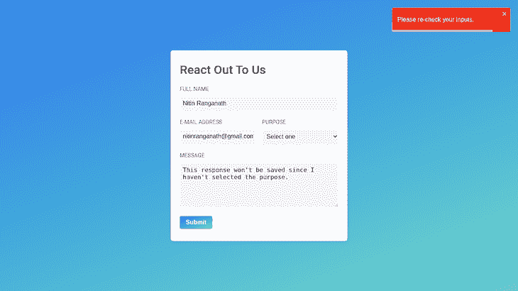
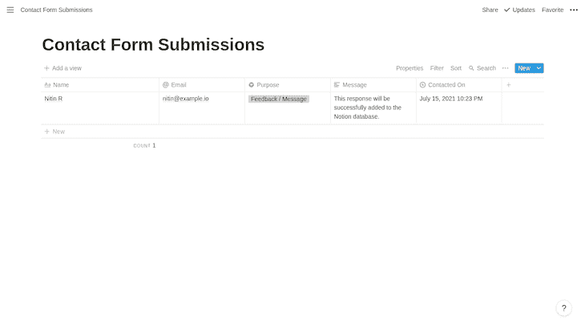

# 使用概念 API 和 Next.js - LogRocket 博客创建联系表单

> 原文：<https://blog.logrocket.com/creating-contact-forms-with-the-notion-api-and-next-js/>

无论是你的投资组合网站还是 SaaS 产品网站，你都需要为访问者和潜在客户建立一个专门的联系页面，这样他们才能联系到你。通常，该页面包含一个表单，访问者可以填写该表单来发送消息或提出问题。但是在哪里以及如何存储这些响应呢？

仅仅为了存储表单提交而建立数据库并不是最方便的选择。使用 [Next.js](https://nextjs.org/) 和[概念 API](https://developers.notion.com/) ，您可以使用数据库特性将所有提交内容直接保存到您的概念工作区。如果您已经将 concept 用作项目管理工具，并且可以将所有内容集中在一个地方，这将非常有用。

## 先决条件

对于本教程，您需要对 Next.js(或 React)有一个基本的了解。如果您没有使用 Next.js，我们将在 Next.js API 路由中编写的所有代码也可以在 Node.js 服务器中使用。

在本教程中，我们将涵盖:

*   建立概念数据库
*   用 Next.js 构建联系页面
*   用 CSS 模块设计页面样式
*   在 Next.js 上使用环境变量
*   使用 Next.js API 路由通过 SDK 与概念 API 进行交互

## 建立概念数据库

首先，让我们建立我们的概念数据库，并创建一个新的集成来通过概念 API 访问它。访问[概念网站](https://www.notion.so/)，开始为数据库创建一个新页面。如果您以前从未使用过概念，可能会提示您登录。



Creating a new Notion page with table database

在你屏幕的左下角，点击 **+新页面**并随意命名。我现在将它命名为“联系表单提交”。现在，单击数据库部分中的**表**来创建一个表格数据库，用于存储表单响应。



通过向表中添加新属性和/或编辑现有属性，可以根据需要修改数据库。以下是我们将存储在概念数据库中的属性及其类型:

1.  名称:标题属性类型
2.  电子邮件:电子邮件属性类型
3.  目的:选择属性类型
4.  消息:文本属性类型
5.  联系时间:创建一个时间属性类型，当表单提交添加到表中时，该属性类型会自动生成

现在我们的概念数据库已经准备好了，让我们创建一个新的集成来将数据库连接到我们的 Next.js 应用程序。

## 为 idea 和 Next.js 创建集成

要创建新的集成，请转到[概念的我的集成页面](https://www.notion.so/my-integrations)并点击**+新集成**。您需要填写基本信息，并选择创建联系人页面的工作区。完成后，您将被重定向到如下屏幕:



Notion integrations screen

将内部集成令牌复制并存储在安全的地方，因为我们稍后在与概念 API 交互时会用到它。不要与任何其他人共享此令牌。



Connecting the integration with page

最后，要将概念数据库连接到我们新创建的集成，请返回到**联系表单提交**页面，并点击位于屏幕右上角的**共享**。选择您的集成并点击**邀请**以允许其编辑访问。

配置部分到此为止。是时候开始写代码了。

## 设置 Next.js 应用程序

通过在终端上运行以下命令，您可以使用`create-next-app`工具快速启动新的 Next.js 应用程序:

```
npx create-next-app
# or
yarn create next-app

```

接下来，在您喜欢的文本编辑器或 IDE 上打开项目文件夹。让我们在运行 Next.js 开发服务器之前安装几个 npm 包。

我们将使用两个包:`react-toastify`用于在表单提交时显示 toast 通知，而`@notionhq/client`用于使用 JavaScript SDK 与 API 进行交互。

```
npm install react-toastify @notionhq/client
# or
yarn add react-toastify @notionhq/client

```

通过在终端上运行`npm run dev`来启动开发服务器。在访问 [http://localhost:3000](http://localhost:3000) 时，你会看到这样一个屏幕:



Next.js boilerplate code output

## 构建和设计联系人表单

让我们用带有表单的自定义联系人页面替换由`create-next-app`工具生成的样板代码。打开`**pages/index.js**`文件并粘贴下面给出的:

```
import styles from '../styles/Home.module.css';

export default function Home() {
  return (
    <div className={styles.container}>
      <form className={styles.form}>
        <h1 className={styles.title}>React Out To Us</h1>
        <div>
          <label htmlFor="name">Full Name</label>
          <input
            type="text"
            id="name"
            name="name"
            placeholder="John Doe"
            required
          />
        </div>
        <div className={styles.inputs}>
          <div>
            <label htmlFor="email">E-Mail Address</label>
            <input
              type="email"
              name="email"
              placeholder="[email protected]"
              required
            />
          </div>
          <div>
            <label htmlFor="purpose">Purpose</label>
            <select name="purpose" id="purpose">
              <option value="" selected disabled required>
                Select one
              </option>
              <option value="Web Development">Web Development</option>
              <option value="App Development">App Development</option>
              <option value="Query / Question">Query / Question</option>
              <option value="Feedback / Message">Feedback / Message</option>
            </select>
          </div>
        </div>
        <div>
          <label htmlFor="message">Message</label>
          <textarea
            name="message"
            id="message"
            rows="5"
            placeholder="Hi there!"
            required
          ></textarea>
        </div>
        <button className={styles.btn} type="submit">
          Submit
        </button>
      </form>
    </div>
  );
}

```

随意修改输入，并确保您的概念数据库也有相同的输入。现在让我们用一些 CSS 来装扮这个表单。

转到`styles/Home.module.css`，用下面给出的样式替换该文件中的样式:

```
.container {
  height: 100vh;
  display: flex;
  justify-content: center;
  align-items: center;
  background-color: #0093e9;
  background-image: linear-gradient(160deg, #0093e9 0%, #80d0c7 100%);
}
.form {
  background: white;
  padding: 2rem 1.5rem;
  border-radius: 6px;
  box-shadow: 2px 4px 8px rgba(0, 0, 0, 0.1);
  max-width: 600px;
}
.title {
  margin: 0 0 1.5rem;
}
.form label {
  display: block;
  text-transform: uppercase;
  font-size: 0.9rem;
  margin-bottom: 0.5rem;
  color: #334155;
}
.form input,
.form select,
.form textarea {
  width: 100%;
  border: none;
  background: #f4f4f5;
  padding: 0.75rem 0.5rem;
  font-size: 1rem;
  margin-bottom: 1.25rem;
  border-radius: 4px;
}
.form input:focus,
.form select:focus,
.form textarea:focus {
  outline: 2px solid #0093e9;
}
.inputs {
  display: flex;
  justify-content: space-between;
}
.inputs div {
  flex: 1;
}
.inputs div:first-child {
  margin-right: 1rem;
}
.btn {
  background-color: #0093e9;
  background-image: linear-gradient(160deg, #0093e9 0%, #80d0c7 100%);
  padding: 0.5rem 1rem;
  border: none;
  color: white;
  font-size: 1rem;
  font-weight: bold;
  border-radius: 4px;
  box-shadow: 2px 2px 5px rgba(0, 0, 0, 0.1);
  cursor: pointer;
}

```

就像输入一样，您可以根据自己的喜好调整样式。访问 [http://localhost:3000](http://localhost:3000) ，你会看到一个类似这样的页面:



Contact page and form

还不错！我们还没有设置输入状态和表单提交处理程序，但是在设置了 API 路径之后，我们会再回来讨论这个问题。

## 在环境变量中存储机密数据

将所有敏感信息——比如您的概念内部集成令牌和概念数据库 ID——存储为环境变量是一个很好的做法，这样您可以在以后需要时轻松地更改它们，并防止将它们暴露给浏览器。

因此，在项目的根目录下创建一个名为`.env.local`的新文件。在这个文件中，我们将存储`NOTION_API_KEY`变量和`NOTION_DATABASE_ID`，前者是内部集成令牌，后者可以从概念数据库的 URL 中获得。

你的概念数据库的 URL 可能看起来像这样的。



The select text in the URL denotes the database ID

数据库 ID 是`?v=`前的字母数字，也就是`491b722c931a42208cfff667dcb58a12`。

确保使用您自己的集成令牌和数据库 ID。你的`.env.local`文件应该是这样的:

```
NOTION_API_KEY = secret_qidbxxxxxxxxxxxxxxxxxxxxMYitF6IM
NOTION_DATABASE_ID = 491b722c931a42208cfff667dcb58a12

```

## 通过 Next.js API 路由与概念 API 交互

转到`pages/API`文件夹，将`hello.js`文件重命名为`submit-form.js`。这个文件的 API 路径可以在[http://localhost:3000/API/submit-form](http://localhost:3000/api/submit-form)找到。我们将使用 opinion 的官方 JavaScript SDK 与我们的 opinion 数据库进行交互。

首先，我们需要从`@notionhq/client` SDK 包中导入`Client`并创建它的一个新实例。该实例接受一个对象，其`auth`键值设置为集成令牌，可以使用`process.env.NOTION_API_KEY`访问该令牌。

在 handler 函数中，可以使用`req.method`访问 HTTP 请求方法。因为我们只期待来自 Next.js 前端的`POST`请求，所以我们可以用`405 Method Not Allowed`来响应其他类型的请求。

```
const { Client } = require('@notionhq/client');

const notion = new Client({
  auth: process.env.NOTION_API_KEY,
});

export default async function handler(req, res) {
  if (req.method !== 'POST') {
    return res
      .status(405)
      .json({ message: `${req.method} requests are not allowed` });
  }
  try {
    const { name, email, purpose, message } = JSON.parse(req.body);
    await notion.pages.create({
      parent: {
        database_id: process.env.NOTION_DATABASE_ID,
      },
      properties: {
        Name: {
          title: [
            {
              text: {
                content: name,
              },
            },
          ],
        },
        Email: {
          email: email,
        },
        Purpose: {
          select: {
            name: purpose,
          },
        },
        Message: {
          rich_text: [
            {
              text: {
                content: message,
              },
            },
          ],
        },
      },
    });
    res.status(201).json({ msg: 'Success' });
  } catch (error) {
    res.status(500).json({ msg: 'There was an error' });
  }
}

```

要向我们的概念数据库添加新的表单响应，使用`notion.pages.create()`方法。如果您以前没有使用过 concept，那么值得注意的是，每个数据库条目都是 concept 中的一个页面。这个方法将一个带有`parent`对象和`properties`对象的对象作为参数。

在`parent`对象中，将`database_id`设置为您的概念数据库的 ID，可以通过`process.env.NOTION_DATABASE_ID`访问。第一眼看去，`properties`对象似乎很复杂，但是属性值对象的[文档中有各种属性类型的例子，比如`rich_text`、`number`、`title`、`select`等等。](https://developers.notion.com/reference/page#page-property-value)

最后，将整个`notion.pages.create()`方法包含在`try…catch`块中，以捕捉错误并做出相应的响应。您的 API 路由现在已经准备好与您的概念数据库进行交互了。

* * *

### 更多来自 LogRocket 的精彩文章:

* * *

## 向联系人表单添加功能

虽然联系表单在布局和设计方面已经准备好了，但是我们还没有给它添加功能。现在让我们通过以下方式来实现这一点:

1.  使用`useState()`钩子向表单输入添加状态
2.  为调用 API 路由的表单创建一个提交处理程序
3.  根据响应显示祝酒通知

让我们在`pages/index.js`中编写这些功能。

```
// For handling input states
import { useState } from 'react';

// For display toasts  
import { ToastContainer, toast } from 'react-toastify';
import 'react-toastify/dist/ReactToastify.min.css';

import styles from '../styles/Home.module.css';

export default function Home() {

  // Input states
  const [name, setName] = useState('');
  const [email, setEmail] = useState('');
  const [purpose, setPurpose] = useState('');
  const [message, setMessage] = useState('');

  // Form submit handler
  const submitForm = async (e) => {
    e.preventDefault();
    const res = await fetch('http://localhost:3000/api/submit-form', {
      method: 'POST',
      body: JSON.stringify({ name, email, purpose, message }),
    });
    // Success if status code is 201
    if (res.status === 201) {
      toast('Thank you for contacting us!', { type: 'success' });
    } else {
      toast('Please re-check your inputs.', { type: 'error' });
    }
  };

  return (
    <div className={styles.container}>
      <ToastContainer />
      <form className={styles.form} onSubmit={submitForm}>
        <h1 className={styles.title}>React Out To Us</h1>
        <div>
          <label htmlFor="name">Full Name</label>
          <input
            type="text"
            id="name"
            name="name"
            placeholder="John Doe"
            value={name}
            onChange={(e) => setName(e.target.value)}
            required
          />
        </div>
        <div className={styles.inputs}>
          <div>
            <label htmlFor="email">E-Mail Address</label>
            <input
              type="email"
              name="email"
              placeholder="[email protected]"
              value={email}
              onChange={(e) => setEmail(e.target.value)}
              required
            />
          </div>
          <div>
            <label htmlFor="purpose">Purpose</label>
            <select
              name="purpose"
              id="purpose"
              value={purpose}
              onChange={(e) => setPurpose(e.target.value)}
            >
              <option value="" disabled required>
                Select one
              </option>
              <option value="Web Development">Web Development</option>
              <option value="App Development">App Development</option>
              <option value="Query / Question">Query / Question</option>
              <option value="Feedback / Message">Feedback / Message</option>
            </select>
          </div>
        </div>
        <div>
          <label htmlFor="message">Message</label>
          <textarea
            name="message"
            id="message"
            rows="5"
            placeholder="Hi there!"
            value={message}
            onChange={(e) => setMessage(e.target.value)}
            required
          ></textarea>
        </div>
        <button className={styles.btn} type="submit">
          Submit
        </button>
      </form>
    </div>
  );
}

```

为了处理输入状态，我们可以使用`useState()`钩子，并相应地为每个输入分配一个`value`和一个`onChange`处理程序，使其成为受控输入。

现在创建一个名为`submitForm`的异步函数，它使用`fetch()`向位于[http://localhost:3000/API/submit-form](http://localhost:3000/api/submit-form)的 API 路由发出一个`POST`请求。输入状态可以在主体中发送。

一旦发出请求，我们就可以检查请求的状态代码。状态代码`201`表示响应已成功添加到概念数据库中。否则，将产生状态码`500`，表示有错误。

添加吐司时，从`react-toastify`导入`toast()`函数和`ToastContainer`组件。此外，从`react-toastify/dist/ReactToastify.min.css`导入 CSS 文件来设置它们的样式。

将`<ToastContainer />`组件添加到 JSX 中，并使用`toast()`函数根据从`submitForm`函数中的 API 接收到的响应来发送吐司。

## 测试表单

让我们测试一下我们的联系方式，看看它是否有效。用适当的输入填写表格。在提交表单时，您会注意到一个成功的祝酒词。



Successful form submission

在提交不正确的响应时，例如无效的目的，将弹出错误提示。



Unsuccessful form submission

您可以用您的概念数据库来验证这一点，以确认响应按照预期存储。



Form responses in Notion

## 结论

观念对于团队和个人都是一个强有力的工具。有了这个概念 API，你将不再需要建立一个数据库或者使用第三方服务来管理你的联系表单回复。您甚至可以与您的团队分享它，并以多种方式直观显示响应，而且是免费的！我希望你喜欢这个教程。

## [LogRocket](https://lp.logrocket.com/blg/nextjs-signup) :全面了解生产 Next.js 应用

调试下一个应用程序可能会很困难，尤其是当用户遇到难以重现的问题时。如果您对监视和跟踪状态、自动显示 JavaScript 错误、跟踪缓慢的网络请求和组件加载时间感兴趣，

[try LogRocket](https://lp.logrocket.com/blg/nextjs-signup)

.

[](https://lp.logrocket.com/blg/nextjs-signup)[](https://lp.logrocket.com/blg/nextjs-signup)

LogRocket 就像是网络和移动应用的 DVR，记录下你的 Next.js 应用上发生的一切。您可以汇总并报告问题发生时应用程序的状态，而不是猜测问题发生的原因。LogRocket 还可以监控应用程序的性能，报告客户端 CPU 负载、客户端内存使用等指标。

LogRocket Redux 中间件包为您的用户会话增加了一层额外的可见性。LogRocket 记录 Redux 存储中的所有操作和状态。

让您调试 Next.js 应用的方式现代化— [开始免费监控](https://lp.logrocket.com/blg/nextjs-signup)。