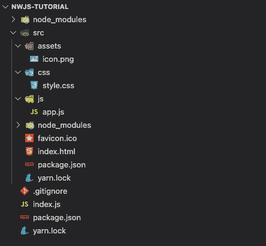
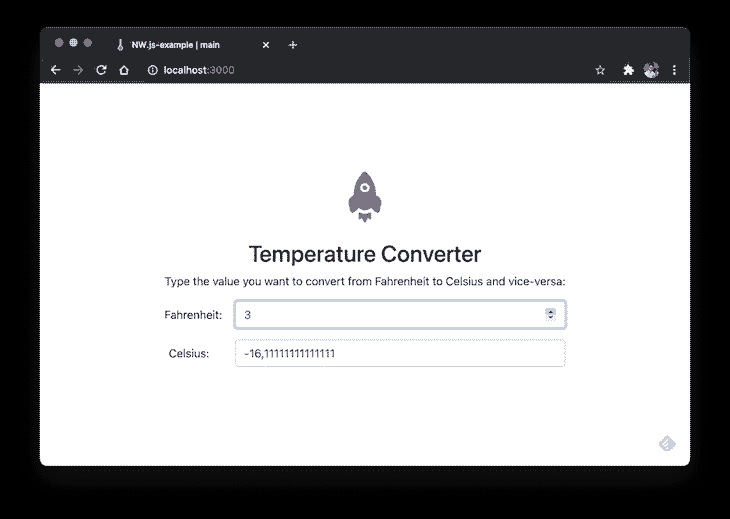
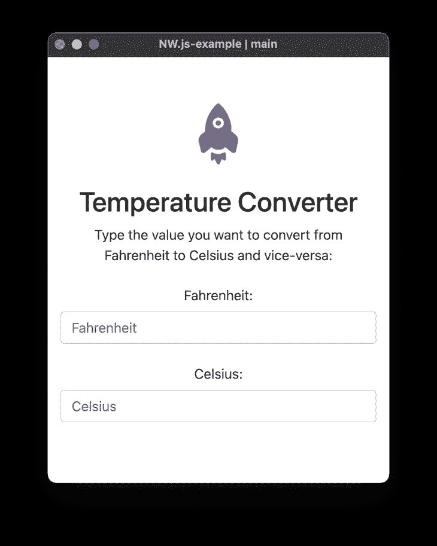
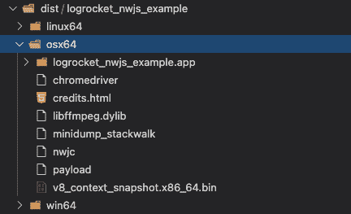

# 使用 NW.js 创建跨平台应用程序

> 原文：<https://blog.logrocket.com/creating-cross-platform-apps-nw-js/>

NW.js ，以前被称为 node-webkit，是社区中最受欢迎的本地应用程序开发的电子替代方案之一。像它的竞争对手一样，NW.js 也可以通过使用 HTML、CSS 和 JavaScript 这三个核心组件来轻松设置跨平台的桌面应用程序。

您可以像使用自己喜欢的工具(React、Angular、Less、webpack 等)创建任何普通的 web 应用程序一样进行编码。)，最后，NW.js 负责将所有内容从网络技术翻译成本地语言。

许多应用已经采用 NW.js 作为他们的混合开发框架。这一切之所以成为可能，是因为 Chromium，谷歌拥有的同一个开源浏览器，它不仅支持该公司的网络浏览器，还支持其他几十个相关项目。

除此之外，NW.js 还提供了一系列出色的集成，包括基于本机操作系统的硬件和文件系统访问、与 shell 的集成等等。

在本文中，我将向您介绍在 NW.js 上实现一个小型 web 应用程序的最初步骤。让我们直接开始吧！

## 项目设置

如前所述，由于不需要任何特定的安装或特殊的设置，NW.js 为您提供了选择任何您喜欢的环境和技术堆栈的灵活性。你可以在你最喜欢的框架或库的基础上构建几乎任何类型的 web 应用程序，与 NW.js 一起运行。

此外，因为该项目没有提供任何类型的搭建工具(例如，除了一些针对清单格式的特定规则之外)，所以本教程将探索如何使用最基本的设置从头开始创建项目: [HTML、CSS 和 JavaScript only](https://blog.logrocket.com/web-animation-with-html-css-and-javascript/) 。

因此，作为第一步，请确保复制下面演示的文件夹和文件的相同结构:



Project’s folder and file structure.

这里最重要的文件夹是`src`，你可能已经猜到了。这就是你分离 NW.js 主文件的地方。其实所有和 NW.js 相关的东西都属于这个文件。

对于一些辅助文件，如图像和图标，你可以添加任何你喜欢的。

还要注意有两个`package.json`文件。发生这种情况是因为可能会创建一个单独的`src/package.json`来存储清单配置，如这里所说的。另一个只是普通的`package.json`来处理项目依赖和构建命令。

说到`package.json`文件，其内容如下:

```
{
  "name": "logrocket_nwjs_example",
  "version": "1.0.0",
  "description": "A demo app to show how NW.js works",
  "main": "index.html",
  "window": {
    "icon": "assets/icon.png",
    "height": 500,
    "width": 400,
    "resizable": true,
    "title": "Hello World, NW.js"
  },
  "dependencies": {
    "bootstrap": "^4.6.0",
    "jquery": "^3.6.0"
  }
}

```

您可以随意更改一些信息，但是要确保您总是拥有`name`和`version`属性，因为它们是必需的。

然后，在`src`文件夹中运行以下命令，下载所需的依赖项:

```
yarn install

```

该命令将下载 Bootstrap 和 jQuery 依赖项，因为您将需要它们来创建更好的外观。

`width`和`height`对应于你的应用程序屏幕首次启动时的尺寸，而如果你允许用户调整应用程序窗口的大小，那么`resizable`属性是很重要的配置。

下一站是`index.html`内容。将以下 HTML 代码添加到其中:

```
<!DOCTYPE html>
<html>
  <head>
    <meta charset="utf-8" />
    <title>NW.js-example | main</title>
    <link rel="stylesheet" href="css/style.css" />
  </head>
  <body class="text-center">
    <form>
      
      <h2>Temperature Converter</h2>
      <p>
        Type the value you want to convert from Fahrenheit to Celsius and vice versa:
      </p>

      <div class="form-group row">
        <label for="fahrenheit" class="col-sm-2 col-form-label"
          >Fahrenheit:</label
        >
        <div class="col-sm-10">
          <input
            id="fahrenheit"
            class="form-control"
            type="number"
            placeholder="Fahrenheit"
          />
        </div>
      </div>
      <div class="form-group row">
        <label for="celsius" class="col-sm-2 col-form-label"
          >Celsius:</label
        >
        <div class="col-sm-10">
          <input
            id="celsius"
            class="form-control"
            type="number"
            placeholder="Celsius"
          />
        </div>
      </div>
    </form>

    <script src="../js/app.js"></script>
    <script src="node_modules/jquery/dist/jquery.min.js"></script>
    <script src="node_modules/bootstrap/dist/js/bootstrap.min.js"></script>
  </body>
</html>

```

这是一个表单组件的基本引导结构，两个温度场可以从华氏温度转换到摄氏温度，反之亦然。

注意文件开头的 CSS 导入，以及 Bootstrap、jQuery、app 主 JS 文件分别对应的 JavaScript。

以下代码属于`js/app.js`文件:

```
const celsius = document.getElementById("celsius");
const fahrenheit = document.getElementById("fahrenheit");

fahrenheit.addEventListener("change", (e) => {
  convertToCelsius(e.target.value);
});

celsius.addEventListener("change", (e) => {
  convertToFahrenheit(e.target.value);
});

function convertToCelsius(valNum) {
  valNum = parseFloat(valNum);
  celsius.value = (valNum - 32) / 1.8;
}

function convertToFahrenheit(valNum) {
  valNum = parseFloat(valNum);
  fahrenheit.value = valNum * 1.8 + 32;
}

```

当字段值改变时，它们对应于每个事件侦听器。然后，它们将触发适当的转换，并在最后更新字段。

样式对于这个例子也很重要。除了从 Bootstrap 导入的内容，您还需要一些基本的 CSS 规则来集中显示内容。以下内容对应于您应该添加到`style.css`文件的内容:

```
@import url("../node_modules/bootstrap/dist/css/bootstrap.min.css");

html,
body {
  height: 100%;
}

body {
    display: flex;
    align-items: center;
}

form {
  padding: 15px;
  margin: 0 auto;
}

```

## 测试

在将这个实现作为一个真正的 NW.js 桌面应用程序进行测试之前，有必要将这个应用程序作为一个普通的 web 应用程序在您的浏览器上运行。通过将以下内容添加到您的`index.js`文件中，您可以轻松做到这一点:

```
const express = require("express");
const path = require("path");

const app = express();

const PORT = process.env.PORT || 3000;
app.use(express.static(path.join(__dirname, "src")));

app.listen(PORT, () => {
  console.log("Server listening on port: %d", PORT);
});

```

因为它位于项目的根文件夹中，所以您可以启动一个 Express.js 服务器并自然地提供静态文件。

最后，让我们看看另一个`package.json`文件，它也位于根项目文件夹中。这是您应该添加到其中的内容:

```
{
  "name": "logrocket_nwjs_example",
  "version": "1.0.0",
  "description": "A demo app to show how NW.js works",
  "private": true,
  "scripts": {
    "start": "node index.js",
    "start-nw": "nw src/",
    "build-nw": "nwbuild --platforms win64,osx64,linux64 --buildDir dist/ src/"
  },
  "dependencies": {
    "express": "^4.17.1",
    "nw": "^0.52.0",
    "nw-builder": "^3.5.7"
  }
}

```

在这里，您可以看到与 NW.js 本身和 [nw-builder](https://www.npmjs.com/package/nw-builder) 相关的依赖项，它是一个强大的插件，可以帮助生成特定于操作系统的安装程序。

确保在根文件夹上运行`yarn install`命令来下载这些 npm 包。

之后，运行以下命令通过 Express 服务器启动应用程序:

```
yarn start

```

该应用将于`[http://localhost:3000/](http://localhost:3000/)`上市。当您访问它时，您将看到以下屏幕:



Temperature converter app running on the Express server.

继续测试这两个字段，检查它们是否正确地转换和更新了温度。

要在 NW.js 模式下运行应用程序，只需执行以下命令:

```
yarn start-nw

```

这将触发 NW.js 库生成以下屏幕显示所需的一切:



Temperature converter running on NW.js

最后，为了生成任何特定于操作系统的安装程序，您可以运行以下命令:

```
yarn build-nw

```

此命令可能需要一段时间，因为它将下载并安装所有必需的依赖项。

注意，基于这个命令的配置——我们在`package.json`文件中设置了它——它将生成 Windows、Linux 和 macOS (64 位)的安装程序，并将它们存储在项目的`dist/`文件夹下。

在执行此命令期间，您不能更改任何项目文件；这可能导致进一步的不一致。

看看下图中的输出:



Generated installers for Linux, Windows, and OSX.

如果您通过 Finder(在 macOS 上)访问该文件夹并执行`logrocket_nwjs_example.app`文件，您将看到相同的应用程序启动。

## 结论

NW.js 让您可以灵活地自由选择您想使用的任何工具。能够通过只关注您已经熟悉的 web 实现来创建混合应用程序真是太棒了。

当然，NW.js 不是唯一的电子选择，但如果你愿意将网络功能提取到桌面应用中，它是一个强大的选择。在结束之前，我必须强调通过[官方文件](https://nwjs.readthedocs.io/en/latest/)了解更多关于 NW.js 能力的重要性。

## 您是否添加了新的 JS 库来提高性能或构建新特性？如果他们反其道而行之呢？

毫无疑问，前端变得越来越复杂。当您向应用程序添加新的 JavaScript 库和其他依赖项时，您将需要更多的可见性，以确保您的用户不会遇到未知的问题。

LogRocket 是一个前端应用程序监控解决方案，可以让您回放 JavaScript 错误，就像它们发生在您自己的浏览器中一样，这样您就可以更有效地对错误做出反应。

[](https://lp.logrocket.com/blg/javascript-signup)[https://logrocket.com/signup/](https://lp.logrocket.com/blg/javascript-signup)

[LogRocket](https://lp.logrocket.com/blg/javascript-signup) 可以与任何应用程序完美配合，不管是什么框架，并且有插件可以记录来自 Redux、Vuex 和@ngrx/store 的额外上下文。您可以汇总并报告问题发生时应用程序的状态，而不是猜测问题发生的原因。LogRocket 还可以监控应用的性能，报告客户端 CPU 负载、客户端内存使用等指标。

自信地构建— [开始免费监控](https://lp.logrocket.com/blg/javascript-signup)。