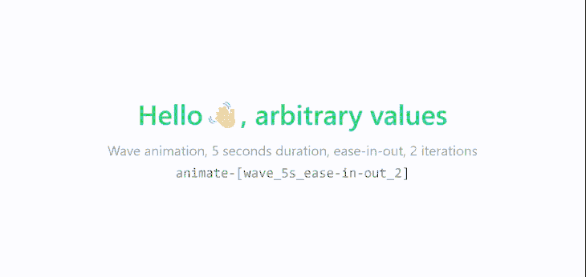

# 用顺风 CSS 创建自定义动画

> 原文：<https://blog.logrocket.com/creating-custom-animations-tailwind-css/>

Tailwind CSS 是一个实用至上的 CSS 框架，它的采用显示了巨大的增长，使它成为满足你所有风格需求的流行选择。虽然它允许你不用写一行 CSS 就能建立现代网站，但是设计网站只是提供积极用户体验的一部分。

通过动画制作有意义的互动在吸引访问者的注意力方面也起着重要的作用，它们可以让你的网站更上一层楼。在这篇文章中，你将学习如何在 Tailwind CSS 中使用 CSS 动画，探索它自带的内置动画，并为额外的天赋创建自定义动画。

## 使用内置 CSS 动画和顺风 CSS

[CSS 动画](https://developer.mozilla.org/en-US/docs/Web/CSS/animation)是一个 CSS 模块，让你[通过关键帧动画化 CSS 属性](https://blog.logrocket.com/guide-to-css-animation-for-javascript-developers/)的值。这些关键帧动画的性质可以通过调整其属性来改变，如持续时间、缓动功能、方向、延迟等。

就像其他 CSS 属性和模块一样，Tailwind CSS 也附带了一些用于 CSS 动画的实用程序类。默认情况下，它带有四个基本动画:旋转，脉冲，ping 和反弹。

这些实用程序类以关键字`animate`为前缀，比如`animate-spin`或`animate-pulse`。让我们以`animate-spin`实用程序为例。

这个工具类用于给你的 HTML 元素添加一个线性和无限旋转的动画。这对于加载指示器特别有用，例如您可能在窗体中的按钮上找到的指示器。

下面的代码片段向您展示了如何向 SVG 添加无限旋转的动画。您可以根据应用程序的状态切换该实用程序类。

```
<button type="button" class="bg-indigo-500 ..." disabled>
  <svg class="animate-spin h-5 w-5 mr-3 ..." viewBox="0 0 24 24">
    <!-- ... -->
  </svg>
  Loading...
</button>

```


在这种情况下使用动画有助于用户理解他们的动作已经被确认，并且正在触发适当的响应。除了功能性之外，动画也可以用于审美。

要查看其他运行中的内置动画，我建议您查看官方的 [Tailwind CSS 文档](https://tailwindcss.com/docs)。对于已经有专门的样式表链接到标记并且不需要 Tailwind CSS 作为依赖项的项目，使用内置 CSS 制作动画是理想的选择。

## 在顺风 CSS 中创建自定义动画

虽然四个内置的 CSS 动画对于一些一般的用例来说可能已经足够了，但是您可能不希望仅限于这些。动画是高度特定于项目的，也许您想使用自定义动画来代替。

幸运的是，没有必要创建一个新的样式表并将其链接到您的标记，只是为了向您的应用程序添加一个新的动画。相反，定义动画的关键帧并扩展主题配置以创建新的动画。


让我们假设我们想要创建一个自定义的挥手动画，就像上面的一样，并将其与顺风 CSS 一起使用。以下是方法。

## 将`@keyframes`添加到顺风 CSS 配置文件中

首先，我们必须为动画定义一个关键帧规则。`@keyframes` CSS at-rule 用于在动画的初始、中间和最终航路点定义元素的 CSS 属性值。通过这个，你可以在动画的不同阶段拥有多种不同的风格。

如果你不熟悉关键帧或者不熟悉它的语法，[看看这篇博文](https://css-tricks.com/snippets/css/keyframe-animation-syntax/)。

在普通的 CSS 中，这个动画的关键帧看起来是这样的:

```
@keyframes wave {
  0% { transform: rotate( 0.0deg) }
   10% { transform: rotate(14.0deg) }
   20% { transform: rotate(-8.0deg) }
   30% { transform: rotate(14.0deg) }
   40% { transform: rotate(-4.0deg) }
   50% { transform: rotate(10.0deg) }
   60% { transform: rotate( 0.0deg) }
  100% { transform: rotate( 0.0deg) }
}

```

打开项目根目录下的`tailwind.config.js`文件，在`theme.extend`中创建一个空的`keyframes`对象。现在，在这个`keyframes`对象中，让我们添加新的 wave 动画并定义它的行为。

```
module.exports = {
  content: [
    './pages/**/*.{js,ts,jsx,tsx}',
    './components/**/*.{js,ts,jsx,tsx}',
  ],
  theme: {
    extend: {
      keyframes: {
        wave: {
          '0%': { transform: 'rotate(0.0deg)' },
          '10%': { transform: 'rotate(14deg)' },
          '20%': { transform: 'rotate(-8deg)' },
          '30%': { transform: 'rotate(14deg)' },
          '40%': { transform: 'rotate(-4deg)' },
          '50%': { transform: 'rotate(10.0deg)' },
          '60%': { transform: 'rotate(0.0deg)' },
          '100%': { transform: 'rotate(0.0deg)' },
        },
      },
    },
  },
  plugins: [],
}

```

您的 Tailwind CSS 配置文件中的`content`数组可能看起来有所不同，这取决于您正在使用的前端框架或库，如果有的话。但是在上面的代码片段中需要重点关注的是`keyframes`对象。

## 在顺风 CSS 中扩展主题

现在我们已经将关键帧规则添加到了我们的主题对象`tailwind.config.js`中，让我们添加使用该规则的自定义动画。我们可以自定义动画持续时间，延迟，迭代次数，定时功能，等等。

假设我们希望动画在每个循环中线性过渡两秒钟，并保持无限动画。CSS 动画速记属性应该是这样的:

```
animation: wave 2s linear infinite;

```

`Wave`是我们之前定义的关键帧规则的名称。`2s`用来表示这个动画应该在一个循环中过渡两秒钟，`linear`用来表示我们希望缓动函数是线性的，`infinite`会一直保持动画。

让我们将这个动画添加到`theme.extend.animation`对象的`tailwind.config.js`中:

```
module.exports = {
  content: [
    './pages/**/*.{js,ts,jsx,tsx}',
    './components/**/*.{js,ts,jsx,tsx}',
  ],
  theme: {
    extend: {
      keyframes: {
        wave: {
          '0%': { transform: 'rotate(0.0deg)' },
          '10%': { transform: 'rotate(14deg)' },
          '20%': { transform: 'rotate(-8deg)' },
          '30%': { transform: 'rotate(14deg)' },
          '40%': { transform: 'rotate(-4deg)' },
          '50%': { transform: 'rotate(10.0deg)' },
          '60%': { transform: 'rotate(0.0deg)' },
          '100%': { transform: 'rotate(0.0deg)' },
        },
      },
      animation: {
        'waving-hand': 'wave 2s linear infinite',
      },
    },
  },
  plugins: [],
}

```

实用程序类是基于`animation`对象的键生成的。因为我们已经使用了`waving-hand`作为这个动画的键，所以我们需要将`animate-waving-hand`添加到我们想要在标记中制作动画的元素中，就像这样:

```
<h1 class="flex font-semibold text-purple-600">
  Hello <span class="animate-waving-hand">👋🏻</span>, LogRocket Blog
</h1>

```


瞧啊。您已经成功地为您的 Tailwind CSS 应用程序创建了自定义动画。要添加更多动画，您可以遵循相同的步骤:将关键帧添加到`theme.extend.keyframes`对象，然后将动画添加到`theme.extend.animation`。

## 在 Tailwind CSS 中为一次性自定义动画使用任意值

虽然在 Tailwind CSS 配置文件中定义动画是可重用动画的理想方式，但对于在整个应用程序中只使用一次的一次性动画，您可能不希望这样做。

当然，你可以在`theme.extend.animation`中定义另一个动画，但是 Tailwind CSS 通过任意值为你提供了一个[更好的方式来处理这样的场景。要使用它们，请将动画属性用下划线分隔，放在标记中关键字`animate`后面的一对方括号内，如下所示:](https://tailwindcss.com/docs/adding-custom-styles#using-arbitrary-values)

```
animate-[animationName_easingFunction_durationInSeconds_iterationsCount_delayInSeconds_direction]

```

假设您想要使用相同的`wave`关键帧规则，但不是每次线性无限地制作两秒钟的动画，而是使用`ease-in-out`计时功能制作两次五秒钟的动画。

因此，对于我们的新动画，实用程序类应该如下所示:

```
<h1 class="flex font-semibold text-emerald-500">
  Hello <span class="animate-[wave_5s_ease-in-out_2]">👋🏻</span>, arbitrary values
</h1>
<p class="text-center text-xs text-gray-400">
  Wave animation, 5 seconds duration, ease-in-out, 2 iterations
</p>
<pre className="text-center text-xs text-gray-500">
  animate-[wave_5s_ease-in-out_2]
</pre>

```



## 结论

由于 Tailwind CSS 的主题配置特性，您不仅可以扩展默认主题来添加自定义颜色、间距或断点，还可以在没有任何妥协和样式表的情况下添加到您的自定义动画中。这就是为什么 Tailwind CSS 如此受开发者欢迎的原因。

## 你的前端是否占用了用户的 CPU？

随着 web 前端变得越来越复杂，资源贪婪的特性对浏览器的要求越来越高。如果您对监控和跟踪生产环境中所有用户的客户端 CPU 使用情况、内存使用情况等感兴趣，

[try LogRocket](https://lp.logrocket.com/blg/css-signup)

.

[](https://lp.logrocket.com/blg/css-signup)[https://logrocket.com/signup/](https://lp.logrocket.com/blg/css-signup)

LogRocket 就像是网络和移动应用的 DVR，记录你的网络应用或网站上发生的一切。您可以汇总和报告关键的前端性能指标，重放用户会话和应用程序状态，记录网络请求，并自动显示所有错误，而不是猜测问题发生的原因。

现代化您调试 web 和移动应用的方式— [开始免费监控](https://lp.logrocket.com/blg/css-signup)。