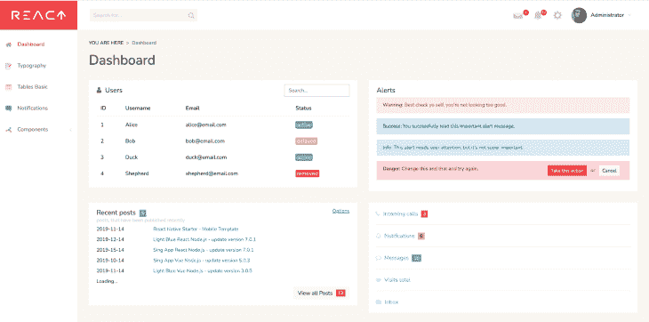
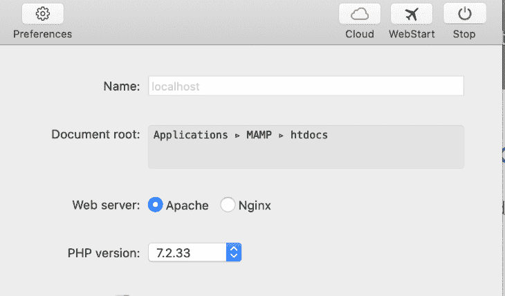
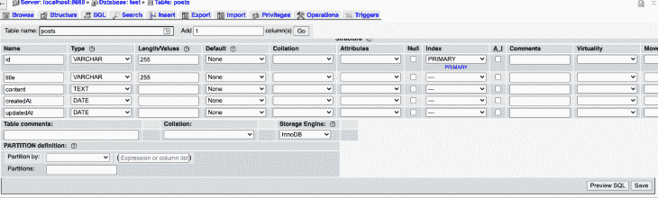
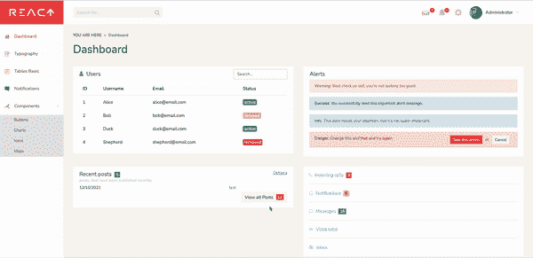
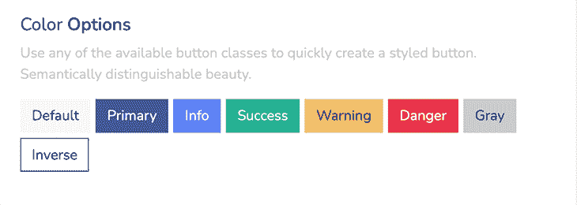

# 使用 React Dashboard - LogRocket 博客在 React 中创建仪表板

> 原文：<https://blog.logrocket.com/creating-dashboards-react-react-dashboard/>

是一家在各种框架中提供免费和高级仪表板模板的公司。无论是在 Angular、Vue 还是 React 中，开发者都可以找到许多用户友好的预建应用来满足他们的需求。

与从头开始项目不同，这极大地减少了所涉及的编码量，并使项目快速运行。在本教程中，我们将重点介绍他们的免费模板 [React Dashboard](https://github.com/flatlogic/react-dashboard) 。

这个模板是用 React、Bootstrap、React Router、Redux 和 GraphQL 构建的。它带有一个 React 前端和一个 Node.js 后端。认证被包括在内，并且布局是响应性的。

本教程将涵盖:

如何通过三个简单的步骤创建仪表板？然后，我们将用 MAMP 将它连接到 SQL 数据库，这样您就有了一些本地数据。

## React 仪表板教程:设置项目

首先，让我们克隆 React Dashboard 存储库，并为新项目选择一个名称。

```
git clone -o react-dashboard -b master --single-branch https://github.com/flatlogic/react-dashboard.git <app name>

```

一旦项目在我们的本地机器上被克隆，我们就可以继续安装所需的依赖项。

```
cd <app-name>
yarn install

```

在撰写本文时，React Dashboard 在您运行`yarn install`时遇到了一个问题，并且记录了一个 [GitHub 问题](https://github.com/flatlogic/react-dashboard/issues/15)。以下是错误的一部分:

```
    error /Users/..../node_modules/sqlite3: Command failed.
    Exit code: 1
    Command: node-pre-gyp install --fallback-to-build

```

如果您单独运行`yarn add sqlite3`，然后重新运行`yarn install`，事情应该会很好。

现在，我们可以运行`yarn dev`。一旦完成，这将启动后端和前端服务器，它们将分别在端口`5000`和`3000`上被访问。如果我们导航到`[http://localhost:3000/](http://localhost:3000/)`，我们应该会看到我们的仪表板:



这个项目还附带了 GraphQL。一旦应用程序启动，即可在`[http://localhost:5000/graphql](http://localhost:5000/graphql)`进入游乐场。如果您不熟悉这项技术，请不要犹豫，阅读 [GraphQL 文档](https://graphql.org)，学习如何创建查询和变异。

## 创建仪表板、表和数据库

我们有一个很棒的仪表板，但目前，它使用硬编码的值。为了使它更有价值，让我们将新的应用程序连接到本地数据库。

你可以选择任何数据库，但是为了这个教程，我将连接一个 MySQL 数据库。为了创建一个，我使用了 [MAMP](https://www.mamp.info/en/mamp/mac/) ，它允许你开箱即用 Apache、Nginx、PHP 和 MySQL。如果你没有 MAMP，你可以在这里下载[。](https://www.mamp.info/en/downloads/)

安装完成后，启动应用程序并点击 **WebStart** 。



这将在`[http://localhost:8888/MAMP](http://localhost:8888/MAMP)`打开 MAMP 索引页面。在这个页面上，你会看到大量的信息，但我们关心的是在 **MySQL** 下。一旦打开，点击 **phpMyAdmin** 。

这将打开另一个选项卡，这个是到`[http://localhost:8888/phpMyAdmin/index.php](http://localhost:8888/phpMyAdmin/index.php)`的，在这里你将看到`phpMyAdmin`的界面。得益于此，我们将能够看到、创建和使用我们未来的 MySQL 数据库。

我们可以通过点击**数据库**来创建一个数据库。然后，输入我们新数据库的名称并点击**创建**。

然后我们可以创建我们的第一个表。对于我们的教程，将其命名为`posts`并选择五列，因为我们将有五个字段。一旦我们点击 **Go** ，我们将能够进入我们的新领域。

我们的领域应该是这样:

*   类型为`VARCHAR`的 ID；长度`255`是我们的主键
*   类型标题`VARCHAR`；长度`255`
*   类型`TEXT`的内容
*   日期类型的创建日期
*   日期类型的更新日期

下面是我们的表格截图，其中包含我们的新字段:



一旦我们输入了所有需要的信息，点击**保存**。

## 将本地数据库链接到您的应用程序

这个项目使用 [Sequelize](https://sequelize.org/) ，一个 Node.js ORM，允许你连接到 SQL 数据库。在`src`内的数据文件夹中，我们找到一个 `sequelize.js`文件，我们可以在那里连接我们的数据库。

```
   import Sequelize from 'sequelize';
```

```
    // Configure the connection to your local database with your DB name, username, password and the port on which your DB runs.
    const sequelize = new Sequelize('test', 'root', 'root', {
      host: 'localhost',
      port: 8889,
      dialect: 'mysql',
      operatorsAliases: false,
    });

    export default sequelize;

```

然后，在同一个文件夹中，打开`schema.js`文件，取消对创建后的突变的注释。这将允许我们从我们的前端在我们的数据库中创建新的职位。

注意:同样，如果您不熟悉突变的概念，请查看 GraphQL 的文档。

```
    import {
      GraphQLSchema as Schema,
      GraphQLObjectType as ObjectType,
    } from 'graphql';

    import me from './queries/me';
    import news from './queries/news';
    import posts from './queries/posts';
    import addPost from './mutations/posts';

    const schemaConfig = {
      query: new ObjectType({
        name: 'Query',
        fields: {
          me,
          news,
          posts,
        },
      }),
    };

    // If you want to enable mutation, uncomment the code below
    schemaConfig.mutation = new ObjectType({
      name: 'Mutation',
      fields: {
        addPost,
      },
    });

    const schema = new Schema(schemaConfig);

    export default schema;

```

## 测试应用程序

用 **Cmd+C** 杀死服务器，然后重新启动。如果一切顺利，我们应该能够创造新的职位。在我们的仪表板上，我们可以点击**查看所有帖子**，然后**新建**。输入标题和内容后，点击**保存**。当我们回到仪表板页面时，我们的新帖子将出现在表格中。



## 使用 Sass 变量定制您的仪表板

至此，您的仪表板已经设置好，您可能有兴趣对其进行定制。在你的仪表盘中，如果你前往**组件>按钮**，你会看到所有的颜色选项，包括默认、原色等等。



谢天谢地，这些颜色很容易改变。React 仪表板的设置方式是，所有的样式都在`src/styles`文件夹中设置。在里面，你会发现一个名为`_variables.scss`的文件。

该文件包含所有用于品牌化的变量。您需要的是:

```
 $brand-primary:         #3754a5 !default;
 $brand-secondary:       #beccfd !default;
 $brand-success:         #1ab394 !default;
 $brand-info:            #5d80f9 !default;
 $brand-warning:         #f3c363 !default;
 $brand-danger:          #eb3349 !default;

```

您可以根据自己的喜好设置这些值，这些更改将自动应用于整个仪表板。

## 使用拖放功能定制您的仪表板

您可能感兴趣的另一个定制是实现拖放功能的能力。这将允许您的用户轻松地重新安排他们的仪表板，以满足他们的需求。

有几个库可以帮忙，比如 [react-beautiful-dnd](https://www.npmjs.com/package/react-beautiful-dnd) 、 [react-dnd](https://www.npmjs.com/package/react-dnd) 甚至、 [react-dropzone](https://www.npmjs.com/package/react-dropzone) 。这里有一些指南可以帮助你:

## 结论

在本教程中，我们学习了如何从 Flatologic 克隆 React 仪表板模板并在本地启动它。这使我们能够快速建立和运行一个用户友好的仪表板。

然后，我们创建了一个包含一个表和一些字段的 MySQL 数据库，并将其连接到我们的新应用程序。

由于这个预构建的仪表板，世界各地的开发人员可以快速构建 React 应用程序。从头开始一个项目总是很困难，这些模板提供了入门所需的所有功能。

## 使用 LogRocket 消除传统反应错误报告的噪音

[LogRocket](https://lp.logrocket.com/blg/react-signup-issue-free)

是一款 React analytics 解决方案，可保护您免受数百个误报错误警报的影响，只针对少数真正重要的项目。LogRocket 告诉您 React 应用程序中实际影响用户的最具影响力的 bug 和 UX 问题。

[ ](https://lp.logrocket.com/blg/react-signup-general) [  ](https://lp.logrocket.com/blg/react-signup-general) [LogRocket](https://lp.logrocket.com/blg/react-signup-issue-free)

自动聚合客户端错误、反应错误边界、Redux 状态、缓慢的组件加载时间、JS 异常、前端性能度量和用户交互。然后，LogRocket 使用机器学习来通知您影响最多用户的最有影响的问题，并提供您修复该问题所需的上下文。

关注重要的 React bug—[今天就试试 LogRocket】。](https://lp.logrocket.com/blg/react-signup-issue-free)