# 在 Flutter 中创建对话框

> 原文：<https://blog.logrocket.com/creating-dialogs-flutter/>

你可以在几乎所有移动应用程序上看到对话框。大多数应用程序使用对话框来给出警告或促进中间动作，这是应用程序主流程的替代方案。

例如，假设有一个提交按钮，当用户按下提交时，它会显示一个对话框，指示操作完成，并包括后续步骤的说明。那是来自主要流程的中间动作。

因为对话框对于移动应用程序来说是必不可少的，所以 Flutter 提供了警告和全屏对话框，并且还提供了创建自定义对话框的选项。我们将在 Flutter 中讨论对话的这些方面:

## 在 Flutter 中创建警告对话框

首先，让我们创建一个简单的对话框。`AlertDialog`小部件提供了在 Flutter 中创建基本对话框所需的所有功能。应该指定`title`和`content`属性来显示正确的对话框。这两个属性都不是必需的，但是如果没有正确指定这些属性，您将看不到任何内容或标题:

```
AlertDialog(
  title: Text("Success"),
    content: Text("Save successfully"),
)

```

如果你想显示一个 iOS 风格的对话框，你可以使用`CupertinoAlertDialog`小部件来代替`AlertDialog`小部件:

```
CupertinoAlertDialog(
  title: Text("Success"),
    content: Text("Saved successfully"),
)

```

现在的问题是，我们如何显示这个对话框？这就是为什么我们需要使用`showDialog`方法，它有助于在应用程序的当前上下文上方显示对话框。这将负责在显示对话框时添加黑色的透明图层。

您可以创建一个按钮(`ElevatedButton` / `TextButton`)，并在`onPressed`方法中添加如下所示的`showDialog`方法，以便在您按下按钮时显示:

```
ElevatedButton(
  child: Text("Show Me the Dialog"),
  onPressed:(){
    showDialog(context: context, builder: (BuildContext context){
    return AlertDialog(
      title: Text("Success"),
      content: Text("Saved successfully"),
    );
    });
  }
)

```

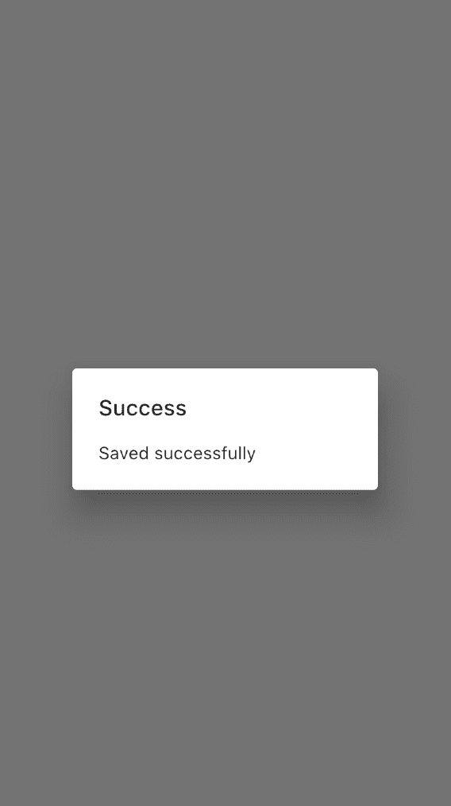

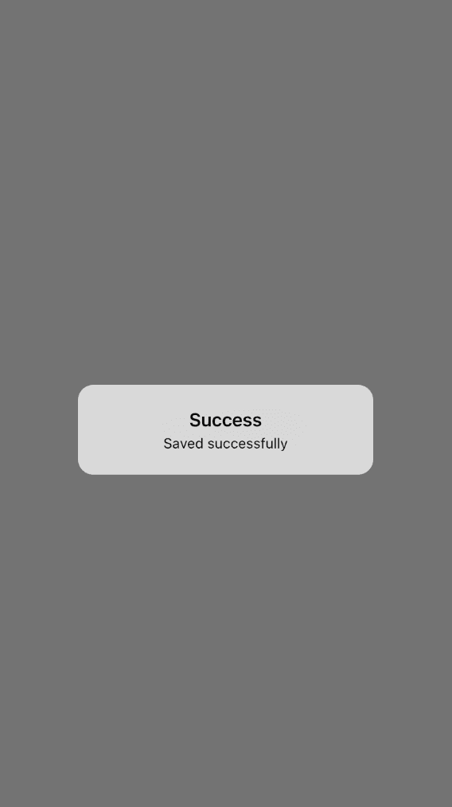

您可以根据需要通过设置`backgroundColor`和`titleTextStyle`属性来进一步定制对话框。但是这些属性在`CupertinoAlertDialog`小部件中不可用，只在`AlertDialog`小部件中可用。

默认`AlertDialog`的边界半径为 4。`shape`属性为您提供了根据需要定制该值的灵活性。但是`CupertinoAlertDialog`不允许用户定制这些属性，你必须坚持使用默认值:

```
AlertDialog(
  title: Text("Success"),
  titleTextStyle: TextStyle(fontWeight: FontWeight.bold,color: Colors.black,fontSize: 20),
  backgroundColor: Colors.greenAccent,
  shape: RoundedRectangleBorder(
    borderRadius: BorderRadius.all(Radius.circular(20))
  ),
  content: Text("Save successfully"),
)

```

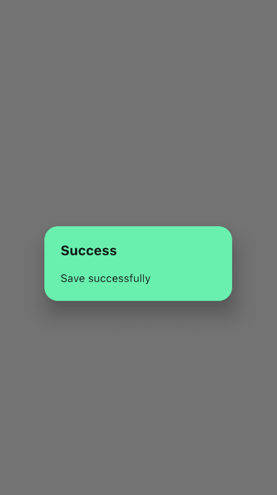

## 将动作按钮应用于对话框

`AlertDialog`小部件可以指定需要在对话框中显示的动作按钮。这些按钮将显示在对话框的底部。

您可以拥有的动作按钮数量没有限制。但是最好使用 1-3 个操作按钮来提供良好的用户体验和不那么杂乱的用户界面:

```

AlertDialog(
  title: Text("Success"),
  titleTextStyle: 
    TextStyle(
      fontWeight: FontWeight.bold,
      color: Colors.black,fontSize: 20),
    actionsOverflowButtonSpacing: 20,
    actions: [
      ElevatedButton(onPressed: (){
      }, child: Text("Back")),
      ElevatedButton(onPressed: (){
      }, child: Text("Next")),
    ],
    content: Text("Saved successfully"),
)

```

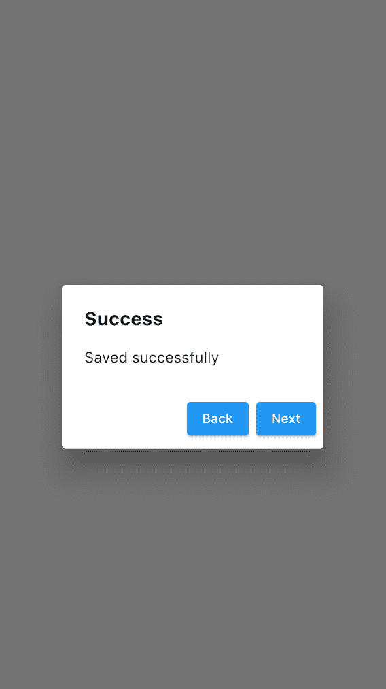

在`CupertinoAlertDialog`中，`CupertinoDialogAction`小部件必须在`actions`小部件数组中使用，而不是普通的按钮:

```
CupertinoAlertDialog(
  title: Text("Success"),
  actions: [
    CupertinoDialogAction(onPressed: (){
    }, child: Text("Back")),
    CupertinoDialogAction(onPressed: (){
    }, child: Text("Next")),
  ],
  content: Text("Saved successfully"),
)

```

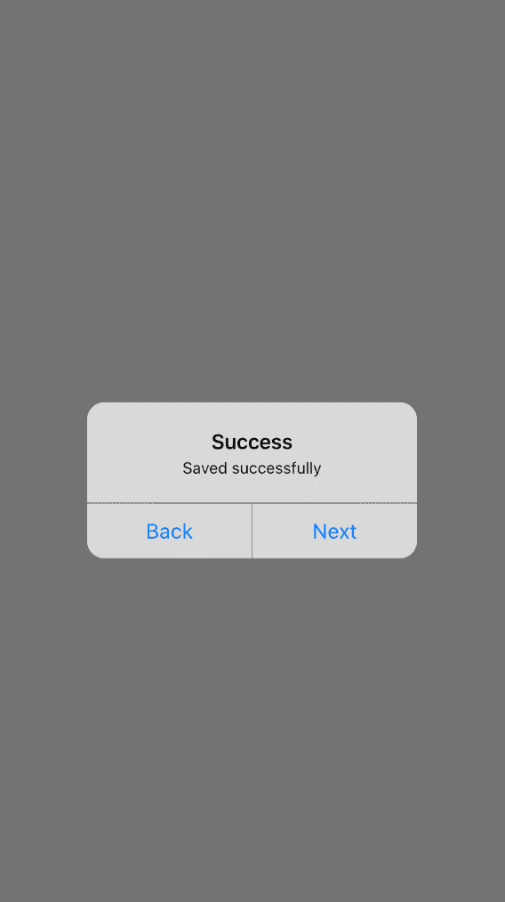

如果您的应用程序需要更多的动作按钮，您可以根据需要添加更多按钮。如果在一行中没有空间显示的话，它们将堆叠成一列。如果发生这种溢出，可以通过设置`actionsOverflowButtonSpacing`属性来控制按钮间距。

`actionsOverflowButtonSpacing`属性仅在`AlertDialog`小工具中可用，在`CupertinoAlertDialog`中不可用。在`CupertinoAlertDialog`中，通常每行最多显示两个按钮，如果有更多的动作按钮，这些按钮将垂直显示:

```
AlertDialog(
  title: Text("Success"),
  titleTextStyle: 
    TextStyle(fontWeight: FontWeight.bold,color: Colors.black,fontSize: 20),
  actionsOverflowButtonSpacing: 20,
  actions: [
    ElevatedButton(onPressed: (){

    }, child: Text("Back")),
    ElevatedButton(onPressed: (){

    }, child: Text("Next")),
    ElevatedButton(onPressed: (){

    }, child: Text("Next")),
    ElevatedButton(onPressed: (){

    }, child: Text("Next")),
    ElevatedButton(onPressed: (){

    }, child: Text("Next")),
    ElevatedButton(onPressed: (){

    }, child: Text("Next")),
  ],
  content: Text("Saved successfully"),
)

```

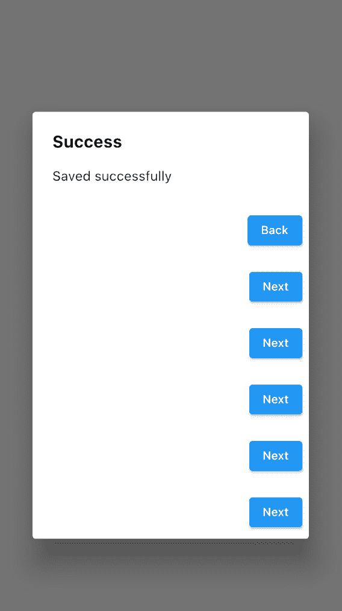

```
CupertinoAlertDialog(
  title: Text("Success"),

  actions: [
    CupertinoDialogAction(onPressed: (){

    }, child: Text("Back")),
    CupertinoDialogAction(onPressed: (){

    }, child: Text("Next")),
    CupertinoDialogAction(onPressed: (){

    }, child: Text("Next")),
    CupertinoDialogAction(onPressed: (){

    }, child: Text("Next")),
    CupertinoDialogAction(onPressed: (){

    }, child: Text("Next")),
    CupertinoDialogAction(onPressed: (){

    }, child: Text("Next")),
  ],
  content: Text("Saved successfully"),
)

```

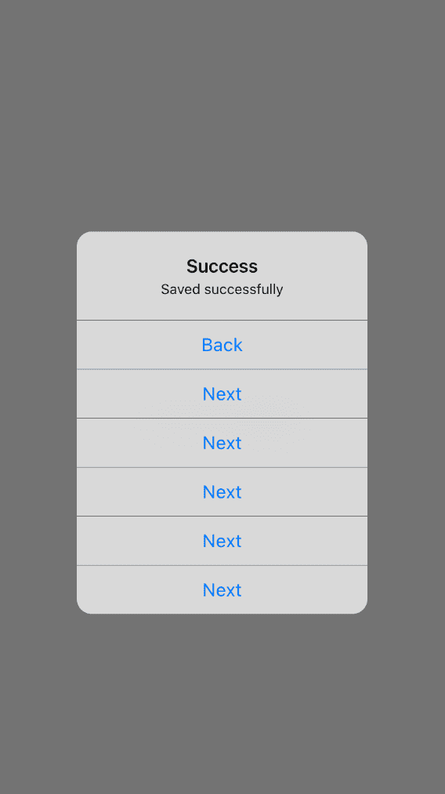

## 关闭和关闭对话框

您可以使用`Navigator`类在您按下按钮时移除对话框:

```
AlertDialog(
  title: Text("Success"),
  titleTextStyle: TextStyle(
    fontWeight: FontWeight.bold,color: Colors.black,fontSize: 20),
  actions: [
    ElevatedButton(onPressed: (){
    Navigator.of(context).pop();
    }, child: Text("Close")),
  ],
  content: Text("Saved successfully"),
)

```

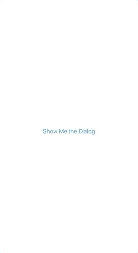

## 创建自定义对话框

`AlertDialog`小部件可能不适合你在应用中处理的每一个自定义场景。这时`Dialog`小部件就派上用场了。

尽管`AlertDialog`的 content 属性接受`widget`类型，但建议只添加一个简单的对话框消息，这意味着它不适合自定义对话框。

另一方面，`Dialog`小部件可以根据需要创建对话框的定制版本。我添加了一个`Container`来控制对话框高度，在`Container`里面有一个`Column`小部件来垂直布局多个小部件。您可以根据需要定制这些小部件:

```
Dialog(
  child: Container(
    height: 300,
    child: Column(
      mainAxisAlignment: MainAxisAlignment.spaceBetween,
      children: [
        FlutterLogo(size: 150,),
        Text("This is a Custom Dialog",style:TextStyle(fontSize: 20),),
        ElevatedButton(

        onPressed: (){
        Navigator.of(context).pop();
          }, child: Text("Close"))
      ],
    ),
  ),
)

```

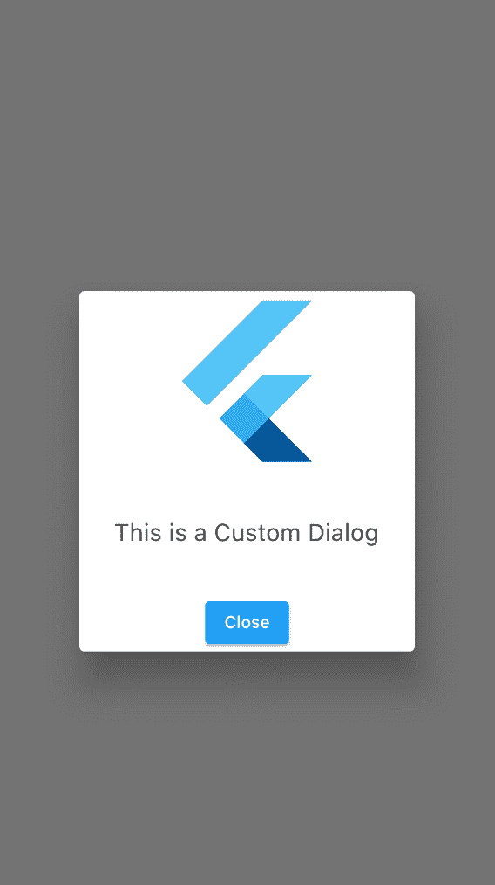

如果你想改变对话框的形状，你可以为`shape`属性设置`ShapeBorder`，如下例所示。这里我使用了一个`RoundedRectangleBorder`小部件来改变对话框的边框半径:

```
Dialog(
  shape: RoundedRectangleBorder(
    borderRadius:BorderRadius.circular(30.0)),
  child: Container(
    height: 300,
    child: Column(
      mainAxisAlignment: MainAxisAlignment.spaceBetween,
      children: [
        FlutterLogo(size: 150,),
        Text("This is a Custom Dialog",style:TextStyle(fontSize: 20),),
        ElevatedButton(

        onPressed: (){
        Navigator.of(context).pop();
          }, child: Text("Close"))
      ],
    ),
  ),
) 

```

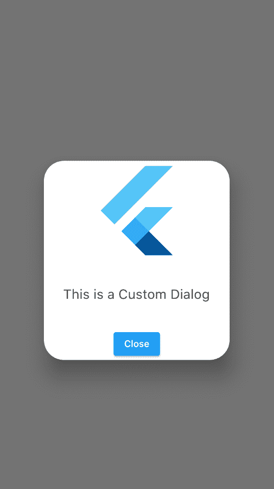

对话框的默认高度为 24。Elevation 是对话框的 *z* 坐标，可以通过设置对话框的`elevation`属性来改变。如果你设置仰角为 0，你可以看到没有阴影，它显示的对话框和视图在同一个表面上。

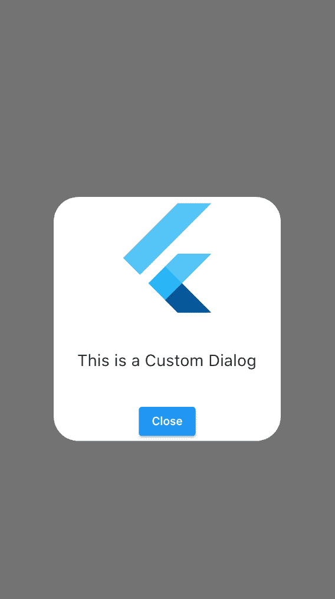

对于`AlertDialog`，可以通过改变`Dialog`控件的`backgroundColor`属性来设置对话框背景颜色:

```
Dialog(
  elevation: 0,
  backgroundColor: Colors.limeAccent,
  shape: RoundedRectangleBorder(
    borderRadius: BorderRadius.circular(30.0)),
  child: Container(
    height: 300,
    child: Column(
      mainAxisAlignment: MainAxisAlignment.spaceBetween,
      children: [
        FlutterLogo( size: 150,),
        Text(
          "This is a Custom Dialog",
          style: TextStyle(fontSize: 20),
        ),
        ElevatedButton(
          onPressed: () {
            Navigator.of(context).pop();
          },
          child: Text("Close"))
       ],
    ),
  ),
)

```

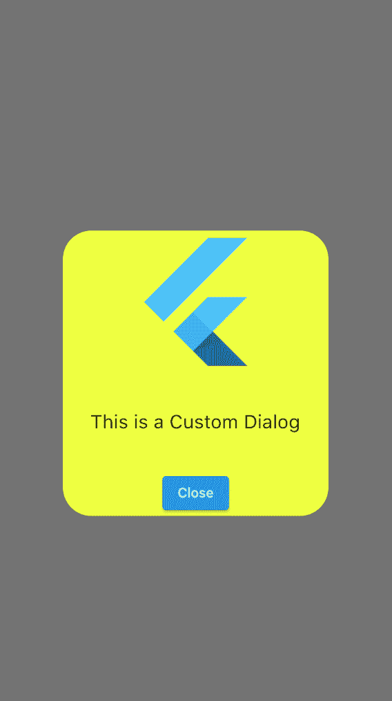

## 创建全屏对话框

创建全屏对话框不能通过`showDialog`方法来完成。相反，使用`showGeneralDialog`方法。

在`pageBuilder`中，你应该指定你的对话框[小部件实现](https://blog.logrocket.com/widgets-the-building-blocks-of-flutter-apps/)。作为第一个小部件，您可以指定`SizedBox.expand`小部件，它将您的正常对话框转换为全屏对话框。

除了`pageBuilder`属性之外，您还可以通过`transitionDuration`属性来控制对话框动画的持续时间，以提供漂亮流畅的动画:

```
showGeneralDialog(
  context: context,
  transitionDuration: Duration(milliseconds: 400),
  pageBuilder: (bc, ania, anis) {
    return SizedBox.expand(
      child: Container(
        color: Colors.black,
        child: Padding(
          padding: const EdgeInsets.all(20.0),
          child: Column(
            mainAxisAlignment: MainAxisAlignment.spaceBetween,
            children: [
              FlutterLogo(
               size: 200,
              ),
              Text(
                "This is a Full Screen Dialog",
                style: TextStyle(
                fontSize: 20,
                decoration: TextDecoration.none),
              ),
              ElevatedButton(
                onPressed: () {
                  Navigator.of(context).pop();
                },
              child: Text("Close"))
            ],
          ),
        ),
      ),
    );
})

```


## 结论

应用警告对话框、自定义对话框或全屏对话框将完全取决于您的应用程序和应用程序的不同用例。

警告对话框更适合给用户快速简单的警告，如成功消息或信息警告。自定义对话框可以用在需要更多个性化对话框的地方。如果你想给用户一种全新屏幕的感觉，而不是实际导航到一个全新的屏幕，可以使用全屏对话框。

在这些对话框中，自定义对话框将是最有用的，因为你可以给每个对话框添加你自己的个人风格，让它看起来又好又酷，同时保持你的应用程序的主题。

## 使用 [LogRocket](https://lp.logrocket.com/blg/signup) 消除传统错误报告的干扰

[](https://lp.logrocket.com/blg/signup)

[LogRocket](https://lp.logrocket.com/blg/signup) 是一个数字体验分析解决方案，它可以保护您免受数百个假阳性错误警报的影响，只针对几个真正重要的项目。LogRocket 会告诉您应用程序中实际影响用户的最具影响力的 bug 和 UX 问题。

然后，使用具有深层技术遥测的会话重放来确切地查看用户看到了什么以及是什么导致了问题，就像你在他们身后看一样。

LogRocket 自动聚合客户端错误、JS 异常、前端性能指标和用户交互。然后 LogRocket 使用机器学习来告诉你哪些问题正在影响大多数用户，并提供你需要修复它的上下文。

关注重要的 bug—[今天就试试 LogRocket】。](https://lp.logrocket.com/blg/signup-issue-free)