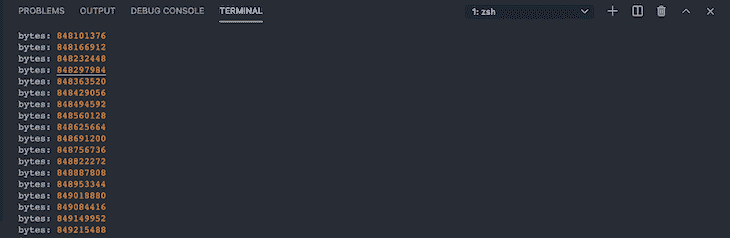

# 在 Node.js - LogRocket 博客中创建双工流

> 原文：<https://blog.logrocket.com/creating-duplex-streams-nodejs/>

双工流是 Node.js 中流的一个基本类别。然而，它们经常被误解，包括双工流。

这种类型的流是混合的，这意味着它在实现时需要一个`read`和`write`方法。

在本文中，我们将回顾双工流以及如何创建双工流。但在此之前，让我们重新认识一下什么是流。

对于这篇文章，JavaScript 和 Node.js 的知识会有所帮助，但不是必需的。

## 什么是溪流？

流是从一个源收集的数据，并按顺序传送到另一个位置。在线视频流就是一个例子:虽然视频内容是按顺序传递给你的，但完整的内容还不可用。

流分为四类:可写、可读、双工和转换。

可读流从文件或源中读取数据，并将其传递给主应用程序。[缓冲器然后存储数据](https://blog.logrocket.com/node-js-buffer-a-complete-guide/)，以防在将数据传递给应用程序时出现延迟。

当可写流时，功能是相反的。数据从应用程序读取到文件中。如果数据传输变慢，还有一个缓冲区，然后存储在那里。

另一方面，双工流是可读和可写流的混合，这两种流相互独立。

转换流也类似于双工，但是可读和可写的流是相连的。

该连接使应用程序能够将数据写入应用程序，但是在将数据传递到可读流之前，必须对数据进行操作。

## 双工流示例

正如我们前面解释的，双工流基本上是可读和可写流的混合。

双工流的一个例子是[套接字](http://nodejs.org/api/net.html#net_class_net_socket)，它提供两个通道来发送和接收数据。

双工流的其他示例有:

## 创建自定义双工流以延迟区块数据

要在 Node.js 中创建双工流，请开始从流模块导入所需的方法:

```
const { PassThrough } = require('stream')
const tunnel = new PassThrough()

```

`PassThrough`流是一种基本类型的双工流，它充当一个隧道，将我们的可读流传输到可写流。

因此，通过这个隧道，我们可以检查对可写流的数据处理。

接下来，让我们使用可读流读取一个文件，并使用`writeStream`将它写入可写流:

```
const { PassThrough } = require("stream");
const { createReadStream, createWriteStream } = require("fs"); 
const readStream = createReadStream("./README.md"); // read data from this file
const writeStream = createWriteStream("./copy.txt"); // write data to this file

```

接下来，我们可以检查缓冲区中有什么，以查看数据是否正在隧道中传递:

```
const { PassThrough } = require("stream");
const { createReadStream, createWriteStream } = require("fs");
const readStream = createReadStream("./README.md");
const writeStream = createWriteStream("./copy.txt");

const tunnel = new PassThrough();

tunnel.on("data", (chunk) => {
  console.log("bytes:", chunk); // bytes: <Buffer 23 20 4a 61 76 61 53 63 72 69 70 74 20 41 6c 67 6f 72 69 74 68 6d 73 20 61 6e 64 20 44 61 74 61 20 53 74 72 75 63 74 75 72 65 73 0a 0a 54 68 69 73 20 ... 1767 more bytes>
});

readStream.pipe(tunnel).pipe(writeStream);

```

除了`PassThrough`，我们还有`Throttle`来延迟数据在管道中从一个源传递到另一个源的时间。我们可以使用双工流来设置数据进入应用程序的延迟时间:

```
const { PassThrough, Duplex } = require("stream");
const { createReadStream, createWriteStream } = require("fs");
const readStream = createReadStream("./movie.mp4");
const writeStream = createWriteStream("./copy.mp4");

class Throttle extends Duplex {
  /*
   * Class constructor will receive the injections as parameters.
   */
  constructor(time) {
    super();
    this.delay = time;
  }
  _read() {}

  // Writes the data, push and set the delay/timeout
  _write(chunk, encoding, callback) {
    this.push(chunk);
    setTimeout(callback, this.delay);
  }

  // When all the data is done passing, it stops.
  _final() {
    this.push(null);
  }
}

const tunnel = new PassThrough();
const throttle = new Throttle(500);

let amount = 0;
tunnel.on("data", (chunk) => {
  amount += chunk.length;
  console.log("bytes:", amount);
});

readStream.pipe(throttle).pipe(tunnel).pipe(writeStream);

```

使用上面的代码，我们创建了一个双工流，它为我们的管道数据创建了`throttle(delay)`。这设置了 500 毫秒的延迟，`Throttle`类中的方法推送数据块。

`_final()`方法只在数据传输完成时推送 null。

我们还修改了我们的`PassThrough`流，增加了它读取的每个块的长度。

这是以 500 毫秒为增量在终端中呈现响应的方式:



## 结论

通过在 Node.js 中使用双工流，我们看到了如何延迟从一个流到另一个流的数据传递。

双工流在我们的数字世界中非常重要，并且大部分时间都在不知不觉中被使用，尤其是在 Socket 中。这些功能非常强大，因为它们同时实现了可读和可写的流。

## 200 只显示器出现故障，生产中网络请求缓慢

部署基于节点的 web 应用程序或网站是容易的部分。确保您的节点实例继续为您的应用程序提供资源是事情变得更加困难的地方。如果您对确保对后端或第三方服务的请求成功感兴趣，

[try LogRocket](https://lp.logrocket.com/blg/node-signup)

.

[](https://lp.logrocket.com/blg/node-signup)[https://logrocket.com/signup/](https://lp.logrocket.com/blg/node-signup)

LogRocket 就像是网络和移动应用程序的 DVR，记录下用户与你的应用程序交互时发生的一切。您可以汇总并报告有问题的网络请求，以快速了解根本原因，而不是猜测问题发生的原因。

LogRocket 检测您的应用程序以记录基线性能计时，如页面加载时间、到达第一个字节的时间、慢速网络请求，还记录 Redux、NgRx 和 Vuex 操作/状态。

[Start monitoring for free](https://lp.logrocket.com/blg/node-signup)

.